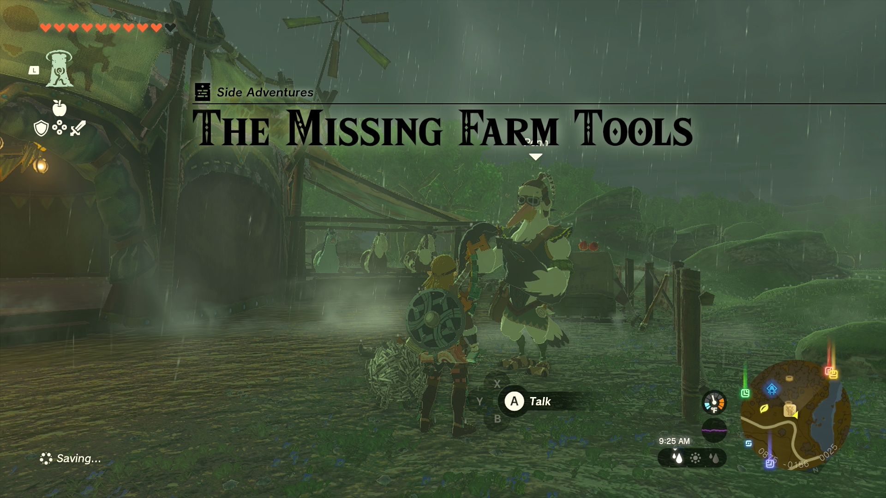
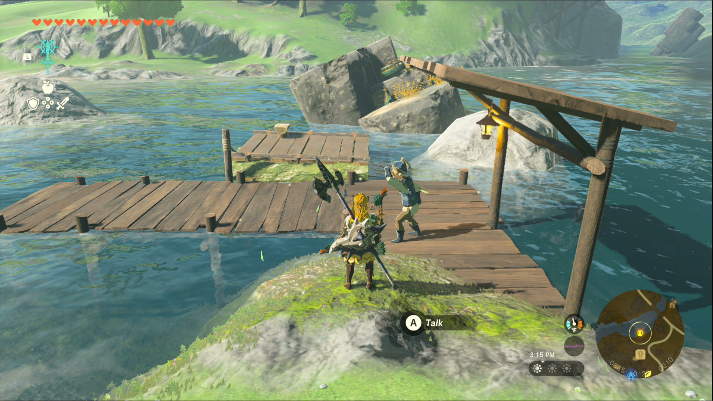
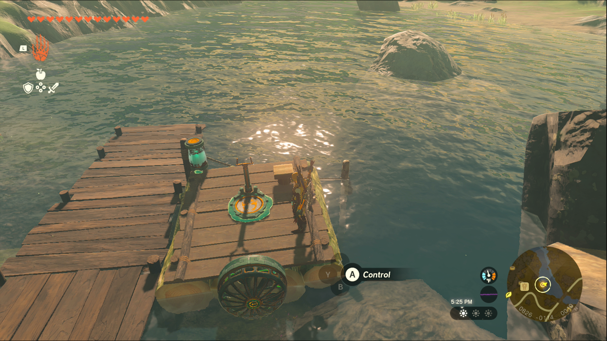
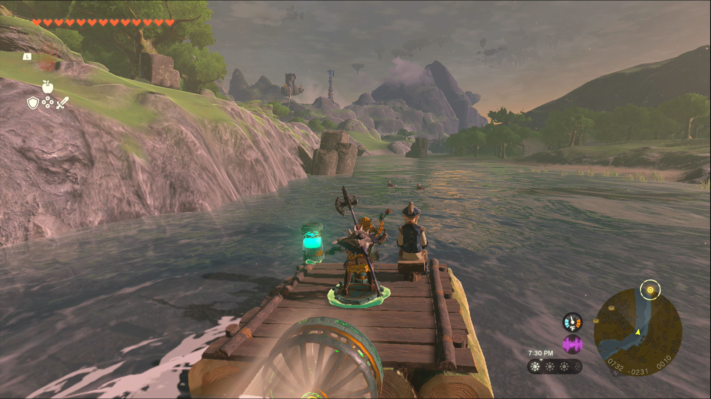

The Missing Farm Tools is a Side Adventure in The Legend of Zelda: Tears of the Kingdom in which you investigate a mysterious report regarding Zelda. Side Adventures are usually longer side quests that often tell a story. 

  * **Quest Giver:** Penn
  * **Prerequisites** : Begin the Potential Princess Sighting! questline at the Lucky Clover Gazette
  * **Reward:** Rupees

To start the Side Adventure “The Missing Farm Tools” you first need to accept the Side Adventure “Potential Princess Sightings!” at the Lucky Clover Gazette, located just outside of Rito Village in the Hebra Region. Then head to the Wetlands Stable, located between the Lanayru Wetlands and Hyrule Field, and speak to Penn, the pelican-like Rito, to learn of a report that Zelda borrowed the stable’s farm tools and never returned them. 

To start you need to speak with Izra, who mans the stable’s raft just northwest of the stable; selecting this as your main quest will mark him on your map. He wants to head down the river to where Zelda said she was going, but he needs you to pilot the raft so he doesn’t run into the ruins. Luckily there are some devices nearby on the rocks that you can use to make the raft suitable for maneuvering downriver. 

This is the raft setup we used for the quest, but if you have extra parts or just want to get creative with it, feel free to experiment. When you’re ready, speak to Izra and offer to take him down the river, then cut the rope like he suggests. 

The river moves fairly slowly, so get a feel for the handling, and follow the river down to Floret Sandbar, where the map is highlighted. While you’re provided with a battery, you may still run out of energy before you reach your destination. Since the raft is perfectly capable of floating without power you can let it just drift downriver while your energy recharges. Once you get close enough to the dock on the sandbar, you’ll automatically make landfall with Izra. 

After a conversation scene and a misunderstanding, your work here is done. Be sure to look around the garden to spot a variety of materials you can harvest, including different types of Safflina, and Silent Princess! 

_This reward depends on how far along you are in the Potential Princess Sightings! Side Adventure._

The Missing Farm Tools

## List of Potential Princess Sighting Side Adventures

Looking for other Potential Princess Sightings to undertake? You can take on the following adventures in any order you choose, which are located at nearly every main Stable in Hyrule. Click on a link below to learn more about it, and how to solve the quest. 

Side Adventure Name  
Starting Settlement / Region

Serenade to a Great Fairy  
Woodland Stable, Eldin Canyon

The Beckoning Woman  
Outskirt Stable, Central Hyrule

Gourmets Gone Missing  
Riverside Stable, Central Hyrule

The Beast and the Princess  
New Serenne Stable, Hyrule Ridge

Zelda's Golden Horse  
Snowfield Stable, Tabantha Tundra

White Goats Gone Missing  
Tabantha Bridge Stable, Hyrule Ridge

For Our Princess!  
Foothill Stable, Eldin

The All-Clucking Cucco  
South Akkala Stable, Akkala

The Missing Farm Tools  
Wetlands Stable, West Necluda

Princess Zelda Kidnapped?!  
Dueling Peaks Stable, West Necluda

An Eerie Voice  
Highland Stable, Faron

The Blocked Well  
Gerudo Canyon Stable, Gerudo

See the complete List of Side Quests and Side Adventures

### Up Next: Princess Zelda Kidnapped?!

Previous

The All-Clucking Cucco

Next

Princess Zelda Kidnapped?!

### Top Guide Sections

  * Walkthrough
  * Zelda: Tears of The Kingdom Switch 2 Edition Guide
  * Zelda Notes Voice Memories
  * List of Side Quests and Side Adventures

### Was this guide helpful?

Leave feedback

Go to comments