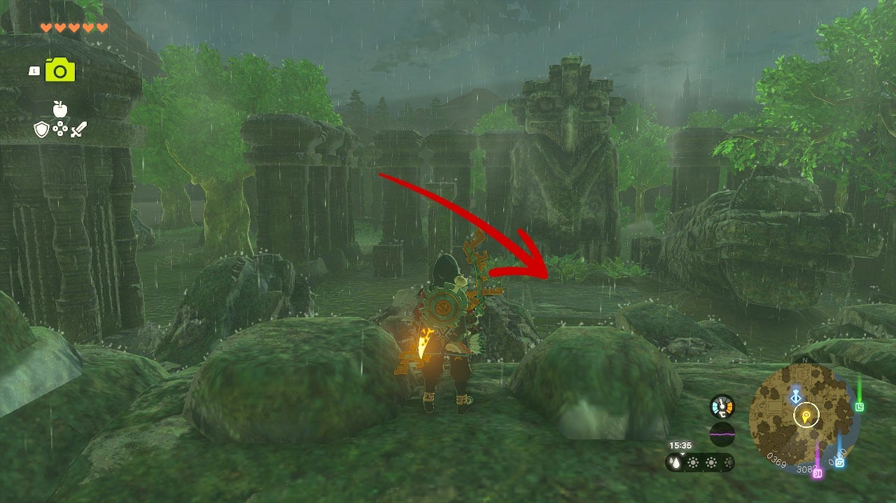

This Tears of the Kingdom side adventure is part of the Investigate the Thyphlo Ruins questline, which takes place in the northern part of the Great Hyrule Forest. You need to use a mysterious power to complete it. 

Here's how to solve the riddle in **The Owl Protected by Dragons**. 

## The Owl Protected by Dragons Walkthrough

Read the first monolith during the Investigate the Thyphlo Ruins quest to get started. The monolith asks you to "display the power of the Sage of Wind to the owl protected by many dragons". This simply means that you need to use **Tulin's power** in the right location. 

Starting from the monolith, climb the wall to the south, and you'll see a massive statue of an owl directly behind it. Drop down and use Tulin's Gust (Sage of Wind power) in front of this statue, while standing on the stone slab (coordinates 0365, 3060, 0174). A small building with a treasure chest will appear, containing **three Sapphires**. This completes The Owl Protected by Dragons side adventure. 

The Owl Protected by Dragons

See the complete List of Side Quests and Side Adventures

### Up Next: The Corridor between Two Dragons

Previous

Investigate the Thyphlo Ruins

Next

The Corridor between Two Dragons

### Top Guide Sections

  * Walkthrough
  * Zelda: Tears of The Kingdom Switch 2 Edition Guide
  * Zelda Notes Voice Memories
  * List of Side Quests and Side Adventures

### Was this guide helpful?

Leave feedback

Go to comments