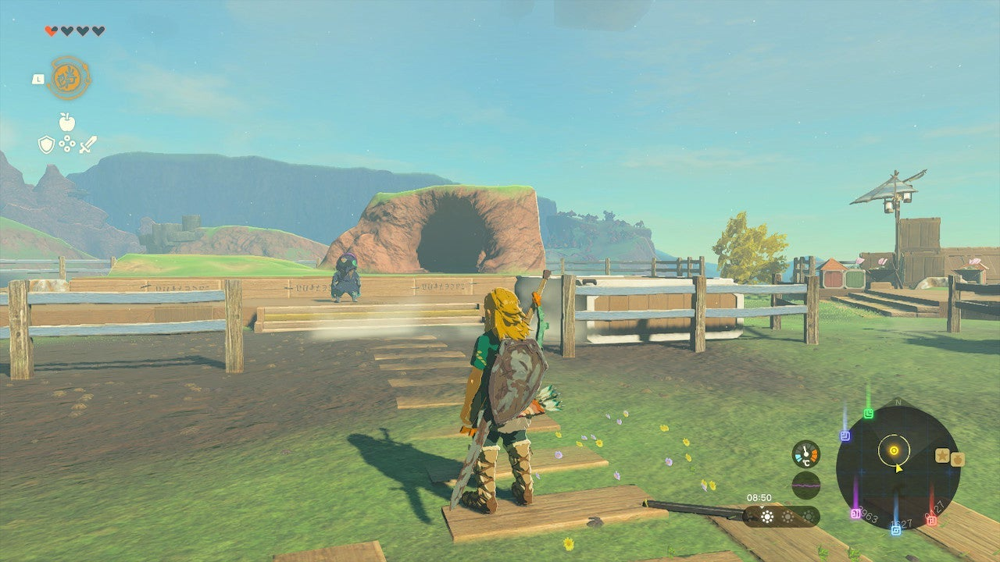
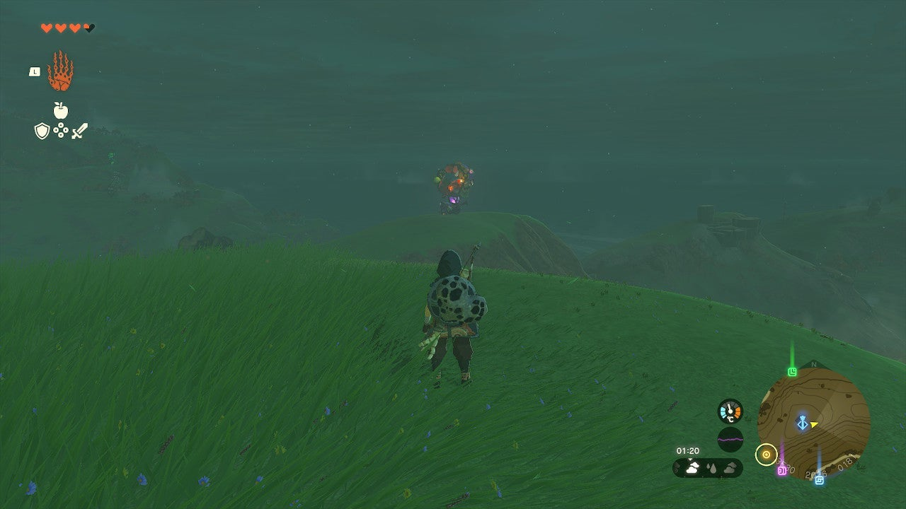

The Search for Koltin is a Tears of the Kingdom side adventure that follows The Hunt for Bubbul Gems! Completing this quest will unlock Koltin's Bubbul Gem shop. 

Here's a full walkthrough for **The Search for Koltin**. 

## The Search for Koltin Walkthrough

After starting The Search for Koltin, head to **Tarrey Town** in Akkala; the peninsula on the eastern part of the map, in the middle of Lake Akkala. You'll find Kilton in the northern part of the town, standing on a wooden stage. Speak to him, and **he'll ask you to search for Koltin** , who sometimes appears northwest of Tarrey Town at night. 

  
In other words, wait until nightfall and go to the mainland in the northwest. Koltin's colorful balloon should appear just **east of the Ulri Mountain Skyview Tower**. As long as you're in the area at the right time, you can't really miss him. 

You only need to speak with Koltin to complete The Search for Koltin side adventure. For more information on Koltin's shop and how to find Bubbul gems, the shop's currency, be sure to check our Tears of the Kingdom Bubbul Gem guide! 

The Search for Koltin

See the complete List of Side Quests and Side Adventures

### Up Next: A Monstrous Collection I

Previous

The Hunt for Bubbul Gems!

Next

A Monstrous Collection I

### Top Guide Sections

  * Walkthrough
  * Zelda: Tears of The Kingdom Switch 2 Edition Guide
  * Zelda Notes Voice Memories
  * List of Side Quests and Side Adventures

### Was this guide helpful?

Leave feedback

Go to comments