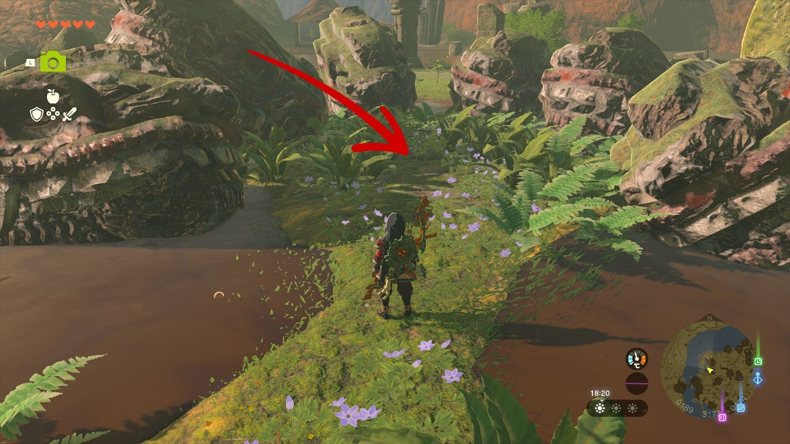

The Six Dragons side adventure is part of the Investigate the Thyphlo Ruins questline. Beware that you need to have completed the full Sidon of the Zora Regional Phenomena questline, or you won't be able to use Sidon's power. 

Here's how to complete **The Six Dragons** in The Legend of Zelda: Tears of the Kingdom. 

## The Six Dragons

To start The Six Dragons, read the third monolith at Kazul's camp. It reads "display the power of the Sage of Water in the presence of the six dragons". To find the six dragons, go to the **northwestern corner** of the Thyphlo Ruins, where you'll find a small puddle and six dragon heads lying on the ground. 

Stand in the middle of the circle of dragon heads at coordinates 0184, 3181, 0174, and use Sidon's attack (fully charge the attack before you let go). A small stone building with a treasure chest will appear, containing **five Opals**. 

Collect the treasure to complete The Six Dragons side adventure. 

The Six Dragons

See the complete List of Side Quests and Side Adventures

### Up Next: The Long Dragon

Previous

The Corridor between Two Dragons

Next

The Long Dragon

### Top Guide Sections

  * Walkthrough
  * Zelda: Tears of The Kingdom Switch 2 Edition Guide
  * Zelda Notes Voice Memories
  * List of Side Quests and Side Adventures

### Was this guide helpful?

Leave feedback

### In This Guide

The Legend of Zelda: Tears of the KingdomNintendo EPD

Initial Release: May 12, 2023

Learn more

Go to comments