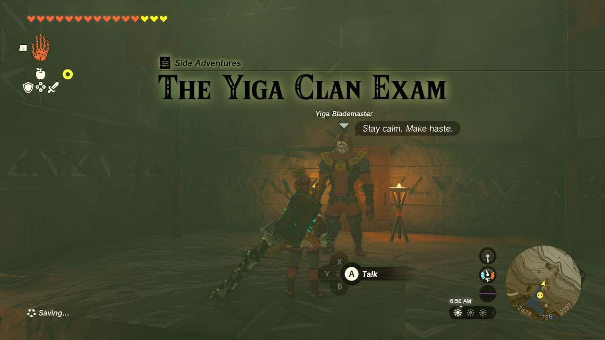
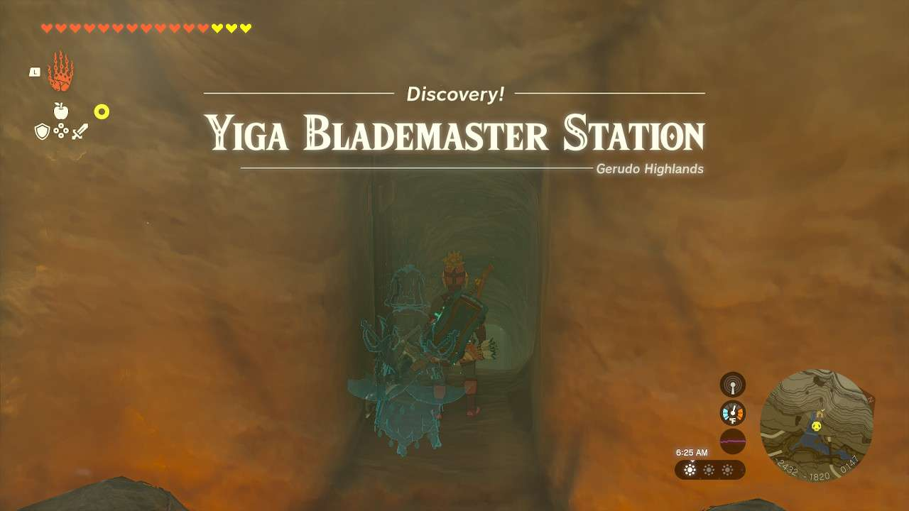
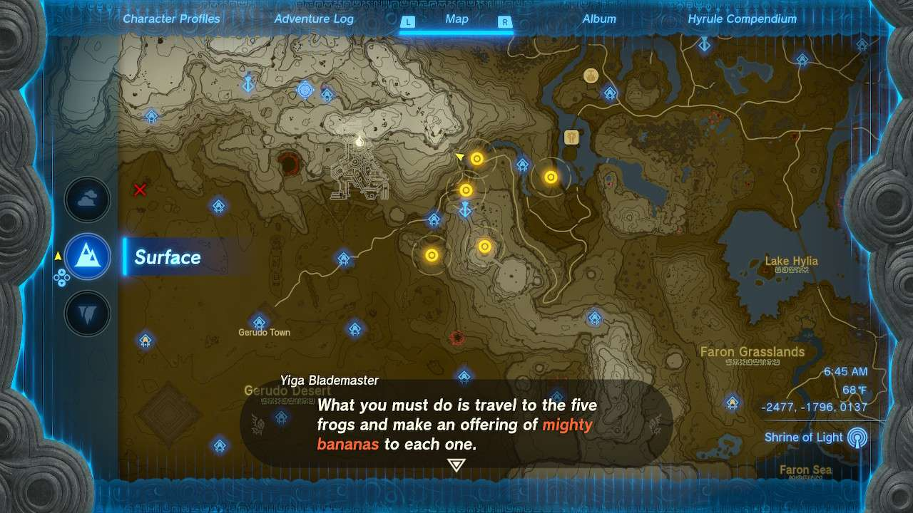
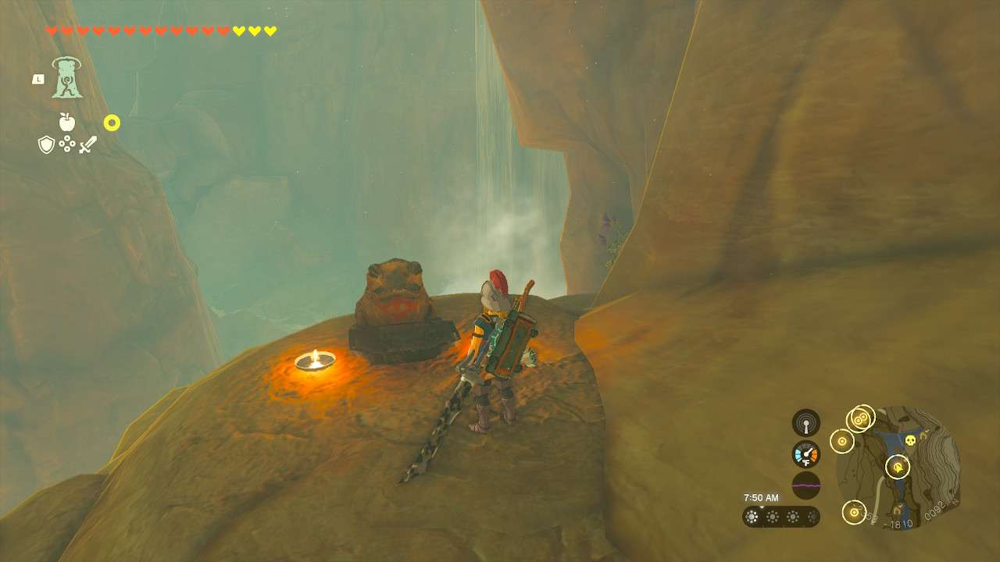
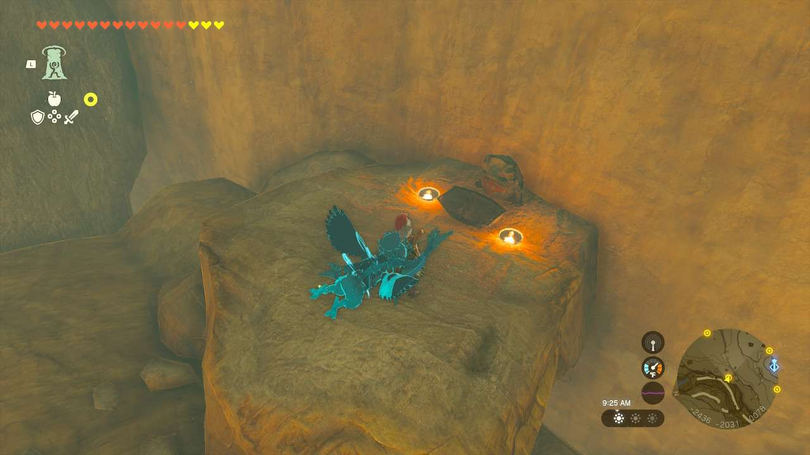
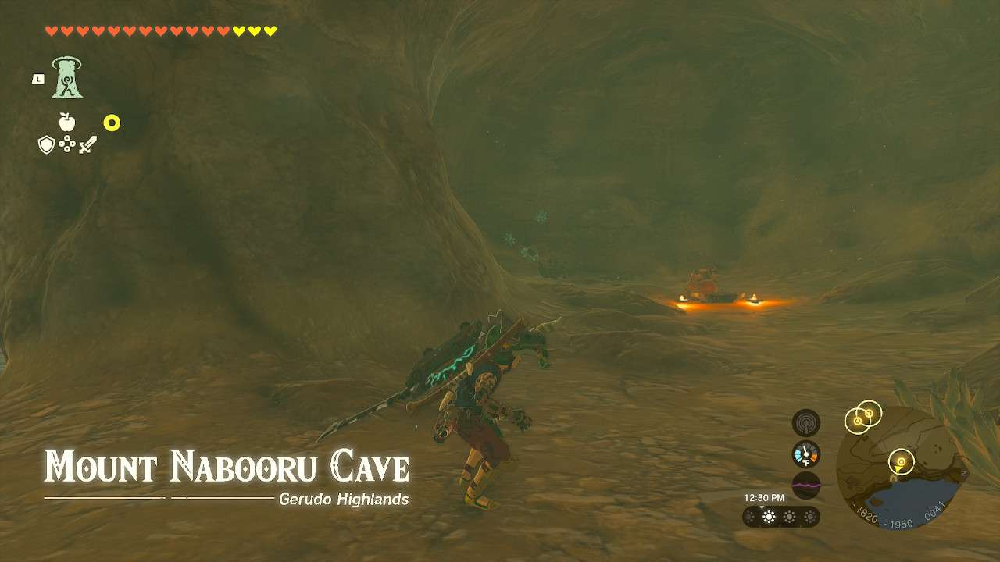
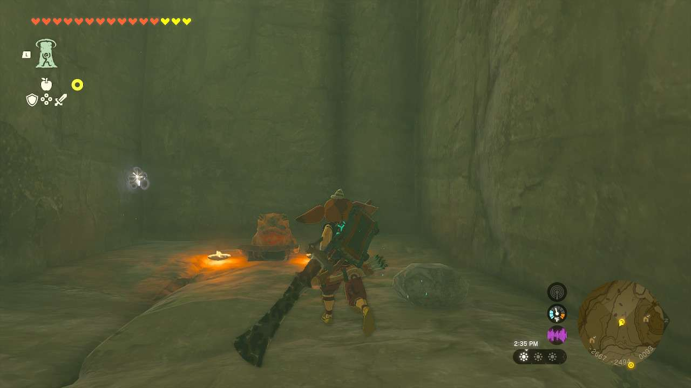
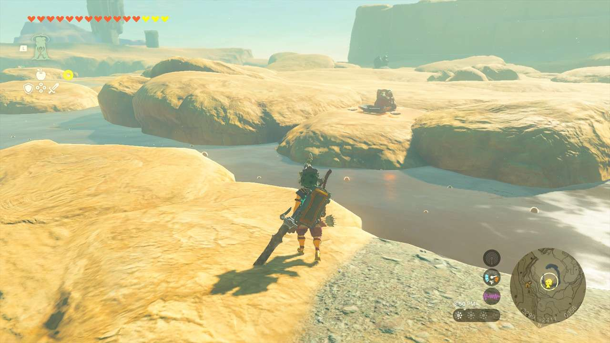
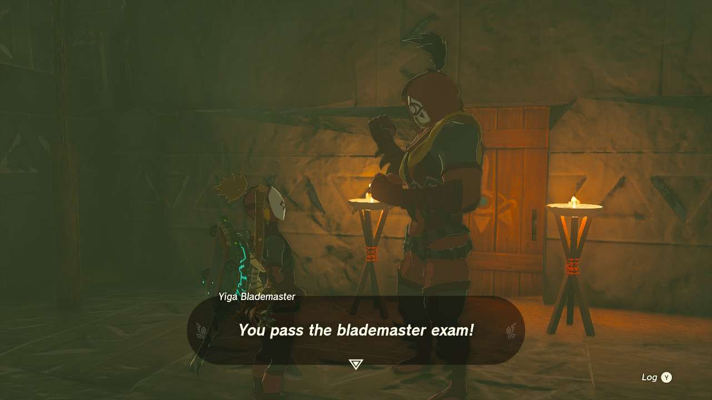

**The Yiga Clan Exam** is one of the many Side Adventures to complete in The Legend of Zelda: Tears of the Kingdom. In this guide, we will teach you everything you need to know to complete The Yiga Clan Exam, including where to find it and what you will get as a reward. 

  * **Side Quest Location** : Yiga Blademaster Station, Taafei Hill, Gerudo Highlands
  * **Prerequisites** : Gaining entry to the Yiga Clan Hideout after finishing Infiltrating the Yiga Clan
  * **Rewards** : Ruby, Eightfold Longblade (Untarnished)

This quest can only be started after finishing Infiltrating the Yiga Clan and wearing the full Yiga Armor suit. Head to the **Yiga Blademaster Station** , which is near Taafei Hill Cave at the base of Taafei Hill and the river that runs around Koukot Plateau. Just behind the waterfall along a tunnel is the entrance, **but you can’t get in without the full Yiga Armor**. 

Once inside, speak to the **Yiga Blademaster** , who will tell you of the five frog statues you have to give offerings to to become a Blademaster. He’ll also give you **Mighty Bananas x5** to help you out. Luckily, all five statues are marked on your map. 

The first is on a cliff under the bridge just outside the Yiga Blademaster Station. 

  * Coordinates: -2351, -1811, 0092

Frog Statue #1 

The second is under the walkway in the canyon directly beneath the area of the Yiga Blademaster Station 

  * Coordinates: -2434, -2032, 0078

Frog Statue #2 

The third is inside **Mount Nabooru Cave** , inside an alcove with a ramp close to the eastern entrance. 

  * Coordinates: -1835, -1943, 0041

Frog Statue #3 

The fourth is inside **Gerudo Canyon Mine** , above the room with the Bokoblins patrolling the ground floor. At the end of the cliff that doesn’t have a Like Like at the end is the statue. 

  * Coordinates: -2671, -2496, 0093

Frog Statue #4 

The fifth statue is in the bog on the westernmost peak of **Spectacle Rock** , not too far away from the Gerudo Canyon Skyview Tower. 

  * Coordinates: -2299, -2422, 0357

Frog Statue #5 

Once you hit all five, head back to the Blademaster and they’ll let you into the inner chamber. Inside this room are chests with your rewards - a **Ruby** and an **untarnished Eightfold Longblade**. Also inside here is the **Suriwak Shrine**. 

The Yiga Clan Exam

See the complete List of Side Quests and Side Adventures

### Up Next: Master Kohga of the Yiga Clan

Previous

Infiltrating the Yiga Clan

Next

Master Kohga of the Yiga Clan

### Top Guide Sections

  * Walkthrough
  * Zelda: Tears of The Kingdom Switch 2 Edition Guide
  * Zelda Notes Voice Memories
  * List of Side Quests and Side Adventures

### Was this guide helpful?

Leave feedback

Go to comments