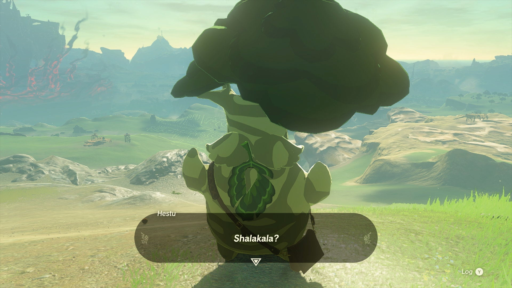
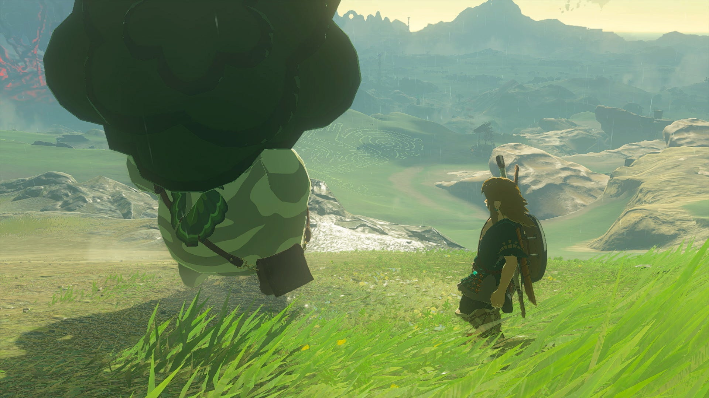
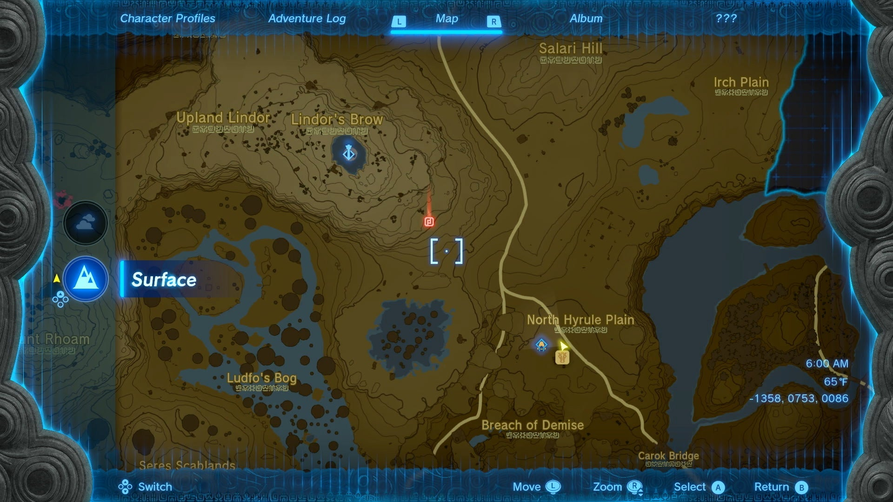
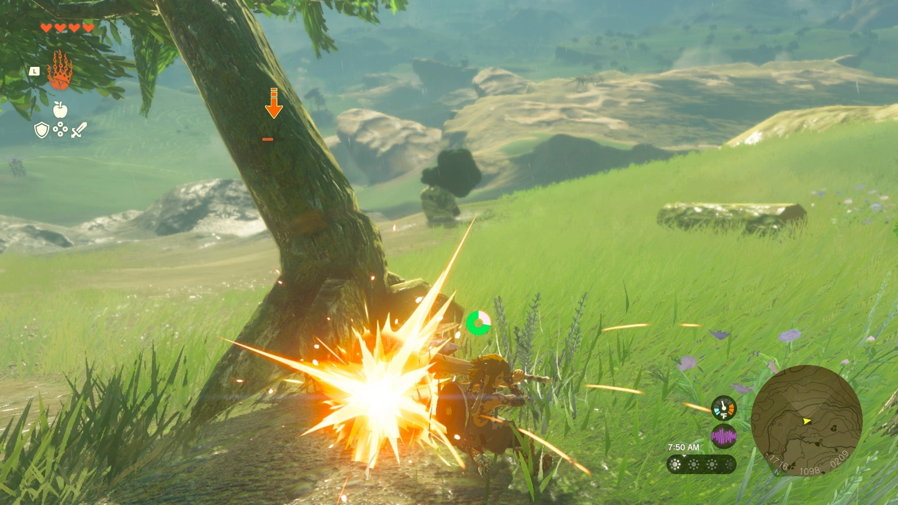
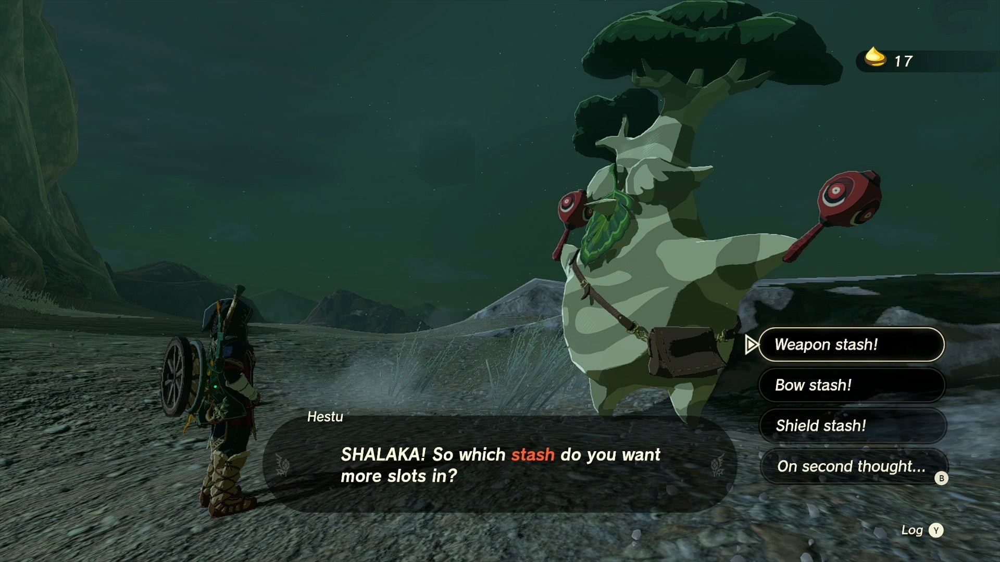
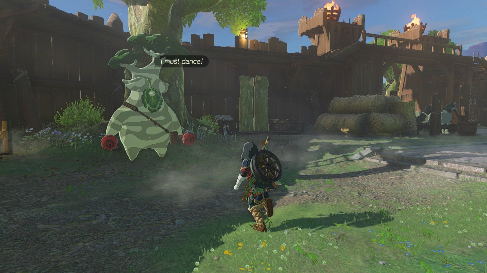

An important returning feature in The Legend of Zelda: Tears of the Kingdom is the limit to your inventory - including melee weapons, bows, and shields. The only way to increase your inventory in Breath of the Wild was by **finding collectible****Korok Seeds****and giving them to a character named Hestu** — and Tears of the Kingdom is no different. The helpful musician is back with a brand new song and dance, but he's otherwise thankfully unchanged. Here's where to find Hestu in TotK so you can upgrade your inventory and complete the Hestu's Concerns Side Adventure. 

Go To Map

Hyrule Map

If you need a quick visual aid, map, and/or a way to keep track of where Hestu has moved in your game, you can check out the Hestu filter on our interactive map of Hyrule!

Odds are you may have stumbled across a Korok as early as the Great Sky Island, as **they can be found hiding in numerous spots** : under rocks, by sparkling leaf trails, or they may ask you to help move them to a friend. Finding or helping each one will reward you with a Korok Seed (or 2 if you help the ones that need moving). Once you’ve collected a few, you’ll need to find someone who can make use of them. 

And where there’s Korok Seeds, there’s a big old tree fairy named Hestu who needs them to fill his magical maracas. Luckily, he’s once again located **not too far away from where your adventure will begin on the surface of Hyrule.**

##  How to Find Hestu's First Location

IMPORTANT: If you have already completed any Temple, this will NOT be Hestu's first location in your game. Instead he will appear in his second location, below, in **Lookout Landing**. 

Once you are told to investigate regional phenomena in the four corners of the land, you’ll more than likely be guided towards Rito Village past the Hyrule Ridge to the northwest. 

Taking the **main road west from the Lookout Landing** should put you towards **New Serenne Stable** , a major location in the Hyrule Ridge, that will also point you towards the Lindor’s Brow Skyview Tower in the distance. By**trekking up the hill from the stable towards the tower** , you should spot the oversized Korok being menaced by a pair of angry trees. 

Defeat them, and you’ll be able to start trading in Korok Seeds in exchange for expanding your weapon, bow, and shield inventory — which is just as important in Tears of the Kingdom as it was in the previous game. 

## Hestu's Second Location

Just like last time however, you’ll only be able to give him a few Korok Seeds before he runs off, but luckily his next appearance won’t be far away. Hestu talks about traveling East to where lots of people are, and you’ve actually already been there: **Lookout Landing**! 

Once you return to the main base in Central Hyrule, you can find him off in a corner just past the merchant stall by a large tree on the southeast corner of the fort. Continuing where you left off, you can trade in many more Korok Seeds you find to expand your inventory. Just remember while he’ll start off only needing 1, then 2, and 3 seeds to keep expanding each section, the amount will begin to drastically increase over time. 

Hestu will continue to stay at Lookout Landing for quite some time, and only seems ready to travel once more after you’ve found a way into the Korok Forest, though it seems he’ll only show up after you’ve successfully gained entry, and not before. 

Don't miss these important and helpful guides: 

  * Tears of the Kingdom Walkthrough
  * Skyview Towers Locations and Guide
  * Shrine Locations and Guide
  * How to Find and Unlock Great Fairy Fountains

### Up Next: Great Sky Island Korok Seeds

Previous

Korok Seed Locations

Next

Great Sky Island Korok Seeds

### Top Guide Sections

  * Walkthrough
  * Zelda: Tears of The Kingdom Switch 2 Edition Guide
  * Zelda Notes Voice Memories
  * List of Side Quests and Side Adventures

### Was this guide helpful?

Leave feedback

Go to comments