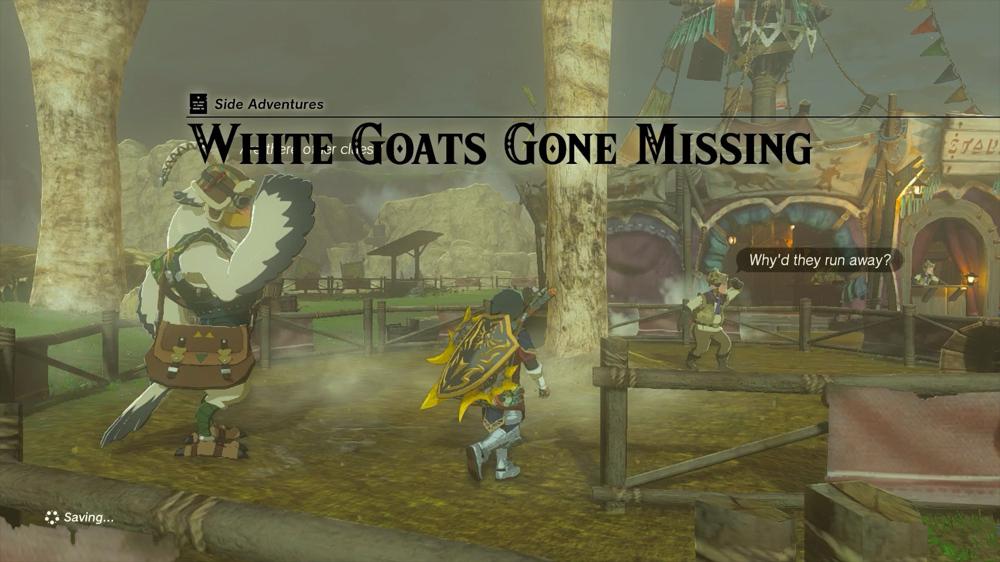
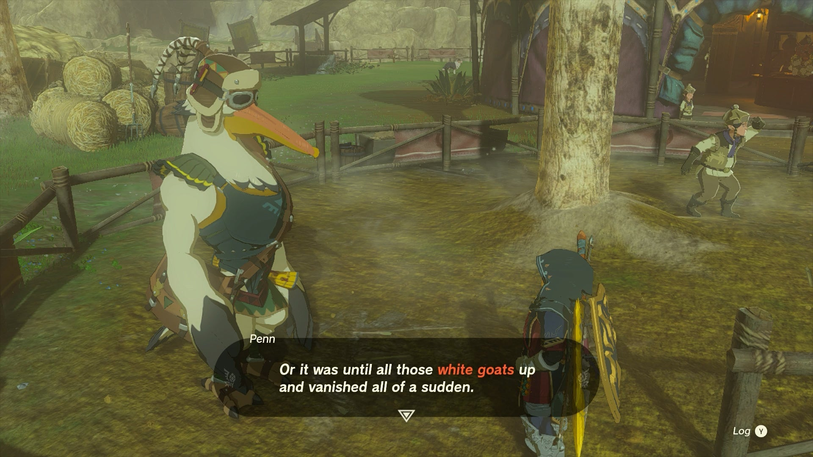
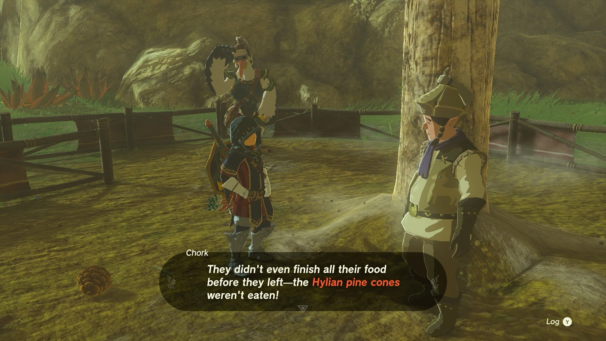
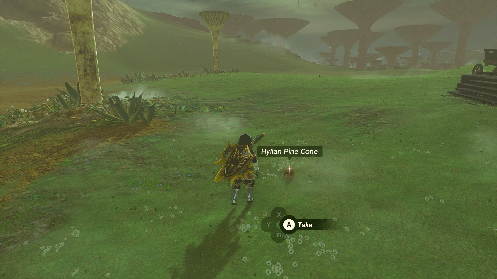
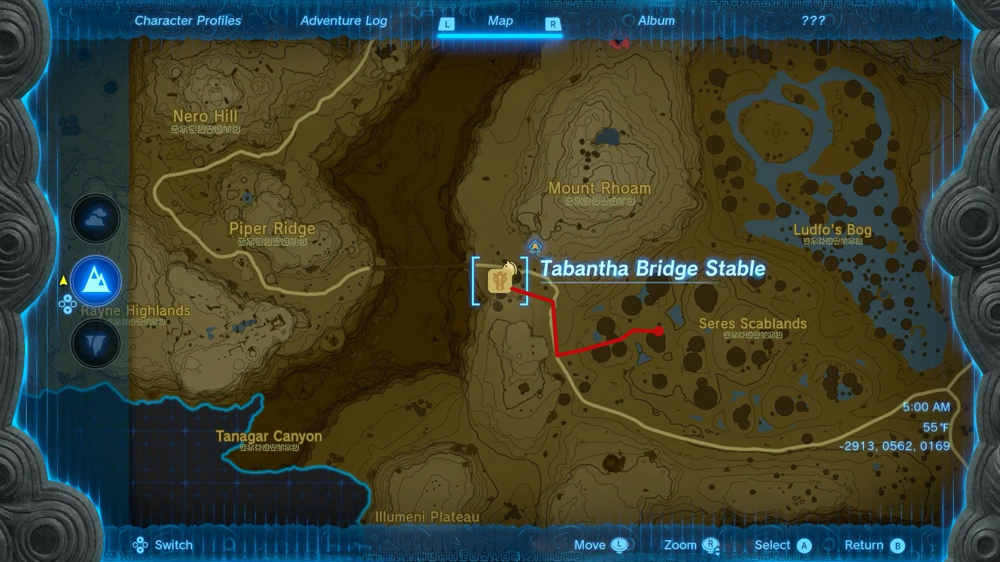
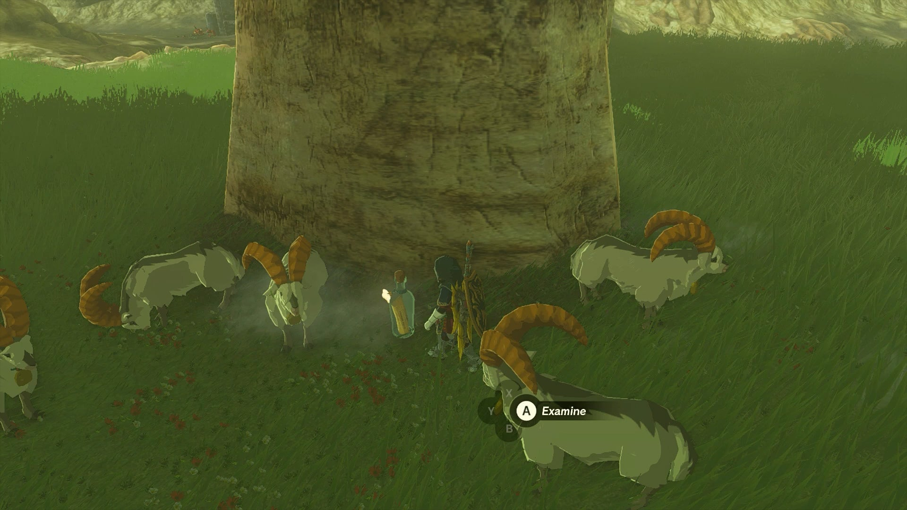
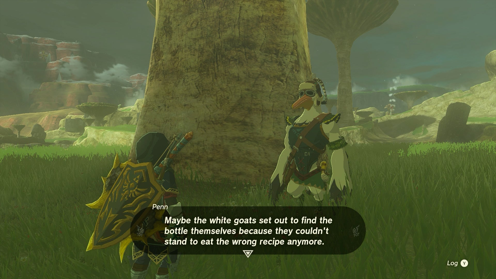

**White Goats Gone Missing** is a Potential Princess Sightings! side adventure in TotK found at the Tabantha Bridge Stable, available after you have become a journalist for the Lucky Clover Gazette at Rito Stable. Penn needs Link's help to investigate the disappearance of some white goats after they were fed a recipe involving Princess Zelda. Below is the walkthrough for another part of the Lucky Clover Gazette questline. 

  * **Quest Giver:** Penn
  * **Prerequisites** : Begin the Potential Princess Sighting! questline at the Lucky Clover Gazette
  * **Reward:** Rupees

You can find this quest at the Tabantha Bridge Stable, located along the road through Hyrule Ridge on the south side of the Tabantha Bridge before you reach the Rito Village in Hebra. 

To kick off this quest you'll need to start by talking Penn, a reporter for the Lucky Clover Gazette. He's heard that the white goats of the stable have up and run off and Princess Zelda may be involved. 

According to Chork, the stablehand who cares for the goats, he received a special recipe from Princess Zelda for feeding white goats, the main ingredient being Hylian pine cones. Chork put the recipe in a bottle and it got carried away, forcing him to make the recipe from memory. Now the white goats spit up the pine cones and have run off! 

Penn asks Link to do two things: Find Princess Zelda's recipe for the white goat feed, and find the white goats. Luckily, you can knock out both objectives by following the same clue. 

### Finding the White Goats

To find the white goats, follow the trail of Hylian pine cones they've left behind. These lead down the road, southeast of the stable. If you're having a hard time seeing the pine cones you can use Ultrahand to highlight them and other items in the area. 

It turns out the goats when on quite the journey! You'll find them in the **Seres Scablands, southeast from the Tabantha Bridge Stable** at the coordinates -2553, 0418, 0151. 

The five goats are together and happen to have the bottle with the recipe. How convenient! Approach the bottle and press A to examine it. When you do, Chork appears at the scene. 

Chork discovers that he had been following Princess Zelda's recipe wrong after all. He swears to do right by the goats and thanks Link for his help. 

They return to the stable and Penn arrives with your reward. 

_This reward depends on how far along you are in the Potential Princess Sightings! Side Adventure._

White Goats Gone Missing

## List of Potential Princess Sighting Side Adventures

Looking for other Potential Princess Sightings to undertake? You can take on the following adventures in any order you choose, which are located at nearly every main Stable in Hyrule. Click on a link below to learn more about it, and how to solve the quest. 

Side Adventure Name  
Starting Settlement / Region

Serenade to a Great Fairy  
Woodland Stable, Eldin Canyon

The Beckoning Woman  
Outskirt Stable, Central Hyrule

Gourmets Gone Missing  
Riverside Stable, Central Hyrule

The Beast and the Princess  
New Serenne Stable, Hyrule Ridge

Zelda's Golden Horse  
Snowfield Stable, Tabantha Tundra

White Goats Gone Missing  
Tabantha Bridge Stable, Hyrule Ridge

For Our Princess!  
Foothill Stable, Eldin

The All-Clucking Cucco  
South Akkala Stable, Akkala

The Missing Farm Tools  
Wetlands Stable, West Necluda

Princess Zelda Kidnapped?!  
Dueling Peaks Stable, West Necluda

An Eerie Voice  
Highland Stable, Faron

The Blocked Well  
Gerudo Canyon Stable, Gerudo

See the complete List of Side Quests and Side Adventures

### Up Next: For Our Princess!

Previous

Zelda's Golden Horse

Next

For Our Princess!

### Top Guide Sections

  * Walkthrough
  * Zelda: Tears of The Kingdom Switch 2 Edition Guide
  * Zelda Notes Voice Memories
  * List of Side Quests and Side Adventures

### Was this guide helpful?

Leave feedback

Go to comments