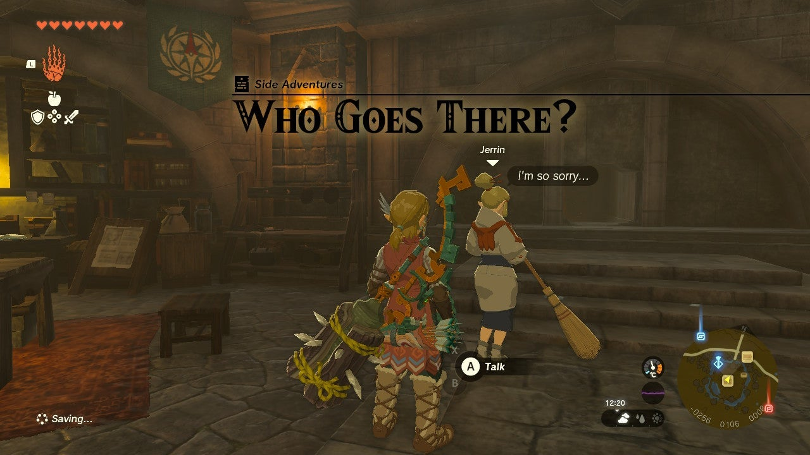
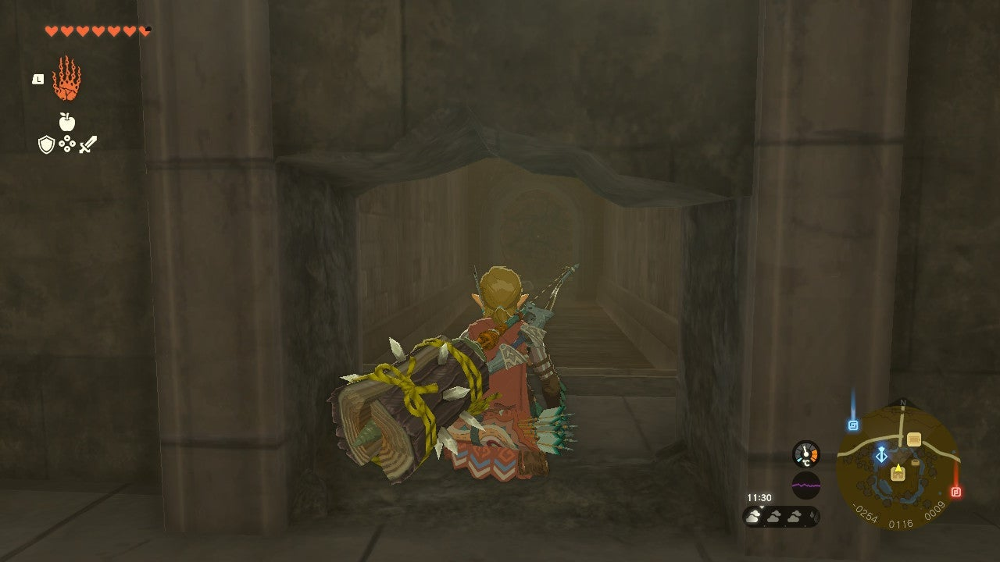
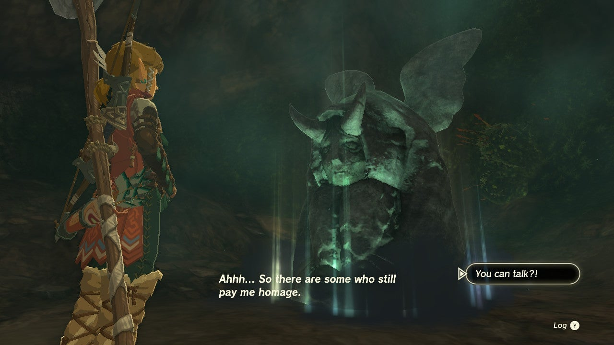

**Who Goes There?** Is another one of The Legend of Zelda: Tears of the Kingdom’s many Side Adventures. In this guide, we will walk you through the entire quest from start to finish so you can unravel the mysteries of the demonic voice and underground passages. 

To begin the Who Goes There? Side Adventure, you must first complete the **Hebra** leg of the Regional Phenomena Main Quest. 

Once you’ve done that, head back to Lookout Landing and drop down into the **Emergency Shelter**. Speak to **Jerrin** , the Sheikah woman who is sweeping the floor to the left of the library area. 

It appears that she swept so hard she created a hole in the wall, and is worried about the strange and eerie voice emanating from it. Crawl inside the hole to discover the **Royal Hidden Passage**. This is a tunnel system that leads straight to the Castle. 

When you enter the passage you will see two breakable walls, one in front of you and the other to your right. Destroy the wall to your right to discover the source of the voice. 

It is the **Forbidden Horned Statue** , similar to the one found outside Hateno Village in The Legend of Zelda: Breath of the Wild. The statue trades your Stamina and Heart gauges, so you can customize them whenever you want. Interact with the statue to trigger the A Deal With the Statue Side Adventure. 

At this point, you can head back to Jerrin and complete her quest. She will give you a Red Rupee as a reward for your efforts. 

Who Goes There?

See the complete List of Side Quests and Side Adventures

### Up Next: A Call from the Depths

Previous

A Deal With The Statue

Next

A Call from the Depths

### Top Guide Sections

  * Walkthrough
  * Zelda: Tears of The Kingdom Switch 2 Edition Guide
  * Zelda Notes Voice Memories
  * List of Side Quests and Side Adventures

### Was this guide helpful?

Leave feedback

### In This Guide

The Legend of Zelda: Tears of the KingdomNintendo EPD

Initial Release: May 12, 2023

Learn more

Go to comments