12. A Mystery in the Depths

While not necessary for completing the main story, this important Main Quest will be presented to you after you have completed one of the Regional Phenomena tasks and returned to Lookout Landing. Note that you do not have to actually undertake this quest to recieve the ability, as you can happen upon it while exploring without any prompting to find it on someone else's behalf.

Jump to:

Following the Statue Trail

Using the New Ability

Defeating the Boss

A Mystery in the Depths Walkthrough

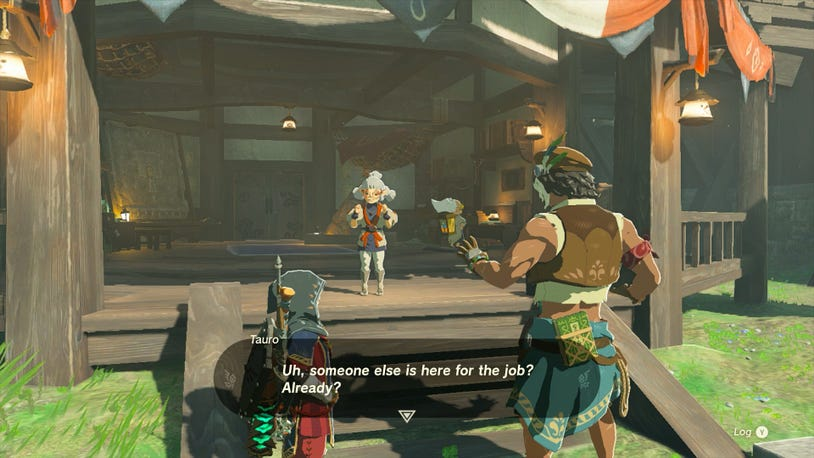

Once you've helped out one of the other races with their Regional Phenomena, you can travel back to Lookout Landing and speak to Josha as he denies a lead Zonai Researcher the opportunity to track something down.

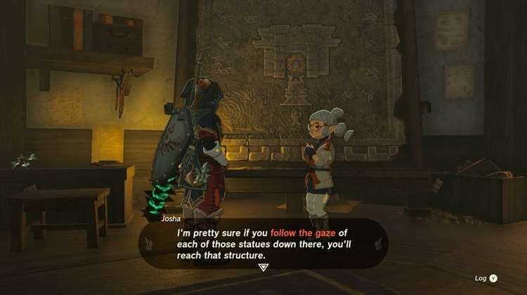

It looks like you're the best candidate for the job, as Josha will quickly fill you in on the mural she's been able to piece together after you found the strange statue in the depths. It would seem a line of these statues seem to be pointing towards a special power, and Josha wants you to follow the trail.

Follow the Statue Trail

Depending on how much you've been exploring the Depths since getting the Camera app for the Purah Pad, you may have a well-lit trail, or will need to forage through the darkness, but luckily Josha has 10 extra Giant Brightbloom Seeds and Arrows to help map the journey.

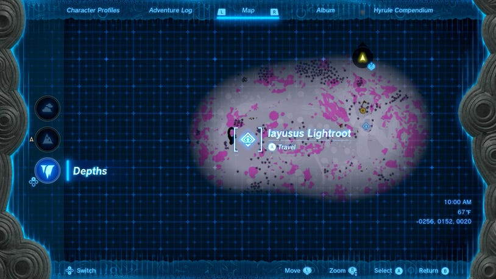

You're best bet is to continue where you left off after snapping the picture of the statue by the Iayusus Lightroot south of Lookout Landing, and west of the chasm you first entered.

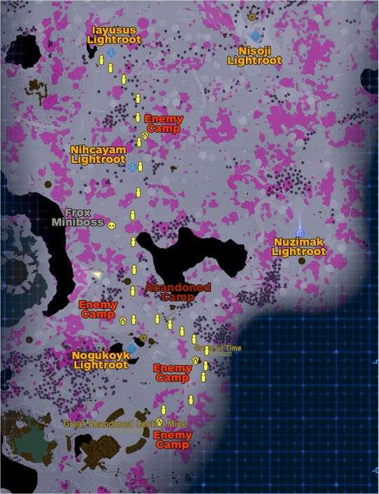

Be sure to check the map above if you get lost or need some guidance, as it lists all the statue locations, nearby Lightroots, enemy camps, and more!

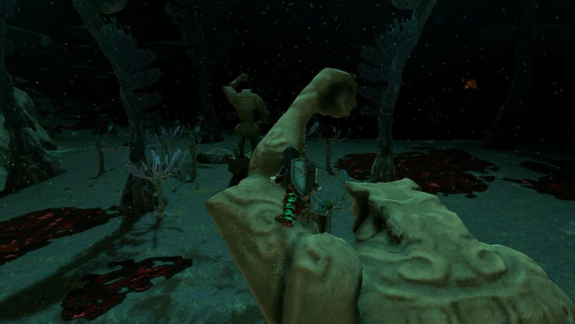

Once in the Depths, get a good look at the few statues you should be able to see by the Lightroot, as they seem to be facing down to the south. If you climb on top of one, you can even spot a distant Lightroot further south you should mark, as you'll be moving alongside it.

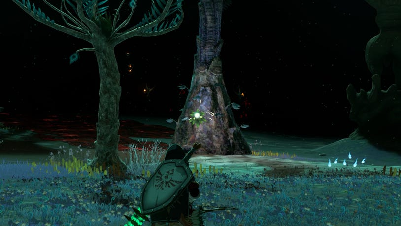

Make use of the Giant Brightbloom Seeds Josha gave you to help light the path from statue to statue on the southeastern path.

Eventually, you should cut through a small forest to a small mining camp with some Bokoblins and Moblin. Remember that they are covered in Gloom, and any damage dealt will lower your maximum health, so engage carefully!

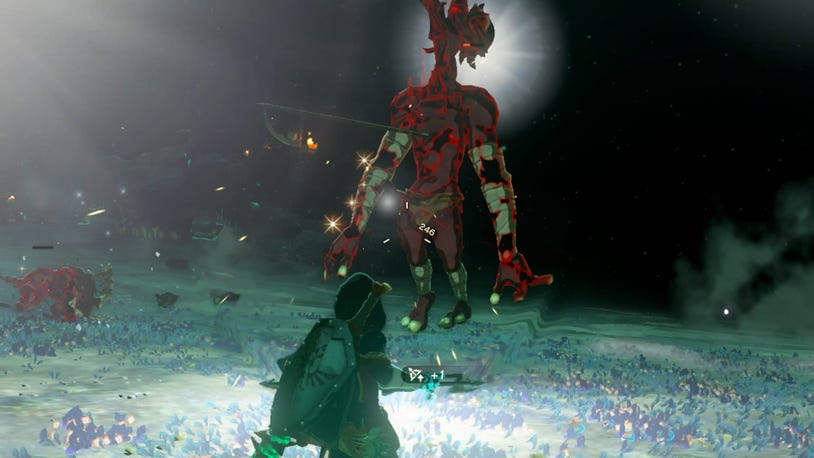

Try to stagger their approach so you don't get overwhelmed by utilizing fused materials like Muddle Buds, Puffshrooms found in the Depths, or elemental fruit to disorient or freeze them.

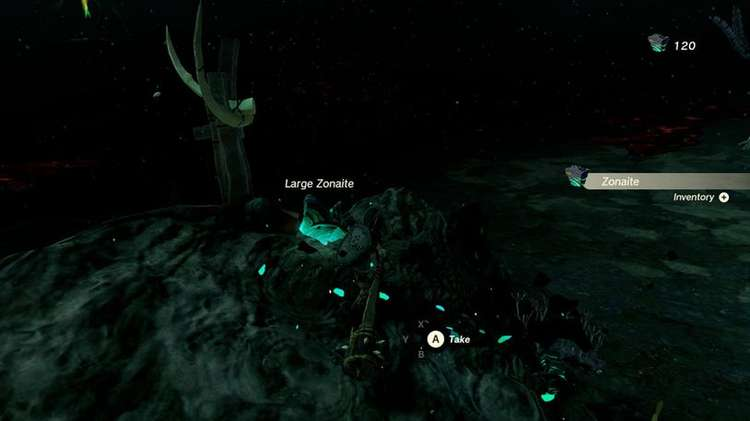

Be sure to also mine all the available Zonaite, as you'll want as many as you can carry for this quest.

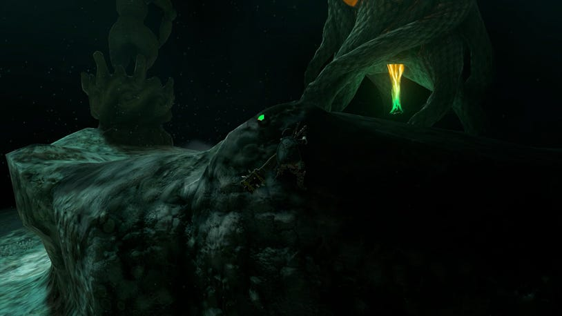

Keep moving past the mining camp along the statues until you come alongside a small ridge leading to the Nihcayam Lightroot.

Nihcayam Lightroot

From here, the path continues in a mostly straight south road though more spread out, so you'll quickly need to light the path again with more Brightbloom Seeds.

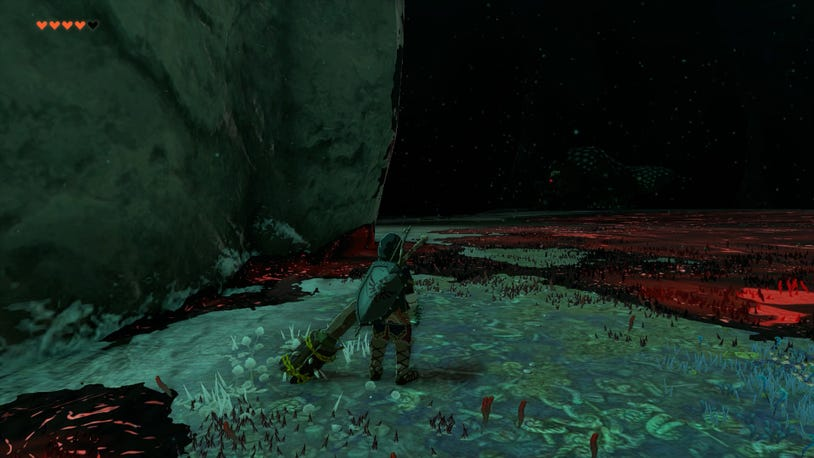

When you start reaching large pools of Gloom, move slowly and cautiously, as there will be a large miniboss unique to the Depths on the right - the Frox. This giant toad has ore on its back like a Talus, but will bounce high into the air, eat your Brightbloom Seeds (and you if you get too close!), so avoid planting seeds near him.

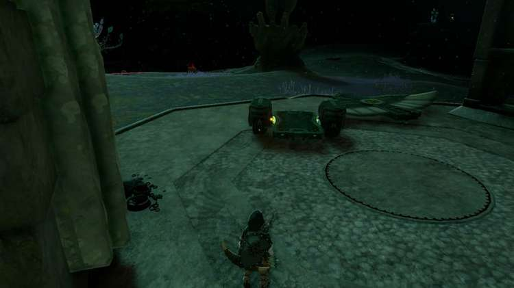

Wait until he patrols in another direction to keep heading south around a large section of impassible rock until you reach a small platform with a Zonai Device Depot. There will be a lot of devices you can make use of, or continue to travel on foot down to another camp in the distance.

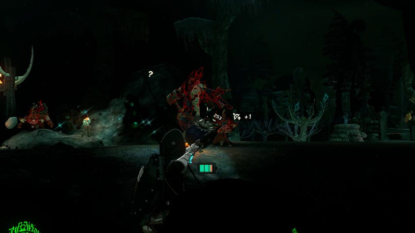

When the statues begin to veer to the east past the enemy camp, you might be able to spot distance lights in the darkness, but you're still a ways off. If you look around carefully, you can also spot a Lightroot down a small canyon further south blocked by sections of impassible walls, or you can continue to follow the statues.

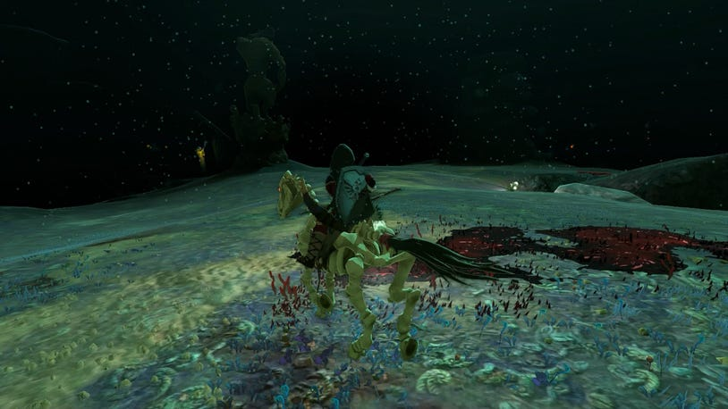

There may also be packs of wild Stalhorses nearby, and surprisingly they don't seem to mind you riding them. Consider a slow trot to easily walk over puddles of Gloom with no ill effects, but don't race along too fast into the darkness.

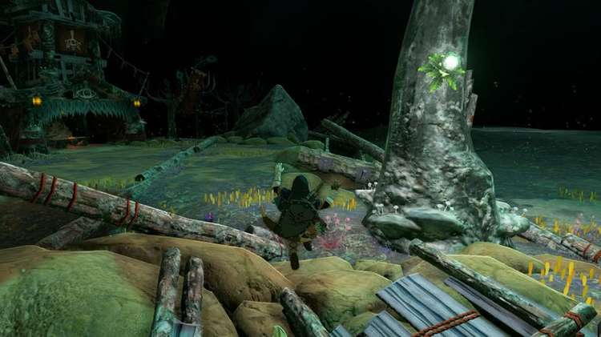

As you follow the trail east, look around for what seems to be a broken down fort with signs of the Yiga Clan - the enemy ninjas sworn to defeat Link. A note mentions that they have torn down the base, so you can keep moving along the path.

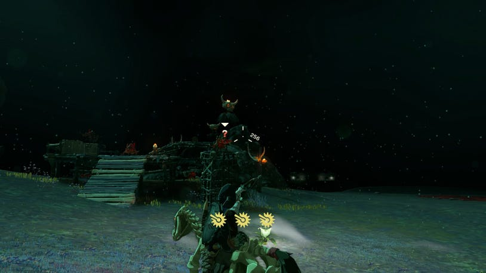

Once you reach the Gove of Time, you'll find a large underground forest with another enemy mining camp on the edge, filled with more Moblins and Lizalfos that can move quick and deal a lot of damage.

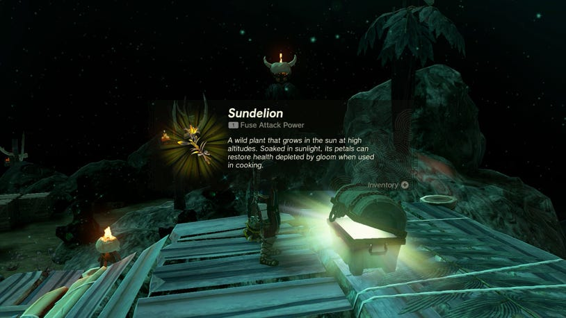

After clearing them out, be sure to look for a chest that holds some much needed Sundelion, and use a Zonai Cooking Pot device to craft a quick meal if you've been taking some hits to your max health.

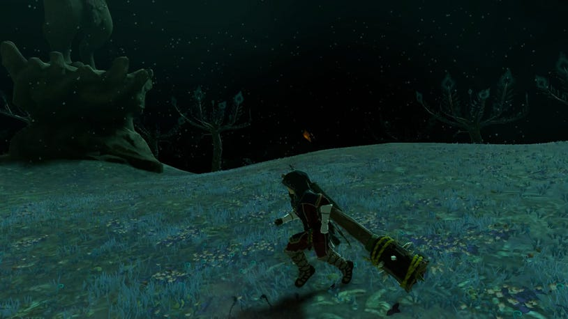

If you want to get more light, you can try heading through the grove to the northeast to find the Nuzimak Lightroot, but otherwise you should continue along as the statues bend south again.

Nuzimak Lightroot

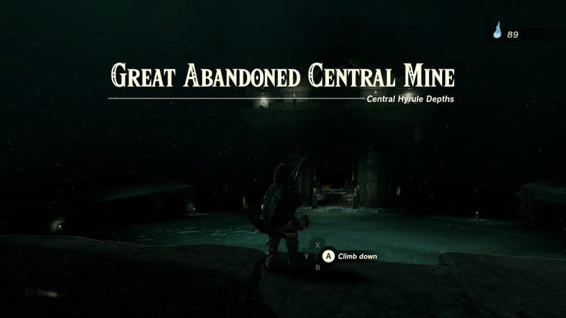

Finally, the distant lights from a structure will come into view much bigger, just down a large hill. There are more camps on the left and right, but you can avoid them both and simply paraglide down to the large entrance arena to the Great Abandoned Central Mine.

Unlock the Autobuild Ability

This giant structure seems to hold many secrets, but your first objective is to head straight through the large entrance arch and to a platform with a few broken Zonai Devices, and two "researchers" studying an altar. They will profess no idea of how to unlock the secrets of the altar or robot, so it will be up to you show them how it's done.

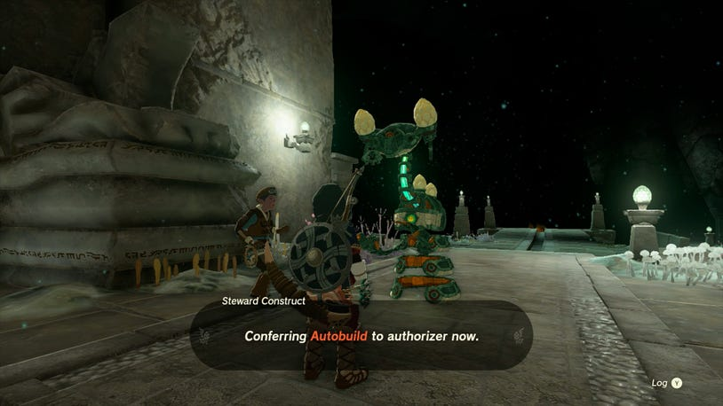

Interact with the altar to awaken the Construct, who will find you worthy of passing along his special ability: Autobuild.

With this last ability in Link's possession, you can now quickly re-create anything you've constructed (saving the last 30 creations in a history tab), favorite your most-used devices, and unlock new schematics for inventions you may not have thought of.

The two "researchers" will be astounded at your new ability, and ask for a demonstration:

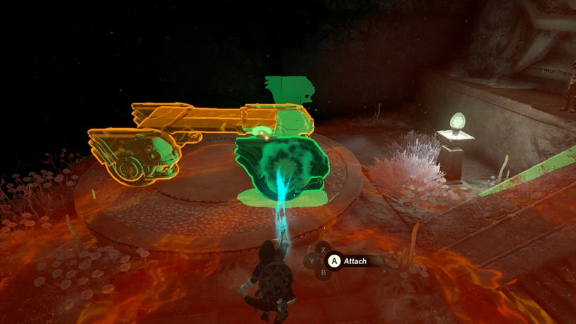

To start, head down and rebuild the car on the right by re-attaching the tire on the front side. This will save the entire car in your Autobuild History.

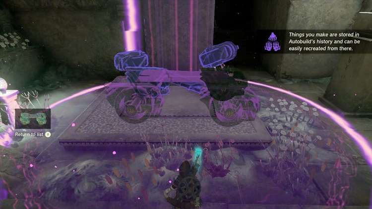

Next, face the disassembled car and ready your Autobuild ability. It will automatically pull up your history of builds, starting with the vehicle you just fixed.

Select the ability and aim it near the parts, and you'll see the price of building drop as the pieces are found and readied. Once all pieces are ready, press A and it will quickly assemble without using any extra materials from your inventory!

However, now that the "researchers" know the ability works, they'll shed their disguise as they call for their master, a very familiar face you may remember from Breath of the Wild. After all, it was you who defeated him by knocking him into a large pit...

Boss Battle - Master Khoga

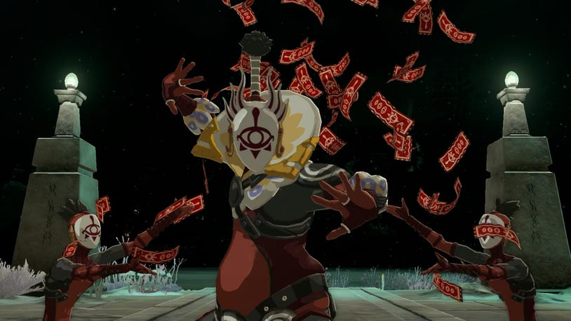

The leader of the Yiga Clan is back and angrier than ever at Link, and he's got some new tricks up his sleeve he's been formulating while down in the Depths.

Even though Link is now a master of creation with the Ultrahand, the Yiga appear to have found ways to craft their own devices, and Khoga will employ some pretty nasty vehicles against you.

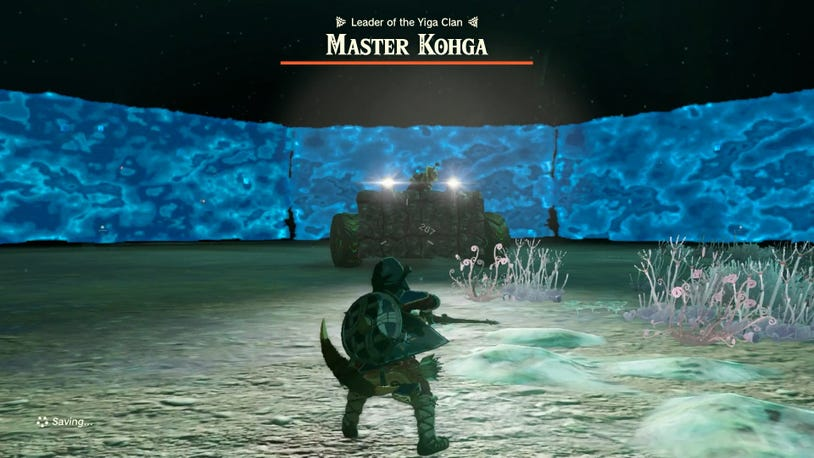

To start, he'll summon a large four-wheeled behemoth with large tires and a giant row of iron spikes, and attempt to run you over with it. Your goal is to not get hit, which you can accomplish in a few ways since Khoga isn't too bright.

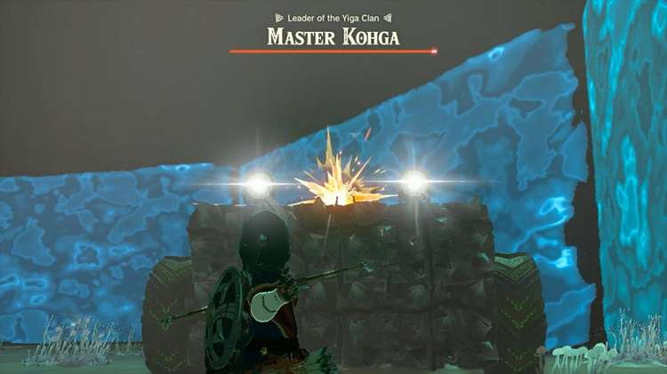

The first and easiest option is to quickly swap to a bow and fire an arrow at his face when he starts driving toward you. If he veers to the side and it becomes difficult to draw a bead on him, make sure to fuse Keese Eyes or Aerocuda Eyes to your arrows to seek him out.

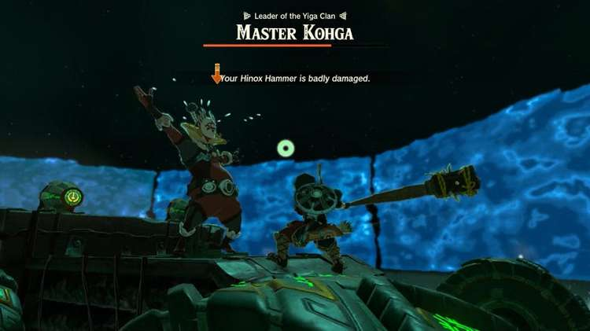

If you're out of arrows or want to be more daring, you can also try running alongside his vehicle, and jump to the ramp along the back, or onto the wheels to hop up onto the platform.

Either way, he'll be surprised or stunned from the result, which is your cue to lay into him with your hardest hitting weapons until he vanishes. Unfortunately, you can't steal his vehicle for long, as he'll make that disappear too.

Expect him to repeat the process again after moving some distance away, but he can also throw his Yiga powers into the mix.

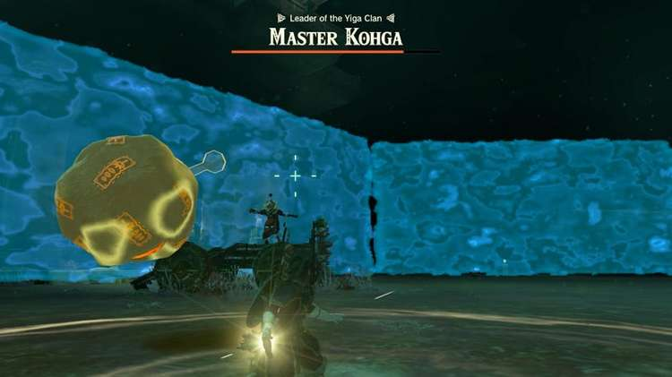

If you see him summon a large boulder above him, wait for him to toss it, and then ready your Recall Ability. Freeze time and select the boulder, then send it right back at his face.

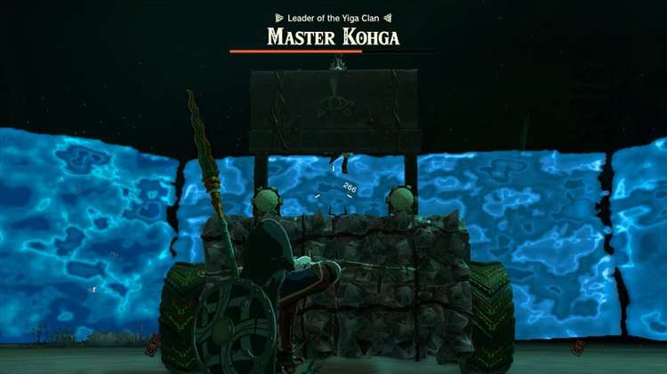

When he appears next, he'll try to dissuade arrow shots by installing a barrier above his steering area, but again has left a nice open window you can still snipe him through, or simply run along the side.

Once his health gets low, his final vehicle has two forms he will alternate between:

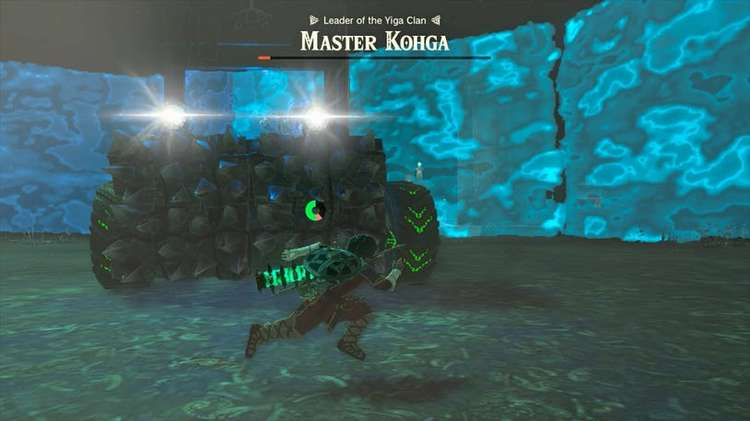

His main attack will now have walls built on the sides so you can snipe him by strafing, and his window now has a reflective shield, which means you'll need to either wait for him to toss boulders, or get creative in getting onto the vehicle.

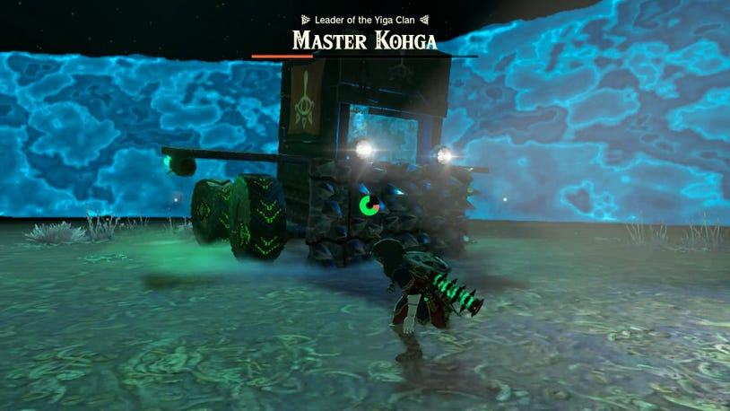

His other version is much more dangerous, creating wings on both sides of the vehicle with rockets. The second you spot the vehicle with the rockets, be ready to sprint to one side when he guns the engine at you.

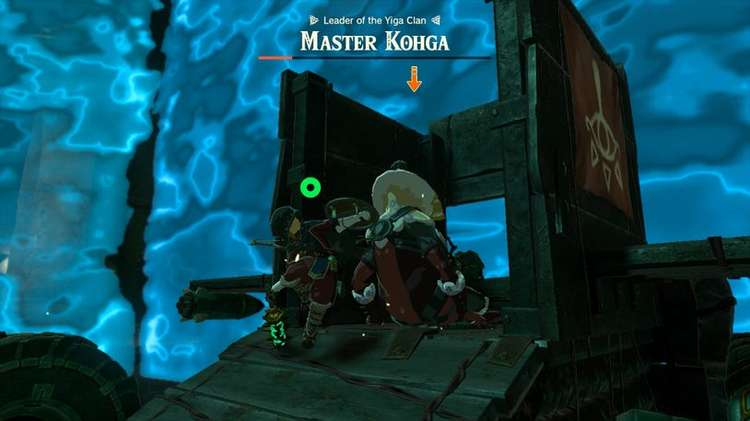

Luckily this second version will almost always end with Khoga slamming into the wall and stunning himself, giving you ample time to climb on board and whack him around.

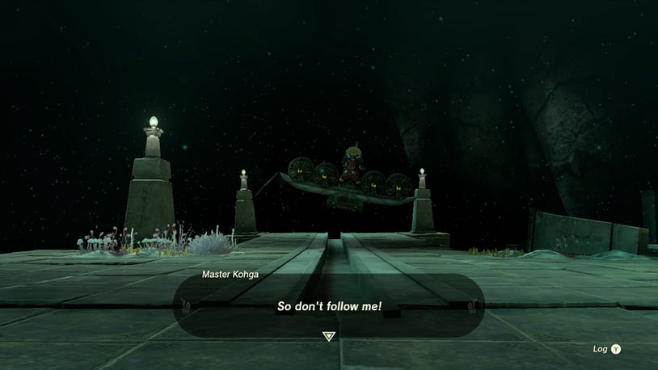

Once Khoga has finally been defeated, he'll concede the Autobuild ability to you, but swear his revenge and take off towards the Southwest, beginning a new chain of sidequests that eventually have extreme importance towards the end of the game!

Check the chest that opens up after Khoga leaves, and you'll find a Huge Crystallized Charge, which is essentially a freee Energy Well upgrade!

Be sure to return to where you got the Autobuild ability, as not only will the Construct give you some more clues as to where to go next, but there's been some added features to the Abandoned Central Mine:

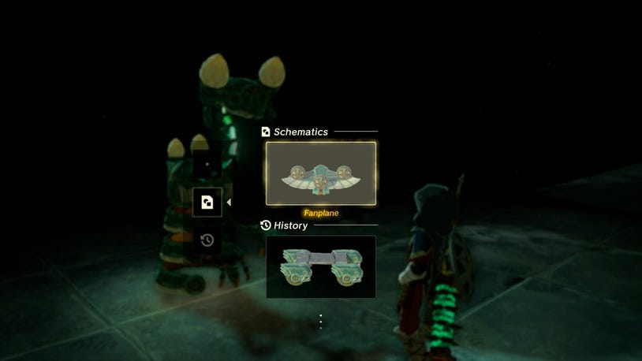

Talk to his associate by the ledge, and the Construct will hand you a Schema Stone. These stones are essentially blueprints to build more Autobuild creations without having to figure it out yourself - like a glider Wing with three Fans. Note that when creating, if you don't have a Zonai Devices or other materials on hand, it will convert a certain amount of Zonaite in your inventory to compensate. See All Schema Stone Locations.

Schema Stone 1 - Fanplane

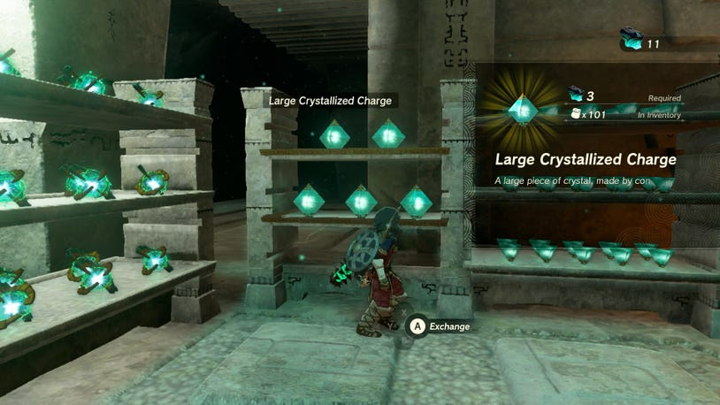

Speaking of Zonaite, the nearby Forge will also become active, and the Forge Construct here will have a lot of materials to buy, including regular and large Crystallized Charges, and big and small Zonai Charges. If you got a lot of Zonaite on the way here, be sure to spend it on those Crystallized Charges!

Return to Josha

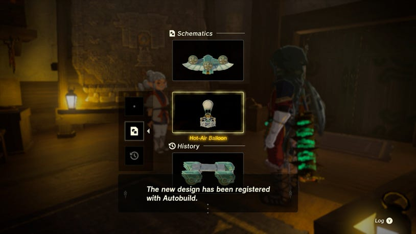

Teleport back to Lookout Landing, and you can fill Josha in on everything that transpired. When you mention Schema Stones, she'll rummage through her finding to find one to give you, letting you build your own hot air balloons anywhere you want!

Schema Stone 11 - Hot Air Balloon

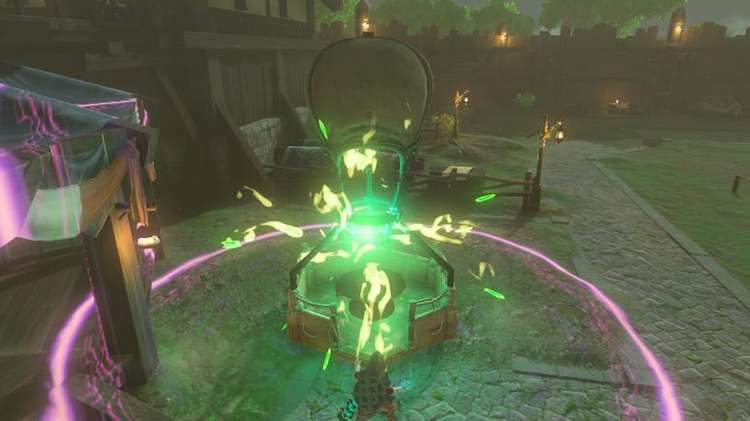

She'll also want to see the power of the Autobuild first-hand, and ask that you help rebuild Robbie's old balloon, which you can now do fairly quickly with the power of Autobuild.

Completing this quest also means Robbie will be free to travel back to his lab at Hateno Village, which opens up quests to upgrade your Purah Pad with lots of different tech!

Josha will conclude the quest by giving you a Large Zonaite, but before you leave the camp, be sure to open the far door leading North to the Castle Town Ruins.

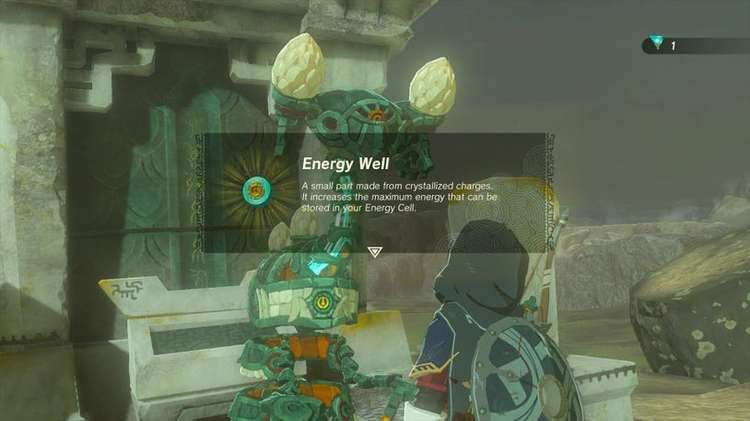

Just to the right is the large pillar that's fallen from the sky, and hides a Refinery Construct that will take all those Crystallized Charges you just got and convert 100 of them into a new battery slot for your Energy Well. There's plenty more room to upgrade, so be sure to keep coming back with more resources and check the forges often as you mine more Zonaite!
