5. Camera Work in the Depths

After you’ve gained the Paraglider in Lookout Landing, speak to Robbie and Josha below the observatory. Josha will want to investigate the new chasm south of Lookout Landing to take a picture of a strange statue, but Robbie will charge on ahead and ask you to meet him down in the Depths.

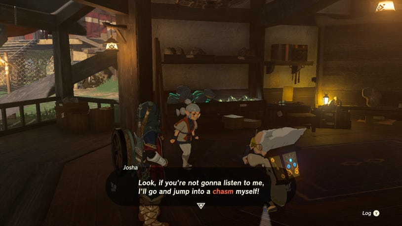

Before you go, Josha will give you several Brightbloom Seeds to help light a path in the dark, and arrows to fuse them to.

Getting to Hyrule Field Chasm

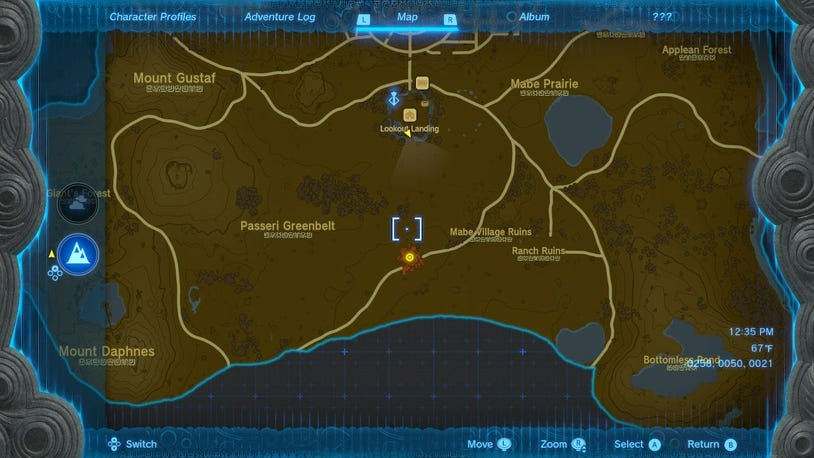

You can find the Hyrule Field Chasm due south of Lookout Landing, and it can easily be spotted either from the air when using the Skyview Tower, or by spotting the waves of red gloom on the horizon.

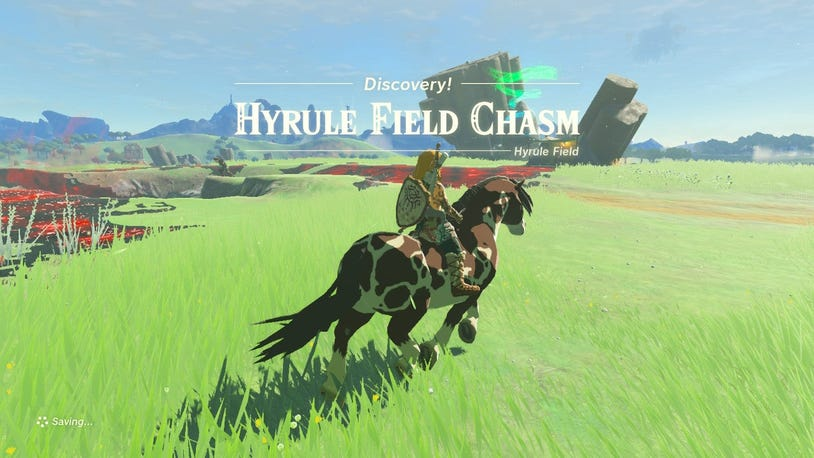

As you approach, you’ll find a Zonai Survey Team has build a camp around the chasm entrance, and there is also a nearby shrine — the Jiosin Shrine that you should at least interact with to gain a new fast travel point, or head inside to get the Light of Blessing.

Jiosin Shrine

One of the researchers will warn you about the effects of Gloom before you dive down. Standing in it is like a poison that will slowly eat away at your maximum hearts, and you’ll see the indicator flash before a heart is affected. While in this state, even eating normal food cannot restore these hearts, but fortunately standing in the sunlight on the surface will quickly remove the restrictions on your maximum health, but you’ll still need to eat food to regain what’s been lost.

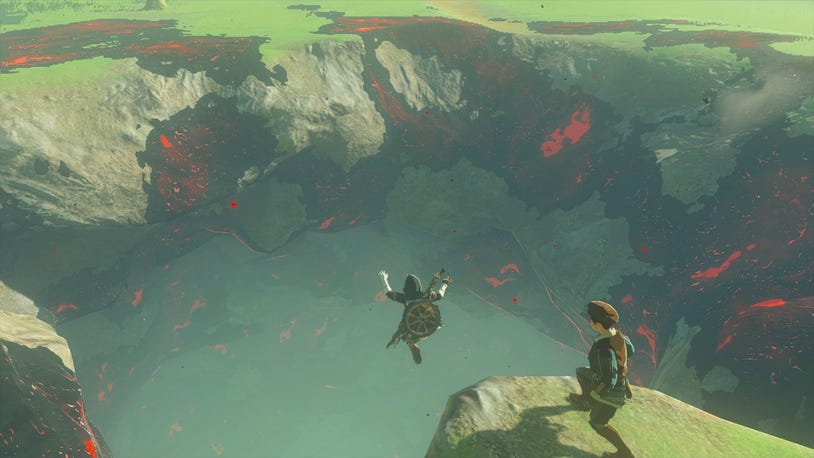

Since Robbie seems to have gone ahead without you, enter the Depths by jumping into the chasm and free-falling by tapping R to see the darkened landscape below you.

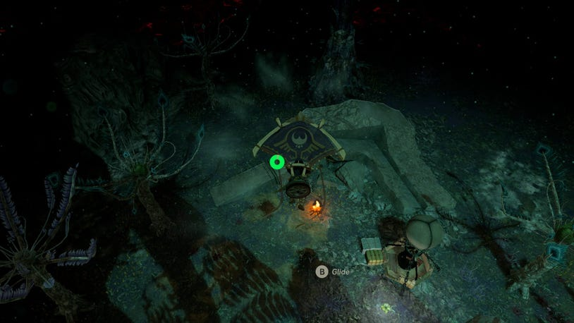

Look for a flickering flame on the ground below and be sure to activate your paraglider before you hit the ground.

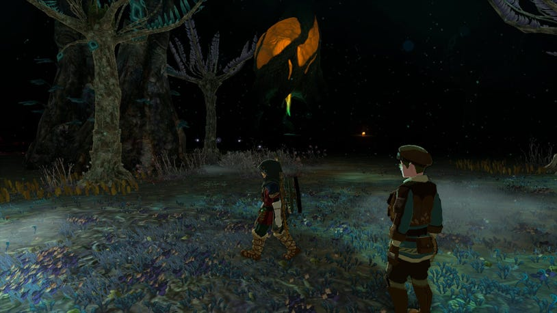

The Depths is a massive place that spans much of the landmass of Hyrule, and it can be easy to get lost or disoriented down here. Most of it is in total darkness, limiting your view to the many obstacles and danger that awaits. Not only do you have to contend with more gloom coating the landscape — but many of the enemies found in the Depths are covered in gloom themselves, and getting hit by them will automatically reduce your maximum hearts.

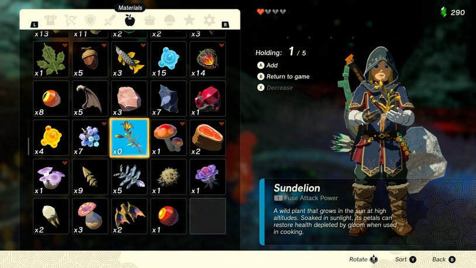

Unlike the surface, it will be much harder to recover hearts lost to the gloom, so consider dropping down a Zonai Cooking Pot to make some meals with Sundelion just in case.

Find Robbie

Speak to the Zonai Survey Team person down here who will point you in the direction that Robbie raced off in, and you can spot a small campfire to the south by a large faintly glowing tree root, and another campfire further off to the west.

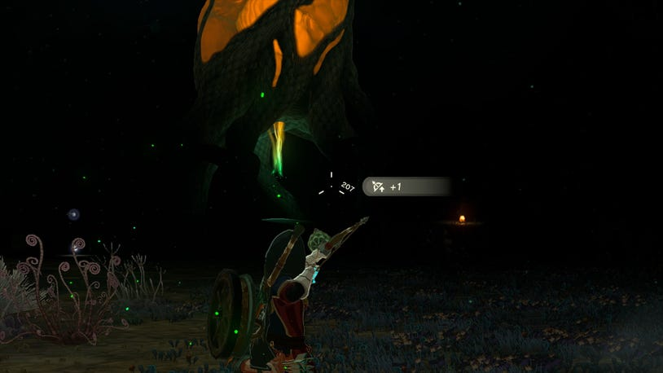

As you leave the safety of the campfire, you’ll find that things quickly become hard to spot, which is when you should pull out some Brightbloom Seeds. You can either toss them by hand by holding R and then Up on the D-Pad to select the material, or ready your bow to fire an arrow with one attached if you need more distance.

Once a Brightbloom Seed hits any surface, it will immediately sprout and shine a light in the area, and will remain there even if you leave and come back. If you run low on seeds, you can either forage in the Depths or in caves on the surface for more, or find alternate means of lighting a path forward.

Several new types of creatures reside down here, including the glowing Deep Firefly. These can be mixed with monster parts to create elixirs that let you radiate light yourself — though not as brightly as a Brightbloom Seed.

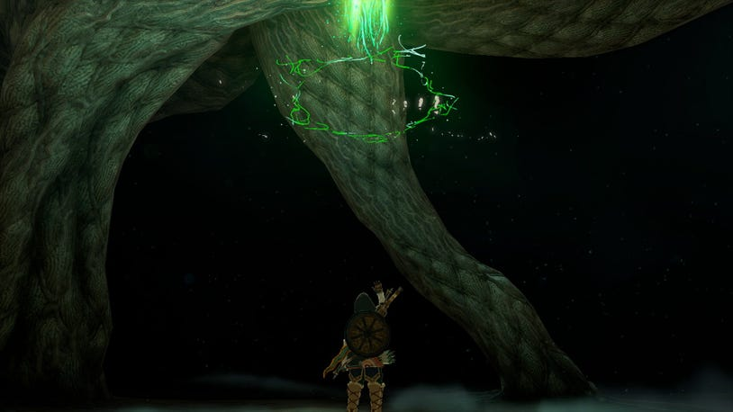

Keep heading north to find the Nisoij Lightroot by one of Robbie’s campfires. Like the shrines above, you can interact with the Lightroot to create a fast travel spot. More importantly, it will also greatly brighten a large area around the Lightroot, allowing you to both survey the surrounding area, and find your way back if you get lost in the dark. Standing in any Lightroot will also cleanse the gloom from your maximum hearts, but you will still need to eat something to recover the lost health.

Nisoij Lightroot

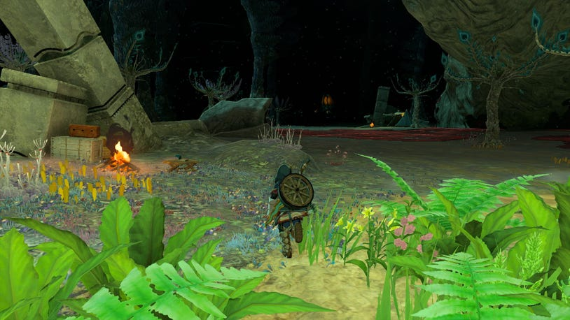

With the newly brightened area, be sure to inspect the campsite next to the Lightroot to find a Note on the Table you can read from Robbie. Look over to the west, and you can spy the next campfire not too far away, with another Lightroot glowing faintly in the distance.

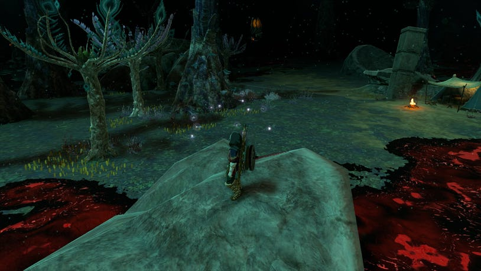

A giant pool of gloom is between you and the next camp, so use the large rock nearby to gain some height and jump over the deadly puddle. On the far side, read the next Note on the Table to get some more intel from Robbie. He seems to be on the trail of the statue further west by that Lightroot, but he’s not alone…

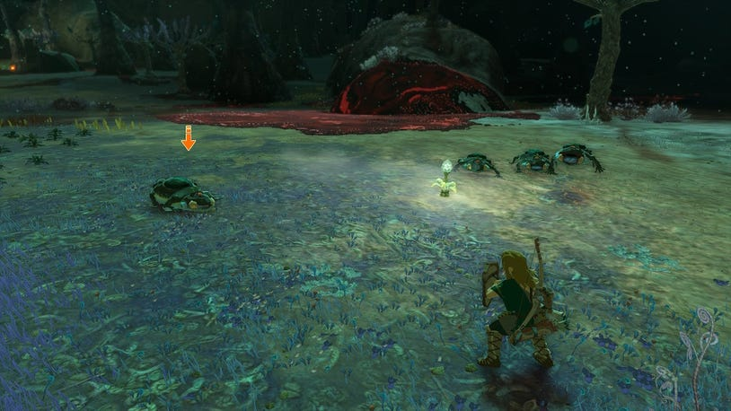

When you reach the edge of the Lightroot’s luminance, toss out some more Brightbloom Seeds to spot several threats ahead. To the left you may find a tiny group of mean looking things called Frox. They’ll stay at a distance before leaping at you, but more worryingly, they love to eat up Brightblooms, so don’t let them cast you into darkness!

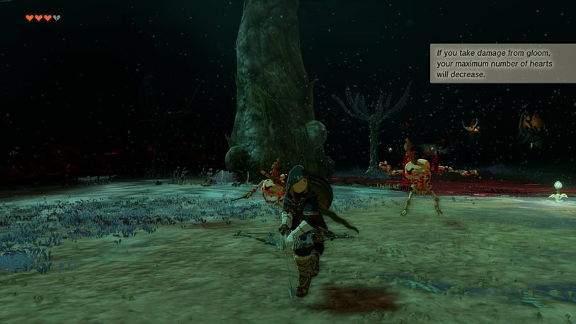

Before you reach the Lightroot, you may also spot a large skull torch in the darkness, where several monsters are mining Zonaite. These gloom-infested minions will damage your maximum hearts with every hit, so you may want to avoid them if you don’t have sundelion-baked food.

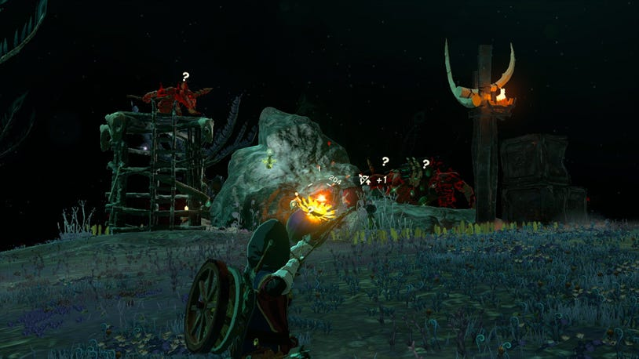

You can also scavenge by the base of the odd trees near you to find Bomb Flowers, and fuse them to your arrows to blast them and the Zonaite Ore apart.

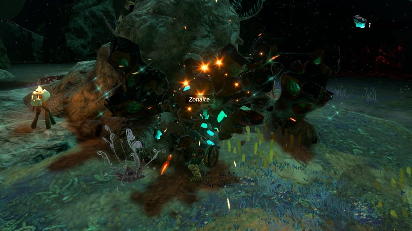

There’s one more mining outpost past the first one, and if you run intro trouble, you can also look for other materials unique to the Depths along the ground. Muddle Buds can be thrown or shot at enemies to disorient them and make them turn on their friends, while Puffshrooms can create a cloud of spores that obscure you from their sight.

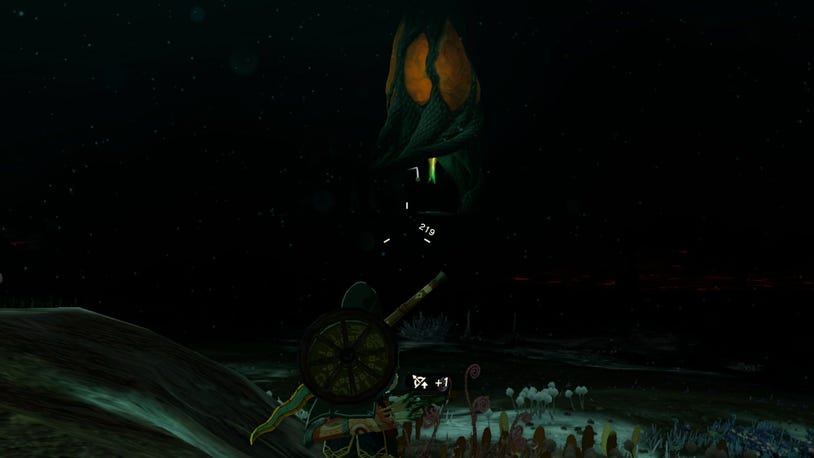

After taking out both camps, continue the journey to the far Lightroot in the west by lighting a path with Brightbloom Seeds. You may also be ambushed by a large winged Aerocuda that may try and divebomb you. If you have trouble hitting it in the air, remember that a Keese Eye fused with an arrow will seek it out for a quick kill.

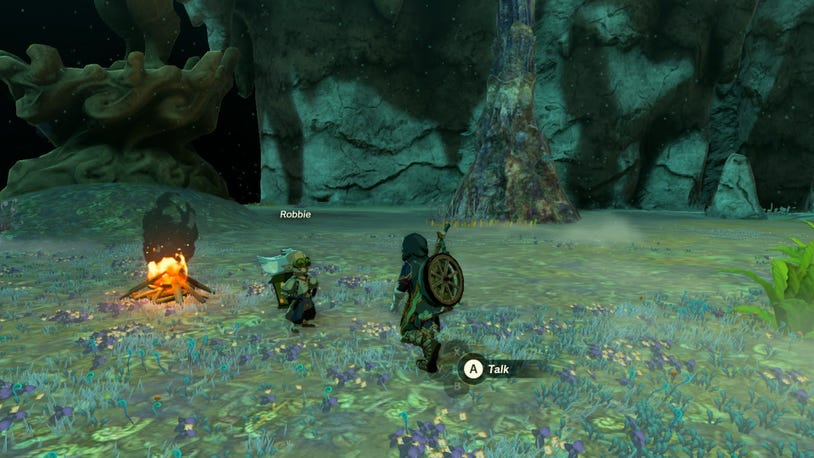

When you at last reach the Iayusus Lightroot, interact with it to illuminate the surrounding area, which should connect with the previous Lightroot to create a longer corridor of light. Robbie can be found just to the side of it by the large statue that Josha wanted to investigate.

Iayusus Lightroot

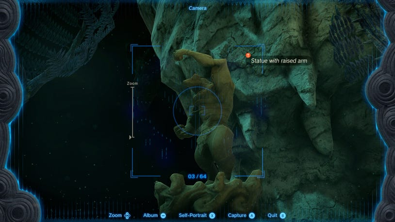

By talking to Robbie here, he’ll activate your Purah Pad’s camera feature! This important aspect of the pad will let you snap photos of many things, entering them in your Hyrule Compendium, taking selfies — and most importantly, it can be used on important objects that can be shown to others to resolve quests like this one.

Once the camera is good to go, step back and get a good shot of the ominous statue until it highlights the object with an exclamation point to denote quest objective. Show the results to Robbie, and he’ll be pleased enough to wrap up his investigation and return to the surface.

Find the Miner's Top Armor

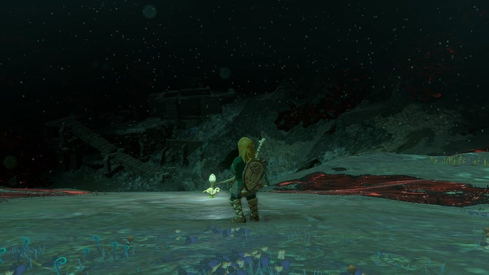

Before you teleport back to Lookout Landing yourself, you may want to explore just a bit further west of the statue you snapped a photo of. Look for a large downward slope and fire off a Giant Brightbloom Seed if you have one to illuminate the Daphnes Canyon Mine (located just below Mount Daphnes on the surface that you can check on your map).

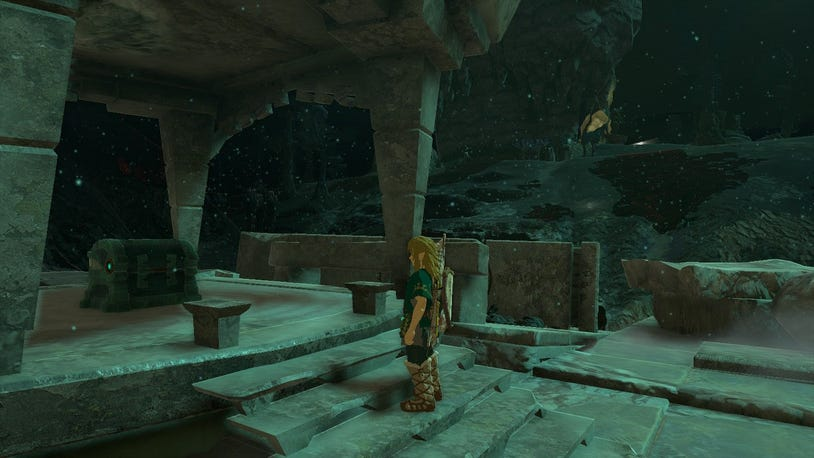

At the center of the mine around the large deposits of Zonaite, you can find a high platform with a single chest, containing the Miner’s Top. This special gear will illuminate your surroundings when worn, comparable to drinking an elixir made from the Deep Firefly.

Miner's Top

When you return to Lookout Landing, find Josha and Robbie again to complete the quest and get 5 Zonaite, and they’ll mention that more work may be available for you after you investigate some of the regional Phenomena.
