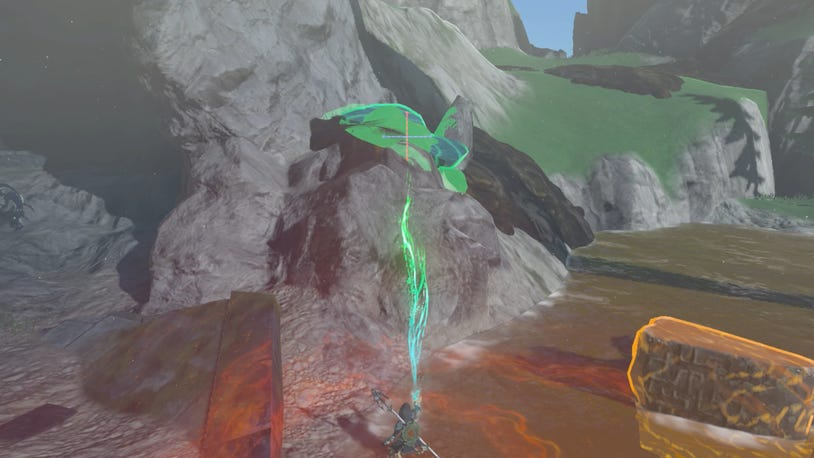
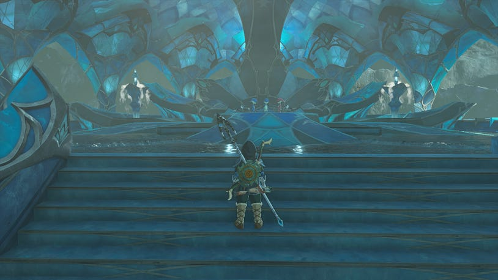
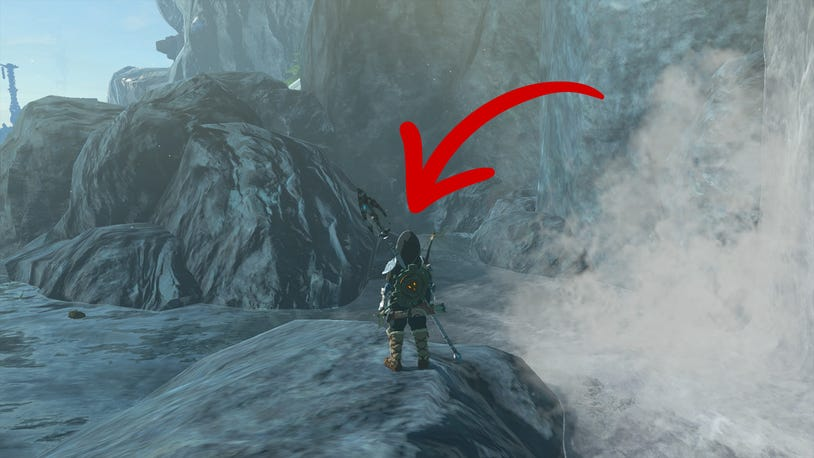
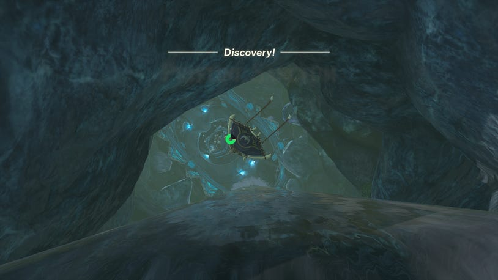
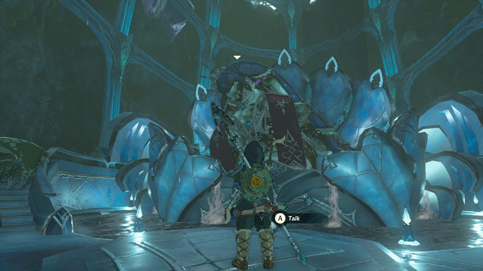
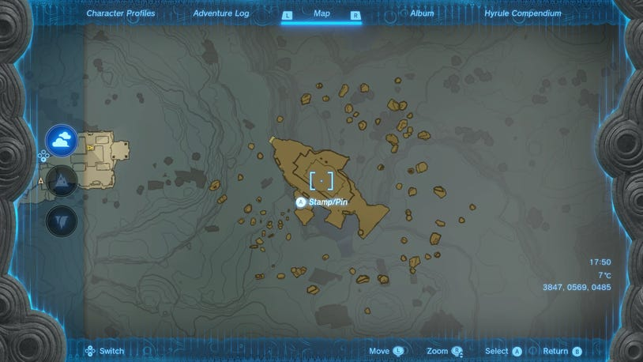
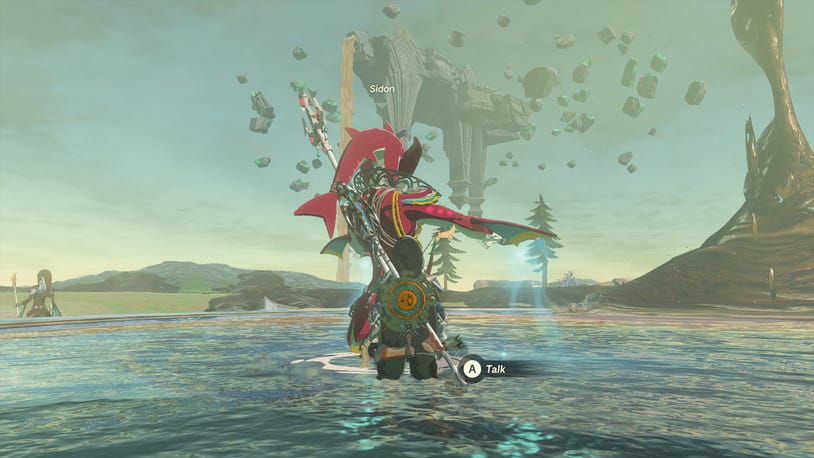
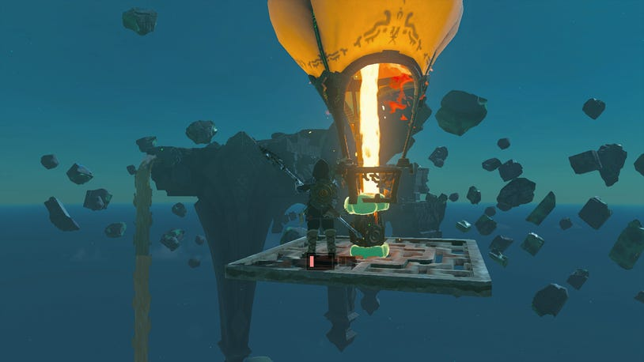
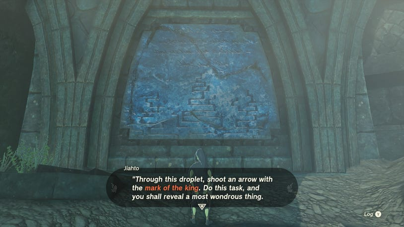
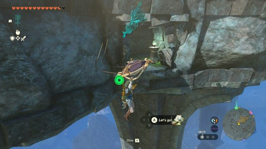

24. Clues to the Sky

How to Start Clues to the Sky

In order to start Clues to the Sky, you'll need to have started Sidon of the Zora and complete The Broken Slate.

How to Start Sidon of the Zora

Meet Sidon at Mipha Court, which can be found at the top of Ploymous Mountain. Once you've had a conversation with Sidon, he suggests speaking to the historian Jiahto in Toto Lake, which is northwest of Mipha Court.

To begin Sidon of the Zora you'll have to complete The Sludge-Covered Statue and we'd also recommend completing Restoring the Zora Armor before setting off.

Go to the northwest edge of the mountain (behind the Ihen-A Shrine) and look out. You'll see a Skyview Tower and shrine off in the distance, but to the left, there will be a sludge waterfall flowing up to the sky.

This is exactly where Toto Lake is, so glide down and climb the short distance across the mountain until you reach the lake. Upon arrival, you might spot Dunma standing on top of a platform to the left. Speak to Dunma first, then Jiahto, who you want to speak to, can be found inside the cave.

Speaking to Jiahto, this will start The Broken Slate, which is an additional main quest that forms part of theSidon of the Zora questline.

How to Complete The Broken Slate

Head just outside of the cave where you speak to Jiahto to find The Broken Slate he speaks of. As you head outside, turn left and look slightly up. Climb up the rocks to find The Broken Slate covered in sludge.

Use a Splash Fruit to free it, then use Ultrahand to pick it up and move it.

Take it into the cave then line it up with the broken slate on the wall to slot the fragment in.

As soon as you do Jiahto will react and say that he can finally read what the tablet says. When the tablet has been read aloud, Jiahto will say that it would be wise to consult King Dorephan on what it means.

This will wrap up The Broken Slate, but unlock The Clues to the Sky main quest.

How to Complete Clues to the Sky

Return to Zora's Domain and take the stairs up to the second floor, then up again in the center to the throne room. As you approach, three children, Tumbo, Keye, and Laruta will be playing, pretending to be King Dorephan.

If you try to approach them head-on, go behind them, or on either side of them they'll tell you to scram. You'll need to approach them stealthily and the best way to do it is to go outside and around the back then climb up and into the throne that sits behind them.

You can then get close to them and press Listen when prompted. They'll reveal that the secret spot is "Pristine sanctummmy", a place with clear water. Tumbo offers up that there's clean water that flows between Ploymus Mountain and Zora's Domain, with a secret entrance behind the waterfall.

Leave Zora's Domain from the bridge in the east again, and return to the series of waterfalls. Swim up the first and second waterfalls, then as you reach the third one in Lulu Lake, look to the northwest. The map shows a body of water that siphons off from Lulu Lake. Go towards the rocks, and you'll see a waterfall that drops down.

Go down here and you'll end up discovering the Pristine Sanctum where King Dorephan is.

Drop straight to the bottom and approach King Dorephan on the throne. As you've already spoken to Jiahto, and completed The Broken Slate, you'll be able to give Dorephan an update on the progress that Jiahto has made. In return, you'll receive King's Scale x 5.

When the conversation with King Dorephan is over, return to Sidon. Speak to him and give him an update on the progress you've made with The Broken Slate and Clues to the Sky. With some clues resolved, the only one that remains is "the land of the sky fish" and the "floating rock in the shape of a droplet."

It's now time to find the land of the sky fish.

How to Find the Land of the Sky Fish

Open your map and look at the Sky Map. Just to the east of where you stand with Sidon, you'll see a fish-shaped island floating in the sky.

If you look up just east from where Sidon stands, you'll also be able to see the island with sludge pouring from its mouth.

Head eastward towards the island, and as you reach the edge of the cliff, you'll see remnants of a hot air balloon. If you have a flame emitter, you can use Ultrahand to put this together and float up towards the island. Alternatively, watch out for fragments falling from the sky and use Recall to float up and glide from.

Once you've landed on Floating Scales Island, head up the stairs and to the center of the fish's body. Stand at the edge of the semi-circle (facing southwest towards the fin). The coordinates for this are: 4073, 0529, 0603.

Stand facing the rocks until it forms a perfect tear-shaped droplet, then think back to what Jiahto said during The Broken Slate.

Dorephan has just provided you with the "mark of the king", so open your bow and ready your arrow. Then press up to attach a King's Scale to one of the arrows. When you're ready, shoot through the teardrop to begin a cutscene.

Note: If you don't have arrows, you can find some on the Floating Scales Island.

Doing this will wrap up the Clues to the Sky quest and enable you to continue with the rest of Sidon of the Zora.

Clues to the Sky

While you can get a Side Quest after the Water Temple to complete this quest later, you can get another piece of the Zora Armor early if you know where to look. Check the northeast side of the floating island to spot some gunk along the walls and shoot it with a Splash Fruit-tipped arrow to reveal a hole, and follow it to find the Zora Helm!
