4. Crisis at Hyrule Castle - Find Captain Hoz

Now that you’ve arrived at the base camp known as Lookout Landing, Purah will task you with letting the captain of the search party know what’s happened to you and to Zelda. Even with most of the castle now high in the sky, a smaller portion is still very much on the ground around a giant chasm that has formed.

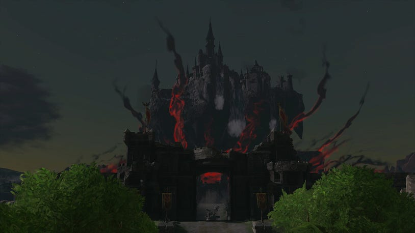

There will be time to check out the landing once you get back. For now, there’s plenty to see both in and on the way to Hyrule Castle, so exit through the north gate under Purah’s observatory.

Reaching Hyrule Castle

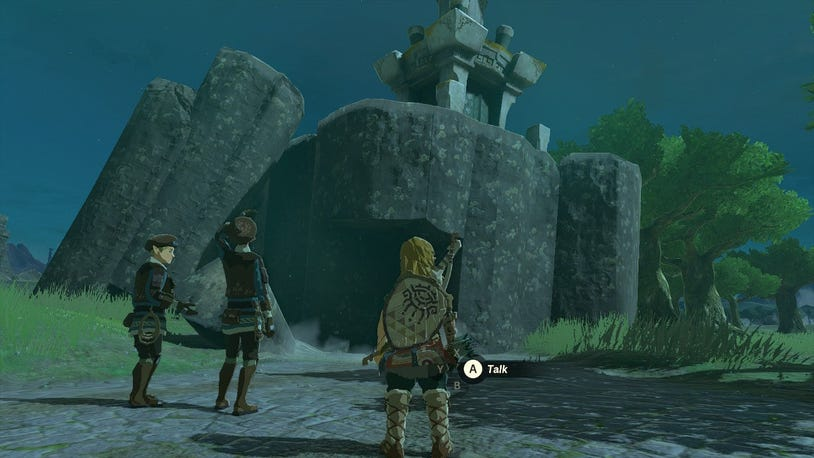

Be sure to take note of the tall ruin that has fallen just outside the gates. Up on the platform is a Steward Construct who will upgrade your Energy Cell Batteries in exchange for Crystallized Charges, the same as the one on the Great Sky Island (though you’ll still have to travel up there for now to use the forge).

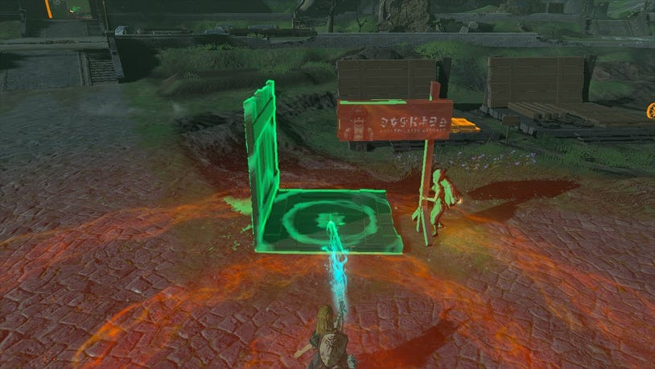

Near the center of the Castle Town Ruins, you can spot a man named Addison trying to hold up a construction sign. You’ll find him all over Hyrule, pledging his (literal) support for Hudson Construction, but needs help getting the sign steady. Luckily there’s plenty of wooden planks nearby to use Ultrahand on to create a support, after which you can tell him to let go. Each time you help, you’ll be rewarded with money and an assortment of items.

While heading through the center of the ruins, you can find a few tents with items to loot if you’re low on weapons, as well as someone investigating a new Shrine.

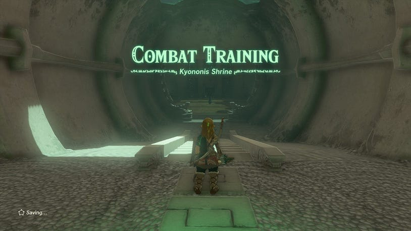

Be sure to at least interact with the Kyonosis Shrine to set it as a fast travel spot, and enter to find a quick tutorial on combat to get you another Light of Blessing.

Kyononis Shrine

Hyrule Castle - Ground Level

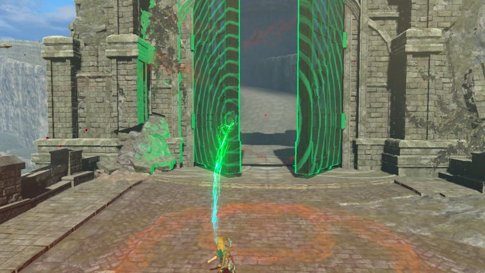

Heading up the path to the castle front gate, you’ll find Ultrahand makes a great door opener, as you can use it to swivel the large gates open.

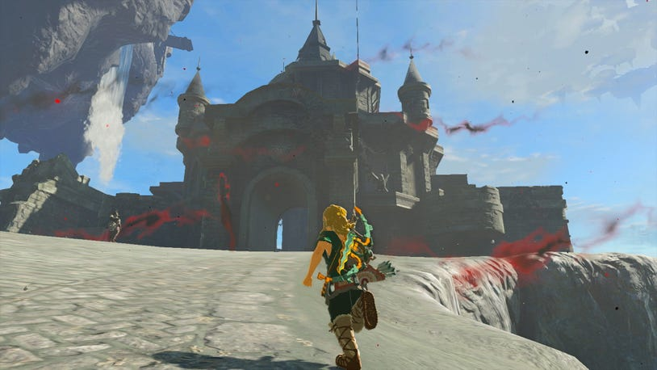

Much has changed since Breath of the Wild… and yet, at the same time, not much has changed at all. The Blight has receded, and you won’t find many enemies left, but the place is still very much in ruin. With no Guardians firing lasers at you, feel free to wander around as you make your way up the path to the First Gatehouse.

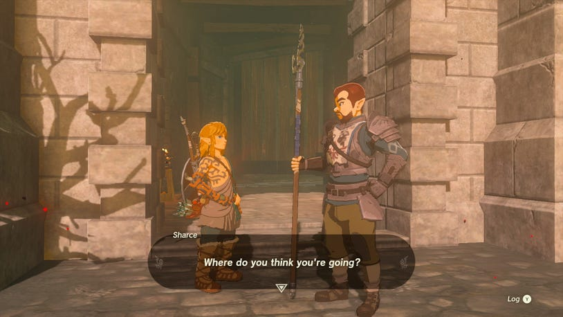

Do note that a soldier in front of the Guard’s Chamber entrance will stop you from progressing inside, but there will be a way to get in later.

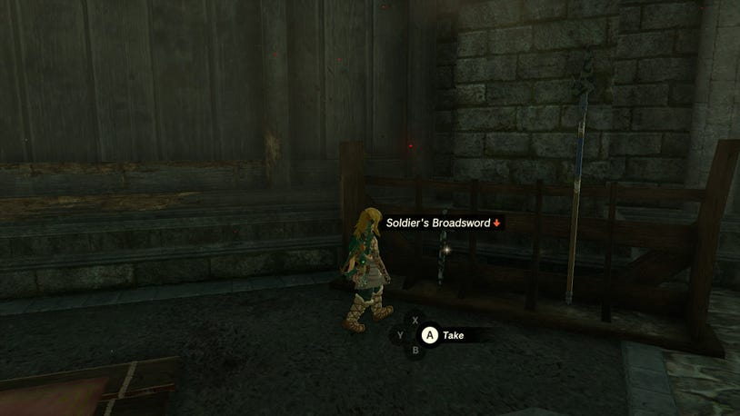

Inside the First Gatehouse, you’ll find a temporary camp with a few weapons, but a soldier here will note that the gloom has somehow corroded all metal weapons in the land, making them less durable than you might be used to. Luckily, you’ll still be able to bulk up any corroded weapon’s durability using Fuse.

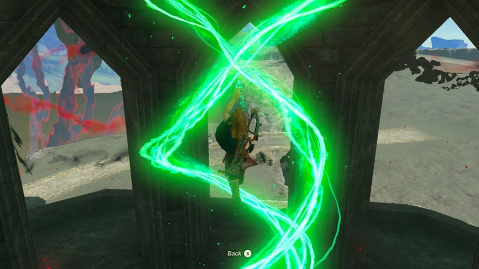

To reach Captain Hoz on the landing above, use Ascend or climb up to the balcony, and then ascend once more to reach a higher balcony where a man in a soldier helmet is supervising the search.

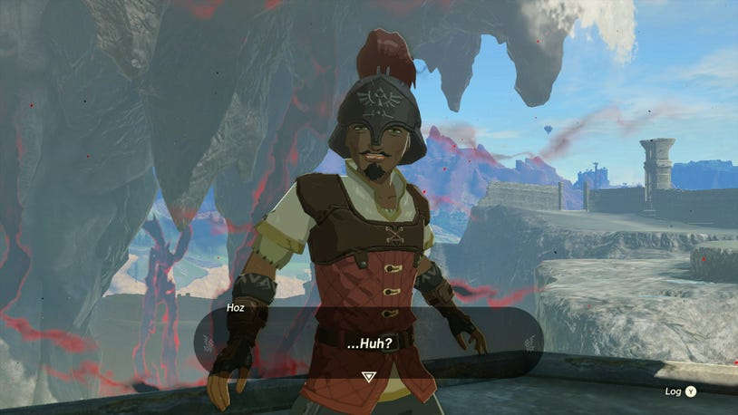

As you fill in Captain Hoz on what’s happened, a curious vision will occur not far away, leading to a change in plans. Hoz will want you to report back to Purah on what happened, so there’s no need to stick around the castle any longer. However…

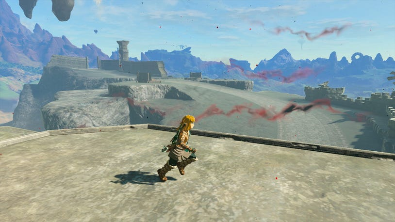

If you want to keep exploring a bit, carefully drop down on the other side of the First Gatehouse, and run straight along the road and up onto a rampart with a broken stone eagle hiding a Korok’s pinwheel.

Central Hyrule - North Hyrule Field Seed 45

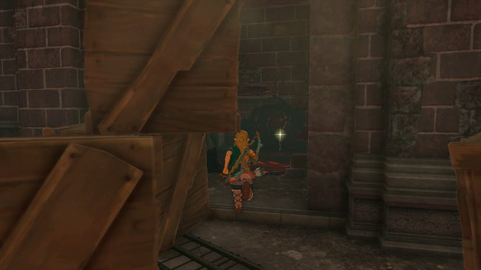

If you travel left of the statue, you’ll find a sloping path down to the ruined Dining Hall, which still has a few choice items to find, including up on a chandelier, and in a gloom-filled fireplace behind some crates full of arrows.

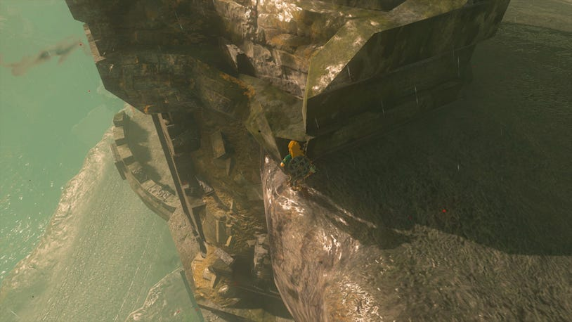

If you look down from the ramparts with the statues, you can spot a balcony below leading to the Observation Room.

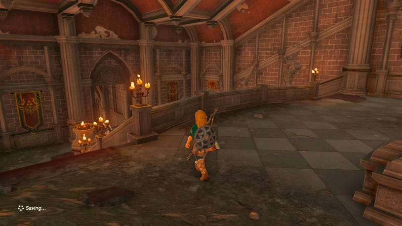

A guard nearby will warn of dangerous monsters ahead, and there’s also a secret passage under the fallen statue, but it’s best to come back for that later when you’re more powerful.

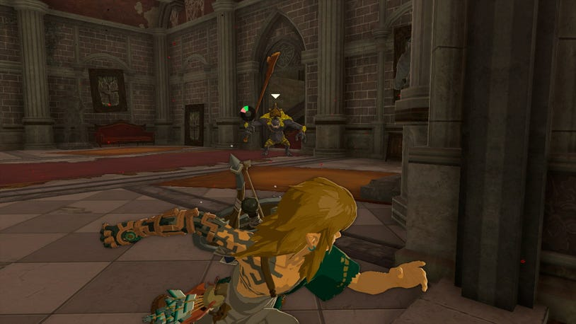

If you want to get a head start on finding good armor, you’ll need to quickly run down the stairs and make a hard left to sprint past some deadly Black Horriblins. Make no mistake, they’ll likely kill you in a single hit if you stand around, but if you race to the end of the left hall, they’ll give up the chase.

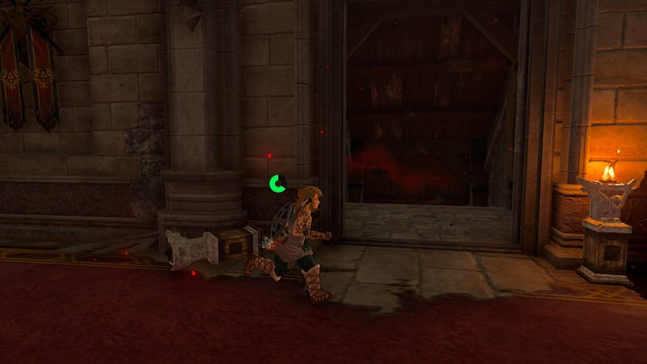

Taking the second set of stairs down to the left will lead to the Guard’s Chamber, and a nearby floor button can be pressed down with a crate or barrel to open a nearby door to the outside.

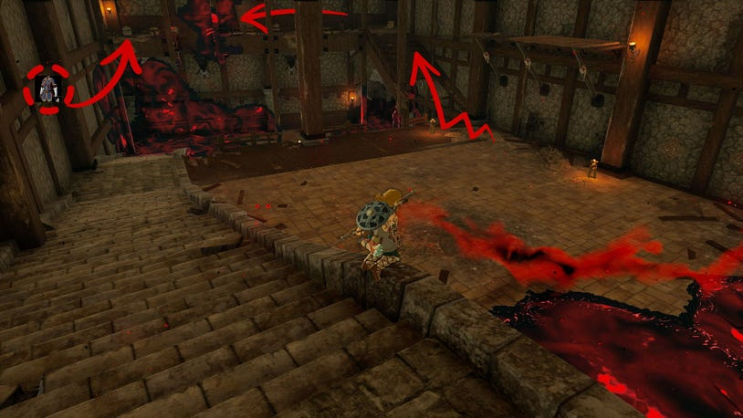

The chamber itself is home to two Black Bokoblins hiding under each stairway, but if you’re quick and sneaky, you can loot several weapons without them noticing. However, the bigger prize is located up high at the back of the room.

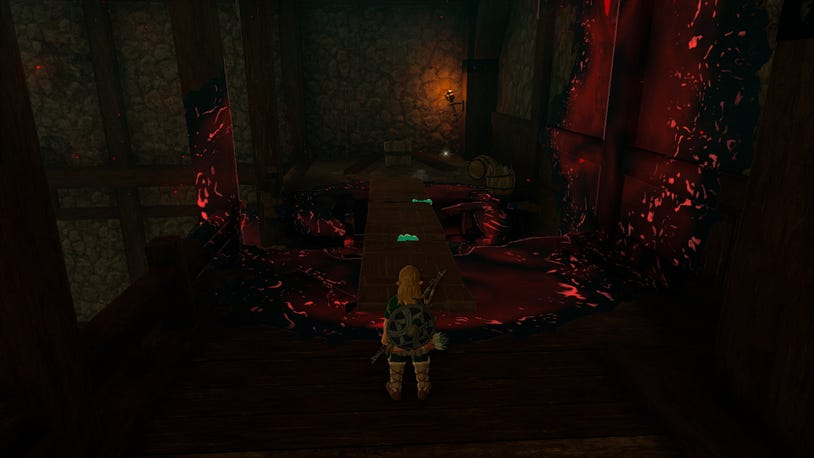

Quickly sprint across the main floor to the broken wooden stairs and climb up out of reach of the Bokoblins, and get up to the high platform. There’s another broken section of floor separating you from a chest in the far corner, but luckily there’s a few wooden boards to build your own safe path across. Loot the chest, and you’ll receive the Royal Guard Outfit, which boasts a nice amount of early defense.

Lookout Landing

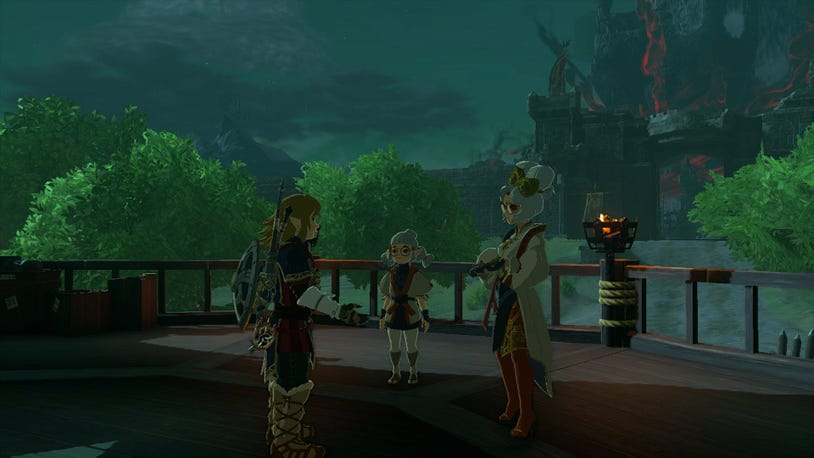

When you return to the base, find Purah back on the upper floor and give her the news. After taking all the events that have happened in, she’ll tinker with your Purah Pad and ask that you help fill it with new Map Data from the events of the Upheaval.

Since the Sheikah Towers are no more, Purah has been hard at work constructing new Skyview Towers to help you out in this mission, but before you can begin, you’ll be asked to get some rest first.

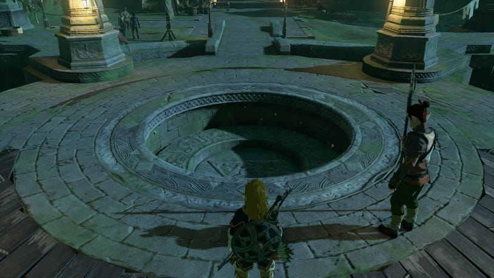

Speak to the soldier in the middle of the courtyard to gain access to the Emergency Shelter underneath Lookout Landing. This handy spot contains many great features, including a Cooking Station, Goddess Statue, and a free bed to use to recover hearts and pass the time. While you’re down here, you should also familiarize yourself with its other inhabitants:

A man named Kiimo sitting with a group of Zonai Ruin Researchers is reading a paper that will clue you in on events happening all over the land

The chef Burmano has a quick Side Quest to undertake, Today’s Menu, and needs an Apple to create a Fruit and Mushroom Mix

An armorer named Kosi is working near a weapon rack that you can grab a few swords from if you ever run low.

The Monster-Control Crew HQ is helmed by Atmus, who stands near a large map of Hyrule and can clue you in on all the different regions and main settlements and cities you can set off to explore.

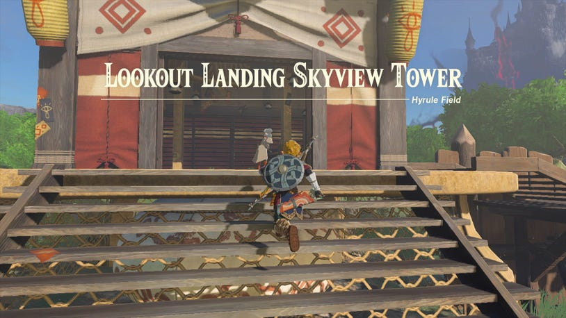

After sleeping in for a bit, return to the landing above and find Purah at the front of the Skyview Tower. Speak to her as they finish tinkering with the tower, and they’ll strap you in for a test run – but not before giving you the much-beloved Paraglider to make a safe landing with.

Lookout Landing Skyview Tower

Skyview Towers are much more important than the Sheikah Towers of old. They’ll still help you fill out the map region by region, but will also help map out the many floating sky islands as well. Not only that, but since you’ll be launched high into the air, you may often find yourself close to a cluster or sky archipelago of islands.

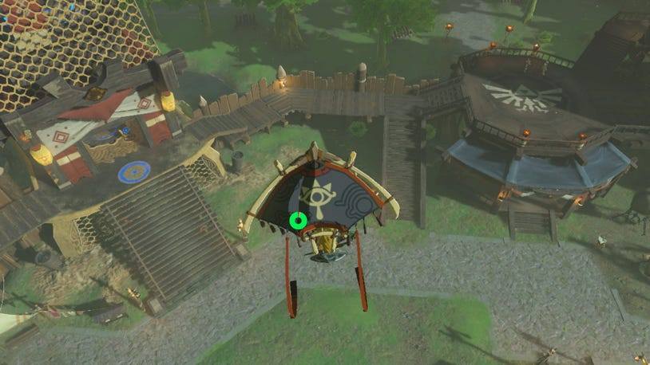

Even if you aren’t looking for islands, you’ll spend a lot of time free-falling, which is a great way to get the lay of the land, and zoom in with your Purah Pad to mark Shrines, Stables, and points of interest to investigate after you land.

Remember that zooming in will pause you mid-flight, so don't worry about crashing into the ground!

After landing back down on the surface, return to Purah to finish your assignment, and you’ll learn of several Regional Phenomena appearing all over Hyrule. They're centered around each of the different race’s main cities: Rito Village to the Northwest, Goron City to the Northeast, Zora’s Domain to the East, and Gerudo Town to the Southwest.

How you choose to tackle these missions is up to you, though it’s hinted that you should likely begin with Rito Village, which our guide will also visit first. However, before that, there’s plenty more to do now that you have your Paraglider. Just around Lookout Landing, there are a few things you should look into:

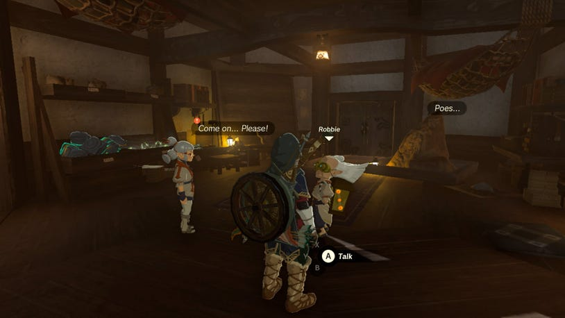

Josha will head downstairs to meet up with the other Sheikah researcher Robbie, who are leading an investigation of their own into the new chasms that have opened up around Hyrule. They have their own main quest you should prioritize next – Camera Work in the Depths.

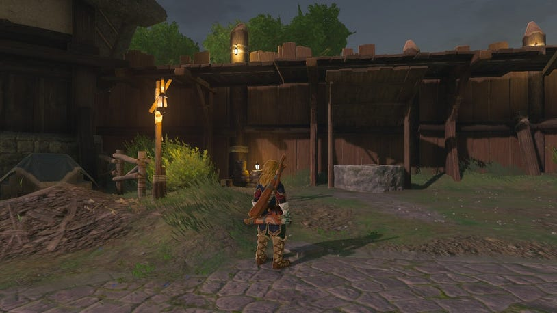

A nearby well in the northwest corner of the camp leads down to a small spring, and a pile of rubble you can destroy to find a chest under the Emergency Shelter holding a Royal Claymore.

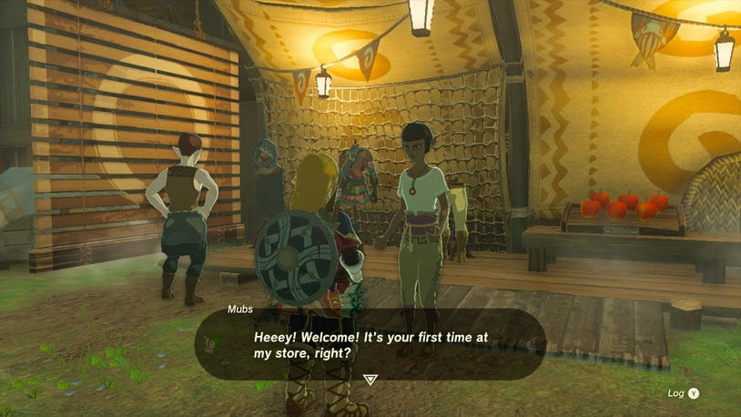

A small stall run by a woman named Mubs nearby sells a basic Hylian Armor Set. Since you already have a shirt and shoes, it’s recommended you sell a few materials (or craft meals to sell) and at least buy the Hylian Hood. As you uncover more towns and help people out, her stores may increase in size, so be sure to check back from time to time!

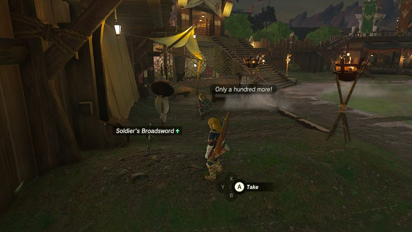

A fighter named Aja is training on the west side in front of several dummies, and has assorted swords nearby you can ask to use that all have different effects. You can grab a Soldier's Broadsword, Knight's Broadsword, and Royal Broadsword for free - but only once.

There’s plenty of other Things to Do First if you want to go off exploring on your own, as you’ll now be able to take to the skies, glide around, and see just how the massive Upheaval has changed Hyrule. If you’re eager to move onto the next quest, we recommend taking on Camera Work in the Depths first, and then investigate the Regional Phenomena towards Rito Village.
