29. Crisis at Hyrule Castle - The Floating Castle

After completing all four of the temple dungeons in each region, you'll be able to return to Purah at Lookout Landing to give her the news. However, upon your return, you'll find all eyes on the floating Hyrule Castle to the north, with the potential Princess Zelda sighting on everyone's lips.

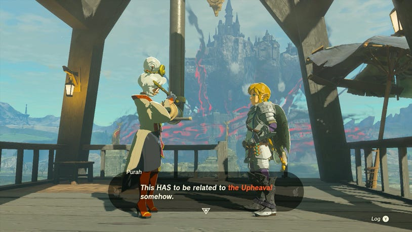

Head up to the giant telescope above Purah's workshop to speak with her and relay the news of the Regional Phenomena, and you'll be interrupted by the arrival of a Blood Moon.

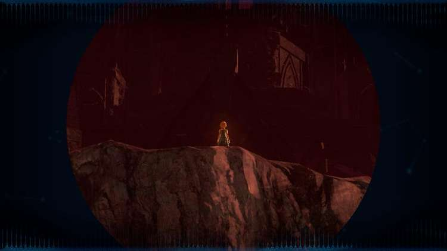

During this event, Purah will spy what looks to be Princess Zelda once again appearing at the castle, only this time she's high above, and you'll need to find a way to get to her.

Be warned - the approaching quest will be a test of your power gained thus far, and will have you facing some tough threats. We recommend having at least 10-15 Heart Containers, and either one half or a full second wheel of Stamina. Similarly, it's highly recommended you upgrade your favorite armor set to at least level 2 or even a few level 3 pieces if possible.

Before you find a way up to the floating castle, there's one special item that might prove useful in the fight ahead, and it's located on the ground level:

Where to Find the Hylian Shield

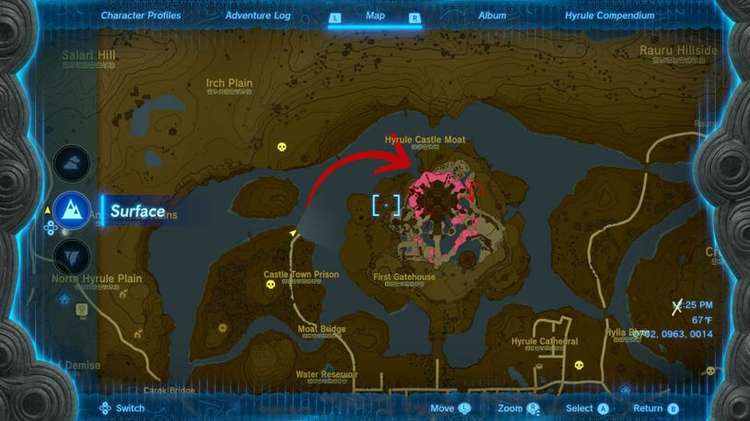

The Hylian Shield has been secretly placed in the Hyrule Castle Docks, which are still accessible even with half the castle up in the air. There are two main points of entry, depending how you want to approach:

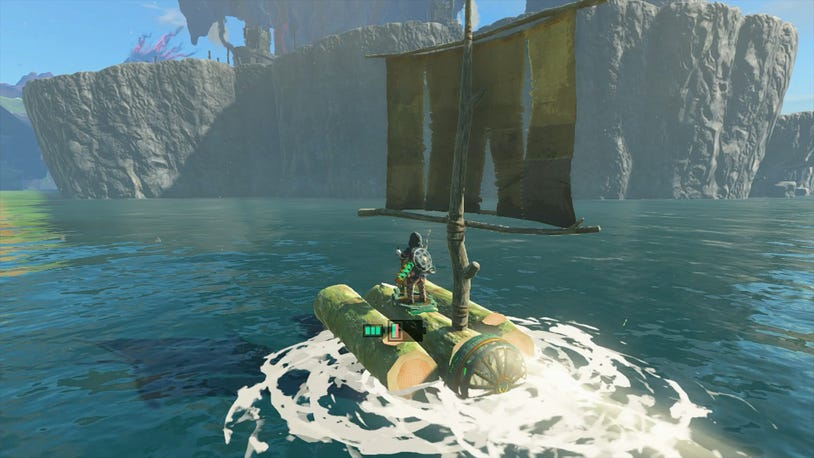

The first method of approach is by water. The easiest way to do this is by way of the Castle Town Prison, on the western island next to the castle itself. Look for a dock on the far north tip with a raft, and you can either add some Zonai Devices like fans and steering sticks to help navigate, or use fuse a Korok Leaf to your weapon.

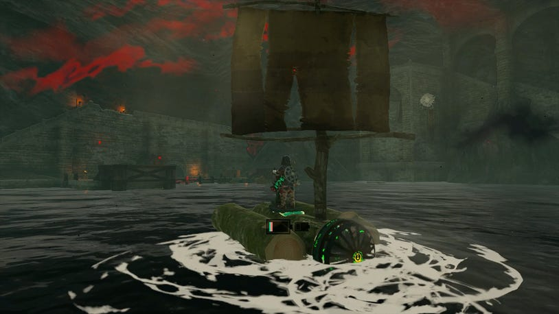

Inside the large cave, you can spot inner docks along the water, with a path along the left leading up the stairs to a higher path, up to the highest platform above the docks where the shield is kept.

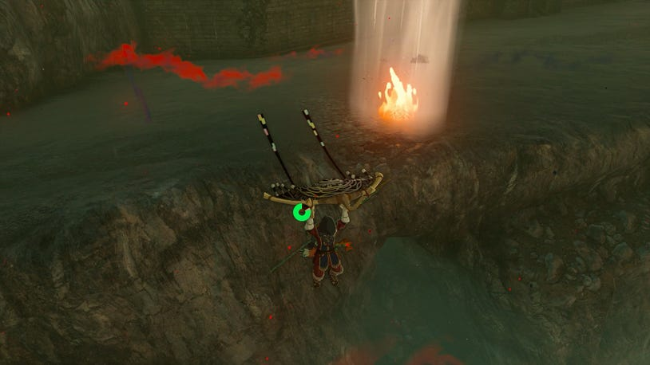

The second method is by dropping down from the ruins of the castle itself to find the hole left behind from a secret passage. Luckily if you know where to look, it's not too hard. Run along the eastern side of the chasm exterior just a bit west of the ramparts, and look for a large flat piece of ground with a smallest hint of a cobblestone path leading to the chasm edge. Just below this patch is a small cave opening that leads down to the docks.

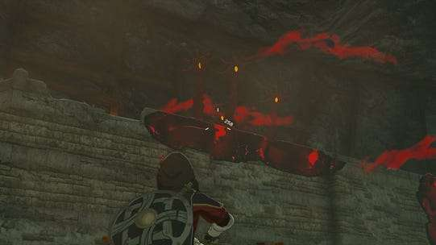

Be warned - A fearsome foe guards the docks. As you approach from the water, a group of Gloom Spawn Hands will rise up from one of the upper landings and quickly race over to attack you, but they can also follow you if you are coming from the upper passage (though they may not notice you as fast).

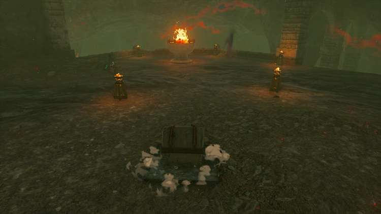

At the top platform above the docks, look for a large unlit brazier, and toss a Fire Fruit or similar elemental item into the large unlit brazier to solve the puzzle. This will cause a chest to reveal itself, and inside you'll find the legendary Hylian Shield, which sports a whopping 90 Defense! It will last far longer than any other shield in the game -- but it's not exactly unbreakable.

Getting to the Floating Castle

After spending time exploring the world, enhancing your abilities, and generally getting better at the game, you should have a lot of abilities for getting up to Hyrule Castle by this point. Any strategy can be a viable one, but here's a few to get your started:

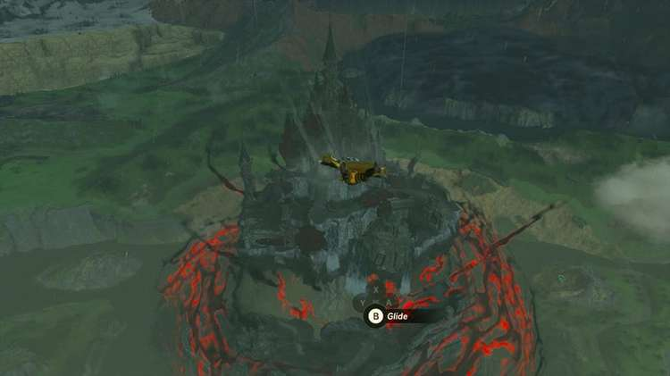

Launch out of the Lookout Landing Skyview Tower and start gliding over to the castle. If you've gained the full Glider Armor Set, your increased mobility should send you most of the way before needing to paraglide the last bit, and having a bigger stamina wheel helps.

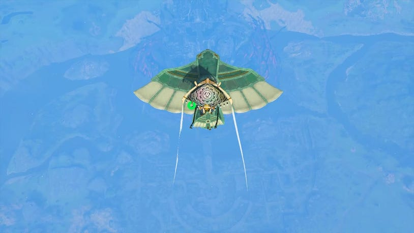

If you're worried about stamina, you can open the paraglider and then quickly drop a glider Wing device from your inventory. If done at the right momentum, it will appear right in front of you, allowing you to drop onto it and ride it the rest of the way.

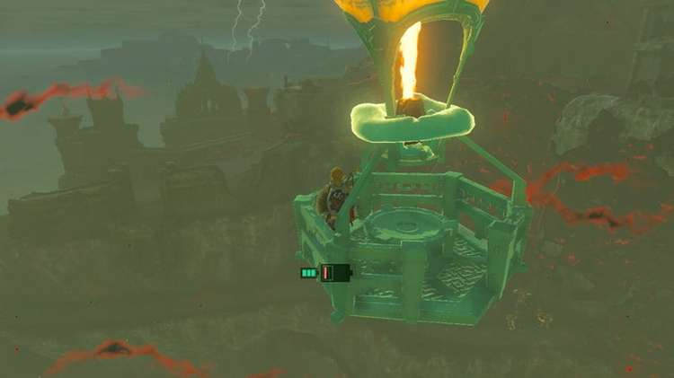

With enough battery on your Energy Well, you can also simply build a hot air balloon right under the castle with Ultrahand, put in a Flame Emitter, and ride it up until you can leap out onto the floating castle.

Floating Hyrule Castle Walkthrough - TotK

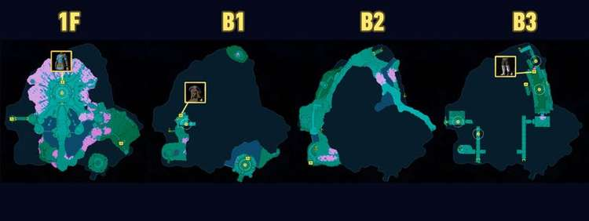

As you approach the edge of the castle, Zelda's voice will call out to Link, beckoning him to come to the Second Gatehouse.

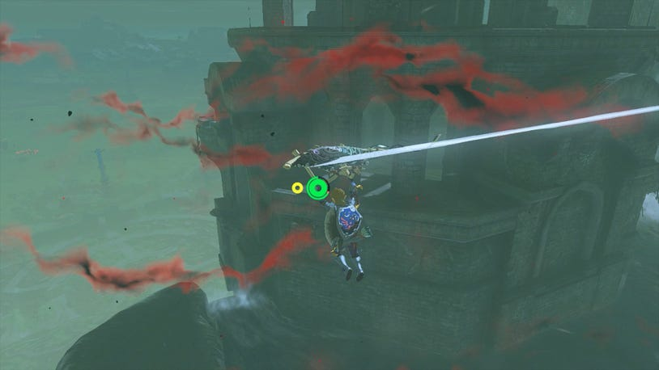

While there's a good chance you may already be closing in on it from the air, if you arrive from a different area, you'll want to head to the southern tip of the floating castle for the large tower structure with a small drawbridge.

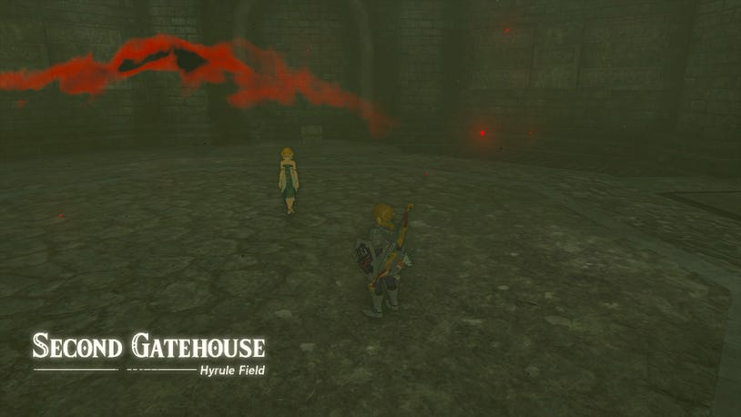

Zelda can be found inside the gatehouse, which you'll need to hop down from the opening on the second level. However, once you approach, she'll vanish, and a scourge of enemies will appear in her place.

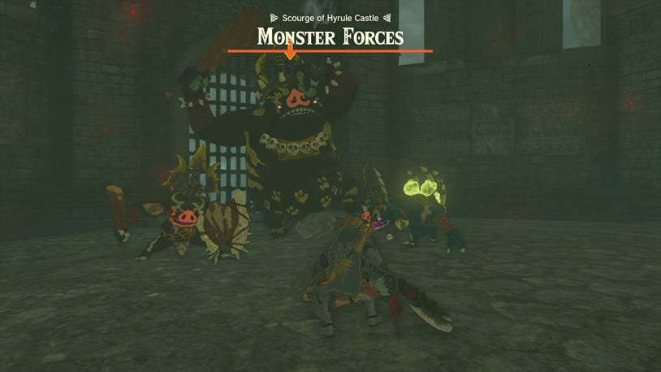

This group of enemies consists of a Boss Bokoblin and several regular Bokoblins that are all likely to be high level and sporting several powerful weapons. In such close quarters, things can get deadly fast.

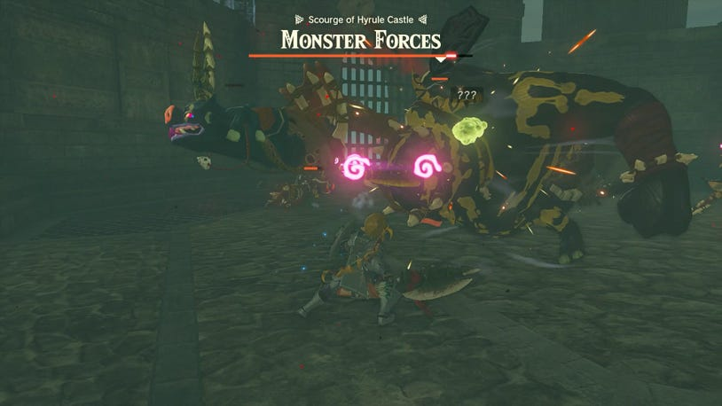

Try using a Muddle Bud early on to let the Boss Bokoblin start raging on his companions, and then take out the Bokoblin with the pack full of Yellow Chuchu Jelly before he can start tossing them.

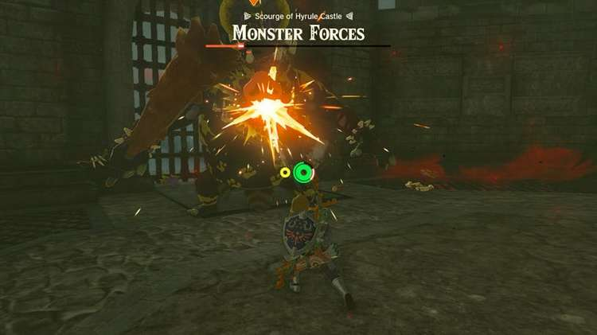

You can use the electric jelly in addition to fire elemental materials to get the Bokoblin army to drop most of their weapons, then pick off the smaller fries before turning your attention to the boss. If you need extra gear, there's a Knight's Broadsword by one of the gates, and a Royal Halberd in a chest on the opposite side.

To the Library

Since Zelda isn't here, consult the map to find that it's now pinging up the upper northeast corner of floor B3. If you remember the terrain from Breath of the Wild, you may remember that part of the map being the old Library.

While it may seem like there's a corridor below the second gatehouse leading to the Library, there's a waterfall in front of the entrance that makes getting to it nearly impossible.

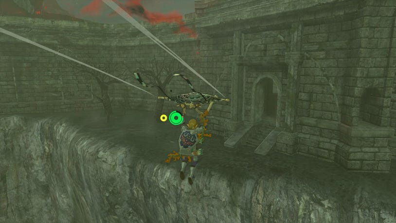

Instead, Ascend up through the gatehouse to the roof above, and start heading east and then north to a rampart wall that has a room with a chest inside holding a Royal Shield.

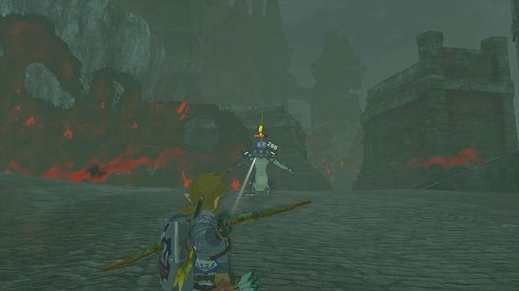

Looking across the main pathway on the other side, you can spot two Blue Lizalfos patrolling, and they can be sniped individually when moving apart. Their long, katana-like horns also make great fusing material you may want to make use of.

If you head over to a balcony overlooking the lower path to the northeast, the stone section will crumble right where a Soldier's Spear is, sending you down towards a group of Moblins.

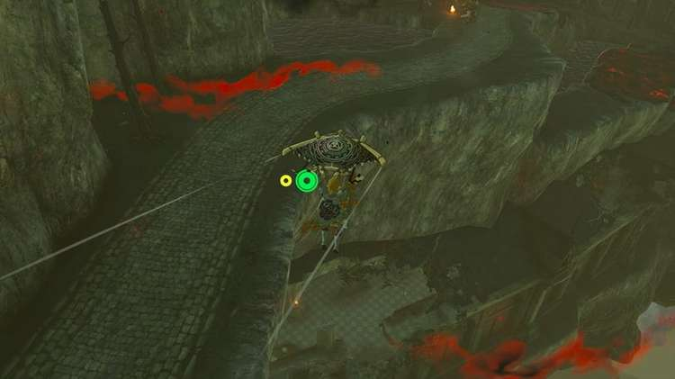

However, if you pull out your Paraglider and drift down, you should be able to spot the broken roof of the Library right below the Moblins, and make out the shape of Zelda waiting within. Glide over to bypass the enemies and drop down into the next room.

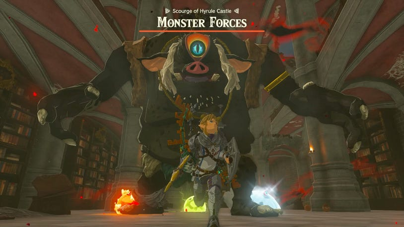

This time, a Black Hinox will spawn, flanked by three different elemental Giant Chuchus. This can be a tough fight if you aren't prepared, so be ready to act quickly.

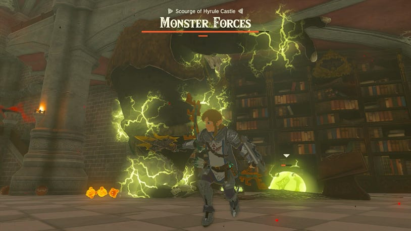

Sprint away a good distance and detonate the elemental Chuchus when they are near the Hinox to damage it, and then make use of the stun to aim for the giant's eye.

If you aren't fast enough, be ready for the Hinox to dig into the ground and pull out explosive barrels. You can recall these back to him if he tosses them, making them a handly tool to deal more damage.

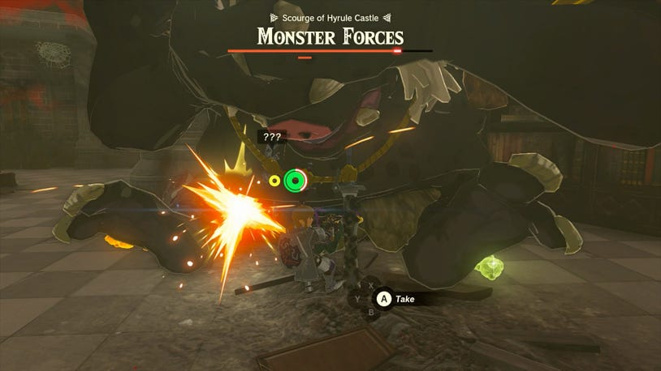

Always go for aimed shots at his eye, then rush in with a powerful weapon and focus attacks on his left foot (his right has a metal bracer on it that will stop your attacks).

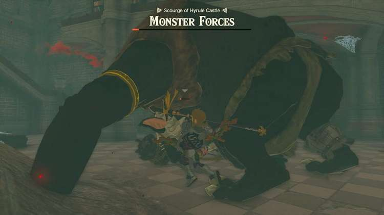

As soon as he starts to get up, run through his legs and away from him quickly, as the Black Hinox will usually follow up by headbutting the ground with its massive horn, and you don't want to be anywhere near that.

Once defeated, the Hinox will drop an assortment of weapons, including a Kinght's Bow, Royal Guard's Shield, and Knight's Claymore that you can fuse with the Black Hinox Horn that was dropped.

Before leaving, there are a couple of secrets present in Breath of the Wild that still exist in this version of Hyrule Castle:

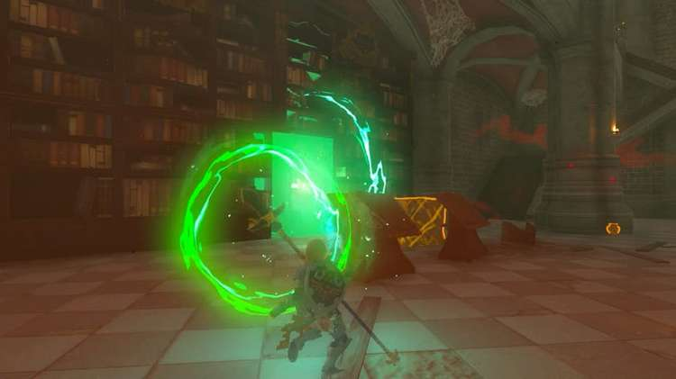

Look along the west wall for a fake bookcase you can Ultrahand away to find a small stone room that holds a Knight's Claymore, and a chest at the far end with a Shard of Dinraal's Spike - a fantastic fuse material to give your weapons fire damage.

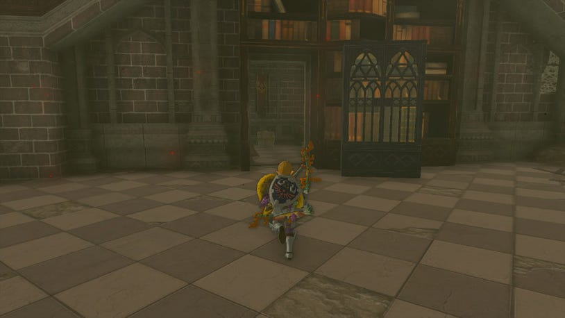

At the north end of the Library, another fake bookcase below the stairs leads to the King's Study, which holds a Royal Broadsword, and a chest containing the Royal Guard Boots.

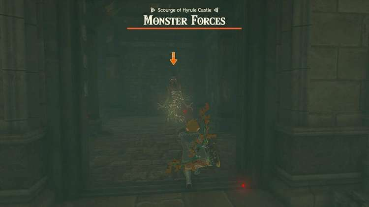

Zelda is now pinging you from the stairs leading out of the Library to the north, so give chase into the narrow staircase leading up to level B2. Before you can reach it, another horde of enemies will be summoned, including several Gibdos and a Gibdo Moth.

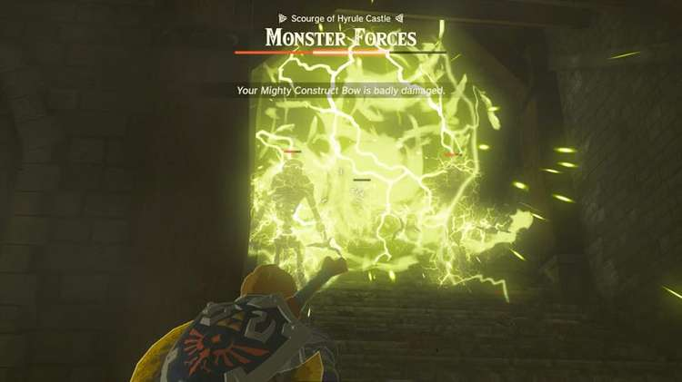

If you have any Electric Chuchu Jelly left from earlier, fuse it to your arrows now to quickly stun and weaken the group, letting you finish them off before they can become impervious once again. Fusing the dragon shard also works here, as they will become weak to fire.

To Princess Zelda's Room

As you exit onto the outer walkway, you can check the map to find Zelda is now pinging the room in her tower on the west edge of the map.

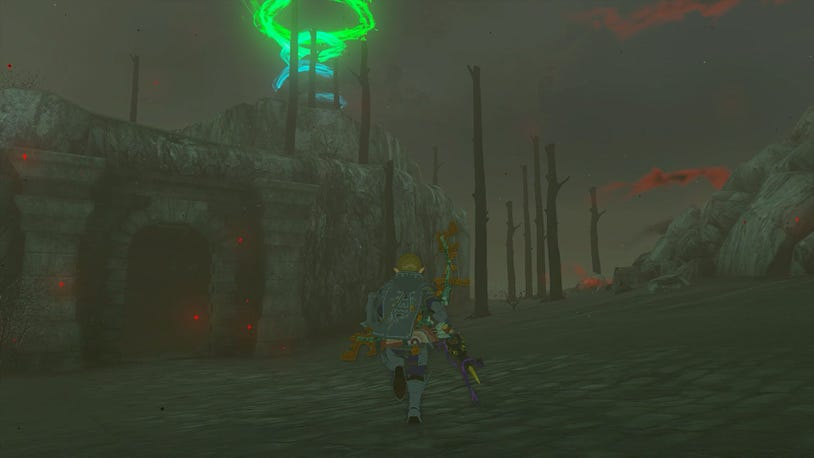

Before moving on, check the hill above the Library exit to find the Serutabomac Shrine, allowing you to leave and revisit the castle much more easily.

Serutabomac Shrine

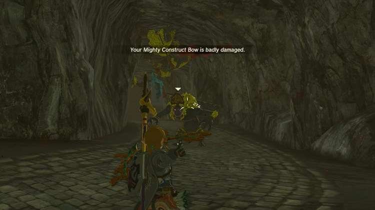

There's a long path leading to Zelda's tower room, and involves going through a narrow tunnel lined with many Black Horriblins waiting to ambush you.

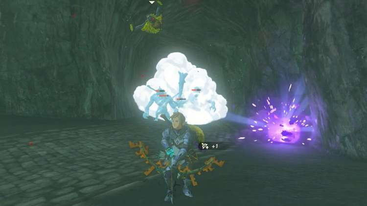

These enemies can be a pain to deal with in great numbers due to the constant jabbing and boulder tossing, which makes ranged elemental attacks good for weakening them.

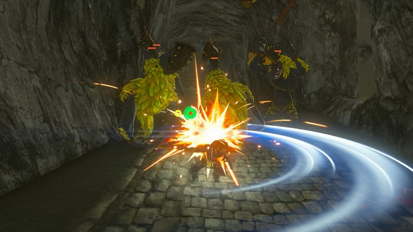

Using ice or electric elemental materials with a small radius of effect can often stun large groups of them and send them tumbling to the ground, letting you rush in with wide sweeping weapons to charge spin or whirlwind attacks to catch the group of them in one big attack.

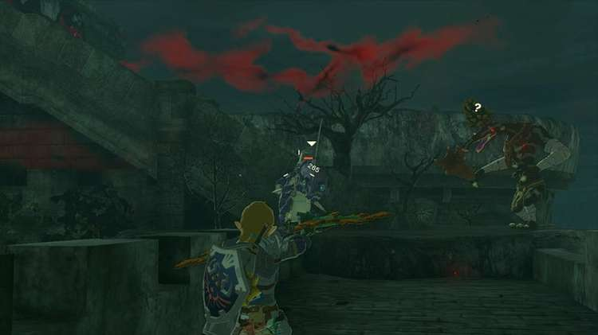

Past the Horriblins, you can spot a path going further with an Ice Like, but it's better to avoid it for now and climb the ramparts to the right. The path along this rampart leads to a Lizalfos and Moblin combo, guarding the stairs up towards Princess Zelda's tower.

Try to snipe the Lizalfos quickly, then hit the Moblin with a strong two-handed blow to send him careening over the cliffisde and out of your way.

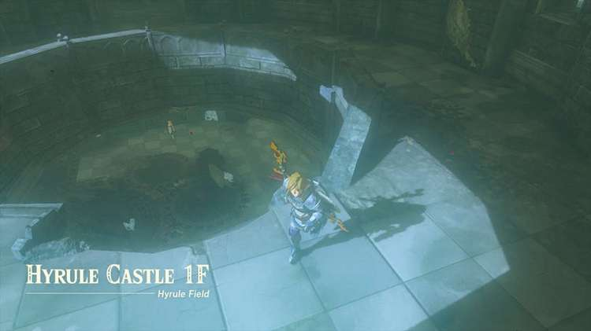

Deal with on more Lizalfos at the top of the stairs, and then use Ascend to climb up the tower and drop into Princess Zelda's Room.

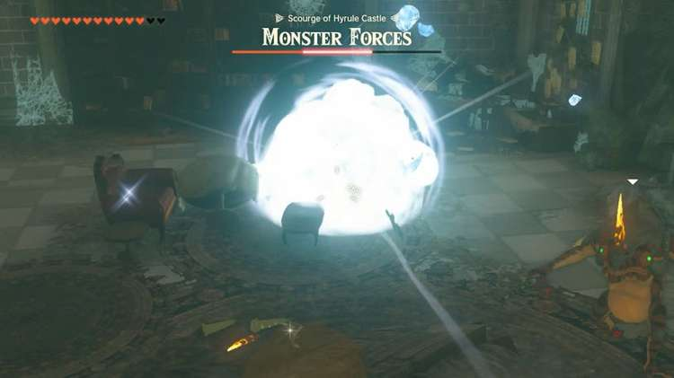

When she disappears this time, three Fire Lizalfos will appear, which can turn the small room into a barbeque unless you act fast. Quickly backpedal away from the trio, and ready a bow with Ice Fruit or Ice Chuchu Jelly on your arrows, as the ice effect on fire enemies will evaporate them instantly.

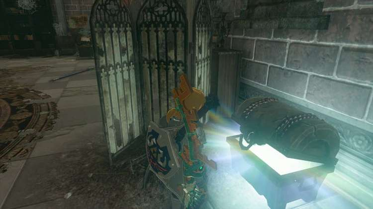

Before leaving, be sure to check above the fireplace for a Royal Guard's Bow, the nearby collapsed corridor for a Royal Guard's Claymore, and for a chest behind a small screen in the corner of the room that holds the Royal Guard Cap Armor.

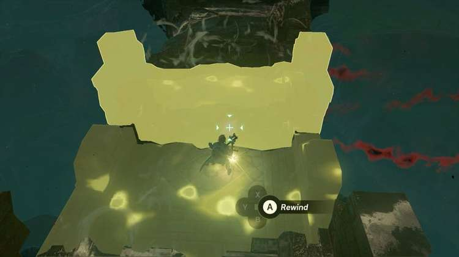

You can also exit the room and Ascend to the area above to find a walkway to Princess Zelda's Study. the bridge will start to crumble as you cross, but a quick use of Recall will keep up upright long enough to jump to the other side.

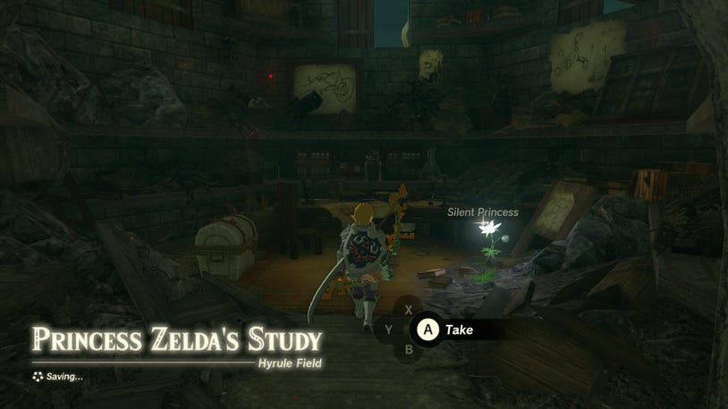

Here you can find a Silent Princess flower alongside another Royal Guard Bow, and a chest holding a Royal Guard's Sword.

To the Lower Halls

Consult the map again to find your next point of interest, far below Princess Zelda's tower on floor B3. The only entrance is through an opening along the cliffs below the tower.

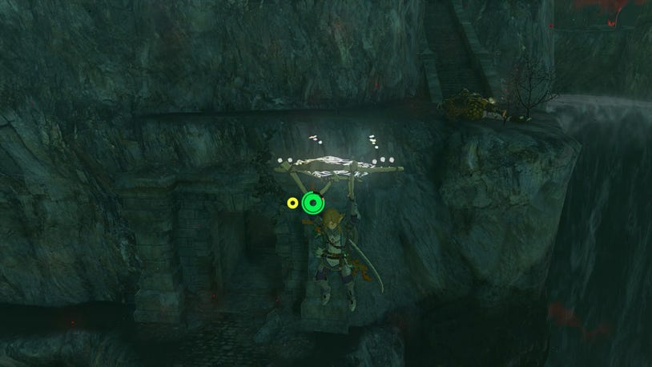

Paraglide down and look for a lone Moblin guarding the entrance down a flight of stairs. The entrance blends well into the rocky cliffs so be careful as you descend.

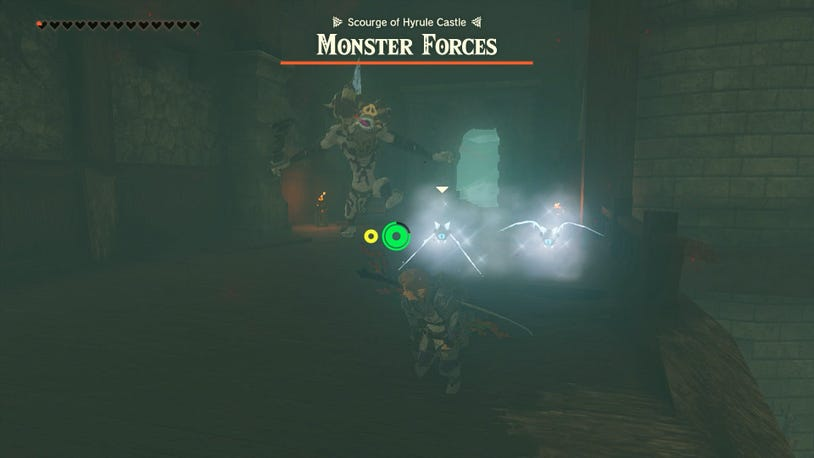

The fight in this room can take you by surprise, as it look at first like there are only a few Ice Keese to deal with. What you might not be expecting is the Silver Moblin who appears behind you, and can easily kill you in a single hit if you don't have good armor or a lot of health.

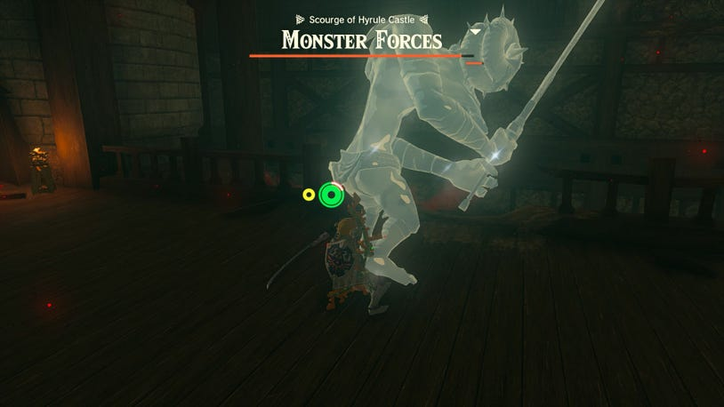

Run forward to get away from his ambush and defeat the Ice Keese, and use their parts to freeze the Moblin, or use electric materials to get him to drop his really strong weapon. As long as you keep him stunned or off-balance, you'll be able to press the attacks to stop him from going the offensive.

Once defeated, you can also check the pit below for more Royal Guard Weapons, as well as the collapsed tunnel.

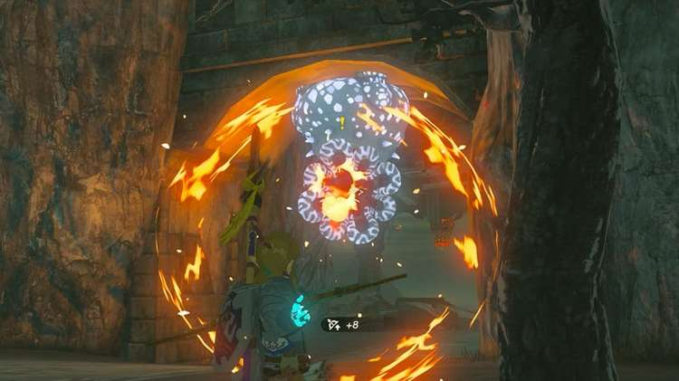

Zelda will next appear not too far away in a long corridor, but one you can't reach from the isolated room. Ascend back up to floor B2 to the outdoor walkway, and defeat the Ice Like guarding a low arch by hitting it with fire-infused arrows to stun it.

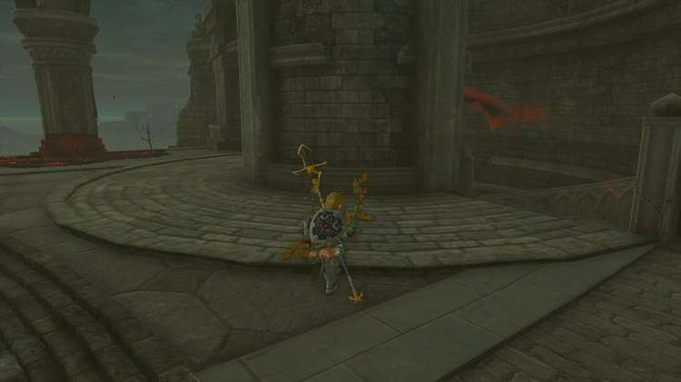

Once you spot a Fire Like not too far ahead, head right to find a spiral staircase down to the long corridor.

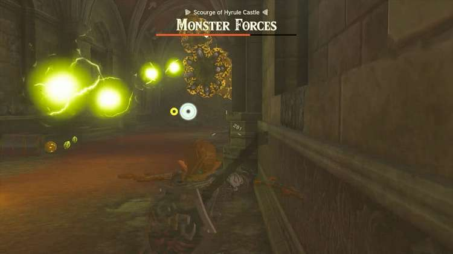

Here, several Electric Likes will appear down the hall, and they'll each start blasting slow-moving electric orbs in your direction. Stick to one side of the corridor to bait out the orbs, then move to the opposite side and advance to stun one when they reveal their weak spots.

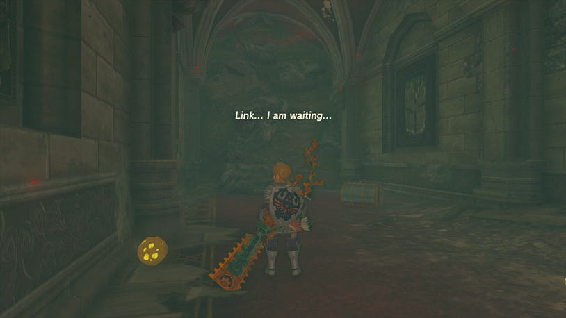

With the Electric Likes defeated, you'll get one final message to reach Zelda, and she's at the main Sanctum.

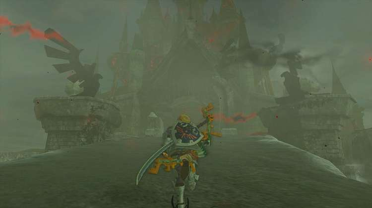

Ascend up from the corridor, and make your way to the large throne room in the center of the castle's main path.

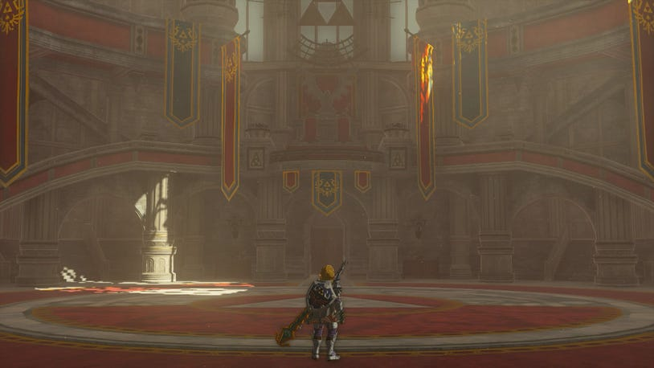

You'll meet Princess Zelda one last time, and finally find out the truth of all those Princess Zelda sightings across Hyrule. The true force behind this darkness will reveal himself, and set his puppet against you in a boss fight.

Boss Fight - Phantom Ganon

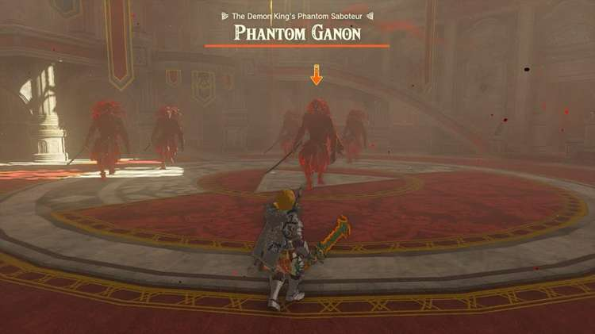

The Demon King's Phantom Saboteur is a force to be reckoned with. You may have actually stumbled upon this foe before, if you've managed to defeat any of the Gloom Spawn Hands that appear across Hyrule. If you have, you know most of what to expect for this encounter.

Unlike other encounters with Phantom Ganon, this one comes with backup: in the form of four other phantoms that all have their own health bars. To make matters worse, they'll attack you fairly aggressively, charging one after the other with powerful damaging strikes.

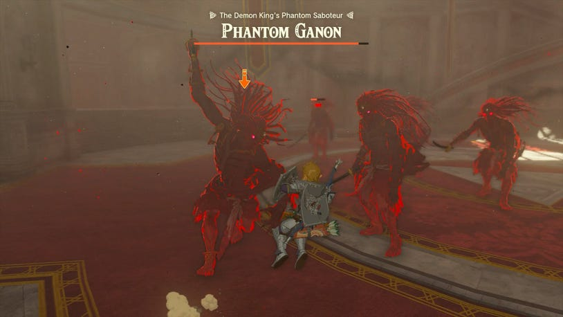

When they first draw close, stand your ground (with a shield if possible), and let one charge. They most often use their charging attacks to fly at you, pause for a moment, and then deliver a sweeping horizontal or vertical strike.

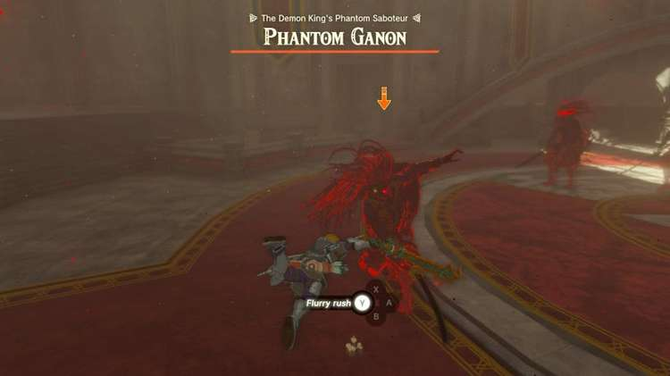

Watch for the way Phantom Ganon angles his blade to know whether to backflip or side hop after a short delay, and try to activate a Flurry Rush. This allows you to expend a fast attack rush without worry of being attacked by the others. You can also swap to a higher damage weapon and use it for the flurry rush, regardless of which weapon you're holding when you dodged.

If you miss the dodge, you might still be able to block the blow, but be ready for another Phantom Ganon to quickly rush in for another attack. This can happen back-to-back, multiple times, so be ready to have to fend off multiple threats, and tap ZL to swap targets to the next incoming fighter.

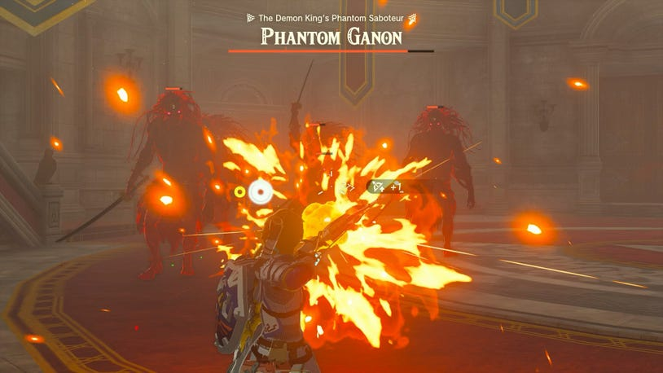

Note that the Phantom Ganons aren't effected by frost, electricity, or other status effects from materials like Dazzle Fruit or Muddle Buds. This will be a pure fight based on your own powers, so mastering the Flurry Rush is the best path to winning this fight.

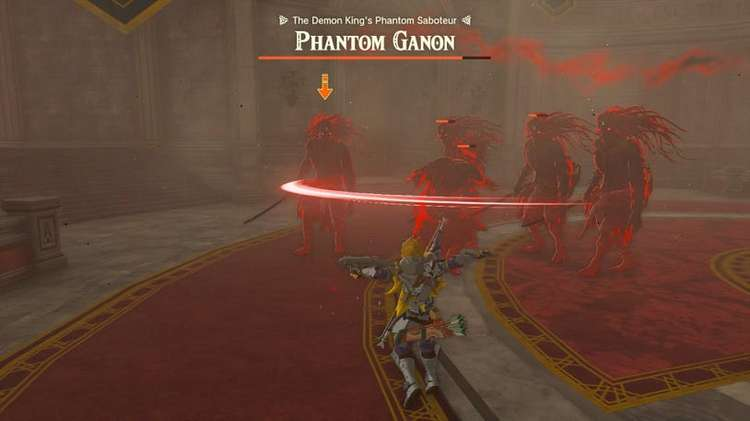

If you're at close range, a Phantom Ganon may opt for a charged spin attack rather than rushing at you, so be prepared for the larger spinning blast that can hit from all sides.

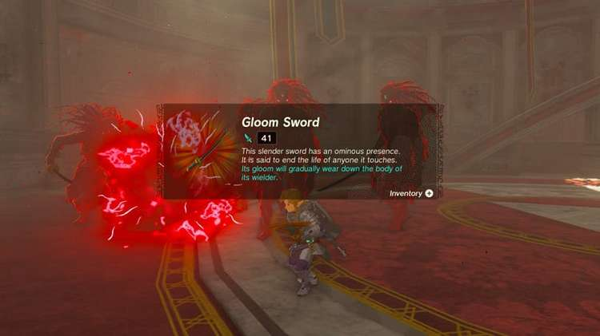

As you wear them down and defeat them one by one, they'll start dropping their chosen weapons, Gloom Swords and Demon King Bows. These can be effective weapons if your own start breaking -- just be aware that the Gloom Swords will take a toll on your health, and unless you have a good amount of Sundelion-infused meals, you may end up losing too many of your hearts.

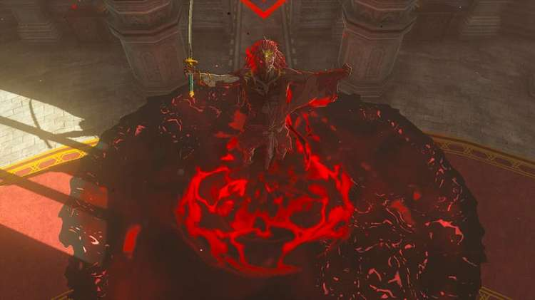

Once you defeat the first wave, the Phantom Ganon army will regroup, with the one in the center drawing power to create a pool of Gloom that will slowly emanate outwards. You'll want to stop this at all costs, or risk having the entire arena covered in health-sapping Gloom.

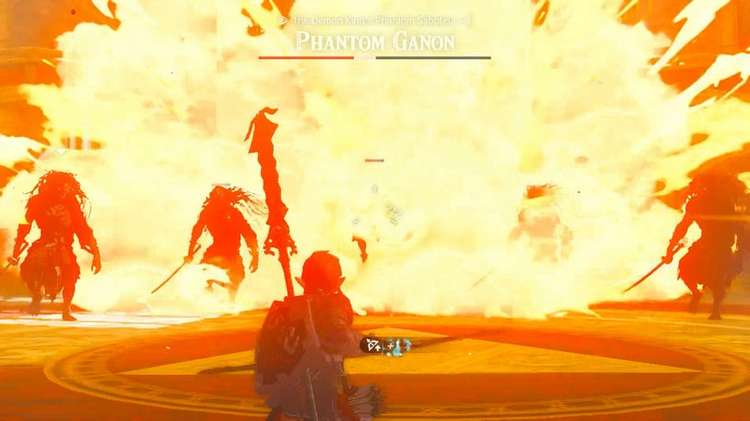

When the second phase begins, immediately swap to some strong materials to infuse your arrows with, and take aim at the center target. Bomb Flowers, Rubies, Sapphires, Topaz can all deal massive damage (and at this range won't hurt you by accident). It should also stun the lead Phantom Ganon to make him stop creating Gloom for awhile.

Once they've taken enough damage, the Phantom Ganons will regroup and start creating new weapons -- starting with a large two-handed club.

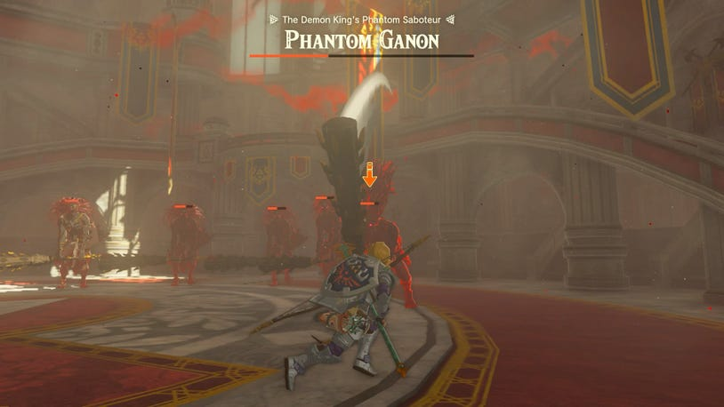

Instead of running at you to slice with swords or use spin attacks, they'll now perform leaping slam attacks that will impact a sizeable radius around them, making perfect dodges to the side more imperative than ever to avoid the blast.

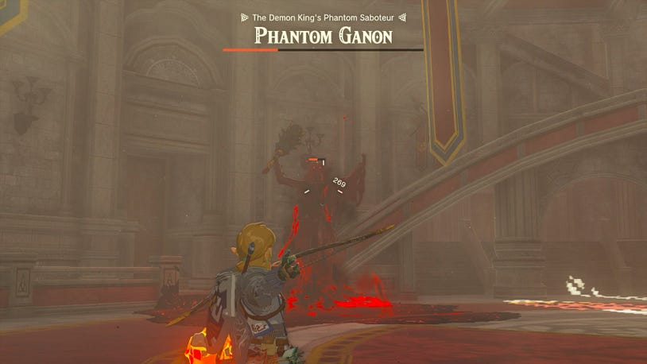

As you continue to dodge and counter the new club-wielding foes, make sure you keep all five targets in front of you when possible. The moment you spot one of them turn into a floating orb and fly off to the side, pivot and either loose some arrows or sprint over and attack while the Phantom Ganon tries to summon more Gloom.

When their combined health gets to a very low level, they'll once again be dismissed and regroup back at the center, this time wielding powerful spears. They'll have a lot more range when flying over to attack now, but at least you won't have to worry about whether to dodge back or to the side.

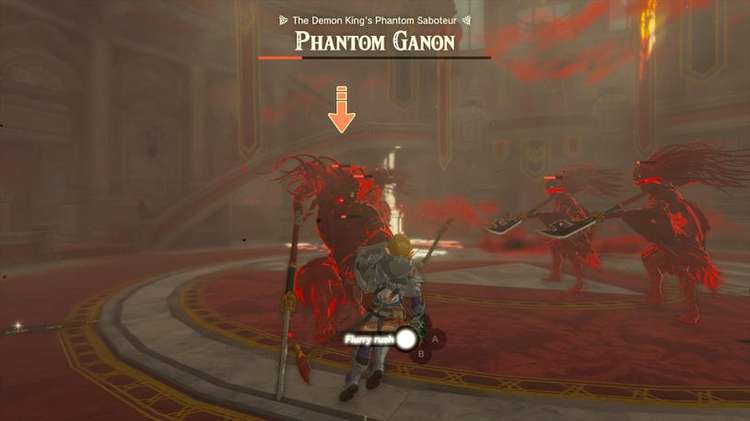

Prioritize dodging to the side each time one of them charges you, and keep a watch up for any stray phantoms trying to summon Gloom to overwhelm you with.

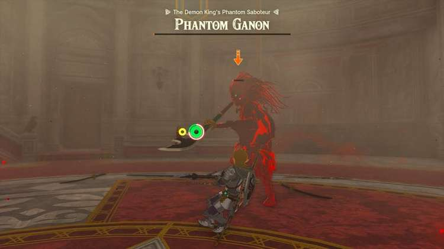

By this point, they should be starting to dwindle in numbers, and you can start pressing the offense by taking the fight to them, rather than waiting to be charged. Just don't get too overzealous and leave yourself open to getting hit from the sides if you don't have every remaining phantom in view.

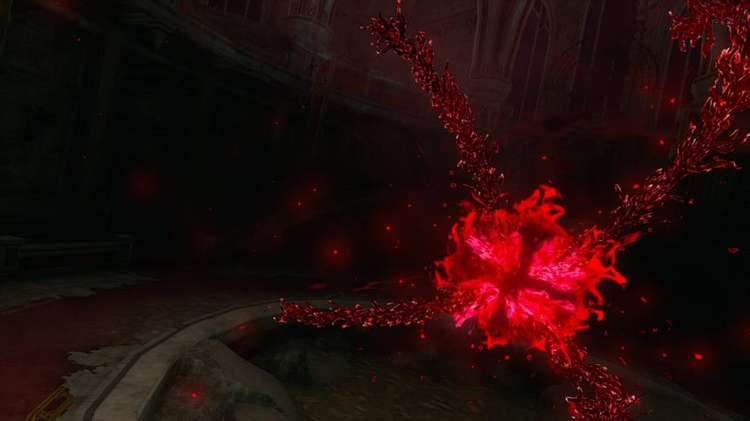

When you at last defeat the full group a second time, the true Ganondorf will appear once more to try and repeat his old trick of destroying your body with gloom, but this time you have backup.

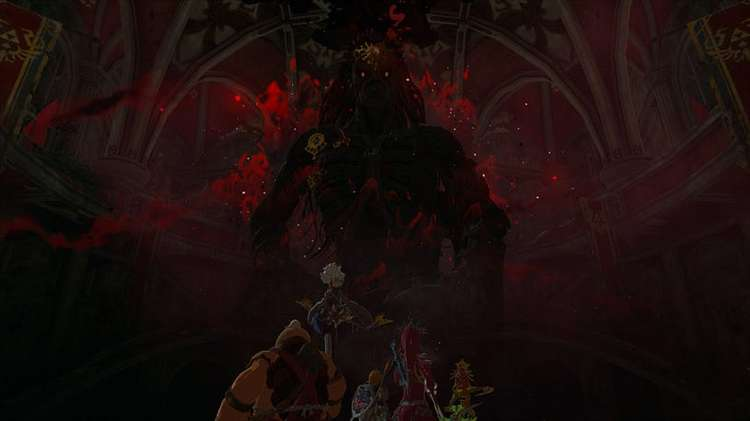

After a lengthy scene, Ganondorf will retreat, leaving Hyrule Castle desolate and empty. Your team of heroes will wisely decide to regroup at Lookout Landing, and bid that you do the same.

How to Get the Champion's Leathers and Dusk Bow

Before leaving the Sanctum behind, there's a few last things to take care of here.

If you snooped around your old house in Hateno that has also become Zelda's House, and found her secret workshop down in the well, you may have read a note teasing the location of your old Blue Champion Tunic.

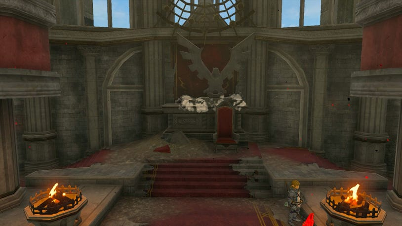

It's actually here in the Sanctum, so head up the stairs to the throne area, and look for the two unlit braizers here. Hit them each with a Fire Fruit or swing from a fire-infused weapon to light them up, and a secret panel will open behind the throne.

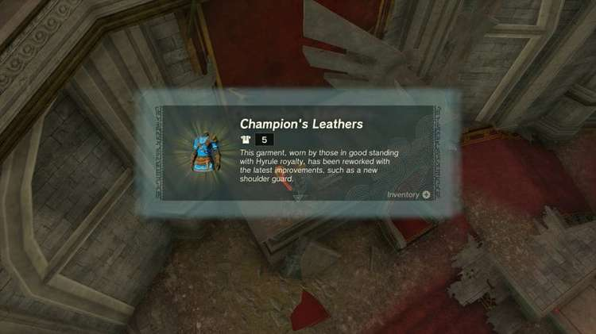

Open the chest, and the iconic (and upgraded) Champion's Leathers will be yours!

Champion's Leathers

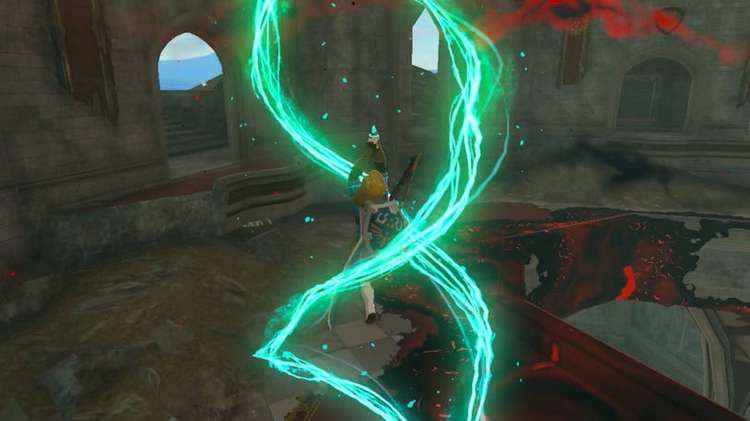

But that's not all! Head up to the top of the Sanctum by taking the stairs, or by using Ascend, and keep climbing upwards to reach a belltower high above.

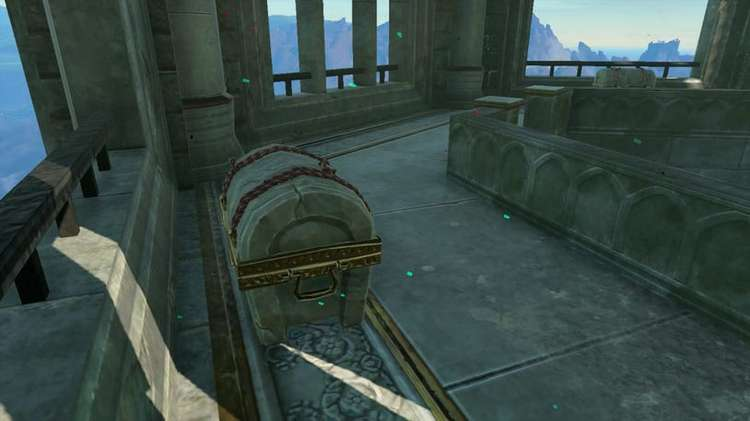

Here you can find a few chests with more rare valuables, but there's still more to find.

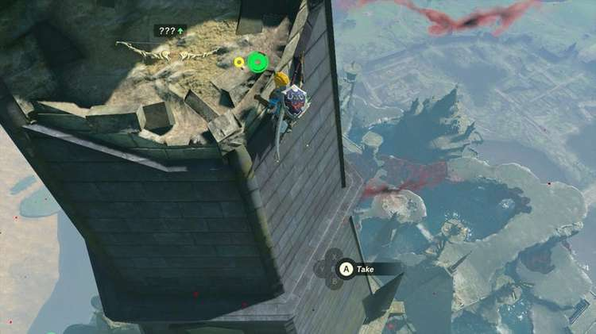

From the belltower, try and find a spot to Ascend upwards around the edge of the rooftops, and you'll appear at the base of the tallest spire. Carefully make your way around to find a portion of the the spire is broken, and among the rubble is a unique bow - the Dusk Bow. Since it's not in a chest, that also means it will respawn after each Blood Moon!

Return to Lookout Landing

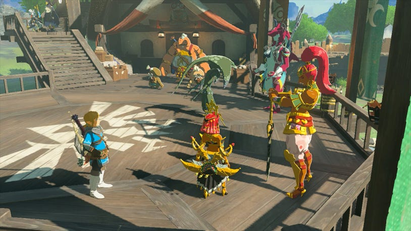

When you're ready to end this part of the quest, return to Lookout Landing and meet with the other champions (and you can speak with each of them and their advisors), before talking to Purah.

Crisis at Hyrule Castle - The Floating Castle

With the story laid out in front of you, the situation seems dire, but there may be hope in another who you have not yet found. This will require you to seek out the site of large older ruins, beginning the search for the Fifth Sage.
