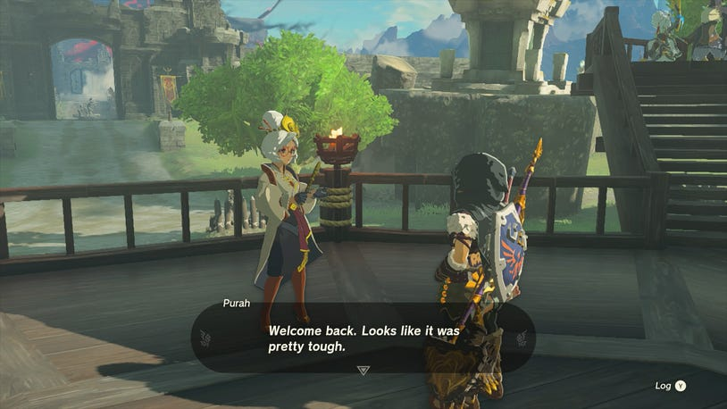
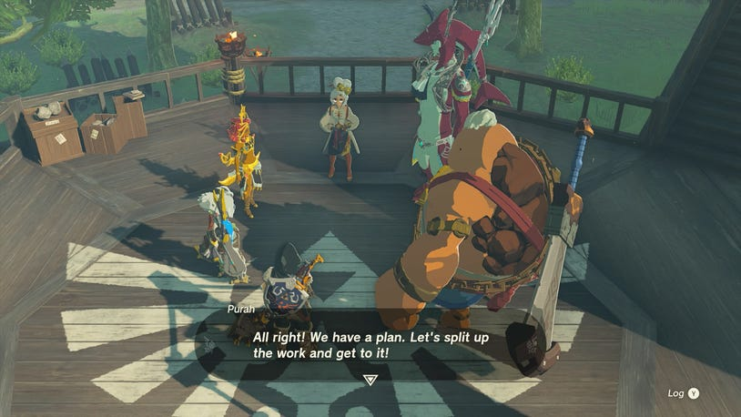
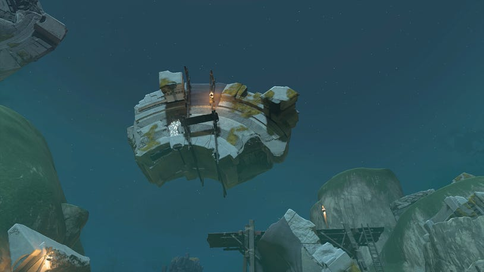
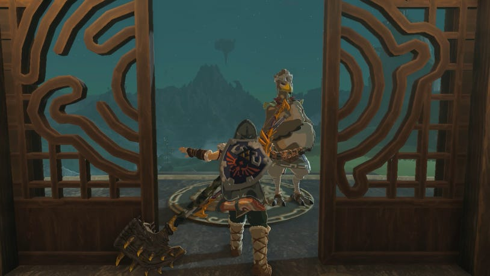
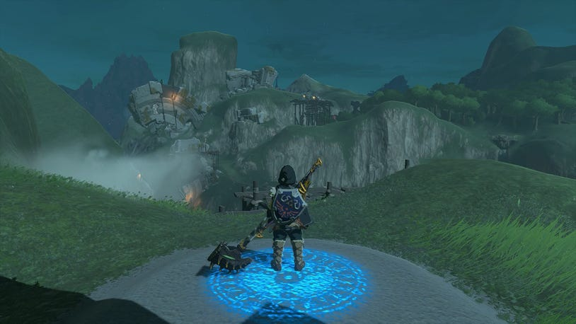
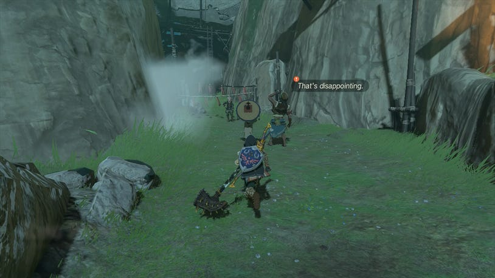

30. Find the Fifth Sage

As this quest begins, it will branch off into additional main quests that must be finished before Find the Fifth Sage will be marked as complete. This includes the Secret of the Ring Ruins and Guidance from Ages Past.

After Crisis at Hyrule Castle - The Floating Castle

When you've wrapped up Crisis at Hyrule Castle - The Floating Castle, you'll return to Lookout Landing to speak to Purah and each of the champions. With the story laid out in front of you, the situation seems dire, but there may be hope in another who you have not yet found. This will require you to seek out the site of large older ruins, beginning the search for the Fifth Sage.

Purah will ask that everyone go and collect information, triggering the Find the Fifth Sage main quest. Link is told that each of the sages has their own regions covered, so there's no need to revisit them, but instead, you must find the ruins from the age of legends.

If you think back to conversations with Purah that have been available during the regional phenomena quests, she also raised her concerns about another village, giving you a hint as to where to go to next – Kakariko Village.

How to Get to Kakariko Village

Kakariko Village can be found south of the Lanaryu Wetlands, which you will have traveled through if you followed out walkthrough guide on getting to Zora’s Domain.

The quickest way to reach Kakariko Village is to go to the Sahasra Slope Skyview Tower southeast of Central Hyrule, in the West Necluda region. The Tower Map Coordinates are 1344, -1170, 0166.

Sahasra Slope Skyview Tower

Not only does this offer you a fast travel point should you need to return, but it also provides a quick way to glide straight down into Kakariko Village, which is just east of the Skyview Tower. As you glide, you may notice the closest shrine to the village, which is Makasura Shrine at coordinates: 1170, -1051, 0166.

Makasura Shrine

Drop down into the center of the village then head north towards the crowd that stands before the Ring Ruins. Here, you'll meet Tauro and Chief Paya who just so happen to be discussing the importance of the Ring Ruins.

This conversation is what initiates the chain of quests needed to proceed with Find the Fifth Sage, starting with Secret of the Ring Ruins and ending with Guidance from Ages Past.

You can find detailed walkthroughs of the two quests on the pages below:

Secret of the Ring Ruins

Guidance from Ages Past

After Completing the Two Quests

Return to Lookout Landing and speak to Purah to tell her what you've learned. The conversation with her will wrap up the questlines for both Find the Fifth Sage and Crisis at Hyrule Castle.

Find the Fifth Sage

It's now time to take on the Trail of the Master Sword.
