2. Great Sky Island - Find Princess Zelda and The Closed Door

Reach the Temple of Time

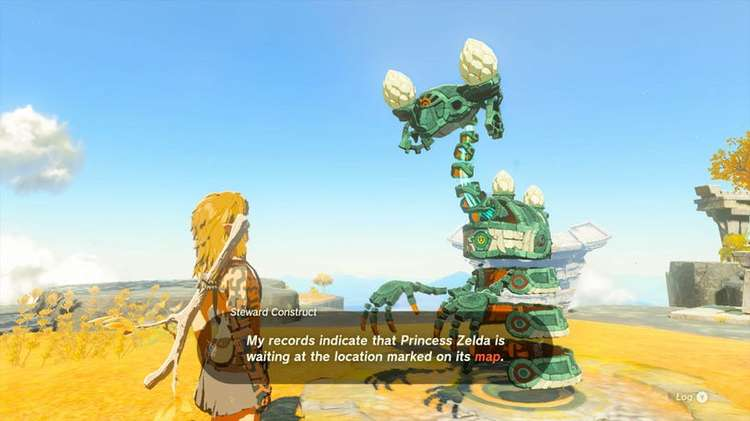

Now that you have the Purah Pad (which is a stand-in for the Sheikah Slate Link used in the previous game) you’ll be able to check your map and other features at will by pressing the - button. The Construct will note that the yellow marker leading to the large building in the distance (which is surprisingly referred to as the Temple of Time) is where Princess Zelda should be located.

The building sits on a much lower large island below you, so you’ll need a way to get down. You can choose to explore the rest of this intro island, but you won’t find much other than more Skyshroom, Tree Branch, and other basic materials.

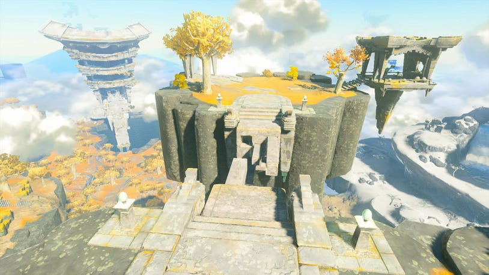

To advance, inspect the green glyph near the Construct to activate a bridge to a small island nearby. On the right side you’ll find another friendly Construct (all the ones with hunched backs and long necks won’t attack you).

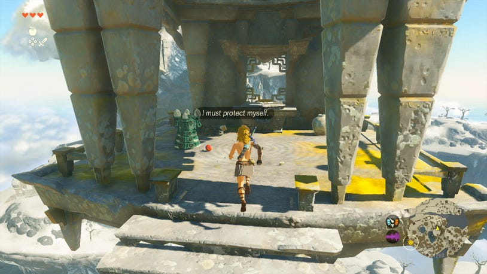

He’ll tell you more about the hostile Soldier Constructs, and can you grab and throw the nearby pots or use the tree to gain an Apple or two, along with the Wooden Stick on the altar.

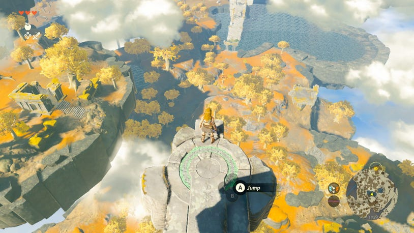

The path to the left ends in a diving spot, and you can spot another pool of water not far below. You now have a much larger area to explore, with ruins off to the right and a lower forest to the left and behind. However, it’s best right now to keep forging ahead towards the spot on your map.

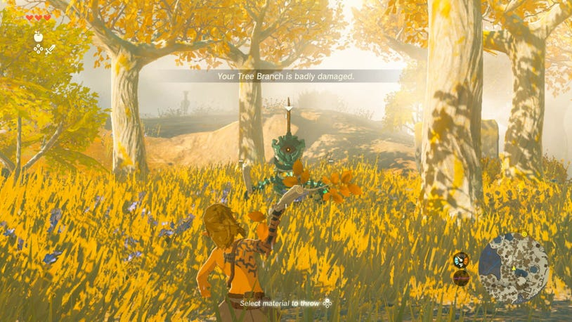

Be ready to deal with another Construct coming in from the side as you head up the path, and remember you can throw weapons about to break for extra damage.

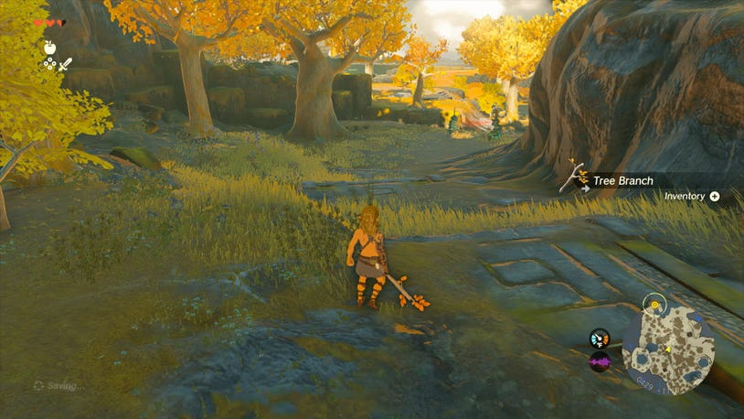

Moving up, you’ll find a curve in the road leading to a group of Soldier Constructs ready to fight anyone who gets near.

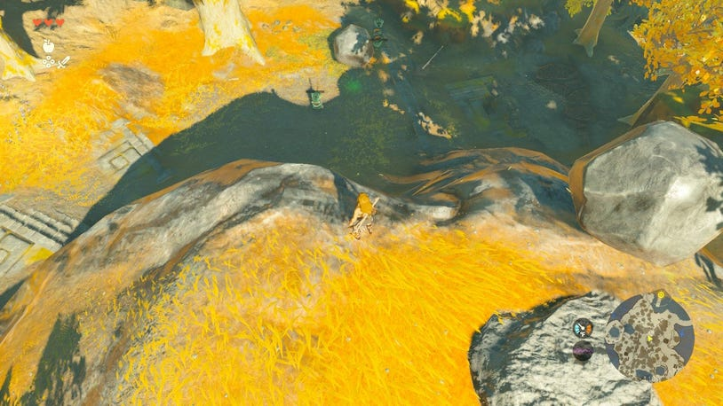

You can either choose to engage them head on, but if you’re feeling like you need an additional edge, head to the right and climb the hill to find some large boulders perched above that you can push down onto them to even the odds.

When they spot you, they’ll sound an alarm to bring a third Construct running, so don’t be afraid to backpedal to try and separate them a bit so you can take them on one at a time. Be sure to use their own weapons against them, and retreat if you need to find more branches.

Note that your Master Sword will be of little help now. In Breath of the Wild, even the legendary blade would need to recharge after enough hits – but in its weakened state, attacking too much will render it unusable for the foreseeable future. Best to use it as a last resort!

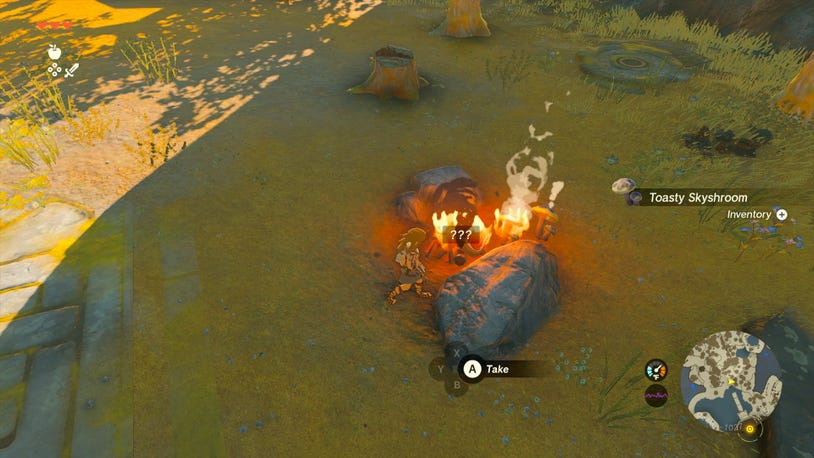

Past the trio of enemies, you’ll come to a large meadow in front of the stairs leading up to the temple, which is broken in many places. A friendly Construct is off to the left side by a fire, and he’ll teach you about roasting food to increase its health replenishment. Try it yourself by tossing a few apples or shrooms by the fire until they change visibly, and stockpile a bunch.

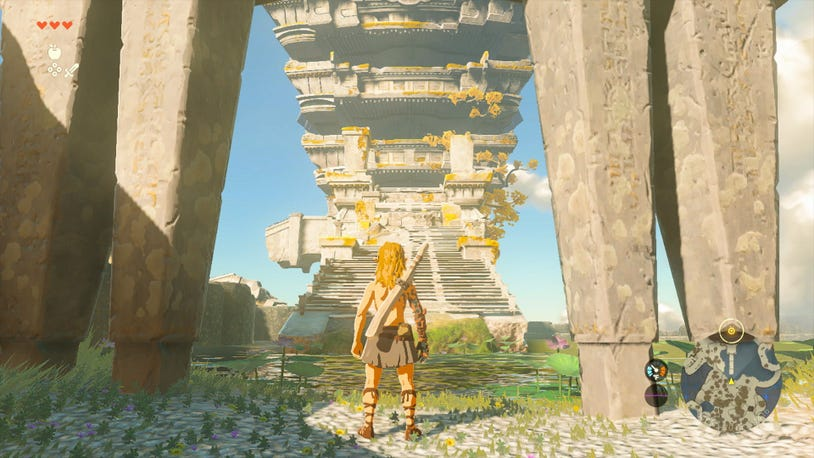

When you’re all set on food and have a good number of weapons on hand, head up the stairs to reach the Temple of Time. One last Construct is between you and the door, and it’s wielding a rusty sword and wooden shield.

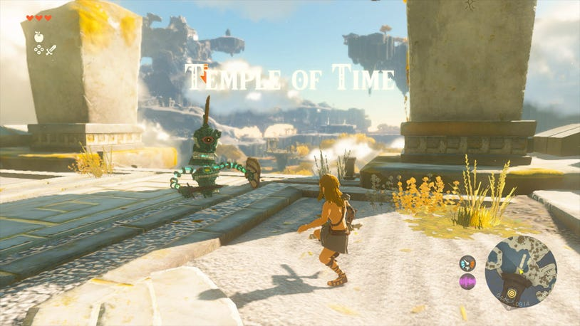

This means he’ll hit harder than the others, and can block your attacks, so this should be a tactical fight where you strike carefully. Wait until the Construct lowers its shield to swing its arm back before attacking it quickly, then dodge backward out of the way.

If you see the Construct swing both of its arms in a windup, backpedal away as it comes at you like a slow whirlwind, and wait until it exhausts itself before attacking. As long as you fight carefully, you can take it down without taking too much damage, and claim its Rusty Broadsword and Old Wooden Shield.

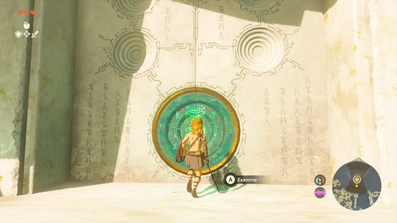

Head to the large door at the entrance to this floating Temple of Time – only to find that it won’t exactly open just yet. Link will meet the owner of the strange voice that awoke him earlier, and you’ll have a new task. To open the door, Link will need several new abilities that can be gained at various Shrines around the Great Sky Island.

The Closed Door - Head to the First Shrine

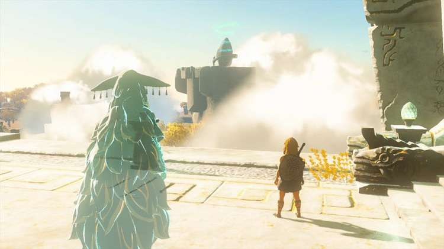

As luck would have it, the first of the shrines is very close by, and you’ll need its power to get to the other two on opposite sides of the Great Sky Island.

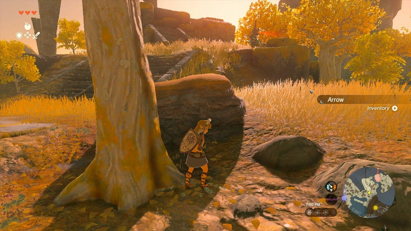

Head back down the stairs and go west towards a large pillar where the glowing shrine can be seen. As you reach the large open path before it, you may notice lots of arrows embedded in the ground around you. A Soldier Construct is up on a small hill to the left, and will start raining down arrows if it spots you.

Be sure to rush and defeat it quickly, gain its Old Wooden Bow, and then hunt along the ground to gain several arrows that will be extremely useful.

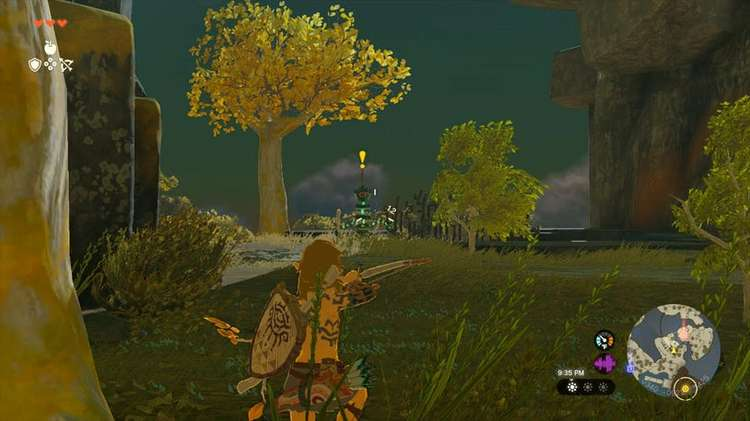

The stairs up to the left of its position lead to a bunch of items you can’t do anything with, so head straight instead towards another Construct guarding a small flowing river with a guard rail.

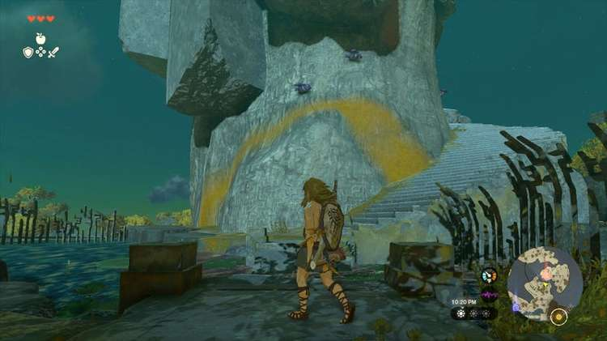

Look for a broken stone bridge nearby to hop across and begin to ascend the large column where the shrine is located.

If you’re feeling adventurous, you can check out the staircase leading to the outer ridge to the north. At the top you’ll find a few apple trees and a trail of sparkling leaves moving in and out of some pillars. Interact with it to find one of many Koroks, who will give you a Korok Seed for finding him. You’re going to want as many of these as possible, so best to start finding them now!

Great Sky Island Korok Seed 3

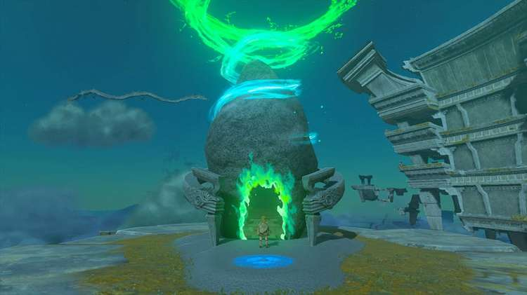

Continue to climb the large column and carefully get across the gaps in the broken staircases. Be sure to grab a few Rushroom as you do and save them for later. Once you reach the top, you can activate the Ukouh Shrine to open up a doorway and enter inside.

Ukouh Shrine - The Ability to Create

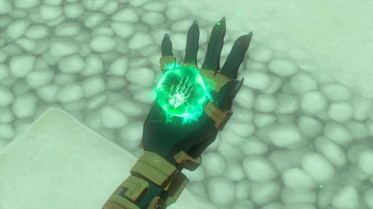

Inside, the spirit of Rauru will clue you in on how these shrines work. If you’ve played Breath of the Wild, you should have a pretty good idea – you’ll need to solve a variety of puzzles to reach the inner shrine at the end and be rewarded with a Light of Blessing. To help you through, Rauru will activate the first of several abilities on Link’s new arm: Ultrahand.

Ultrahand works very similar to the Magnesis ability from Breath of the Wild – with a few very important changes. It can be used on most any material that isn’t living or tied down to the ground. When holding an item with Ultrahand, you can not only levitate it around or pull it in or out with the D-pad – you can also hold R to begin rotating the item horizontally or vertically.

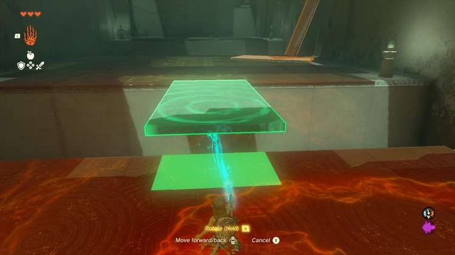

Try it out on the closest stone slab. Pick it up and lift it, then rotate it until it fits lengthwise over the small gap and place it down to create a bridge.

The other main important aspect of Ultrahand can be found at the next puzzle. When placing any moveable materials close together, you can press A to attach them with a near indestructible green substance. This will allow you to create a string of objects fused to each other, in many inventive ways.

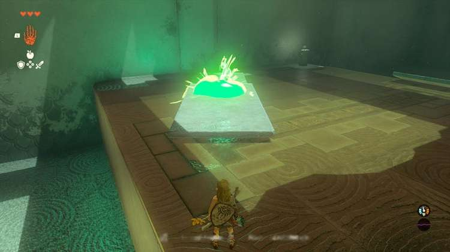

Give it a shot by grabbing one slab, rotating it to lie flat, then attaching it at the bottom edge of the other flat slab to create an extended bridge. Now you can grab the combined slab and use it to create a longer bridge across the second gap.

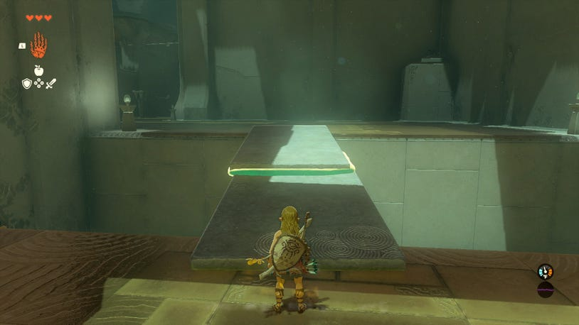

If you accidentally attach it at an awkward part, you need only use Ultrahand again and wiggle the right control stick to break it free, then re-attach it as needed. Look for where the green goop is ready to form to see where the attach point will be.

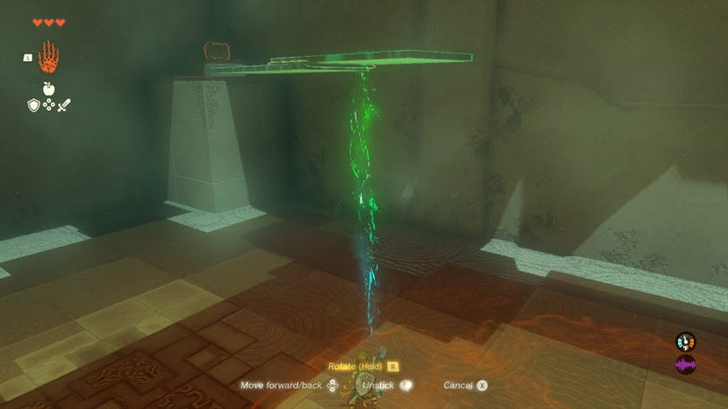

Once you cross the second bridge, turn around and use Ultrahand to grab it, then look for a large high platform to the right with a chest. You can now rotate the bridge vertically and tilt it slightly forward, then place it up against the pillar to create a ramp you can climb up to the chest, which holds Amber. The material isn’t too important now, but will have a good sell value later.

As a good rule of thumb to remember, every shrine will have one or more optional chests. One chest contains a bonus reward, while any additional chests beyond that may just be used to help you with puzzles. You can easily see if the secret chest in each shrine has been found by checking the map to see if there is a chest icon next to the name of the shrine.

It's a good idea to collect them early (on your first run-through of each shrine), as coming back later when you're more powerful means you may get stuck with less than spectacular weapons. The weapon or shield bonuses may scale, but the contents of the chests won't change.

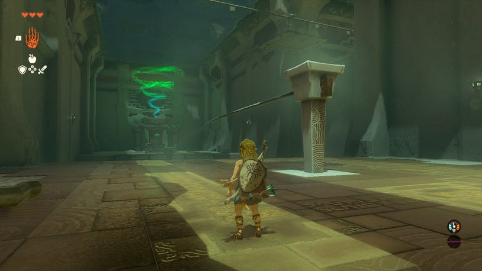

When you reach the next section, a new puzzle awaits. A long railway leads across a gap to the inner shrine, but the square wooden plank nearby isn’t long enough to cover the gap. The answer to this riddle lies above, as you can spot a wooden plank on a metal hook gliding across the rail above.

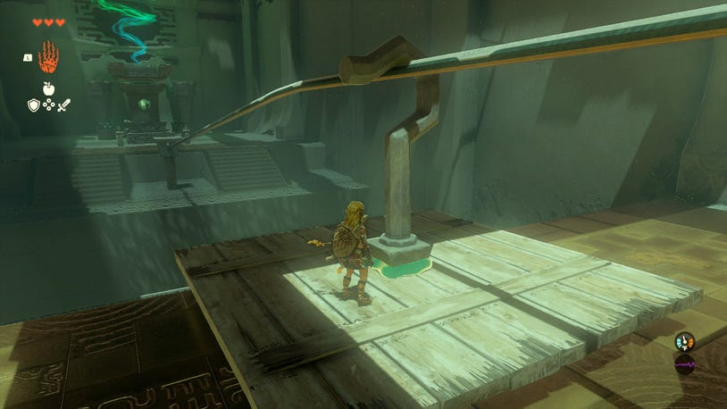

To make your own rail line, use Ultrahand to place the wooden plank flat on the ground. Then grab a metal hook and place it in the center of the plank and attach it. Grab the whole creation and slide the hook onto the rail, then let go and jump on board.

It will slowly ride across the rail line to the other side with you in it, completing the final puzzle. If you fall off or don’t jump on in time, you should still be able to pull it back across the gap to try again.

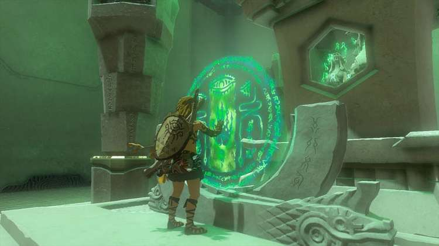

Interact with the inner shrine to get your reward – the Light of Blessing. This key item will play an important part in strengthening Link, but you’ll need a few more first.

Ukouh Shrine

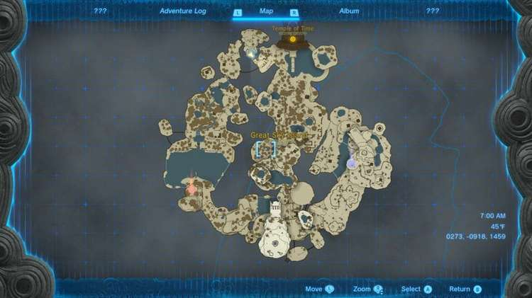

Exiting the shrine, Rauru will announce that two more shrines should give you the power to open the door to the Temple of Time, and you can spot both in the distance: One is off to the southwest past a large lake. The other can be found high on the southeast above a large snowy area.

Note that you can tackle the next two shrines in any order you wish, but this guide will primarily focus on taking the closer shrine to the southwest first.

Reaching the Lake Shrine

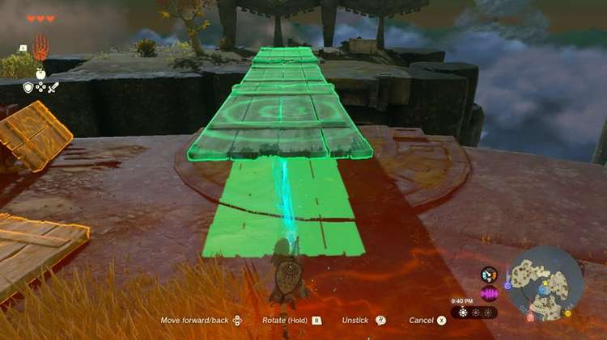

Now that you have the ability to create, you have a couple of options on how to proceed. The next part of the path lies on a much lower island platform below your current position. If you’re looking for an easy route, check to the side of the shrine you just exited to find several wooden planks by a chasm, and create your own bridge to cross, and then hop down the broken rocks to the island below.

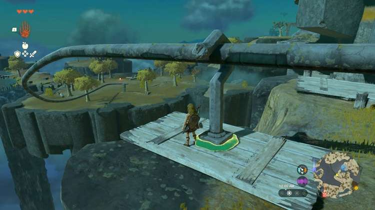

However, if you want a flashier way across, dive back into the river below and make your way to the hill the Construct Archer was on. The stairs above its position lead to a rail line that goes right to the lower island, and you can use what you’ve learned in the shrine to create a rail platform using a hook and a wooden plank.

Rauru’s spirit can be found by a ruined building, musing over the Constructs still cutting lumber. You can talk to the Construct before grabbing a Stone Axe for yourself. You can also find some items in the ruined building, and use Ultrahand to lift up the crates to smash them with gravity (saving your weapon durability).

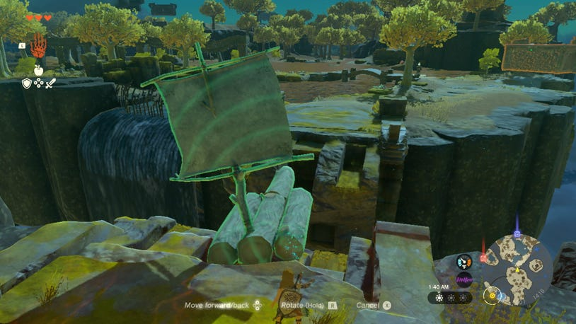

The bridge ahead is broken up, so once again it’s up to Ultrahand to create a new path. Get to chopping and break off four logs, then fuse them together at least two logs end to end to create a big enough bridge to put in place, allowing you to reach the other side.

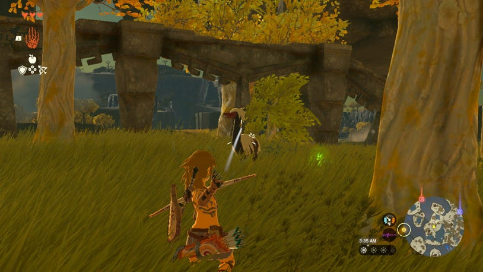

The other meadow beyond is a large place to explore, and a Ranger Construct will teach you about hunting some of the large bird creatures that can drop Meat when killed.

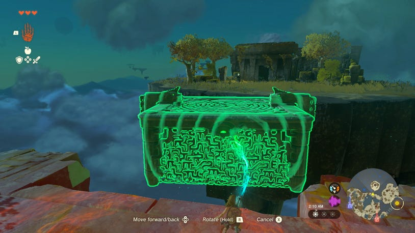

You can also look to the sides of this island for smaller island platforms. They can’t be reached by normal means, but instead you’ll find floating Zonai platforms that can be manipulated by Ultrahand to create platforms to reach them. Check out the small island to the right to find a building with a chest inside holding another Amber ore, as well as pots to find some arrows.

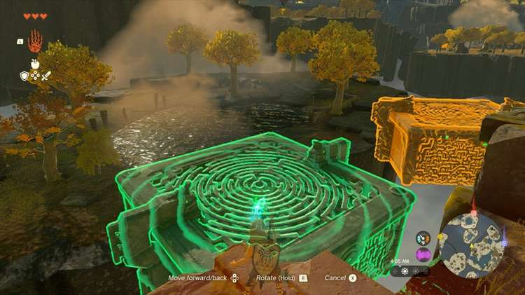

Over on the path past the Construct, look for another floating platform to lower down to create a path to another small island with a large pond that has several Ancient Arowana fish, and plenty of Stamella Shroom and Stambulb around the pond’s edge.

If you’re looking for another Korok Seed, there’s one hiding under a rock in the large lake near where the Hunter Construct is!

Great Sky Island Korok Seed 4

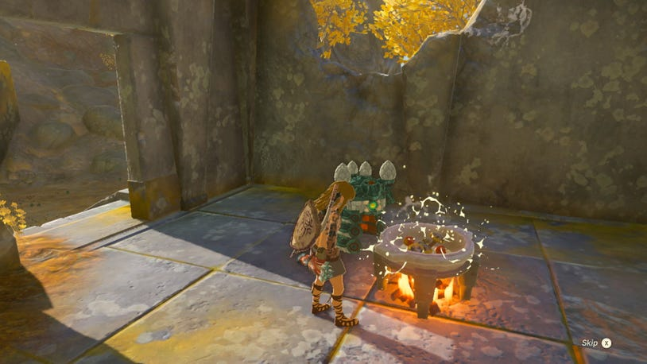

When you’re ready to move onwards, head south past where the large birds were and into a small canyon pass lined with Rushroom. On the other side, a small building will have a Cooking Construct inside with a cooking pot you can help yourself to. Cooking is an essential part of Link’s adventure in Tears of the Kingdom, so familiarize yourself with the basics by combining regular healing food by mixing basic skyshrooms and apples, or create a dish with a boosting effect by adding a rushroom or stamella shroom. Just be sure you don’t mix ingredients with different effects, or they’ll cancel each other out.

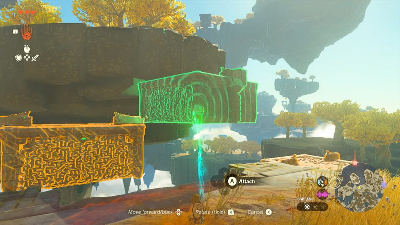

There’s one more small floating island on the ridge above the cooking pot building, and you can drag down three floating Zonai platforms to climb them up one at a time. Up here, you’ll find a building with another Old Wooden Bow, and plenty of crates filled with more arrows.

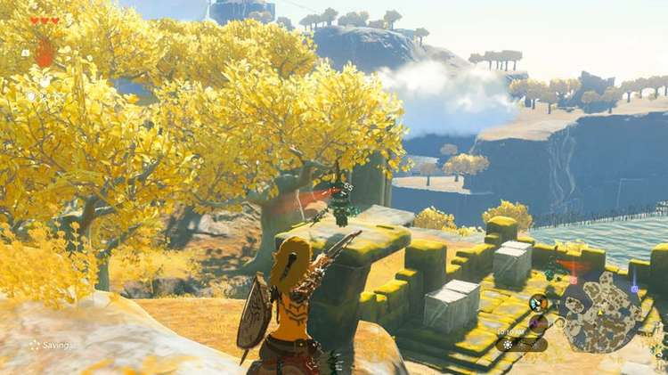

When you’re done exploring, it’s time to head further south by following the river. It will lead past a large ruin with several Soldier Constructs, so be ready to engage them, or use the ridge on the side to sneak up and take out the scout on the raised platform first. Defeating all of them will unlock a nearby treasure chest you can claim to get an Opal. Like the Amber, this ore sells for a good deal, but can also be thrown to create a large water attack. Just don’t throw it close to yourself!

The large lake below is quite a ways down, and you’ll have two options to do so safely. The easier method is to simply follow the river and dive down with the waterfall, but once again there’s a flashier way to arrive in style.

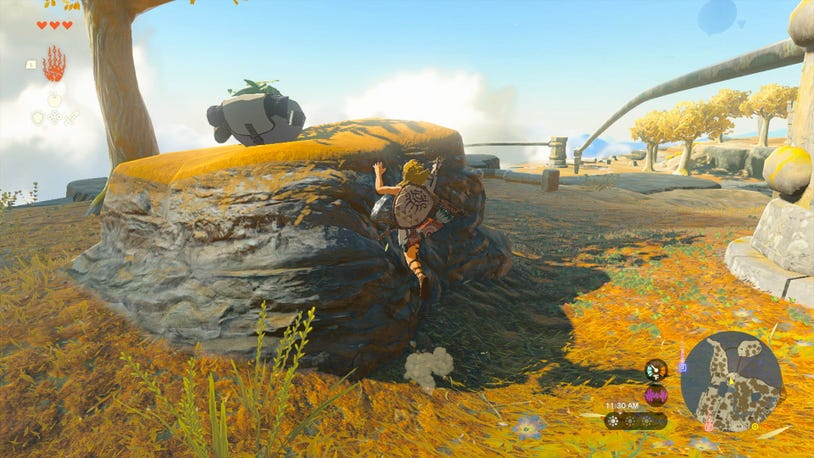

Cross the river and go west to find a rail line – as well as a Korok with a giant backpack who is struggling to get to their friend. As it happens, you’re both going the same way, and while you can’t use Ultrahand on the Korok, you can use it on the backpack they’re strapped to.

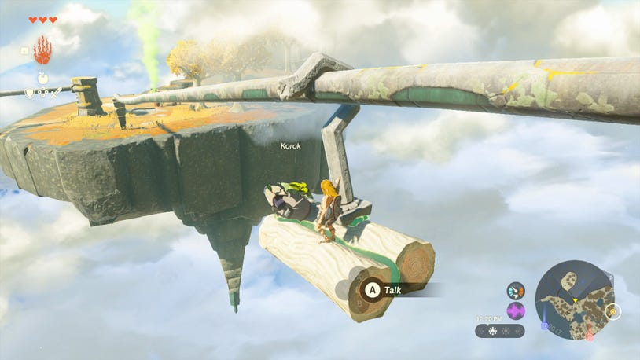

Create a rail platform with two or three logs side-by-side and put a hook in the middle, then attach the Korok onto the platform and place the whole thing on the rail before hopping on to ride it over (or, you can simply glue him to the end of a hook and send him off first before you follow; he’ll be fine!).

His friend will be so happy to be reunited, you’ll get not one, but two Korok Seeds! You can now re-use the rail platform to make the rest of the trip, but not before looting the crates on a hill above for more arrows and apples.

Great Sky Island Korok Seed 5+6

Once you reach the large lake, you’ll need to find a way to cross it without drowning. Luckily, there’s a mighty breeze blowing south, so all you need to do is harness the power of wind.

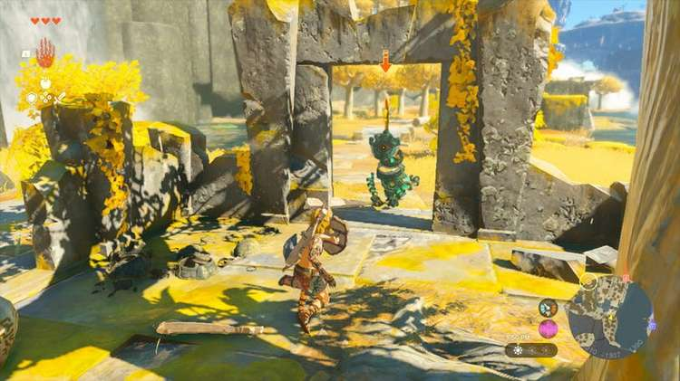

Defeat the Soldier Construct in the ruins, and then head across the bridge to find a Stone Two-Handed Axe.

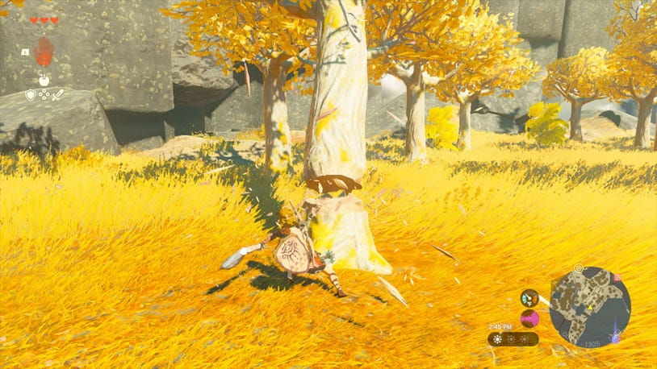

Start chopping down as many trees as you like to build the boat of your dreams, and attach a sail or two on top.

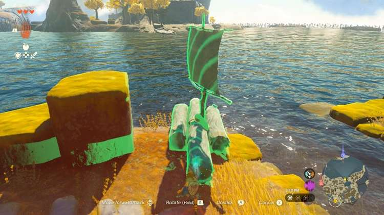

Once it’s ready, use Ultrahand to place the makeshift boat in the water, and hop on to sail across to the other side!

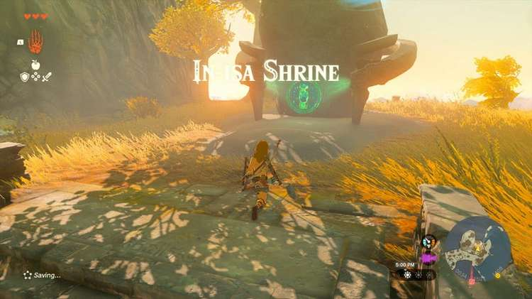

From here, you can head along the path to the left, and then up the hill to the waiting shrine.

In-isa Shrine - The Ability to Combine

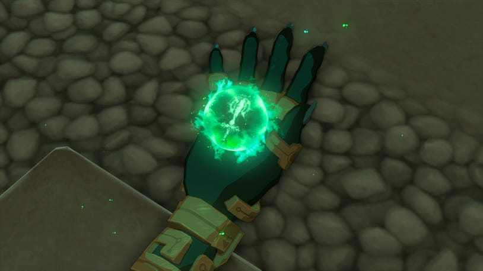

Once you enter, Rauru will give you one of the most important abilities of your entire arsenal: Fuse. This allows you to meld almost any object on the ground with your weapons to create entirely new fused creations to fight with. Not only will this improve their attack power, but it can also drastically increase its durability and let you fight with it for much longer than a standard weapon.

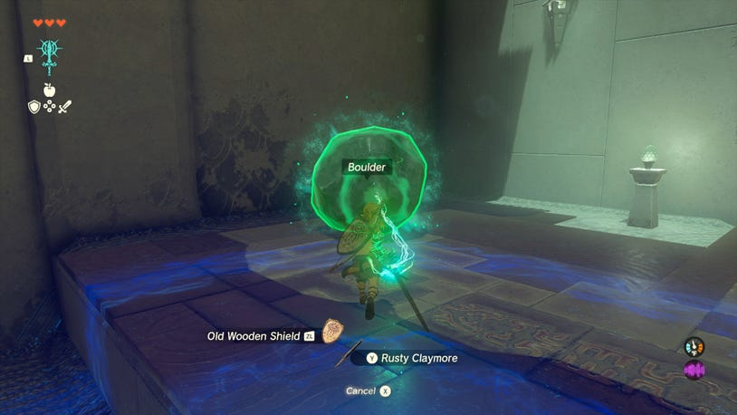

Even more importantly, the type of item fused to the weapon can modify its properties. As you approach the first crumbling stone pillars blocking your path, use the Rusty Claymore and fuse it with a boulder to create a Broadsword Hammer!

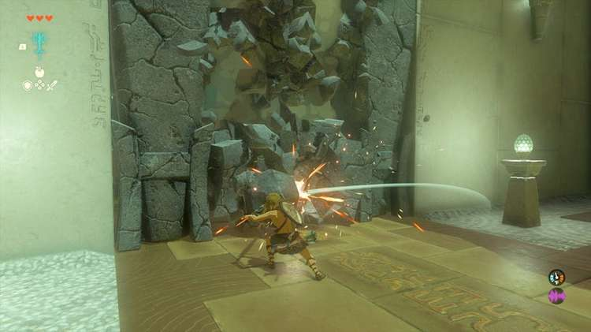

With a rock on the end, it can now break apart other rocks as a suitable mining tool!

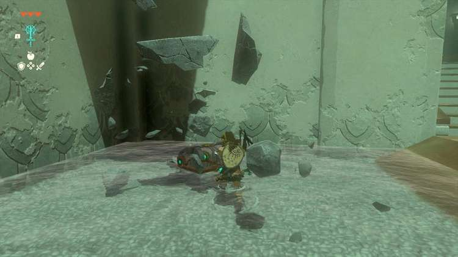

Once you destroy the gate, move into the next room and try it on the four pillars here. One has a chest on the top that you can reach by destroying the pillar with your weapon, and claim 5 Arrows.

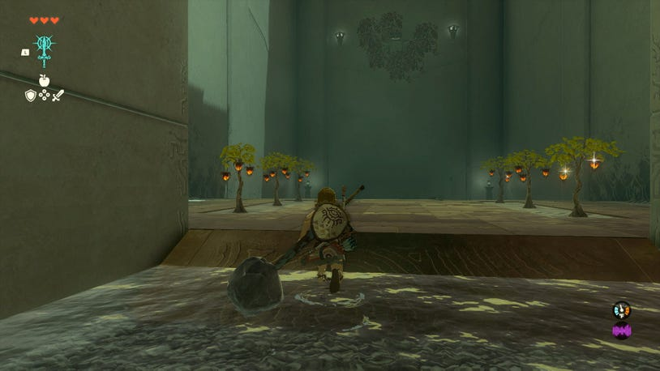

Off to the right is another fun activity, as Fuse is not just limited to your swords. Another chest sits on a high wooden platform surrounded by leaves, and several plants nearby bear Fire Fruit.

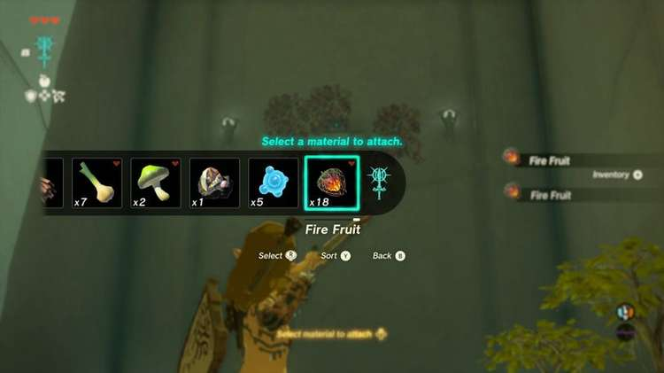

Hold out your bow by holding ZR, and then press up on the D-pad to cycle through all of your available materials. Select the Fire Fruit, and you’ll find that it’s now fused to your arrow, and can be launched as a fire arrow to ignite the wood and send the chest down, which holds a Small Key.

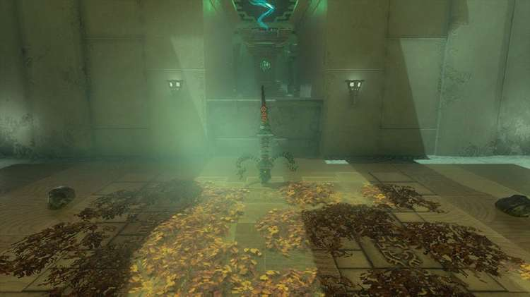

Using the key on the main door, you’ll reach an arena with a lone Soldier Construct Captain. These advanced constructs also have the power of Fuse, and will routinely collect anything nearby to fuse onto their weapons to fight you with.

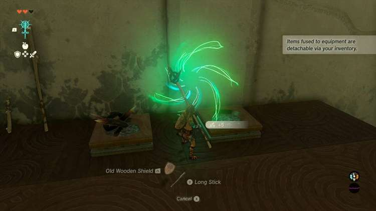

Luckily, two can play at that game, so look for a ladder to the left to find a host of items to fuse. You can attach the thorns to your shield to give it a damage boost, or a wooden stick to turn into a spear.

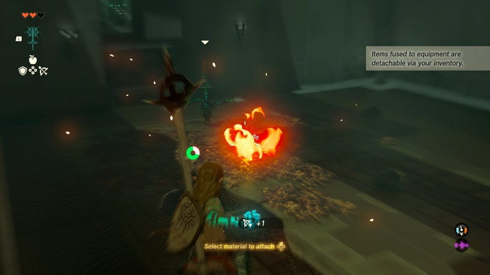

You can also make quick work of the Construct by igniting the very ground it stands on with a well placed Fire Fruit shot onto the dried leaves around the arena.

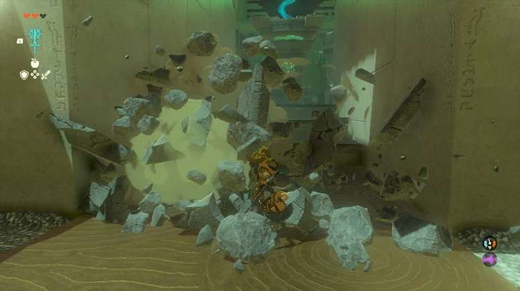

Once he’s dead, swap to a weapon fused with a rock or boulder to smash down the last gate to claim the Light of Blessing.

In-isa Shrine

Reaching the Snowy Shrine

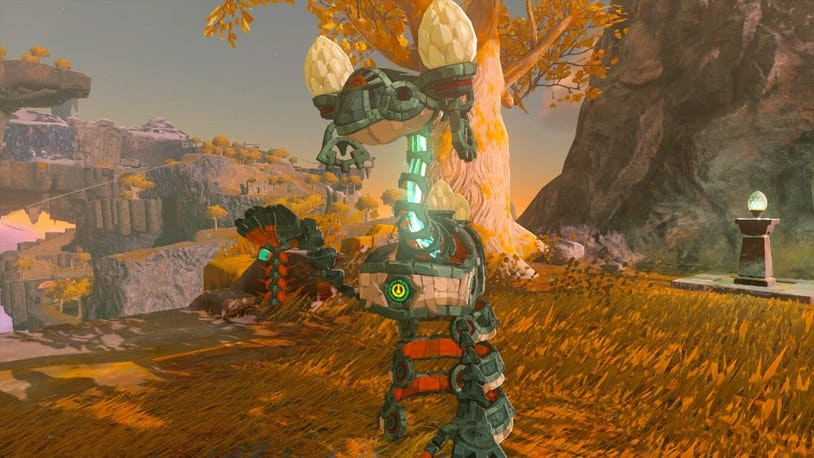

After leaving the lakeside shrine, a Steward Construct will appear to give you the Energy Cell if you haven’t stumbled across two specific areas already. This item allows you to power up Zonai Devices that are nearby when you hit them.

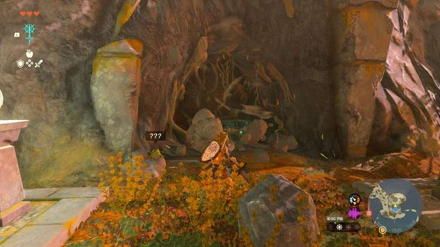

While you’re still by the shrine, you can destroy the wall of rubble to the right and find a chest with 5 Arrows, and then climb up the ledge above to a high plateau with a tree hiding a Korok under a rock at the top!

Great Sky Island Korok Seed 7

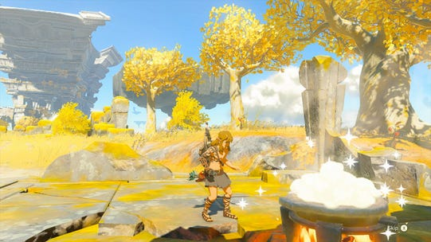

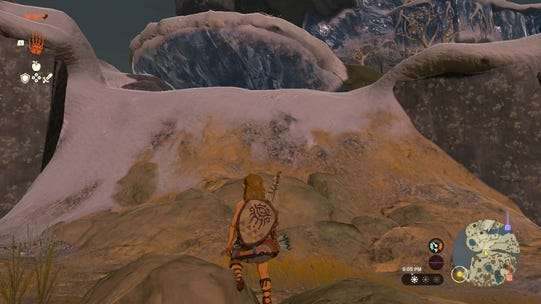

If you’re attempting to reach the snowy shrine first by way of the Temple of Time, your route will be very different than if you continued on from the lakeside shrine. You’ll have to enter the cold temperature region by way of the ruins east of the Temple of Time. Luckily, you can find a Cooking Pot in one of the ruins, which you should use to cook up the Spicy Pepper found growing in front of the slopes, and stockpile food that will let you survive freezing temperatures without taking damage (five cooked peppers will give you 12 minutes 30 seconds of cold resistance).

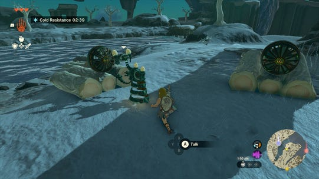

When you’re ready, head up the slope into the snow and veer right to reach an icy river that will quickly kill you if you fall in.

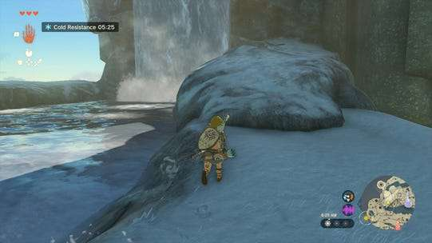

Luckily, the nearby Constructs will demonstrate how Zonai Devices work with rafts, and give you an Energy Cell to power the fans attached to rafts.

Once you reach the other side, follow the river up to the left and climb up to reach the shrine.

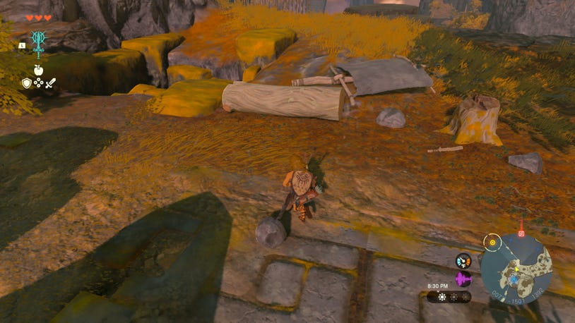

To reach the third shrine in the cold region to the east from the Lake Shrine, head back down the hill, and be sure to look for a ditch full of rubble.

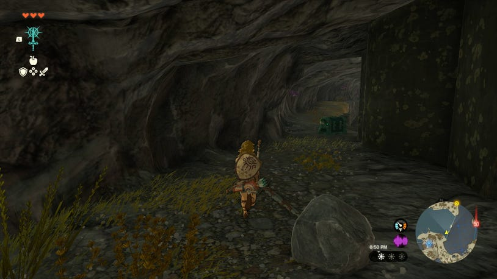

With the Fuse ability, you can now fuse a rock to your weapon and break them apart, revealing a low path under the falls and back across to the other side of the lake, as well as another chest with Amber inside.

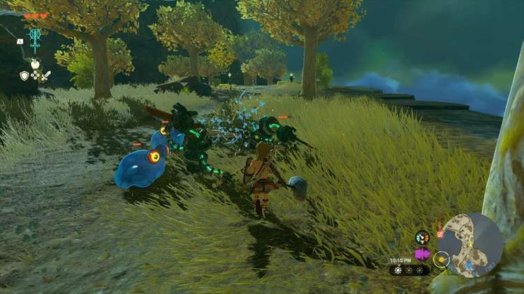

Head down the path to the right and watch for Constructs battling with Chuchu monsters, and pick off whoever wins that fight.

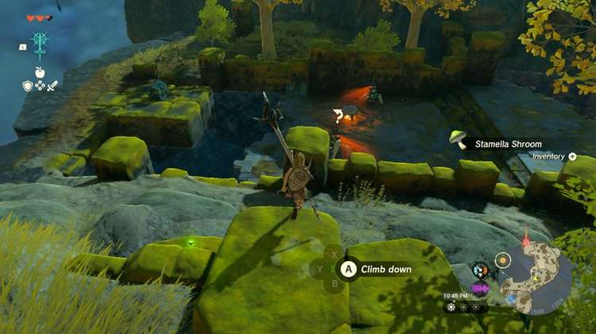

Up ahead is another camp of Soldier Constructs guarding a chest, but you’ll want to be careful engaging them. Not only does one have a shield, but the other has created a fuse weapon of its own — combining a stick with a large wooden plank.

The enemy will use this new weapon to send massive gusts at you to knock you backwards, so avoid having your back to any ledges at all costs! If you find it hard to get close, try getting some distance and shooting a Fire Fruit to burn away their weapons before finishing them off.

Once they’ve been taken care of, be sure to loot the nearby chest for a Soldier Reaper fused weapon. When in doubt, fusing monster horns to any basic weapon you find is always a great bet, as they tend to increase your attack power more than most other fusion materials.

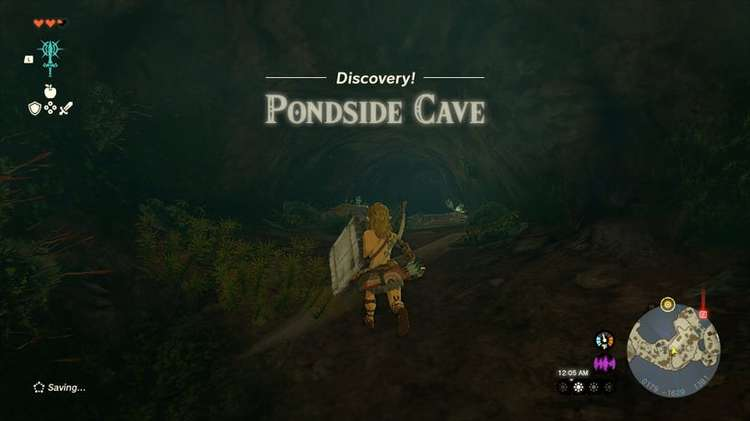

A large cliff borders this area, and the only way to proceed is by heading into a new area – the Pondside Cave. You’ll find many caves spread out all around the world in Tears of the Kingdom, and they can often offer many secrets if you’re willing to look around.

Pondside Cave

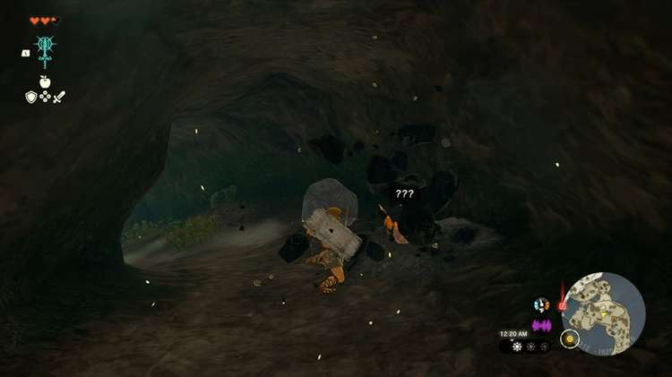

Be sure to pick up Brightbloom Seed, as they’ll be useful later on in this area. You can also find giant ore veins in caves like these, and having a fused hammer weapon (or just fusing any odd weapon with nearby stones) will help you break them apart to find minerals. Not only does Amber sell for a good bit, but it also makes a great fuse material for increased damage early in the game.

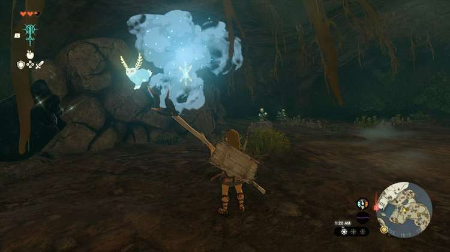

When the cave opens up into a wider room, be on the lookout for a large glowing frog hopping along the ceiling. This special creature is called a Bubbulfrog, and will relinquish a Bubbul Gem if you can hit it enough times (it will only try to dissuade you with bubbles, but shouldn’t be hard to take down with arrows).

Each cave has one mystical frog in it, and you’ll know which ones on your map have been cleared by looking for a checkmark on the map.

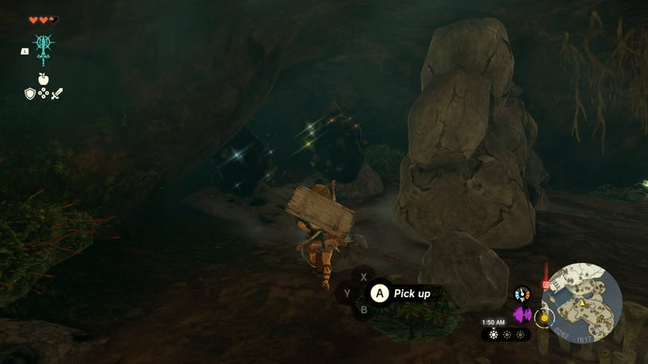

Be sure to mine the rest of the ore in this room, and break open the pile of rubble to find sparkling ore that should contain a rare gem that will sell for a ton (or empower your weapons with great elemental powers!), then head through a side passage to the left of the pile of rubble.

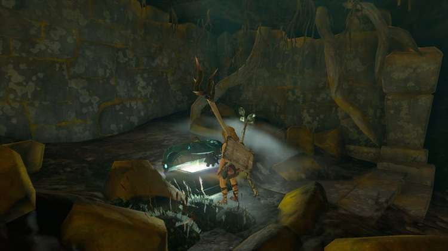

Check the small passage and clear it of Keese, and look for a green chest before exiting the Pondside Cave. In the chest you’ll find the second piece of armor – the Archaic Tunic!

Archaic Tunic

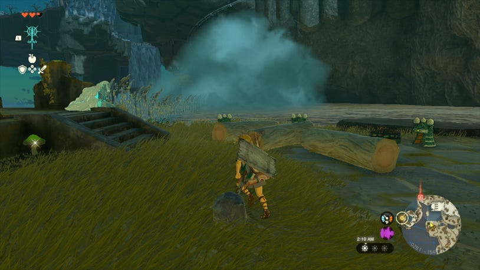

The large pond outside is much like the lake by the last shrine, and is too large to swim. You can talk to Rauru’s spirit nearby, as well as the Constructs to learn more about building rafts and Zonai Devices.

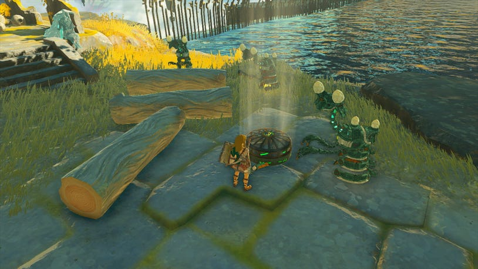

Even if the pond is large, you now have the power of Fuse to use along with the Zonai Devices here.

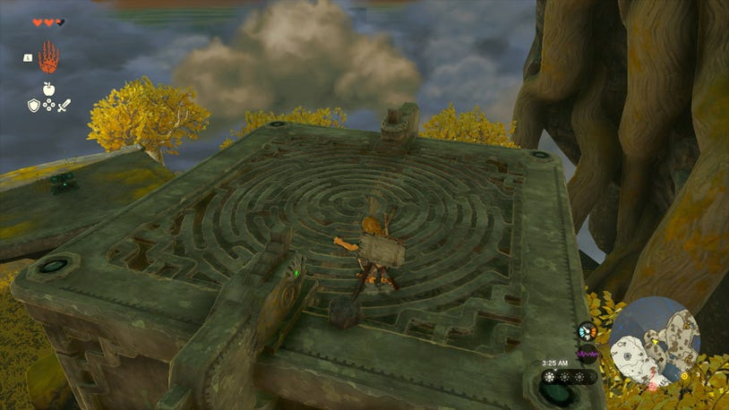

First however, you may want to take a detour to the right of the pond to find a series of Zonai floating platforms leading down among the roots to a lower island. You can use Ultrahand to chain the platforms together and leapfrog over to the lower area, and defeat the Zonai Construct Captain to claim the chest he’s guarding for an Amber.

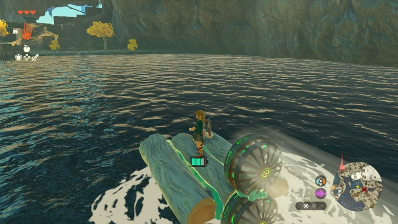

Back at the pond, it’s time to make your own powered Zonai raft. Use Ultrahand to stick at least three logs together side by side, and then raise and tilt one or two fans to stick on the end of the raft. When you strike the fans, they’ll activate and use the energy from your pack to operate for a limited time (which can be extended by using Zonai Charge in your inventory). Even with your one battery pack, you’ll have more than enough energy to cross the pond on your new boat!

After you cross to the other side, the Construct will warn you of a treacherous path up to the next shrine, so make use of the assorted materials, crates, and Cooking Station you can light by striking the Flint with a metallic weapon.

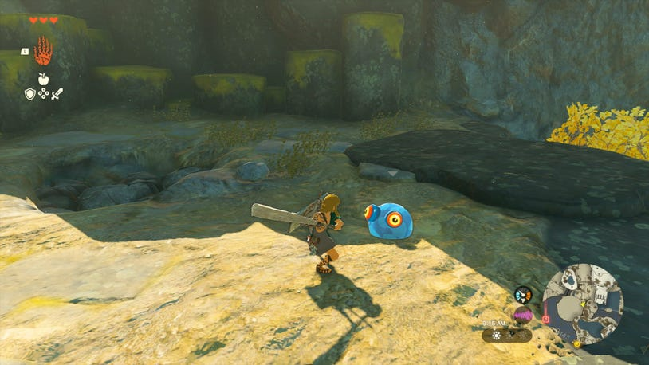

Be sure to look off to the right as you climb the first stairs, as a pile of rocks in a small hole can be found to the side that you can break through with the right weapon.

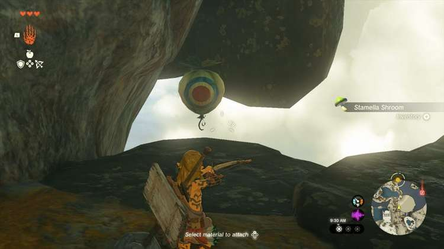

This will lead to an underground path with a balloon you can shoot to summon a Korok Seed.

Great Sky Island Korok Seed 9

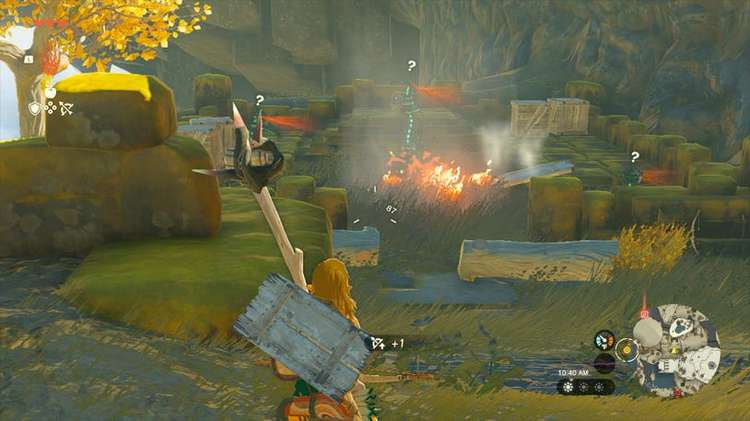

Take out any Chuchu that ambushes you on the road to the top, where you’ll find the entrance to another cave, and a squad of Soldier Constructs off to the left. Lucky for you, they happen to be in a ruin that’s overgrown with grass, making it perfect for lobbing a Fire Fruit into and setting them all ablaze. Defeat them all, and you can loot the chest nearby for an Opal. When fused, they shoot out fast jets of water or can explode when shot from an arrow, so be careful and use them sparingly!

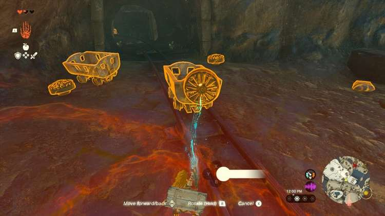

Back at the cave entrance, look for several discarded minecarts and place them on the track. Gone are the days of needing to whack it while using Stasis — now you can simply place a fan on the back and hit the fan, and away you’ll go into the Mining Cave. Unlike the other cave, this one will get pitch dark, and you’ll need to find a way to create some light.

Mining Cave

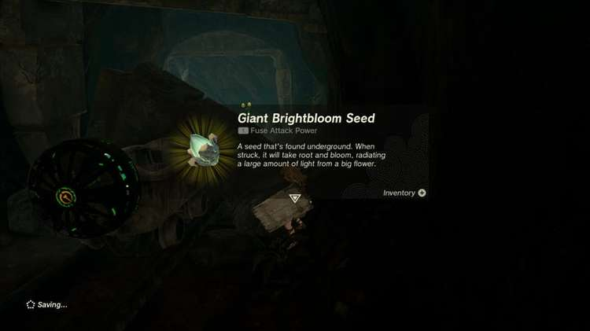

Eventually the cart will hit a block in the road, so leave it and hop over the illuminated barrier to spy the light source. A Construct will tell you that the Brightbloom Seeds will create light when struck, or can be harvested when not blooming. There’s even a Giant Brightbloom Seed near where the minecart stopped that will illuminate even more of a dark area.

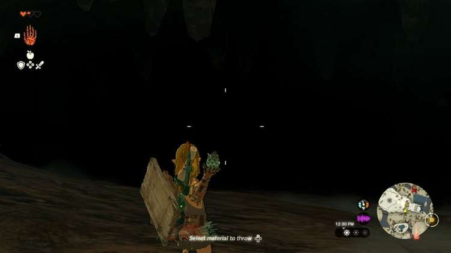

Put them to use by either tossing them (hold R and then Up on the D-pad), or fitting one to your arrow when aiming a bow, and shoot it out to immediately watch the cave become revealed.

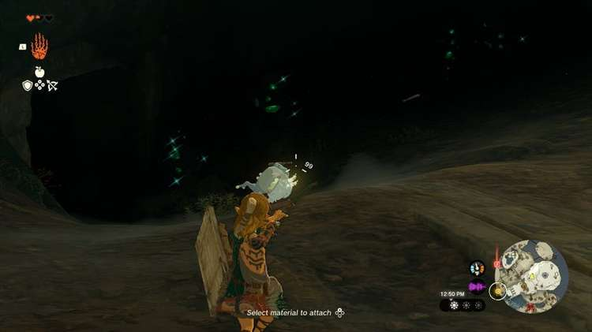

You should also spot another Bubbulfrog scurrying about in the large darkened chamber beyond, so take him out and collect another Bubbul Gem.

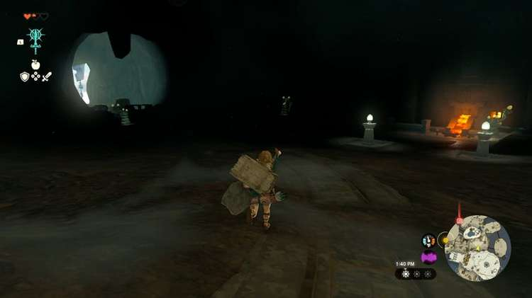

Reaching the last chamber, you’ll make an important discovery as you locate a Zonaite Forge. The Construct here works with Zonaite mined from the glowing ore veins nearby, and processes it into Zonai Charges that you can also gain from defeating Soldier Constructs.

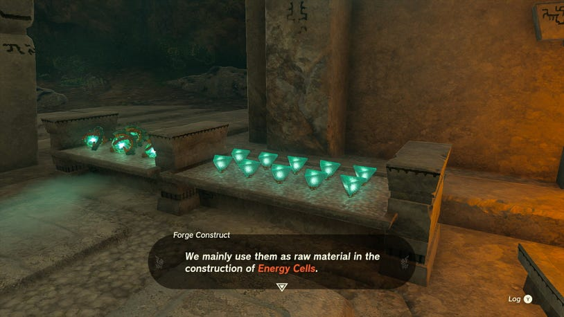

He also deals in Crystalized Charges, which take a lot more Zonaite to condense into a pure form that can be used to upgrade your Energy Cell. Be sure to mine Zonaite whenever you come across it, as it can be very useful later in your adventure.

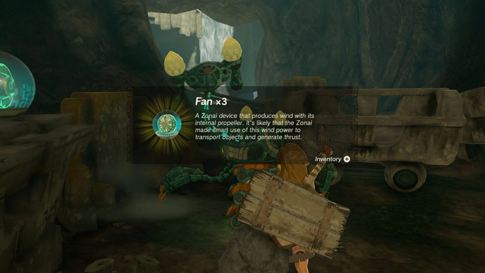

For now, you can leave the forge behind and carry another minecart over the barrier. Talk to the Construct here to see the three Fans he has in little capsules. When in capsule form, they can fit in your inventory — but once placed out in the open, they can’t be stored again.

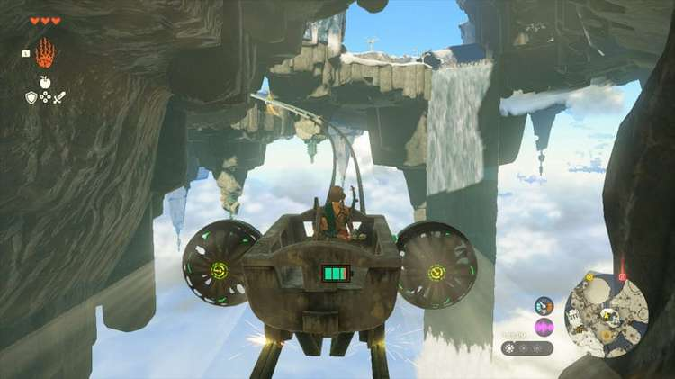

Strap a few fans on either side of a minecart to give yourself a boost up the next minecart track leading all the way up to a high ridge.

There’s a few things of note to do here, including speaking to Rauru again for some more insight into the Great Sky Island. You can also check out a large machine that looks like a toy dispenser behind him.

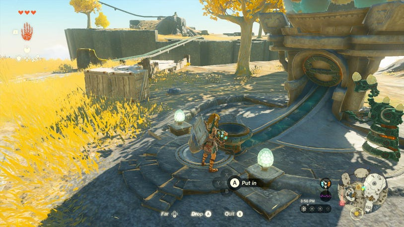

The Construct nearby will note that the device will dispense certain types of Zonai Devices in exchange for Zonai Charges. The more you toss in, the more you’ll get in return. Grab a handful to try it out, and you should get several Fans, Flame Emitters, and Portable Pots:

Fans can be attached to other objects to propel them under the right conditions, and is useful to create vehicles (or blow enemies away)

Flame Emitters can be attached primarily to weapons and shields to shoot out bursts of flame – but will cost energy to maintain. They can also be used in conjunction with balloons to fly as the hot air creates lift.

Portable Pots are single use Cooking Stations that will come pre-lit, and are incredibly important when you need a specific meal in an unfamiliar or hostile territory. They even still work regardless of the weather!

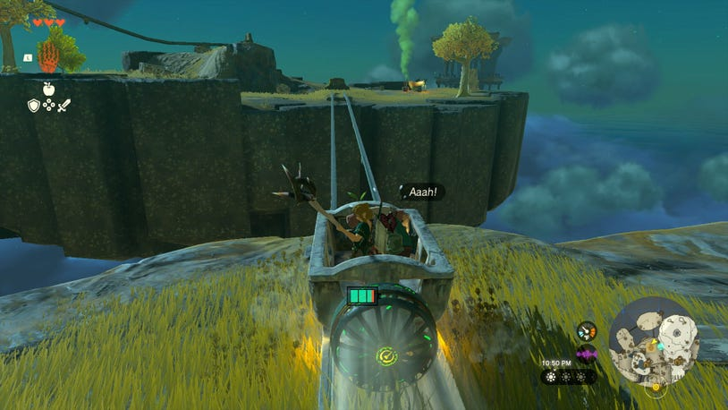

Up past the dispenser, you can find another rail line and yet another Korok who longs to meet his friend on the smaller island above. Once again, you can grab one of the minecarts and toss him in and use a Fan to get across to the island to get two Korok Seeds.

Great Sky Island Korok Seed 10+11

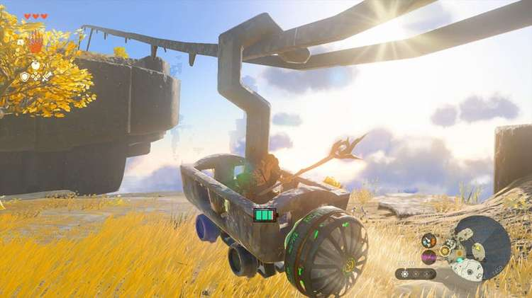

The rail line to a second raised island is broken, rendering the minecart useless – at least placed normally. You can circumvent this in a variety of ways – like placing a hook in the middle of the minecart and a fan at the back to push it up the track on a single line. Doing so leads to a chest with a Portable Pot.

Off to the east lies a cave below the frigid mountain, and a floating platform near a large circular arena where a mini-boss awaits. It’s better to hold off on this fight for the moment, so for now focus on getting to the next shrine.

Flux Construct I Mini-Boss

If you do decide to face the mini-boss, know that you'll need to use Ultrahand to wiggle the construct's special block loose and then attack it. You can watch a full video on how to defeat it below.

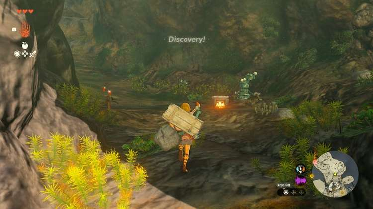

Inspect the Pit Cave entrance to find a few plants holding Hot Peppers, and look for a Cooking Station inside where you can cook them up to grant you a limited amount of cold resistance.

Pit Cave

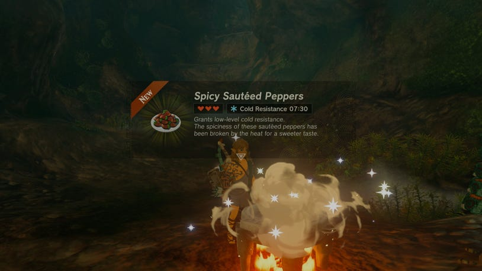

Cook as many as you can to give yourself a head start, and remember that caves will offer you safety from the freezing temperatures outside.

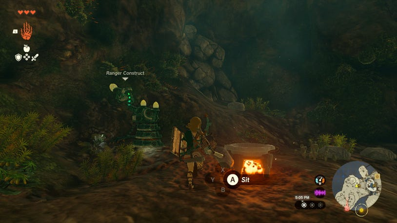

Look to the right of the Cooking Station to find some rubble you can break apart with a fused hammer weapon.

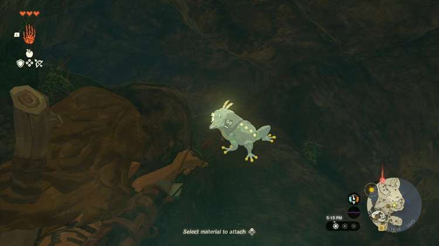

Check the small path through it to shoot down a third Bubbulfrog.

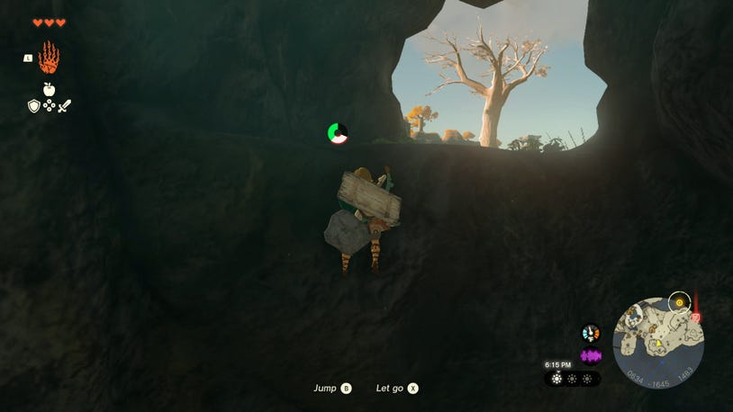

Then, return to the main cave path and climb up to reach the frozen wastelands above.

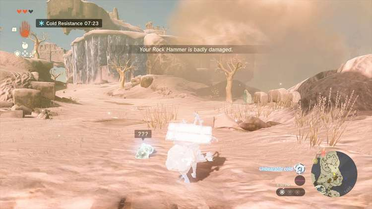

Be on the lookout for ambushes from Ice Chuchu. They’ll explode in freezing mist when defeated, so shooting them from afar is highly recommended.

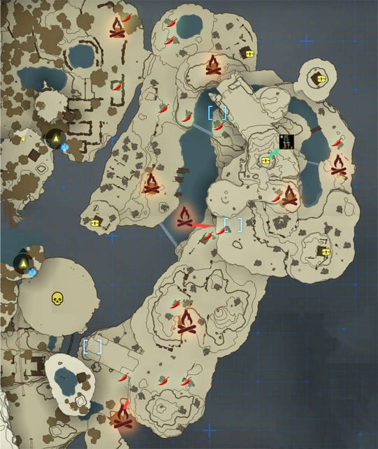

Looking for Spicy Peppers and places to cook them? Consult the map below!

Since time is not on your side, you should hold off doing any extra exploration for now and make your way towards the shrine high up in the distance further east. Rauru can again be spotted by a tree to the right of the path, and will remark on some Soldier Constructs along a rocky ridge to the left.

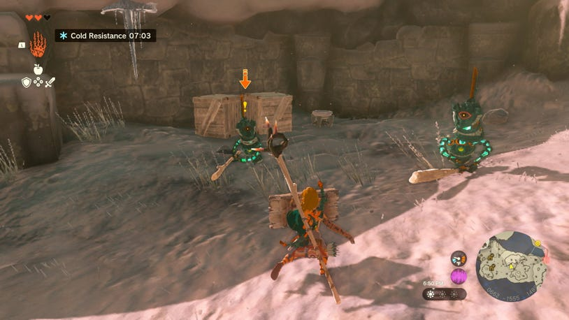

You can avoid them if you wish, but if you find your cold resistance time running out, defeat them quickly and ignite the Cooking Station near them to cook up some more Spicy Peppers.

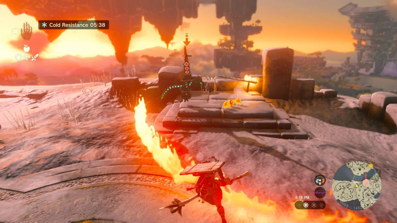

The end of this path leads to another cave entrance guarded by a Soldier Construct Captain, who will utilize nearby Flame Emitters to create a flamethrower weapon he will blast out in a low sweep. You can either do your best to jump over the flames, or sprint around behind the Construct and hit it from behind.

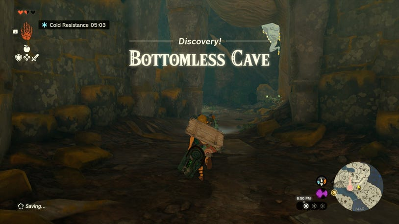

Grab the Flame Emitter Sword from the defeated Construct and head into the Bottomless Cave. As its name implies, there's a large chasm in the cave leading down to a lower island that you won’t survive falling, so move carefully inside.

Bottomless Cave

You should be able to spot a Bubbulfrog hopping along the walls, be sure to snipe it with your bow and collect a fourth Bubbul Gem. There are also several Bomb Flower growing in this cave, which should be harvested on sight. These will replace the typical Bomb Arrows from Breath of the Wild, and will be incredibly useful in combat or creating pathways through rubble!

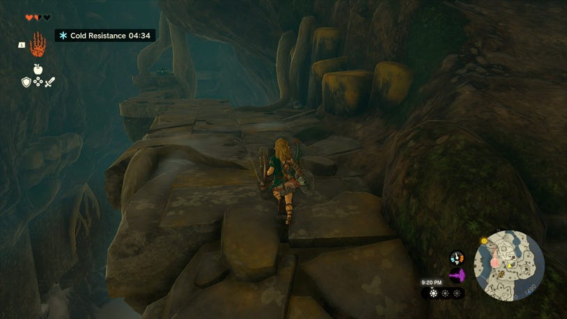

Be sure to check the low path on the left through the cave to find a chest perched on a narrow ledge holding Amber, and then start trekking upwards. You’ll soon come to a new enemy type that may be familiar if you’ve played earlier Zelda games: the Like Like.

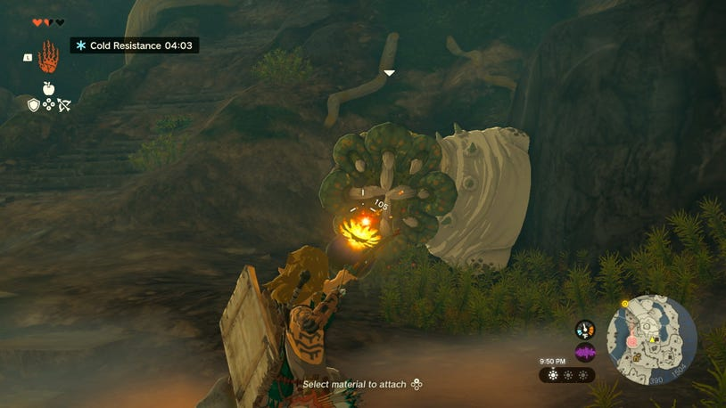

These fanged slug-like enemies cling to walls and ceilings and will try to grab and consume you – often stealing your equipped items in the process! Luckily, killing them will cause them to spit out your lost items. They are also fairly durable except for certain weak spots.

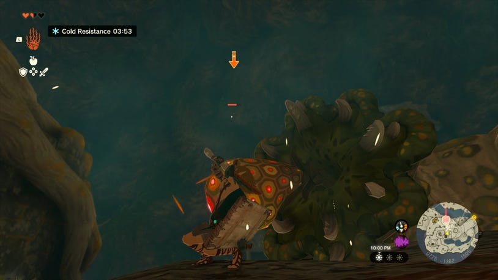

The main weakness comes before they strike, as they’ll reveal a glowing center in their mouth before striking, and hitting it will stun them, causing it to be exposed for a longer period. If you’re having trouble baiting out their weak spot, you can also use Bomb Flowers, or your Flame Emitter to ignite them, which should also expose their weak spot. Attack fast and hard when they are defenseless, and you’ll also get a treasure chest with a random item from defeating them.

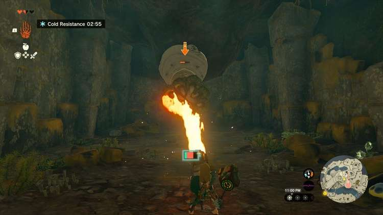

As you head up to the top floor of the cave, there’s one more Like Like guarding a chest, but a discarded Flame Emitter Shield can help you reach its high spot and expose its weak spot to quickly kill. Once defeated, claim its chest, plus the one it was guarding for another Flame Emitter Capsule.

Re-up your Cold Resistance with more Spicy Pepper dishes (and put down a Portable Pot if you need to), and head back out into the cold. The shrine is still above you, and getting to it will take a bit of work.

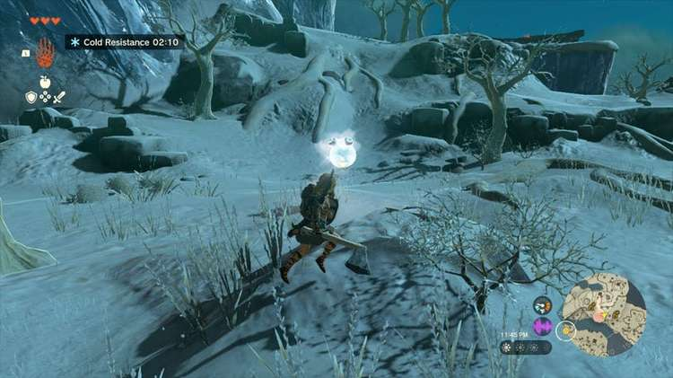

Head along the roots and avoid Ice Chuchus as you climb up to the top of the ridge, and look for a cliff drop going down to a waterfall. The walls all around are icy and slippery, making climbing a no go, but if you look closely you can spot a break in the ice just past the waterfall.

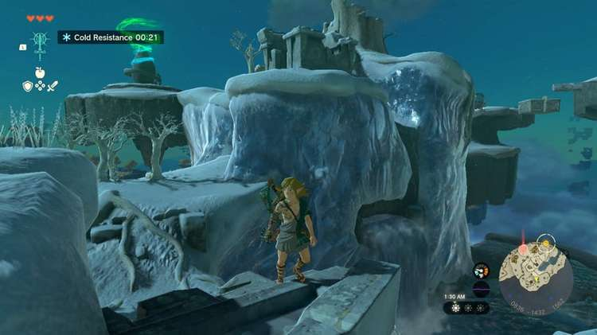

Drop down to the path below, hang to the left and pass under the freezing waterfall, and you’ll find a small break in the ice just large enough to climb upwards.

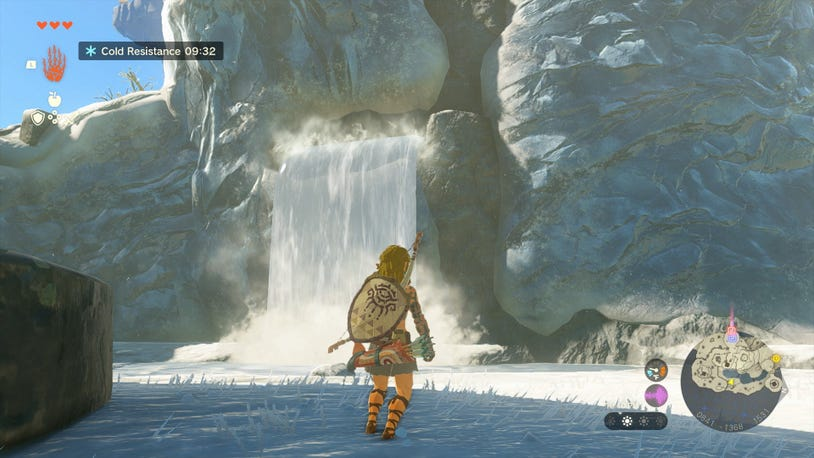

Don’t rush it by jumping; you’ll have enough stamina to make it to the top in one piece.

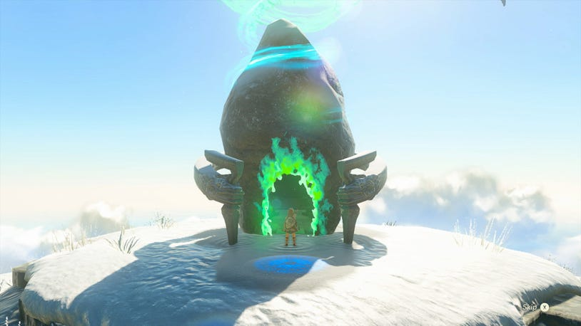

When you finally reach the top, the shrine will be in sight. You can quickly dart off to the left to a ruined building with a Cooking Station and Flint to cook any peppers you might have, otherwise it’s time to take down the third shrine.

Gutanbac Shrine - The Ability to Rise

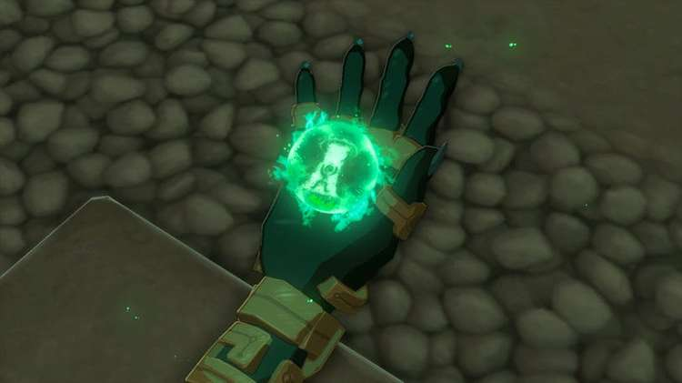

In this shrine, Rauru will appear before you to impart a brand new ability: Ascend. While it may not have too many combat applications, it is an essential part of your toolset for navigating Tears of the Kingdom.

Ledges that were once too high to climb can become a thing of the past, as it allows you to pass through the ceiling that is close enough, and allows Link to “swim” up through to the top of whatever you are trying to get to the top of.

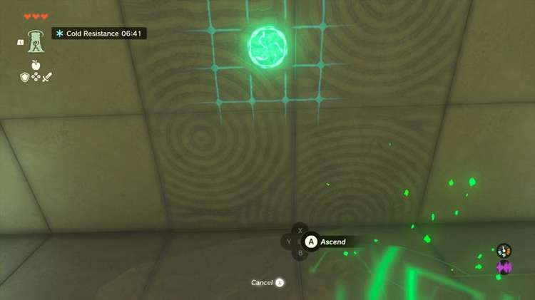

Give it a try as you come to the first obstacle, a large wall with a section jutting out that makes climbing impossible. Ready your Ascend ability and look for the green circle to appear above (or listen for the chime). Press A when prompted, and you’ll be able to get to the next platform.

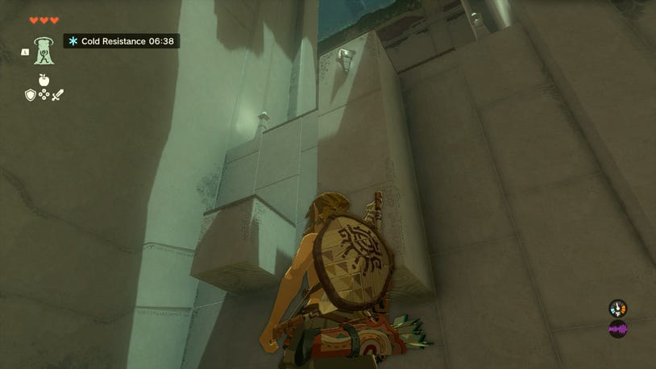

In this next area, there are two high platforms out of reach attached to the edge of a high ridge. Both columns let you stand under them to Ascend upwards, but check out the one on the left first.

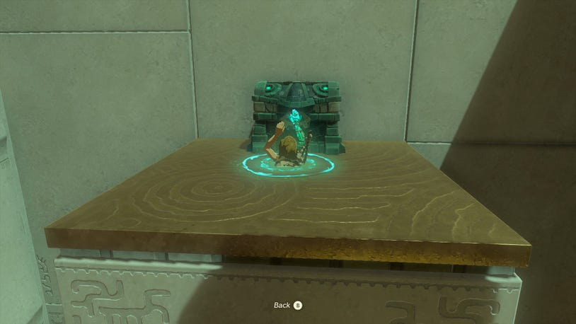

It doesn’t go all the way up, but rather allows you to claim a chest holding a Stone Axe.

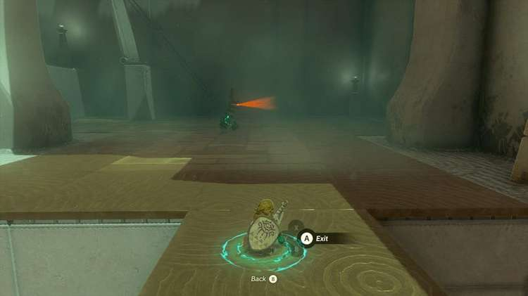

Take the other column to ascend up, and note the Soldier Construct waiting on this platform. While still in the ground, time will be stopped as you Ascend, allowing you to either choose to exit and attack, or press B to cancel and return back down from whence you came.

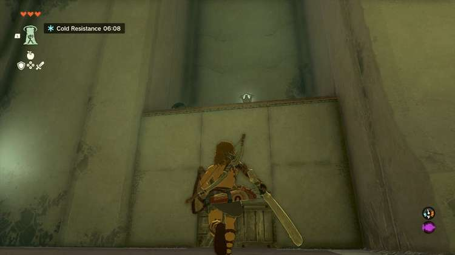

Ambush and defeat the Soldier Construct, and then inspect the room. There is a wall to the right with two crates placed at the bottom, and they can be pushed back to allow you entrance into a small alcove. From here, use Ascend to climb up to a platform above holding another chest with a Construct Bow.

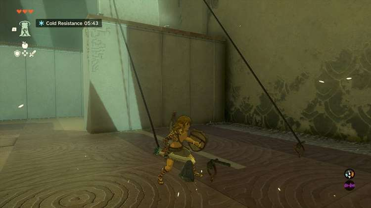

To proceed, look for the raised platform held up by two ropes.

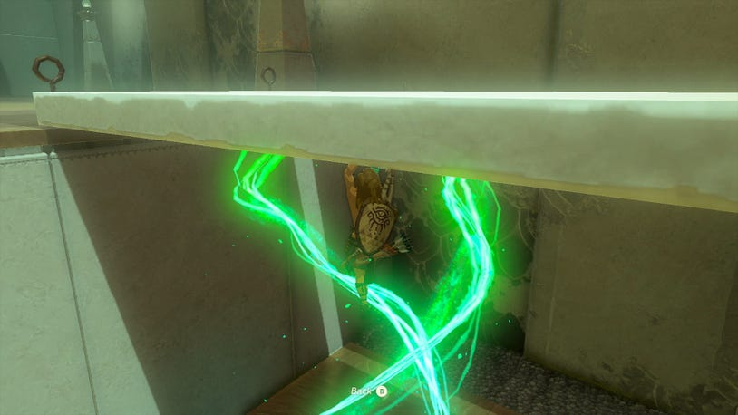

By slashing each rope, the platform will fall down to form a bridge, and you can Ascend up through the lowered bridge.

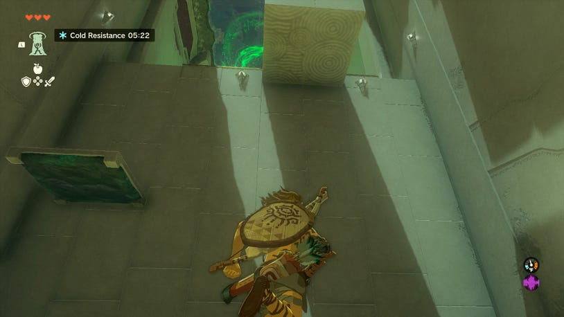

The final puzzle has a high outstretched platform that’s too far up for Ascend to reach, but there’s a much lower moving platform below it. All you need to do is wait for it to pass by to swim up through it, and then look up to hit the next platform as you pass under it.

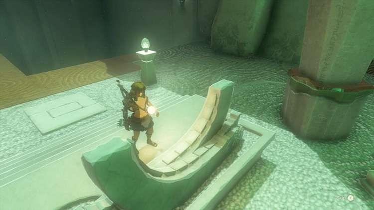

This will lead you straight to the inner shrine, and you can collect the Light of Blessing.

Gutanbac Shrine

Open the Door to the Temple of Time

Now that you have three Light of Blessings, it’s time to return to the Temple of Time.

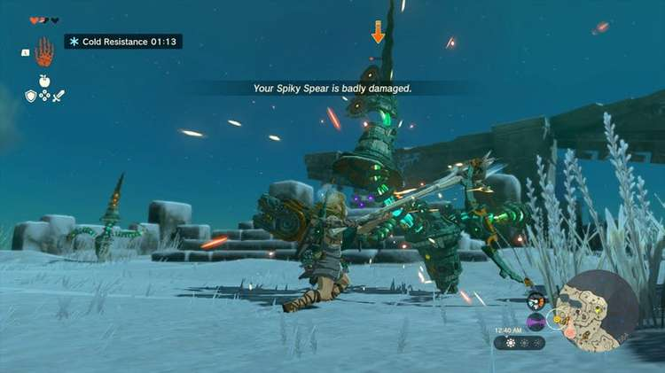

As long as you have the Ascend ability, you can use it on the icy raised platform south of the shrine where a few Soldier Construct Captains are guarding a chest with an Opal.

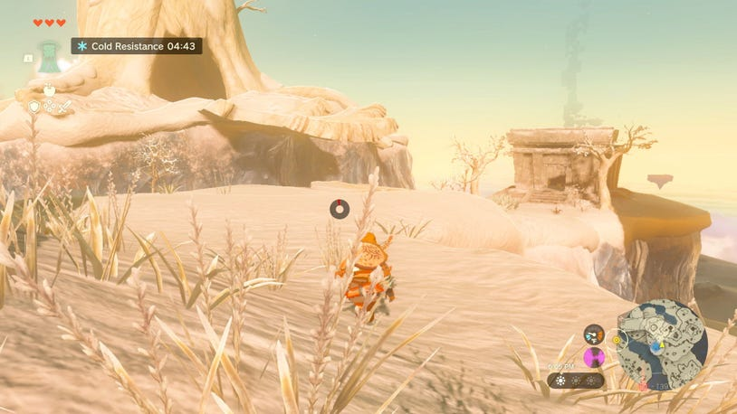

Be sure to also use your new Ascend ability on the outstretched wooden ledge leading to a large hollow tree stump. Inside this tree is a green chest that holds an extremely important piece of apparel – the Archaic Warm Greaves.

Archaic Warm Greaves

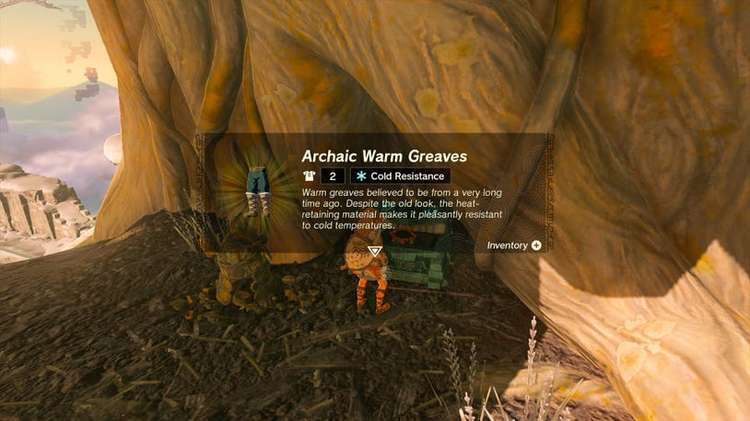

These will effectively keep you warm in cold places like this, allowing for more exploration without needing to constantly eat more Spicy Peppers!

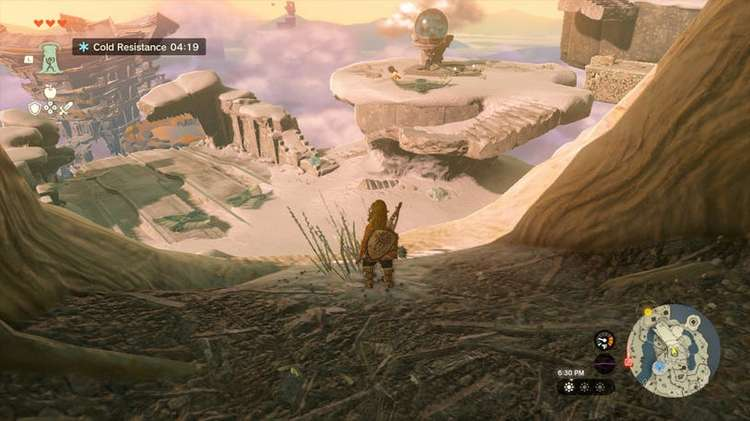

On the other side of the tree stump is a large platform featuring several Zonai Devices. Rauru can be found along some stairs leading to another Zonai Device Dispenser, which you can use to stock up on more Fans and Portable Pots, along with the Wing gliders, which are a great way to get between islands.

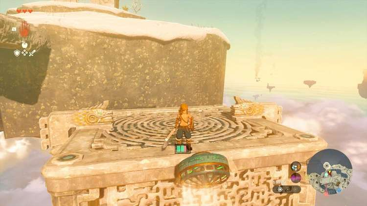

Before moving back down, use Ultrahand on the nearby floating platform to place it under the ledge of a higher island, and Ascend upward to find a ruined building holding three Wings.

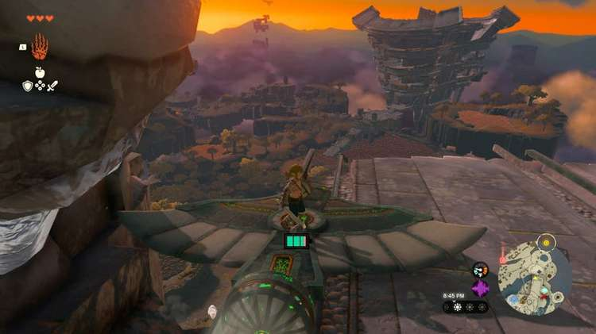

Return to where Rauru was sitting to find a few Wings sitting next to a sloping pad. Place it on the slope with Ultrahand (and attach a Fan at the back if you’d like), and it will slowly start sliding down the ramp — which is your cue to hop on.

Once in the air, you’ll find the Wing glider works really well when you use Link’s weight as a counterbalance. By standing in the center of the glider, you can even out the flier to glide straight with minimal descent. Walking toward the nose will cause it to dive at a steep angle, and walking onto either wing can cause it to bank left or right.

From this spot in the air, there’s several spots you can try to land if you’re feeling adventurous. Down below in the icy region, there’s a large raised platform surrounded by ice and guarded by three Construct Archers firing Ice Fruit arrows near the lower icy river, and the only way to reach it is by crash landing the Wing, where you can claim a chest holding 3 Fans.

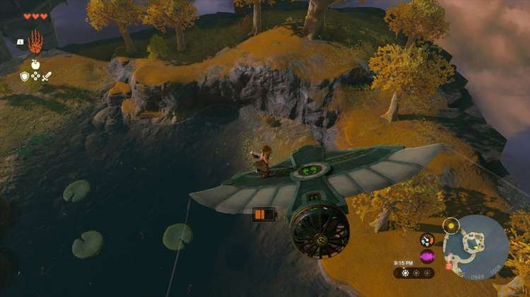

You can also decide to fly straight down towards the Temple of Time, and angle to the right for a high raised island over the water that has its own pond. Rauru is sitting here and will talk more about this strange place, and you can also use Ultrahand to dredge up a chest holding a Large Zonaite.

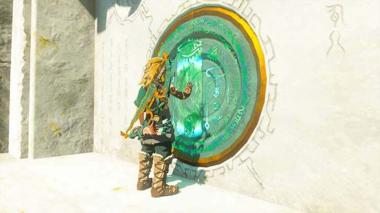

When you’re back on the lower main island, return to the Temple of Time, and open the door with your new power.

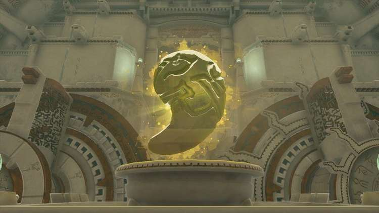

Inside, you’ll find a large room with water wheels and a glowing yellow tear-drop gem in the middle of the room. By interacting with it, Link will learn the fourth core ability from an unlikely source: Recall.

This ability differs from the Stasis ability from Breath of the Wild in many key ways. By selecting the ability, you’ll freeze time, and can pan the camera to specifically target any moving inorganic object. Once an object is highlighted, you’ll see the path of its recent momentum, and can reverse that flow at will for a limited time.

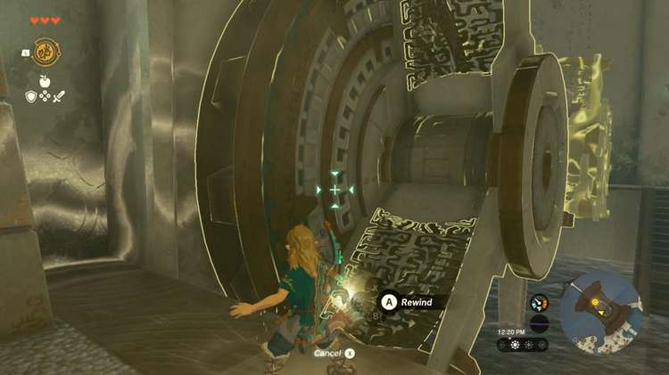

Test it out by using it on one of the water wheels, and it will reverse its direction, allowing you to use the small platforms to reach the central spot, where you can use Recall again to ride the back wheel up to a large door.

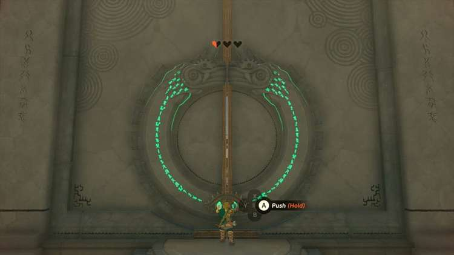

There’s a Goddess Statue here that can convert the Blessing of Light into Heart Containers, but more importantly for the moment is the large door that has two hand marks. By trying to interact with it, you’ll find that it requires a certain amount of vitality – an amount that Link is still lacking from his recent wounds.

Rauru will muse that you may need a bit more life in you, and a final fourth shrine can give you one more Blessing of Light that you can trade in at the Goddess Statue to get a Heart Container.

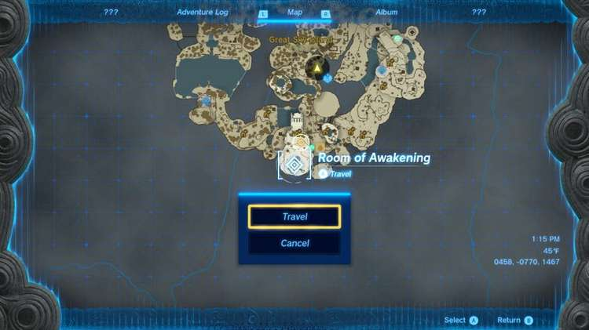

He’ll also give you the ability to fast travel and teleport to the location of any shrine you have activated, as well as important places like the Room of Awakening where you first appeared on the Sky Islands.

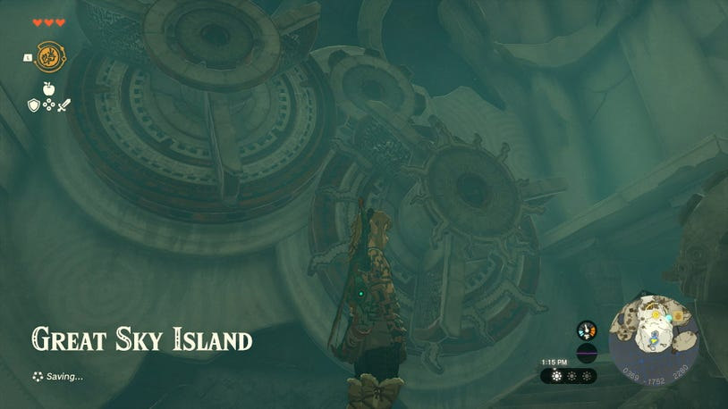

Traveling to this far southern point, you’ll be back in the first room with the giant water wheels, though now you’ll have a way to utilize them. Start by moving to the right under a large ledge, and use Ascend to get to the upper level.

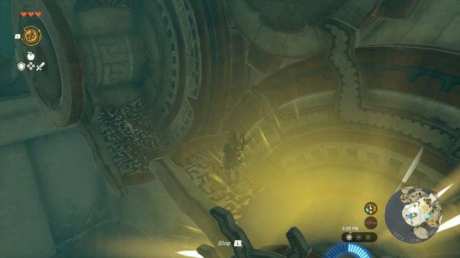

From here, use Recall on the first water wheel, which will cause both to change directions, and allow you to cross to a platform on the far side leading to a small earthen tunnel.

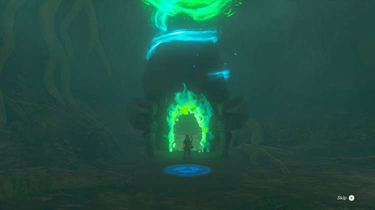

You’ll head out the other side to find the final shrine, and can enter it for one final test.

Nachoyah Shrine - The Ability to Rewind

Entering the fourth shrine on the Great Sky Island, you’ll need to use the Recall Ability to solve a few momentum puzzles. The room ahead has a large river that passes through it, with no way to swim across.

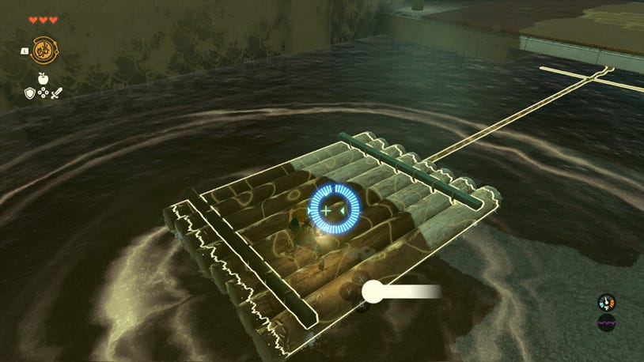

Instead, wait for a moment for a large raft to come drifting along and, once it reaches you, use Recall on it and hop aboard to ride it back towards a stable platform.

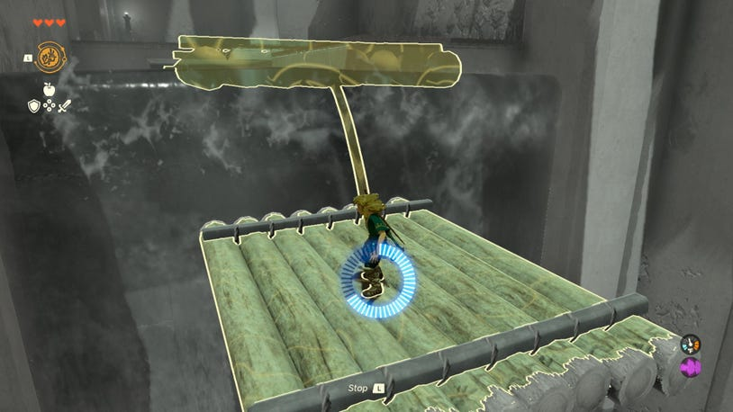

Once you’re on stable ground, stop Recall and wait for another raft to come tumbling down from the waterfall above, and Recall it to ride it back up to the ledge above (the bouncing shouldn’t cause you to fall off).

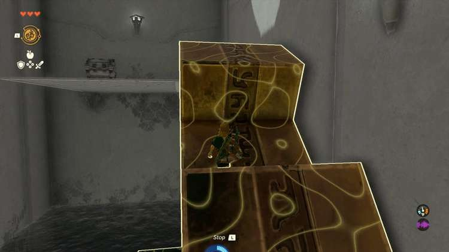

At the top of the ledge, you can look to the left to spot a large turning gear with a platform at the top. Since it’s turning toward you, try Recall on it to turn it into an escalator going right up to the platform that has a chest holding 10 Arrows.

The last puzzle may seem odd at first, but all it takes is a bit of patience and a careful eye. Two rotating objects that look like clock hands will continually turn opposite each other, but at certain points will cause the door to briefly open.

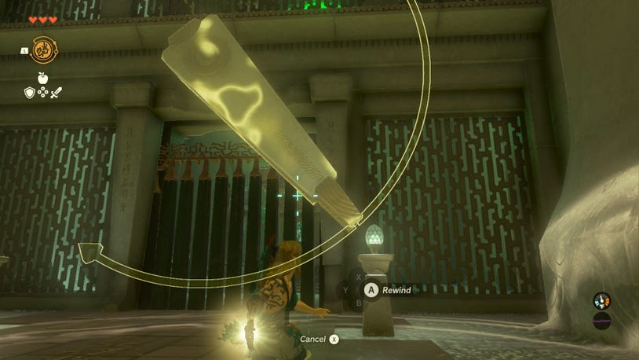

By watching it for a bit, you should find that the door only opens when the clock hands meet — but they’ll only be aligned for a moment. With this in mind, wait until they hands meet to freeze time with Recall, and when you are sure the door is opening at their alignment, use Recall on one of them so that it travels with the other clock hand, keeping the door open.

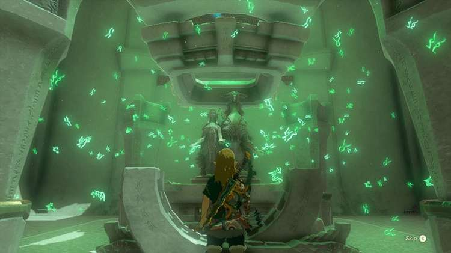

As long as Recall is still active, you can head to the inner shrine to collect the Light of Blessing.

Nachoyah Shrine

Open the Final Door

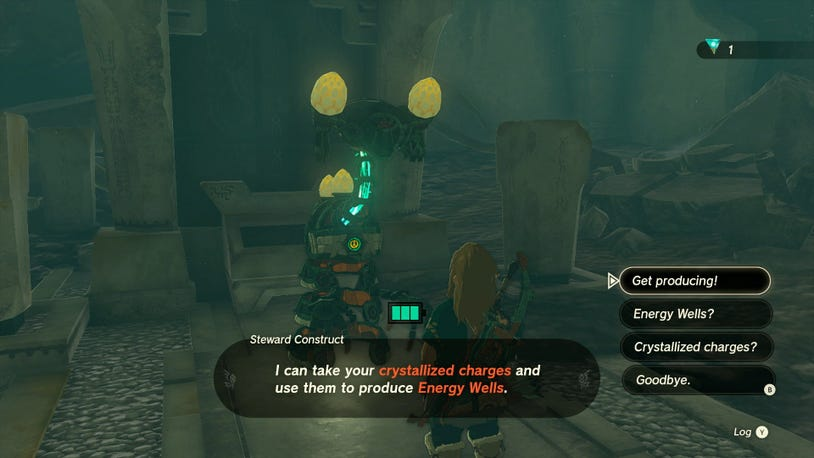

As you exit the shrine, be sure and talk to the Steward Construct by a forge nearby. This is the one you’ll want to talk to when you’ve saved up a ton of Zonaite and bought the Crystallized Charges from the other Forge down below. He’ll convert 100 Crystallized Charges to add another battery to your Energy Cell, extending the time you can use Zonai Devices. That said, you’ll be able to get pretty far on just the one battery for now, so don’t worry about trying to upgrade it right away.

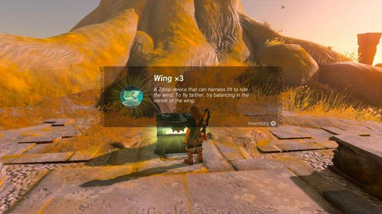

Head out the open door back outside to find another platform with Wing gliders you can take to quickly speed back down to the Temple of Time. Before you do, try climbing up the ledge behind where you exit to find a chest up above with 3 Wing Capsules you can store.

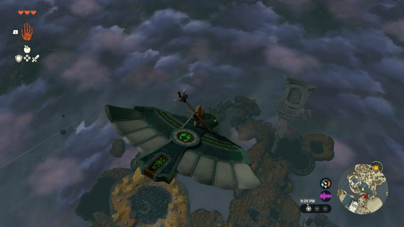

When flying back down, you can also choose to make a detour back down below to the large circular arena where a miniboss is located. It may be a bit tough, but very doable if you have stockpiled some fused weapons and have food to eat.

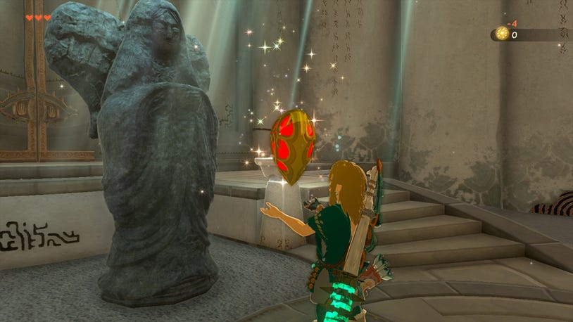

When you’re ready to leave the Great Sky Island (which you can return to later thanks to your new ability to warp), head back through the Temple of Time, and speak to the Goddess Statue in front of the large door. It will allow you to trade the four Light of Blessing you’ve gathered so far in exchange for a Heart Container, putting your total at four.

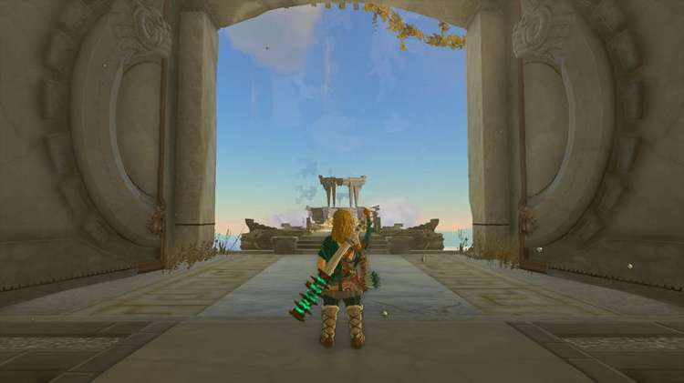

Newly strengthened, return to the large door and put all your might into opening it, and Link will successfully open up to a long walkway on the other side of the Temple. Rauru will have a few last words for you, now that his job has been completed, and will vanish.

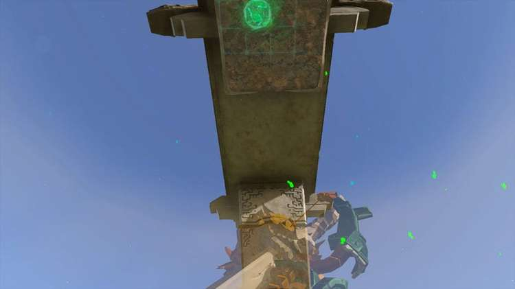

Make your way across the broken platforms, and use Ascend to get back up to higher ground, and you’ll finally reach the end of the walkway where a large glowing yellow light sits atop a pedestal.

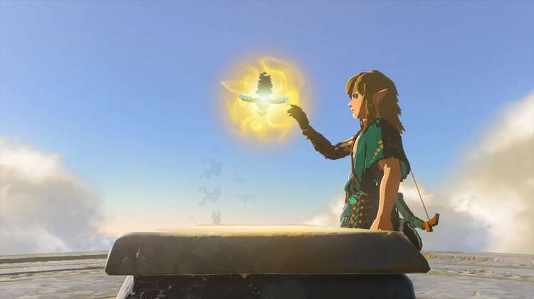

Link will interact with it with startling effects, and soon the clouds below will part to reveal the lands below. It’s time for your adventure to truly begin – by returning to the Kingdom of Hyrule.

To do so, you won't need any tools or wings. You simply have to take a leap of faith and jump off the ledge. Aim for the lake below to land safely in old Hyrule. Link's adventure now begins for real.
