32. Guidance from Ages Past

How to Start Guidance from Ages Past

Important: You'll need to have finished Secret of the Ring Ruins in order for the Guidance from Ages Past quest to become available.

At the end of the Secret of the Ring Ruins main quest, Guidance from Ages Past will immediately begin. You've found a strange Zonai relic on Dragonhead Island, and a beam of light has emerged from it. It's now time to follow the beam of light to see where it leads.

Pick it up before you do anything else, and walk down the ramp with it. On the right, you can find construction materials needed to make an aircraft using Wings, a Fan, and Steering Control. Make your aircraft and then attach the beam on to it.

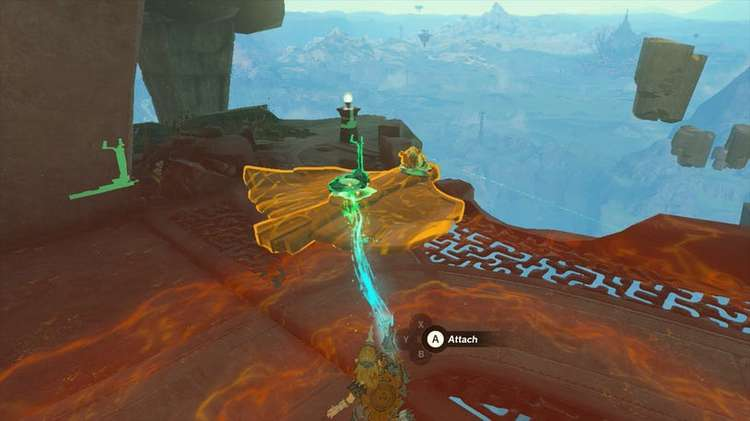

When you're ready, fly it down and the beam will stay fixed, guiding you to the exact place you need to land.

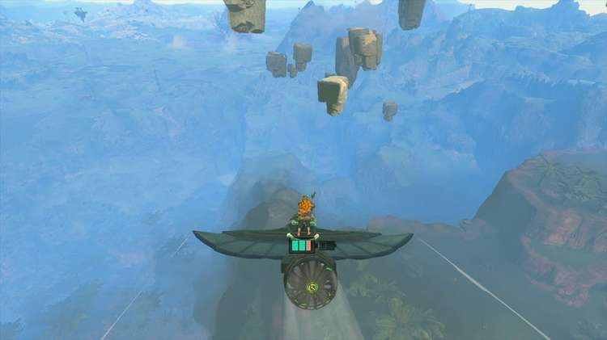

When you get to the bottom, detach the beam from the Wing and take it over to the Altar, where the light beam is shining. You just need to get the beam to line up with it, and a hidden door will open, revealing a set of stairs.

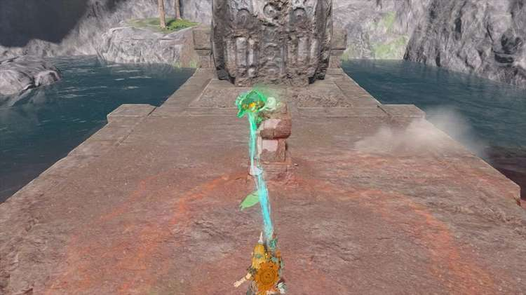

Take the laser down the stairs and into Tobio's Hollow Chasm. When you reach the bottom, place it in the middle. After the cutscene, where Link descends below the chasm, you'll arrive at the Depths and will be able to see Lightroots around you.

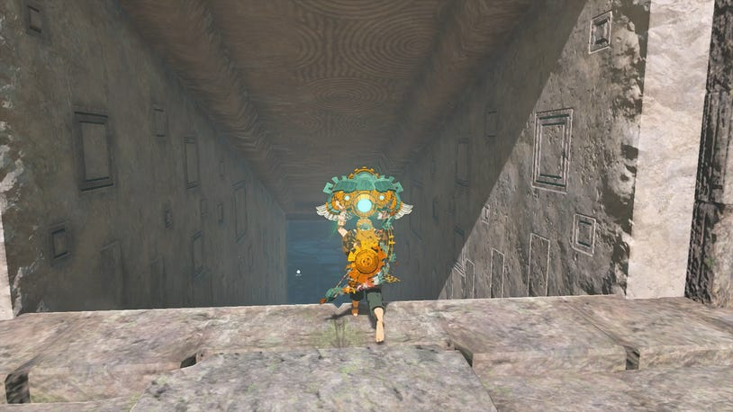

If you turn around a face south, one of those Lightroots – the Muokuij Lightroot – is right behind the elevator. Interact with this to light up the surrounding area and unveil the map.

Muokuij Lightroot

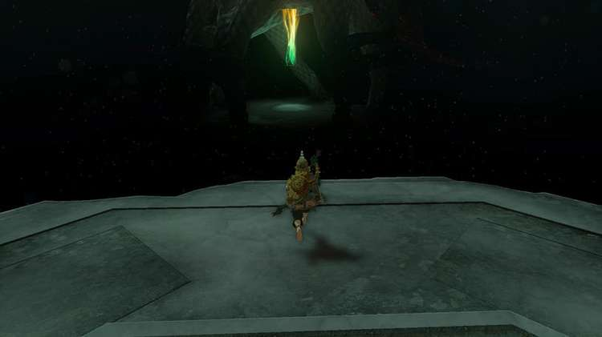

Climb back up and head towards the Construct Factory, pick up the Zonai device with the laser beam emitting from it, and take it toward the disc it's pointing at. Carefully line it up, and place it inside to form the head of the statue.

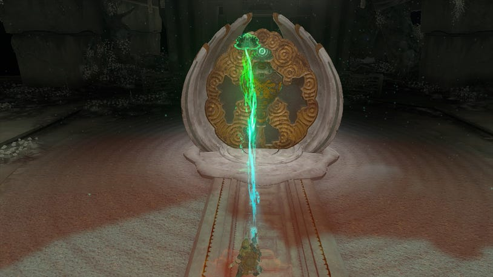

Mineru will begin to talk to you after doing this, and explain that you'll have to visit four storehouses in the depths to collect the rest of the parts and complete the body of Mineru. The green lights of each storehouse will light up as Mineru speaks, making it easy to spot exactly where they are.

Collecting the Mineru Parts

For the next part of the quest, you need to find all four of the remaining Mineru parts and bring them back to the statue to complete it. The four storehouses are located in the northeast, southeast, southwest, and northwest, so we'll refer to them as such along with their depot name in our detailed walkthrough for each one below:

Northeast Storehouse - Right-Leg Depot

Southeast Storehouse - Left-Leg Depot

Southwest Storehouse - Left-Arm Depot

Northwest Storehouse - Right-Arm Depot

It's advised to use plenty of Brightblooms down here, as it's the Depths. This will help you see where the Gloom is, and avoid it until you're able to illuminate paths using the various Lightroots.

Northeast Storehouse - Right-Leg Depot

Northeast Storehouse - Right-Leg Depot

Head northeast from the statue, but as you enter the darkness, turn to the north. Use a Brightbloom here to illuminate the area so you can see the giant skeleton that forms a ramp up to another Lightroot.

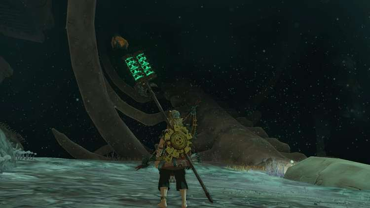

Climb the bones and be careful of the Keese that will appear here. When you reach the top, activate the Uisihcoj Lightroot.

Uisihcoj Lightroot

From here, the Storehouse can be seen off to the southeast.

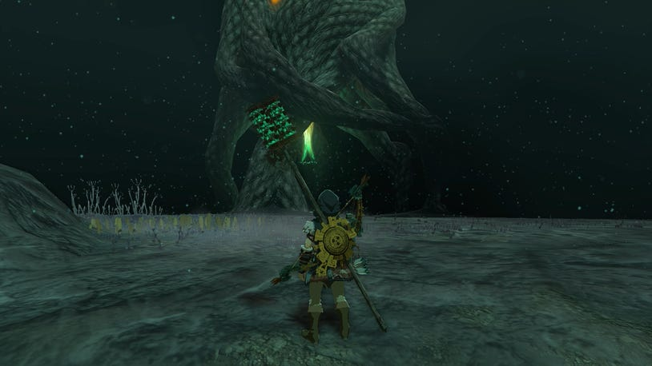

Run along to where the Aerocudas are in the east, then go to the edge of the structure and dive off. Glide over to the floating platform, then turn and glide straight down into the Right-Leg Depot.

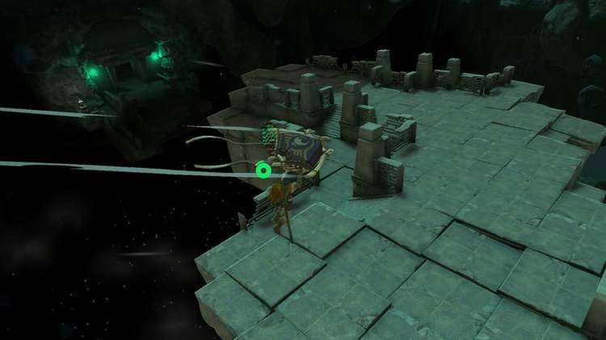

As you enter and go all the way in, you can activate the Zonai terminal, which will trap you inside the depot, but will bring down the Right Leg and open up a gate on the right.

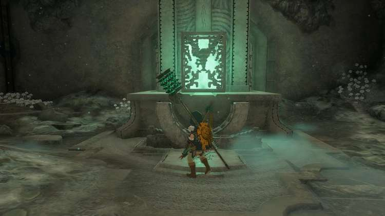

Pick up the Right Leg and take it towards the stairs on the right (south). Step onto one of the platforms on either the left or right and make sure the Right Leg is safely on the platform. There are fans stacked and attached to these, so hit them and ride the elevator up to reach the next level.

You'll emerge in a room with a broken track, but it spirals up and out into another room. The idea here is to get the box with the Right Leg up the spiral track and into the next room. You can do this by turning the U-shaped block on the track into a backward C-shape, so the gap sits on the left.

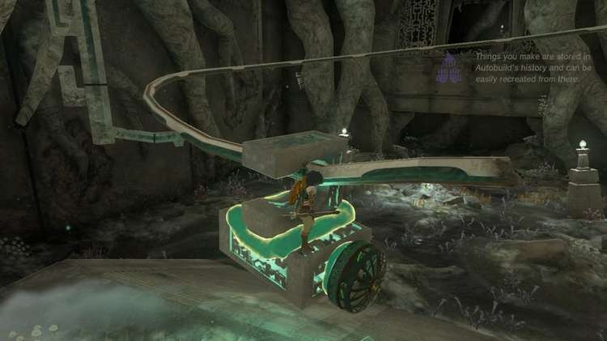

Attach the box with the Right Leg on the bottom, then either use the fans from the lift or one of your own and place this on the back, so it's propelling the box forward. You want to give yourself enough room to be able to ride the hook up along with the box.

Hop off at the top and place the Right-Leg Box on another elevator. Ride this up and you'll be in a room with a ramp going down. If you look at where the ramp goes, it leads straight back to the Construct Factory. In this room, at the top, you can find all the components needed to create an aircraft. You can also find a Treasure Chest.

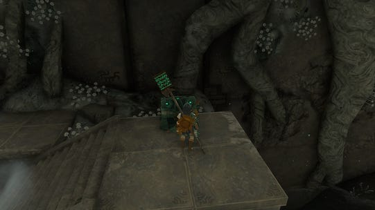

Treasure Chest: On the platform with the wings, you can get Zonaite x 3.

Attach the Right-Leg Box to the Wings, along with a Steering Control and Fans. Fly this back down to the Statue, then take the box over to it and use Ultrahand to grab it and crush the box.

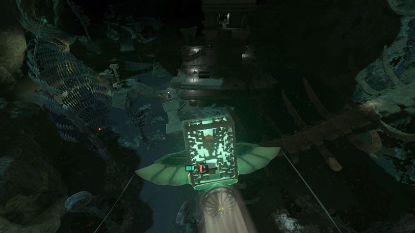

This will reveal the Right Leg and allow you to use Ultrahand to place it inside the impression.

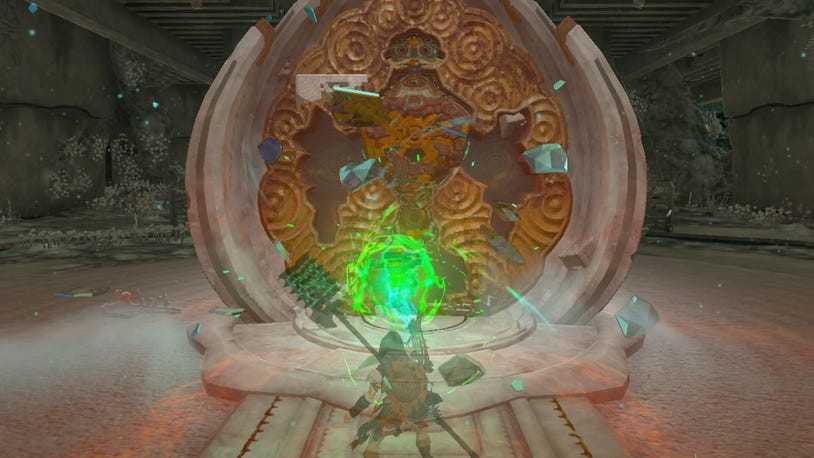

Southeast Storehouse - Left-Leg Depot

Southeast Storehouse - Left-Leg Depot

From the Construct Factory, now go to the southeast. This Storehouse is much easier to reach, as you can just walk straight over to it. Just be careful of the Bokoblin camp you'll pass.

As you enter the Left-Leg Depot, you'll see a Zonai terminal off in the distance. Go down the stairs to interact with it and collect the box with the Left Leg inside. Once again, you'll be locked in and another door will open.

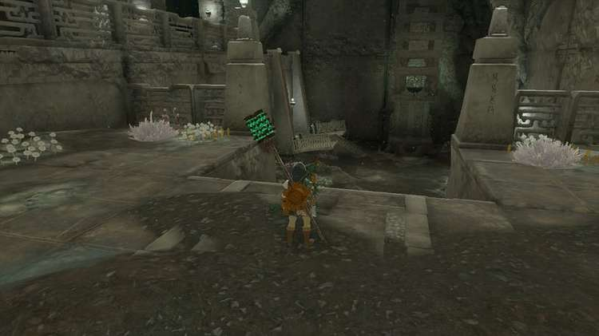

Take the Left Leg Box over to the elevator on the left, and send it up to the upper level. This elevator uses Rockets, so it will go up quickly, and might drop down just as fast.

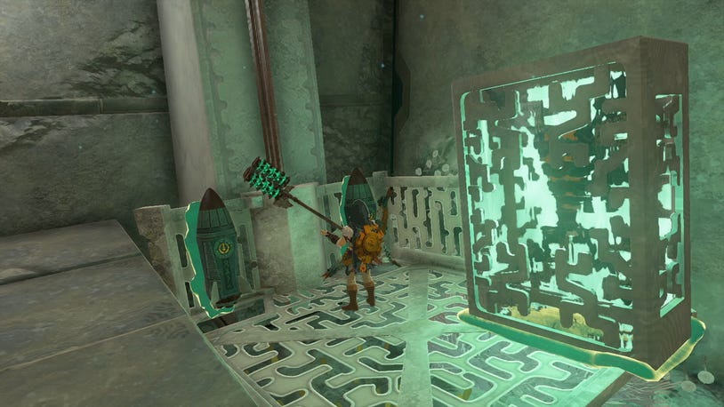

If this happens before you can grab the box, use Recall to bring the platform back up and then Ultrahand to detach the box and take it along with you.

You'll now be standing on the upper level where you can see a wheel and a broken bridge. There are Rockets on the floor, as well as a Zonai Device Dispenser tucked away in the corner in the southeast.

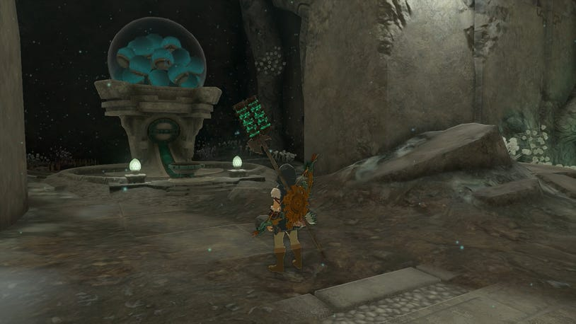

Turn the wheel counterclockwise, to lower the bridge.

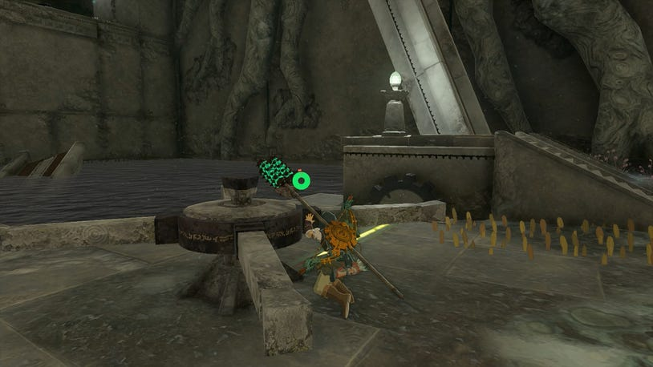

Do this to around 45 degrees, then place the box on the ramp. Strap Rockets to it and then hit, so the box goes flying.

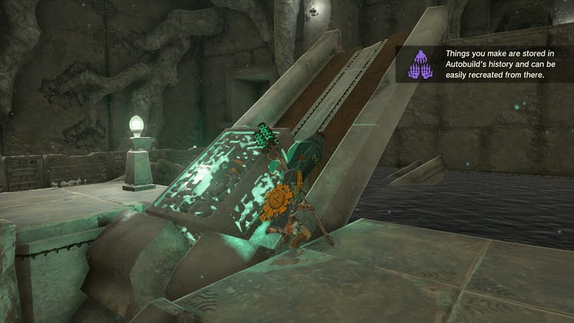

It should land safely on the alcove above and you can use Ascend to get up to the platform, by going up through the gap in the wall left of the water.

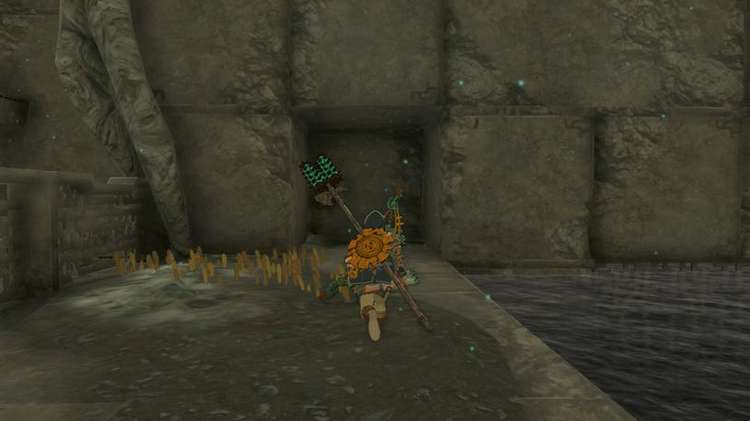

Pick up the box and place it on the runway, looking out towards the northwest and facing the Construct Factory. On the right side of this room, you can Ascend up on the ledge and look behind the laser beams to see two planks with Zonaite on them and a Treasure Chest. Use Ultrahand to attach the Treasure Chest to one of the platforms and guide it through the lasers.

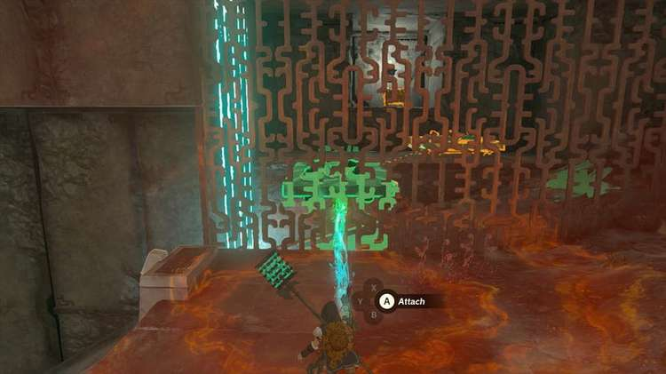

Treasure Chest: Behind the laser beams in the Left-Leg Depot. Contains Large Zonaite.

You can use a cart to take the box containing the Left Leg down, or simply throw it down and pick it up and walk it over.

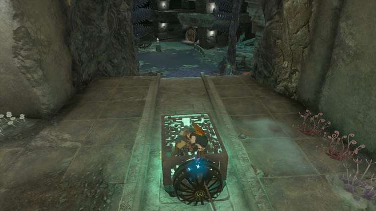

Southwest Storehouse - Left-Arm Depot

Southwest Storehouse - Left-Arm Depot

Head southwest from the Construct Factory and towards the sloping tree trunk. Be careful of the trees that will come to life as you reach the bottom of the trunk. Walk up this slope to reach the Left-Arm Depot.

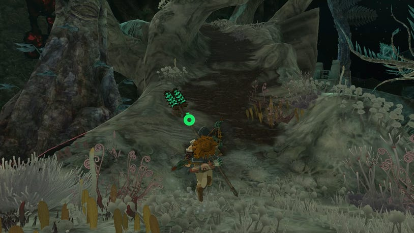

The Zonai terminal to bring down the Left Arm is on the left of the room, and you'll see a wheel by a door. Activate the terminal, then hit the wheel against the door. This wheel will lift the door, giving you enough time to use Ultrahand and get the Left Arm Box through it.

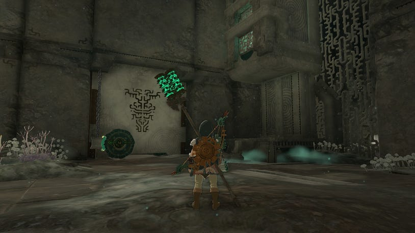

Help yourself to two of the wheels from the door and pick up the Steering Control to turn the box into a vehicle you can ridge across the Lava.

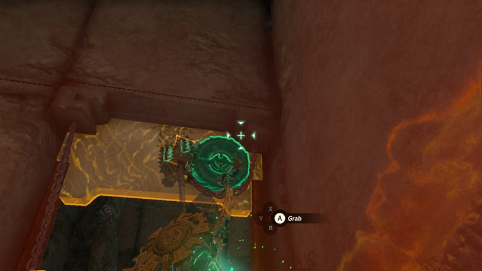

As soon as you reach the metal grate on the other side, look to the left and climb up the ladder.

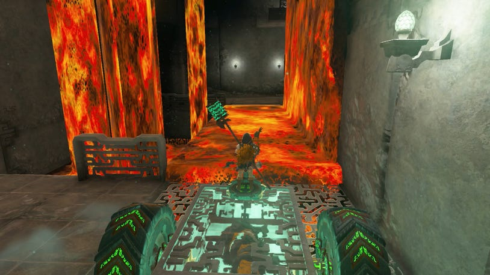

From here, you can climb across to the broken platform and find a Treasure Chest.

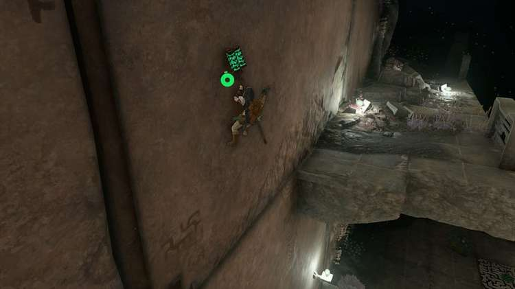

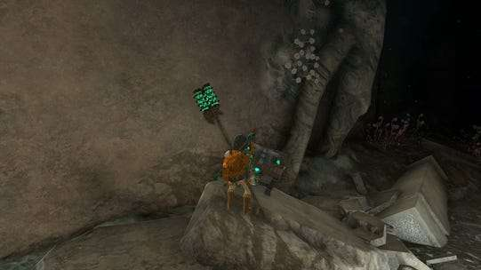

Treasure Chest: On the broken platform on the top level in the room ith the lava. Contains Steering Stick x 5.

Drop down and rearrange the car you made for yourself, so the box is lengthways and the wheels can roll along the lava on either side.

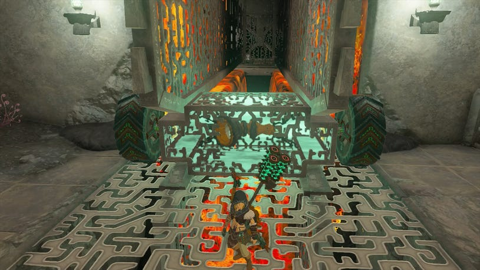

When you reach the other side here, turn left and climb to the top of the ladder. In this room, you can find a Grand Poe.

Drop back down and take the wheels off the box and attach them to the door. Then attach the blocks at the end of the chains to the wheel.

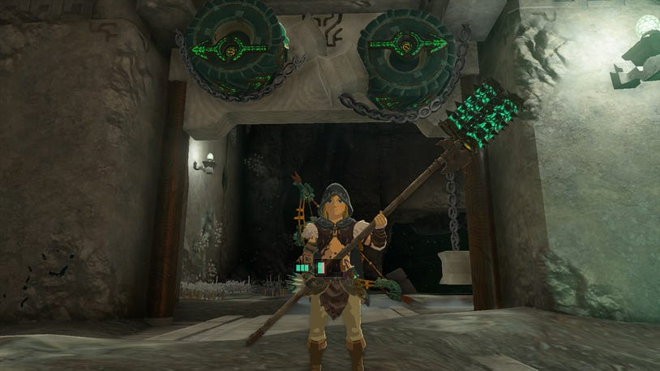

The idea is that when the wheel goes up, it will shorten the chain, so the door rises. Walk through with the box when the door has been raised, then look to the right to see two fans. The fan that's farthest away has a Treasure Chest attached to it. Use Ultrahand to detach it and open it.

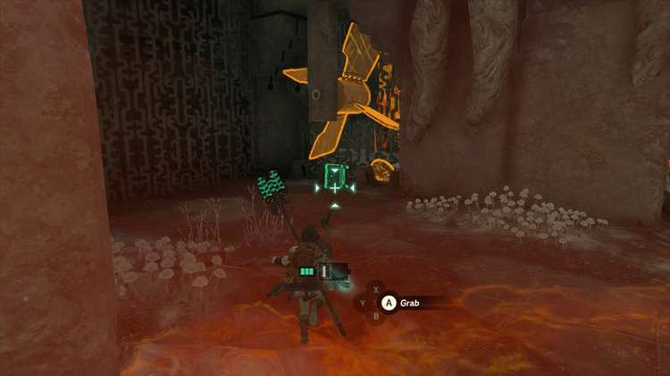

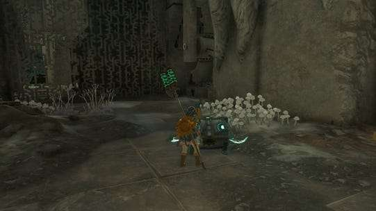

Treasure Chest: On the second fan as you exit the Left-Arm Depot. Contains Zonaite x 3.

There's a body of water in this room that leads down into what's essentially a waterslide exit. You can attach the two fans that are by the larger fans to the box and use the Steering Control to glide down the waterslide and back to the Construct Factory.

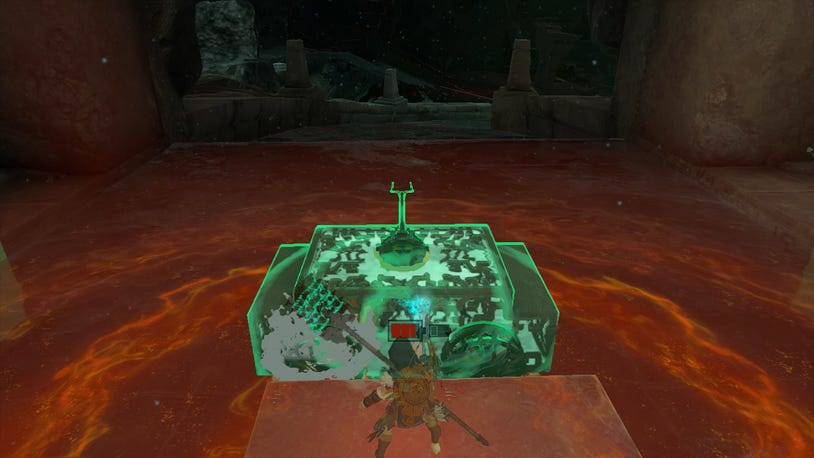

As soon as you drive towards the bank of the river, be prepared to jump off and grab it. Then take the Left Arm over to the statue at the Construct Factory.

Northwest Storehouse - Right-Arm Depot

Northwest Storehouse - Right Arm Depot

Time for the final body part! Head northwest from the statue and you'll see that this Storehouse is also raised in the distance. However, you can just cross the bridge and take the stairs on the left up towards it. Be careful of the patrolling Bokoblins here and the excessive amounts of Gloom that coat the staircase.

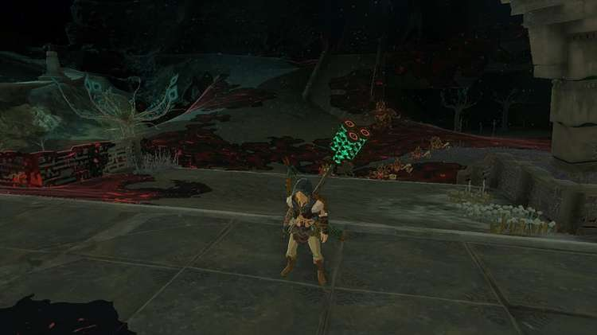

As you enter the depot, head to the Zonai altar and activate it to collect the Right Arm. On the right, you'll see a conveyor belt and a wheel spinning. Stick the box on the conveyor belt and it will go straight up to the next level.

On the second level, there's an electrified bridge, but the important thing to note is the ridge along the left side. You want to line a wheel up on here, so it can travel along without falling and take the box with it. The easiest way to do this is to use the rock on the right and lean the box against it. You can then manipulate one of the nearby wheels, until it fits snugly against the box and will ride along the ridge. When you're ready, send it across.

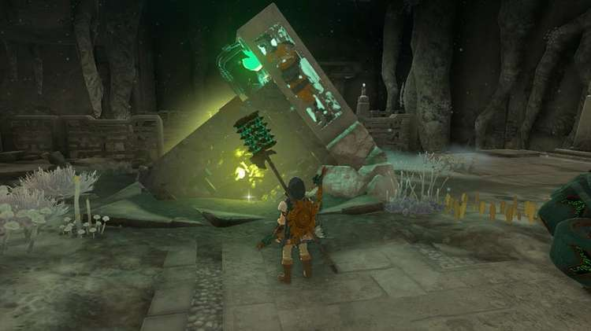

Down the bottom here and go over to the south alcove underneath the electric bridge. Follow it round to a dead end and you'll find a Treasure Chest at Coordinates 0548, -2179, -0527.

Treasure Chest: On the bottom level, underneath the electrified bridge in the south. Contains Large Zonaite.

Climb the ladder to meet the box, and pick it up and take it outside. You'll find construction materials out here, that you can fashion into a cart.

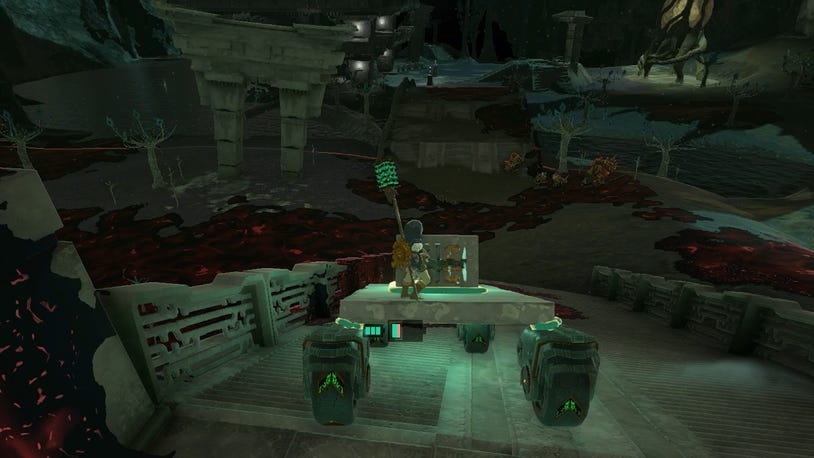

This will let you ride with the box all the way down the stairs and over the bridge backto the Construct Factory, where you can slot in the final piece of the body.

After Returning All the Body Parts

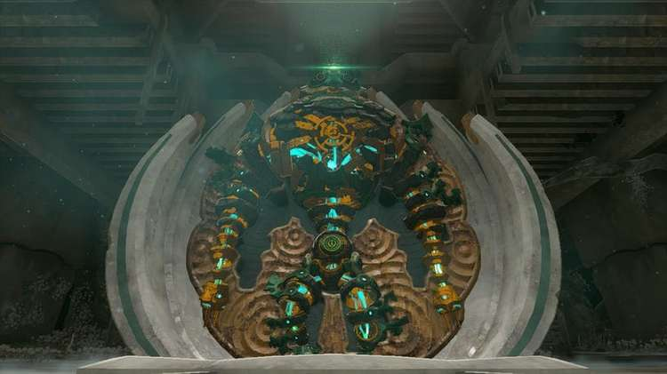

With Mineru's body restored, it's time to recover the secret stone, which can be found in the south of the depths. Mineru's Construct Abilities mean that Link can ride Mineru's Construct. Approach the construct, select Let's Go, and walk towards the platform.

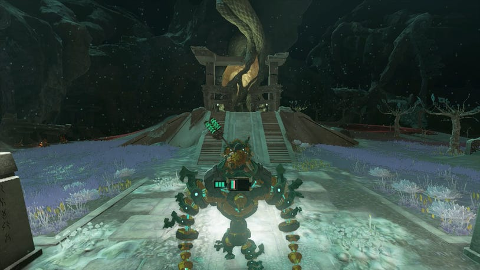

Here you'll be able to attach weapons to the construct body, to help with fighting off monsters in the Depths as you make the journey towards the secret stone. You can attach things to both hands and Mineru's back.

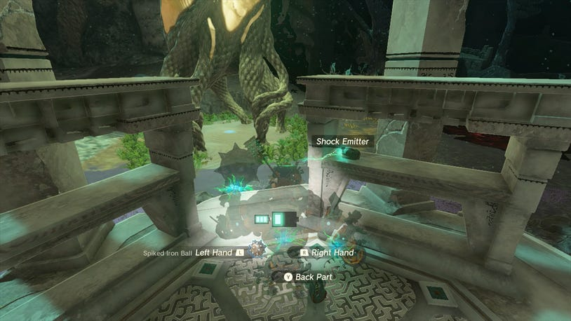

Press X while riding Mineru to unlock the options to fuse weapons. You can then use the corresponding buttons to choose which weapons you want to fuse where (from the left and right hand and the back). When you're walking with Mineru, you can press X again to open up the attack menu.

After some practice and when you feel ready, it's time to head off to the south. As you begin to make the journey, you'll notice that your battery starts to be used when Mineru is walking.

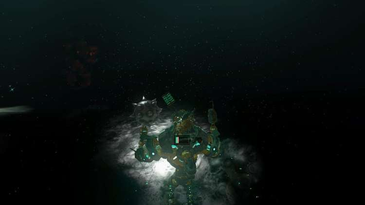

You can actually continue walking when the battery is drained, you just won't be able to attack. You can safely cross Gloom while riding Mineru, and you can also continue to pick things up along the way.

You don't need to use Mineru for the entire journey. If you get stuck, you can just walk and Mineru will catch up and automatically attack anything in its way.

There are various routes you can take to get down to the Spirit Temple, but along the way, it's worth trying to pick up another Lightroot to heal yourself of any Gloom damage and create a fast travel point. Just southeast of the Muokuij Lightroot, you can unlock the Sijotu Lightroot.

Sijotu Lightroot

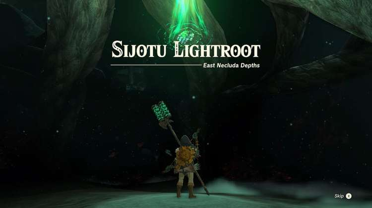

As you approach, you'll be able to spot the Spirit Temple, with its white exterior and glow that penetrates the Depth. The steps to the temple are broken, so to help Mineru up, stop by the shelves to attach a rocket to Mineru's back. You can then press Y and use the rocket to reach the top of the temple and go inside.

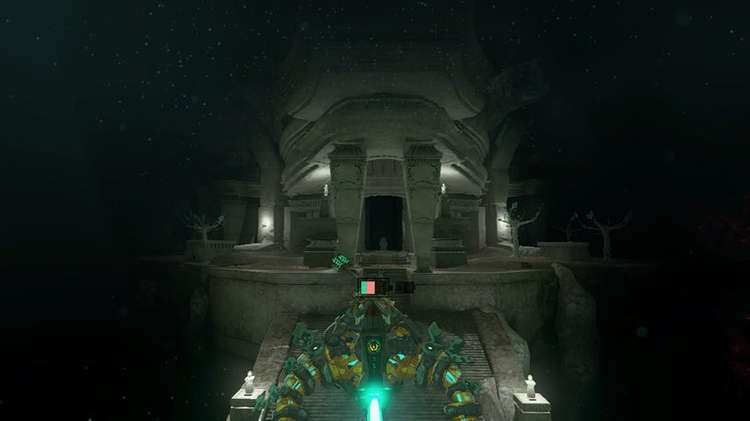

How to Complete the Spirit Temple

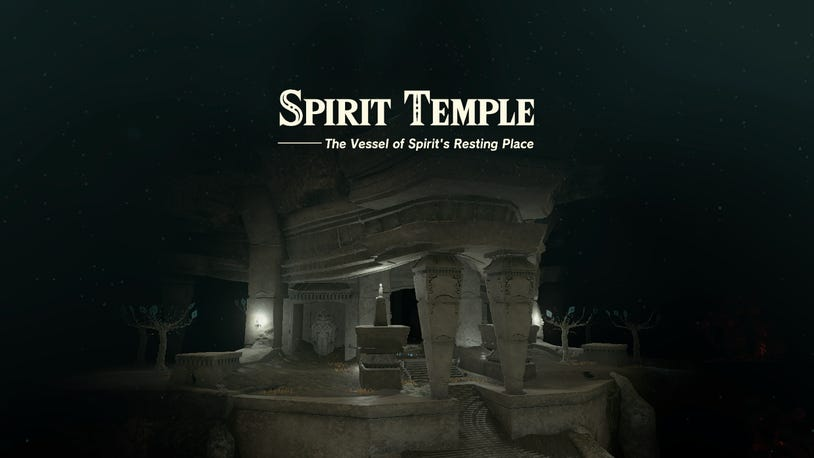

Go inside the Temple and have Mineru interact with the stone structure in the middle. This will create a Zonai portal and lower the platform down to the bottom of the temple. Go towards the center of the lower level and towards the stone on the other side.

Of course, nothing can be simple, and Mineru and Link will be trapped in a ring. The floor will open and a Seized Construct will appear.

How to Beat the Seized Construct

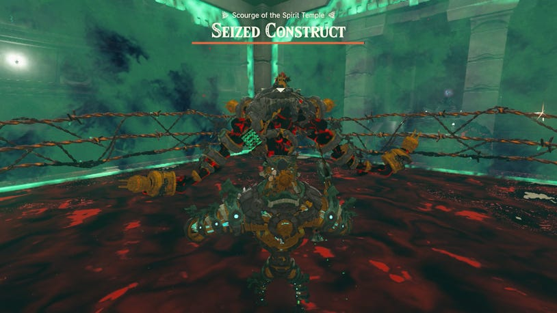

The hits from the Seized Construct can be devastating, sometimes resulting in a one-hit death. Block them by pressing ZL, and then unleash an attack in those moments when it's knocked back temporarily from a block hit.

Hitting it isn't enough sadly, and you need to try and push it towards the edge of the ring so it's stunned and electrocuted.

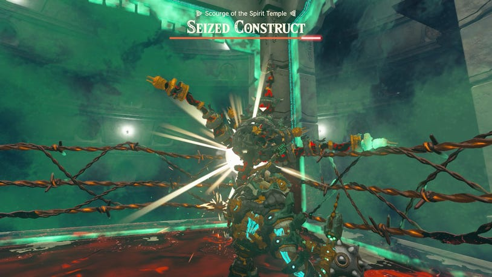

In the meantime, here are the types of attacks you can expect from it.

Push forward while blocking, so you can get it toward the edge of the ring. Don't get too close to it, however, as it will start going for overhead attacks and wipe Link out.

It will wind up and unleash a punch attack, which can be blocked and will cause it to ricochet back. This is when you want to go in and land 3-4 blows to send it flying back and hopefully into the electric fence.

Once it's been stunned, it will jump to another position in the right and pull out hand cannons. Keep strafing side to side to avoid as many of these hits as possible, so it doesn't take down your shield

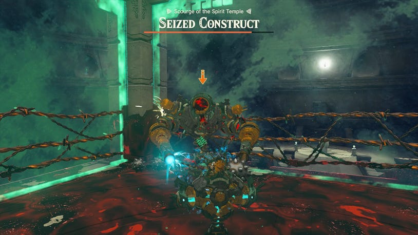

There will also be a stunning attack, where it produces two yellow emitters from its hands and will charge toward you. For this attack, the key is to keep moving until it stops.

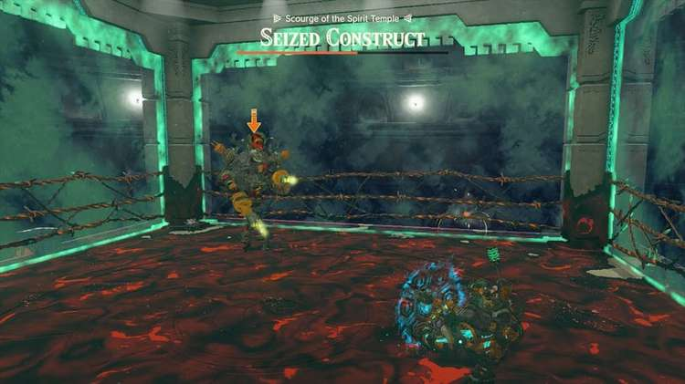

Then you want to watch where it's going to lunge and go in the opposite direction. The build-up for this is quite long, but when it stops to charge up, make sure you keep moving to get out of its way.

The Second Phase

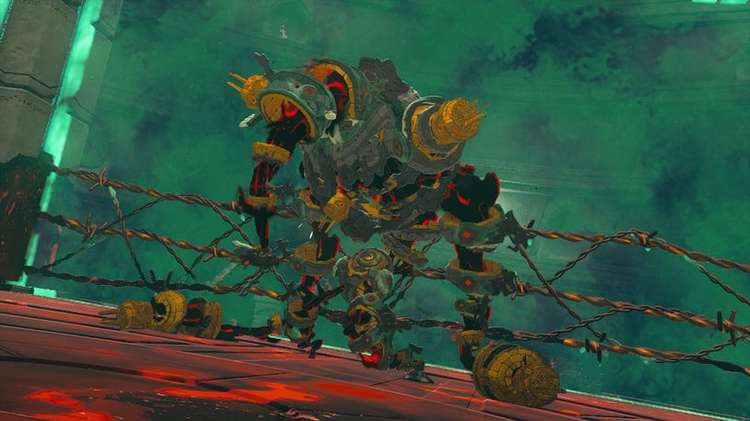

When you get its health bar down to half, the second phase begins and unfortunately, new arms will appear. It will also begin to fly, and continue to unleash the attacks from the first portion of the battle.

You'll have to be patient during this part of the fight, as you can wait for the Seized Construct to fall, leaving it vulnerable to attacks, or when it dives.

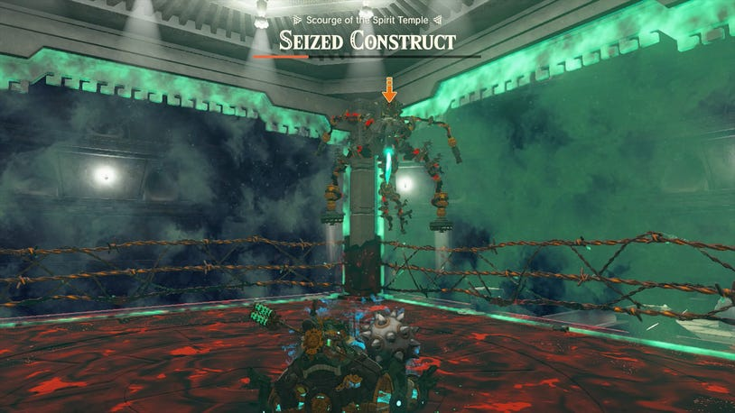

It will begin to drop more weapons that you can steal and use against it. You want to look for a Cannon on the ground, so you can shoot at the Seized Construct while it's up in the air and make it drop down. Then you just want to attack in the same manner, hitting it around 4 times to send it flying into the electric fence.

With the Seized Construct defeated, you can collect the Heart Container, replenish your health, and pick up the secret stone.

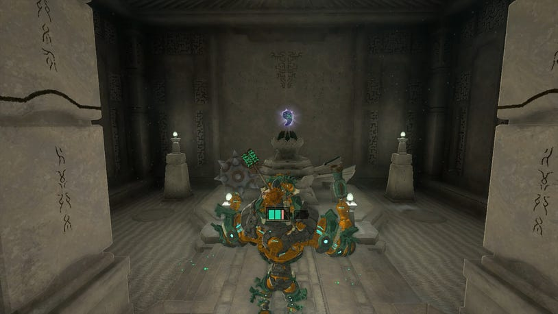

When the cutscene is over, the Guidance from Ages Past quest will be complete, and you can head back to Lookout Landing to finish off Find the Fifth Sage and being Trail of the Master Sword.
