35. How to Beat Ganondorf

How to Find Ganondorf

If you've completed the Mystery in the Depths questline, where you'll find and fight Master Kogha of the Yiga Clan in various abandoned mines, you'll know that he hints at the location of where to find Ganondorf.

To find him, you'll have to return to Hyrule Castle and go to the very depths of it. You can do this by simply returning to Hyrule Castle, either by gliding over from the Lookout Landing Skyview Tower or by using the Serutabomac Shrine to fast travel.

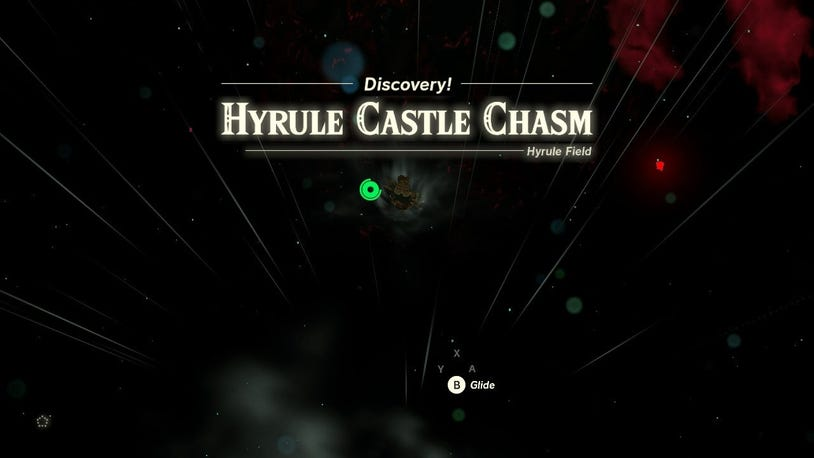

Once you're back at the castle, jump down and head for the area beneath the castle, where the gloom sinks down into the depths. As you fall down, you'll eventually reach the Hyrule Castle Chasm. If you drop down from the Serutabomac Shrine, you can glide down to the corresponding Camobatures Lightroot and an abundance of Poe at coordinates -0178, 1167, -0515 for a fast travel point.

Take this time to ensure you're properly prepared for the long road and fight ahead. The most important thing to note is you're going to face a lot of Gloom. At this point, you'll want to make sure your Armor is upgraded as much as possible, and preferably protects you from Gloom.

Stock up on meals using Sundelion to restore your hearts from the Gloom, as well as dishes that will replenish your health. Visit Zora's Domain to pick up Hearty Salmon to temporarily boost your maximum hearts, Mighty Carp, to boost your attack power, and Armored Carp to increase your defense.

Jump down from here and keep descending. At the very bottom, you'll come to a place called Gloom's Approach.

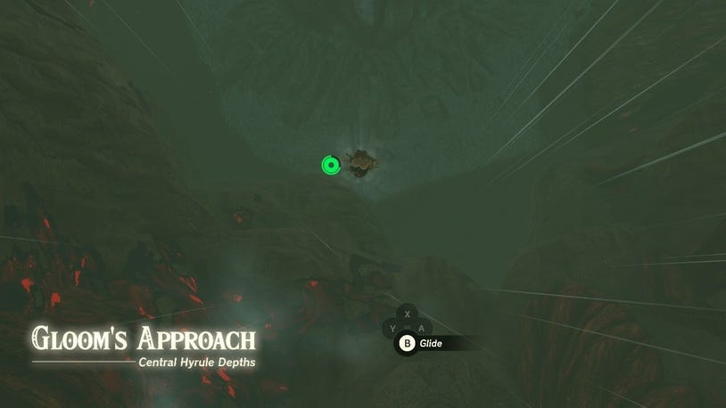

Finding Ganondorf in Gloom's Approach

When you land in Gloom's Approach, head south. You'll initially see a single Like Like that spits balls of electricity hanging from the rockface. As you approach the edge of the ledge, however, and look down, you'll see that there are multiple Like Likes hanging off the rock face.

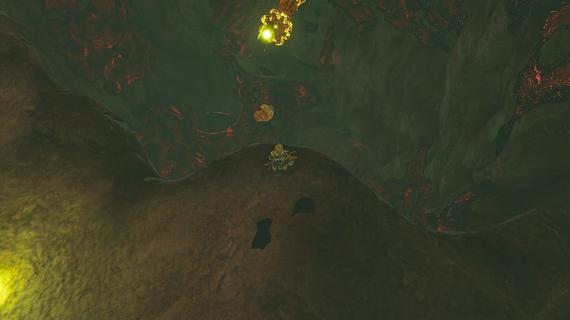

Jump down from this ledge, then glide to the bottom, avoiding the gloom as you do and navigating through the smaller gaps in the rock to reach the next room.

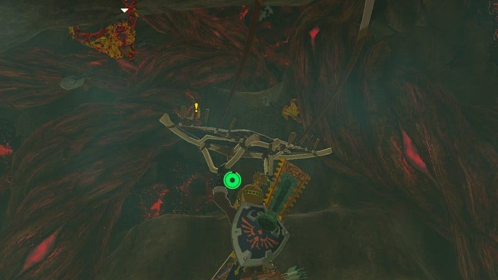

As soon as you squeeze through that gap, you'll enter a cavern with Horriblins hanging from the ceiling. You'll still want to continue going south here, but climb up two ledges to proceed.

You'll drop down from this climb into the next room, where Electric Keese will fly at you.

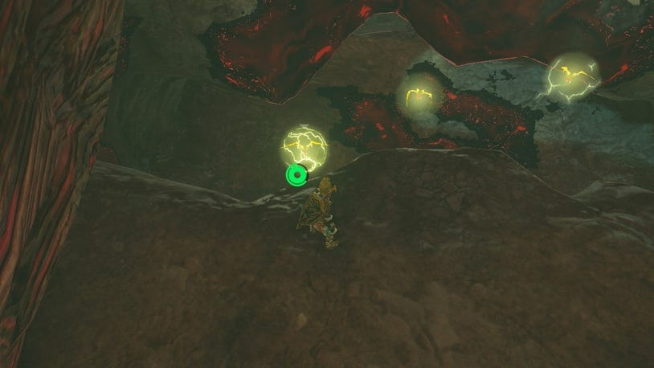

You can dodge these if you don't want to engage with them but be careful as in the center of the main room you're entering is a White-Maned Lynel. From here, head east and climb up to reach the broken ledge.

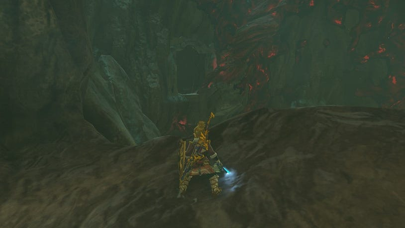

Walk forwards, and despite it looking like it's a dead end, the platform will go underneath you and drop further down. Go with the platform to reach the lower depths of Gloom's Approach.

At the bottom here, go east. As soon as you enter the next section, blocks will fall from above.

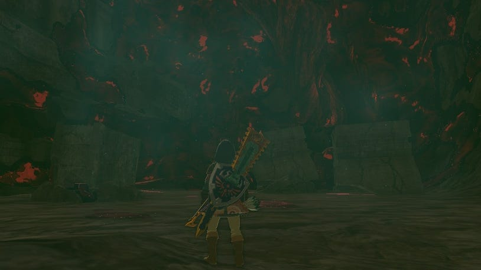

Climb on top of one of these blocks and use Recall to go back up and reach a new section of Gloom's Approach.

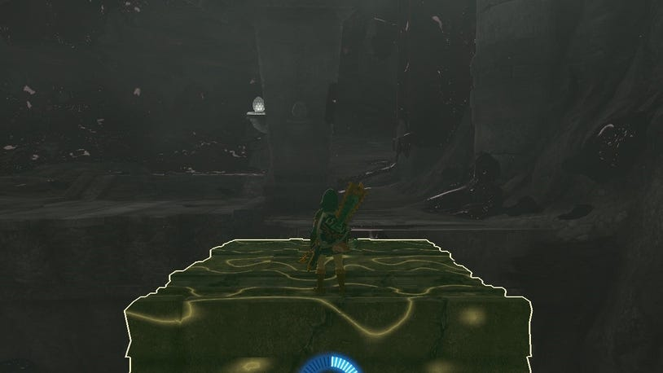

Follow the path until you come to the portion of Gloom's Approach where the Ice Like Likes are on the left (south). As you start to move through this section, Ice Keese will also appear to make it extra tricky to get through without being frozen.

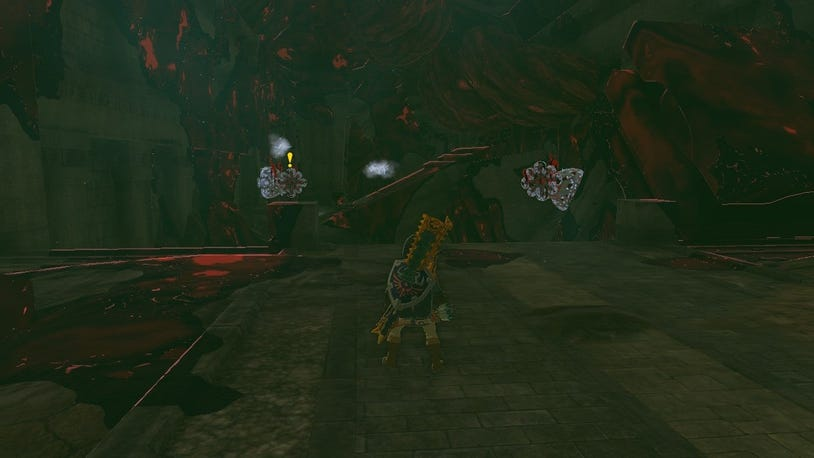

At the end of this gauntlet, when you reach the edge, a small section of the floor will descend.

You can glide down here, dodging the enemies to reach the bottom and a set of stairs. As you get down here, you'll be warned that the power of the sage cannot reach you here. Waiting for you will also be two Lizalfos, who will immediately start attacking after this pop-up disappears.

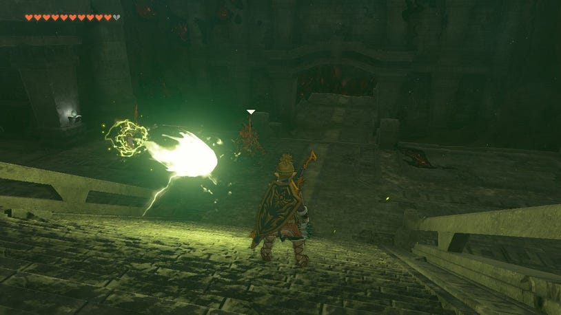

If you face south, you'll see the section you need to head towards. But first, you can go left to find Zonai equipment and devices, while the room off to the right has various weapons and shields.

Approach the south and you'll have another platform that drops down to the bottom of the gloom-filled room, where Gloom Hands will immediately appear. You can quickly dispatch them with Bomb Flowers, and as soon as they disappear, Phantom Ganon will return. If you beat the Phantom Ganon, it will drop a Demon King's Bow and a Gloom Spear.

Look up to the north of this room, to see a broken ledge. Climb up here, then run to the north and down the stairs to the corridor with the glowing stones, which is the Forgotten Foundations. Continue north and into the room where Gibdo will arise. At the end fo this corridor, you'll need a Hammer or a Bomb Flower to break through.

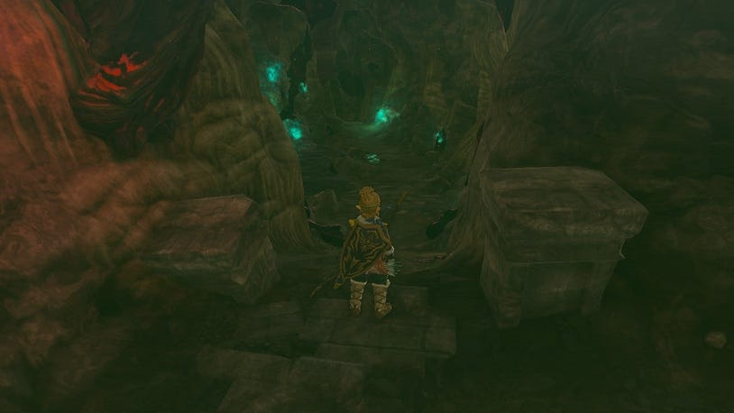

This will reveal a path into a room with a mural that covers the wall. To the east, the path will be blocked. Use a Hammer or Bomb Flowers here to open it up and reveal a secret passage.

Go through this passage and follow it until you come to an edge. This is the Imprisoning Chamber. Jump down and glide to the bottom here to land in Gloom's Lair. Now go south and to the end of this corridor, to reach a platform that hangs above a dark pit.

As you approach the end of the platform, you'll be prompted to jump. Drop all the way down to and let the cutscene play that will begin as soon as you land.

You won't be able to travel out of the depths after the following fight, so double-check you're properly prepared for the road ahead now!

How to Defeat the Demon King's Army

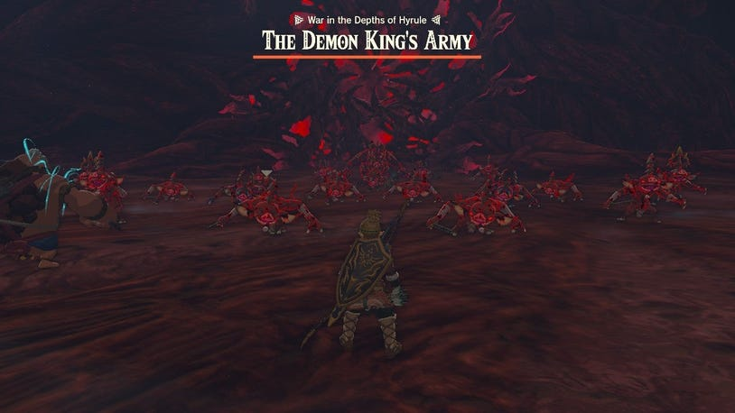

With all of the Sages arriving as backup, it's time to take on the Demon King's Army. In the first round, the Sages and Link will have to take down a swarm of Bokoblin and a Bokoblin Boss.

After the Bokobkin round, Lizalfos will appear. The Sages will just attack by themselves, but you can also use their abilities to help you at times. During this fight you’ll also be able to pillage things from the floor like shields, bows, arrows and weapons. So if anything breaks, you'll at least have some back-ups!

When you’ve cleared the Lizalfos, you can expect Gibdos to appear. Riju’a lightning ability is the perfect thing to use in this round to make light work of them. After the runs of Gibdo, it’ll be a gang of Moblins that comes after.

When the Demon King’s Army have gone, the Sages will hand back to take care of the next set of big bosses that will appear. And now it's time for Link to go one-on-one with the Demon King himself. Head north from the blocked path to jump down into Gloom's Origin and take on Ganondorf.

How to Beat the Demon King Ganandorf

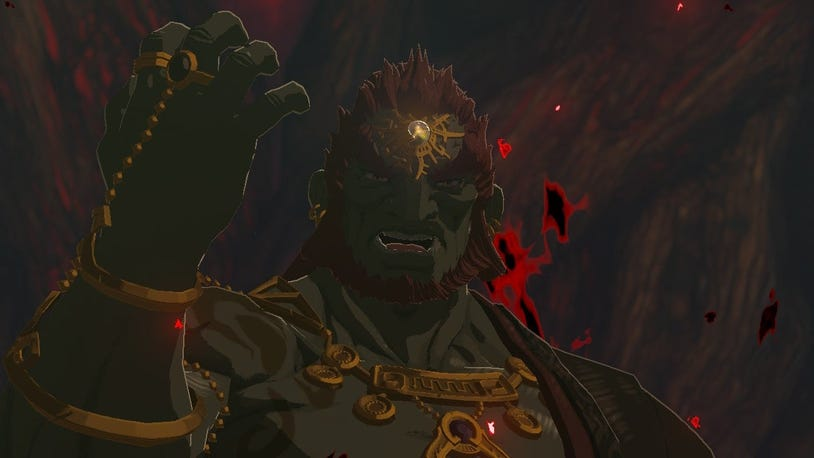

When you drop down into Gloom's Origin a cutscene will play, and the Demon King Ganandorf will start the fight. There are three different stages to this fight, so try to save your Sundelion dishes for the later stages.

The First Phase Against Demon King Ganondorf

The first round is very similar to the Phantom Ganon fight from earlier. Your best bet is to take this phase of the fight slowly, focusing on trying to perfectly dodge his attacks, so you can perform a Flurry Rush. Watch the angle of his attacks as you did with the Phantom Ganon fight to decide if you need to jump backwards or to either side.

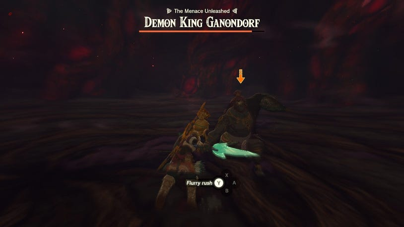

On top of these attacks, he will also switch his blade to a hammer and launch himself in the air, landing as close to you as possible and sending out puddles of Gloom. Again, you can dodge these and activate a Flurry Rush. During this phase, the Flurry Rush will leave him open to attacks and you'll be able to take out a significant amount of his health bar each time, particularly with the Master Sword.

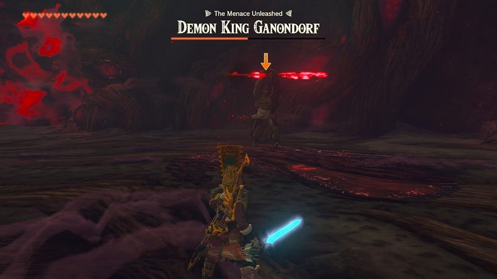

When he's not using a sword or the hammer, he'll switch to a spear-like weapon and lunge at you. You can dodge these by jumping to either side. He'll charge up and dash across the room leaving a trail of Gloom behind when using this variation of his weapon as well.

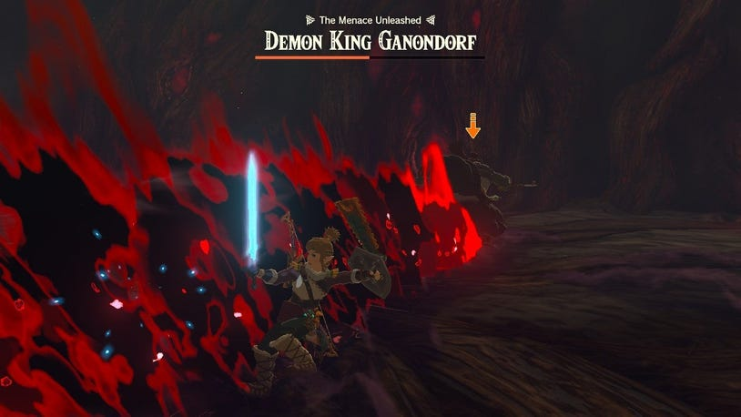

You can dodge all of the attacks in this phase, and if you miss the timing for Flurry Rush, you can take your time and continue to perfect the timing until it activates. This is the easiest way to take his health down quickly. Once his health bar is diminished, as you might expect from this grand finale, the boss fight will enter the second phase.

The Second Phase Against Demon King Ganondorf

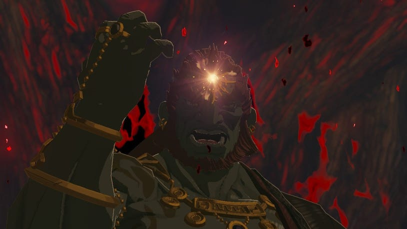

Again, this phase is similar to the fight with Phantom Ganon earlier in the game. Multiple illusions of Ganondorf will appear, and come towards you. Some of your friends will be back for this phase, and take away some of the focus on you. You'll need to concentrate on the Ganondorf that glows brighter than the others, to time your dodges against this one's attacks.

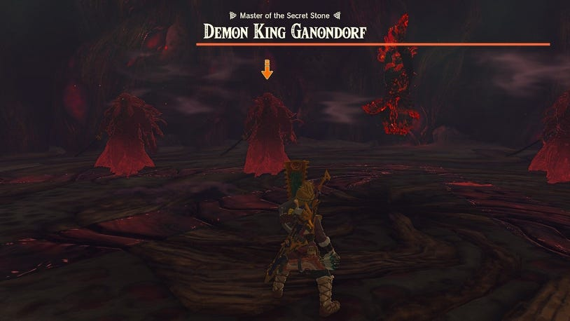

This phase features a lot of similar attacks as the first one, and if you can get the timing for Flurry Rush down, you'll be able to avoid most attacks and quickly knock his health down.

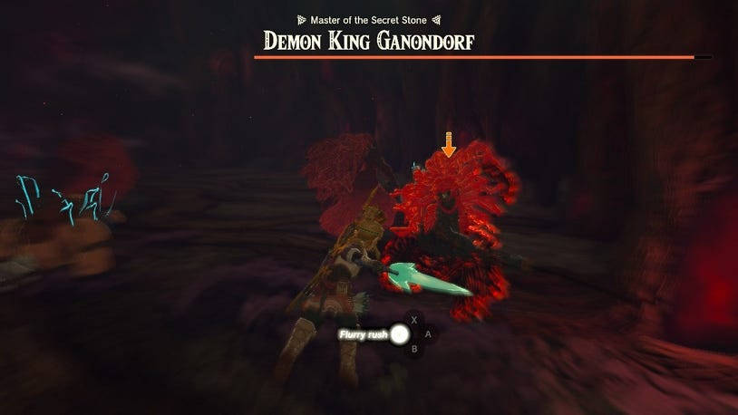

The Third Phase Against Demon King Ganondorf

Once Ganondorf's exceptionally long health bar is down to halfway, the apparitions will disappear, and all the Sages will be out of the fight once again. Now, it's time for Link and Ganondorf to go one-on-one.

During this phase, you can expect the attacks to change drastically. Ganondorf will start to hit his weapon into the ground and send shockwaves of Gloom out. He'll also create circles of Gloom that will encompass Link and attempt to hit him. When the Gloom is coming towards you, you can stand between the rows and let them pass you by. When the circles emerge, you'll need to run out of the circle and away from them.

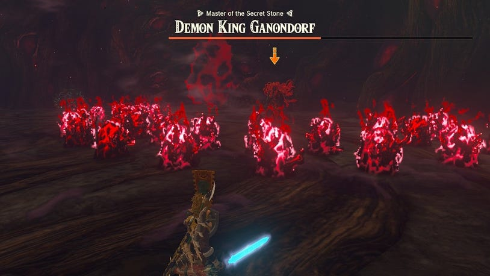

Be prepared for a quick lunge attack that will follow these, when the Gloom has disappeared. Other ranged attacks will feature three projectiles of Gloom that will be shot at you and chase you down. You can run from these but will need to be prepared for a quick dash attack immediately after.

Beyond these attacks, the biggest difference is if you successfully land a Flurry Rush, Ganondorf will counterattack with a Flurry Rush, so he'll jump out of the way and you won't be able to attack at all. Instead, you'll have to immediately prepare to dodge the incoming attack, which will be another quick dash, attempting to initiate a second Flurry Rush to have the chance to actualy hit him.

During this phase, you'll need to watch the Gloom that will start to cover the arena, and any hits from Ganondorf that will remove any of your hearts. This is where your Sundelion dishes will come in particularly useful, and if you've created any meals using Hearty Salmon, use them. The more hearts you have in this phase, the better.

After Beating The Demon King Ganondorf

When his health bar is depleted, the long and challenging fight will be over but he'll regenerate as a Dragon and you'll take to the skies for a final battle sequence.

How to Beat the Demon Dragon

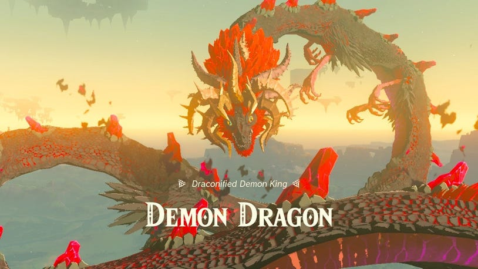

On the Demon Dragon's body, you can find four glowing weak points that need to be attacked. For reference, they look similar to the inside of a Like Like. Use the golden Dragon to fly up above the Demon Dragon, then jump, dive and glide down to each of these points to hit them.

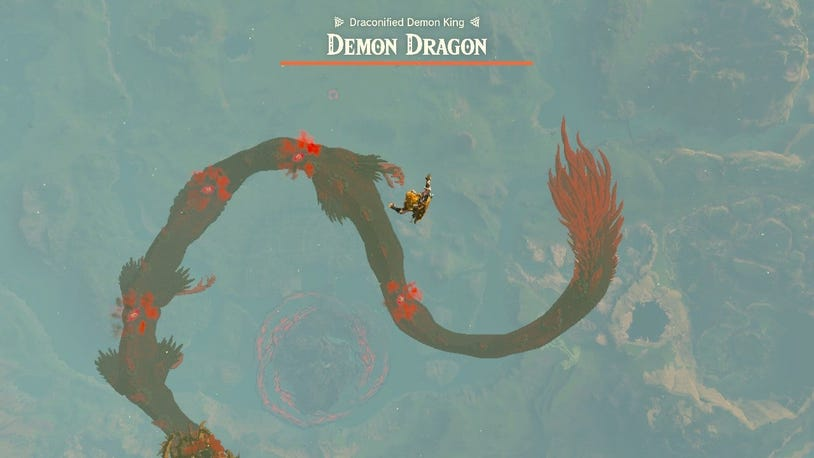

After you've hit each of the points, you'll be pushed off the Dragon and propelled back into the air. You can just drop here, and you'll be picked up by the golden Dragon each time, to help you fly back up above the Demon Dragon. While you float down, be careful of the balls of Gloom that the Dragon will spit out at you.

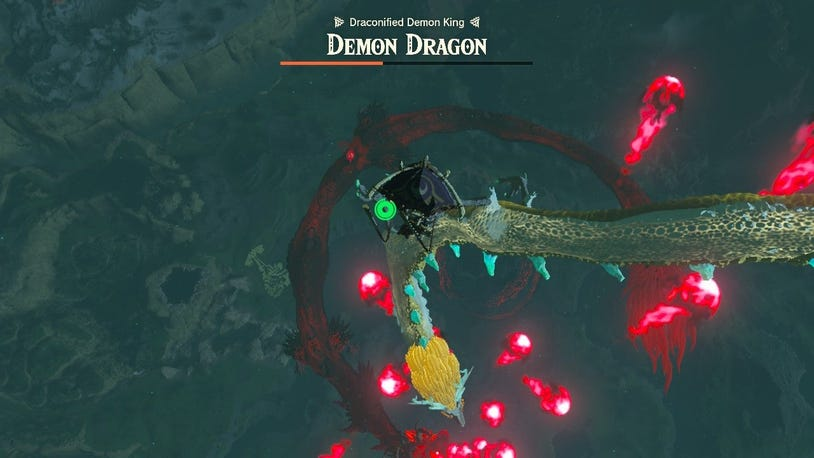

When you've hit all four of these weak points, one more will emerge - right on top of the Demon Dragon's head. Drop down onto the Dragon's head and attack the last spot to deliver the final blow and put an end to Ganondorf's terror.

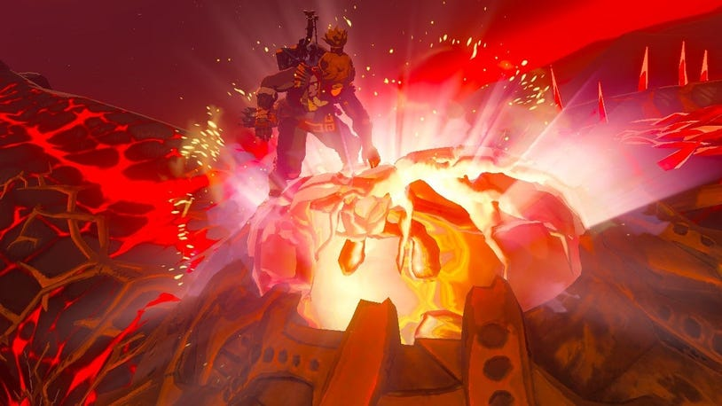

Congratulations on beating Ganondorf, it's now time to watch how the end of Tears of the Kingdom plays out, and find out how you'll wrap up the quest to Find Princess Zelda.
