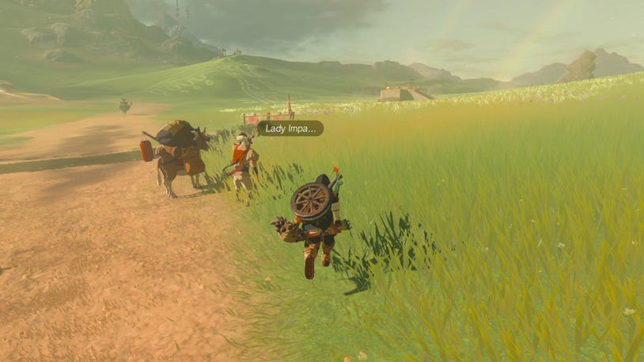
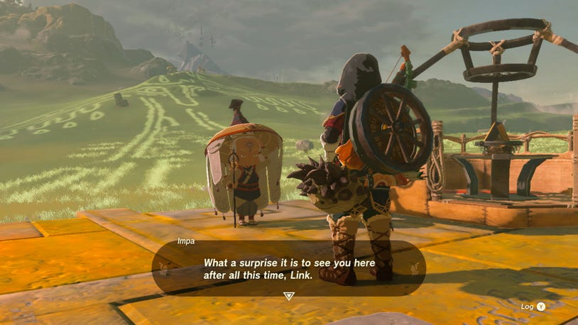
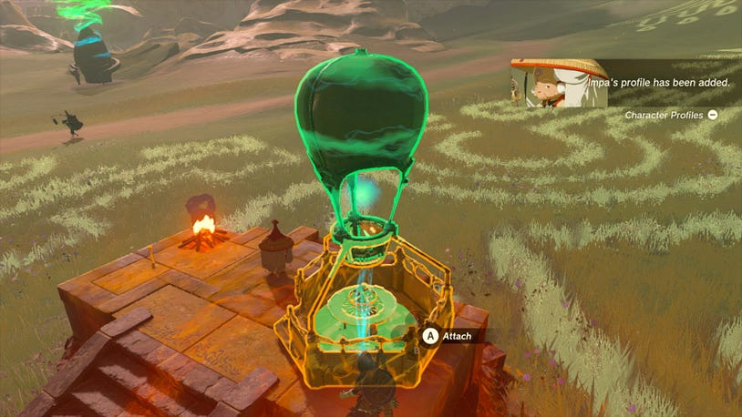
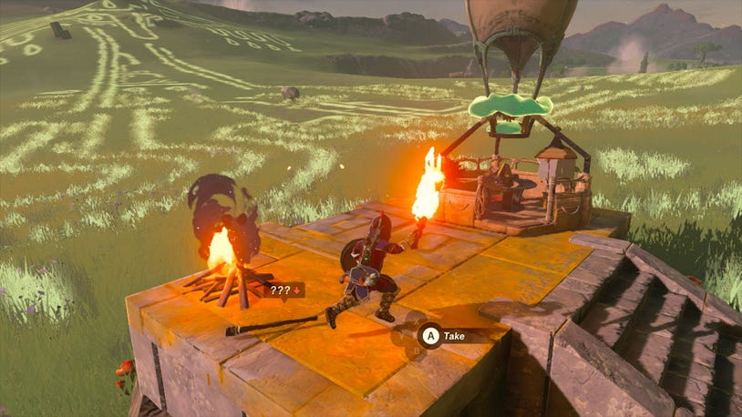
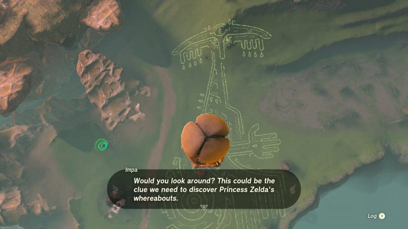
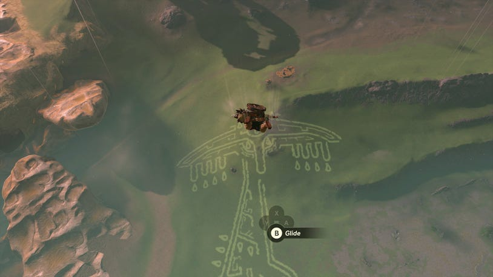
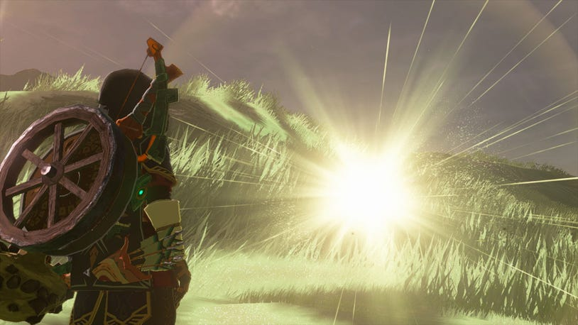

7. Impa and the Geoglyphs

While not necessary for completing the main story, this important string of main quests can be found early in your adventure. After you've investigated the Crisis at Hyrule Castle and gotten your Paraglider, Purah will suggest you check out the Regional Phenomena, hinting at Rito Village being the first destination.

Where to Find Impa

Along the way to Rito Village, you're likely to cross the Carok Bridge west of Lookout Landing, leading to the New Serenne Stable in Hyrule Ridge.

It is here that you will find Impa's attendant, Cado, a member of the Sheikah tribe, looking off into the nearby field with a platform in the middle. He'll note that the Sheikah elder is on the trail of strange geoglyphs that have appeared all around the land of Hyrule, and asks you to assist her.

Speaking to Impa, you'll learn more about the legend of the Geoglyphs, and something called the Dragon's Tear - but in order to get a better look at the strange drawing, you'll need to gain some height.

Impa's personal hot air balloon has been damage, but it's nothing your Ultrahand can't fix. Grab the balloon part that's fallen off and put it into place directly into the middle of the base of the carriage, above the wood pile.

Impa will then ask you to join her, but find a way to get the fire started that will create hot air for the balloon to rise. Luckily, there just happens to be a lit brazier nearby, and a Torch leaning against it that can be used if you don't already have a wooden weapon you don't mind briefly lighting on fire, and then standing next to the wood pile to light it on fire.

Once in the air, Impa will remark at the complete picture that's now much eaiser to see, and will wonder where the Dragon's Tear could be hiding. She'll ask you to go down and investigate once you spot wherever it might be, and you can leave her in the balloon to paraglide down.

How to Find the Dragon's Tear

The trick to find the Dragon's Tear in this, and in every Geoglyph, is to study the art carefully - they are always comprised of outlines. However, there will always be one anomaly in each geoglyph: A tear that is fully filled in.

This this geoglyph in particular, the filled-in tear is located right up at the Zonai's right eye. Use your Purah Pad scope to find it and mark it on the map before diving down to investigate.

Once you interact with it, you'll be pulled into a memory much like how the Forgotten Memories worked in Breath of the Wild, only you will find very different scenes this time around.

​​Dragon Tear 1 Rauru Geoglyph

Report back to Impa with what you've learned, and she'll head off towards a new location to find more information on the Dragon's Tears.
