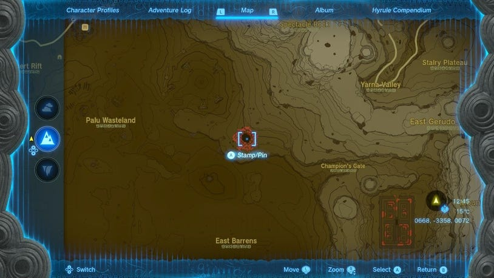
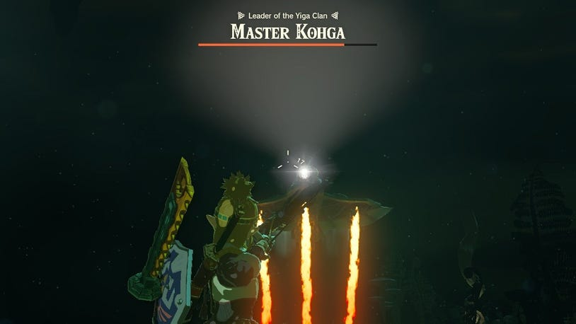
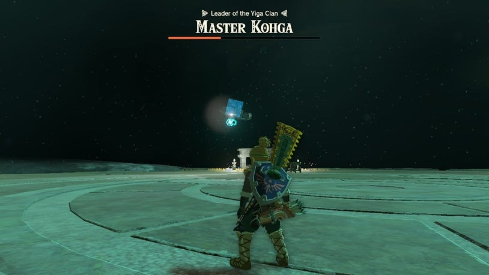
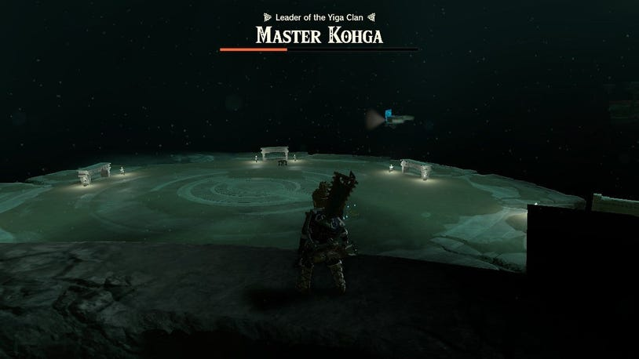

13. Master Kohga of the Yiga Clan - Abandoned Gerudo Mine

You can either reach the Abandoned Gerudo Mine by picking up the trail from the statues near the Great Abandoned Central Mine, and following these west until you reach the portion of the depths that sits underneath Gerudo Town.

Alternatively, one of the quickest ways to reach the Abandoned Gerudo Mine is to head towards Gerudo Town in the southwest and drop down into the depths from the East Gerudo Chasm. If you're looking for a walkthrough on what route we'd suggest from Hyrule to Gerudo Town, see our Regional Phenomena - To Gerudo Town guide. This will include unlocking the Gerudo Canyon Skyview Tower, which you can use to glide straight down towards the East Gerudo Chasm at coordinates -2471, -3046, 0106.

While gliding down, you'll be able to see the Amakawis Lightroot at coordinates -2439, -3343, -0465. Illuminating the Lightroot will highlight the area around it, and show the statues you'll need to follow to the west.

Amakawis Lightroot

As you pick up this trail, it's a straightforward path towards the west, passing by Mihchic Lightroot at coodinates -3213, -3007, -0471. Eventually, you'll be able to see the lights of the Abandoned Gerudo Mine.

Mihchic Lightroot

At the Abandoned Gerudo Mine

When you arrive at the Abandoned Gerudo Mine, you'll see Master Kohga interacting with a Zonai portal, trying to get it to work. After a quick interaction, he'll be ready to challenge you to another fight.

How to Beat Master Kohga in the Abandoned Gerudo Mine

Just like the first fight, Master Kohga will utilize a vehicle - this time, an aircraft. Because he's now floating around above you, the fight can be a little bit more challenging to line up shots with your bow and arrow.

In the early part of the battle, he will use beams of fire that will stream down from underneath the aircraft.

These are easily dodged but don't leave it too late to move out of the way when attempting to hit him. He will tilt the aircraft down slightly, giving you enough of an opening to fire off an arrow at him.

Once he's on the ground and you've hit him a few times, watch him closely and get ready to hit him with another arrow. As he hovers above the seat of the aircraft, position your arrow so that as soon as he takes control of the aircraft, you can hit him in the head. If you're quick enough, you'll be able to knock him straight down from the aircraft without dealing with another round of fire and flying.

When his health reaches the halfway point, he'll switch up his attacks. At this stage, he'll start to fire off rockets. A shield will also appear at the front of the aircraft, making it much harder to hit him. The best way we found to combat this, was to use the mine to our advantage. Ascend to the top level, and wait until he circles the arena and comes as close to Link as possible.

Either when he's flying away, or when he's turned enough so you're not directly facing the shield, jump off and aim your bow and arrow so time is slowed. This creates enough of a window to be able to hit him.

After Beating Master Kohga Again

When the fight is over, Master Kohga will run off again and a Treasure Chest and Steward Construct will appear. Inside the Treasure Chest, you'll find a Huge Crystallized Charge. The Steward Construct that approaches will tell you that the next place you can find Master Kohga is the Abandoned Lanayru Mine. To reach here, however, the Steward Construct suggests ascending back onto the surface and finding one of the two chasms that can lead you there. One of the chasms can be found in the Lanayru Wetlands, while the other is accessed through the mountain village.

This Steward Construct will also send you over to another, where you can pick up a schema stone unlocking a Hovercraft in the Autobuild registry.
