15. Master Kohga of the Yiga Clan - Abandoned Hebra Mine

As the Steward Construct mentioned the Abandoned Hebra Mine can be accessed through the Hyrule Ridge Chasm at coordinates it’s -2641, 1129, 0162. You can find this in the northwest portion of the Hyrule Ride, and north of Mount Rhoam.

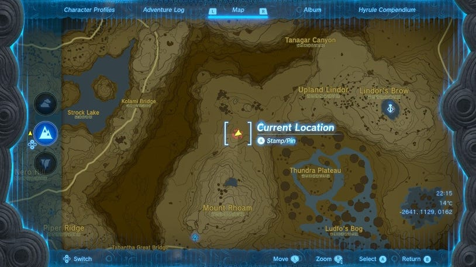

When you glide down to the bottom of the Hyrule Ridge Chasm, you'll see the type of statue that needs to be followed to reach the Abandoned Hebra Mine. You'll also find a lightroot off to the east, the Tikanur Lightroot.

Tikanur Lightroot

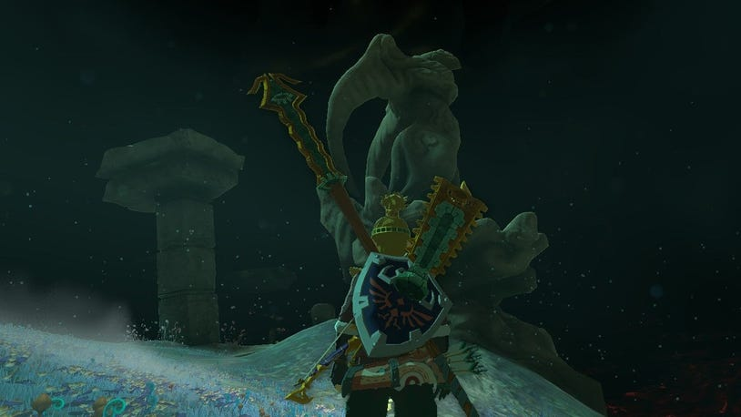

From this lightroot, you can follow the statues off to the northwest. You'll eventually go inside the rockface while following these statutes and have to drop down to the lower parts of the depths off to the north.

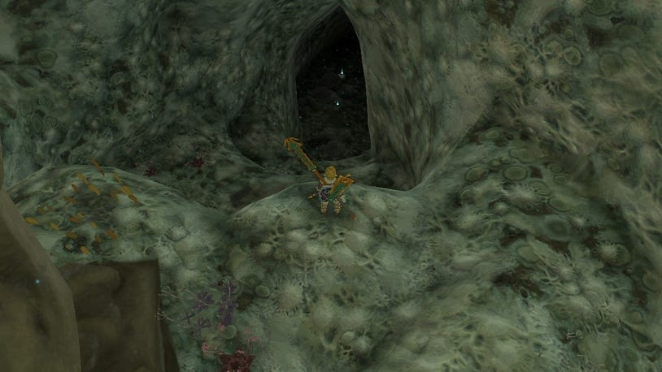

Once you're through this section, it'll be time to start going west and eventually, you'll end up at a dead end. The last statue in this path will be knocked over, and leaning into the rocks.

A Researcher will be standing there, and after a conversation, they'll reveal themselves as a member of the Yiga Clan.

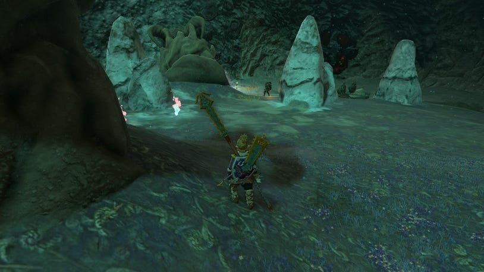

You won't be able to get any further here, but if you look above on the surface, you'll almost be at Rito Village. Ascend from the depths, and go to Rito Village instead of trying to continue on in the depths.

When you're at Rito Village, you'll want to drop down and find the hot air balloon and Ponnick in the southeast part, at coordinates -3599, 1765, 0147.

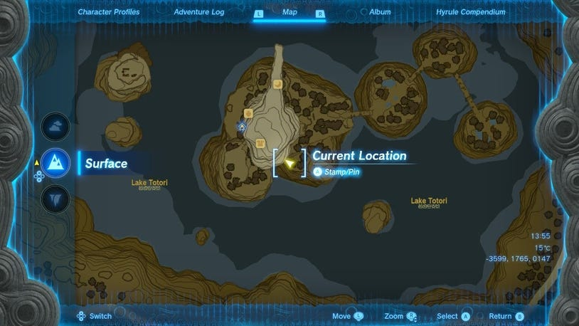

Speak to Ponnick here, and he'll show you the Rito Village Chasm directly below, which you can glide down to.

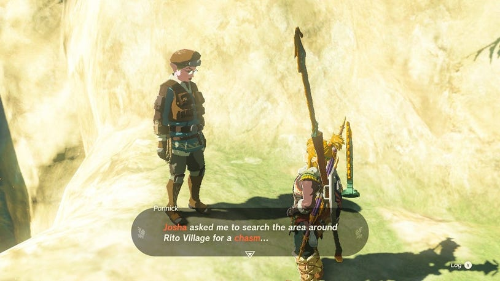

This will take you directly down to the Abandoned Hebra Mine, and to the Sikatag Lightroot. Continue into the middle of the Abandoned Hebra Mine to face Master Kohga once last time.

Sikatag Lightroot

How to Beat Master Kohga

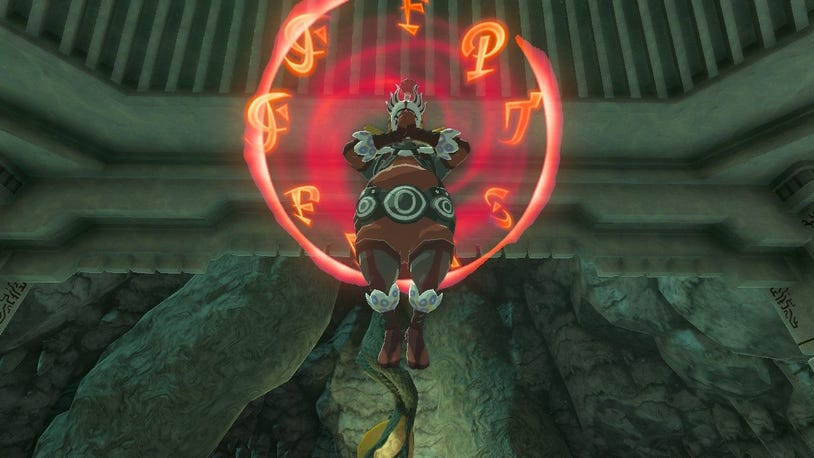

As Master Kohga has been working hard to collect Crystallized Charges, he's crafted a Zonai construct to use in a fight, making this one very different from the previous ones.

If you've completed Guidance from Ages Past, you'll have a helpful companion that can make this fight easier and knowledge of the arena, which you can use to your advantage. Just in case you're on this page before completing that quest, we won't spoil anything for you but you can find more information there.

Master Kohga will be riding a Zonai construct during this fight. Although it looks like it'll be a challenge, it can be tackled quite simply.

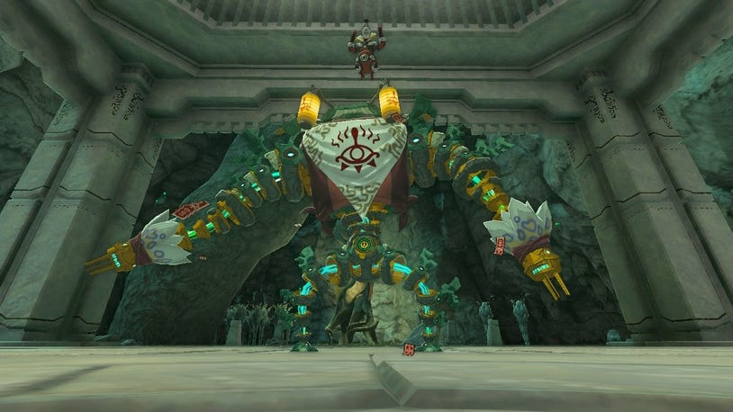

The construct will be slow, so you'll want to stand out of its way when Master Kohga swings at you, but he'll also spend most of the fight unguarded, so he's susceptible to ranged attacks.

As soon as you hit him with either an item or an arrow, he'll jump out of the construct and be open to more attacks. During the times when he does raise a barrier, you can just wait for this to go down, leaving him unguarded again.

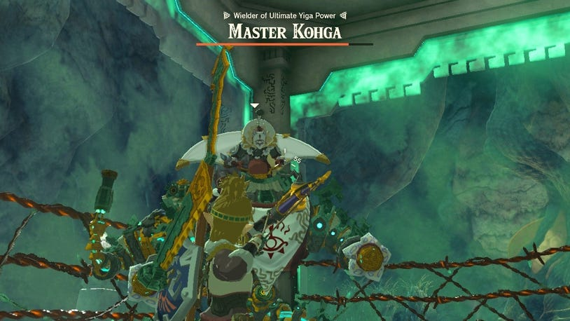

For the second phase of the fight, you'll have to focus on knocking the suit into the electric fence around the arena. You can expect him to raise the red barrier again, but also have the blue force field around him. While the red barrier will be dropped, the blue force field will go down when he's been thrown into the electrified fence.

Kogha will start to use cannons and throw explosives during the second half as well. These attacks can be dodged, and it's particularly easy to avoid the cannons if you run down the middle towards Kogha.

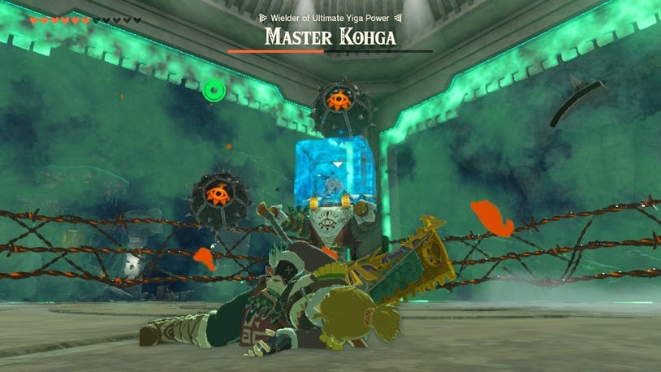

Then you can attack the suit and knock it into the electrified fence to get Kohga out of the suit and onto the floor again.

After Beating Master Kohga Again

When the fight is over, Master Kohga's work will be destroyed but he'll pull out another weapon. Unfortunately for Kohga, it doesn't quite work in his favour and he'll be shot out of the chasm.

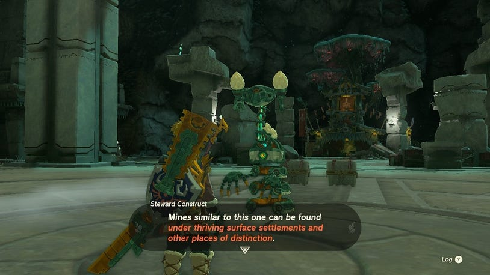

This time, two Treasure Chests will appear along with a Steward Construct.

Inside the Treasure Chests, you'll find a Huge Crystallized Charge and a Diamond.

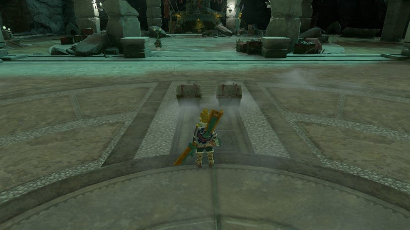

The Steward Construct will also send you over to another, where you can pick up a schema stone unlocking a Rocket Platform in the Autobuild registry.
