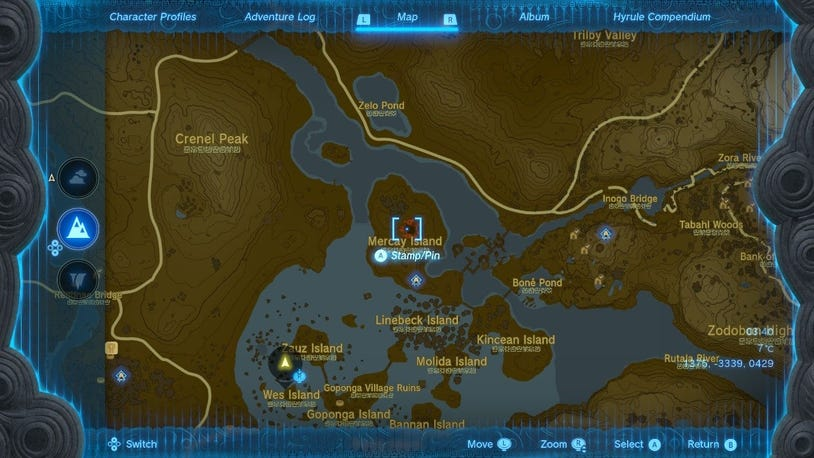
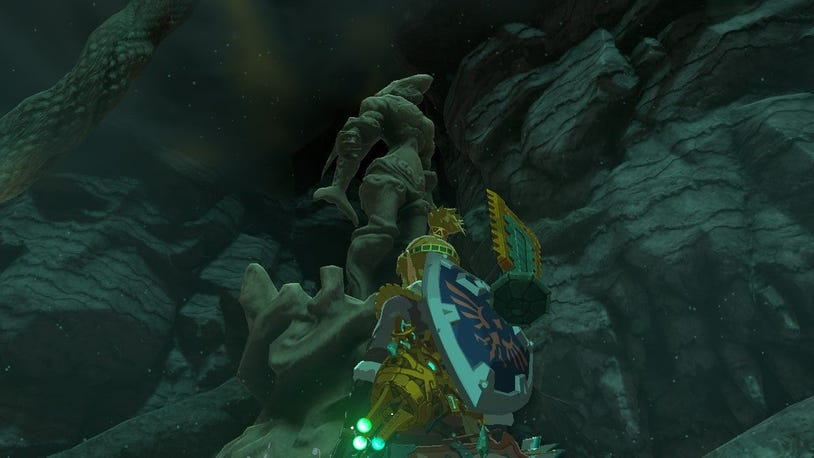
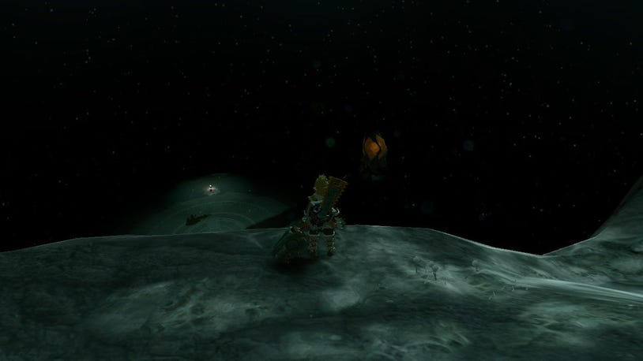
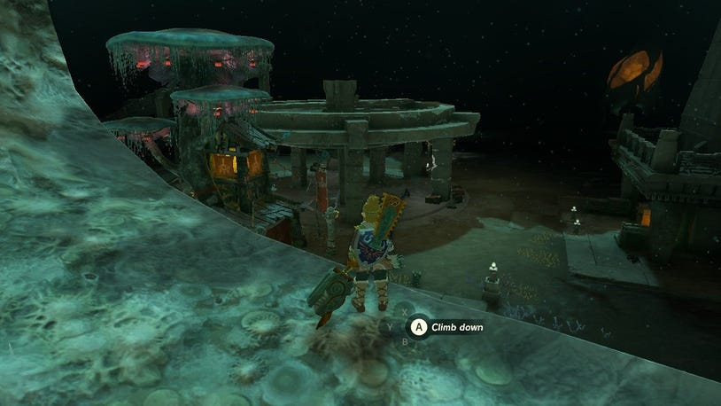
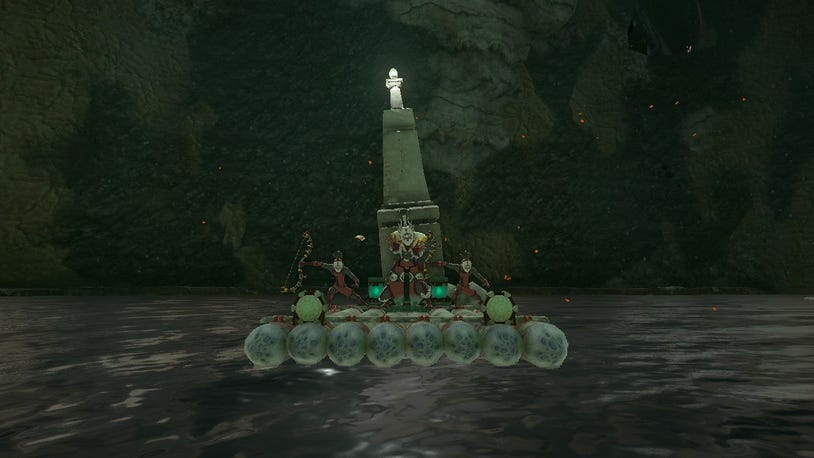
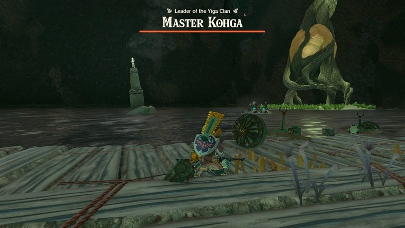
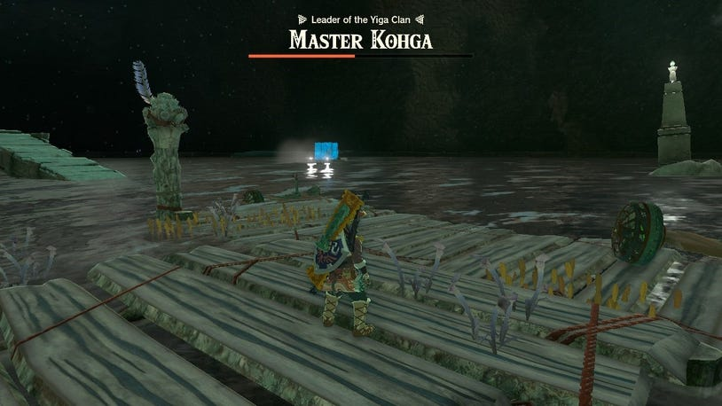
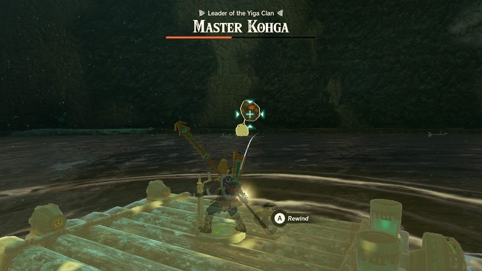
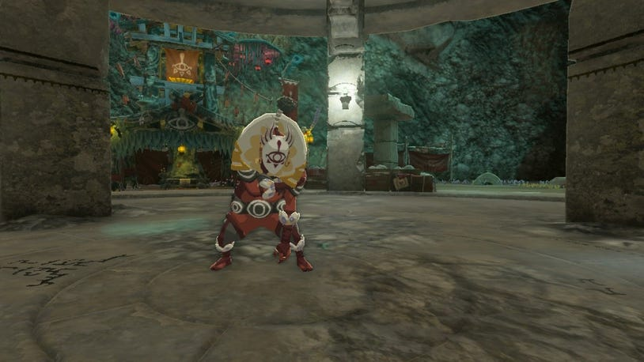

14. Master Kohga of the Yiga Clan - Abandoned Lanayru Mine

As the construct mentioned at the Abandoned Gerudo Mine, it’s better to ascend back to the surface and drop down into one of the chasms to start the journey towards the Abandoned Lanayru Mine. You can find the Lanayru Wetlands Chasm in the northern part of the Lanaryu Wetlands on Mercay Island.

As you drop down and reach the bottom of the chasm, you'll want to start Head south from here to find the nearest Lightroot - the Usanoj Lightroot. Go east from here, to find the statues you want to follow.

Usanoj Lightroot

Shortly after making off from the Usanoj Lightroot and heading east, you’ll come across another Lightroot, the Sekioam Lightroot. From this one, you can pick up the trail of statues going off to the north.

Sekioam Lightroot

As you approach the part of the depths that begins to go under the mountains near Zora’s Domain, you’ll see another lightroot in the distance - the Unioj Lightroot. Continue northeast from here to follow the statues.

Unioj Lightroot

When they begin to curve around to the east, and slope up, they’ll lead you to the depths directly underneath Zora’s Domain. This is where you can find the Abandoned Lanayru Mine. Be sure to go to the Kawagom Lightroot to illuminate the area first, and great a fast travel point.

Kawagom Lightroot

With the lightroot lit, it’s time to head over to the center of the Abandoned Lanaryu Mine to find Master Kohga at the Zonai device.

How to Beat Master Khoga in the Abandoned Lanaryu Mine

This time Master Khoga will take to the water around the Lanaryu Mine, and use a boat as his way of moving around the arena. He’ll also be accompanied by two other members of the Yiga Clan. Both of these Yiga Clan members will use bows, so be careful of the long-ranged attacks. Thankfully, all it takes is an arrow each to get rid of them.

You can find some makeshift boats on the dock near the Abandoned Lanaryu Mine, which you can use to catch up to Master Kohga quickly. Dodge the incoming arrows, then jump onto the raft and hit Master Kohga as many times as possible.

After a few hits, Master Kohga and the Yiga Clan will disappear. He’ll then respawn with another raft, and two more Yiga Clan members. You can just repeat the tactic during this first phase of approaching the boat, dodging the arrows, and jumping on to hit him until he reaches half-health.

When you reach the second phase of the fight, as you might expect by now, the boat will be altered slightly. Now, Master Kohga will have a screen that emerges to act as a shield for the boat.

Additionally, he'll throw giant boulders at you, which you can send straight back to him using Recall. For this phase of the fight, Master Kohga will have the shield up temporarily, then lower it to hold a boulder above his head and throw it at Link. Use Recall as soon as the boulder comes towards you, to throw it back and stun him.

This will also stop the Yiga Clan members from attacking, and give you an opportunity to jump onto the raft and hit Master Kohga, or fire off an arrow. Again, it's just a case of repeating this until his health bar is depleted. If you're not able to reach the raft in a certain amount of time, then Kohga's boat will disappear and respawn somewhere else in the water.

After Beating Master Kohga Again

When the fight is over, Master Kohga will run off again and a Treasure Chest and Steward Construct will appear. Inside the Treasure Chest, you'll find a Huge Crystallized Charge.

The Steward Construct that approaches will tell you that the next place you can find Master Kohga is the Abandoned Hebra Mine. To reach it, the Steward Construct says that there is a chasm that connects directly to the mine.

This Steward Construct will also send you over to another, where you can pick up a schema stone unlocking a Bolt Boat in the Autobuild registry.
