Prologue - Beneath Hyrule Castle

Explore the Ruins

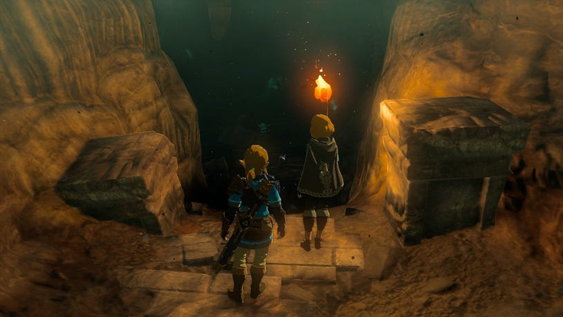

The story will begin some time after the events of Breath of the Wild. The Calamity has been thwarted, and the people of Hyrule are in the process of rebuilding their kingdom. However, it seems a new miasma called Gloom has been seeping up through the depths below Hyrule Castle, and Link and Zelda have journeyed below to investigate.

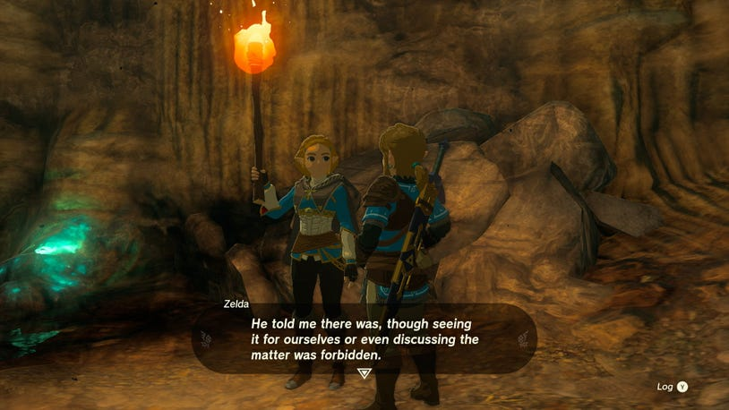

As you gain control of Link you’ll be in a gloomy passageway, with nowhere to go but forward past the glowing rocks. You can talk to Zelda a few times to get more information on what the two of you are doing here, and the dire warnings Zelda’s father gave about these forgotten passageways.

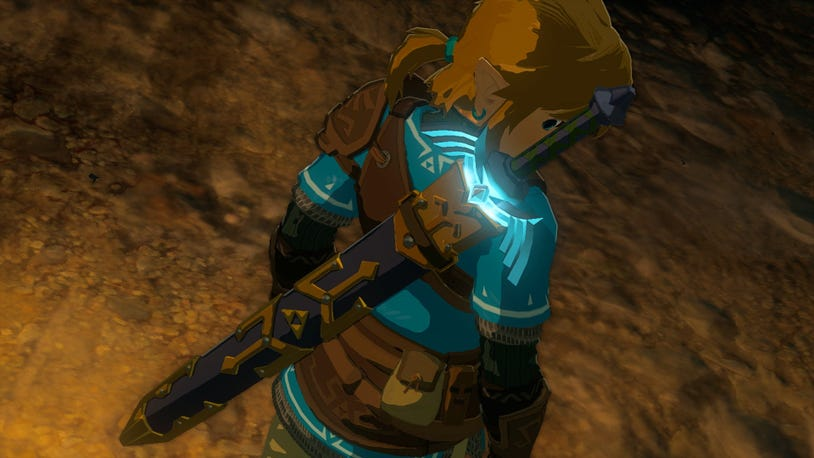

Down the next path, Link’s Master Sword will begin to glow – which is a good indication that whatever is down here is not pleasant, so you’re going to want to be on guard. Luckily, Link has a full set of 30 hearts, but you can draw the blade and give it a few practice swings.

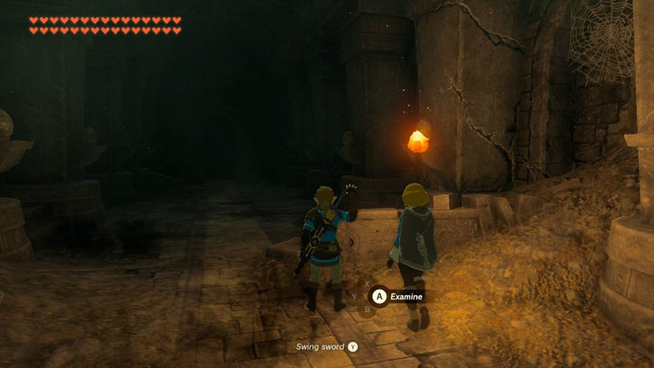

In the next long hallway, stop with Zelda to inspect a few ruins — a broken pillar that’s fallen on the right, a dragon-like structure on the left, and a pair of strange statues flanking the end of the room. Could these be the mythical Zonai that predate the Kingdom of Hyrule?

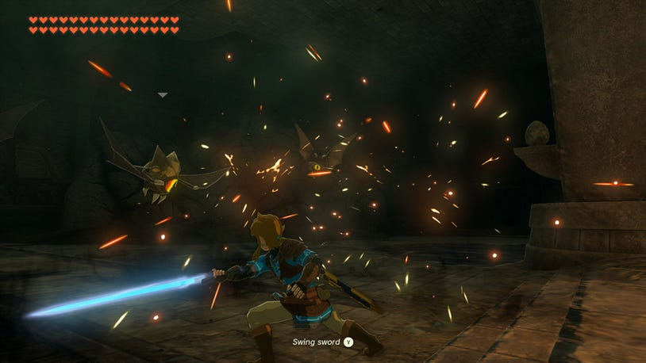

Moving deeper, you’ll come to a large open room where several flying bat-like Keese will dart forward. They should be no match for the Master Sword, so lock on with ZL and give a few swings to dispatch them.

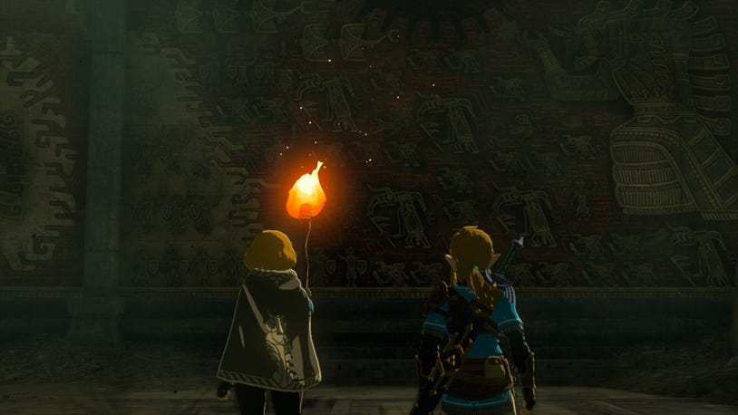

Once clear, Zelda will point out an interesting set of murals depicting an ominous legend of the Demon King, and the mysterious Zonai who descended from the heavens to help establish the Kingdom of Hyrule. Unfortunately, it seems the last few murals that depict the Imprisoning War have been obscured, and so you will have to forge on ahead.

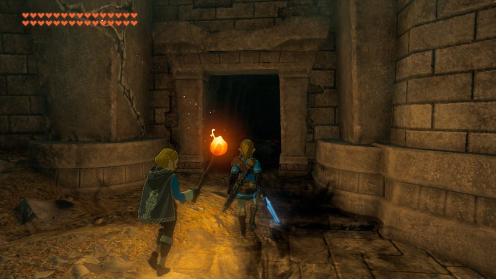

After the cutscene, you can talk with Zelda a bit more to get further insight on these mysteries, and then head through the passage beyond the obscured murals.

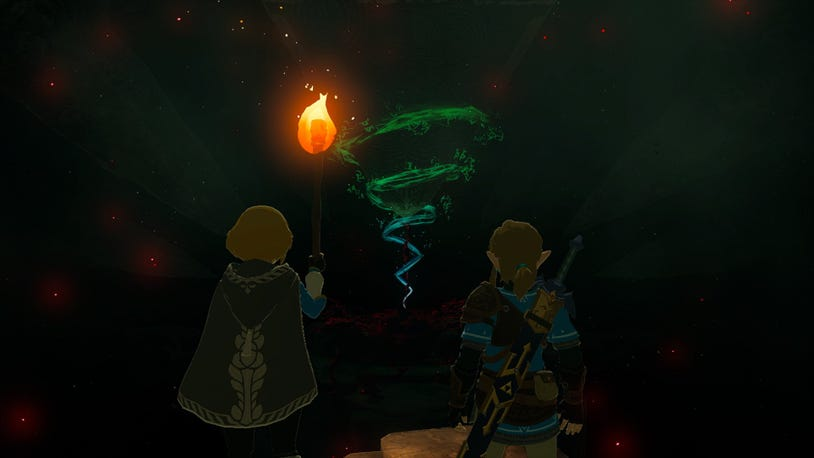

Through the next passage, descend down the foreboding stairs as the Gloom becomes thicker, and you’ll finally arrive at your destination. A large platform the Gloom seems to be emanating from is held in place by a green swirling light. If you’re done exploring the previous rooms, tell Zelda you’re ready to proceed and you’ll be shown the secret that has lain beneath the castle all this time.

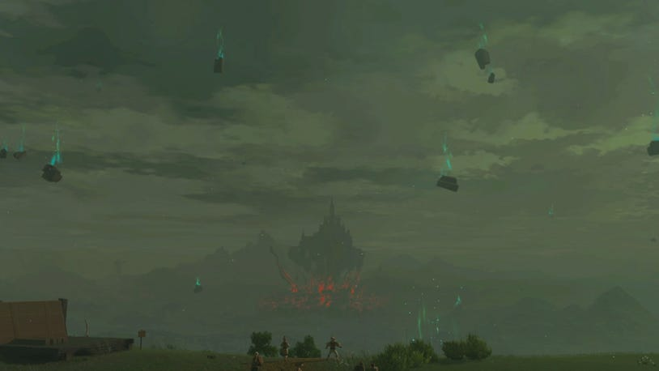

When the terrifying scene concludes, Zelda and a badly wounded Link will have become separated, evil will have awoken once more, and a calamitous upheaval will shake the Kingdom of Hyrule.

The Room of Awakening

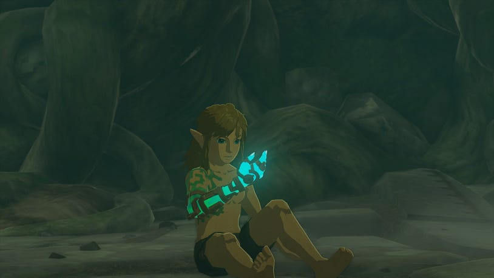

Link will awaken to his corrupted arm becoming infused with strange ancient technology, and a strange voice will bid him welcome.

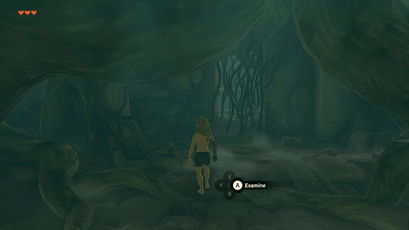

Nearby, you can find what’s left of the Decayed Master Sword. Once the bane of evil, it deals almost no damage, and is just useful enough to carve a way out of this chamber.

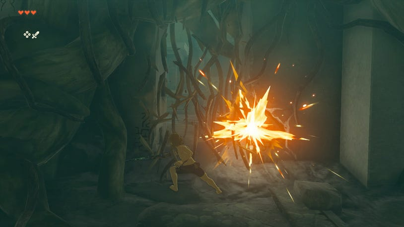

Use it to cut the vines blocking your path and create an exit.

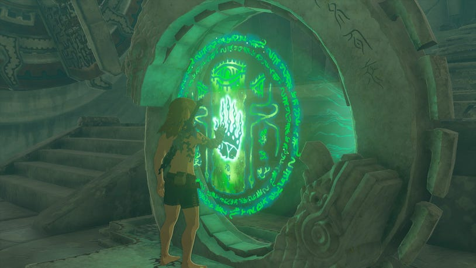

In the next room, a circular device will begin to glow, and you can activate it with your new hand. Doing so will activate a few things in the room – but for now the only thing you need to worry about is the far door opening up.

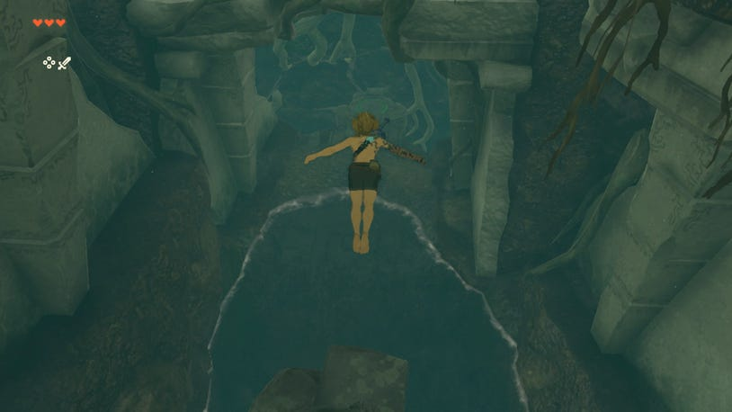

The next hall has a series of ledges and pools of water to dive into as you make your way forward. Note that while the initial controls let you jump with X and dash with B, you can swap these controls in the settings at any time if the opposite setup feels more comfortable.

At the end of this path is one last ledge to dive down into a large pool of water. Your stamina will slowly drain while swimming in any direction, but you should have enough to easily make it to the nearby shore.

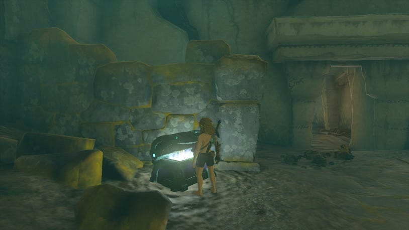

Before exiting the room, be sure to look for a green Zonai chest in the corner by some ruins, as it contains Archaic Legwear. It may not offer much defense, but it’s better than being naked.

Archaic Legwear

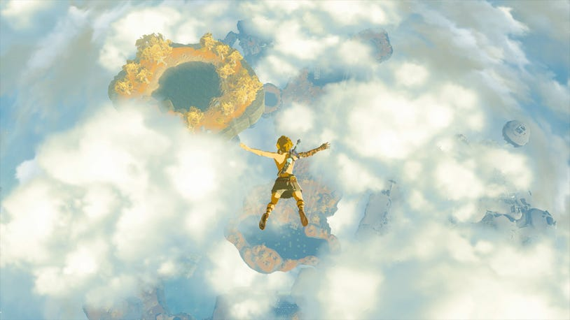

As you exit out into the sunlight, you’ll find you’re no longer anywhere near Hyrule Castle, but high up in the skies above on a series of floating islands. Take a brave leap off the ledge and enjoy the descent!

The Great Sky Island

Landing in a giant pool of water, you can swim to one of the large lily pads to get out and then jump towards the path ahead.

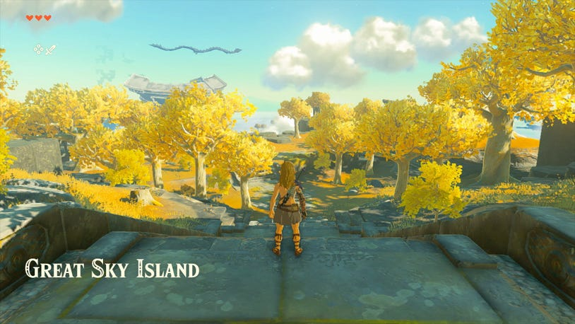

At the top of the stairs, you can look down to see a pathway into a stone courtyard, flanked by numerous trees.

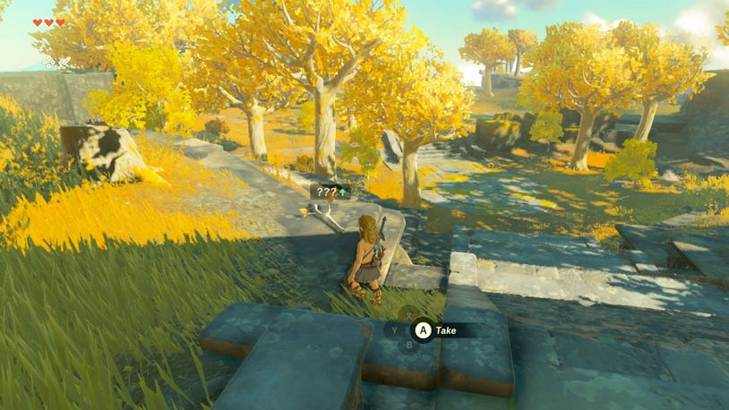

Many of these trees have a fallen Tree Branch nearby, and you’ll find they offer you better damage than the pitiful remains of the Master Sword, though they won’t last long in a fight.

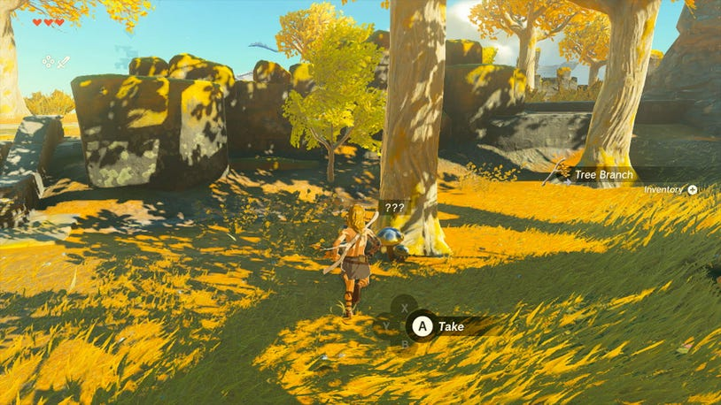

There are also many a Skyshroom growing by the trees as well that offer a way to replenish lost hearts, so be sure to stockpile as many as you can find.

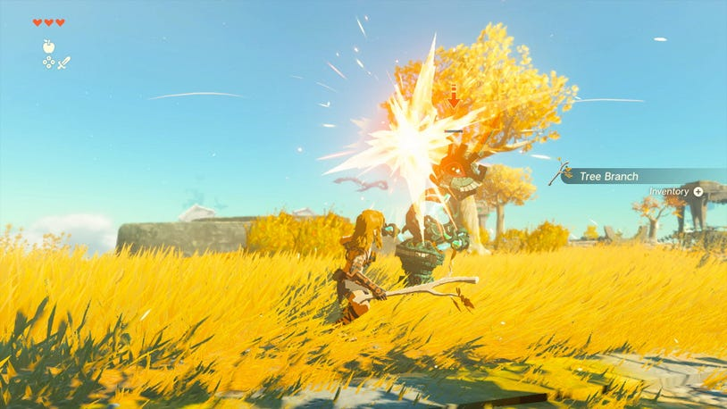

At the top of the far stairs, the path will split in two directions. Off to the left, an angry looking green robot known as a Soldier Construct will come bustling towards you, armed with a weapon of its own. Use ZL to lock onto the foe, and keep your distance if you see its arm swing wide to swipe, or tilt its head to spin at you with its horn blade.

Your Tree Branch should only last about four hits, but should be enough to knock it to the ground and disarm it. Grab its branch, or swap to another branch you’ve picked up by holding right on the D-pad. Another three hits should defeat the foe. If you’re feeling particularly gutsy, you can try dodging away from it by tapping the jump button while moving away.

If done just before your opponent’s attacks, you’ll slow time and be able to hit him with the flurry of blows before the Construct can react.

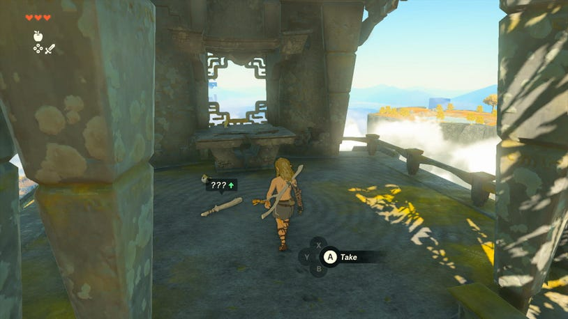

If you’re sporting wounds from the fight, there’s also a tree near where the Construct came from that has several Apple to pluck from its branches, and a small raised stone structure has a slightly more durable Wooden Stick inside.

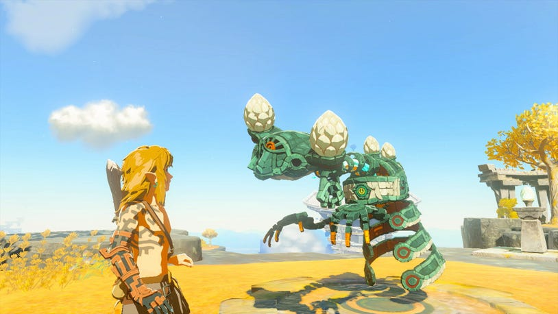

Head down the right path instead to find a dormant Construct, and interact to find that it is actually quite friendly. Surprisingly enough, it will know all about you, and offer you a gift from Zelda – her Purah Pad device! But where is she, and how did she give it to this strange machine? One thing is clear – your next task is to Find Princess Zelda.
