34. Recovering the Hero's Sword

Though this quest will begin once you have completed the main quests, Trail of the Master Sword, which is given to you after Finding the Fifth Sage, it can be undertaken at almost any point in the main story -- and you can see how to claim the Master Sword early here.

Reaching the Light Dragon

Retrieving the Master Sword

Using the Master Sword

How to Reach the Light Dragon

Once you have cleared the corruption and Gloom that plagues the Korok Forest, speak to the Great Deku Tree by heading up his branches to find a platform above to speak, and he'll recall a memory of the last time you spoke, right before your adventure in Tears of the Kingdom began.

After the memory is done, he'll sense that the Master Sword is indeed somewhere in Hyrule, and will pinpoint the location on your map - noting that it appears to be moving.

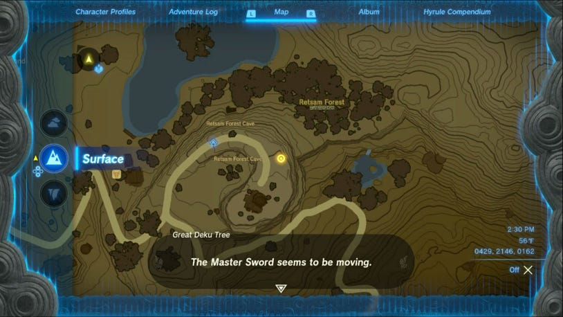

Note that the location on your map will likely be different for each player depending on when you talk to the Great Deku Tree. This is because the map marker will be tracking the realtime location of the Light Dragon, which slowly flies across the skies of Hyrule.

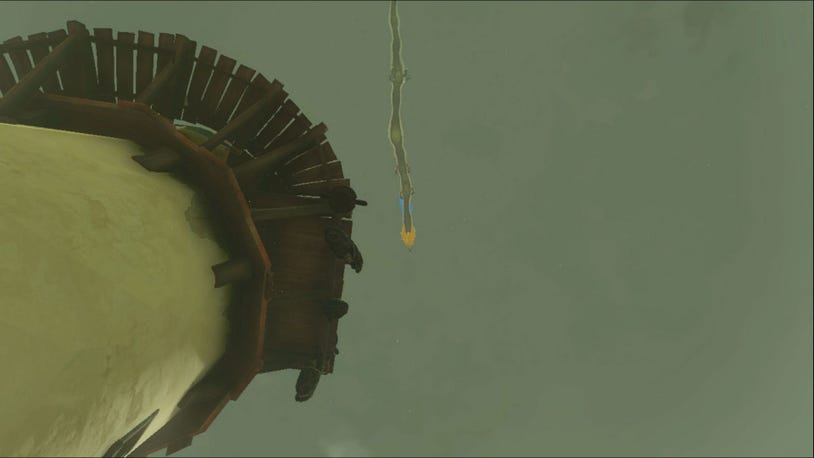

Sure enough, if you fast travel to a spot close by, you can look up to find the Light Dragon up in the air.

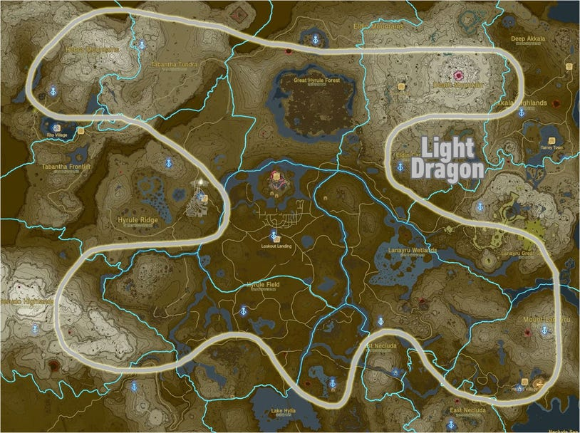

Unlike the other three Dragons, the Light Dragon will fly much higher in the sky than all the others - anywhere from 1500 to 2200 meters up in the sky. However, once you've spoken to the Great Deku Tree, the Light Dragon will lower dramatically in altitude, down to around 700-800 meters (which is still often higher than the other dragons).

Though the path will slightly alter depending which height the dragon is flying at, it will generally weave around most regions of Hyrule, and generally curve around many of the Skyview Towers and Geoglyph locations as it does. Since it takes a much longer time to complete a loop of the map (2 hours!), you will have a couple of different methods available to reach it:

One of the more easier methods is to simply wait for it to pass by one of the Skyview Towers, like the Thyphlo Ruins Skyview Tower, Mount Lanayru Skyview Tower, or Gerudo Canyon Skyview Tower. Launching out of these Skyview Towers will easily put you at an altitude of around 900 or more meters, and you can glide down when the dragon passes. The only downside for this method is that you will have to wait for the Dragon to approach, which cannot be sped up, as Dragons in TotK do not adhere to a set schedule and cannot be manipulated by resting at a fire, sleeping, or fast traveling.

Another easy method is to bring the Light Dragon directly to you. By completing the last of The Dragon's Tears main quest and viewing the final 12th memory that appears after viewing the other 11, the Light Dragon will appear before you. It is located on the Rist Peninsula in eastern Akkala on the spiral shape. After the Light Dragon appears, you can either use the nearby Ulri Mountain Skyview Tower, or travel up high to the Water Temple and glide down from above.

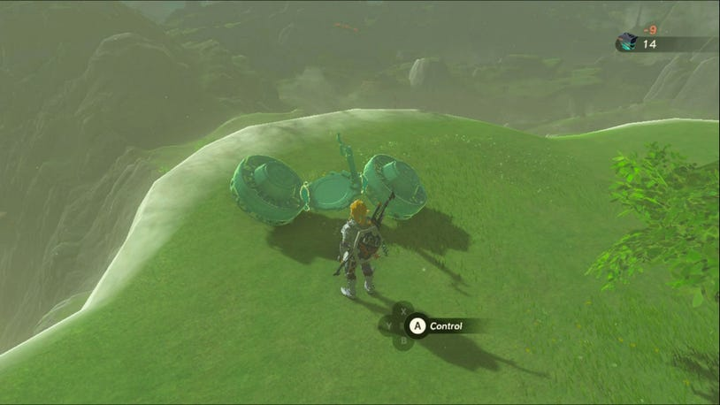

If you have been collecting Energy Cell Battery upgrades, Zonaite, and Zonai Devices, you can simply create your own flying machine to fly directly up to the Light Dragon wherever it may be in the world, without having to wait for the dragon to appear in a specific area.

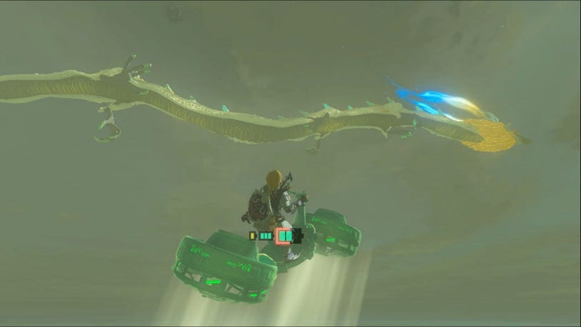

There are many contraptions you can make for this, and we recommend simply sticking two angled Fans on either side of the Steering Stick to create a sort of hoverbike. It will require minimal battery power to operate, and let you ascend up to the dragon at a decent rate.

Finally, if you've been exploring many of the Sky Islands, it's possible you have access to a lot of fast travel points at various Shrines located in the sky. Since the Light Dragon should now be flying below many of these islands, you can hop around to multiple points above and simply fly down to wherever the Dragon happens to be.

Retreiving the Master Sword

Once you've found the Light Dragon and devised a way to approach it, glide over to the Dragon and try to land near the head. Luckily, unlike the other dragons, the Light Dragon has no elemental defenses that appear around it, so you won't have to worry about wearing protective gear or being attacked. You can even land on its tail and simply run up the length of the body to the head.

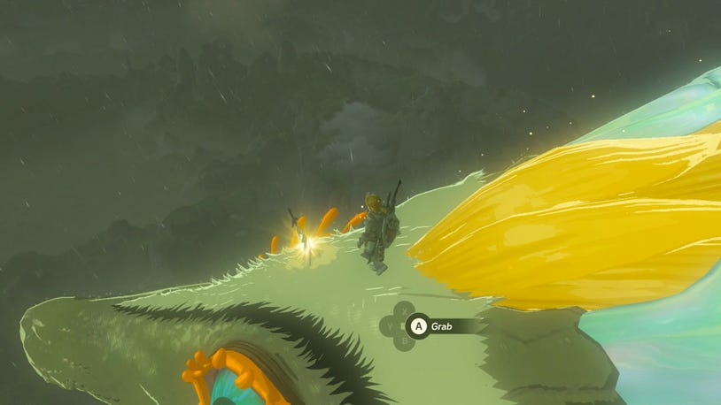

It is here you will find the object you've been searching for - the Legendary Master Sword. Much like trying to remove the Master Sword in Breath of the Wild, you'll need to meet a certain requirement, but this time it won't be measured in Heart Containers.

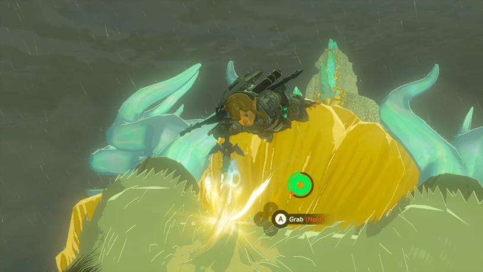

Instead, the Light Dragon will try and throw you off as Link tries to pull out the sword, requiring a great deal of Stamina. In total, you will need two complete wheels of Stamina, or five extra Stamina Essence upgrades, which equal 20 Light of Blessings traded in to a Goddess Statue after completing Shrines. If you're looking to avoid doing more Shrines, you can also make A Deal With the Statue under Lookout Landing to trade in Heart Containers, or complete A Call From the Depths.

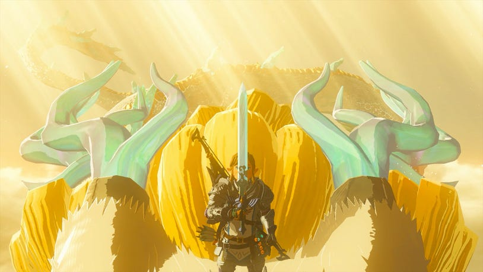

If the requirement are met, Link will steady himself until the Light Dragon calms down and takes him up higher, revealing an important cutscene. You'll then be able to lift up the Master Sword and claim it.

Recovering the Hero's Sword

Wielding the Master Sword

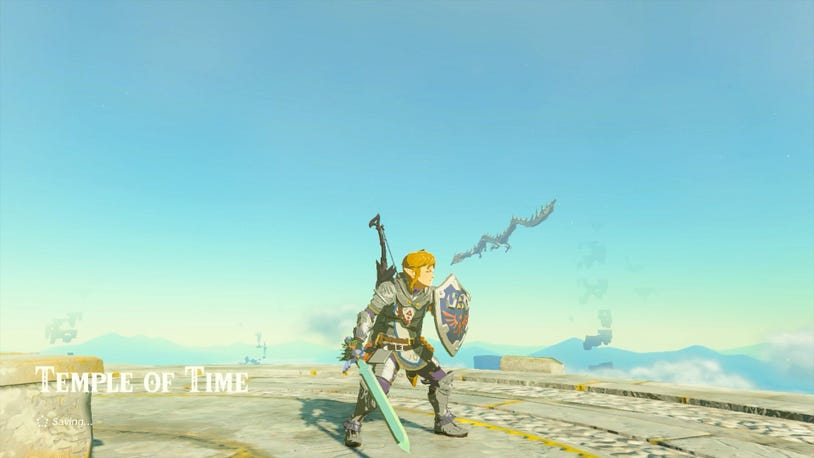

Once you've been returned to solid ground, you'll now be able to wield the Master Sword once again. At first glance it may seem similar to how it was in Breath of the Wild, but with some important differences.

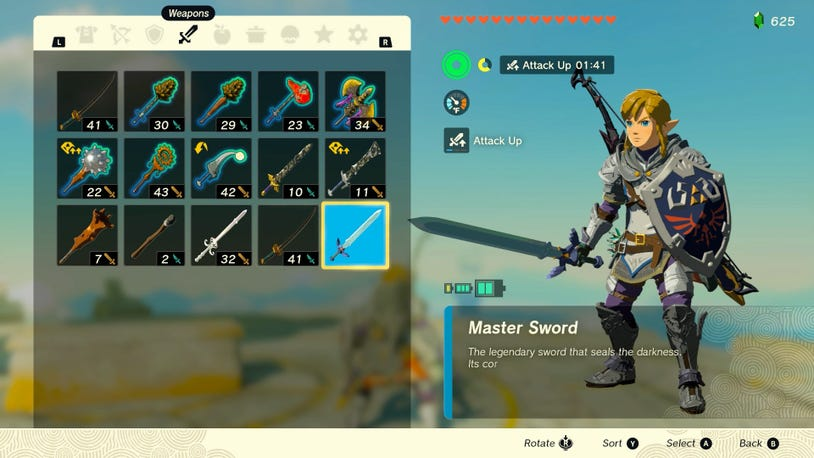

While it does not display its damage in your inventory, the Master Sword on its own will deal 30 damage to most enemies, and 60 when it glows in the presence of certain gloom-infused enemies and bosses.

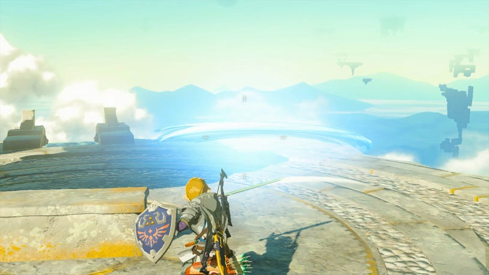

If Link is at full hearts with no damage taken, you can also also hold R to throw sword beams instead of the sword itself.

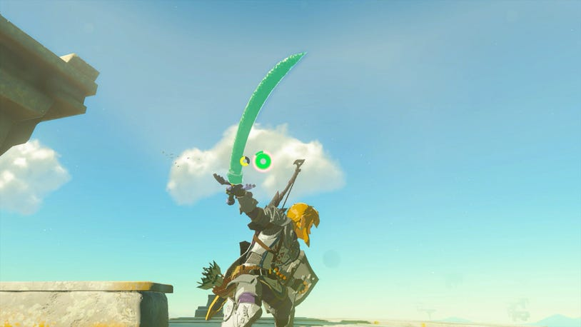

The real change is the ability for the Master Sword to fuse with other objects. Like any other weapon in the game, you can use the Fuse Ability to combine other materials or monster parts to increase its damage -- however, the Master Sword will retain its original form, but alter when attacking to show the fused weapon in a green glow.

With its increased durability, you can fuse different materials to the Master Sword and remove them as needed, or swap in new parts if the fused part breaks.

Of course, just like in Breath of the Wild, the Master Sword can't attack repeatedly forever. It will have its own hidden durability meter -- though much higher than most weapons. When used up, it will have to recharge for a certain amount of time, and be re-fused when it is useable once again.

Now that the Legendary Blade with the power to repel Darkness is in your hands once again, and all the Five Sages are ready and accounted for, there is only one task left for you: Defeat Ganondorf -- although you might want to complete your classic Link loadout with the Hylian Shield.
