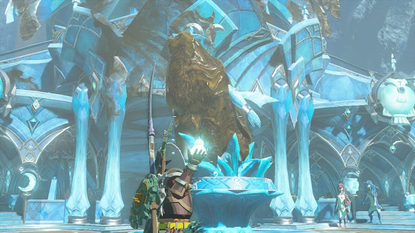
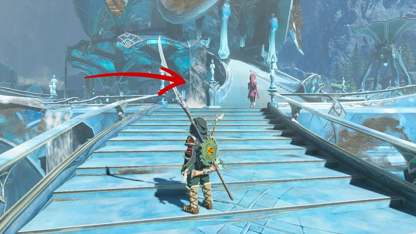
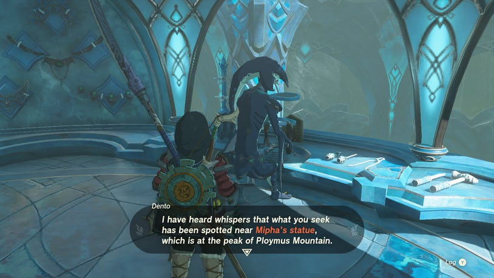
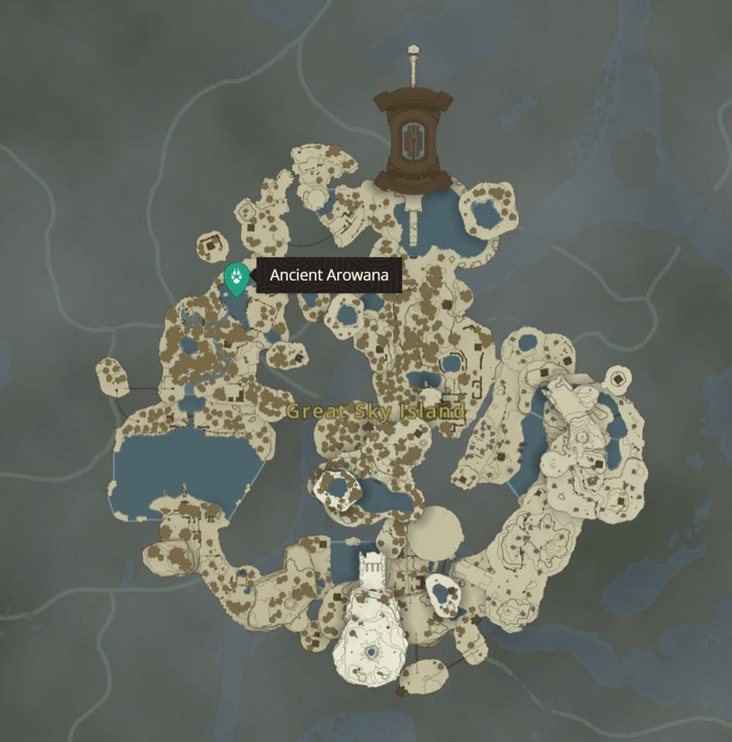
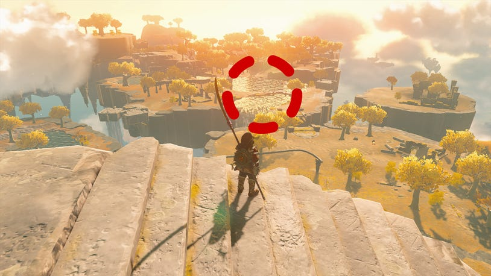
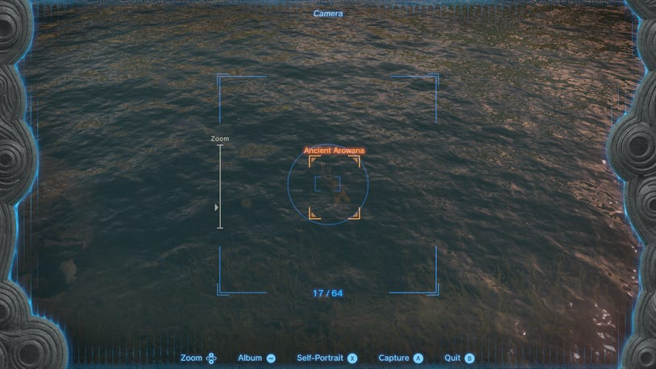

21. Restoring the Zora Armor

We recommend completing this main quest next, instead of jumping straight into Sidon of the Zora. By finishing this quest, you'll obtain the Zora Armor, which will allow you to climb waterfalls with ease and make it up to Sidon a lot faster.

How to Start Restoring the Zora Armor

Speak to Yona by the sludge-covered statue in the center of Zora's Domain to being The Sludge-Covered Statue. She will say that the statue needs to be cleaned of the sludge, which you can do using Splash Fruit.

Return to her once again and tell her the statue has been cleaned, this will prompt her to introduce herself as Sidon's fiance and tell you to meet her in the infirmary.

You'll now be able to find her on the second level of Zora's Domain, behind the waterfall, where the baths are.

She'll be in the first pool of water, and you can speak to her to learn more about the Zora Armor. This begins the Restoring the Zora Armor main quest.

How to Complete Restoring the Zora Armor

During the conversation, Yona will explain that the Zora Armor needs to be repaired and all that it's missing is one thing - an Ancient Arowana. She says she hasn't seen any late, and she has no idea where to find one. She does, however, say that Dento the Blacksmith may be able to help and know something about how to get one.

Drop back down to where the sludge-covered statue was, and go behind the water, to the right to find Denton in the back. He'll say that he's heard that they might be near Mipha's Statue, which is near Ploymous Mountain.

How to Get an Ancient Arowana

Instead of making the trek up the mountain, there's an easier way to get Ancient Arowana and that is to go back to the Great Sky Islands. We've marked the place where you can find Ancient Arowana on the map below.

Fast Travel to the Ukouh Shrine and look out towards the northwest towards the water.

Glide over to this location the stand on the bridge to scan around and find some Ancient Arowana.

Once you've got at least one, travel back to Zora's Domain and hand them over to Yona. She'll hurry over to the workshop and reunite Link with the Zora Armor, which increases Link's swim speed and allows him to swim up waterfalls. There is a catch, however, as it won't let you swim up any waterfalls that are tainted by sludge.
