27. Riju of Gerudo Town

Riju of Gerudo Town is one of the four core Tears of the Kingdom Main Quests in the Regional Phenomena questline. You'll once again have to traverse the dangers of the Gerudo Desert to figure out who or what exactly is causing the devastating sandstorm. This main quest guide is a complete walkthrough of Riju's storyline, including how to navigate the Gerudo Desert, where to find Riju, and more.

If you'd like to read up on what the tumultuous region for this quest has in store, you can look to the following pages:

Gerudo Desert

Gerudo Highlands

All Shrine Locations and Solutions

List of Side Quests and Side Adventures

All Caves and Cave Map

Reach the North Gerudo Ruins

From Gerudo Town here towards the marker on the map just slightly north. As soon as you step back out into the desert, the sandstorm will interfere with your map, but you'll be able to see the ruins from the entrance to Gerudo Town, just off to the left.

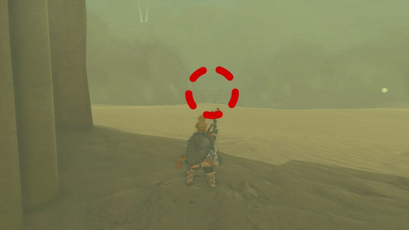

As you reach the ruins, you'll hear a loud bang, and moving towards the center reveals that its lightning strikes were caused by Riju. The conversation will Riju will begin as soon as you approach here, and she'll tell you about the trouble that Gerudo Town is having with the Gibdo.

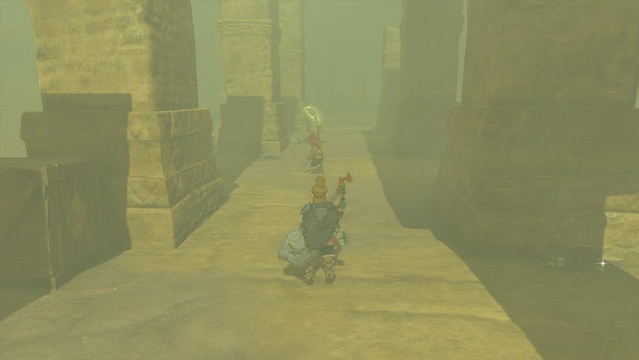

It's not long before she's asking you for help with her training against the dummy. For the first round, draw your bow and aim it at the dummy, for Riju to hit with her lightning strike.

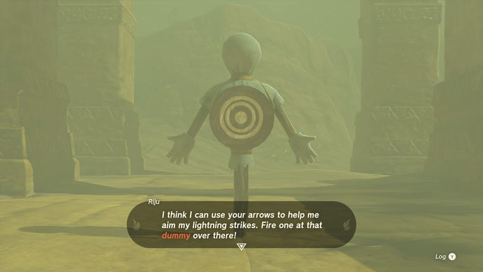

The next test asks you to hit all three dummies with one single lightning strike. To do this, don't aim for a specific dummy, instead aim for the rock that's positioned in front of the middle dummy. Wait until the ring of lightning has gone past each of the dummies, allowing Riju enough time to charge up her attack.

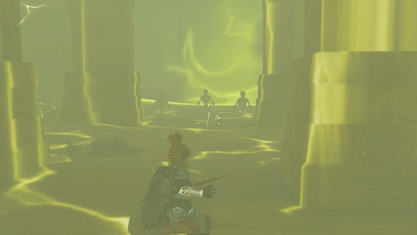

With the training complete, a mysterious sound will ring out and Faundi will appear to tell Riju that Gibdos are attacking the Kara Kara Bazaar, so that's the next stop!

If you've followed the guide up until now, you can warp back to the Mayatat Shrine to quickly get back to the Kara Kara Bazaar.

At the Kara Kara Bazaar

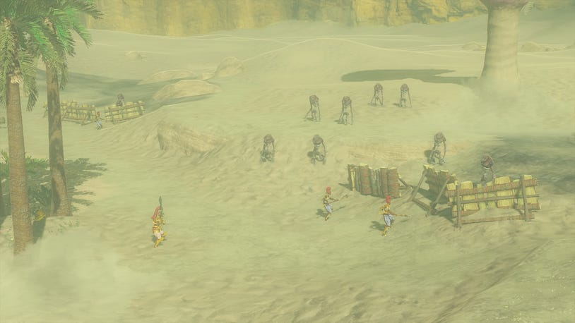

The fight will begin as soon as you reach Kara Kara Bazaar, where you'll see a swarm of Gibdo emerge. Work with Riju to attack as many of them as possible, and hit multiple targets at once by aiming at something else like the barricades to do more damage.

As the cutscene begins, it's clear the Gibdo are coming from hives that look like sand mushrooms. To destroy them, aim for the part that glows bright purple. Doing it during this time will mean you can actually destroy it, as it becomes vulnerable when it glows purple and spawns Gibdo.

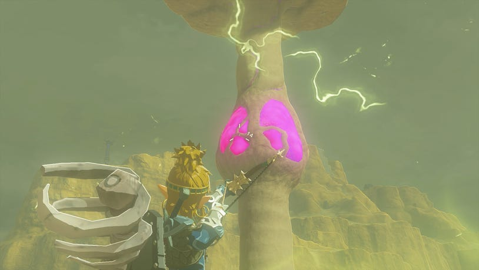

Once this battle is over, multiple sand tornados will emerge and you'll have to hurry back to Gerudo Town to protect it.

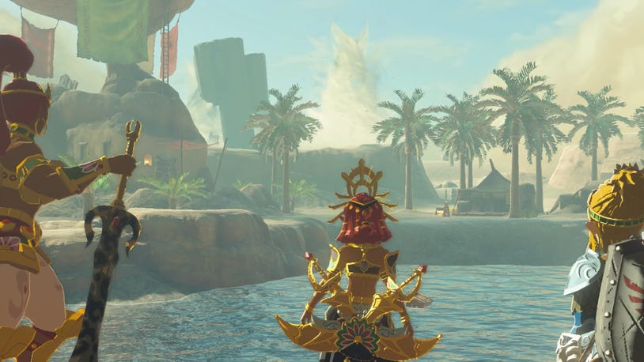

Back at Gerudo Town

Make your way back to Gerudo Town from Kara Kara Bazaar. You'll find it surrounded by a few of the mushroom-looking sand pillars with glowing purple parts halfway up them. Go to the top of the stairs inside Gerudo Town to speak to Riju.

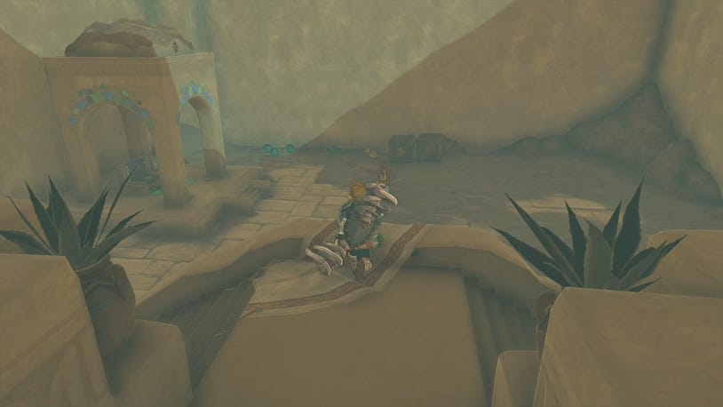

She'll tell you to get ready for the battle by speaking to Buliaria, who in turn will send you down to two courtyards where you can speak to Captain Teake and Padda. Go to Padda and stock up on all the weapons, arrows, and items that she has.

Don't forget to also open the three chests that sit along the wall to pick up valuable items. It's worth fusing your shield with the Topaz you'll get from the chest, and picking up the spear to fuse with the Electric Lizalfos horn for protection against Lightning and additional damage. Decide with Padda where you'd also like to form a barricade.

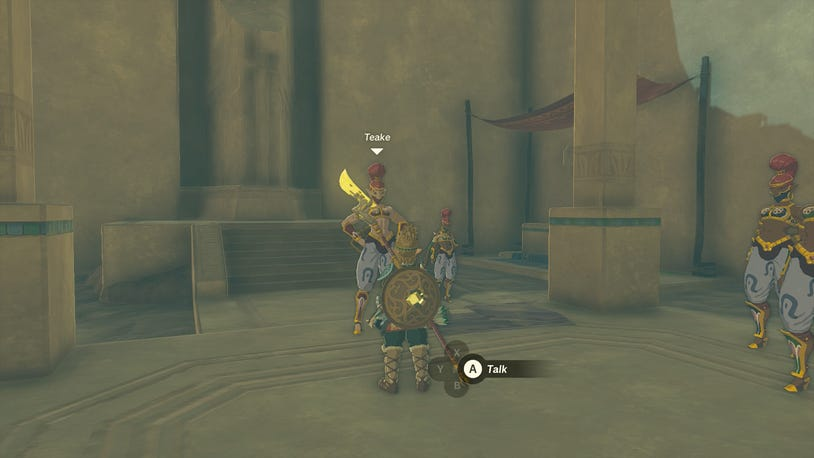

Then go over to Captain Teake and position each group of soldiers wherever you prefer.However, you should choose the soldiers with the spears to join the gate that you've chosen to barricade, as this will allow them to create more damage. Wherever you decide to put the barricade, have your spear troops there who can maximize the damage they put out with their lightning spears and metal barricades.

When you are ready, speak to Riju to begin the fight. You can also gain some additional information here that Fire and Lightning are both great against the Gibdo.

As the fight begins, Riju will shout out which direction the Gibdo are attacking from. You'll want to repeat what you did in the first battle at Kara Kara Baazar, and aim for the hives when they glow brightly.

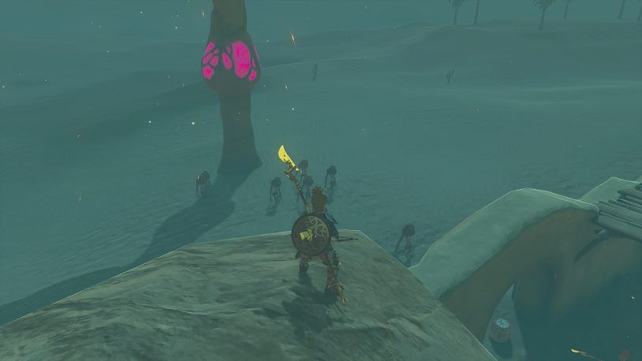

When you've destroyed all three hives, you'll just need to clear out any remaining Gibdo for the battle to be won and the quest to progress.

Speaking to Riju after the fight, she'll tell you about a mural in the underground bunker. This is where you first met Buliaria, so go downstairs and into the bunker to find Riju and learn what the mural means.

To the Underground Bunker

While you're down in the underground bunker, you should explore more to unlock some side quests.

On the immediate left, as you enter the bunker, you'll find Cara who sells accessories. Speaking to her will begin the side quest: The Missing Owner

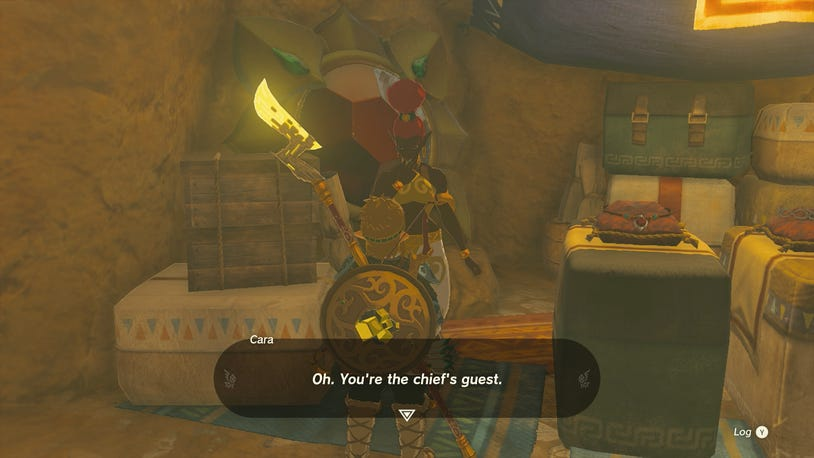

Next to her you can find a Goddess Statue, to trade in Blessing of Lights

Opposite Cara, and near the Goddess Statue, you'll see a stall selling ChuChu Jelly. To the right of the stall is Rotana. She's investigating the wall and standing by the orb. Speaking to her will unlock The Heroine's Secret side quest.

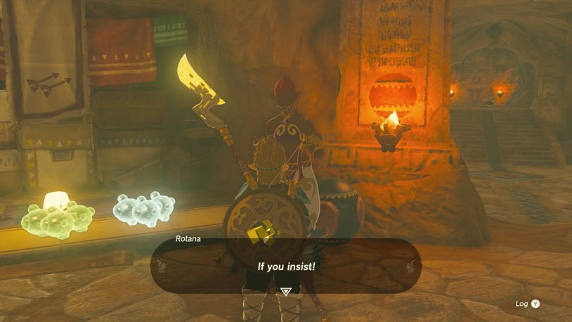

Go into the next room, and look left to see a wall blocked by rocks. Break this to reveal the first stela you can take a photo of called the Monument of Seven Heroines.

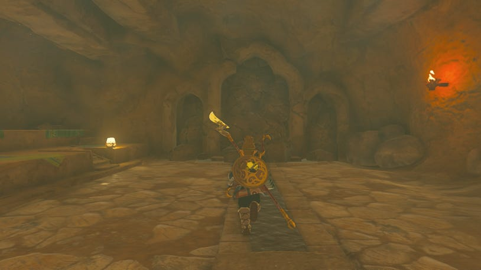

You can then find Riju standing on the far side of the room near the mural she mentioned earlier.

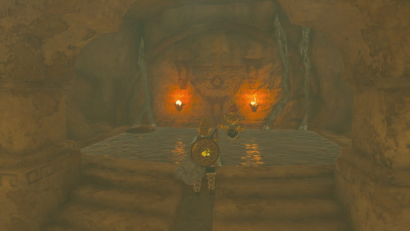

Speak to Riju

Riju will tell you to look at the mural on the wall that mentions red pillars across a vast sea. These pillars must be united to reveal the lightning stone and "open the way".

How to Solve the Red Pillar Puzzle in Gerudo Town

With the mural examined, it's time to solve the puzzle of the red pillars and reveal the lightning stone.

The first part of the puzzle says "standing back-to-back with the throne" so go upstairs to the throne room, and stand with Link's back to the throne.

While you're here, Ascend up twice to reach the shrine that sits above Gerudo Town. This is Soryotanog Shrine, and activating it will create a handy fast travel point for you to use at any point.

Soryotanog Shrine

Behind the throne, is a Sand Seal statue, which is blocking the view. Go behind the statue and look off into the distance to see a pillar with three columns - this is the first destination you want to make your way to.

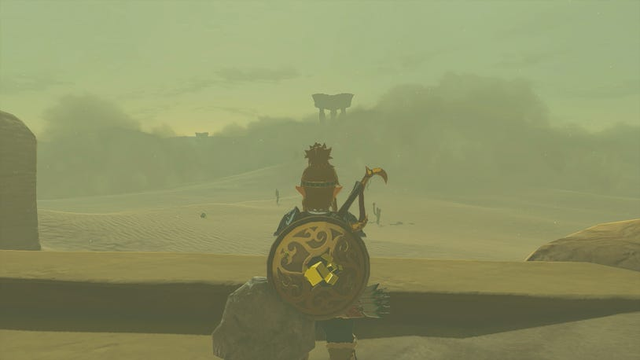

Head for the First Pillar

Set off southwest from Gerudo Town and directly towards the pillar in the distance. There will be some Gibdo along the way, but there's also some Shock Fruit you can pick up and use against them. When you reach the pillar, climb up and look down to see rocks blocking a hole in the bottom of it.

Destroy the rocks to reveal a beam of light that will hit the mirror above and point you in the direction of the second pillar.

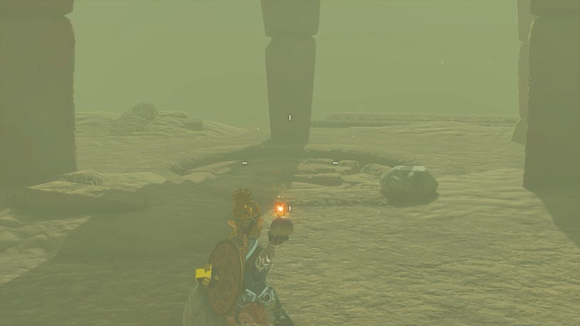

Drop down and follow the light to reach the second pillar. While the beam is visible along the way, be sure to glide using the tornados to float above the sandstorm and ensure you're going in the right direction as the map becomes distorted.

As you get closer to the end of the beam, you'll see that it goes past a pillar and off into the distance. This pillar can be found at coordinates: -4538, -3277, 0033. If you look up while inside it, you can see the mirror you need to use to try and reflect the light.

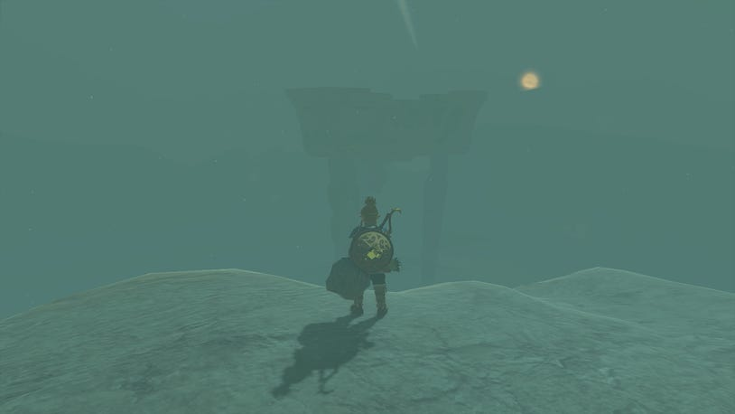

You won't be able to do anything here, but you can at the nearby column, at coordinates: -4599, -3275, 0046. This is the column next to the patch of Hydromelon and the looming Gibdo. Climb this to find a wheel that you can push to raise the pillar with the mirror. Spin it counterclockwise to raise the pillar and allow the light to reflect.

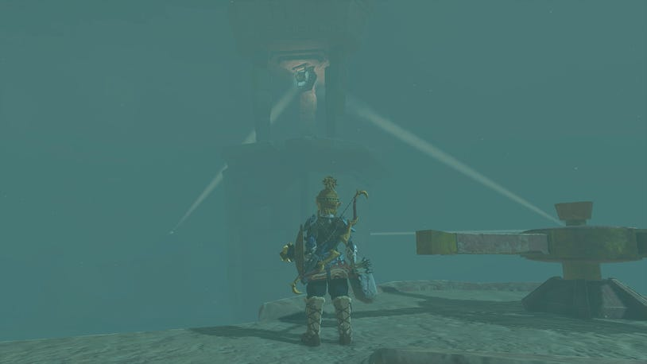

If you want to spin it even faster, and have a fan in your inventory, attach it to the wheel and hit it.

With the second pillar raised, it's time to follow the beam to the third one.

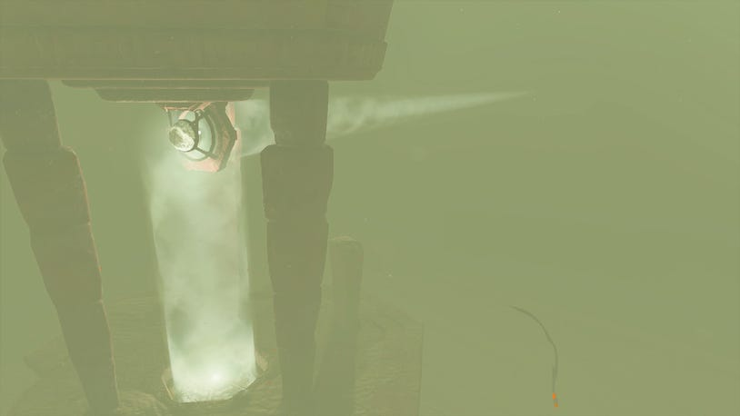

Find the Third Pillar

As you approach the base of this pillar, there's a tornado you can use to glide up to it.

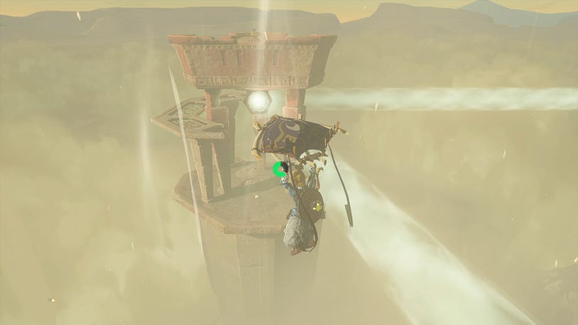

This one also has rocks at the bottom that can be broken, but doing so will reveal Zonai platforms and planks of wood. Using Ascend to go to the top of the pillar, you'll find another wheel but this one is broken. To repair it, you'll want to bring up the planks of wood from below.

It's also worth noting that south of here is the shrine that can be easily reached and activated for a fast travel point.

Create a bundle of wood by stacking the planks together, and placing them on one of the Zonai platforms. Hit the platform to activate the battery, then raise it above your head near the broken grate that goes around half of the pillar.

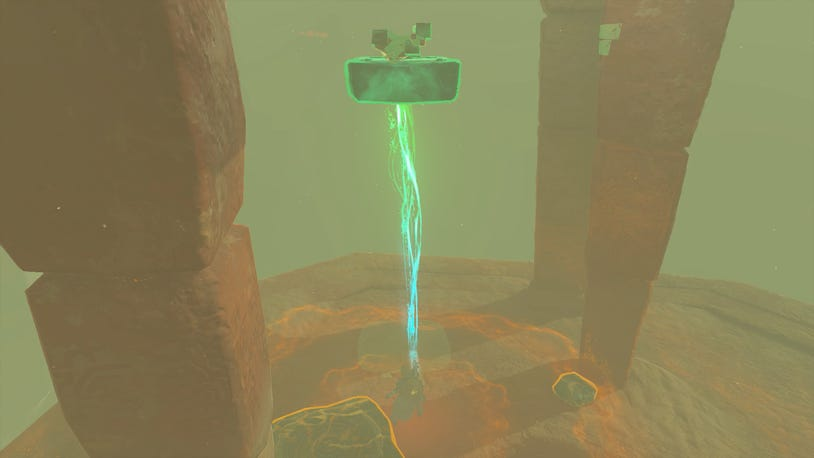

Ascend to this broken platform, collect the platform and the planks, then raise it up again. Climb up to the top, and pull the platform and planks of wood using Ultrahand to the top. Now detach the planks of wood and fix the wheel. Turn it clockwise to line up the mirror and open up the middle.

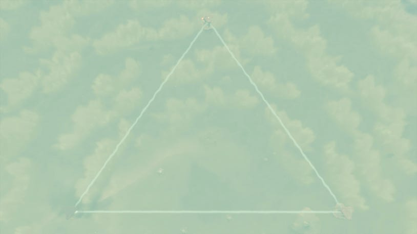

Go to the Middle of the Light Beams

Use the nearby sand tornado to float above the sandstorm and see where you roughly need to head for. As you glide down toward the center of the beams, look for the raised mound to show you where to go.

When you reach the mound, a cutscene will begin and Riju will appear. Talk to her in the center, near the solution to the riddle. Riju suggests here lighting strike might help reveal more, so aim at the top of the statue, to have Riju unleash her attack.

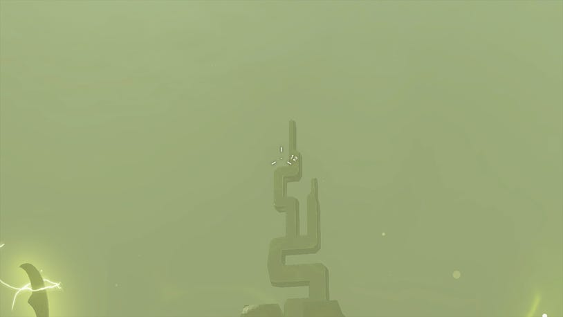

A building will emerge from the sand dunes a little way off in the distance, revealing the entrance to The Lightning Temple.

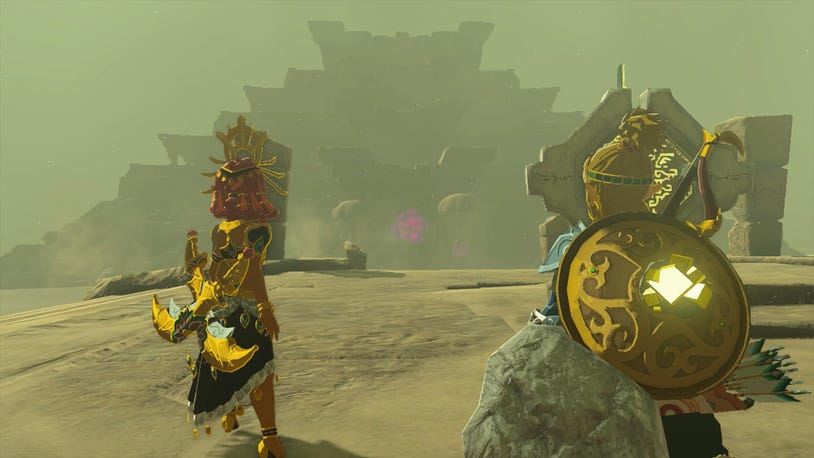

You'll now be able to use Riju's power, as she teams up to help you tackle the dungeon. Make your way across to the glowing hive outside to begin.
