31. Secret of the Ring Ruins

How to Start Secret of the Ring Ruins

To start Secret of the Ring Ruins, you need to go to Kakariko Village, which can be found south of the Lanaryu Wetlands.

The quickest way to reach Kakariko Village is to go to the Sahasra Slope Skyview Tower southeast of Central Hyrule, in the West Necluda region. The Tower Map Coordinates are 1344, -1170, 0166.

Sahasra Slope Skyview Tower

Not only does this offer you a fast travel point should you need to return, but it also provides a quick way to glide straight down into Kakariko Village, which is just east of the Skyview Tower. As you glide, you may notice the closest shrine to the village, which is Makasura Shrine at coordinates: 1170, -1051, 0166.

Makasura Shrine

Drop down into the center of the village then head north towards the crowd that stands before the Ring Ruins. Here, you'll meet Tauro and Chief Paya who just so happen to be discussing the importance of the Ring Ruins.

This conversation is what initiates the chain of quests needed to proceed with Find the Fifth Sage, starting with Secret of the Ring Ruins.

How to Complete Secret of the Ring Ruins

Note that you need to have the camera unlocked to complete this quest. So if you haven't already, you'll need to start Camera Work in the Depths and have Robbie unlock the camera function on your Purah Pad.

You can climb straight up to the floating Ring Ruins using the ladders just in front of Paya and Tauro.

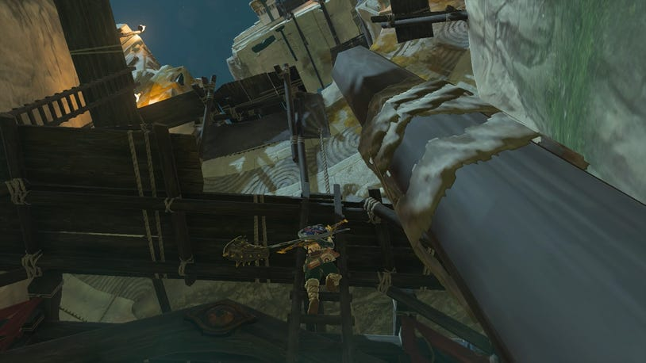

When you reach the top, Ascend into the Ring Ruins, then pull out your camera to take a picture of the stone tablet. Ascend outside of the Ring Ruins and drop back down to Tauro once you're snapped a picture.

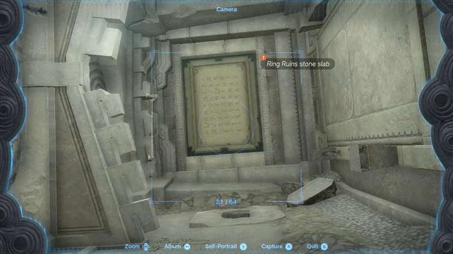

Show Tauro the image, and he'll struggle to make it all out but will manage to decipher some keywords like "southeast" and "Mineru". With more of Paya's insight, she suggests that stone is saying "dragon land" before "southeast". Calip will be the one to piece it all together and suggest that the dragon land in the southeast might be connected to the Zonai Ruins in Faron.

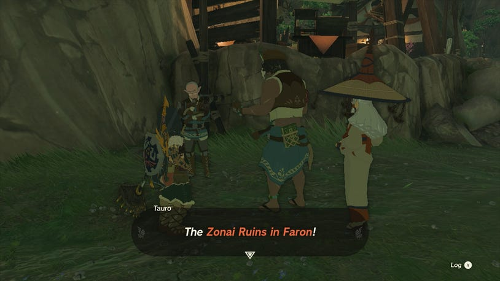

Popla Foothills Skyview Tower

Before the crew goes off to the Zonai Ruins, Tauro says a base will be established at the Popla Foothills Skyview Tower that's close to the ruins. This will be marked on your map. If you've already unlocked it, simply fast-travel there. If not, head southwest from Kakariko Village across West Necluda to reach the Popla Foothills.

Popla Foothills Skyview Tower

When you get there, you can find Calip who has set up camp at the foot of the stairs, near the Popla Foothills North Well.

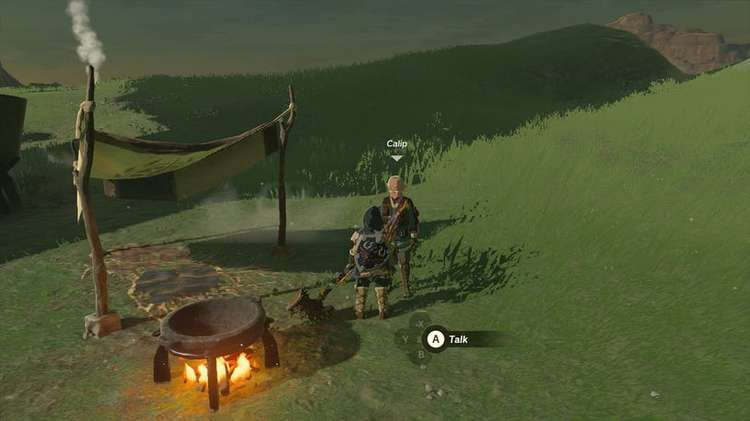

He'll tell you Tauro has already gone ahead to the nearby Dracozu Lake. This can be found just southeast of the Skyview Tower, over the Popla Foothills.

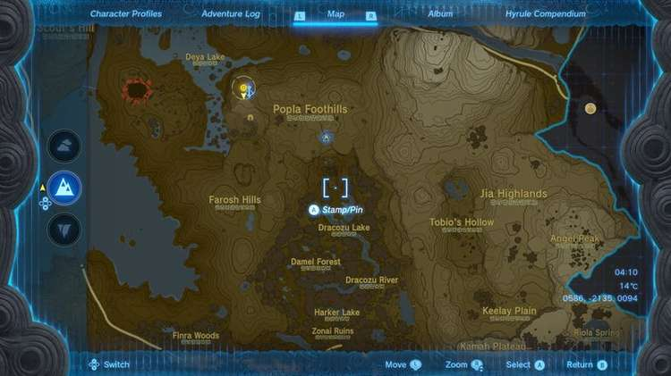

At Dracozu Lake

There's a shrine that's just to the southeast of the Skyview Tower and north of the Dracozu Lake, which is the Jiukoum Shrine. From here, you can glide down to the south and look for a campfire.

Jiukoum Shrine

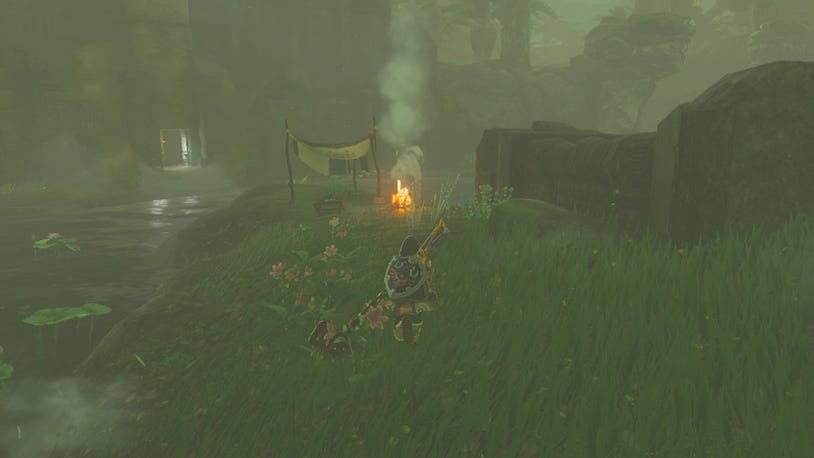

Off to the left of the campfire, you'll see a light coming from inside the ruins at coordinates 0968, -2531, 0008. Go in here to find Tauro, who is investigating the ruins and translating the text. He'll tell you that he's deciphered what he thinks is a poem or code saying: "Wear the electric garb hidden at the long-necked dragons along the wide-mouthed forest serpent".

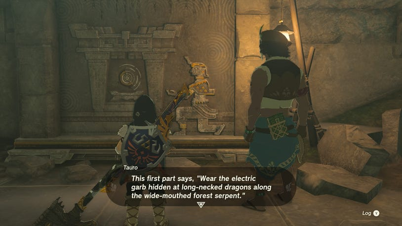

He'll say this reminds him of the tall pillars that can be found around the ruins, which have dragon heads, and the "forest serpent" could be the Dracozu River as it was once compared to a forest dragon in a song.

There's more to the riddle, however, telling you to "offer a Zonai charge to the altar at the tail." Besides this, Tauro will point out a Zonai relic at the back of the ruins, which is actually a Treasure Chest.

Although Tauro can't open it, Link can so go straight up to the Treasure Chest and get yourself a Charged Shirt.

Charged Shirt

Given that the riddle mentions wearing the "electric garb" it's safe to say you need to collect the rest of the Charged Amor, so here's where you can find them.

Where to Find the Charged Trousers

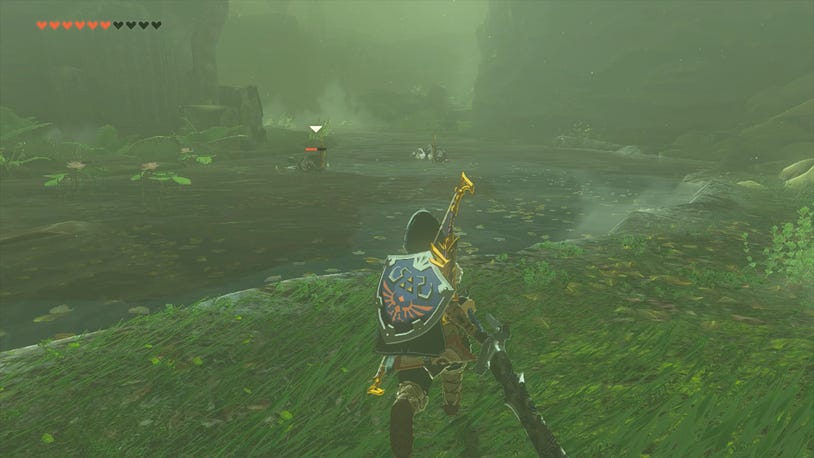

Follow the river south, taking note of the Dragon mouths on the pillars along the way. You'll come to a point where there are Lizalfos in the water. Keep an eye on the right side of the river just beyond them, to see another light glowing from the ruins.

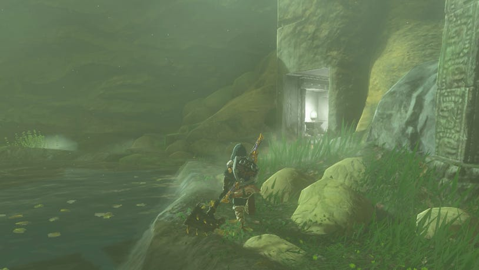

This one can be found at coordinates 0980, -2693, 0007 and has an entrance blocked by rocks.

Destroy the rocks with your hammer or something like a Bomb Flower to gain access, and at the top of the room, there will be another Treasure Chest, which contains the Charged Trousers.

Charged Trousers

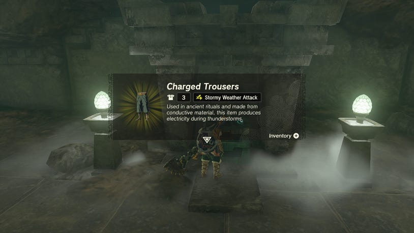

Where to Find the Charged Headdress

Exit the ruins and continue south along the river. As the river starts to bend, you'll see some Lizalfos positioned just above, on a bridge and wooden ledge sticking out from the rock.

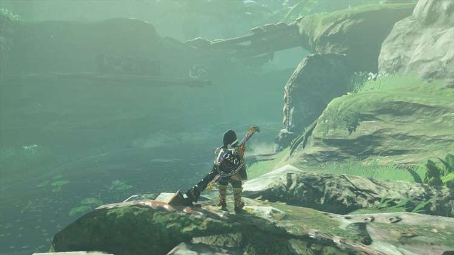

One of them will fire electric arrows at you, so watch them closely. Take them out to grant yourself safe passage and break the boxes on the ledge to get Roasted Bass and Arrows.

Continue down the river, and shortly after them, you'll see an Electric ChuChu on the right. Opposite this, on the left side of the river, another light glows from the flooded ruins at coordinates 0968, -2800, 0007.

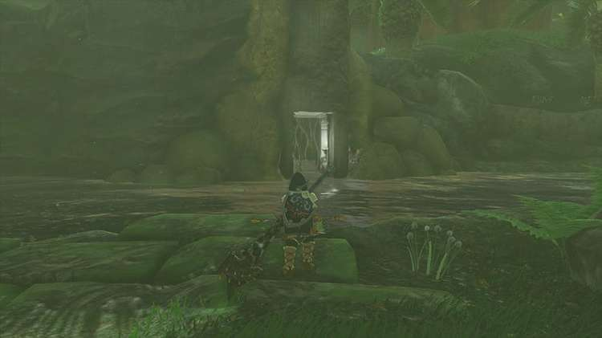

You can just slash the roots that block the door here, and find the chest as you have with the other two, at the back of the room.

Charged Headdress

With all three pieces of the Charged Armor collected, throw it on and continue to follow the river to the west.

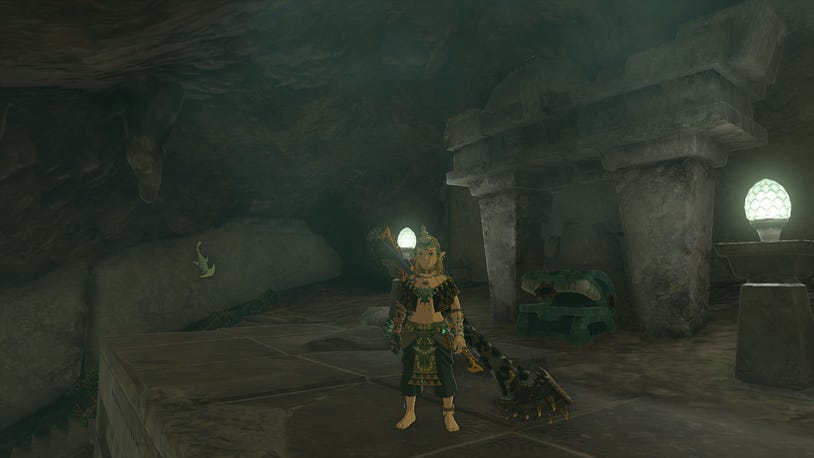

Finding the Zonai Ruins Alter

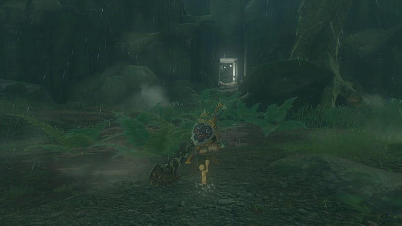

Just like the other ruins, this one will have a glowing light coming from it. You can find it behind a tree in the northwest corner, at coordiates: 0688, -2744, 0014. Climb up the broken ruins to reach an Altar at the back of the room. Take out a Zonai charge by selecting it from your inventory, then pressing Hold.

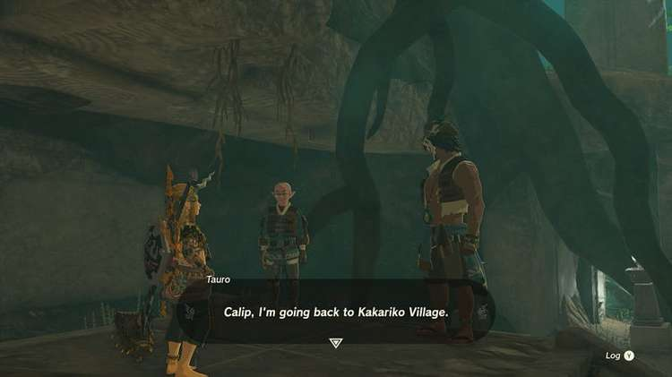

Place it on the Altar and then let the cutscene begin, which shows the dragon heads lighting up and lightning striking them. Calip and Tauro will join you, where you'll be able to tell them more about what happened, then Tauro will head back to Kakariko Village, while Calip will remain there to investigate more.

Heading for the New Sky Island

Use the Popla Foothills Skyview Tower to Ascend into the air. Once the glider becomes available, start gliding over to the southeast, to the Sky Island that resembles a Dragon – the Thunderhead Isles.

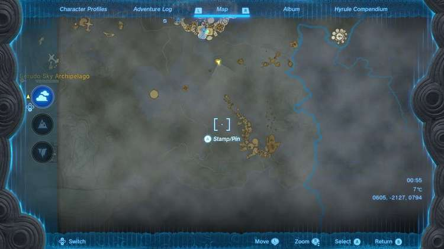

If you don't have enough stamina to make it you can try any of the following: use Tulin and his gust of wind technique to give you a boost, drink Stamina Elixirs to replenish your Stamina mid-way, or complete Shrines to unlock more Light of Blessings and improve your Stamina wheel.

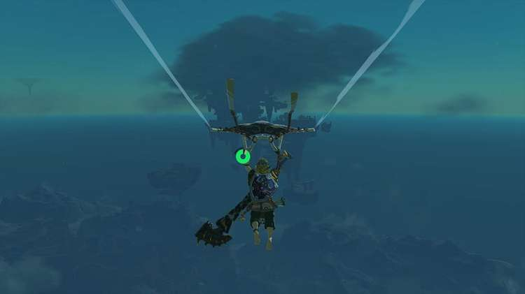

On Thunderhead Isles

Drop to the first part of the island (the northern tip of it), at the bottom if you can't reach the top with your stamina. You can Ascend from here to reach the next level with the body of water in the middle.

Once you're on Thunderhead Isle, it won't be long before the continuous and dangerous lightning strikes begin happening. Make sure you don't have anything metal equipped, or Link is likely to get zapped. You can find lots of wooden weapons around the island if yours break.

From here, you want to work your way down to the south of Thunderhead Isles, eventually making it around to the section in the east that resembles a Dragon head. To do this, you'll need to alternate between jumping and gliding between the floating platforms and Ascending.

As you work your way along the Thunderhead Isles, there are some key points of interest. Note that you'll also encounter plenty of enemies ranging from Soldier Constructs to Electric ChuChu and Thunder Wizzrobes.

In the first section, you'll follow a natural path along the body of the isles, but you'll come to a second platform that's off by itself in the east.

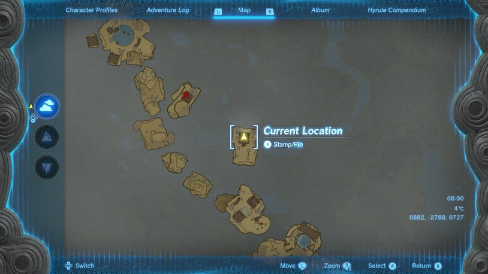

This one is worth stopping by to collect a Treasure Chest at coordinates: 0082, 2788, 0727.

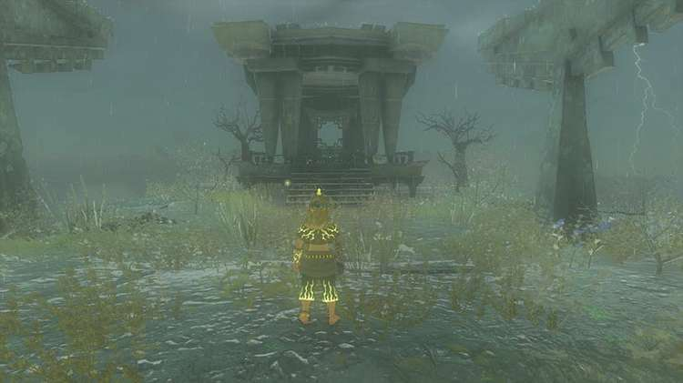

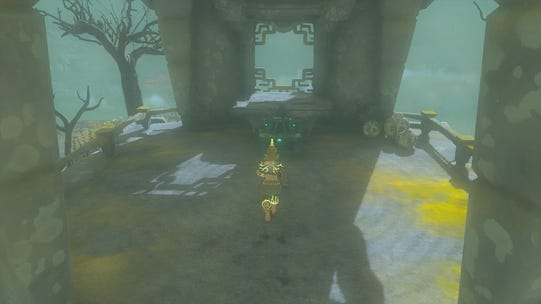

Treasure Chest: On the second floating island you encounter off the east. Contains Mighty Zonaite Spear (8).

The next point of interest is the dragon head with a yellow orb underneath it. These are spring platforms like the ones you will have encountered on the Sky Islands before. The difference with these ones, is you need lightning to strike it before the spring mechanism will move.

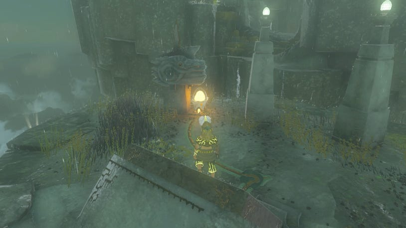

You can get these to go in a variety of ways using electricity, the easiest being just to wait for the lightning to strike. Alternatively, use Riju to charge her electrical attack, hit the orb, and send Link flying to the next platform.

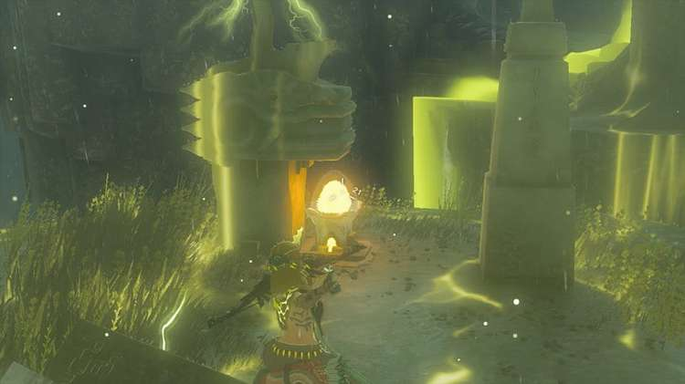

As you land on the next platform, you'll follow it until you come to a pool of water filled with Ancient Arowana. You can create a bridge from the planks of wood here to reach the next section.

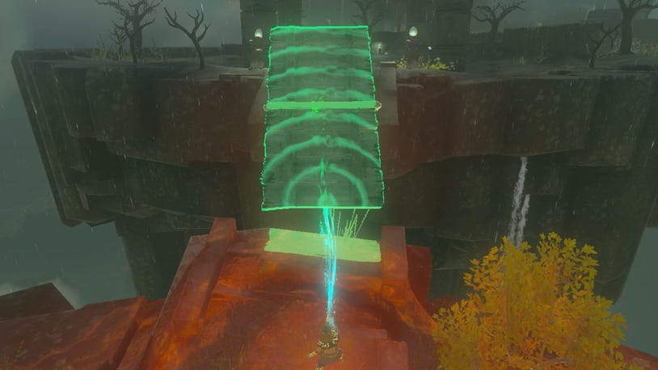

Be careful as you do, as a Thunder Wizzrobe skips around the area. Use some form of Ice to freeze it, if you just want to run past it.

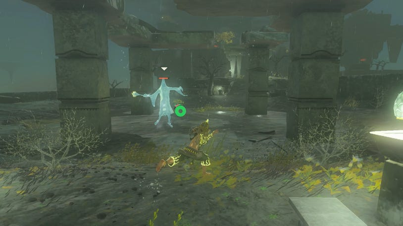

Drop down onto the next platform, where you can sneak and collect some Thunderwing Butterflies that can be used for electrical resistance when put into an Elixir. From here, you can go left or right. To the left you'll see a track, which is ultimately where you want to go, but first go right as there's a treasure chest to get inside of this building.

You'll find another one of the dragon heads with an orb here. Use electricity again on this, and it will break the grates on the floor allowing you to drop straight down and open the Treasure Chest here coordinates 0953, -3112, 0756.

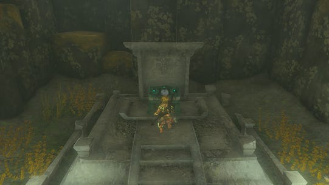

Treasure Chest: Drop down after breaking the grate to find an Old Map.

Ascend back out of here and go over to the rail. Ride the rail to reach the next platform and Ascend up to the top and center.

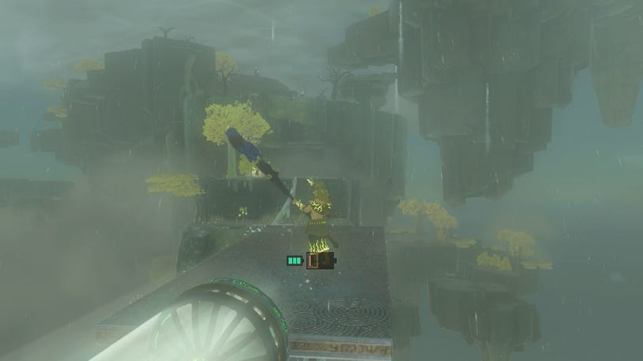

There's a body of water here, with a column in the middle. On the top, you can find a Treasure Chest. It's found at coordinates: 1010, -3825, 0808.

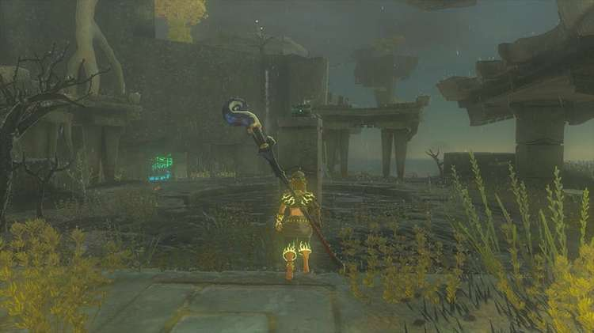

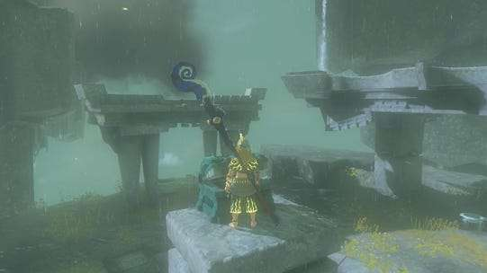

Treasure Chest: in a column in the center of the water. Inside is a Shock Emitter.

As you approach the water, you should see a Shrine through the grate. There are a couple of ways you can get to this, but both rely on you using the grate underneath to Ascend straight into it. From the water, you can either go east and down into the blank circular part of the map, where you'll find a mini-boss – the Flux Construct III.

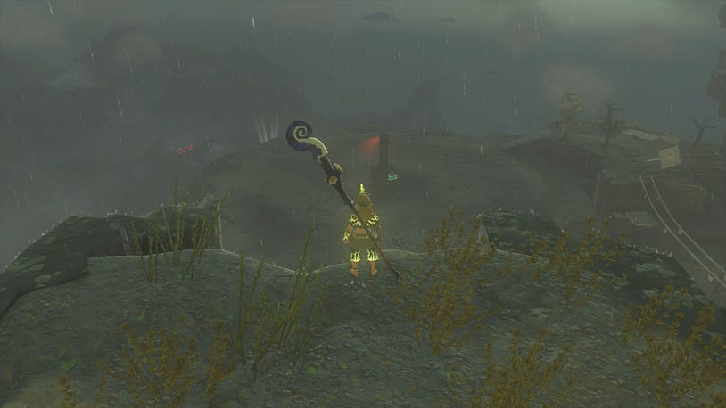

Alternatively, you can glide down to the platform on the right of the shrine, in the south, where Soldier Constructs patrol.

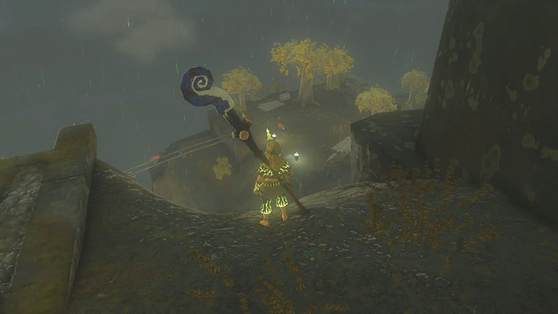

Clear them out and you can craft a cart to ride across the rail. Ready your Ascend as you begin to move, then quickly press it to go straight up into the room where you can unlock the Joku-usin Shrine.

Joku-usin Shrine

This is the method we used, and then we Ascended up to the top and made preparations before taking on the Flux Construct III.

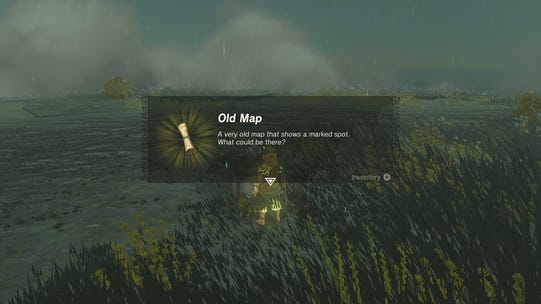

Treasure Chest: If you don't feel like beating the Flux Construct III then you can skip it entirely. But whenever you decide to take it on, the first time you hit it, it will drop a Treasure Chest containing an Old Map.

To continue, get back onto the platform with the Zonai Dispenser, then look opposite to see a room with three Like Likes in the water.

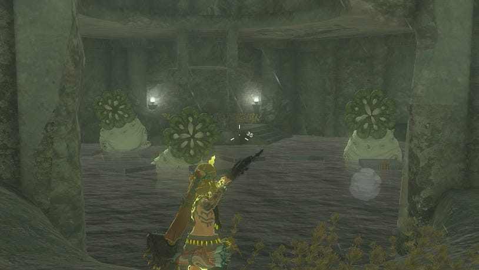

There's a Treasure Chest in here they're guarding. You can use the water and electricity to your advantage here, to attack and keep them stunned. When the room is clear, head over to the Treasure Chest at coordinates 1042, -3367, 0819.

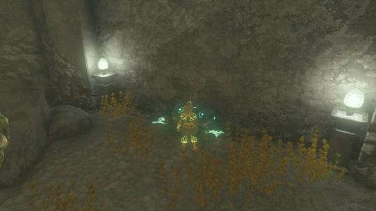

Treasure Chest: in the room with the three Like Likes contains a Big Battery.

Ascend once you've opened the chest and you'll reach a platform where there's a wheel in the middle. Push this counterclockwise, so the launch pad is facing towards the southeast then use lightning to glide over to the next island.

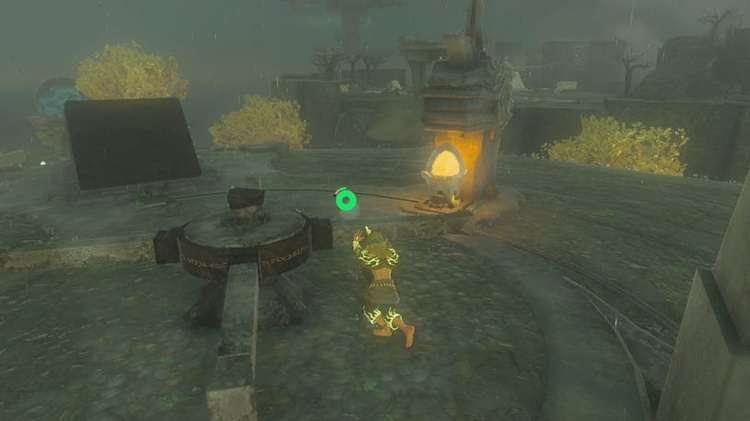

From here, there's a broken platform directly in front. Ignore that for now, and go right to collect another Treasure Chest. You can make a cart with the construction materials and Rockets to zoom across to the island where another chest lies at coordinates: 1042, -3513, 0862.

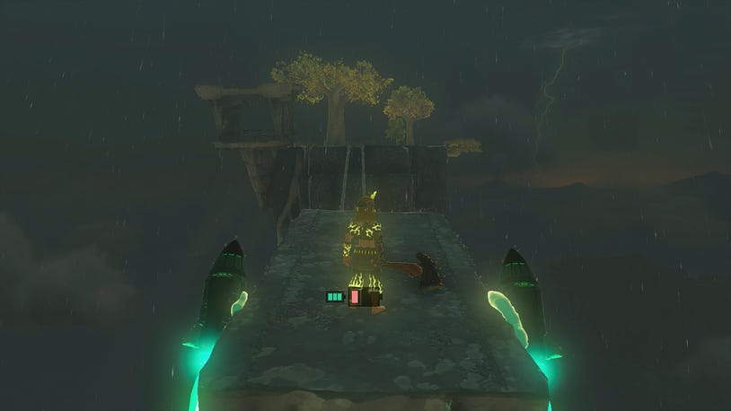

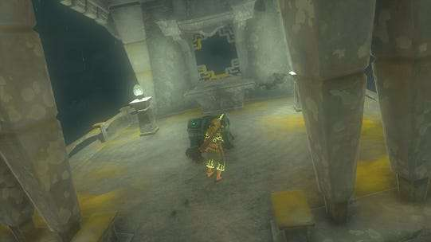

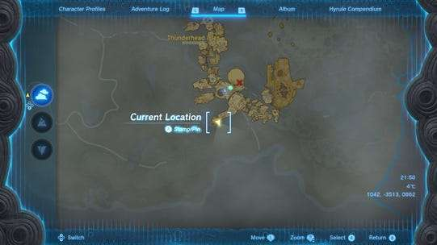

Treasure Chest: In the western part of the island, on the part that looks like the front leg of the Dragon. Contains Zonaite Bow (30).

Go back over to the broken rail. You don't need to use the carts or try to use the rail here, you can just Ascend to the platform you need to reach by using the ones underneath. Glide down to them and Ascend, just before sure to go all the way to the top and coordinates 1234, -3492, 0847 for another Treasure Chest.

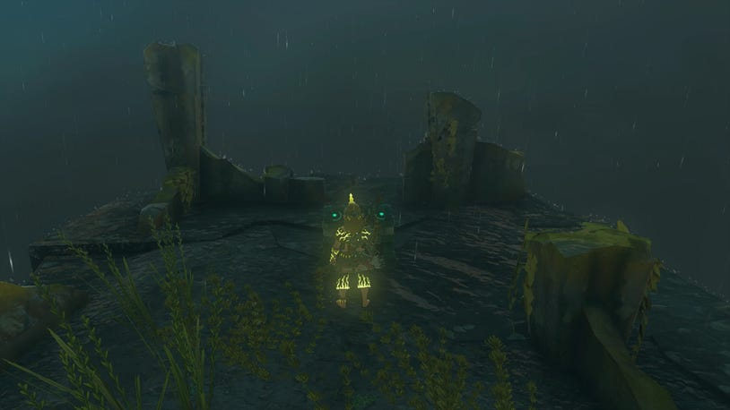

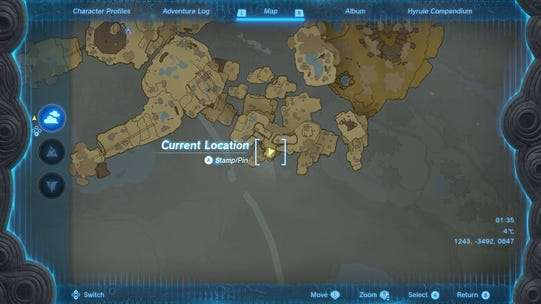

Treasure Chest: Contains Mighty Zonaite Shield (50).

Go to the eastern edge of these islands, and then glide down to the next launch pad. Use lightning to once again launch yourself off to the next and last section, which sits just above the Dragon head.

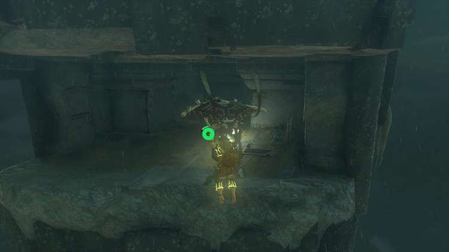

Land on the bottom level, to pick up another Treasure Chest at coordinates 1310, -3397, 0884.

Treasure Chest: On the island above the Dragon Head. It's on the lower level. Contains 3 x Shock Emitter.

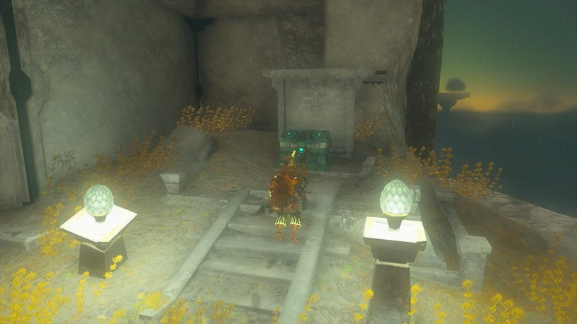

Follow this around to the ledge with the circle platform lit up in green. Go to the edge and look down at the dragon head down below in the east and jump.

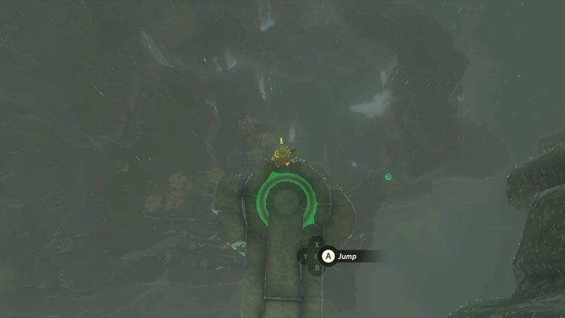

As you approach Dragonhead Island, aim for the Joku-U Shrine, which sits in the Dragon's eye.

Joku-u Shrine

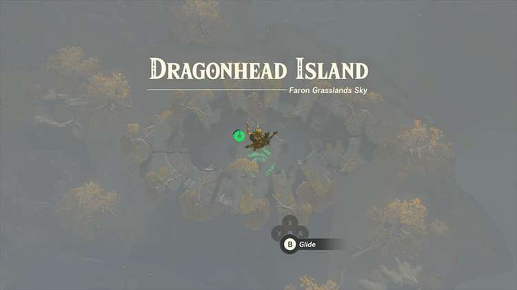

After activating (or completing) the shrine, leave the room via the north side. You can just cut through the roots here to get into the next room.

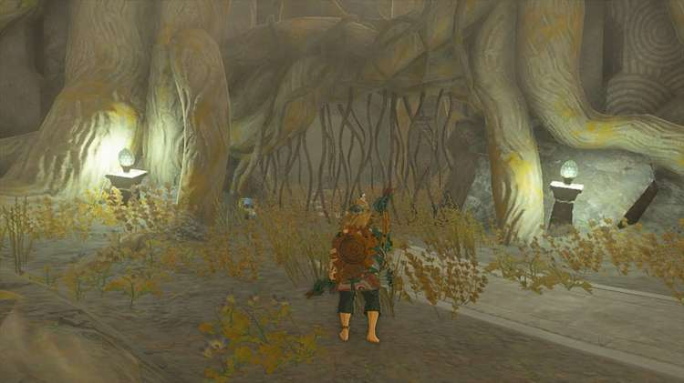

As you enter, you can see a goddess statue on the left and a locked door.

If you don't have 10 Hearts at this point, or your health is low, you won't make it through the door. Now's the time to either use Light of Blessings or go and find some, so you at least have 10 Hearts.

When you're properly prepared and have a full 10 Hearts, open the door. Inside, there will be a Zonai relic sitting in the center of the room.

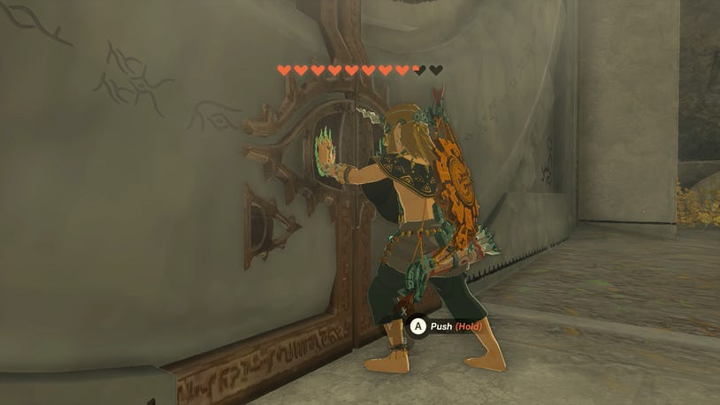

Approach it and examine it. A beam of light will be released, and Secret of the Ring Ruins will be complete. Once this happens, a new quest, Guidance from the Ages Past will begin immediately.
