22. Sidon of the Zora

Sidon of the Zora is part of a questline, which features multiple quests. You can find walkthroughs below for:

The Broken Slate

How to Complete Clues to the Sky

For walkthroughs on the quests before Sidon of the Zora, see:

The Sludge-Covered Statue

Restoring the Zora Armor

Start from Zora's Domain

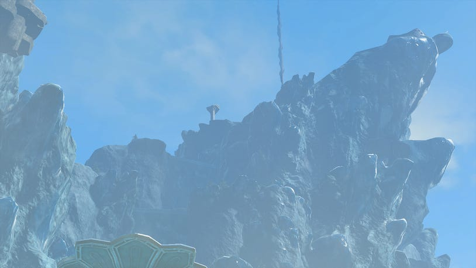

Before you can begin Sidon of the Zora, there are a couple of quests you should complete - one is compulsory to unlock the quest chain, while the others are optional but highly recommended to finish before starting on Sidon of the Zora.

Essential Main Story Quest

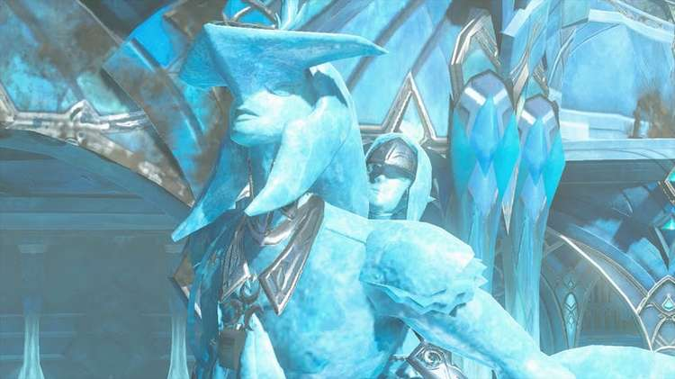

You'll need to complete The Sludge-Covered Statue to unlock the Sidon of the Zora quest. So, speak to Chroma, Kira, and Yona who are standing in the center of Zora's Domain, near a statue and the sludge-filled water to begin this one.

Optional Main Story Quest

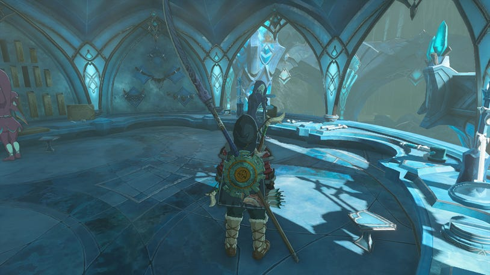

The Sidon of the Zora main quest will unlock after completing The Sludge-Covered Statue, but you should also undertake Restoring the Zora Armor. This will give you equipment that will make the climb to Polymous Mountain much easier.

Starting Sidon of the Zora

Equip the Zora Armor you get from completing the Restoring the Zora Armor quest. Then, leave Zora's Domain from the east bridge on the second level.

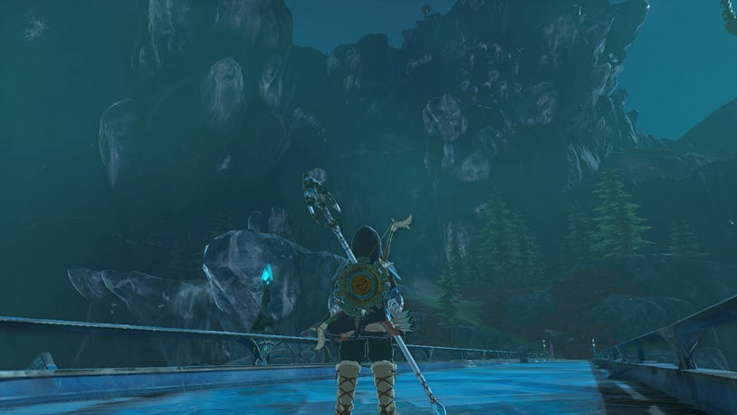

This will take you over to a number of waterfalls, which you will have been shown from completing the previous quest. Swim up to the far right side of the waterfall, then press Swim Up to get straight to the top.

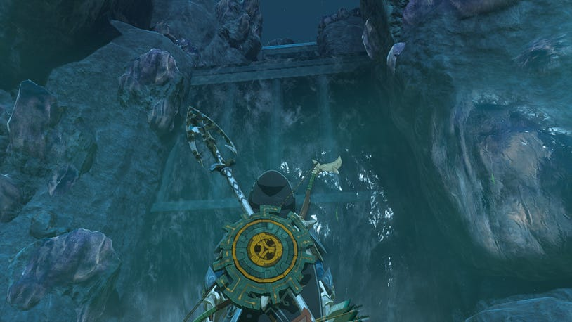

Note: when you swim up in the waterfall, your stamina will replenish.

When you get to the top of the waterfall, you'll also get a little boost in the air and be able to glide down to safety. Aim for the mountainside on the right (to the east/southeast). As you land, you might spot a Blupee hanging around by the edge of the cliff.

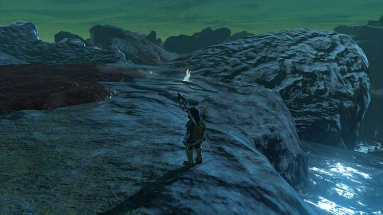

There's a cave just behind the trees if you look east while standing next to the waterfall.

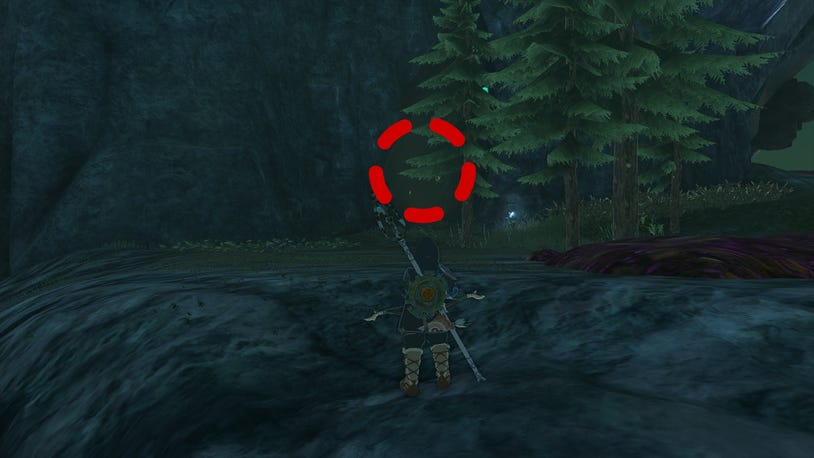

This is the Ploymus Mountain Cave where you can pick up a piece of the Climber's Set.

Ploymus Mountain Cave

If you don't already have anything to help you with climbing, you can craft a Sticky Elixir to help you scale the walls. You want to use the ledges to climb up the cave, and head towards the back. Eventually, as you reach the top, follow it to the northwest side to find a chest with the Climber's Bandana inside. The coordinates for this are: 3713, 0494, 0310.

Climber's Bandana

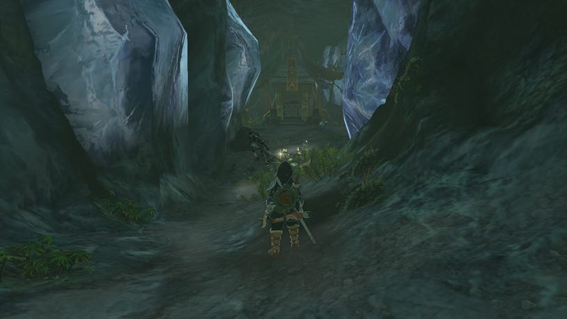

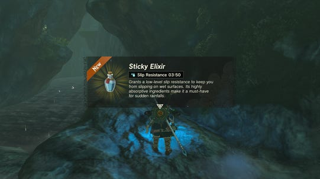

To craft a Sticky Elixir use Sticky Frogs or Sticky Lizards with monster parts. If you have a portable pot, you can craft one right there in the cave.

When you've visited this cave, head back out and go back towards the waterfall. Swim up to the second waterfall, then aim for the right-hand side again. Careful of the Lizalfos that guard the area here. When it's safe, go over to the blue archways for another Learnings of the Zora.

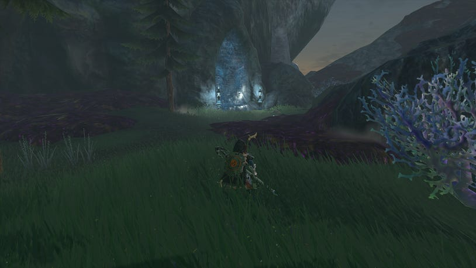

Return again to the waterfalls and take the third waterfall up. This will take you to the top of this series of waterfalls, where you'll need to go slightly northeast towards the path and then take the first waterfall you see on your right. This is the fourth and final waterfall that will help you reach Mipha Court.

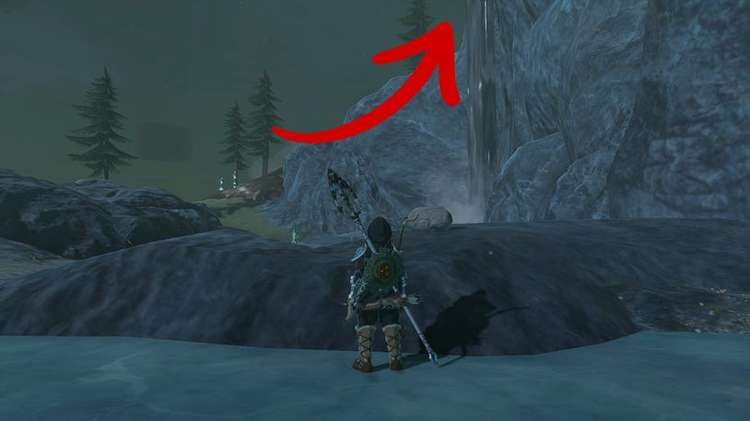

As you're propelled into the air, glide slightly to the right to land at Ihen-A Shrine. To be able to activate it, you'll need a Splash Fruit to get rid of the sludge on the outside.

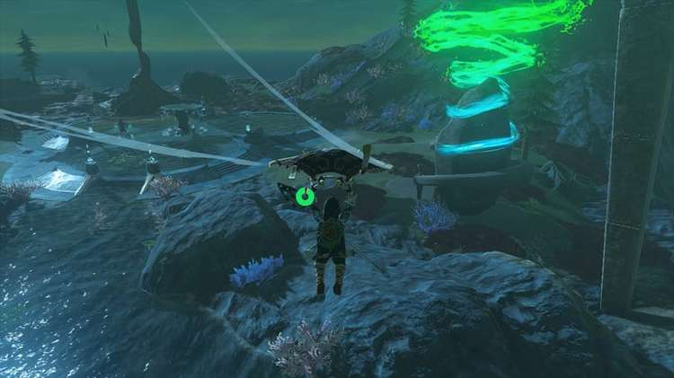

Interact with it (or complete it) so you have this as a handy fast travel point for the rest of the quest.

Ihen-a Shrine

Head east into the middle of the water in Mipha Court and speak to the Sidon who stands with his arms stretched out on either side and is in red.

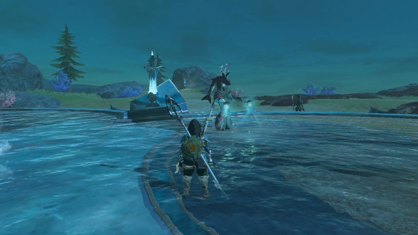

During the conversation, he'll suggest speaking to the historian Jiahto in Toto Lake, which is northwest of Mipha Court.

Go to the northwest edge of the mountain and look out. You'll see a Skyview Tower and shrine off in the distance, but to the left, there will be a sludge waterfall flowing up to the sky.

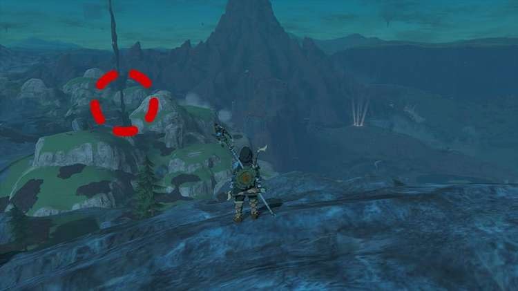

This is exactly where Toto Lake is, so glide down and climb the short distance across the mountain until you reach the lake. Upon arrival, you might spot Dunma standing on top of a platform to the left. Speak to Dunma first, then Jiahto, who you want to speak to, can be found inside the cave.

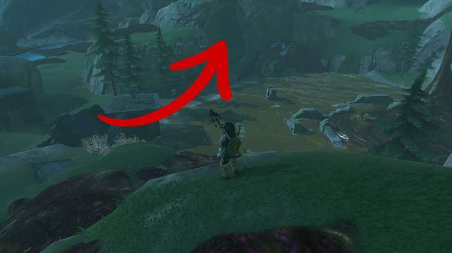

Speaking to Jiahto, this will start The Broken Slate, which is an additional main quest that forms part of the Sidon of the Zora questline.

How to Complete The Broken Slate

Head just outside of the cave where you speak to Jiahto to find The Broken Slate he speaks of. As you head outside, turn left and look slightly up. Climb up the rocks to find The Broken Slate covered in sludge.

Use a Splash Fruit to free it, then use Ultrahand to pick it up and move it.

Take it into the cave then line it up with the broken slate on the wall to slot the fragment in.

As soon as you do Jiahto will react and say that he can finally read what the tablet says. When the tablet has been read aloud, Jiahto will say that it would be wise to consult King Dorephan on what it means.

This will wrap up The Broken Slate, but unlock The Clues to the Sky main quest.

How to Complete Clues to the Sky

Return to Zora's Domain and take the stairs up to the second floor, then up again in the center to the throne room. As you approach, three children, Tumbo, Keye, and Laruta will be playing, pretending to be King Dorephan.

If you try to approach them head-on, go behind them, or on either side of them they'll tell you to scram. You'll need to approach them stealthily and the best way to do it is to go outside and around the back then climb up and into the throne that sits behind them.

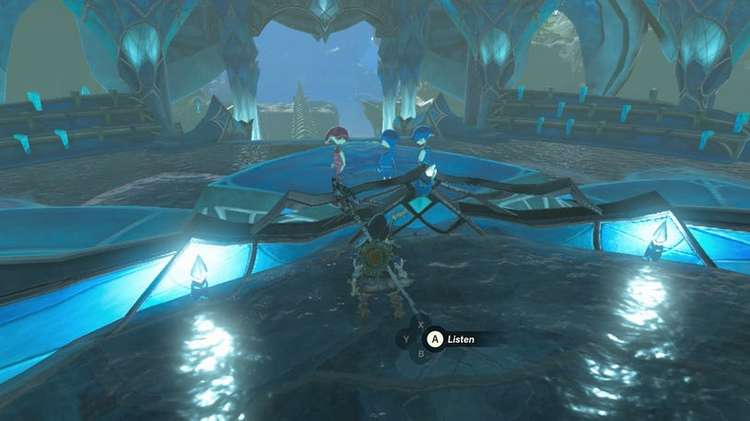

You can then get close to them and press Listen when prompted. They'll reveal that the secret spot is "Pristine sanctummmy", a place with clear water. Tumbo offers up that there's clean water that flows between Ploymus Mountain and Zora's Domain, with a secret entrance behind the waterfall.

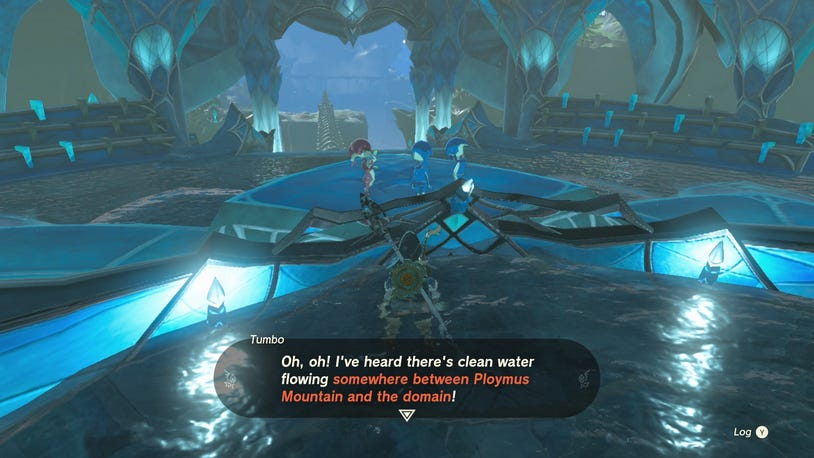

Leave Zora's Domain from the bridge in the east again, and return to the series of waterfalls. Swim up the first and second waterfalls, then as you reach the third one in Lulu Lake, look to the northwest. The map shows a body of water that siphons off from Lulu Lake. Go towards the rocks, and you'll see a waterfall that drops down.

Go down here and you'll end up discovering the Pristine Sanctum where King Dorephan is.

Drop straight to the bottom and approach King Dorephan on the throne. As you've already spoken to Jiahto, and completed The Broken Slate, you'll be able to give Dorephan an update on the progress that Jiahto has made. In return, you'll receive King's Scale x 5.

When the conversation with King Dorephan is over, return to Sidon. Speak to him and give him an update on the progress you've made with The Broken Slate and Clues to the Sky. With some clues resolved, the only one that remains is "the land of the sky fish" and the "floating rock in the shape of a droplet."

It's now time to find the land of the sky fish.

How to Find the Land of the Sky Fish

Open your map and look at the Sky Map. Just to the east of where you stand with Sidon, you'll see a fish-shaped island floating in the sky.

If you look up just east from where Sidon stands, you'll also be able to see the island with sludge pouring from its mouth.

Head eastward towards the island, and as you reach the edge of the cliff, you'll see remnants of a hot air balloon. If you have a flame emitter, you can use Ultrahand to put this together and float up towards the island. Alternatively, watch out for fragments falling from the sky and use Recall to float up and glide from.

Once you've landed on Floating Scales Island, head up the stairs and to the center of the fish's body. Stand at the edge of the semi-circle (facing southwest towards the fin). The coordinates for this are: 4073, 0529, 0603.

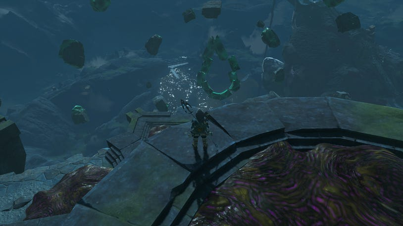

Stand facing the rocks until it forms a perfect tear-shaped droplet, then think back to what Jiahto said during The Broken Slate.

Dorephan has just provided you with the "mark of the king", so open your bow and ready your arrow. Then press up to attach a King's Scale to one of the arrows. When you're ready, shoot through the teardrop to begin a cutscene.

Note: If you don't have arrows, you can find some on the Floating Scales Island.

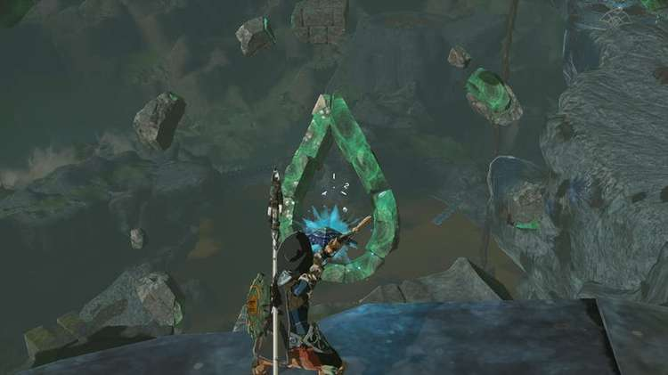

Doing this will wrap up the Clues to the Sky quest and enable you to continue with the rest of Sidon of the Zora.

While you can get a Side Quest after the Water Temple to complete this quest later, you can get another piece of the Zora Armor early if you know where to look. Check the northwest side of the floating island to spot some gunk along the walls and shoot it with a Splash Fruit-tipped arrow to reveal a hole, and follow it to find the Zora Helm!

How to Complete Sidon of the Zora

With the tear-shaped droplet activated, return to Sidon, who will now be at the side of the pool in Mipha Court, talking to Lady Yona. Yona suggests that Sidon accompany Link and help him out when suddenly, a monster emerges from the ground.

How to Beat the Sludge Like

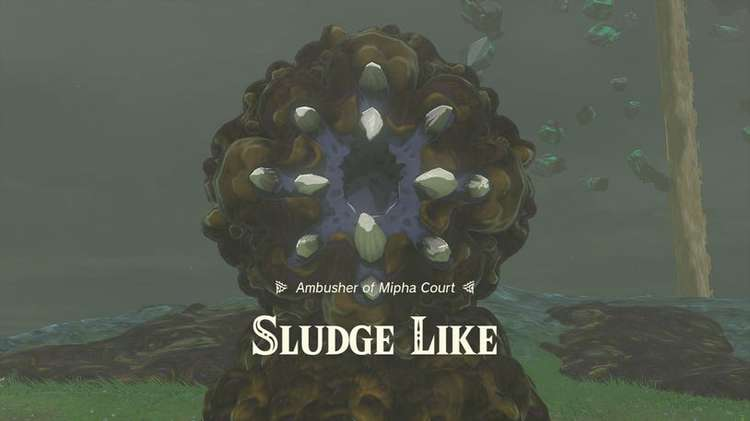

Sidon will give you some tips before the fight begins, that he can use his power of water to envelop and shield Link, and that it can then be used as a weapon to attack.

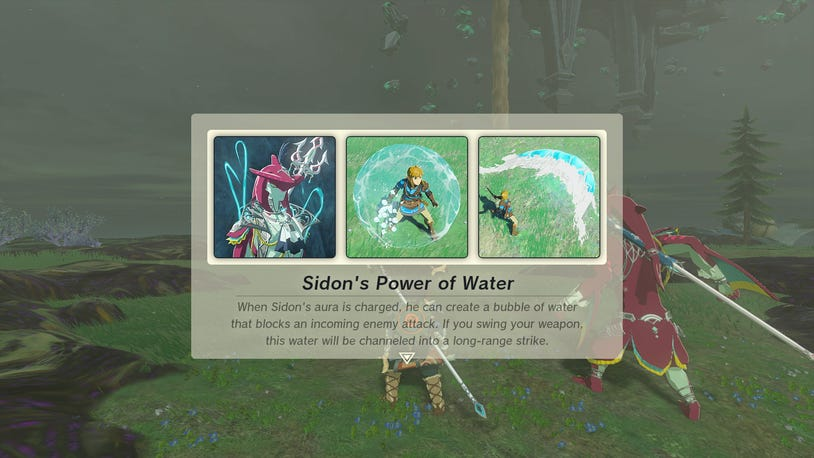

Approach this the way you would any other Like, by attempting to get it to open its mouth and expose its vulnerable point in the center of it. As the Like is covered in sludge, you'll need to use water to remove it and stop it from using it as a shield. You can do this by either having Sidon envelop you in a bubble of water, or you can use Splash Fruit to remove its armor. Each time you remove its armor, let it start to attack then wait for the purple bubble in the middle of its mouth to appear and hit it. This is the weak spot.

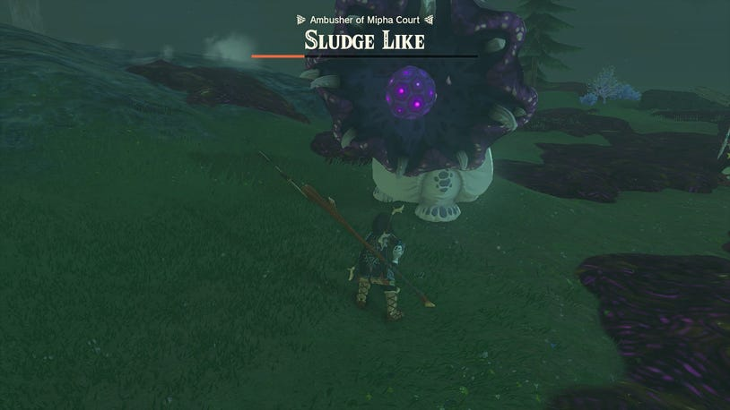

Once it's taken enough hits, it will disappear and remerge covered in sludge again. You'll just need to remove its armor each time and follow the same pattern of attacks.

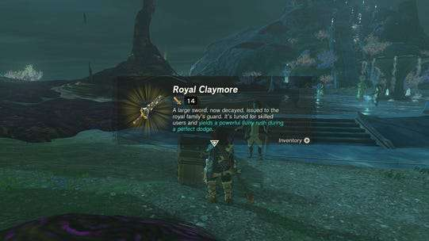

When the fight is over, the Sludge Like will disappear and a chest will appear containing a Royal Claymore (24).

After a cutscene and conversation between Sidon and Yona, Sidon will move south to the center of the East Reservoir Lake. If you climb south from Mipha Court, you'll reach Shatterback Point, where you can easily glide down to the East Reservoir Lake.

Land on the podium that Sidon is standing on, overlooking the green beam coming from the reservoir.

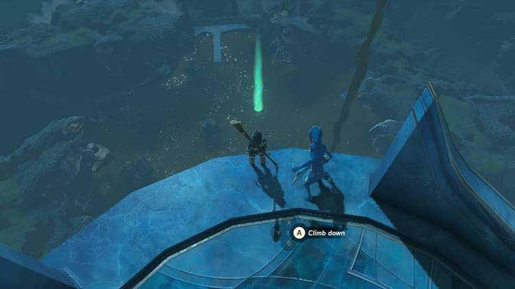

Talk to Sidon and he'll create a whirlpool in the center of the reservoir that you can now dive into. Glide on over to it and drop down inside to be transported underwater.

When you emerge, climb up the stairs out of the water, then go over to the set of stairs going down. Look down and to the left to see a treasure chest for you to open.

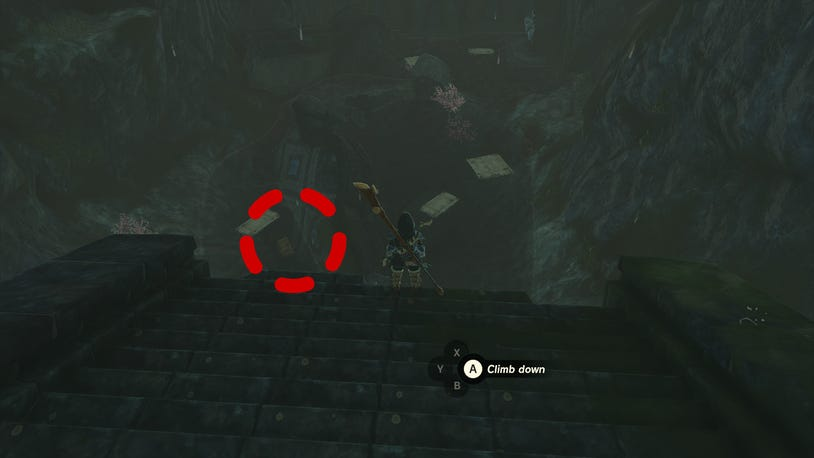

You won't be able to open it in the water, so use Ultrahand to attach it to the floating piece of wood next to it and open it while on there. You'll get a Zora Sword.

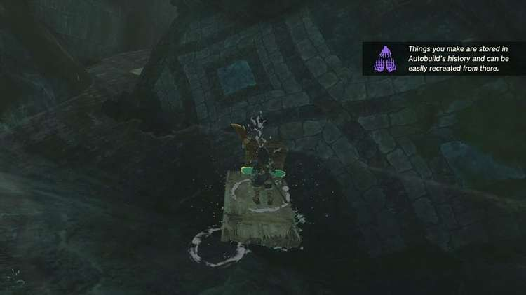

Go to the eastern side of the cave, and as you reach the end look southeast to the rocks blocking the water. Smash through them to raise the water level and reach the stairs in the east.

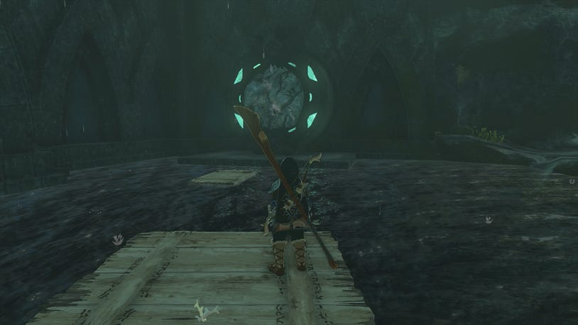

Follow the path into the Ancient Zora Waterworks.

Ancient Zora Waterworks

When you first enter, you'll see two blocked tunnels. The most obvious one is in the west, opposite where you enter the Ancient Zora Waterworks from. The closest one is just to the right (east) and should be where you start.

Climb up the broken platform to reach the area below the tunnel. Then use the planks of wood around it and Ultrahand to create a ramp up to it.

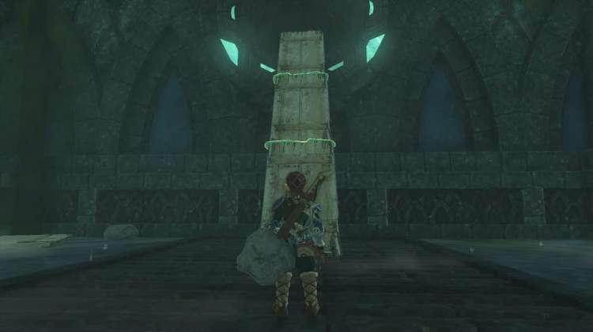

Smash through the rocks at the end of the tunnel. If you don't have a hammer weapon, you can use the rocks around this area to fuse with a weapon and create one. When you've cleared this tunnel out of rocks, the water level will rise inside the waterworks.

With the water levels risen, look around near where you destroyed the blockage and you should find a wooden treasure chest floating up among the wooden planks, and you can drag it over to a plank to open it and find a Zora Shield.

Now you want to focus on the tunnel to the west. The one you'll see with the blue glow around it on the west side isn't a tunnel to clear rocks out of, the one you want to go into is just below. But this one does have a chest in it. Swim over to the left side of the room and go up the ramp. Climb up and use planks to get across to the tunnel.

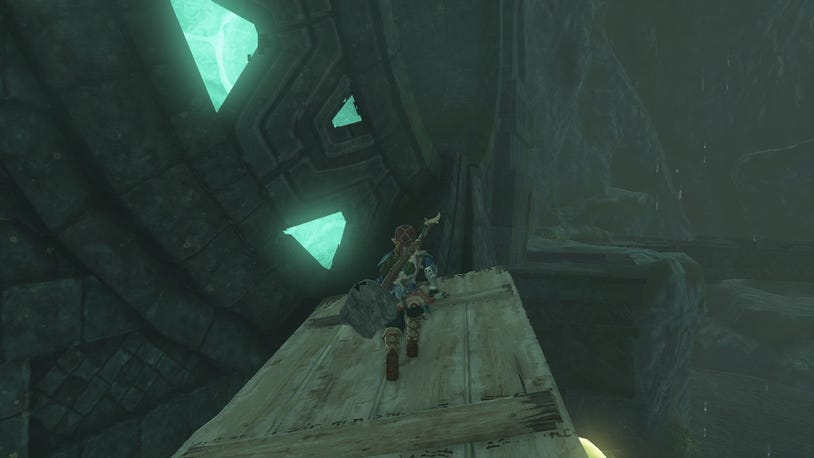

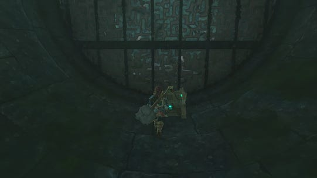

Treasure Chest: inside the western tunnel you can get an Opal.

Go back to the ramp you took up on the west side to reach this tunnel, and look at the smaller tunnel just below (and to the left) of the one with the chest.

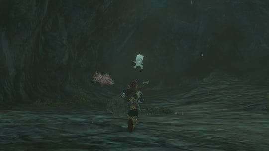

If you go to the right side of the room instead, you can find a cave by climbing up. Inside, you'll find an Ice Like Like that spits ice and if you go as far into the cave as you can, you'll find a Bubbulfrog.

It will be darker, without any blue lights and dirty water will run through it. To get over to it with ease, use one plank as a bridge.

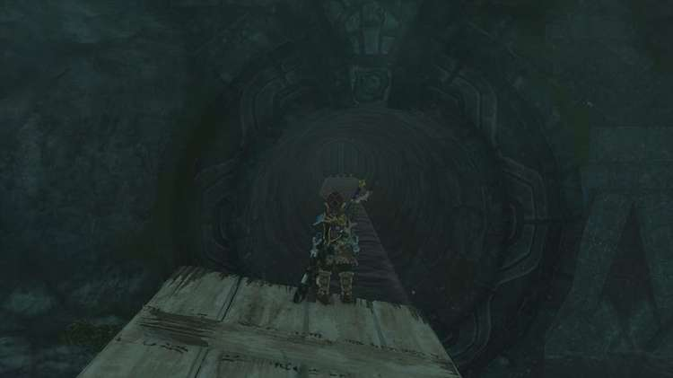

When you enter this murky tunnel, you want to head for the second turning on the right, then go left into the middle of the tunnel. Seven streams of water will fall down from the grate above.

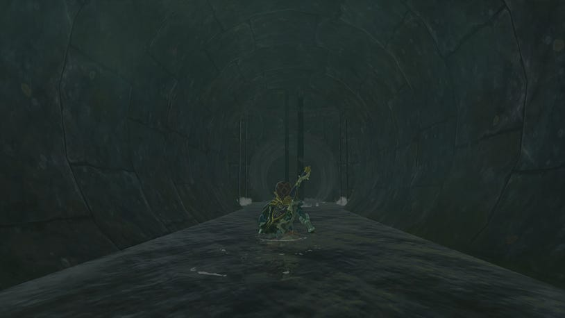

Use Ascension here below the grate to get to the room where the rocks block the tunnel. Smash through these rocks, and the water level will rise again ensuring you can reach the structure in the middle that houses the beam.

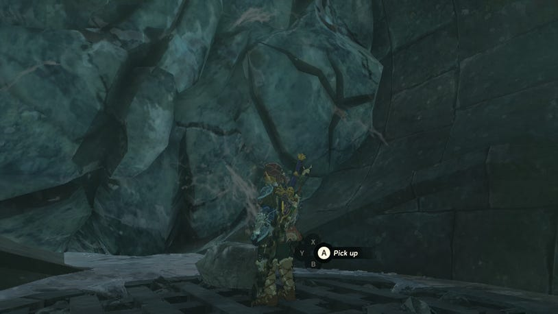

Go right after breaking the rocks, then climb the ladder to get to the top. Go into the next room and use Ultrahand on the lever to open it.

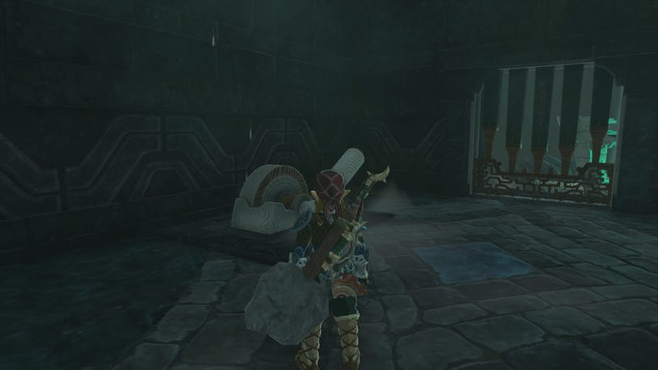

Now that the water has raised to the max level, you can also glide across to the high ledge past where the Bubbulfrog cave was to find another treasure chest with a Zora Longsword inside. On the far northern side is a similar high ledge leading to one last treasure chest covered in brambles. The damp dripping cave renders fire effect ineffective, so you'll have to provide cover by using Ultrahand on the floating wooden planks to create a shelter for the bramble for lighting it on fire, and collecting the Large Zonai Charge in the last chest.

Glide across to the beam in the middle, and swim around to the steps to go up it. Activate the terminal to begin and let the cutscene play, which shows the beam coming from the reservoir and reaching right up into the Sky Islands.

This is where you'll have to have completed Restoring the Zora Armor, so you can swim up and climb the waterfall.

Jump into it and press Swim Up. As you reach the top, you'll land on Wellspring Island.

Exploring Wellspring Island

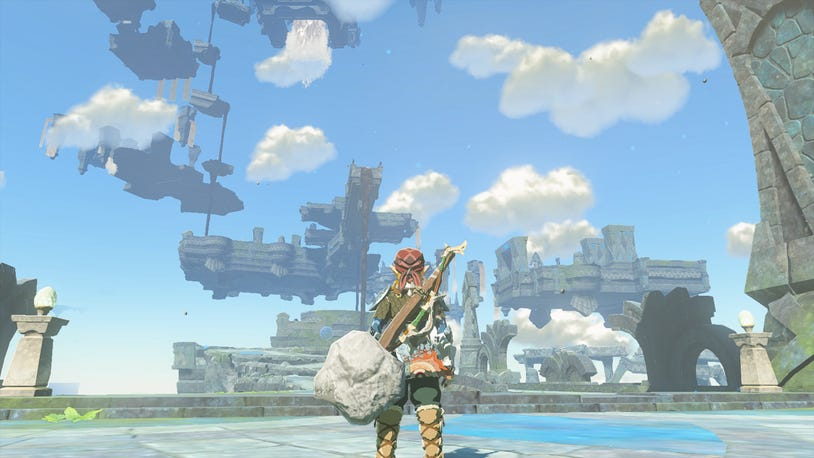

When you begin traversing Wellspring Island, go northwest. Walk up the ramps and towards where the bubbles will begin to emerge, to find Sidon waiting by a sludge waterfall. Just before him are two floating bubbles, and a pile of goop that can be cleaned to reveal a treasure chest with a leveled Construct Soldier Blade inside.

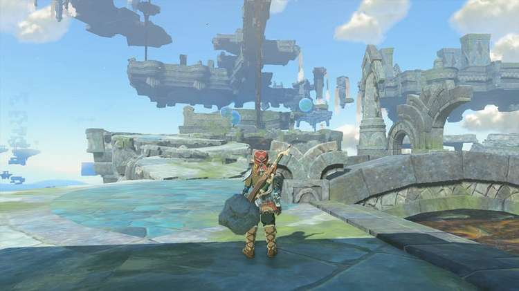

If you jump at any point while starting to make the journey, you'll realize there's a weightlessness to the island, that lets you jump higher.

Sidon and Link will split up for the time being, so you'll need to climb this solo. If you turn to the left, you'll see bubbles emerging from a machine with green lights. Note that there's a long platform extending down to the east, but it's lined with Soldier Constructs, and only holds a treasure chest on the top level with a leveled Construct Soldier Spear, and another chest at the very end with a Big Battery, should you choose to explore towards that dead end.

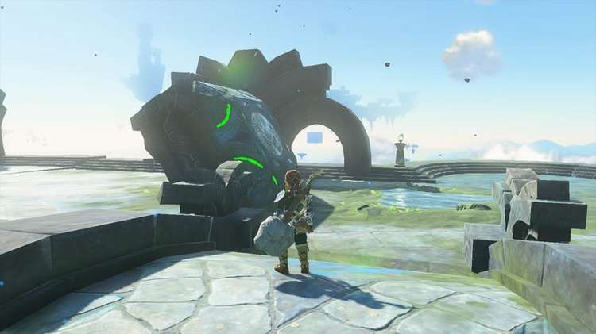

Stand by it, and wait for a bubble to emerge, that will carry you to the next level. When you reach it, start to go east and use the bubble machine again.

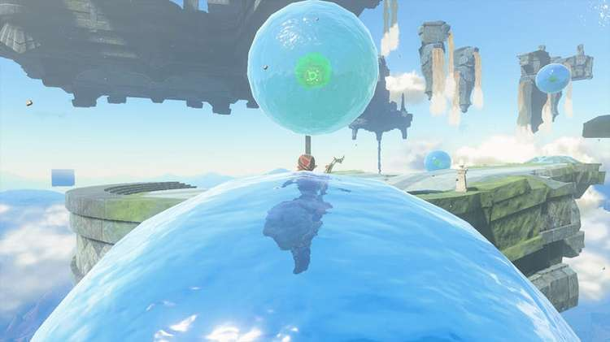

Let this bubble take you as high as it can, then glide over to another bubble machine and get in another one to travel across to the next section of the island, where Soldier Constructs will be waiting for you.

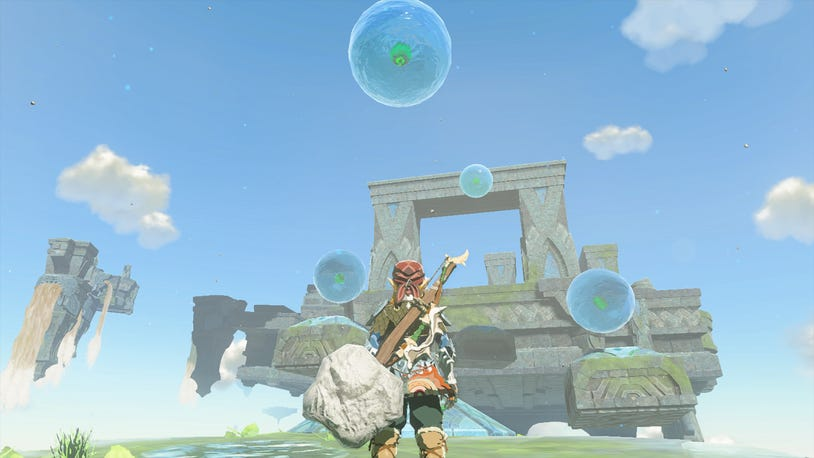

Head east up the stairs with the sludge, and into the pool of water. You'll then want to go north. You can use the hydrant to clear the sludge around the area or make use of any Splash Fruit you still have. You can also use the Hydrant to clear a path around the pool of water to reveal a broken staircase leading down to a Treasure Chest with an Old Map inside.

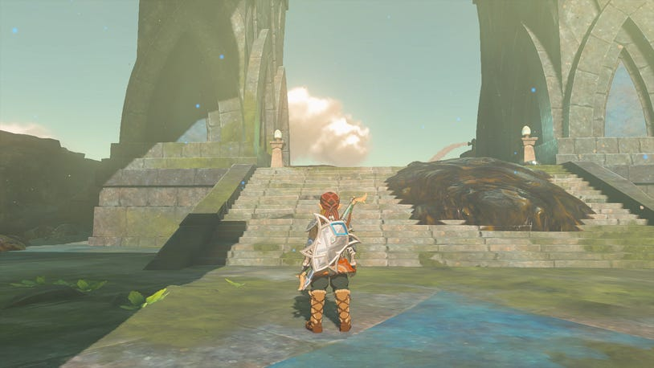

Climb the column on the left as you start to head north to find a treasure chest.

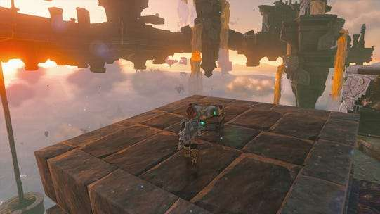

Treasure Chest: When you reach the sludge area. On top of a column on the left. It has a portable hydrant inside.

At the column with the glowing eyes, use a Splash Fruit or a hydrant to get the water running again and remove the sludge.

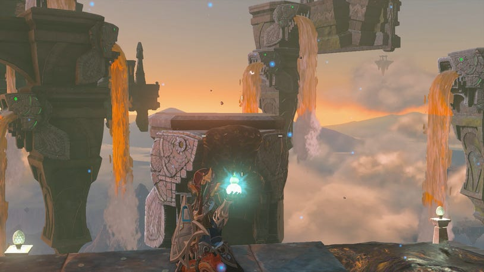

You'll now be able to swim up the waterfalls in this next section to get across. Glide towards each waterfall you want to travel to, then press Swim Up as you enter the water stream. This will boost you up in the sky, giving you height and allowing you to glide around and explore the islands thoroughly. The far north island leads to a treasure chest with 3 Hover Blocks inside.

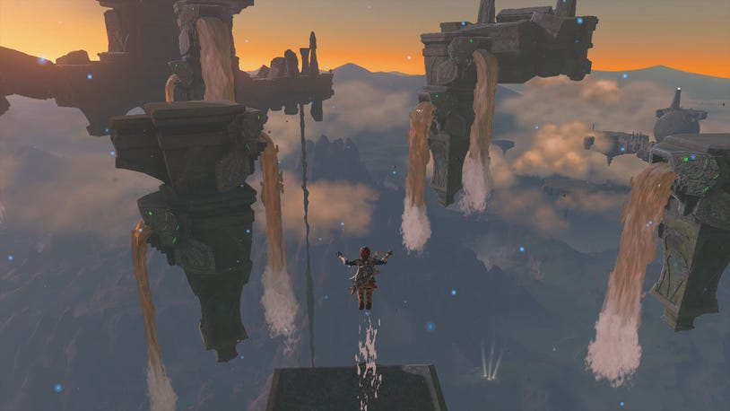

The direction you want to go in, for now, is to the northwest. Land at the Igoshon Shrine and activate it or complete it to use as a fast travel point.

Igoshon Shrine

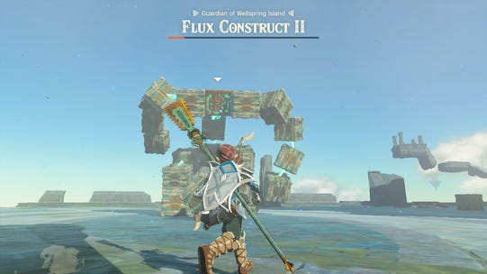

Head down the stairs west of the shrine to find a dispenser. Below here, there's a Flux Construct II you can fight at coordinates: 3383, 0607, 1290.

The first time you damage it, it will drop a treasure chest containing Tap to Reveal. There's also a chest in the northwest, up a small flight of stairs containing a Soldier III Spear. If you don't have anything stronger, this should make light work of the attacks.

Wellspring Island Sage's Will

After defeating the Flux Construct, you can explore around the lower area to find a long sludge trail leading to a chest with a Large Zonai Charge. You can also explore a longer path lined with more Construct Soldiers guarding a chest holding a leveled Captain Spear, and a floating island high above them with another chest holding a leveled Soldier Reaper weapon.

From the shrine, head west up the stairs. You'll come to a platform with a slope, wings, and a yellow beam to the left of the slope. Set a wing up so it's sitting on the slop, with the spring mechanism pressed against the tail of the wing.

When you hit the yellow beam, the spring will pull back and then shoot forward, sending the wing flying. Land on the next section and head up the stairs to face a Soldier Captain. Head for the waterfall in the south and climb it, then glide to one in the west. You want to use the series of waterfalls to climb up and round to the west.

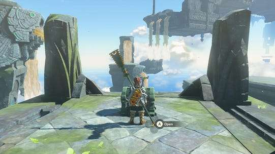

As you're climbing via the waterfalls, top at the pillar without one to find a treasure chest a the top. The coorindates are 3198, 0598, 1417, and inside is an Old Map.

When you've climbed most of the waterfalls, you'll be facing south and three waterfalls next to each other. As you ascend, you'll land in an area with three Soldier Constructs. Clear them out to unlock the nearby chest and get a leveled Soldier Blade.

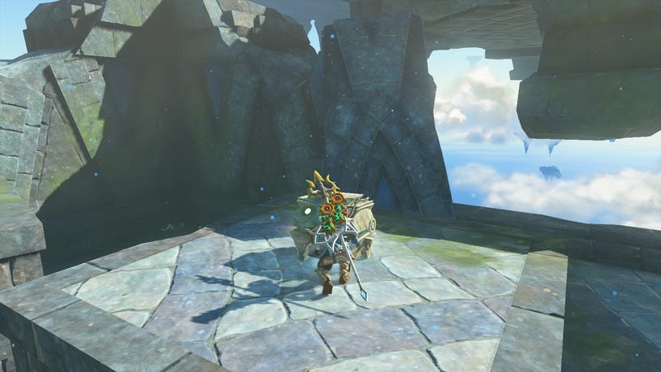

Climb up the platform behind this area, heading south. You'll come to another platform with bubbles again.

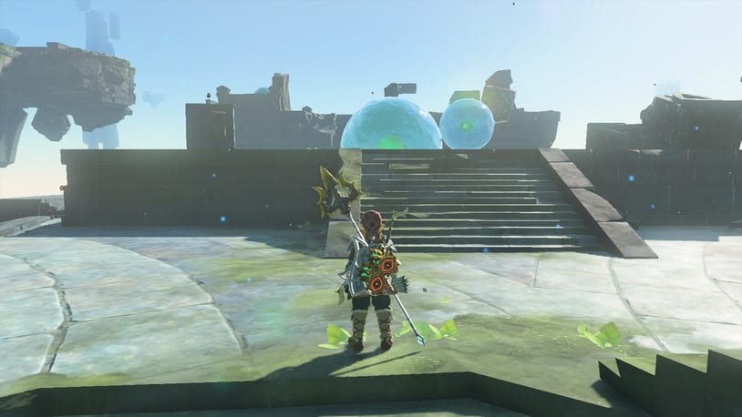

This time the bubbles will be coming towards you, so you Recall to send a bubble back and ride it to the other platform.

Go towards the running water and use Ultrahand and the debris around you to create a bridge across the water. Stand on this platform to use Ascension and go up to the floating platform above to find a treasure chest. This one has a leveled Captain Reaper inside.

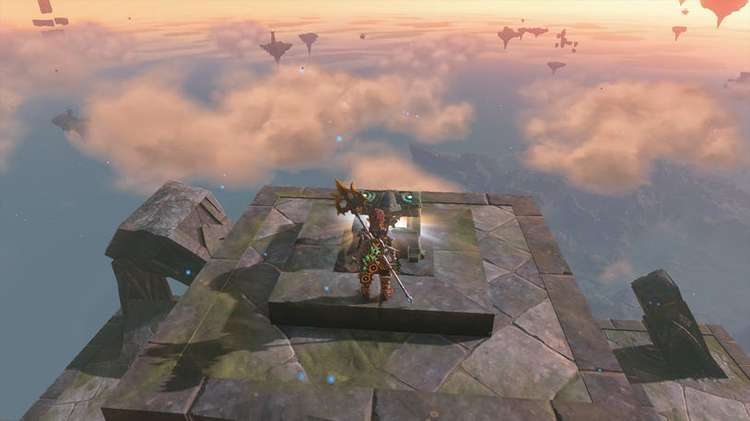

Now, if you head east you'll see a bubble and it will get stuck on the edge of the platform, unable to move anywhere. You need to build a ramp here, so the bubble can float up and out. This will allow you to ride it to the next section. Then just wait on the ramp, for the bubble to pick you up.

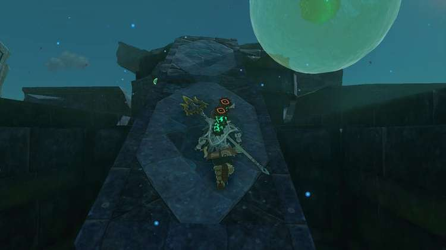

Fly over to the platform in the east. And immediately on your right, use a Splash Fruit to uncover the chest. Inside is an Opal.

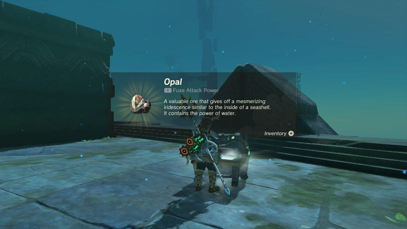

On this final platform, you'll find Zonai devices around you, and a ramp that leads up to the north and into one giant waterfall. Use the fans, wings, and cart to craft a device that will fly you over to the other side. Angle the fans slightly upward, to give you more power. Place the wings towards the end of the ramp, then hit the fans to start going forward.

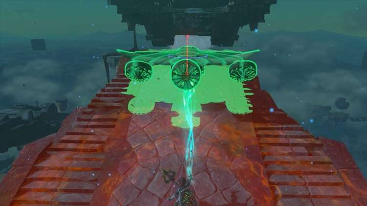

When you reach the other side, speak to Sidon. Go up the stairs and fight the Captain Construct with Sidon's help. After this battle, go into the giant waterfall and swim up. When you reach the top, it's time to tackle The Water Temple.
