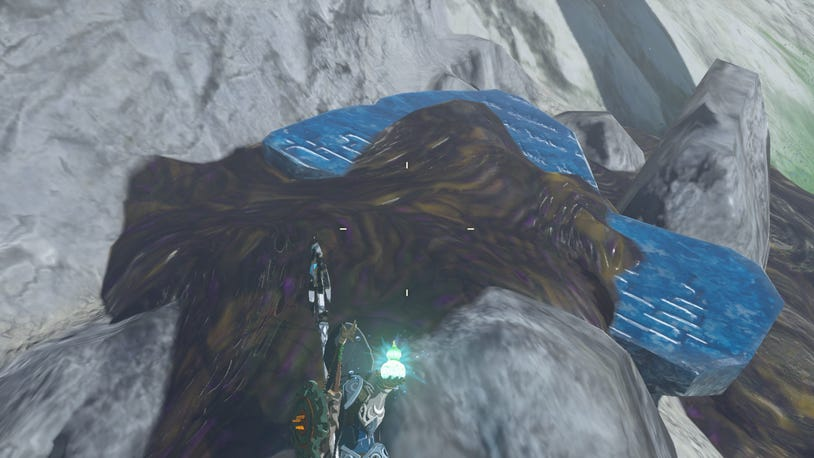
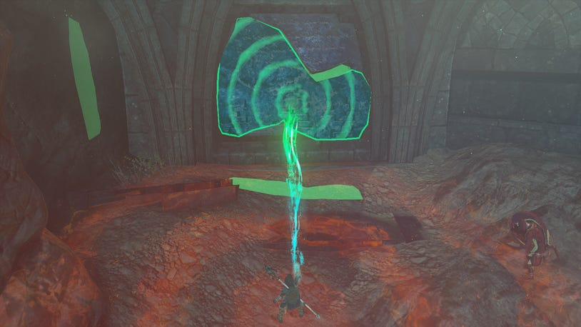
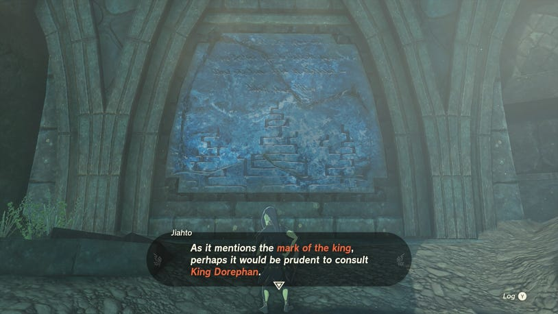

23. The Broken Slate

How to Start The Broken Slate

In order to start The Broken Slate, you'll need to have started Sidon of the Zora, and met Sidon at Mipha Court, which can be found at the top of Ploymous Mountain. Once you've had a conversation with Sidon, he suggests speaking to the historian Jiahto in Toto Lake, which is northwest of Mipha Court.

Go to the northwest edge of the mountain (behind the Ihen-A Shrine) and look out. You'll see a Skyview Tower and shrine off in the distance, but to the left, there will be a sludge waterfall flowing up to the sky.

This is exactly where Toto Lake is, so glide down and climb the short distance across the mountain until you reach the lake. Upon arrival, you might spot Dunma standing on top of a platform to the left. Speak to Dunma first, then Jiahto, who you want to speak to, can be found inside the cave.

Speaking to Jiahto, this will start The Broken Slate, which is an additional main quest that forms part of the Sidon of the Zora questline.

How to Complete The Broken Slate

Head just outside of the cave where you speak to Jiahto to find The Broken Slate he speaks of. As you head outside, turn left and look slightly up. Climb up the rocks to find The Broken Slate covered in sludge.

Use a Splash Fruit to free it, then use Ultrahand to pick it up and move it.

Take it into the cave then line it up with the broken slate on the wall to slot the fragment in.

As soon as you do Jiahto will react and say that he can finally read what the tablet says. When the tablet has been read aloud, Jiahto will say that it would be wise to consult King Dorephan on what it means.

This will wrap up The Broken Slate, but unlock The Clues to the Sky main quest.
