The Dragon's Tears (Geoglyph Locations)

Dragon's Tears are pools filled with memories hidden somewhere in mysterious formations called Geoglyphs, figures which bear great resemblance to the real-life Nazca Lines. They get introduced to you very early, not long after you locate Lookout Landing. Finding Dragon Tears and Geoglyphs in The Legend of Zelda: Tears of the Kingdoms is technically optional, but it's also part of the main quest walkthrough. Find every Dragon Tear inside every Geoglyph in Zelda: TotK with this geoglyphs map and locations guide. This guide has been tested by IGN and confirmed to work for all versions of TOTK, including the Tears of the Kingdom Switch 2 Edition released in 2025.

This Dragon Tears quest will appear after you have completed Impa and the Geoglyphs outside the New Serenne Stable in Hyrule Ridge. It is an overarching quest that you can complete over the course of the story, and is best completed as you explore Hyrule.

The Forgotten Temple

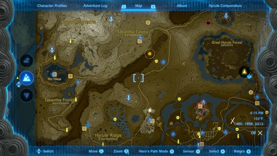

Your first step is to complete Impa and the Geoglyphs and then to go to The Forgotten Temple.Head here on the map, and look down into the canyon to find a large stone temple that you can enter by paragliding down. Check out the complete Forgotten Temple walkthrough here, or continue below to find all the Dragon's Tears.

Spoiler Warning

The video walkthrough below includes all the geoglyph locations, a walkthrough of the forgotten temple, and cutscenes that are massive spoilers. We recommend playing along with the video so you can uncover the tears at your own pace.

Geoglyphs Map - All Dragon Tear Locations in Tears of the Kingdom

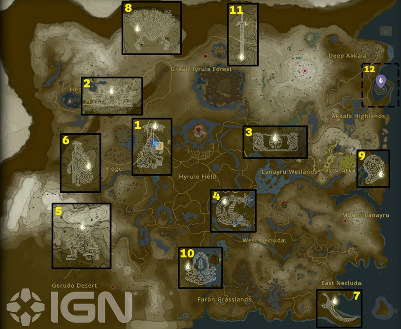

There are 11 Geoglyphs but 12 Dragon Tears. The map above references each geoglyph in order of the memories they reveal. You can add the Geoglyphs to your map once you've completed the Forgotten Temple as part of The Dragon's Tears quest.

Reference the map above, and/or the complete video walkthrough to find all the Geoglyphs and Dragon's Tears. Note the video also includes the memories you unlock by finding them. We recommend completing all of them after you have done most of the main story quests.

How to Spot the Dragon Tears

When above the Geoglyph, look for a spot in the design that is filled in rather than hollow. That marks where the Tear is!

Geoglyphs Order

Here is the list of Geoglyphs in the order you should visit them in Tears of the Kingdom. They're also numbered in order on the map above.

​​Rauru Geoglyph - Closest Tower: Lindor's Brow

​​Forgotten Temple Geoglyph - Closest Tower: Lindor's Brow

​​Purah Pad Geoglyph  - Closest Tower: Eldin Canyon

​​Fish Geoglyph - Closest Tower: Sahasra Slope

​​Ganondorph Geoglyph  - Closest Tower: Gerudo Highlands

​​Queen Geoglyph  - Closest Tower: Gerudo Highlands

​​Scimitar Geoglyph  - Closest Tower: Rabella Wetlands

​​Demon King Geoglyph - Closest Tower: Pikida Stonegrove

​​Sacred Stone Geoglyph - Closest Tower: Mount Lanayru

​​Memorial Stone Geoglyph  - Closest Tower: Popla Foothills

​​Master Sword Geoglyph  - Closest Tower: Typhlo Ruins

​​The Last Dragon Tear  - Closest Tower: Ulri Mountains

​​Dragon Tear 1 - Rauru Geoglyph

​​Dragon Tear 1 - Rauru Geoglyph

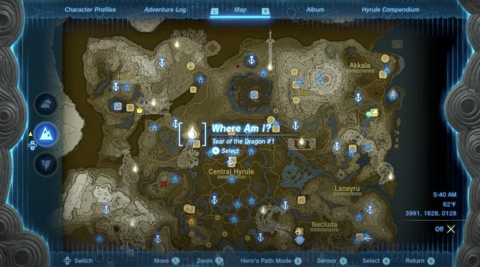

You'll find the first Dragon Tear when you start Impa and the Geoglyphs. Look for the suspicious puddle.

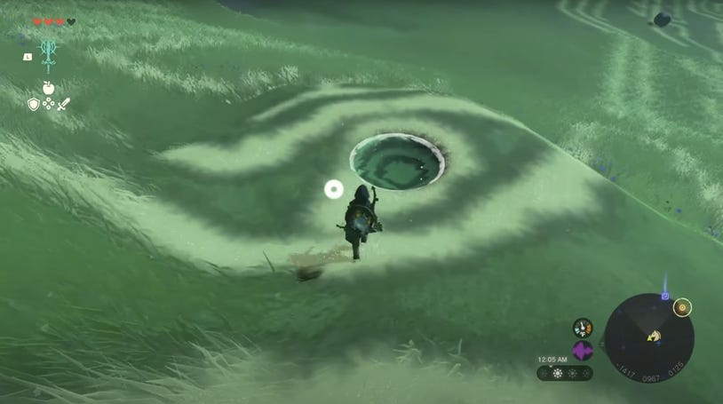

​​Dragon Tear 2 - Forgotten Temple Geoglyph

​​Dragon Tear 2 - Forgotten Temple Geoglyph

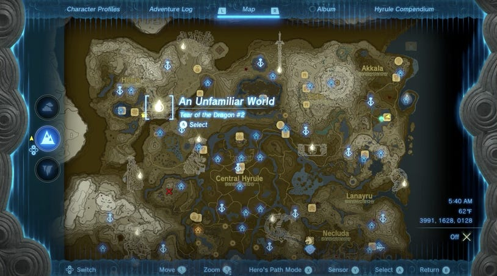

Find Tear of the Dragon #2 in the southwestern edge of the Tabantha Tundra.

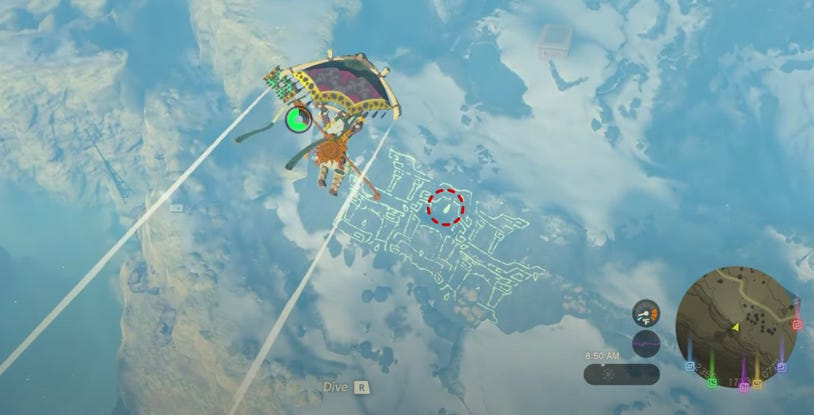

​​Dragon Tear 3 - Purah Pad Geoglyph

​​Dragon Tear 3 - Purah Pad Geoglyph

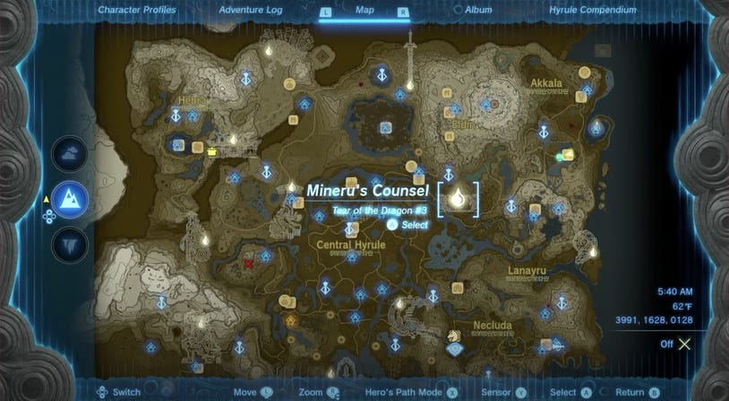

Find Tear of the Dragon #3 in the very western part of Lanayru Great Springs. Look in the center part of the Purah Pad Geoglyph.

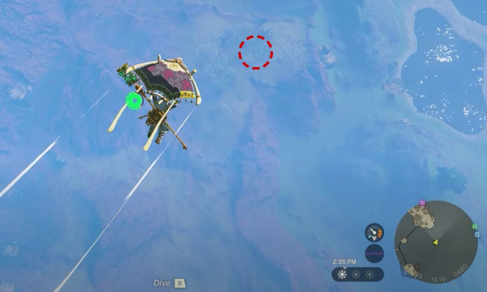

​​Dragon Tear 4 - Fish Geoglyph

​​Dragon Tear 4 - Fish Geoglyph

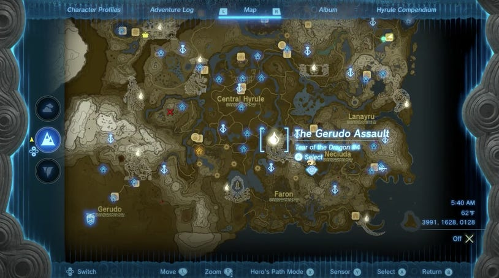

Find Tear of the Dragon #4 in the north part of Faron, bordering on Central Hyrule.

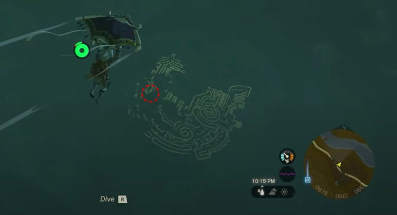

​​Dragon Tear 5 - Ganondorph Geoglyph

​​Dragon Tear 5 - Ganondorph Geoglyph

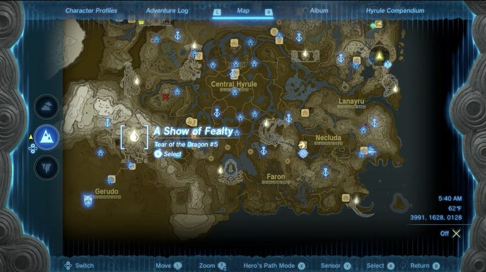

Find Tear of the Dragon #5 in Gerudo Highlands. The tear is in a tricky spot on a snowy ledge.

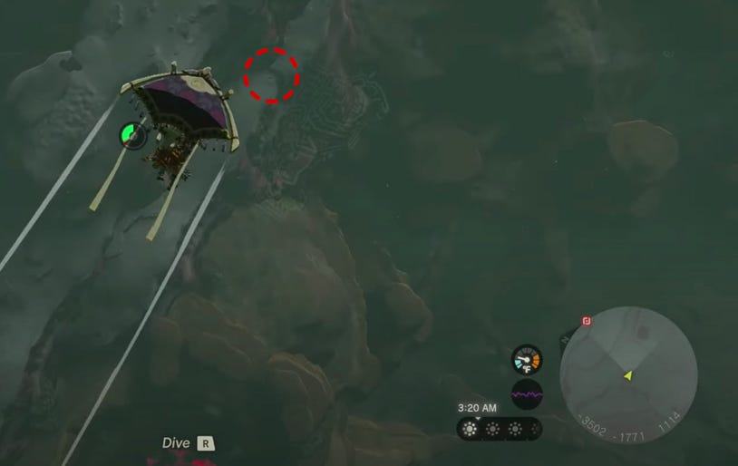

​​Dragon Tear 6 - Queen Geoglyph

​​Dragon Tear 6 - Queen Geoglyph

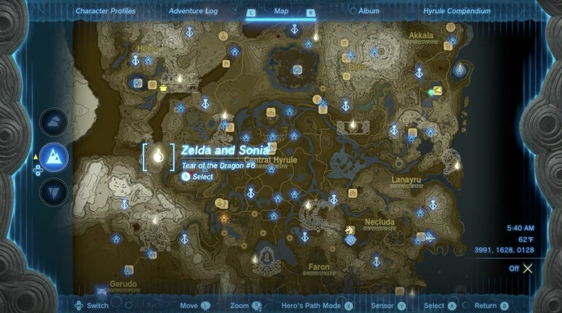

Find the Tear of the Dragon #6 on the southern part of Hyrule Ridge.

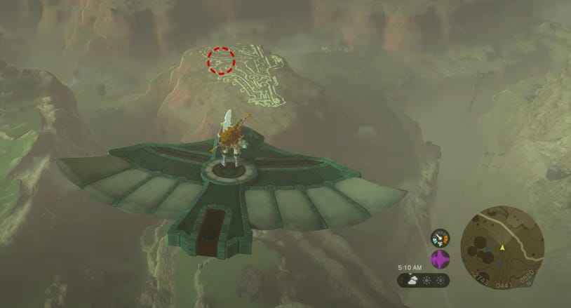

​​Dragon Tear 7 - Scimitar Geoglyph

​​Dragon Tear 7 - Scimitar Geoglyph

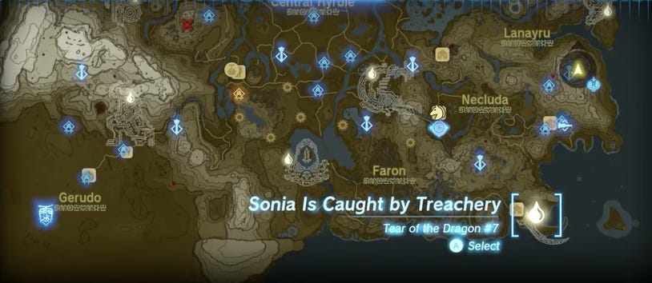

Find The Dragon Tear #7 in East Necluda on the oddly knife-shaped peninsula.

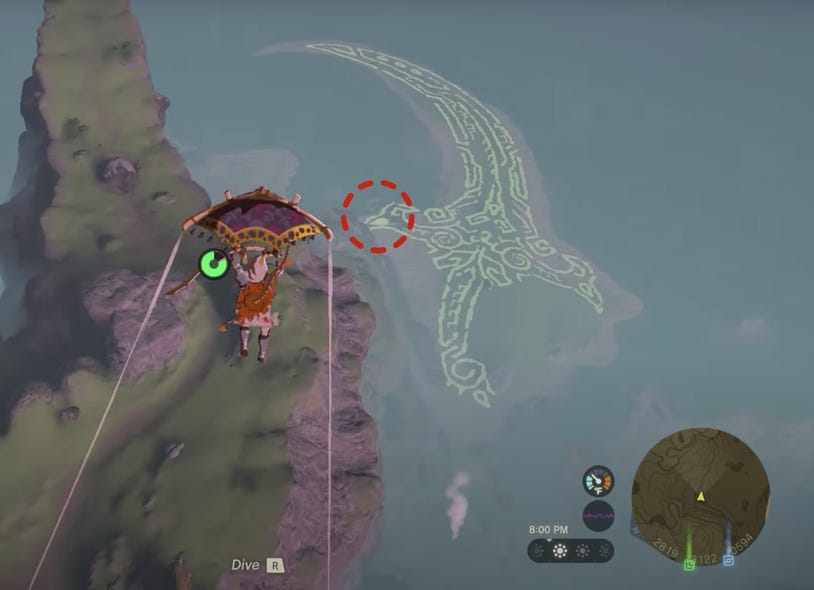

​​Dragon Tear 8 - Demon King Geoglyph

​​Dragon Tear 8 - Demon King Geoglyph

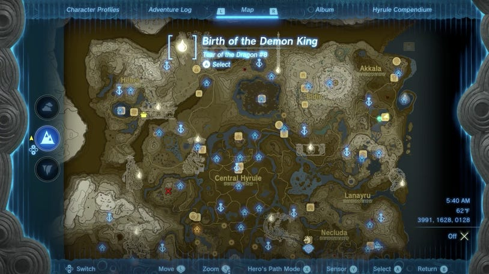

Tear of the Dragon #8 is difficult to see because the lines blend in with snow in the blizzard. The Geoglyph is in the North Tabantha Snowfield, part of the Tabantha Tundra.

The North Tabantha Snowfield Geoglyph coordinates are -1865, 3616, 0237.

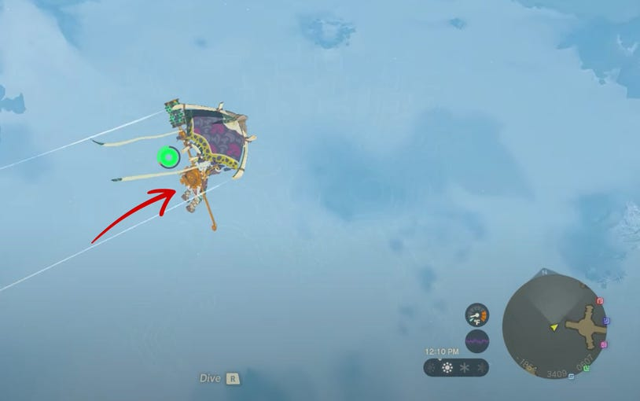

If paragliding in from the south, look to the left of the Geoglyph. The tear is on its "shoulder."

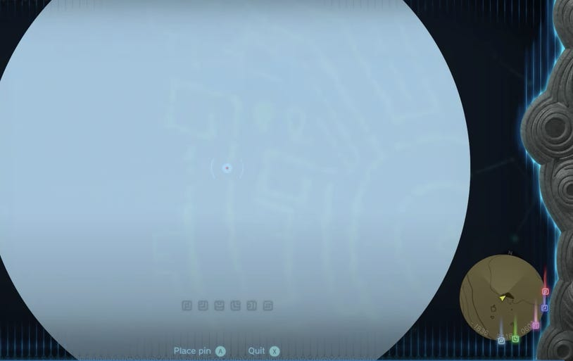

​​Dragon Tear 9 - Sacred Stone Geoglyph

​​Dragon Tear 9 - Sacred Stone Geoglyph

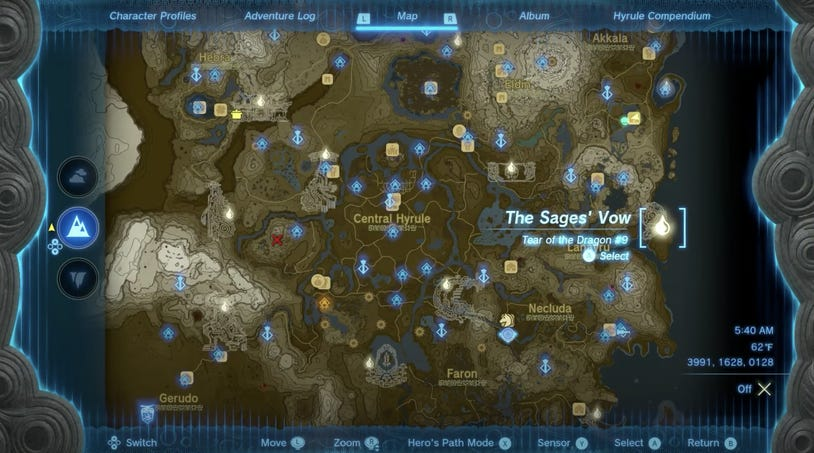

Find Tear of the Dragon #9 near the eastern shore of Lanayru Great Spring.

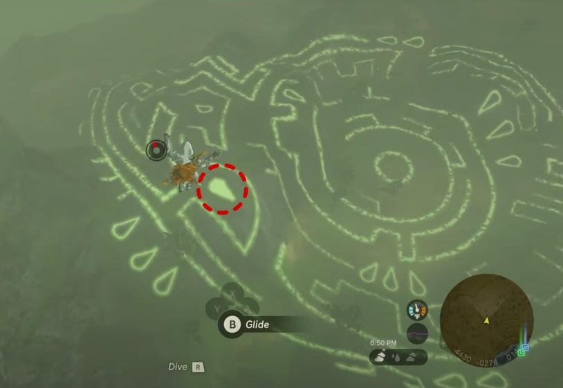

​​Dragon Tear 10 - Memorial Stone Geoglyph

​​Dragon Tear 10 - Memorial Stone Geoglyph

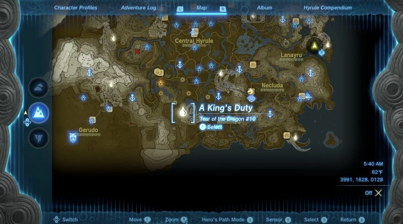

Find the Tear of the Dragon #10 in Faron.

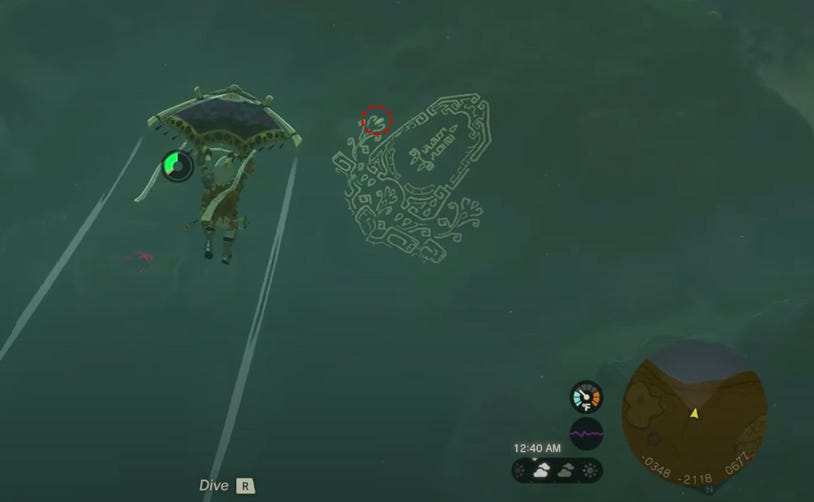

​​Dragon Tear 11 - Master Sword Geoglyph

​​Dragon Tear 11 - Master Sword Geoglyph

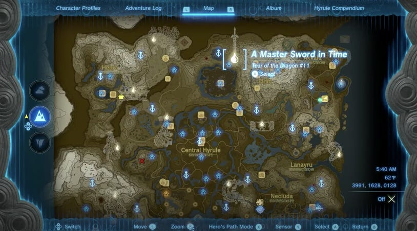

Find the Master Sword Geoglyph and Tear of the Dragon #11 between the Great Hyrule Forest and Eldin.

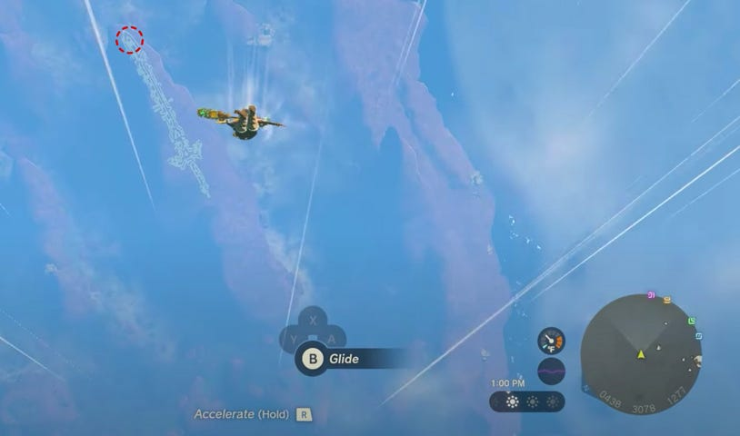

Dragon Tear 12 - The Last Dragon Tear

​​Dragon Tear 12 - The Last Dragon Tear

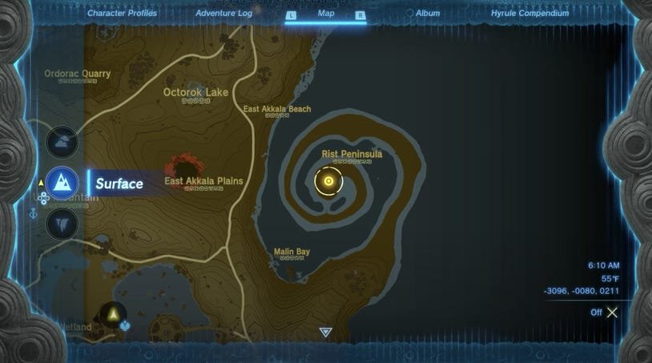

This final Dragon Tear is marked on your map, and will only appear after you have found all eleven before it.

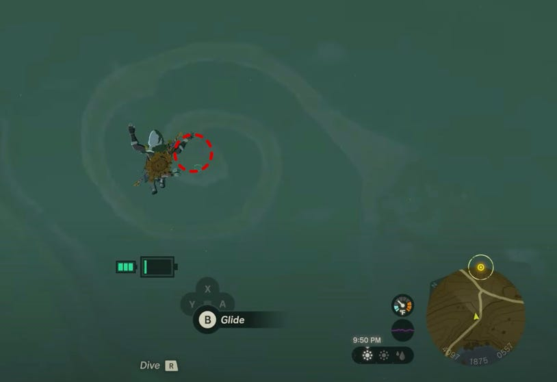

Witnessing the 12th Tear of the Dragon memory will lower the Light Dragon's flying height from around 1500-2200 meters to 700-800 meters, making it easier to use the Skyview Towers to glide above the dragon. Finishing this quest line will clue you in on the status of the Master Sword.
