18. The Fire Temple

The Fire Temple is a large, featured dungeon in Tears of the Kingdom. A blazing and complex structure, the Fire Temple is located in the Depths below volcano on Death Mountain. Making it through this subterranian dungeon can prove frustrating with its series of mining cart puzzles and distinct dangers. In this page of IGN’s Walkthrough for the Legend of Zelda: Tears of the Kingdom, we'll go over all the information needed to complete The Fire Temple, including treasure locations, blazing boss battle details, and perhaps most importantly, how to solve the series of mine cart mazes without your blood boiling. This guide has been tested by IGN and confirmed to work for all versions of TOTK, including the Tears of the Kingdom Switch 2 Edition released in 2025.

Before getting to The Fire Temple, you'll need to have completed Yunobo of Goron City.

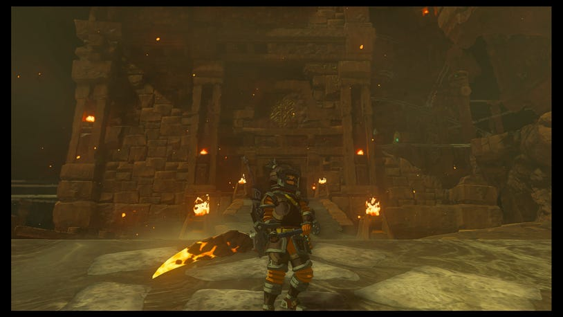

Temples act as Dungeons in Tears of the Kingdom, and although they can be completed in any order, it's recommended to complete the Fire Temple second. They are all parts of the Regional Phenomena series of main quests.

Note that while you're deep in the lava-filled part of the Depths, you'll only need one rank of Flame Guard (either from a single piece of Flamebreaker Armor or a fire-proof elixir) to move comfortably about this temple.

The Fire Temple - ToTK

After trudging across the depths and destroying any boulder that stands between you and your path, Link and Yunobo will arrive at the base of the Fire Temple. Speak to Yunobo before heading in for a cutscene to begin, then use his crushing power to smash the boulder and gain entrance.

Pass through the corridor and into the center of the temple, and note a small alcove on the right holds a Zonai Chest that likely contains some Arrows inside. At the other end of the corridor you'll find a grate and the fast travel gate. Once the cutscene has played out, interact with the Zonai device to see five bolts attached to the gates.

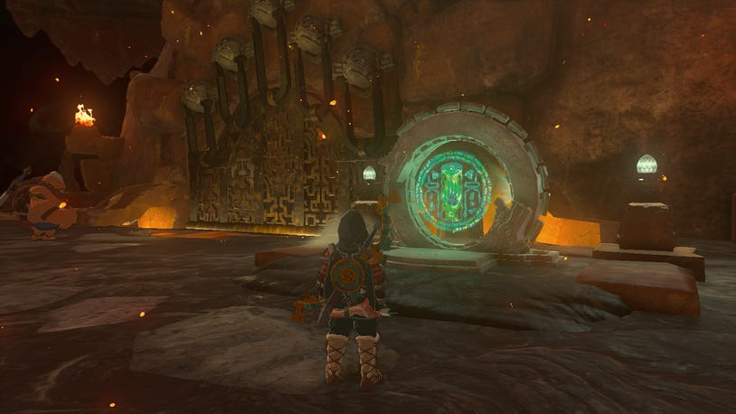

There are five locks for you to find and although there are five levels of the fire temple, you'll find locks across just four of them.

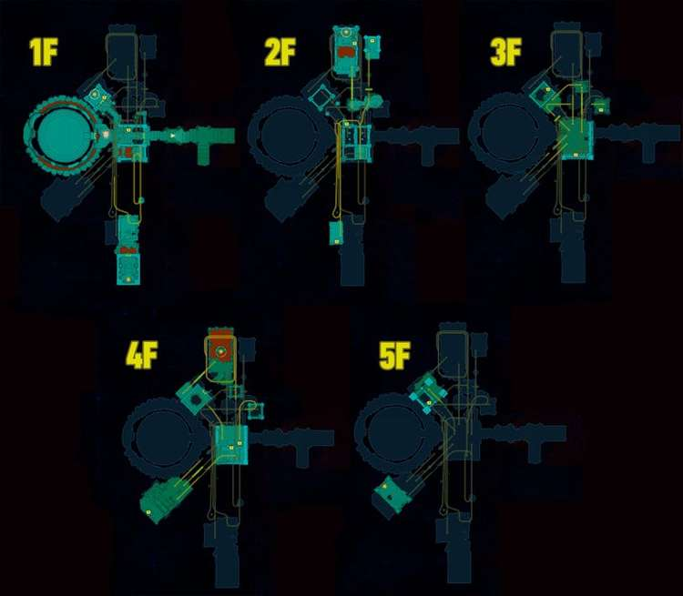

A map of the Fire Temple will flash up, showing the five locks across three different levels. You can find the locks in the following locations:

1F Lock Northwest

1F Lock South

2F Lock

4F Lock

5F Lock

Below you can find an explanation of how to release each lock, in the order we'd recommend for ease.

Defense Systems and Maneuvering Around the Fire Temple

You'll be using mine carts and tracks to get around each of the levels of the Fire Temple, relying on switching mechanisms and signals to change directions and manipulate tracks.

Alongside this, lava acts as the biggest obstacle to crossing over into some sections of the temple. Portable hydrants are dotted around the map and can be poured into the lava to create stone platforms. You can use these to create paths, bridges, or stepping stones to give you safe passage.

In terms of defense, you'll also find a number of Soldier Constructs and Captains patrolling the temple. Some will ride mine carts alongside you, so be mindful of this as you hop in.

1F Lock South

1F Lock South

Head back down the stairs and go right (south). You'll see a Soldier Construct II here guarding the area. Take this out, and then see how the hydrants are creating platforms for you to safely cross the first portion of this lava river.

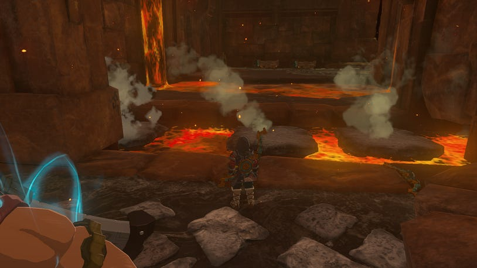

The is one running and a couple of others nearby. Use any of these to create a pathway for yourself to safely cross the larger section of the lava river and reach the other side.

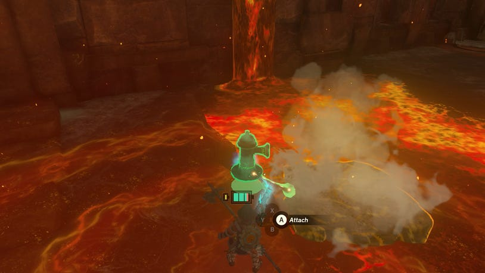

When you get over there, you'll see tracks and a mine cart. Place the mine cart on the tracks, then hit the fan to start moving. If you just stick to the track the cart is running on, you'll go around in circles, so use Yunobo to target the circular switching device. This will allow you to continue going south.

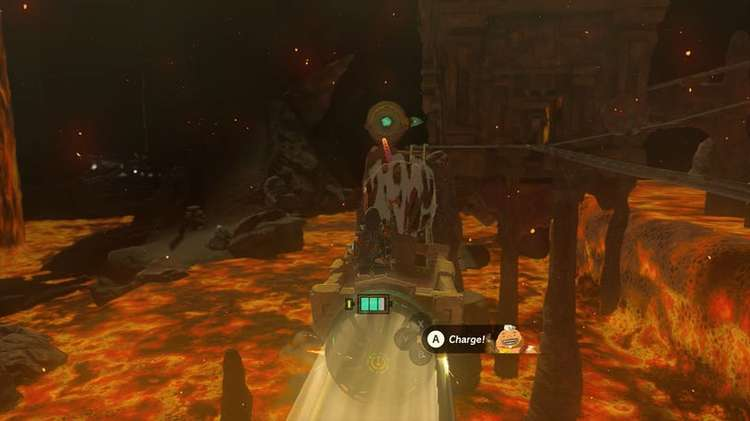

The cart will come to a halt as it hits a barrier. You can lift this by hitting the yellow beam next to it but don't get back on the cart just yet, because we want to go get our first lock and some treasures.

As you jump off the cart, you might notice the carts in the corner of this room, with the running hydrant above them. Keep this in mind for the next section, as we'll need those in a minute. But first, go around the back of the broken wall, where a pillar lays diagonally and you'll see a Fire Like hanging off another pillar. Use ice attacks to make quick work of it and be rewarded with a chest and Fire Like Stone.

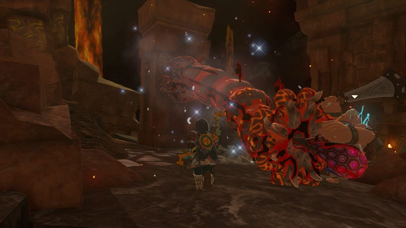

Now go back to the carts and the running hydrant and pick up one of the hydrants. Take this down to where you just were with the Fire Like and keep going south until you see the lava river and a boulder at the edge of what looks like a broken platform. Use the hydrant to create stepping stones in the lava, then use Ultrahand to attach them together and form a bridge across to the boulder.

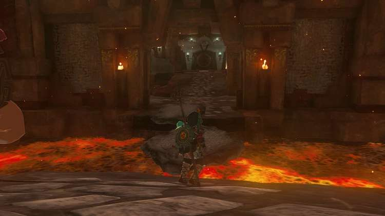

This will allow Yunobo to spin across it and shatter the boulder, giving you entrance to the room with the first lock. As you enter the room, be sure to stop off to the right and pick up some portable hydrants, which prove incredibly useful in this dungeon.

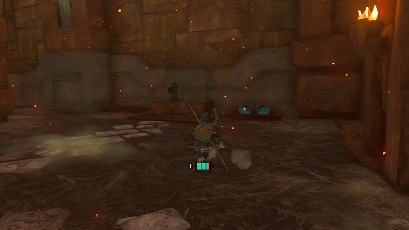

Arriving at your first lock, you'll want to get Yunobo over and use his charge ability to sound the gong. This you'll need to repeat for all five of the locks once you find them.

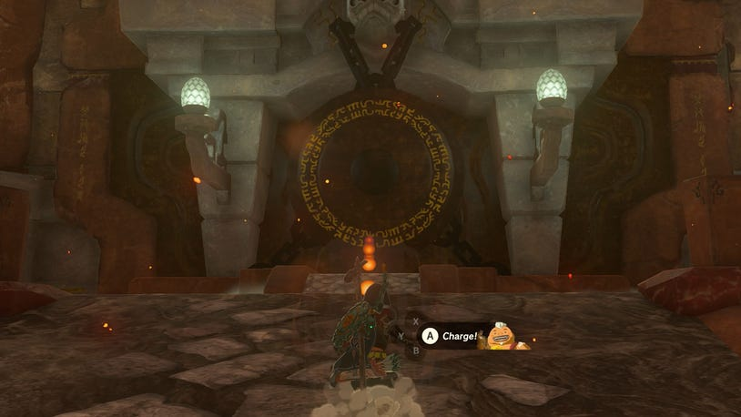

Leave this part of the temple and head back the way you came. Stop as you reach the pillar where you defeated the Fire Like, and climb up the wall opposite (east) from where it was.

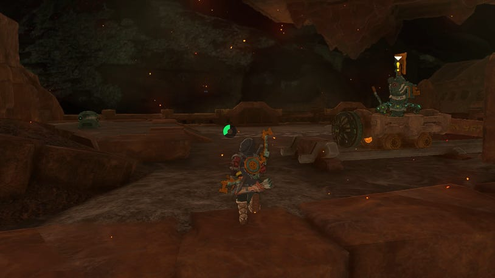

Here you'll find a chest with a Diamond in it, and two Solder Constructs to take out.

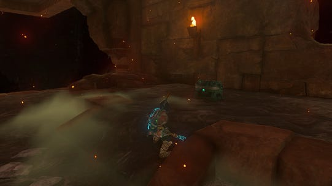

Treasure Chest 1F: After climbing the eastern wall near the 1F lock north you'll find a Diamond.

Now hop back down and return to the raised beam and cart you used earlier, it's time to go onwards.

Ride the cart again and get ready to immediately smash a boulder out of your way. When you reach the next turn where the cart will go round the corner, stop it because there's a chest here on the broken ledge. You can jump off the cart and reach it where you'll get 10x Arrows.

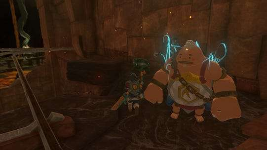

Treasure Chest 2F: 10x Arrows on a broken ledge

When you've got them, get back on the cart to ride it around to the next room. As it hits the barrier, you'll want to hit the pillar with the circular hole in it to spin the cart around.

Note: you'll see lots of these pillars with a circular hole in the middle around the dungeon and hitting them will either spin carts around or raise barriers, so watch out for them.

Now send the cart off again and get ready to send Yunobo towards the switching mechanism, so you can go to the right instead of the left. Pretty quickly, you'll come to a stop as you hit another barrier, and find little fire pebblets emerge from the platform on the right.

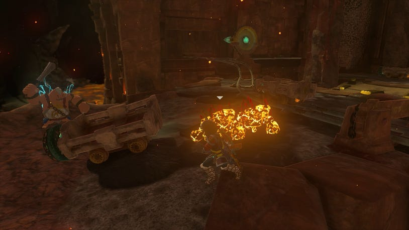

Hit the pillar next to the barrier to raise this, then go off towards the north on the same track you rode in on. This will take you all the way to a room with a Soldier Construct and another treasure chest.

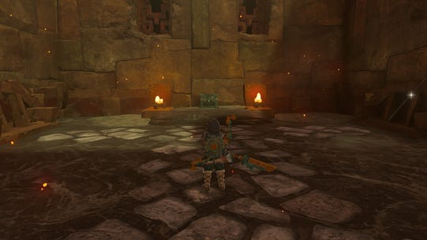

Treasure Chest: 2F. You'll get 10x Arrows again.

Spin the cart around and ride back to the ledges where you just fought the fire pebblets and hop off the cart. Cross the bridge (which would've been on your left initially, but is now on your right) and get a cart to ride this track across to the north. Don't hit the pillar next to this one for now, as going straight across this track will be where you'll find your second lock.

2F Lock

2F Lock

As you come to a stop on the cart, you'll see another room filled with lava. Over to the far left, there's a boulder blocking the way and a hydrant creating safe stones you can cross. On the right side of the room, there's a hydrant you can use to form a path towards the boulder.

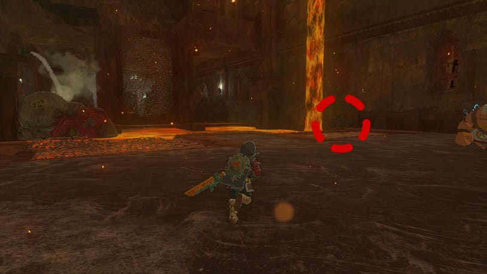

Send Yunobo through it to break it down, then let the hydrant flow freely. This will give you enough stepping stones to make it safely to the north of the room and the second lock. You can also use Recall on one as it reaches you, to ride it all the way to the other side of them.

That's not all you can do in this room, as there are also some treasures to be found. If you face south from the lock and look up, you'll see broken platforms on either side. Use Ascend to get up to them. On the right, you'll find a fan and hydrant, while the broken platform on the left has a chest with 3x Zonaite.

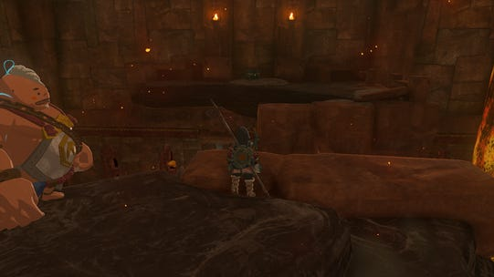

Treasure Chest: use Ascension to reach the broken platform above the 2F lock.

Getting to 3F

Now it's time to climb up to 3F, and to do this, we'll need to use the pillars that are capable of switching the tracks. Head back to the cart you rode to reach the second lock, and look back at the track. The pillar you didn't hit earlier, now needs to be hit.

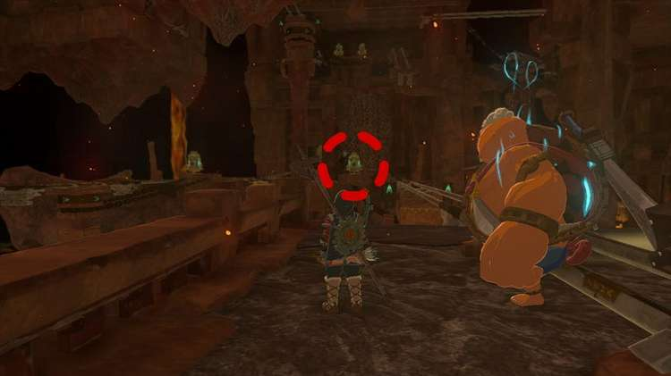

This will raise the track, so you can now travel up to the next level.

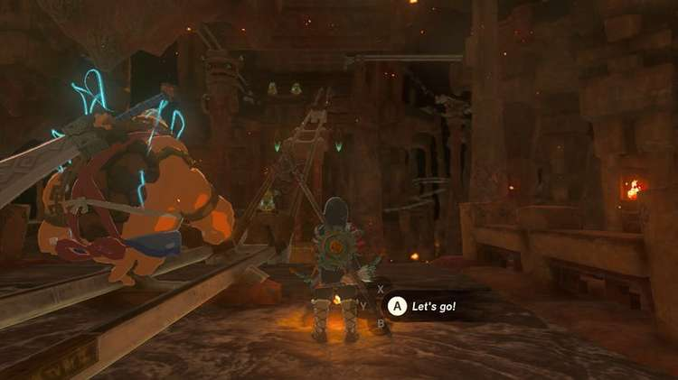

You'll reach a room that branches off in lots of different directions, has a circular grate in the middle and a yellow beam on the left. There is a single track that goes off to the north, a single track that goes northwest and two tracks that run side by side in the southwest.

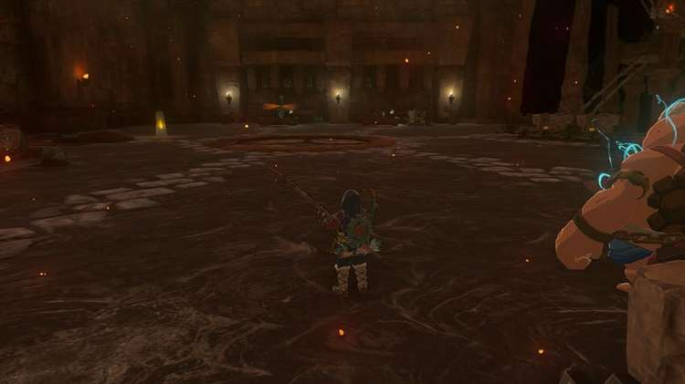

Hit the beam to turn it green and create an elevator for you. Over in the back of the room, there's a Captain Construct II over by a chest and lots of items. Go over to the Captain Construct first and clear the area.

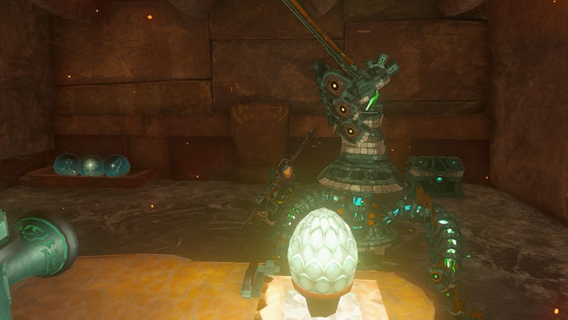

Then pick up the Zonai devices, which include a rocket and hydrant then unlock the chest to find Arrow x10.

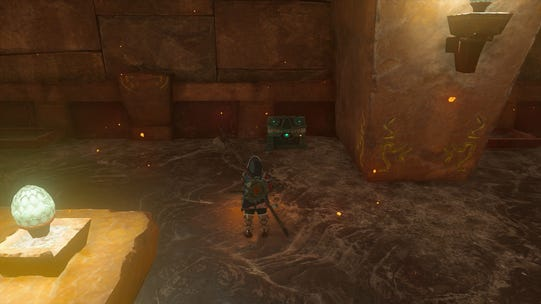

Treasure Chest: 3F behind the Construct Captain in the main hub.

5F Lock

5F Lock

The first track we want to ride is the one in the southwest. But both tracks have gaps in them, so if you try to ride a cart you'll just end up swimming in the lava. The one you want to take is the one on the right.

Two carts sit in the middle of the tracks without fans, but there's another off to the left that has a fan attached. Don't forget that behind that Captain Construct there are plenty of Zonai devices, so you can add fans to the two carts without them.

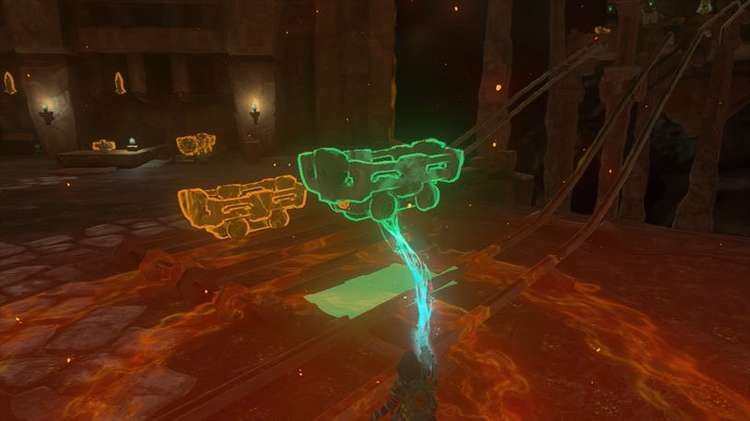

But we'll also need to use some of the rockets to make the jump across this broken part of the track. Strap rockets onto a cart, and launch yourself across the gap. As you start to hurtle towards 4F, get ready for the Soldier Construct that awaits you at the top.

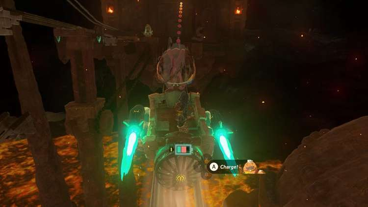

Head southwest to find a broken bridge leading up to a room. Use Ultrahand to attach the pieces of the bridge back together and then climb up it.

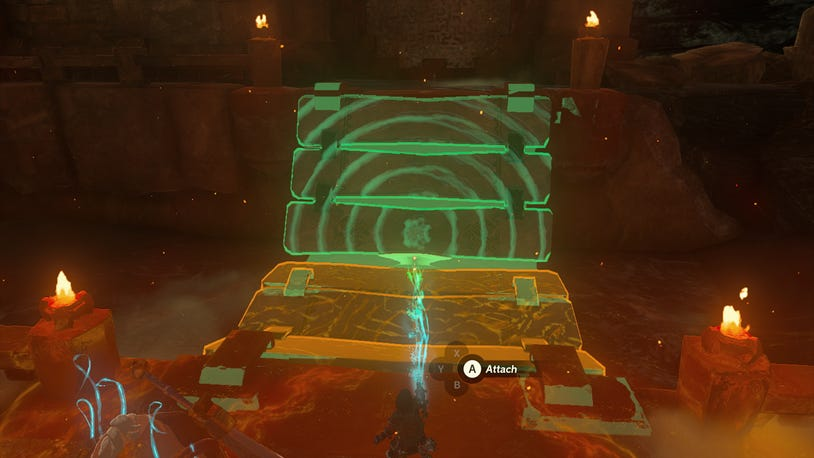

Look up and you'll see a boulder that can be broken by Yunobo, so use the newly formed bridge to charge Yunobo up and into the ceiling.

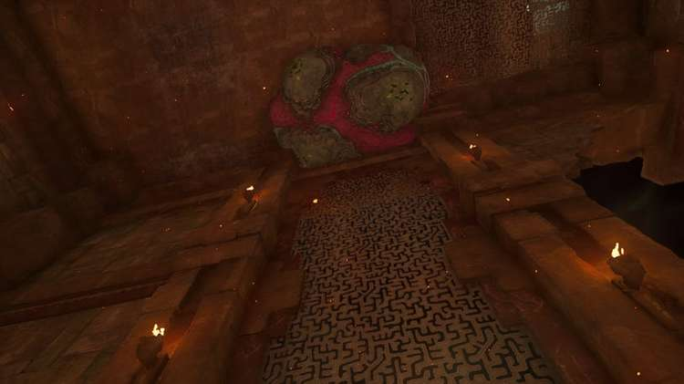

A cube will fall down, landing at the top of the bridge. Use Recall and travel up it to reach the platform above.

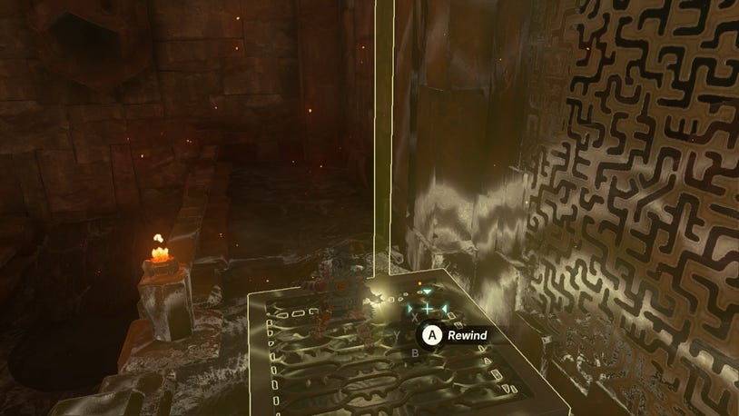

This will take you to 5F and the room with the gong. Sound it, then drop back down through the gap.

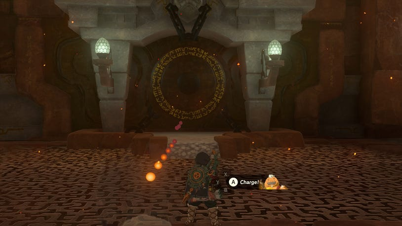

Face away from the bridge, and back towards the locked door (and now cube). Go right, and through the rubble to get behind the locked door and find another chest.

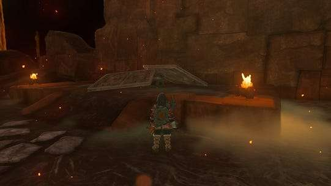

Treasure Chest: 4F. After repairing the broken bridge, go behind the locked door to find the chest underneath some rubble. Use Ultrahand to lift the rubble off and find Arrow x10.

After unlocking the chest, head northeast and back to where you originally came up to 4F. Climb up the broken bridge on the right, and you'll see another broken track. Below are mine carts and hooks.

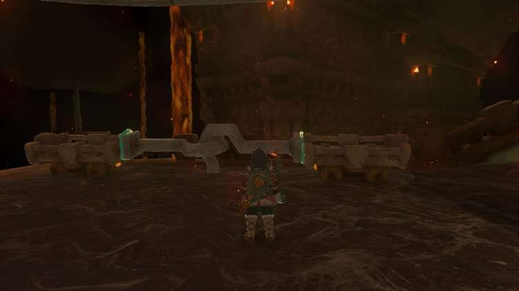

Use a hook and attach it to the top of the mine cart with a fan. Use this to ride the right side of this broken track and go up to another level. When you come to a stop, go to the left of this room to find another treasure chest.

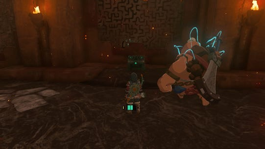

Treasure Chest: 4F. Ride the broken rail using a mine cart and hook to reach another part of 4F. Inside the treasure chest is a Ruby.

Take the hooked cart back down and then hit the glowing signal device on this platform. This will raise the barrier and connect the right side of the tracks to take you back down to 3F.

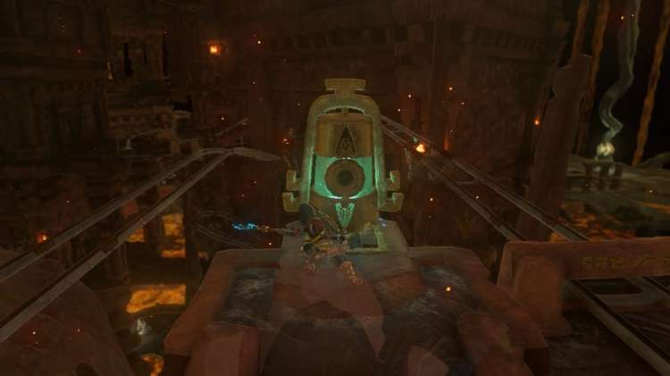

Now hop in the cart that's facing north and ride that straight over to the other side.

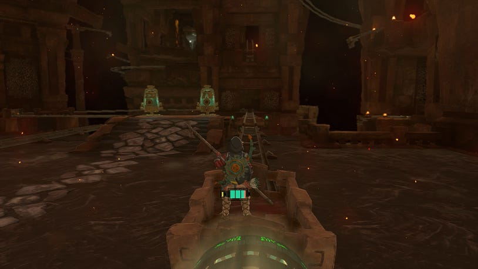

When it comes to a stop, climb out of the cart and turn around. You want to hit the pillar on the left, to raise the track you just rode.

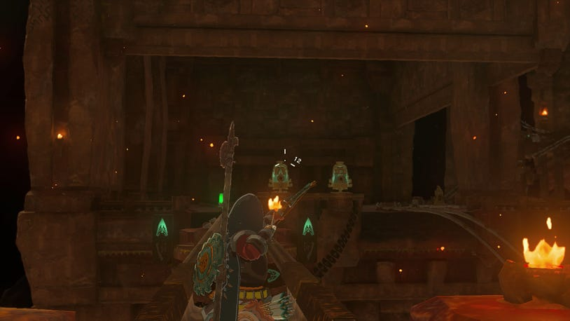

Now grab another cart and attach it to the next piece of track that heads back towards the main hub, then ride this round to the platform with the breakable rock. Use Yunobo to break the rocks and reveal a pillar you can hit to make alterations to the track.

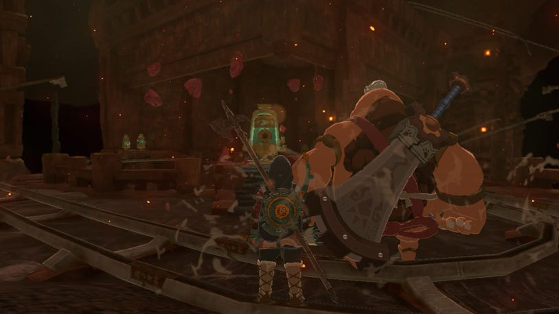

For now, ride back over to the centre and head back to the start of the track you just raised (so you will have done a loop at this point). Hit the pillar on the left again (not the one you hit earlier) and this will spin the track around.

Ride back over to the platform with the breakable rocks and you'll now be able to travel up the track you just raised and spun. This will take you to 4F, where you'll stop opposite a chest (which has Arrow x 10 inside) and a Soldier Construct.

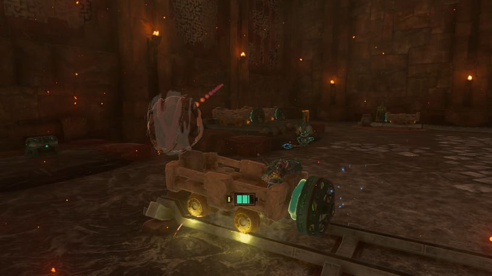

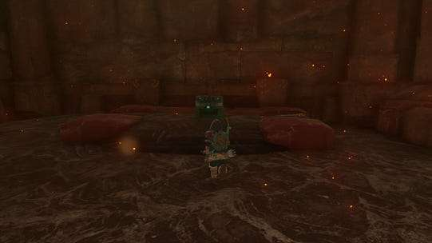

Treasure Chest: 4F. After riding the platform.

Ride back down to 3F and return to the two devices that are next to each other. Hit the one on the left again, so the track stays raised but spins to connect to an alternative track.

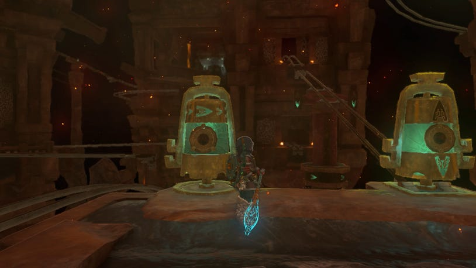

As you enter into 4F, you'll start to loop round and round, with Soldier Constructs in a cart alongside you. Wait until you do almost a full loop then start to slow the cart down and jump off at the ramp.

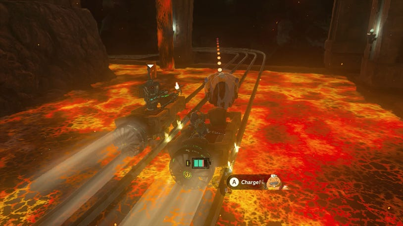

4F Lock

4F Lock

As you walk up the ramp, you'll see a rock on the right above a stone ramp. Use Yunobo to smash this and let the hydrant pour freely.

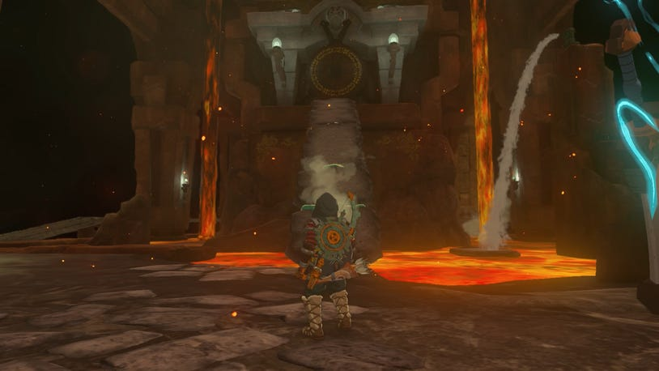

You can use then use the platforms the hydrant is creating, to attach each piece to the long concrete ramp already there and make a bridge. The aim is to make a bridge straight up to the rock and the gong in the centre of the room.

If you want to speed up the process there's a second hydrant you can use that sits just underneath the flowing one, on the pillar.

Use Yunobo and send him straight up the ramp to hit the gong. Now there's just one more left to get!

1F Lock Northwest

1F Lock Northwest

Go south (directly opposite the fourth gong) and walk up the small ramp. When you reach the edge, you'll see that this is broken and there's a boulder that can be smashed on the opposite wall.

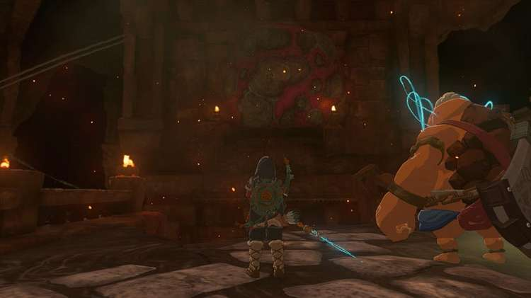

Go back and get the ramp you just used for the fourth gong and add to it to create a bridge up to the boulder. Launch Yunobo into the boulder to smash it.

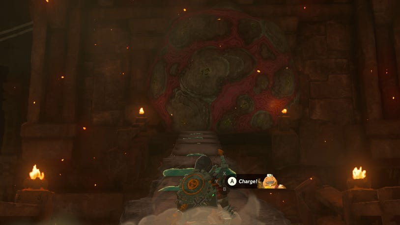

As you enter the next room, look down into the hole below. There is a chest to catch along the way, so go around to the southwest side of the hole, turn around and look down (facing northeast). Glide down to this chest to get it.

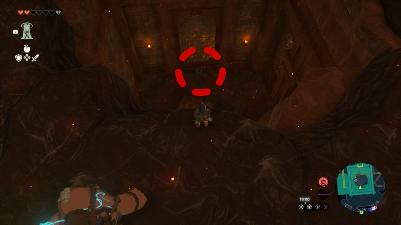

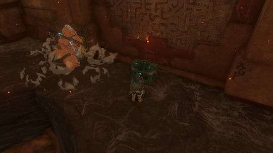

Treasure Chest: 3F. As you drop down in the hole to the final gong, land on the first broken ledge in the northeast to get the chest. This one has a Soldier II Repear (20) inside.

Now glide down to the bottom, where you'll find the fifth and final gong. Hit this, then turn around. Attack the yellow beam to turn it green and open the door, then go over to the chest on the left.

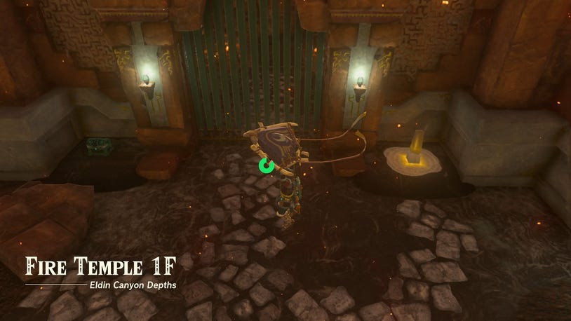

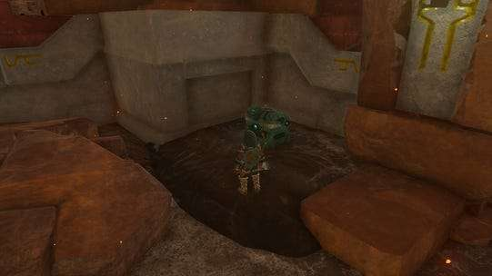

Treasure Chest: 1F. Inside the room with the final gong. Inside is a Strong Zonaite Longsword (10).

With all the gongs hit and the locks broken, it's time to interact with the fast travel portal to see what's on the other side.

After Releasing the 5 Locks

Go back to the portal and examine it, which will result in the locked door finally opening. Go inside and look up at the ceiling to see a big red boulder that needs to be smashed. Send Yunobo spinning up the side of the curved room for him to roll straight up into the ceiling and smash the rock.

It's only then that the monster will reveal itself to be Tap to Reveal.

In an effort to keep this guide as spoiler-free as possible, this is your warning that the next part of this guide will feature a walkthrough on the boss battle for the Fire Temple.

If you'd prefer to avoid spoilers, now is your chance to click away! However, if you are here for tips on beating this boss, then keep reading!

How to Beat the Fire Temple Boss

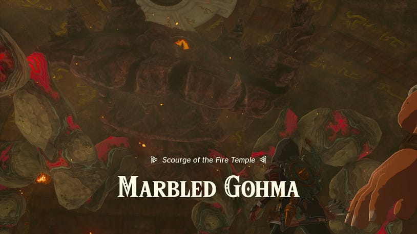

Defeating the Scourge of the Fire Temple, Marbled Gohma means making the most of Yunobo's ability. Marbled Gohma's legs are made of the same big red boulders we've been smashing through with Yunobo, so for the first part of this boss battle you should focus on repeatedly hitting its legs.

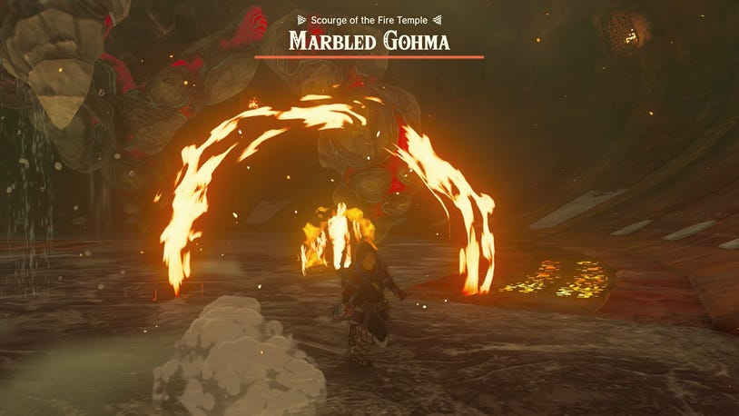

Each time you take away two legs, Marbled Gohma will collapse leaving its eye weak for you to attack. While you're waiting to charge up Yunobo's attack, you'll need to be mindful of the exploding variations of these boulders that Gohma will throw out. It will send out three at a time, and if you stay near the ramp where you entered the boss arena, you'll have plenty of space so when they explode they won't touch you.

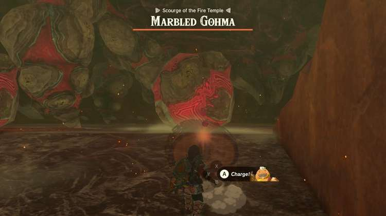

This saves you from using up Yunobo's ability to destroy each rock, and more time to focus on taking down the legs. Watch out for it using its legs like pincers and slamming them down on you, as well. You'll know this is about to happen as it lifts its leg and it begins to vibrate.

As soon as Marbled Gohma hits the ground, run up to hit its vulnerable eye and attack. With a quick weapon, you can land around 10 hits safely, before you should jump off and avoid any damage.

When Marbled Gohma starts to get up and shake, that's when it's time to leap off!

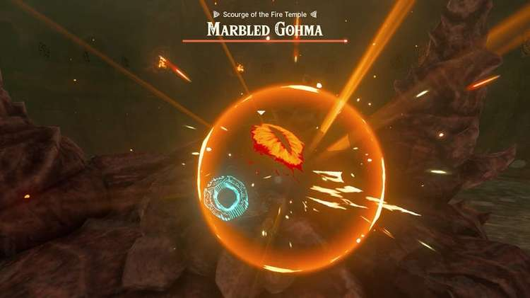

Repeat this during the first phase. When you get it down to half health that's when the situation changes. Marbled Gohma will leap into the air and begin to hang from the ceiling instead. There'll be no more of the three exploding boulders, but this time, Gohma will throw out an entire ring of exploding boulders that will trap you. If you can't escape them in time, you'll need Yunobo to get you out safely.

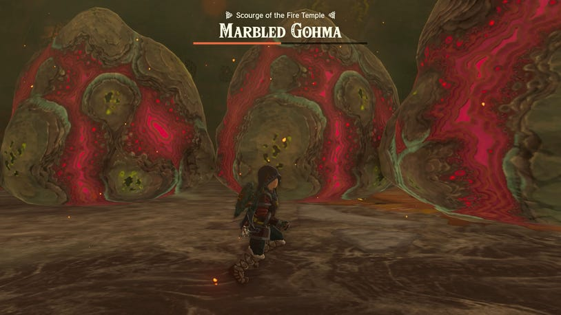

You still need to aim for Marbled Gohma's legs, but you'll only need to hit them once. The best way to do this is to take advantage of the curved walls in the room. We found the easiest way to make sure you hit a leg, is to step back so you have Marbled Gohma in your sights, and aim Yunobo to the part of the wall that lines up with the leg.

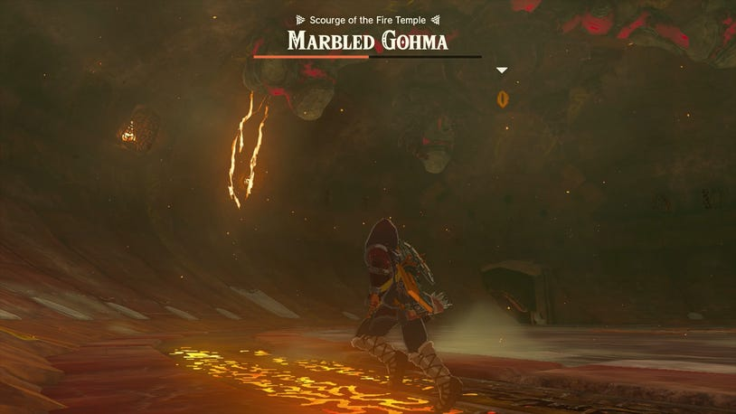

Don't stand close to the wall with Marbled Gohma out of your sight, as you're likely to get trapped in one of the rings of exploding boulders. Yunobo will have enough charge in his power to be able to make it all the way around the room, so take a chance when it stops moving, to send him zooming up the wall and into one of the legs.

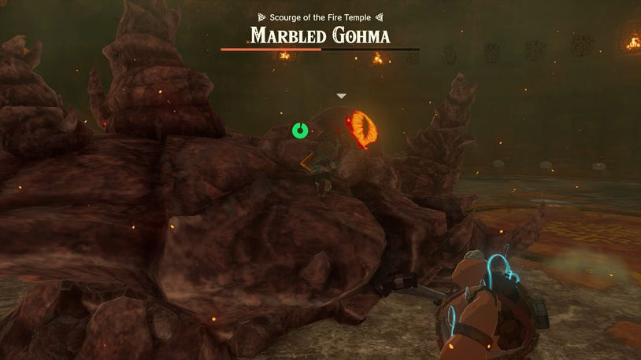

The same things will happen each time you hit a leg once, with Marbled Gohma dropping down and leaving the eye vulnerable to attack. Run over whenever it drops to climb its body and begin hitting the eye. Repeat this again during the second phase until you've managed to eliminate Marbled Gohma completely.

Talk to Yunobo again after the battle, let the cutscene play out and you'll be returned to Goron City.

The Fire Temple

After Completing The Fire Temple

There are some optional things we'd recommend you do before you set off for the next regional phenomena. This involves talking to various characters at Goron City, and also returning to Lookout Landing, as our walkthrough for the Regional Phenomena - to Zora's Domain taking you through the Lanaryu Wetlands and Lanaryu Great Springs will begin there.

Goron City

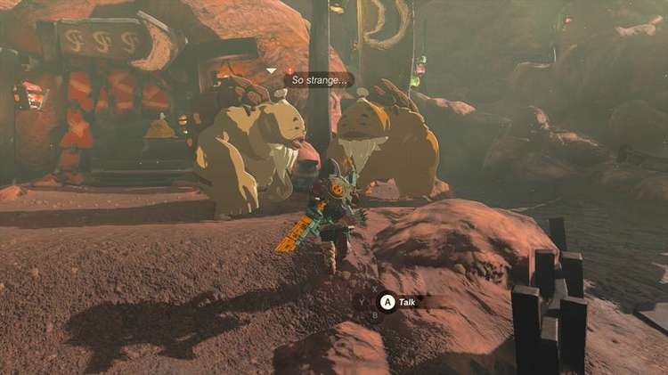

After completing The Fire Temple, you'll be back at Goron City and some things will have changed. We'd encourage you to explore and see what's different in the shops or what characters can offer some side quests.

Speak to Yunobo and the Goron City elder. This will unlock the side quest The Hidden Treasures at the Lizard Lakes to get a special helm.

Just behind these two, you can find Tray and Volcon, and speaking to them begins the Moon-Gazing Gorons side quest.

Dugby will have arrived in Goron City, and be near the entrance. You can talk to him to start the The Ancient City of Gorondia? side quest.

If you return back down to the abandoned Southern Mine, you can find the nearby Southern Mine Cave is now the host of a new Mine-Cart Land attraction, starting the Mine-Cart Land: Open for Business! Side Quest.

Lookout Landing

Fast travel back to Lookout Landing and go over to Mubs' shop. Not only will she be selling the Flamebreaker Armor if you didn't get it earlier, but there will be a new side quest for you to take on here, called Attacked by Pirates (just be warned, it involves taking on a lot of strong enemies!).

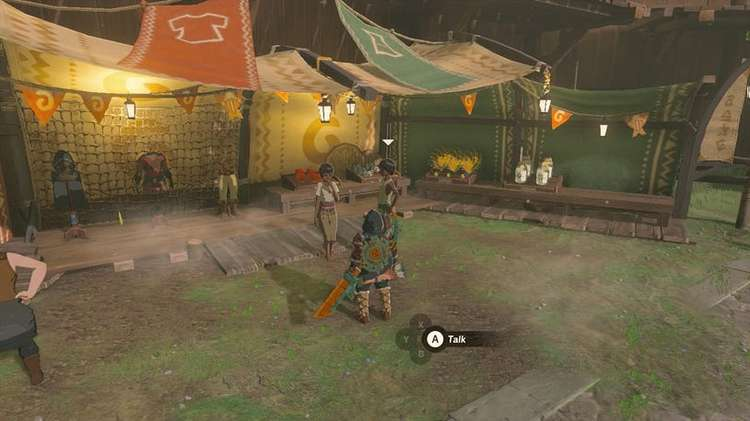

Speak to Purah she’ll tell you that monsters are active in the south, so it’s best to head where’s closest which happens to be Zora's Domain.

If you completed Josha's A Mystery in the Depths quest, and repaired Robbie's hot air balloon, you should probably follow him to check out Hateno Village by this point, as its full of quests and good features to check out.

You should also be ready to keep pursing the enemy you found in the Depths Quest, who has fled towards the Gerudo Depths that you can trail by following the Gerudo Statues under the Great Plateau Central Mine.
