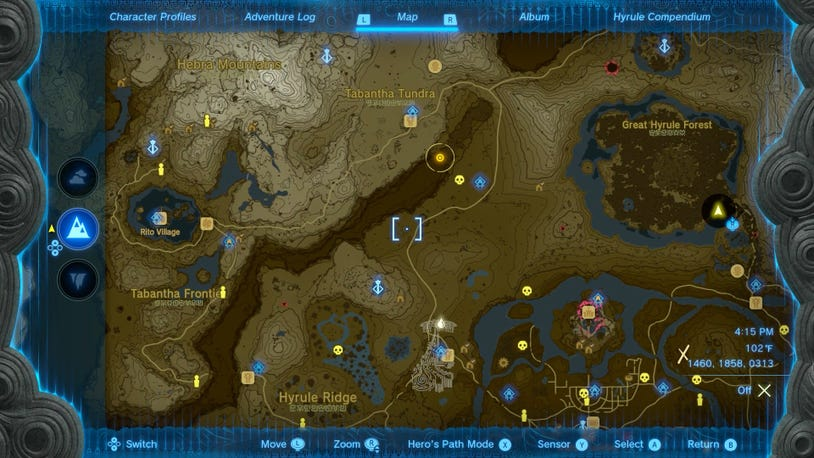
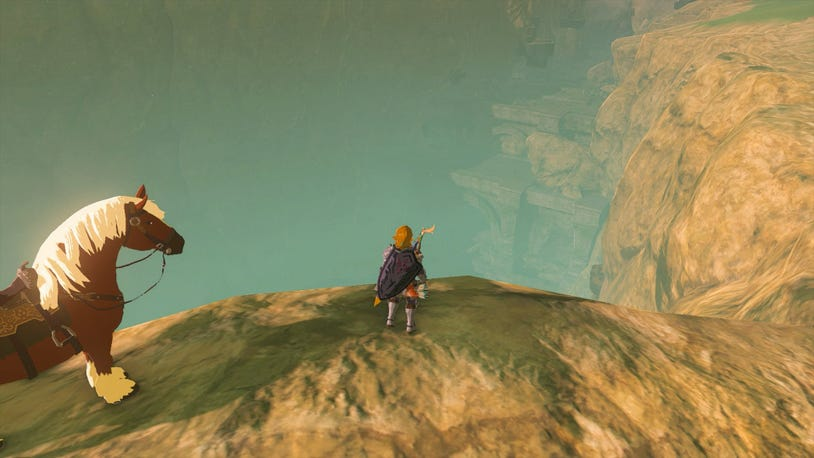
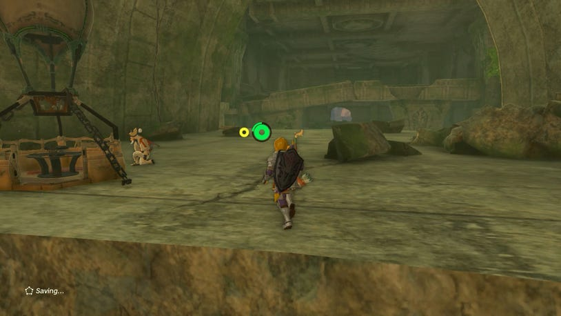
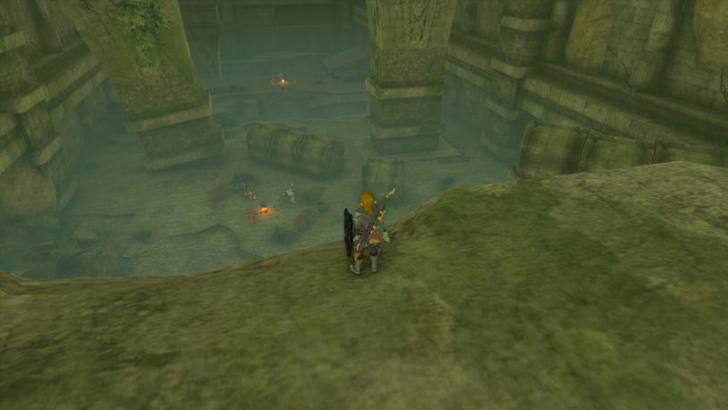
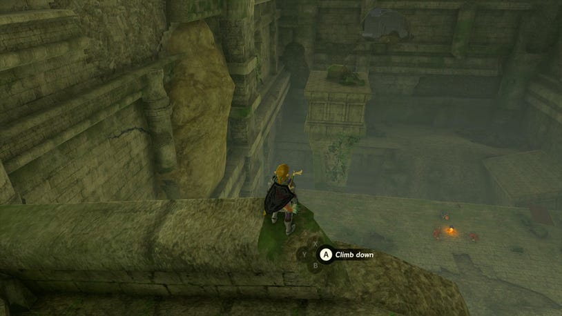
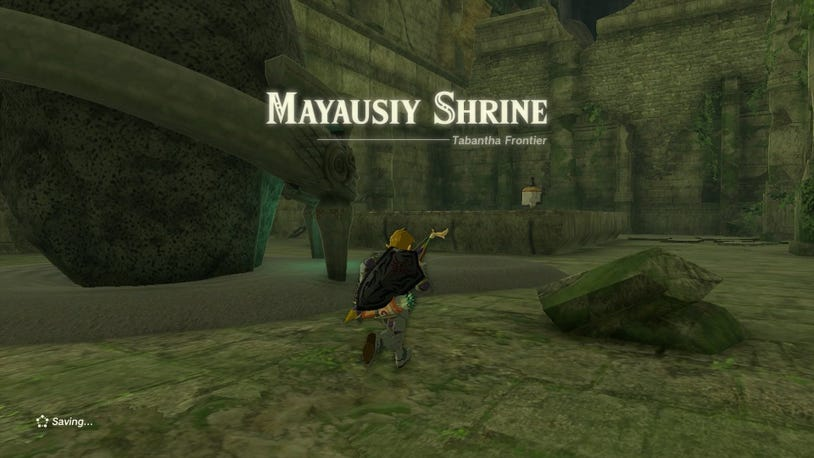
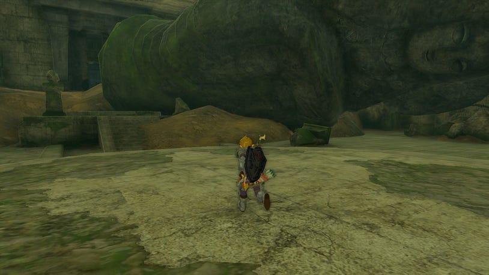
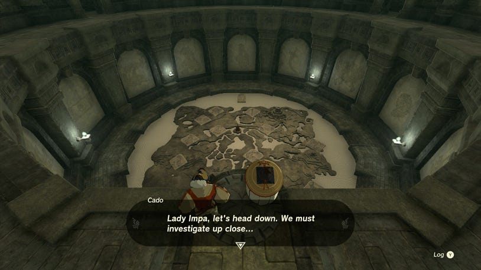
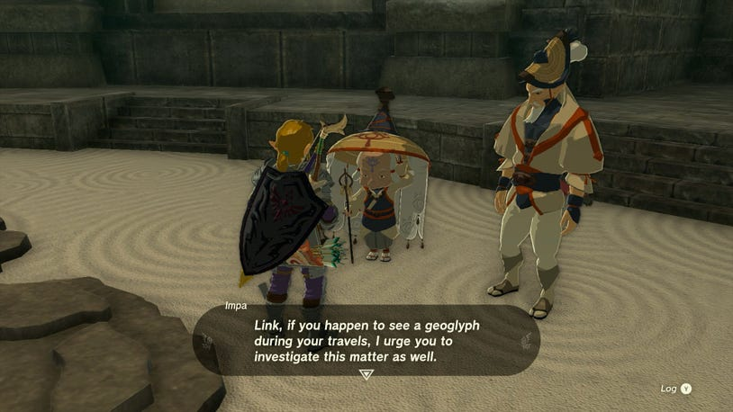

9. The forgotten Temple

Where to Find the Forgotten Temple

Impa has requested you explore the Forgotten Temple, which is located deep within the Tanagar Canyon. If you're still at the New Serrene Stable, you can take the road northeast below the canyon on the way towards Snowfield Stable in Hebra.

You can find it by heading north from the circle of trees where the old Serenne Stable was in Breath of the Wild. Looking down into the canyon is a large stone temple that you can enter by paragliding down.

At the entrance, you can find Impa's hot air balloon being tended to by her bodyguard, Cado. He'll mention that she's already gone on ahead, and so should you.

The Forgotten Temple is large, but thankfully devoid of the many Guardian robots that filled the chambers in Breath of the Wild. In there place are several Bokoblin camps.

You can carve a path through them if you like, but if you'd rather get straight to the point, you can look for a high path along the ruins by going left, and avoiding the camps entirely.

Once you pass the large room with the monster camps, the chamber beyond is where you can find Impa by the Mayausiy Shrine. She'll indicate that the true secret of this place must lie somewhere further beyond.

Mayausiy Shrine

In the next room, you'll find the once great Goddess Statues has been toppled by the Upheveal, but a new strange door can now be found behind it, bearing Zonai designs. There's a few Sundelions in here, and it opens up into a large chamber with a lower room.

As you approach it, Impa and Cado will join you, and uncover the mystery of this strange map of Hyrule. All of the geoglyphs that have appeared around Hyrule are depicted in this room, and you can use it to map out the locations of each Geoglyph.

Impa will ask that you track down the other 10 geoglyphs that have appeared, in order to unlock more memories from Princess Zelda. You can track them down in any order, and are best done over the course of the game as you investigate and explore each region.
