28. The Lightning Temple

The Lightning Temple is a large, featured dungeon in Tears of the Kingdom. An enormous pyramid in the thick of the Gerudo Desert, you'll need to have to continue braving the sandstorm and extreme desert temperatures to make it out there. Once there, you'll need to be smart with how you and Riju make lightning strike amidst puzzles and waves of Gibdos (and even more monstrous Gibdo variants). In this page of IGN’s Walkthrough for the Legend of Zelda: Tears of the Kingdom we've got all the information needed to complete The Lightning Temple, including treasure locations, navigation and light puzzle solutions, and how to defeat the boss keeping this giant pyramid for itself.

Before getting to The Lightning Temple, you'll need to have completed Riju of Gerudo Town

Temples act as Dungeons in Tears of the Kingdom, and although they can be completed in any order, it's recommended that you start with The Lightning Temple fourth. They are all parts of the Regional Phenomena series of main quests.

The Lightning Temple Walkthrough - TotK

At the end of Riju of Gerudo Town, the Lightning Temple will emerge after solving the riddle of the red pillars. Outside, it has three Gibdo hives that glow brightly. Approach the temple and interact with Riju to charge up her lightning.

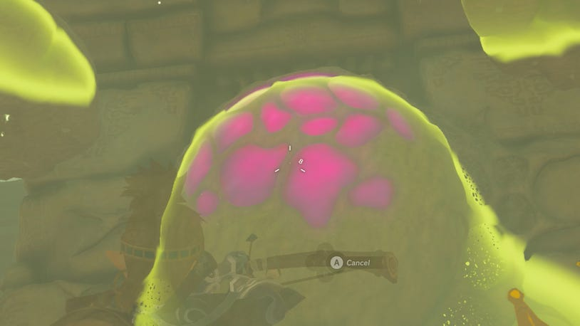

Aim it at the giant hive above the entrance to the temple, and be thrown into a very early boss fight.

In an effort to keep this guide as spoiler-free as possible, this is your warning that the next part of this guide will feature a walkthrough on an early boss battle for the Lightning Temple, revealing it to be Tap to Reveal.

If you'd prefer to avoid spoilers, now is your chance to click away! However, if you are here for tips on beating this boss, then keep reading!Looking for clues to how to solve the Lightning Temple Puzzles instead? Click here to skip the boss fight explanation and jump straight to Entering the Lightning Temple.

How to Beat Queen Gibdo

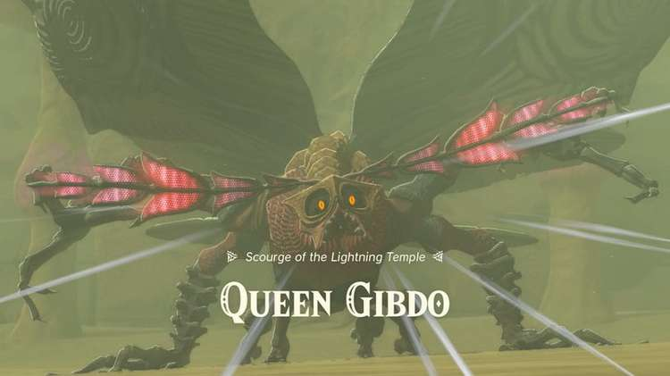

Treat Queen Gibdo the way you would the rest of the Gibdos and stick with using Riju's lightning strike here to make quick work of this boss battle.

Show Spoilers

Get Riju to start charging her lightning attack, then let Queen Gibdo speed toward you. As soon as she becomes enveloped in the lightning, hit her with an arrow.

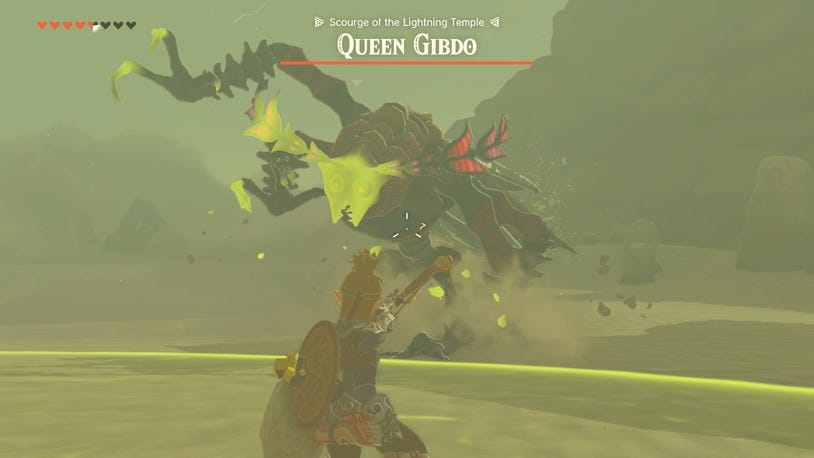

This will knock her back and set her ablaze, turning her white. When she turns white, she's weaker to attacks, but she'll also change her pattern.

She'll now start to throw out tornados that you must avoid, and you'll want to keep Riju out of the way of them, too.

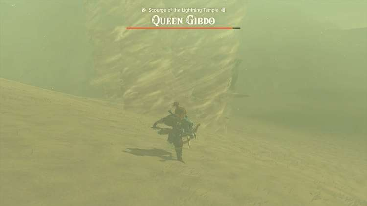

This is to stop her from being knocked over and resetting the charge of her attack. Get Riju to charge her attack again and take aim at Queen Gibdo once more in this vulnerable state. It took us just two shots to get her to flee, so so with a second lightning attack, the boss fight here should draw to a close.

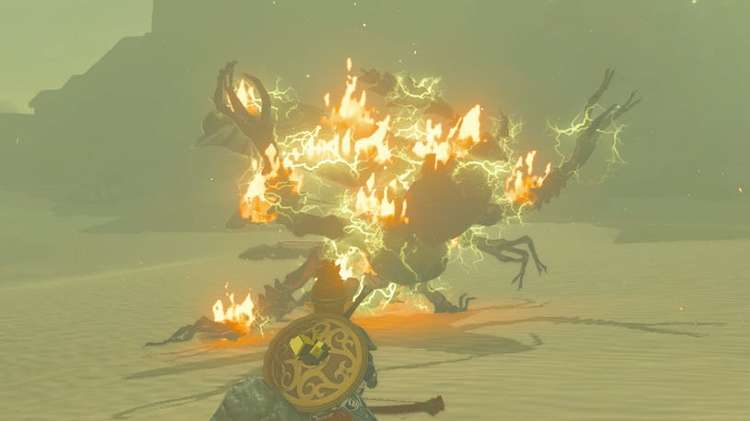

Enter the Lightning Temple

With the boss dashing off to avoid further trouble, you're free to proceed into the Lightning Temple. As you approach the door, a new hive will have formed over the entrance. Take out the hives on either side first, as Gibdo begin to be dumped onto the sand from them.

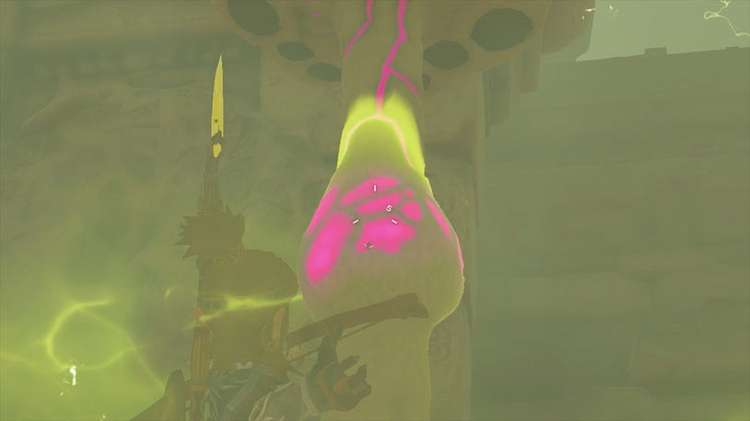

When you've taken down those two hives, you can remove the one blocking the entrance and officially begin the Lightning Temple.

Inside the Lightning Temple

As you enter the temple look right to pick up a Korok-Frond Guster propped against the wall. You will also find a Treasure Chest here, in the pile of sand next to it.

It's worth smashing all of the jars you find as you go through the temple to replenish your Arrows, but also find stones such as Amber and Opal.

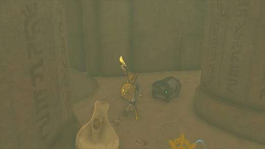

Treasure Chest: 1F Use Ultrahand to pull it out of the sand or the Korok-Frond Guster to move the chest from the sand pile. Inside, you'll find a Flame Emitter.

Using the Korok-Frond Duster, blow away the pile of sand on the floor in front of the door. This will reveal a button that you can step on to move the door out of the way.

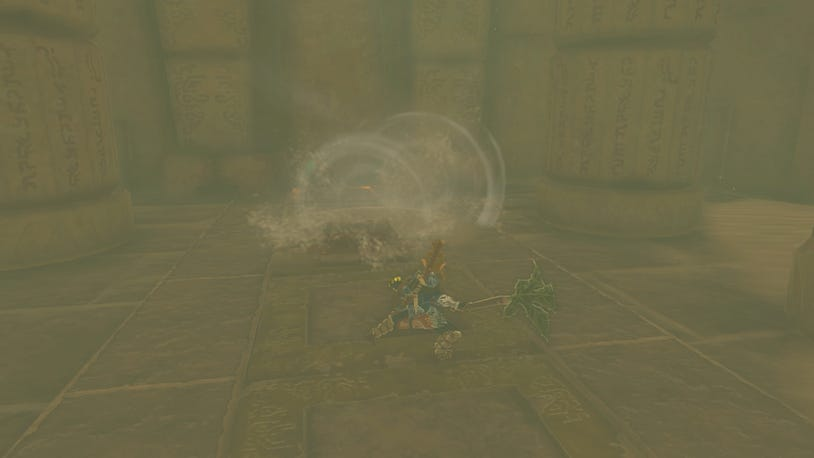

When you're making your way through the Lightning Temple, some areas are quite dark. For this reason, we'd recommend using some Brightblooms if you have a lot of them to illuminate your surroundings if you don't feel like using a Torch.

Step into the next room and proceed down the stairs to reach Lightning Temple B1. Cross the bridge, and as you get to the second portion of it, drop down to the pit below. There will be a Gibdo waiting down here, so take it out before heading off to the left where you'll find another Treasure Chest.

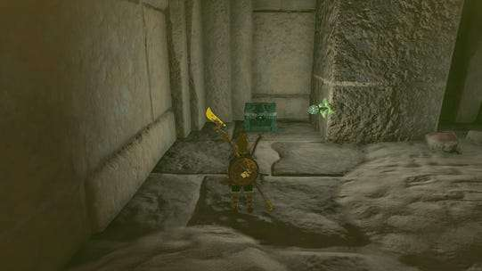

Treasure Chest: B1 Large Zonai Charge.

Use Ascend to get back up to the bridge, then move into the next room. Here you'll see two doorways, where the path goes off to the right and directly onwards.

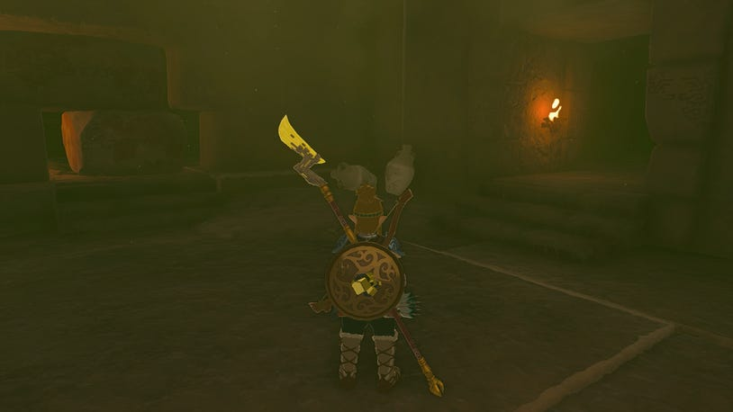

However, the path in front will be blocked by big stones. Use Ultrahand to move them and enter the blocked-off room. Take out the Gibdo waiting for you in here then go to the left side of the room to find a Treasure Chest.

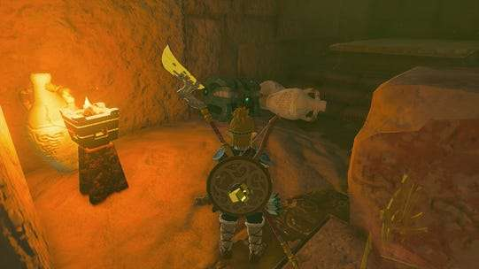

Treasure Chest: B1. Topaz

Go to the back of the room and use Ultrahand again to remove the stone slabs from the tomb. Inside, you'll find a Gerudo Claymore (10).

Now go back out of the room and take the open path to the right. As you start to go into the room, you'll see flames shooting across the corridor further up. Stepping to the center of the room, a platform will begin to lower.

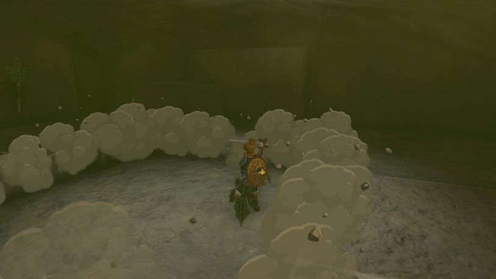

Go down here and find an Electric Keese. Dispatch it, then lift the slab in the alcove to pick up a Gerudo Scimitar.

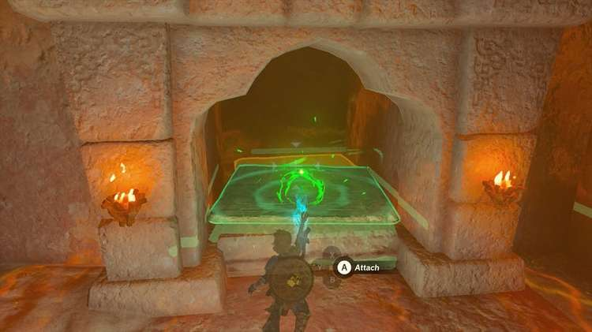

Use Ascend to go back up and toward the flames. There are Gibdo on the floor here, just before you reach the flames, that you'll need to take care of.

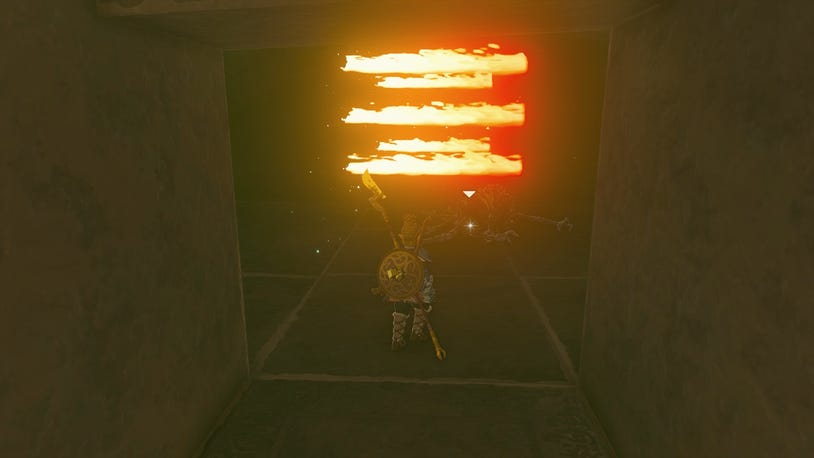

Riju will say you can't make it through the flames, but you can with the right timing. Just get as close as possible to the flames, then dash forward as soon as they go off. On the other side, press the button in the right corner of the room to open the gate and turn the flames off.

Go through the open gate and into a room where fireballs will start to roll down the corridor and land in the pit below. Use Recall on the fireball, to send it back from where it came, and run up the path behind it. Turn off to the right at the end, to enter another room with a button to step on.

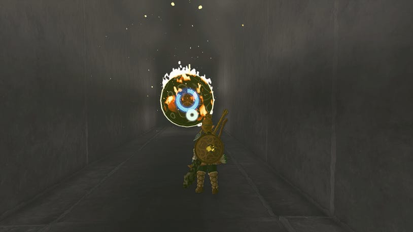

This will allow Riju to join you and open up the next room. As you start down the corridor, another Gibdo will appear. Just continue to follow the path after defeating it, to enter the next section of the temple.

This area will be particularly dark if you're not using a torch, but you can see two paths on either side of the room. if you look down you'll see a Gibdo hive and a tomb. Drop down and Hive will start dropping Gibdo, so charge up Riju's lightning to destroy it.

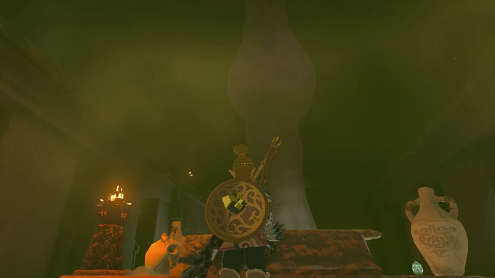

Then remove the slabs from the tomb to pick up a Gerudo Bow. Make your way up the stairs and then onto the next set of stairs leading into the room to the southeast, where a beam of light is coming down from the ceiling.

Inside the Room of Hopeful Light

When entering the room, look to the left to find a Captain Construct waiting for you. You can also use electricity against these, to shock and weaken them. On the top right of this room, you can climb up some moveable stones to enter a room in the southwest with a Treasure Chest.

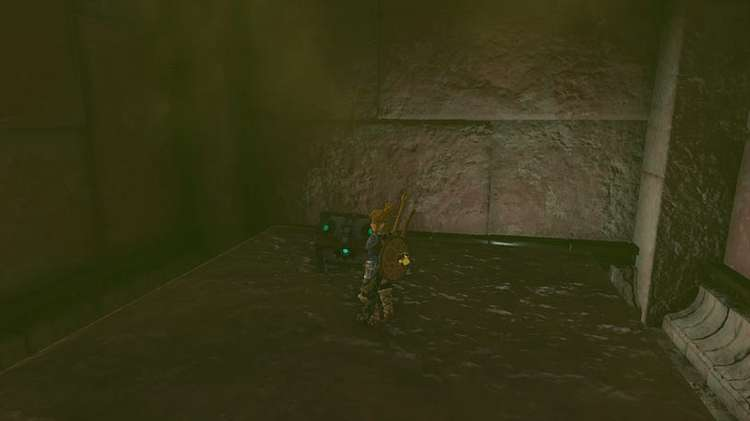

As you approach it, the platform will lower.

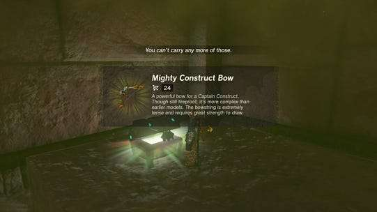

Treasure Chest: B1. Mighty Construct Bow (24)

Use Ascend to get back up and go back into the Room of Hopeful Light. Go back towards the door, and use the Korok-Frond Duster to sweep away the sand pile to the right of it.

Note: there's another sand pile in this room and sweeping it away will reveal a Soldier Construct with a Flame Emitter, so be careful.

Take the mirror from the sand pile and use Ultrahand to hold it up in the light until the door lights up and opens.

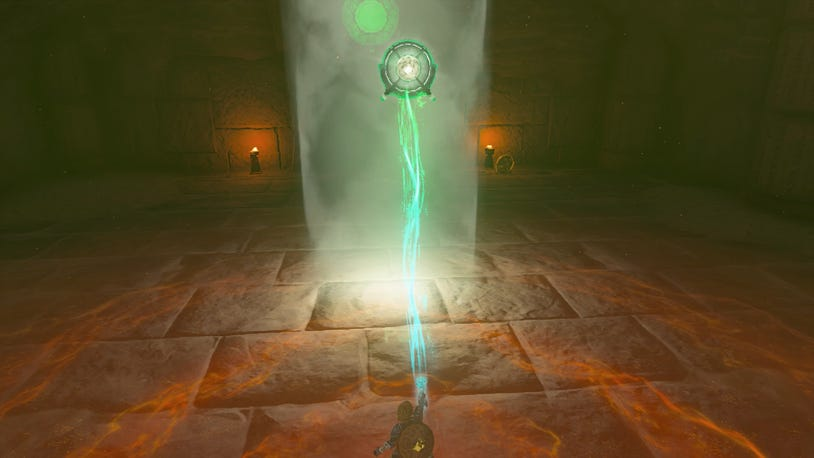

Once it turns green, the door will stay open and you can proceed up the stairs to the northeast back to Lightning Temple 1F. This will bring you to the Room of Ascension and the Zonai portal which can be activated as a fast travel point.

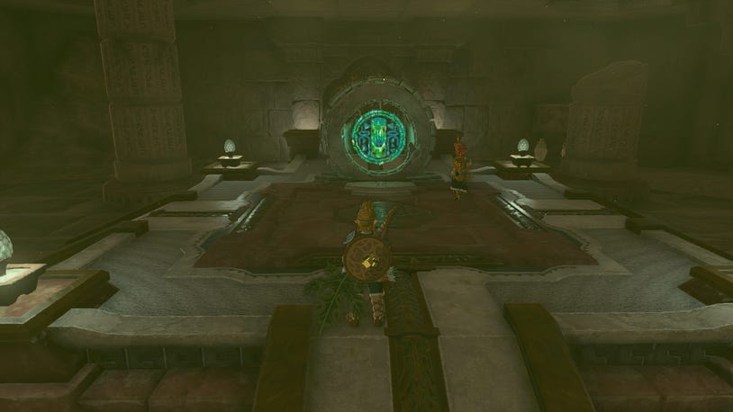

Note: you can also get straight into this room if you use Ascension underneath the room which was blocked off and had the Treasure Chest and Gerudo Claymore inside.

Inside the Room of Ascension

Interact with the portal first and foremost to activate it as a fast travel point, but to also reveal what needs to happen to complete the Lightning Temple. In this case, you need to find 4 batteries to help the platform rise.

A map of the Lightning Temple will flash up, showing the four batteries across four floors.

1F

2F

3F

4F

Below you can find an explanation of how to charge up each battery, in the order we'd recommend for ease.

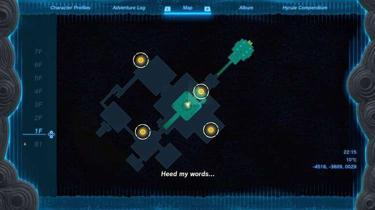

1F Battery

1F Battery

Go to the eastern corner of the room, where you'll see red slabs and two jars.

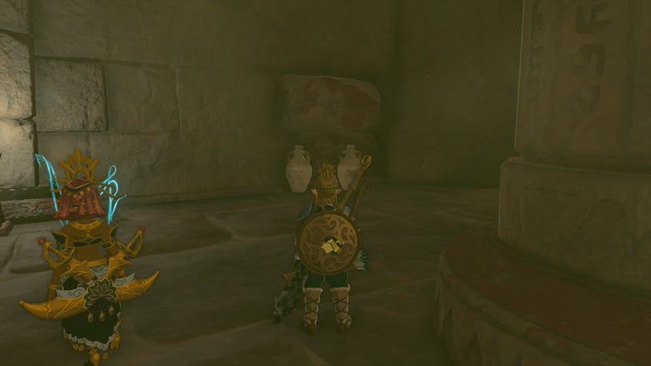

Use Ultrahand to move the red slabs out of the way and gain access to the battery in 1F. Speak to Riju to charge her lightning, then aim an arrow at the battery to hit it and get the first one going.

Battery 2F

Battery 2F

Now, go back to the main room and over to the south corner. There's a stone slab here blocking the wind from rising upwards. Use Ultrahand to move it and ride it all the way up, landing on 5F.

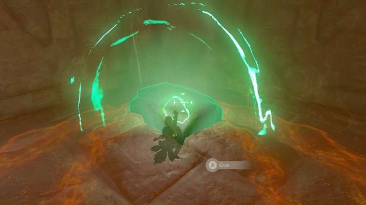

On the western side of 5F, there will be a Soldier Construct waiting for you. Clear out the area then take note of the room just behind the Soldier Construct on the southwest side of 5F. There's a gap in the wall you can climb through to reach the Room of Natural Light.

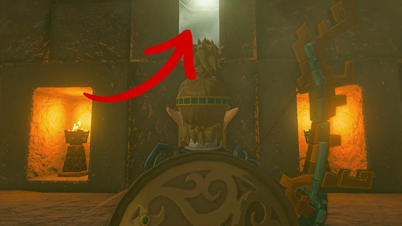

In this room, go to the western corner to find a hole in the wall where a stone slab was and two mirrors inside the wall.

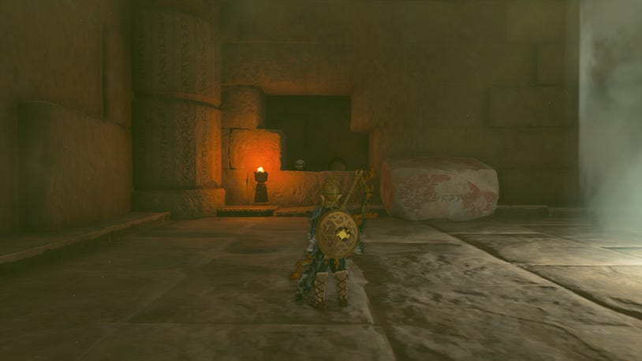

Pick up the stone slab and turn it on so it stands as an upright rectangle, then place the mirror on top of it. Position this in the center of the room so that a beam of light projects out towards the center of the temple.

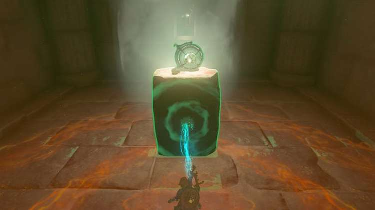

Go outside and have a look around at the four moveable platforms with mirrors attached to them. They're located in the northeast, southeast, southwest, and northwest sides of the room, so we'll refer to them as such when explaining how to position them.

Move the one in the southwest first (closest to where the Soldier Construct was and the gap in the wall). Face northeast and use Ultrahand to slide it all the way to the right.

Now go to the platform in the northeast and use a Korok-Frond Guster to clear the sand pile next to it, stopping it from moving. Face southwest and move the platform to the right until the beam reflects off of it.

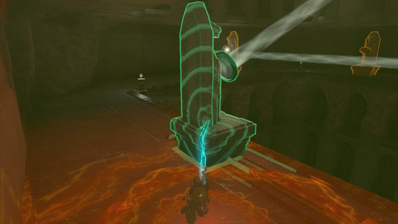

Head for the northwest platform now, then move it to about halfway across. It will hit a yellow target here, turning it green.

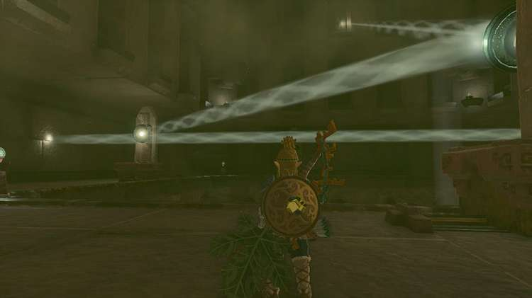

Hop back into the wind to propel yourself up to 6F, towards the southeast.

Aim for as high up as possible, then climb the rest of the way to the alcove with the statue that has now turned green.

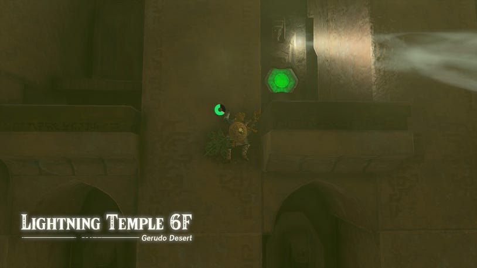

As you approach it, it will move out the way revealing a passage you can enter to reach the next battery. As you go to the end of this corridor, look down. You'll be able to see fire crisscrossing over a shaft that you can glide down to reach the Room of Light and Fire.

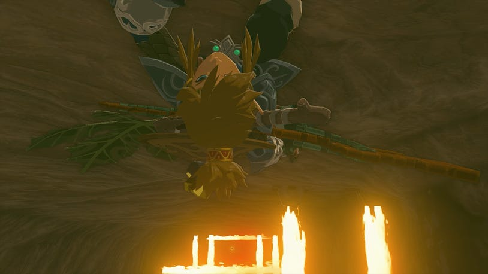

You can climb to a position above the fire, where there's enough of a gap to allow you to drop down and glide straight to the bottom. The problem you'll face at the bottom is you need Riju with you. So stand on the button to open the door and be ready to face the two Soldier Constructs waiting for you on the outside.

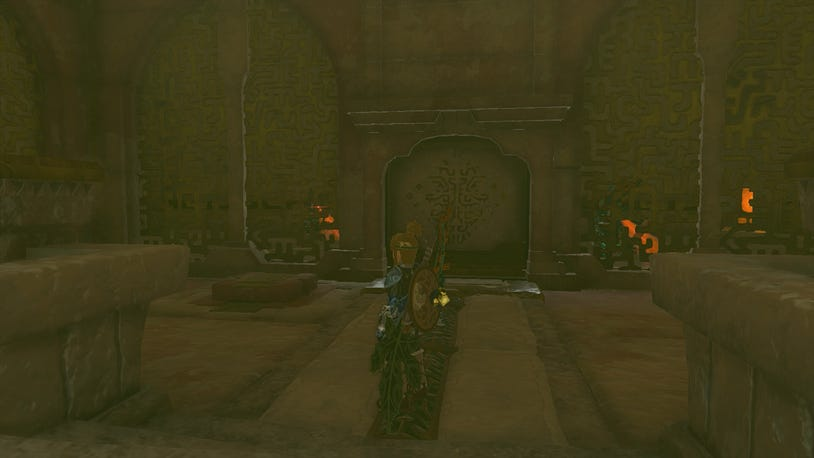

We'd recommend dashing past them and heading for the center of the temple via the entrance in the northwest. This will bring you to the stairs, allowing you to go and collect Riju, then bring her back to the battery. Make use of her lightning charge to deal with both Soldier Constructs before using it to power up the battery.

Battery 3F

Battery 3F

Go back down to the center and use the wind to travel back up to 5F. We're going to move the platforms again to change the direction that the light beam is aiming, sending it down this time instead.

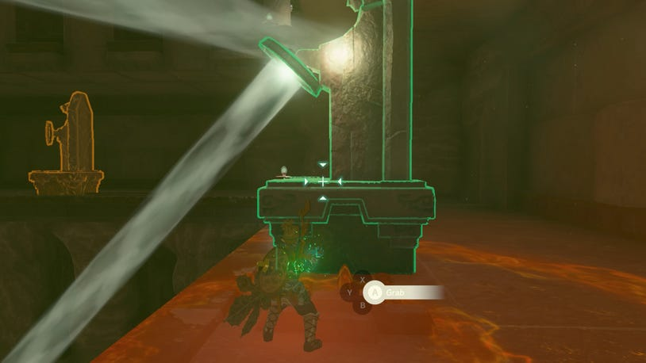

To do this, move the platform in the southwest (while facing the northeast) all the way to the left this time. Doing this means it will pick up the beam and sends it toward the platform in the southeast.

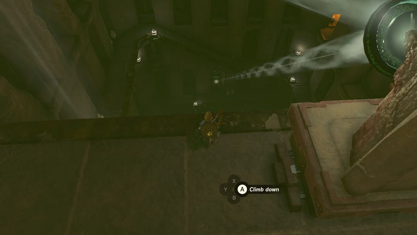

Head over to the platform in the southeast and move it to the left, so it picks up the beam and sends it down. This will move a statue in the northwest on 2F, revealing a button.

Glide down to it, and stand on it to move the statue out of the way and lead you to a set of stairs. Go up the stairs and into the Room of Offered Light.

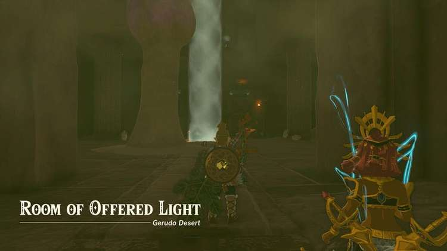

The first thing you should note immediately is the hive just to the left as you enter the room. This will become active as soon as you move forward, so use Riju and shoot an arrow when her lightning charge reaches the hive.

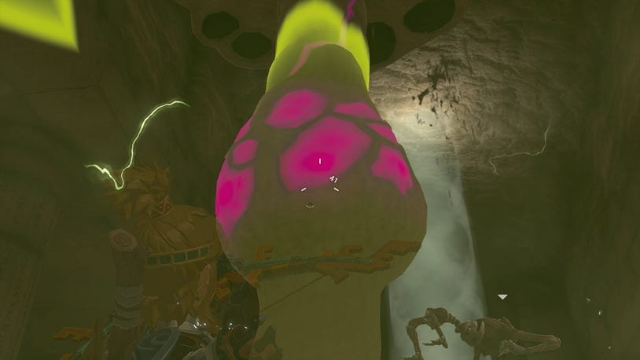

Then deal with any remaining Gibdo and Soldier Constructs that will appear because of the commotion.

Once this area is clear, look up to the platforms in the northwest of the room to see two more Soldier Constructs to take out.

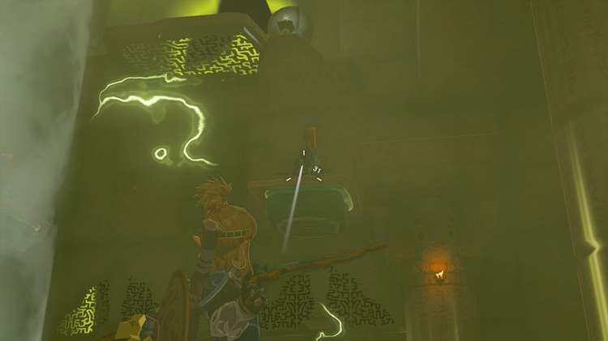

On the right side of this room, you'll see several hot air balloons. You can remove them from the sand using either Ultrahand or the Korok-Frond Guster.

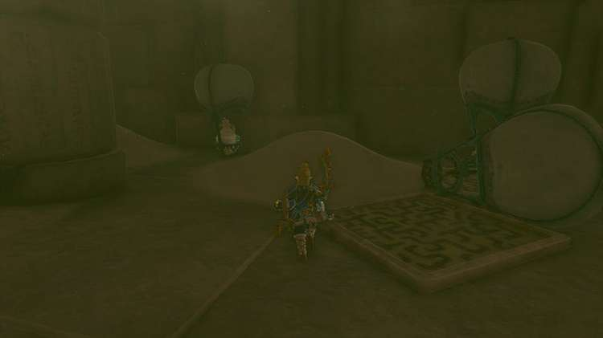

The idea in this room is to get the mirror to the top, so it can reflect the light onto the yellow Lock. There are multiple ways you can get the mirror to the top, but here's how we did it.

Find a platform and position it over the top of the light, then put a hot air balloon in the middle and attach it. Grab a mirror and position it so that it reflects the light facing northwest.

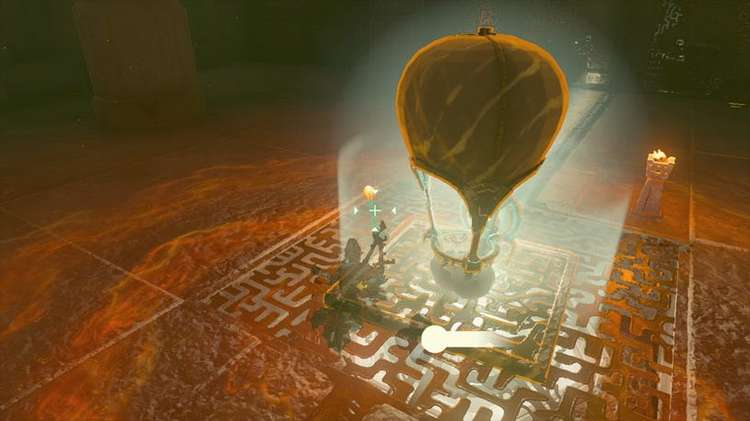

Attach this to the balloon and platform. You then just need a fire source to get the balloon to rise. You can use a torch from the wall if you don't have anything like a Flame Emitter to use here.

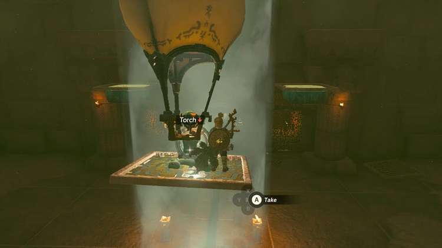

Then ride the platform up with the mirror, so you can hop off and glide over as soon as the yellow lock turns green.

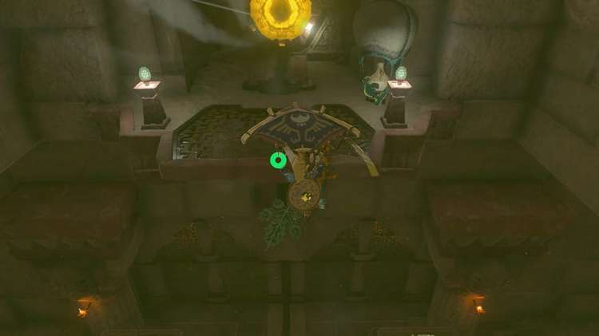

As the lock goes green, the grate at the bottom will rise, allowing you to reach the third battery.

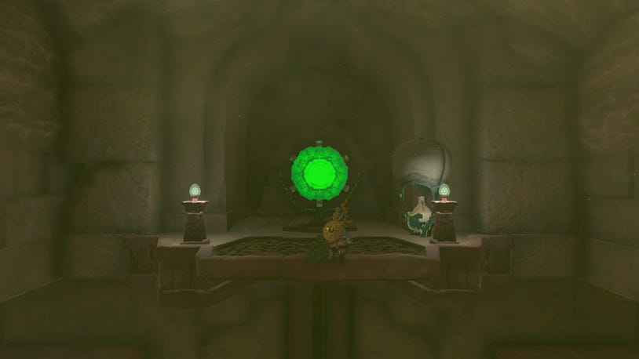

Now just use Riju and an arrow to charge it up! One more to go!

Battery 4F

Battery 4F

Ride up using the air one final time. But this time, face northeast and look for the warm yellow glow on 4F in the corner. Glide over to here, and be ready for a Solder Construct tucked away in this room. As you go inside, you'll see two spinning blades. You can run through the gap to reach the other side.

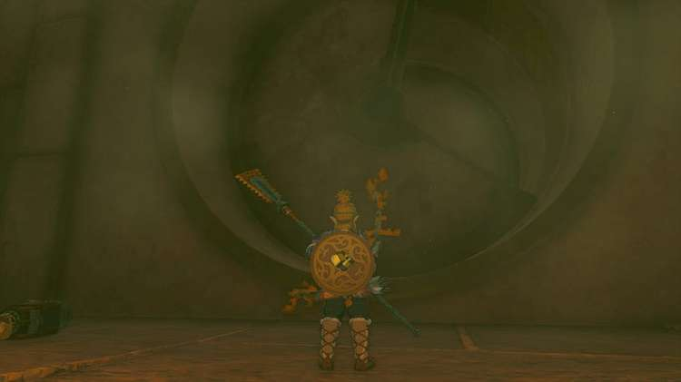

You'll see stone slabs partially blocking a hole in the wall, but light will be coming through. Use Ultrahand to remove them and let the light beam through.

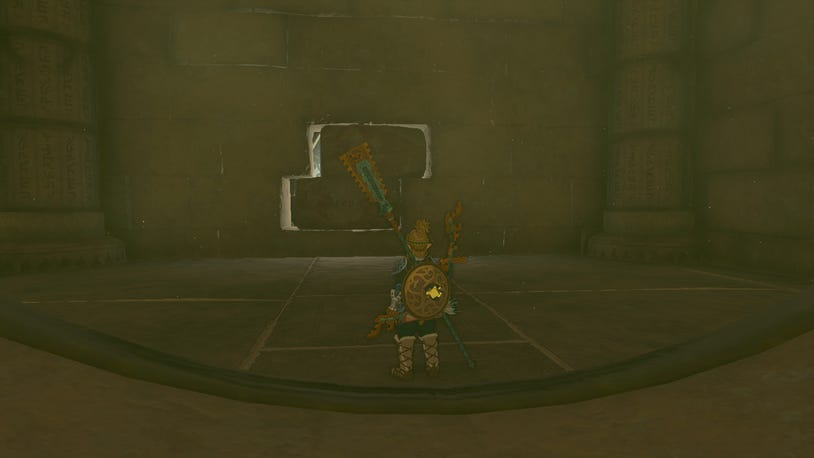

Run back through the wheels, then use Recall on the one closest to you, until the gaps in the wheels line up. Cancel Recall by pressing L then, to let the wheels turn and the light pass through the door and hit the statue opposite.

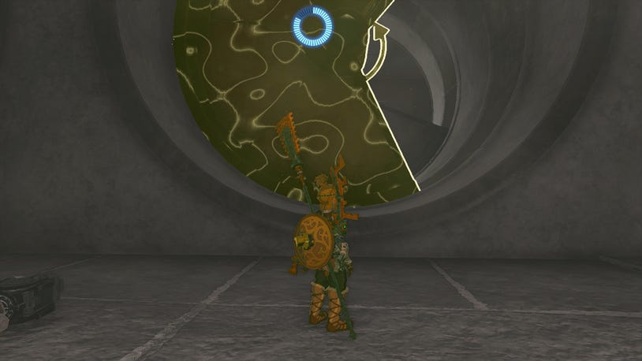

Leave this room and go across the stairs to the statue on 4F. Press the button just before the statue to move it, then go down the stairs. At the bottom, you'll come to a trap where two spiked walls close tightly against each other quite quickly.

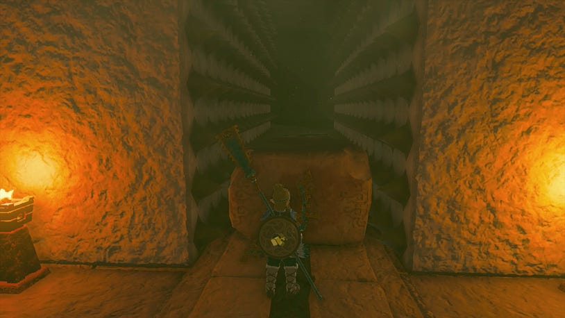

Use Ultrahand to pick up the stone slab on the right side of the room and place it between the spiked walls. This will give you enough of a gap to run through to the other side.

When you reach the other side, you'll see a wall opening and closing on the left, as well as a button.

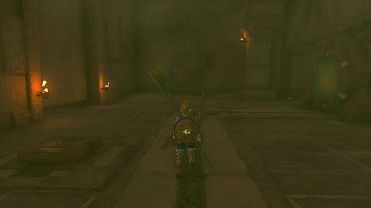

There's a hole in the wall where bricks can be removed with Ultrahand directly in front of you, and the light you need to hit on the right. Press the button on the left first, to let Riju join you. Then, go towards the bricks in front of you first, and use Ultrahand to remove them from the wall. Place this under the spiked wall going up and down.

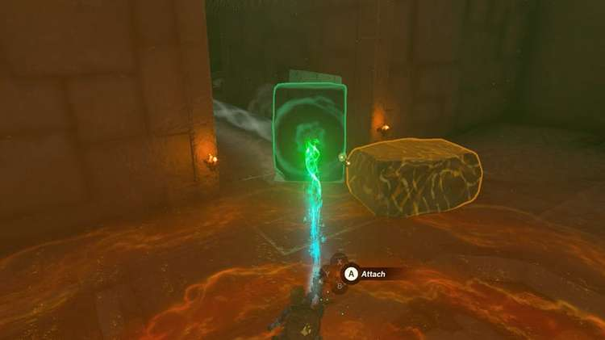

Position it so it's flat against the wall on either side, giving you enough room to get through to the Room of Light and Shade.

There are two Soldier Constructs in this room, and while crouched, you can still raise your bow and quickly take them out by aiming for their eye. Go to the opposite side of the room from where you entered and clear the sand pile to find a Mirror.

Now go to the hole in the room in the east and drop down. You'll enter the room where the light is coming from, and the walls are spinning. There is also a sand pile here, so wave that away to reveal a mirror.

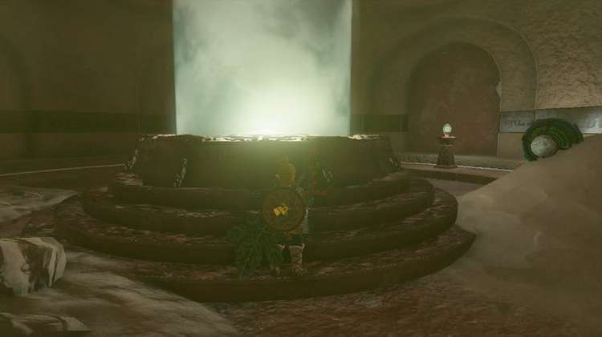

Use Ultrahand to place the mirror in the center of the room and aim the beam toward the yellow lock. There are two stakes in the room that can be used in the wall to stop it from spinning. We found you didn't actually need them, and the yellow lock turned green.

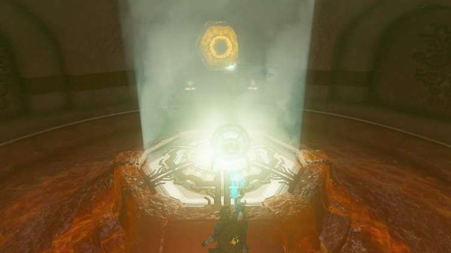

However, if it doesn't work for you and you need to use the stakes and stop the room rotating, use Ultrahand to pick them up then press B when you've positioned them in the wall to bring the spinning to a stop. You can pull them in and out of the wall as much as you need to get it lined up right.

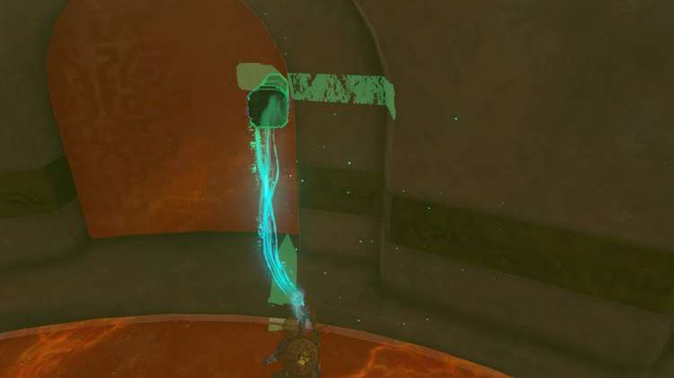

When the lock has turned green, the panel above will open. You can now use Ascend to get back up and position the mirror on this level, so the beam of light goes out into the room past the spiked wall and hits the lock to reveal the final battery. Team up with Riju once more to charge up the battery with her lightning strike.

With all four batteries charged and working, it's time to return to the center of the Lightning Temple and back to the platform.

After Charging the Four Batteries

Go back to the portal and examine it, to raise the platform for Riju and Link. This will take you up to 7F of the Lightning Temple, the Room of Glorious Light. There are hives in all four corners of 7F, as well as a big hive glowing in the northeast corner.

Use Riju's lightning strike to hit the hive in the center, and Queen Gibdo will appear again for another fight.

How to Beat the Lightning Temple Boss

Before you enter this fight, you'll want to have a good shield, a sturdy bow, and lots of arrows. We'd also recommend stocking up on plenty of cooked meals.

Fighting Queen Gibdo during the first phase is no different from the fight you had with her at the Lightning Temple entrance. Use Riju to immediately start charging her lightning strike, and ready your bow to hit Queen Gibdo. This will make her body go white, and show that she's vulnerable to attacks. Before you land the first hit, she will either swap between shooting a concentrated beam of sand at you, which can be a one-shot hit every time, or she'll charge toward you.

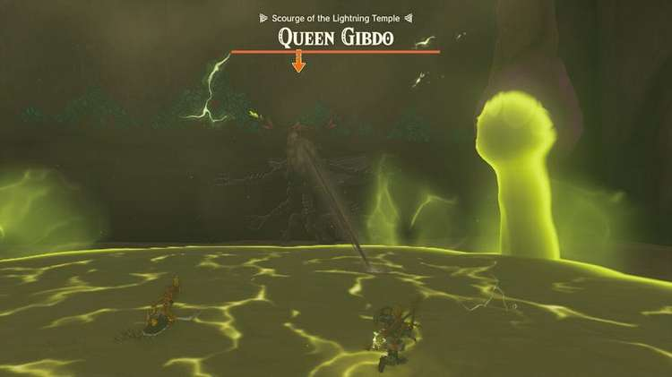

You can run away from the precision stream, or you can use your shield to deflect it. Let Riju charge her lightning as you defend from the attack, then shoot an arrow at Queen Gibdo as soon as she has the metallic gold shine to show she's in the ring of electricity. When she charges at you, simply dash out of the way either left or right, to avoid the attack.

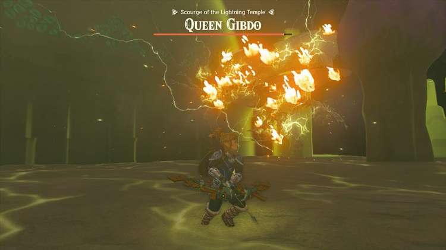

When her body turns white, she will use tornadoes every time. Try to run away from these tornados, by going left or right, but then try to get behind them to get back to Queen Gibdo as soon as possible. Get Riju to charge her attack during this time, so you're ready to hit her for a second time.

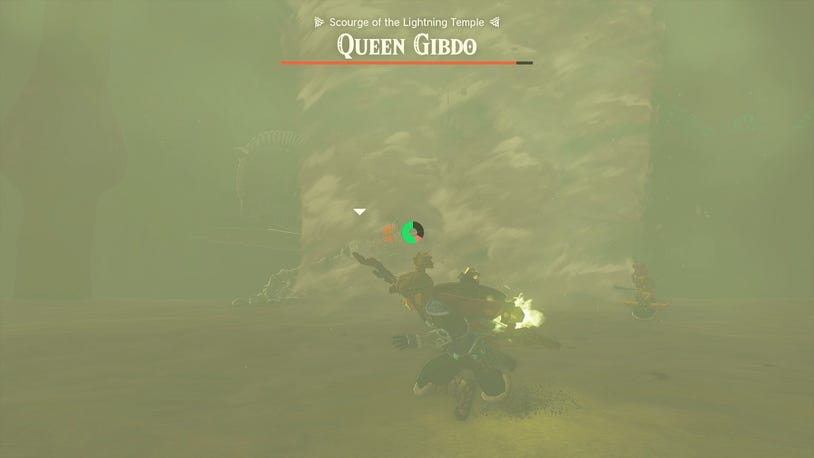

On the second blow, she'll fall and you can attack her however you like for a limited amount of time. When she gets up, she'll always charge at you and try to wipe you out.

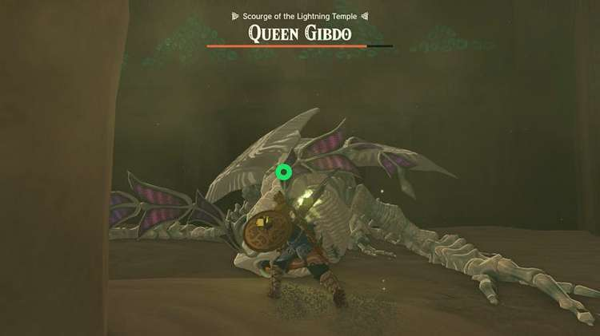

Repeat this attack pattern until you get her health bar down to half, and the phase will change drastically.

During the Second Phase

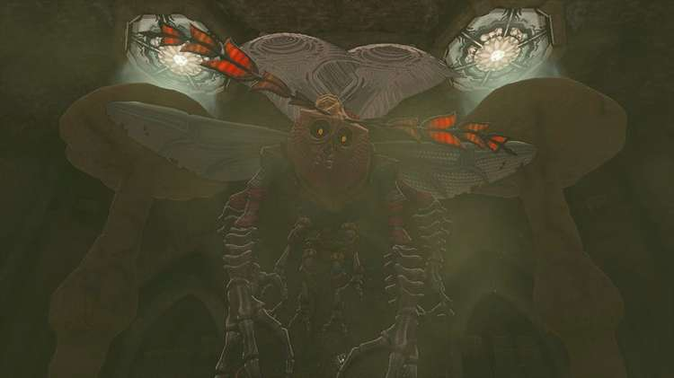

As you might have guessed, during the second phase, the hives become active. They will spawn a variety of Gibdo throughout the rest of the fight. Riju's lightning attack appears to charge quicker during this round, however, so try to send out the charge as soon as it replenishes.

During this phase, you can get rid of all the Gibdo by destroying their hives. This will bring down beams of light that will turn the Gibdo white, as if they were stone, and make them vulnerable to attack or completely perish. The hardest part of this phase is keeping an eye on Queen Gibdo, while you're trying to clear the arena.

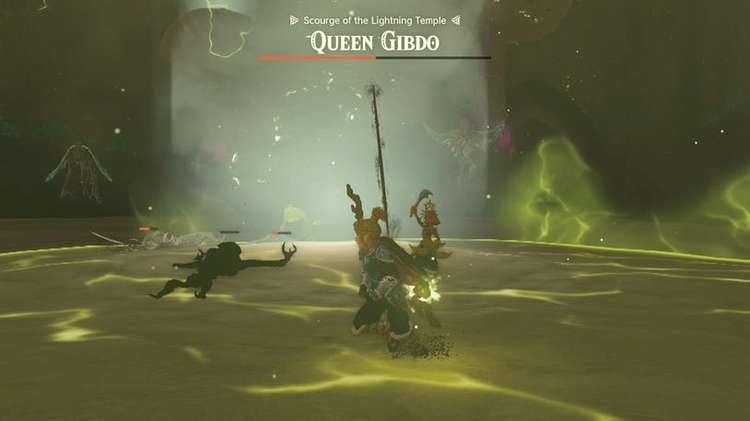

The best way to do this is to listen out for her screams. When she's not making noise, attack the hives and bring down the beams. When she screams, this usually means she's about to charge up her concentrate beam and chase after you. As one of the harder attacks to dodge, you should try to block it or run from it, but definitely shift your focus to the attack temporarily.

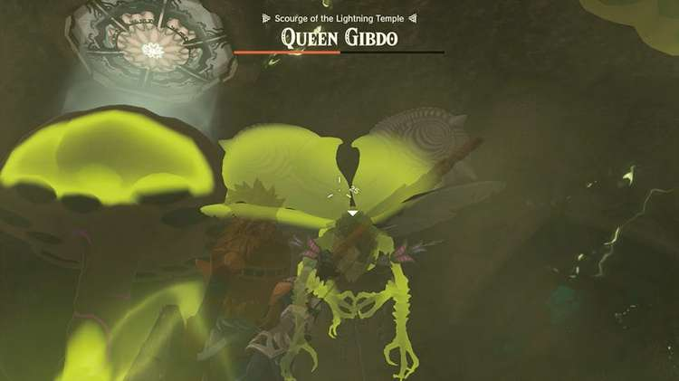

You can stand in the beams of light while blocking the attack, to simultaneously kill the Gibdo and prevent the queen from getting to you. The way you attack her should remain the same as during the first phase. But, the additional thing to look out for is the increased amount of tornados. Instead of three, she will now shoot out five that cover a wider area. As soon as she turns white, start to run in either direction to get a head start.

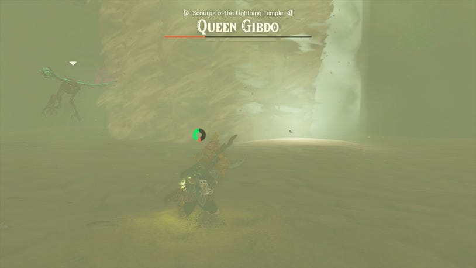

When you've finally beaten Queen Gibdo, the sandstorm will be cleared from Gerudo Town, and all of Gerudo Desert will be a little bit easier to explore.

The Lightning Temple

After Completing the Lightning Temple

If this is your fourth temple, then Buliaria will tell you to go back to Lookout Landing and let them know what information you've gathered.

While you're in Gerudo Town, however, go back to Padda in the courtyard and she'll have a whole load of Gibdo items for you to take. You can also explore the main courtyard and see what shops have appeared, or moved, as everyone emerges from the shelter below.

When you've explored enough of Gerudo Town, go back to Lookout Landing and report to Purah who is at the top of her house. This will wrap up the Regional Phenomena questline if this is your last temple, and begin Crisis at Hyrule Castle - The Floating Castle.
