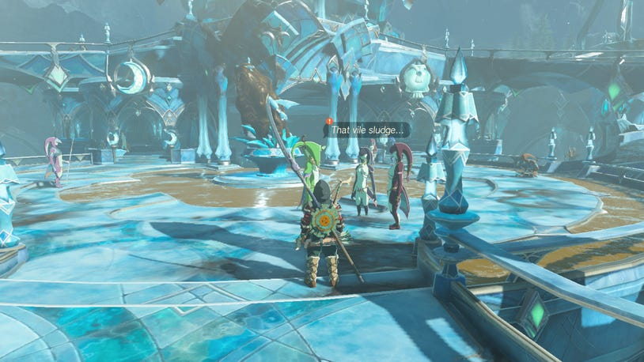

20. The Sludge-Covered Statue

How to Complete the Sludge-Covered Statue

To start the Sludge-Covered Statue main quest, speak to Chroma, Kira, and Yona who are standing at the center of Zora's Domain.

They'll be standing next to the sludge-covered statue right in the middle, and surrounded by mucky water. Speaking to the three of them will trigger the main quest, and it's an extremely short one at that if you have the right equipment.

To help out the residents of Zora's Domain, you're going to need a Splash Fruit, which they're unfortunately all out of. If you've followed our Regional Phenomena - To Zora's Domain walkthrough, you will have visited areas where you can pick up Splash Fruit along the way. If not, you can find some in the areas nearby.

Approach the statue and aim the Splash Fruit at it. Then simply throw it to clean it up.

Return to the villagers once this is done to speak to them and show them that you've managed to wash all the sludge away.

A conversation will begin between the three, with the third village introducing herself as Yona. She'll encourage you to explore Zora's Domain and go and meet Sidon, who she says can be found at Mipha Court, near the Ploymous Mountain.

As the ladies depart, Yona will tell you to meet her at the infirmary and the next main quest Sidon of the Zora will become available.

The Sludge-Covered Statue

Before you head off to do this though, you should go up the stairs and behind the waterfall towards the pools. Speak to Yona again who will talk to you about the Zora Armor, unlocking the Restoring the Zora Armor main quest.
