25. The Water Temple

This walkthrough to the Water Temple dungeon in TOTK includes all chest locations, puzzle solutions, and of course a guide to the big boss fight. The Water Temple is more than just a dungeon - its a phrase that can make the blood run cold in the veins of even the most experienced Zelda players - but this Legend of Zelda: Tears of the Kingdom walkthrough, you'll learn everything you need to know about the Water Temple, including treasure locations, where to find and how to activate the four faucets, and how to stop the source of the chaos in the first place.

The Water Temple walkthrough begins high above the clouds and the Water Temple is, for the most part, only accessible via waterfall. In its default state, however, there's lots of sludge and grime obscuring its majestic design. You will getting to it via the Wellspring Islands in the Sky.

Before getting to The Water Temple, you'll need to have completed Sidon of the Zora

Temples act as Dungeons in Tears of the Kingdom, and although they can be completed in any order, it's recommended that you attempt The Water Temple third. They are all parts of the Regional Phenomena series of main quests.

Jump to:

The Water Temple Walkthrough - TotK

1F Faucet West

B1 Faucet

1F Faucet Northeast

1F Faucet East

After Releasing the Four Faucets

How to Beat the Water Temple Boss

How to Get to the Water Temple

As we mentioned above, you'll need to have completed the Main Quest Sidon of the Zora in order to access the Water Temple. Following that quest will reward you with a piece of Zora Armor, which allows you to swim up waterfalls.

The quest will take you to Wellspring Island, accessed by swimming up a waterfall. After ascending more waterfalls there, you'll eventually find a giant one with Sidon - swimming up it brings you to the Water Temple.

The Water Temple Walkthrough - TotK

As you swim up the giant waterfall from Wellspring Islands, you'll emerge at the foot of The Water Temple. It's not hard to see the source of the sludge as soon as you enter the temple and proceed toward the center.

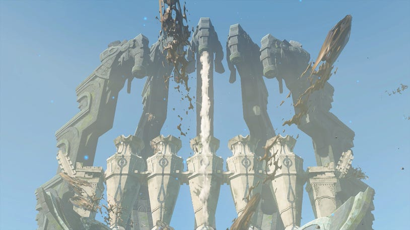

Approach the portal to activate it, and create a handy fast travel point.

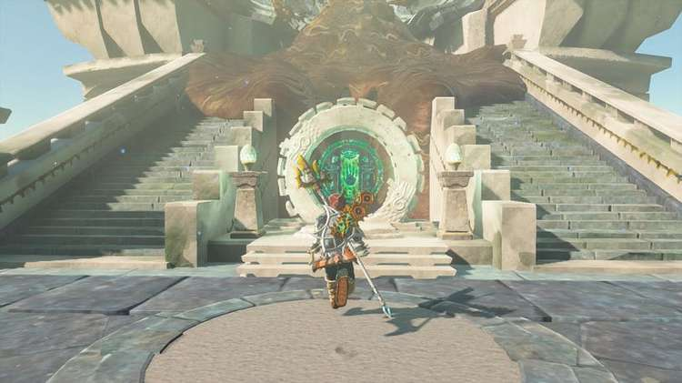

Before entering the temple, Sidon will have asked you if you feel prepared and ready to proceed. This temple will be much easier with some essential items including Arrows and Splash Fruit (or Chuchu Jelly).

With water running just above the sludge, Sidon hopes that it can fill the vessels and remove it. Unfortunately, it doesn't help, but there are four faucets in the Water Temple that can be opened that might!

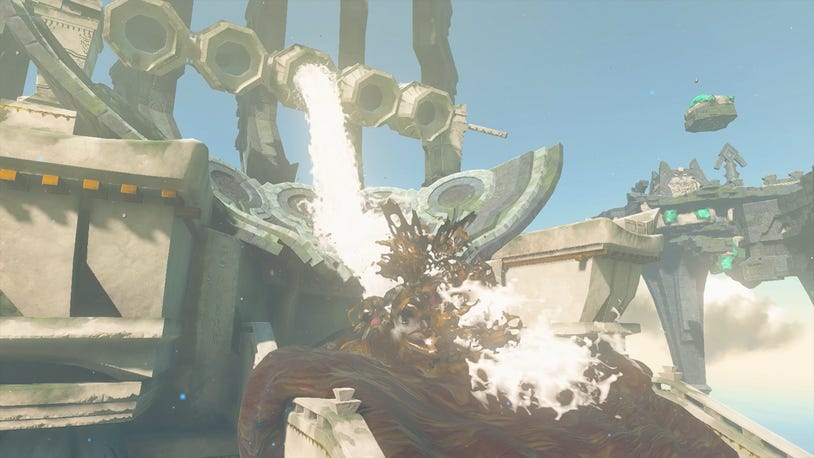

Opening them will increase the amount of water that fills the vessels, so it's time to find them and open them.

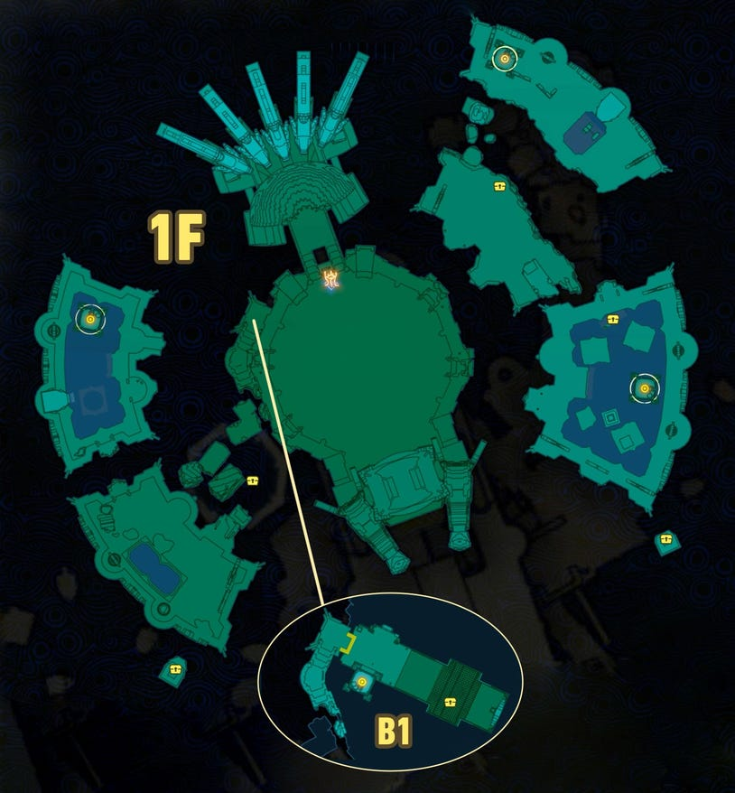

A map of the Water Temple will flash up, showing the four faucets across just two different levels. It's a fairly small area, but you can find the faucets in the following locations:

1F Faucet East

1F Faucet Northeast

1F Faucet West

B1 Faucet

Below you can find an explanation of how to turn on each faucet, in the order we'd recommend for ease.

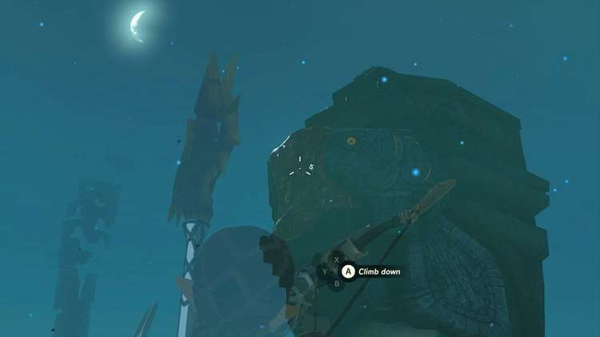

1F Faucet West

1F Faucet West

The easiest way we found to tackle these faucets is to work from left (west) to right (east), or vice versa. We started with the faucet in the west.

Head west and before you jump up the broken platforms, look down next to the bubble device to see a circular pool of water.

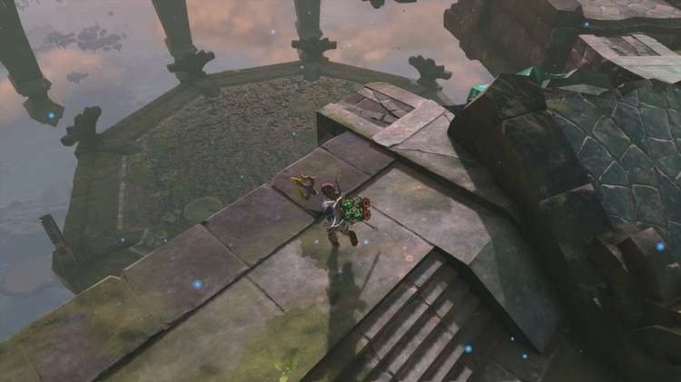

Drop down into it and then use Ultrahand. This will show you that there's a chest underwater in the center. Stand on one of the Lily Pads closest to the treasure chest, then use Ultrahand to fish it out of the water and onto dry land.

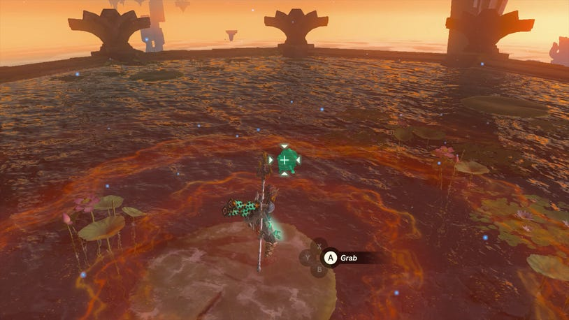

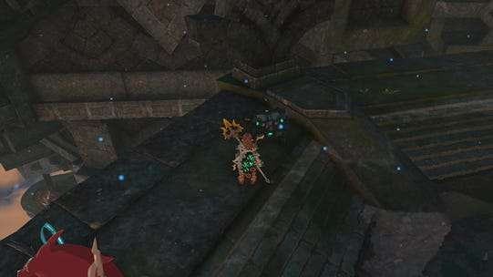

Treasure Chest: Southwest, drop down and get a chest from the middle of the pool of water. Contains a Sapphire.

Face northeast and climb back up to the center of the temple. Then head west, toward the first lock. To reach it, climb and jump across the platforms, remembering you can jump a little higher up here, so the gaps shouldn't be much of an issue. When you get to the top, there will be three Soldier Constructs waiting for you in the area.

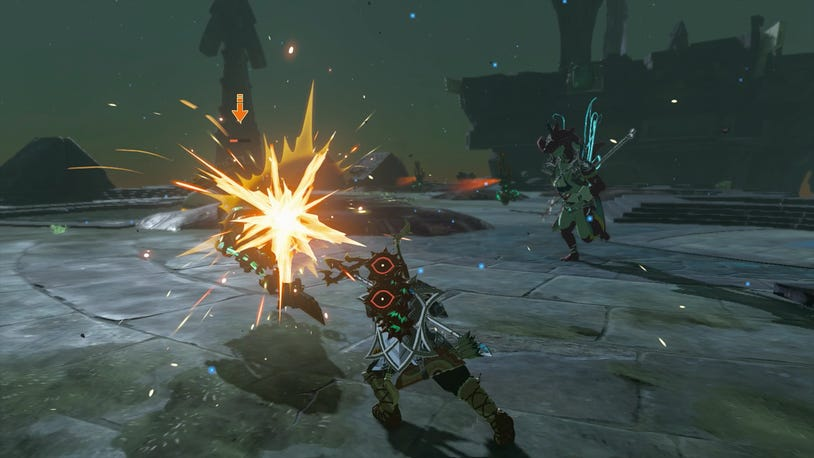

Clear them out first, then look to the southwest to see a sludge-covered floating statue that should be acting as a waterfall. Use a Splash Fruit and Arrow to clean its face and let the water run freely.

Jump over to the waterfall and Swim Up, so you can reach the top and another treasure chest.

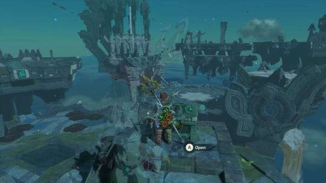

Treasure Chest: Look to the waterfall covered in sludge in the southwest. Swim up and get to the chest with a Zora Shield.

Now go to the center of this platform and make note of the ball floating in the water. Leave it for now, and go to the right of the pool. There's a bubble device here covered with sludge, so use a Splash Fruit to clean it.

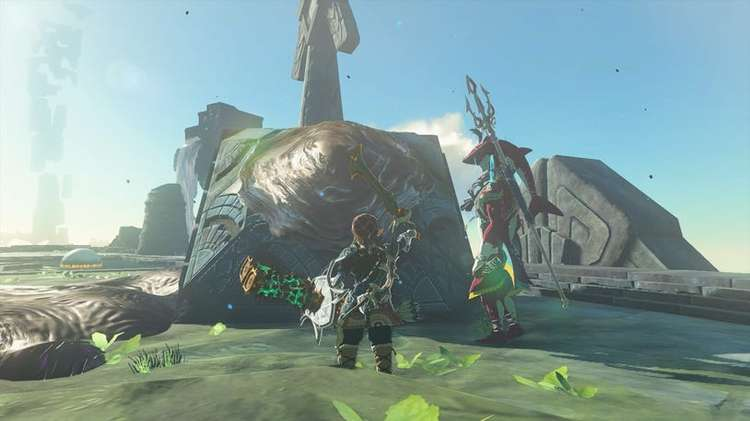

This will result in bubbles being produced again, with each of these bubbles floating up the platform just above in the north.

Now use Ultrahand to grab the ball from the pool and take it over to the bubble machine. Let a bubble take the ball (or attach it to one) and send it floating off to the platform above.

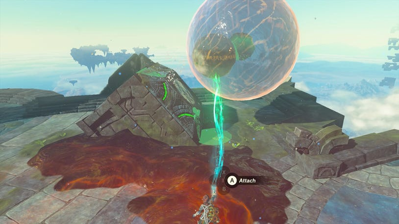

You'll want to ride the next bubble, so you can reach the platform that's higher up, too. As you approach the top, there are two important things to make note of: the hole in the water, where you want the ball to end up, and the contraption on the right.

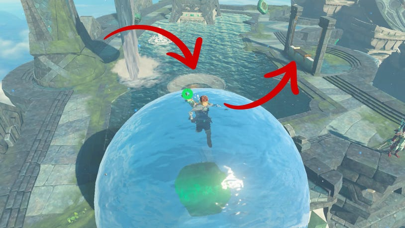

As you land, you'll see the ball bobbing in the water to show you where it's landed. Clear out the area of any ChuChu, then look at the floating platforms in the north. Pick one of these up and take it over to the contraption on the right (marked on the picture above). Put the platform on the top of the contraption using Ultrahand, and attach it.

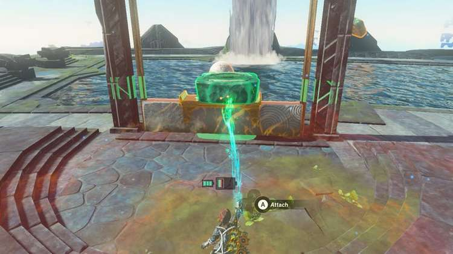

Then go and find where the ball has landed and use Ultrahand to move this so it's in position above the hole in the water. It will just float for now, so just position it above the hole then leave it.

Go to the contraption and hit the platform. The reason we've added it to the top of this mechanism is that it's a Zonai device and will keep the wall up for longer when you raise it in a moment. Now use Ultrahand to do exactly that; aim at the wall part of the mechanism and raise it, to create a wall.

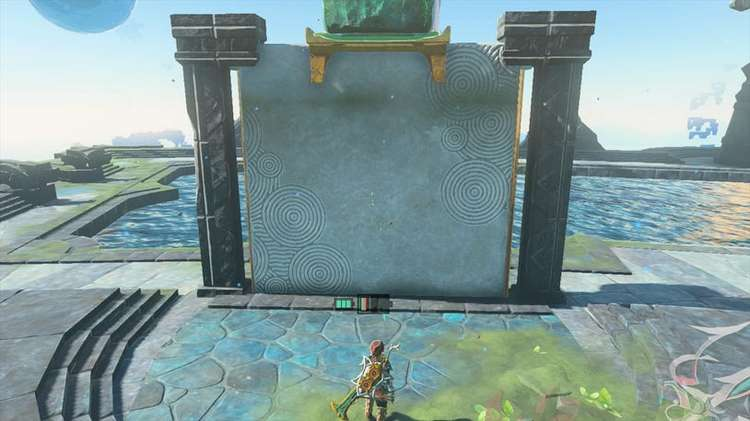

This will drain the water, drop the ball into the hole and open the gate in the room in the pool. Run over to this (and keep an eye on your battery charge, as this will show you how long you have before the door shuts again).

Alternate Solution: For an alternate way to solve this puzzle, you can also attach one of the floating platforms to the top of the ball and then maneuver it into the hole with the Ultrahand. The platform will keep the ball submerged long enough for you to go through the open door.

Inside, you'll find a wheel to turn the faucet on. For this, you'll need Sidon's help. Ask him to envelop you in a bubble, then hit the water wheel to get it moving.

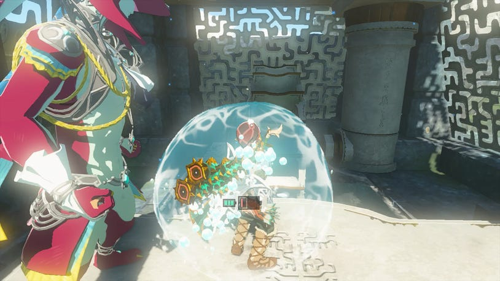

This will turn on your first faucet - just three more to go!

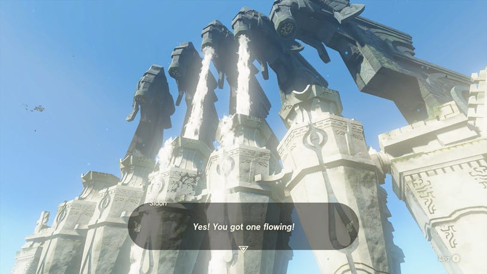

B1 Faucet

B1 Faucet

Head to the eastern edge of this platform after tackling your first faucet and look down. You should see fire coming from underneath the central platform. Glide down here.

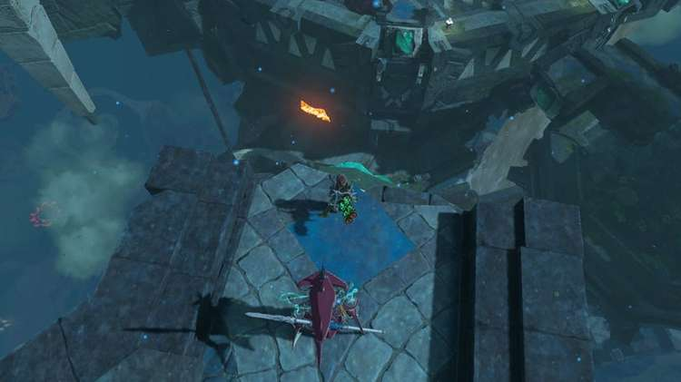

When you land, ask Sidon to provide you with a water bubble shield then run through the fire into a room.

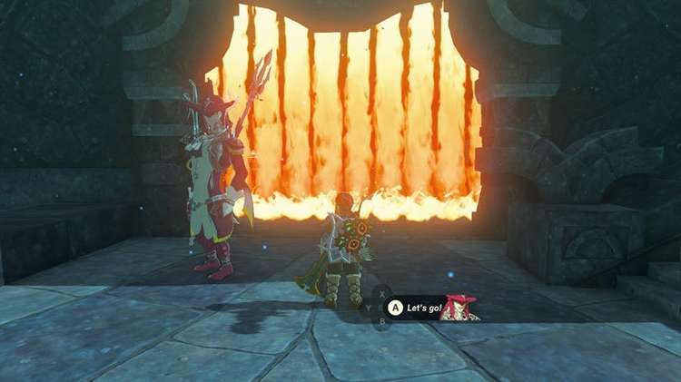

You'll see the locked door where the mechanism to turn the faucet on is, to the right-hand side of this room. There's also a floating platform stuck here.

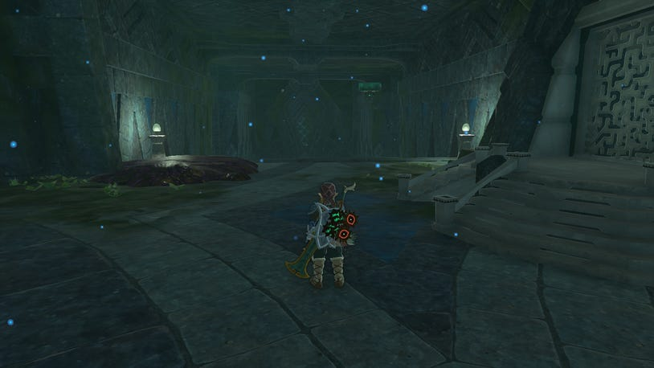

To the left, there's a button and a hole in the wall.

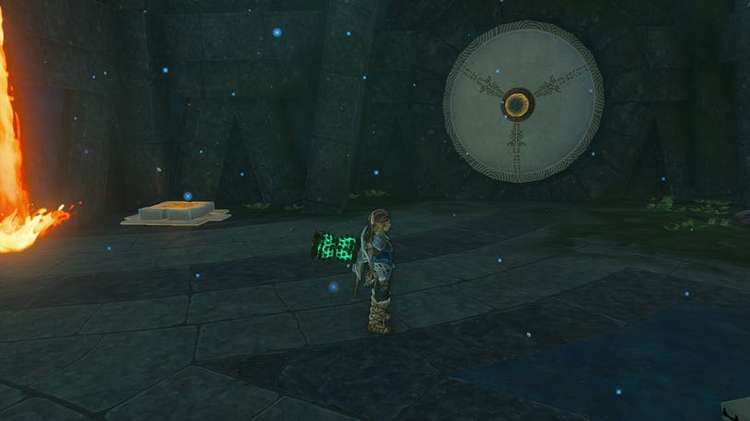

Go to the southeast side of the room to find floating platforms (above and below), a pit on spikes, and on the far side, the ball that's needed for the hole in the wall.

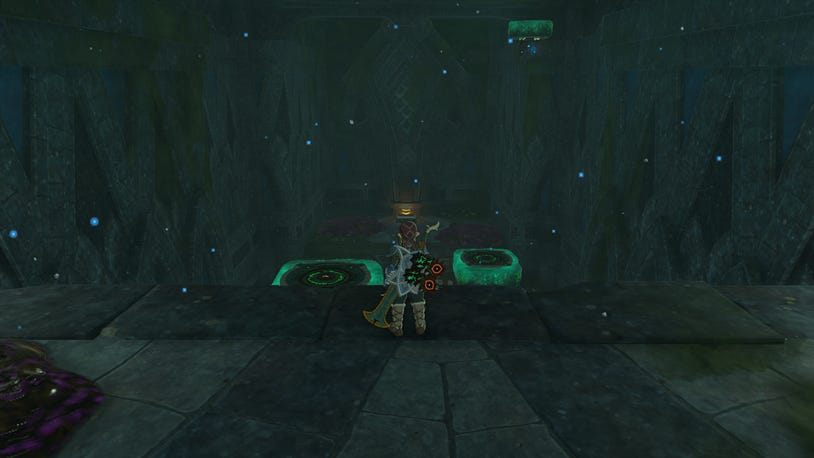

Pick up the floating platform next to the locked door, and take that over to the button to push it down. This will stop the fire and allow Sidon to come and join you. You may have to hit it to turn it off to make it drop on and weigh down the switch.

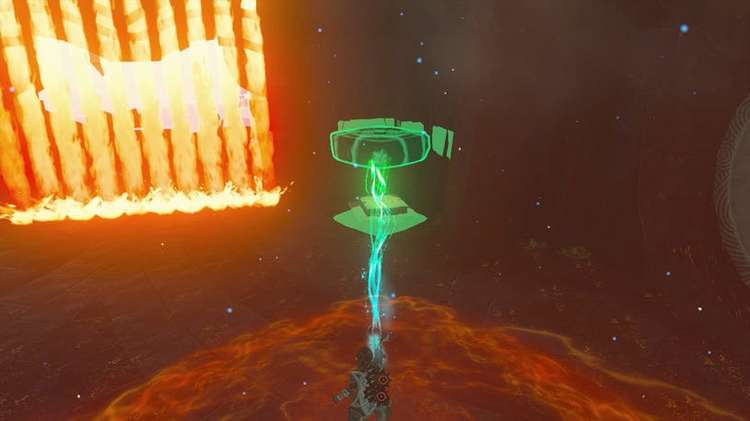

Now you just need to get the ball over the pit of spikes!

On the platform that's floating closets to the ball, there's a Treasure Chest stuck on it upside down. You can get this treasure chest by jumping over to the platforms and then using an arrow to knock it down.

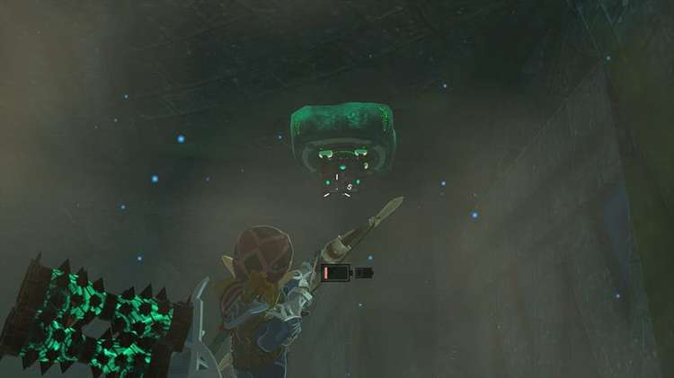

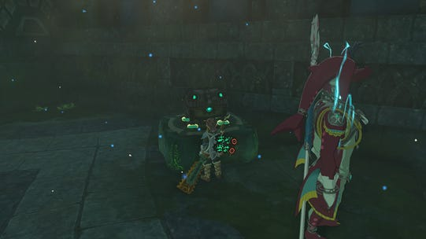

Treasure Chest: stuck to the bottom of the floating platform above the pit of spikes. Inside is a Large Zonaite.

Doing this will drop the platform down, and mean you're able to grab it. The easiest way to cross over the pit of spikes and retrieve the ball is just to form a bridge you can run across. Pick up the ball, attach it to the bridge you've just made, run back to the other side then pick the bridge up. You can also use Ultrahand to move a platform over to the other side, then attach the ball and us Recall to move it and pick it up on the other side. Your choice.

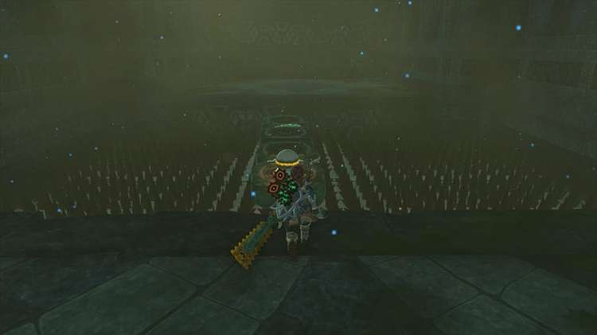

Use the platforms as steps or move them up and down again and use Recall to easily get back up top. Detach the platform with the ball from the rest of the structure, then hit it so the Zona device activates and lift it up above you.

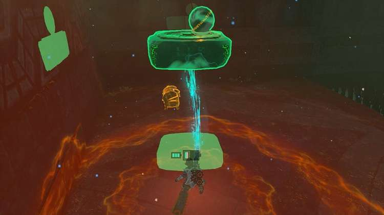

Climb up, use Ultrahand to drag the platform towards the hole in the wall, then rotate it so the ball fits inside the hole. If you do it without using one of these platforms, the ball will just roll back out.

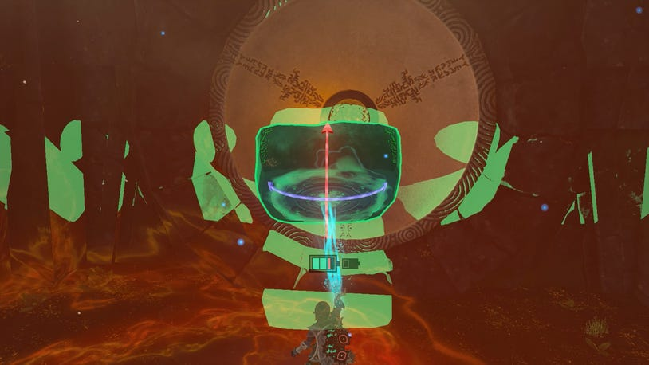

With the door open, use Sidon to activate the water shield and then hit the water wheel to turn on faucet two!

You now want to return to the center of the Water Temple. After turning on these two faucets, however, there will be enemies that appear including Soldier Constructs and Captain Constructs.

Exit this room, take the stairs to the left, and climb up to the center of the temple. When you've cleared it out, you can proceed on to faucet three.

1F Faucet Northeast

1F Faucet Northeast

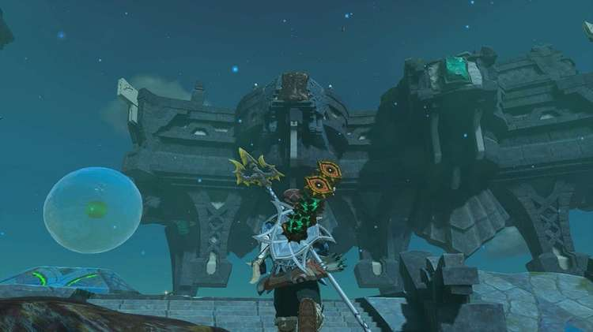

Go northeast and look towards the waterfall covered in sludge. Use an Arrow and Splash Fruit to unblock it. Alternatively, look for a stationary floating globe of water by some discarded Zonaite Spears, and fuse them to the water globe. You can then toss the spear like a javelin with the water globe attached to dislodge the sludge. You can then use this to Swim Up to the next platform. When you land, look to the right to see a Fire Like.

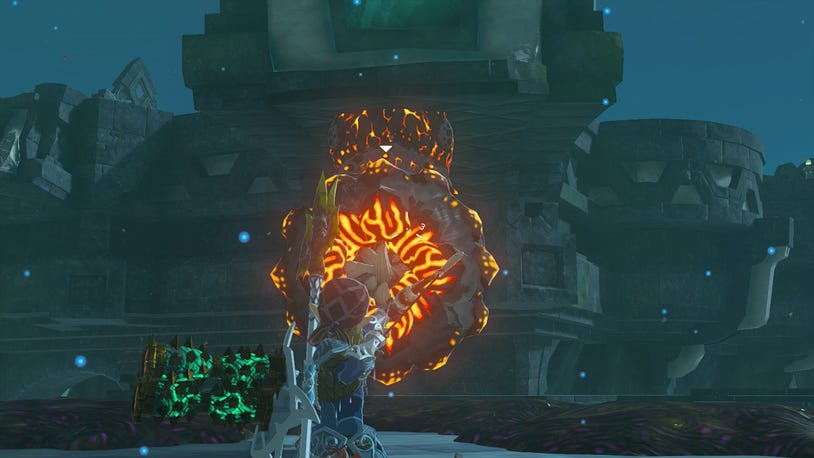

Dodge the fireballs and lure it into opening its mouth. This will reveal its weak spot, so you can quickly take it down. Once you've dealt with it, it'll drop a chest with a weapon in it.

Now head back to the northwest corner and look at the broken platforms and bubble. On the right, in the puddle of sludge is a treasure chest.

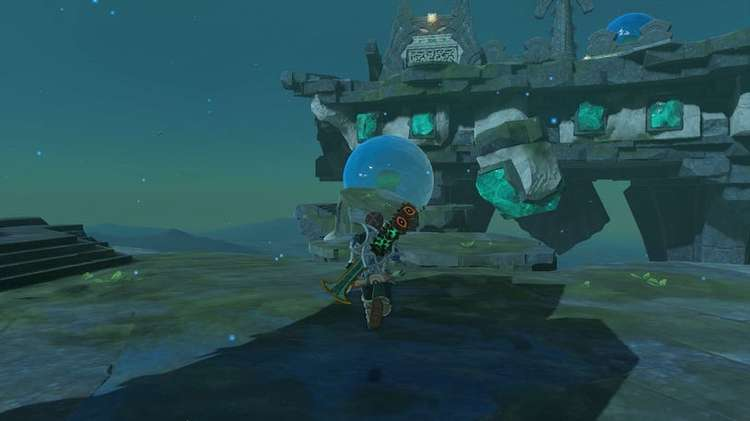

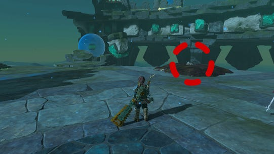

Treasure Chest: There's a sludge-covered treasure chest nearby. It contains: Arrow x5.If you're having difficulties finding it, it's right here:

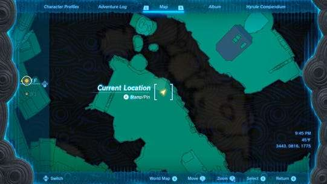

Just use Splash Fruit or Chuchu Jelly to clean the sludge blob and it'll be accessible.

These bubbles will come down from a floating platform above, so go over to where the bubbles end up, and use Recall on one of them. Jump inside it, and ride it to the top to reach the next platform.

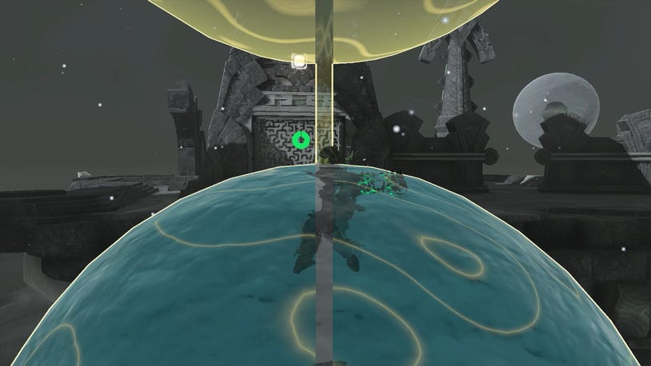

You'll land in front of the closed room that has the faucet inside, but to unlock it, you'll have to head to the right. Here you'll find a waterfall and a wheel, plus two bubble machines producing bubbles that just float where they are and go nowhere.

Go over to the water wheel, then look down to find debris at the bottom of the pool. You can use Ultrahand to pick these up and attach them to the wheel. You can kickstart the wheel by moving one of the attached blades into the water and it'll spin.

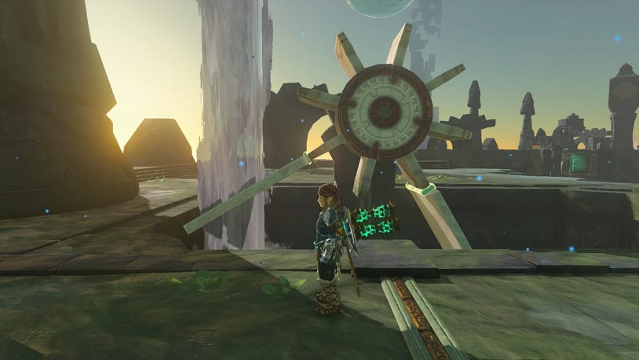

As the water propels the wheel, the path will light up yellow. If you follow it, you'll come to a break in the chain.

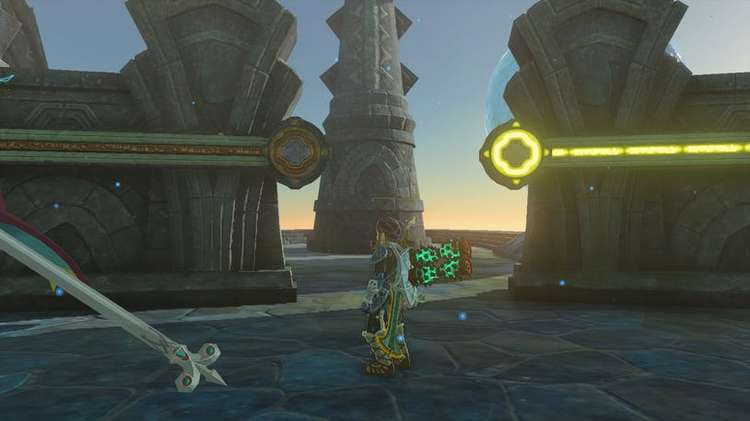

Use Ultrahand to grab a bubble and bring it over to fill the gap and connect the circuit. The electricity will surge through the water bubble, unlocking the gate and giving you enough time to run inside.

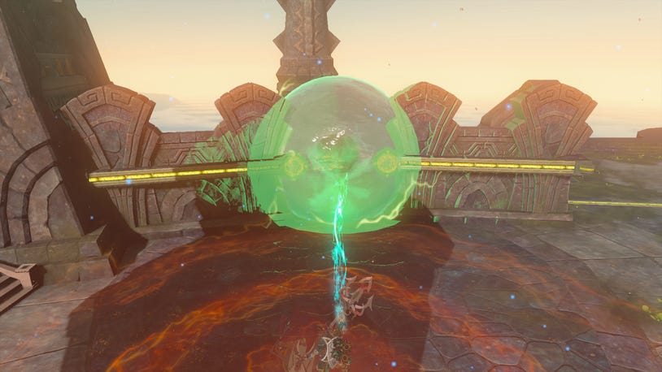

As before, ask Sidon to provide you with a water shield and hit the wheel to turn on the faucet.

Now look to the platform in the southeast, and head over there to tackle the fourth faucet. You can glide over to it, or use Ascend underneath the platform where the Fire Like was to reach it easily.

1F Faucet East

1F Faucet East

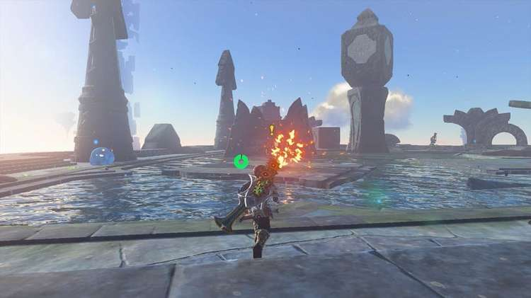

The most notable thing on this platform is the central column, with the top spinning at incredible speed. But first, concentrate on taking out the ChuChu and Soldier Constructs that are scattered around this island. The ChuChu patrol the edges, while the Soldier Constructs are on platforms in the water.

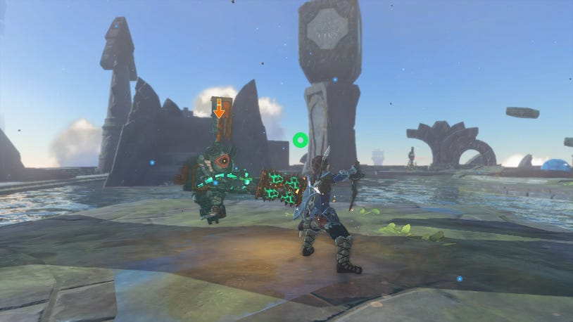

When the southern area is safe, you can collect a hidden treasure chest to the south of this area, right here, marked with the treasure chest stamp:

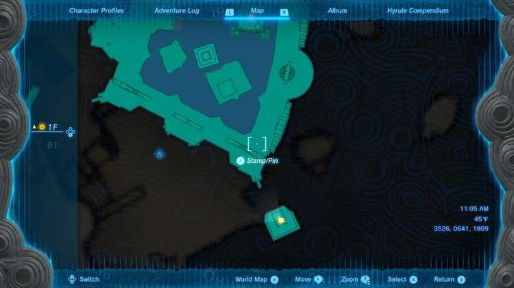

Getting over to it is a bit tricky. Look for the bubble that floats to this corner of the platform on a horizontal path. You need to divert it to an upwards, diagonal path. Luckily, you've got floating platforms and a large slab nearby to help you. Simply construct a ramp in the path of the bubble by sticking the slab to the platform and having it hover in place.

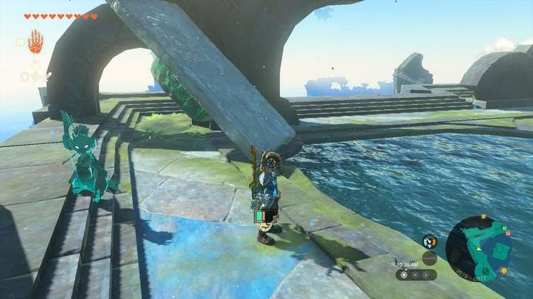

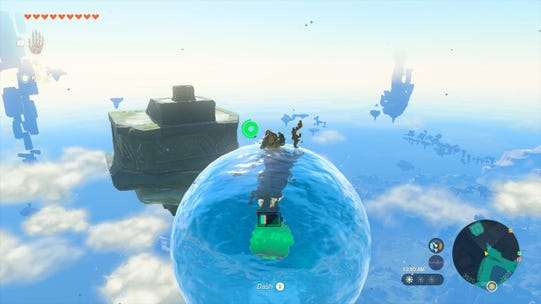

Treasure Chest: Create a ramp to divert the bubble, stand on the ramp and hitch a ride in the bubble and float across to the platform in the south to find a treasure chest containing a Large Zonai Charge.

Now continue your quest to complete the Water Temple and make your way over to the spinning top. You can try and complete the below instruction on your path from floating back from the treasure platform. If you missed your chance, there are floating platforms around here that you can use to form steps up to it, but as soon as you interact with them, the battery will begin to drain. If you're unable to use them in time, you can also use them to create a structure you can climb up.

They're incredibly sturdy, so make an upside-down T-shaped structure, so you can climb to the top and be in line with the spinning top.

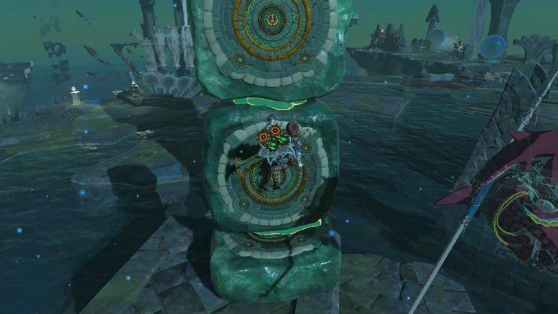

As it whizzes past, you might notice a yellow beam inside. The way to hit it is to jump up and pull out your bow. This will slow down time, enough for you to hit the beam as it slowly rotates now.

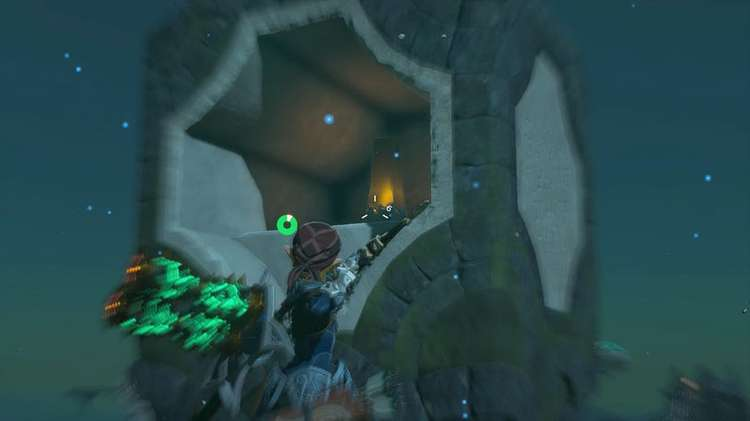

Hitting this will make the beam turn green, and the water drain.

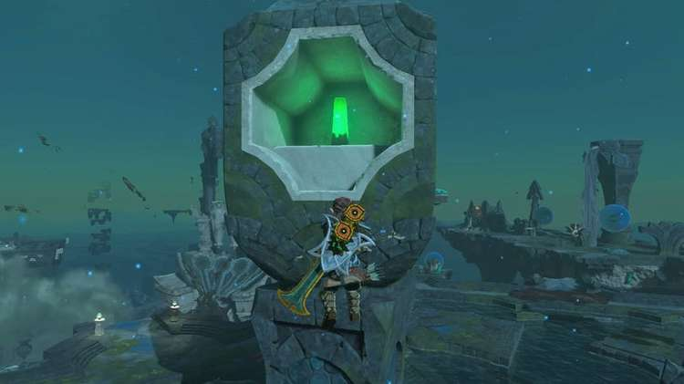

The room with the wheel will now be unlocked, but jump down into the now-drained pool and head back to the north to find a chest underneath some debris.

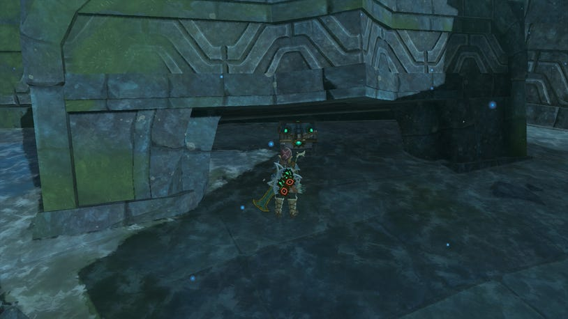

Treasure Chest: When you've drained the water in the pool for the faucet in the east. You can find the treasure chest underneath some debris on the north side of the pool. Inside is an Opal.

Go to the unlocked room and use Sidon's bubble shield, then attack the water wheel to get it spinning and turn on the faucet. With the final faucet running, it's time to return to the center of the Water Temple.

After Releasing the Four Faucets

Go back to the portal and examine it, to see the sludge being cleansed by the mass of water cascading down. While Sidon thinks Zora's Domain is now safe, that's anything but the cause of the sludge is revealed asTap to Reveal.

In an effort to keep this guide as spoiler-free as possible, this is your warning that the next part of this guide will feature a walkthrough on the boss battle for the Water Temple.

If you'd prefer to avoid spoilers, now is your chance to click away! However, if you are here for tips on beating this boss, then keep reading!

How to Beat the Water Temple Boss

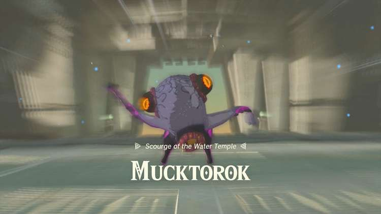

If you're not an experienced player and don't have Arrows, Elixirs/Food, or Splash Fruit, you can fast-travel out of the arena, stock up, and return before taking on this fight. However, if you have a decent sword, it's not a difficult fight.

For the first stage, Mucktorok will change immediately into a muddy shark that will swim around the arena.

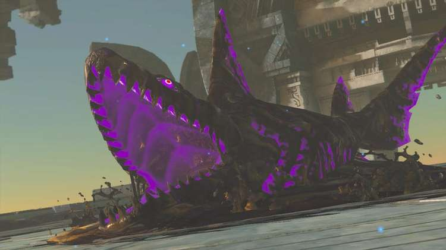

While it begins to swim around, keep in your line of sight, but stay back from it. There will be a range of moves it pulls out in this first phase, so here's what you can expect:

When the shark jumps up into the air, it will dive back into the ground and send ripples of mud rings out for an attack that covers a wide area. You can jump over these. Wait until they are about to reach you, then jump over and glide towards Muctorok.

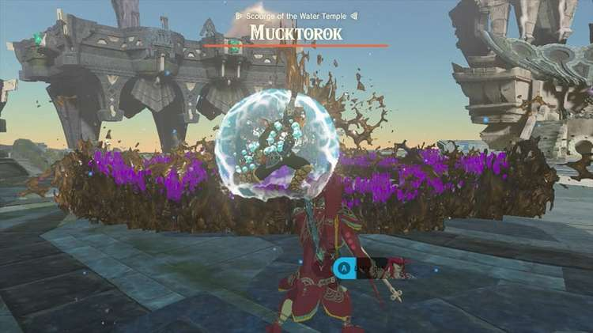

It will emerge from a mud pile and then spit a beam of purple from one side to the other. This too, you can jump over.

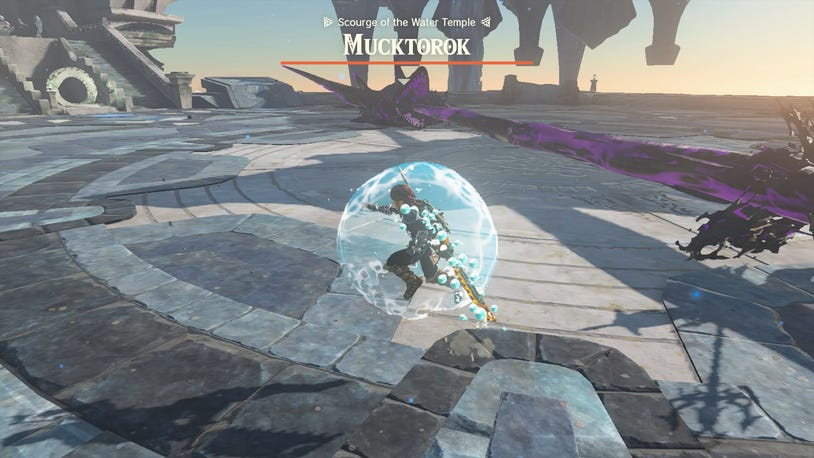

Occasionally, it will charge at you, swimming fast and chomping its jaws. Dodge these attacks as it comes charging at you.

Each time Mucktorok comes up to attack or stands still, you want to make use of Sidon's ability. Ask him to protect you with a water shield as often as possible, to negate any damage that might catch you. But when Mucktorok stops, lock onto it, and attack it to send a swiping beam of water toward it.

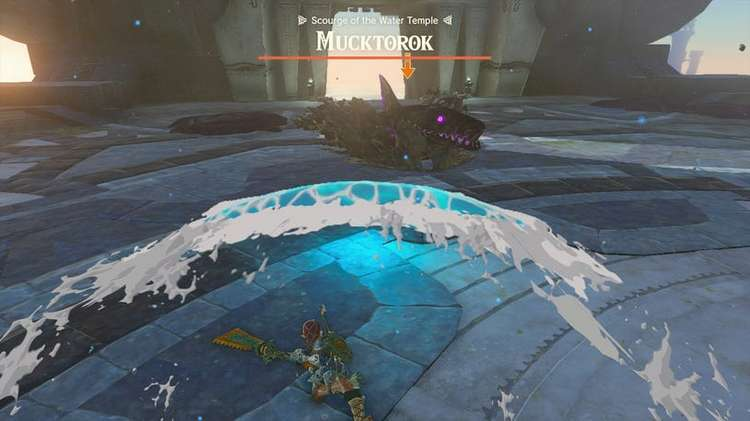

This will remove the mud from its body, and leave it vulnerable. In these moments, Muctorok will assume its octopus-like body again and begin to run away. You can jump right into the bubbling mess that occurs after you hit it with the water wave (it won't hurt you) and already start slashing at the exposed Mucktorok. It'll be stunned and open for you and Sidon to attack.

If you missed your window, the creature will try to escape and you need to use an arrow to hit it, and stop it in its tracks. Run over to it and attack it. Note that even if it flees again, you can still attack with arrows and get in close again.

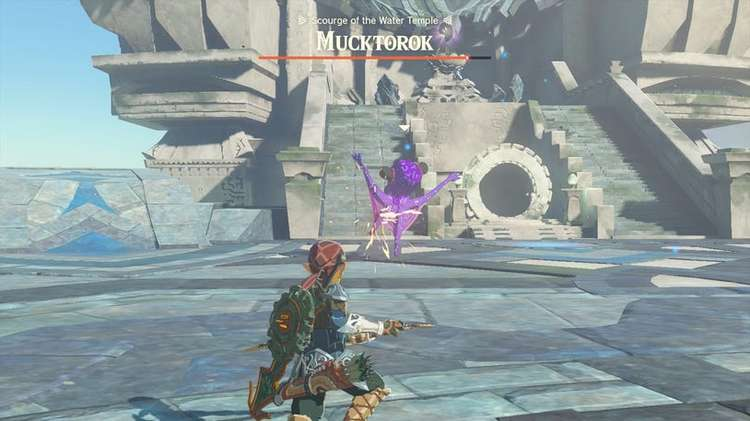

Repeat these steps, keeping yourself protected as often as possible by Sidon's water bubble shield.

As the second stage begins, the arena will change with Mucktorok dropping countless puddles of sludge around the arena, designed to slow you down significantly.

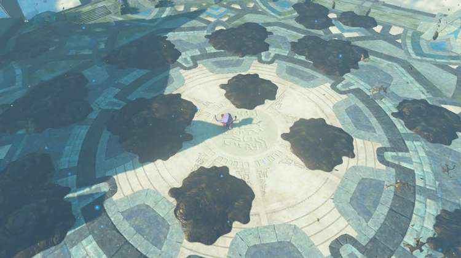

You can use water here to remove some of it, especially as the second stage initially starts. Throw a Splash Fruit down to cleanse the immediate area around you, as you no doubt will be encased in sludge.

If you're having difficulty getting rid of the muck and making the boss vulnerable, there are a few other ways to even the odds: Adding a Hydrant to your Shield will let you stream out water on command (until it breaks), but you can also try and build a Homing Cart with the Hydrant to chase the boss around if you have the supplies. You can also make use of the Opals you've found in chests to fuse them to a lower tier weapon to shoot out water to bounce around and dispel a lot of muck!

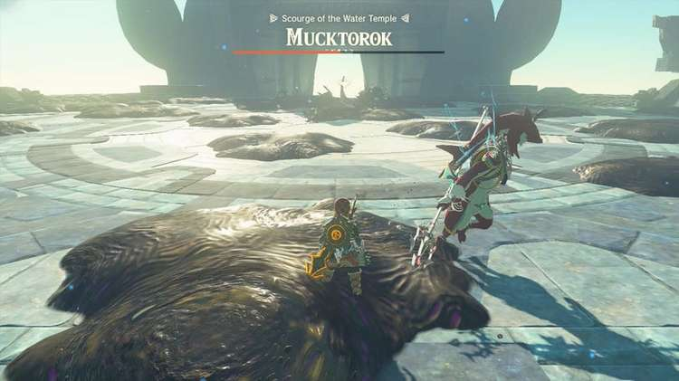

During this phase, you can expect repeats of the attacks from the first stage. You can also use Sidon's ability whenever it's charged to clear more of the area, but it's best to just focus on attacking your foe.

Note that at this stage, an additional attack will appear, which sees Mucktorok spit out sludge balls every now and again. When this happens, running towards Mucktorok at an angle is the safest bet to dodge the attacks while still getting close enough to it to wipe the sludge from its body.

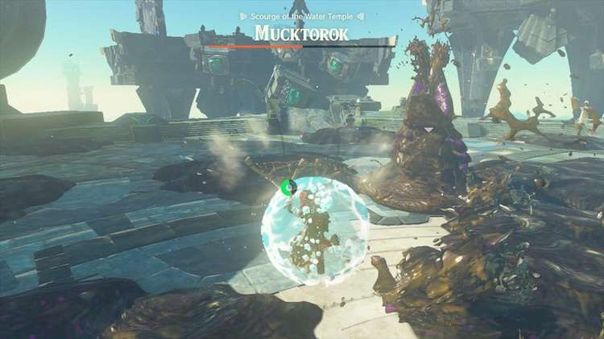

Once again use the ranged water attack with Sidon's help to take the sludge from Mucktorok and make it vulnerable. The biggest, and most annoying difference during phase two, is that when Mucktorok resembles an octopus again, instead of just running away, it will bounce in and out of the mud puddles making it difficult to aim.

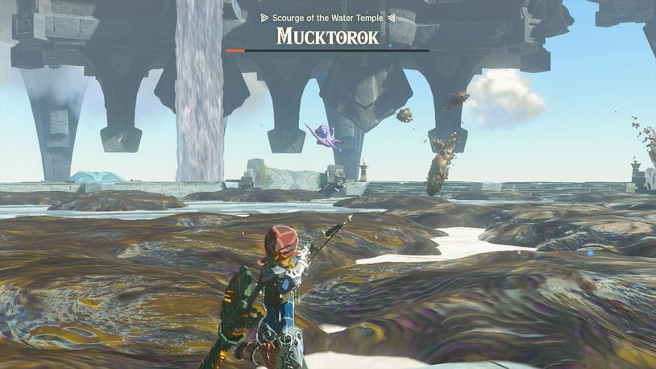

Take advantage of the weightlessness here, and jump up, then draw your arrow to slow time. This should give you enough time to aim and attack Mucktorok.

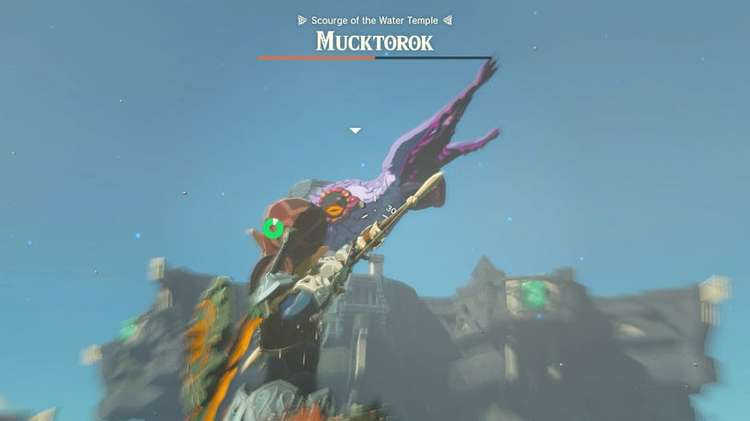

You will still only need to hit it once to down it and leave it open to attacks. Repeat this during the second phase to knock down Mucktorok's health bar and wrap up the Water Temple.

Pick up the Heart Container to refill and upgrade your heart meter and head to the Tear and talk to Sidon to continue the story.

The Sage of Water

You'll hear the voice of Sidon's ancestor -- the Sage of Water -- say: "Sidon, my cherished kin" before she lauds him for slaying the monster, reclaiming her stone, and warns you of the the Demon King. She then tells the story of the sages under Rauru's leadership banding together to face the Demon King in ancient times, but failing in their fight. Rauru sacrificed himself to seal and imprison the Demon King. She tells of the Sage of Time, Zelda, visiting her later and warning her of the return of Ganon and learning about Link. The sage pledges her support in the battle against the returning Evil.

This will unlock Sidon and his ability as a permanent support for Link. With the defeat of the Mucktorok, Zora's Domain's waters are clean and pure once again.

The Water Temple

After Completing the Water Temple

You'll return back to Zora's Domain with Sidon, and a few conversations will become available unlocking side quests for the villages of Zora. Seek out the following quest givers specifically for some good rewards:

If you didn't locate the Zora Helm on Floating Scales Island, speak with Khira and Chroma in the Throne Room to start The Never-Ending Lecture Side quest and get clues to its location. If you already found it, simply speak to them to start and complete the quest in the same conversation!

Speak to Yona near the balcony on the second floor of Zora's Domain, overlooking the statue. This will unlock the side quest A Token of Friendship to return to the Ancient Zora Waterworks to get the Zora Greaves.

Talk to Cleff at the Coral Reef general store. Cleff will ask you to get hold of 10 Bright-Eyed Crabs as part of the A Crabulous Deal side quest in exchange for a Sapphire.

Speak to Dento the Blacksmith again who will talk to Link about the Lightscale Trident, starting the side quest Glory of the Zora. For this, you'll need to find Diamonds, so be sure to check out the Diamond - Location and Details guide.

Return to Sidon later and he'll find some ancient texts that starts the Secret Treasure Under the Great Fish Quest, and you can find the Vah Ruta Divine Helm to strengthen his avatar.

If you've been chasing the leader of the Yiga since finding A Mystery in the Depths and encountered him at the Abandoned Gerudo Mine, you can travel into the Depths through the waterfall below Zora's Domain to find the Abandoned Lanayru Mine where another fight awaits you.

This is also a good time to explore further into the various outer corners if Hyrule, now that you should have a lot more power, health, stamina, and armor under your belt. The region of Akkala to the North is full of higher level enemies and intrigue, including the Horse God Shrine, and Tarrey Town which is home to a number of quests, and a spot to make your very own home!

It may also be worth your while to venture south into Faron and finally clear out the strong pirate forces that have taken over Lurelin Village, which can then let you help rebuild the settlement to its former glory!

When you're ready to move on from the Zora, head back to Lookout Landing and begin your search for next Regional Phenomena. If you've been following our guide, that just leaves the path to Gerudo Town!
