11. The Wind Temple

The Wind Temple is a large, featured dungeon in Tears of the Kingdom. Located high above Hyrule at great altitude thanks to the Great Upheaval, this structure is in the midst of a swirling snowstorm. It's majestic design is based around the myth you learn about in Rito Village about the legendary Stormwind Ark. This section of IGN’s Walkthrough for the Legend of Zelda: Tears of the Kingdom contains all the information needed to complete The Wind Temple, including treasure locations, puzzle solutions for activating all the locks, and how to defeat the boss that's caused misfortune to fall on Rito Village in the first place.

Before getting to The Wind Temple, you'll need to have completed Tulin of Rito Village.

Temples act as Dungeons in Tears of the Kingdom, and although they can be completed in any order, it's recommended that you start with The Wind Temple first. They are all parts of the Regional Phenomena series of main quests.

Note that you will need at least two levels of cold resistance to comfortably make it through the Wind Temple, whether that is through the power of an elixir, food, or gear like pieces of Snowquill Armor.

The Wind Temple Walkthrough - TotK

As you dive through the clouds, you'll land at The Legendary Stormwind Ark Wind Temple. Tulin suspects what’s causing the blizzard is coming from underneath the circular grate in the middle of the ark. Approach the fast travel portal to activate it, and in doing so, Link will attempt to lift the grate.

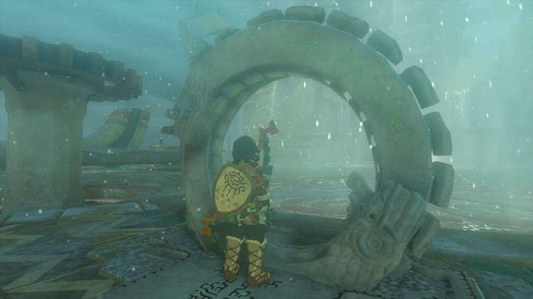

Unsurprisingly, it won’t budge, and instead, you’ll learn that you need to find 5 locks and release them to uncover what’s beneath.

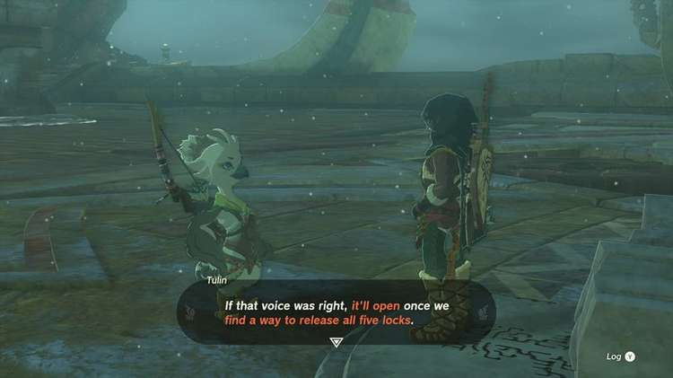

A map of the Wind Temple will flash up, showing the five locks across three different levels. You can find the locks in the following locations:

1F Lock East

1F Lock South

B1 Lock Central

B1 Lock North

B2 Lock

How to Beat the Wind Temple Boss

Below you can find an explanation of how to release each lock, in the order we'd recommend for ease. We've also included a map to highlight where each one is.

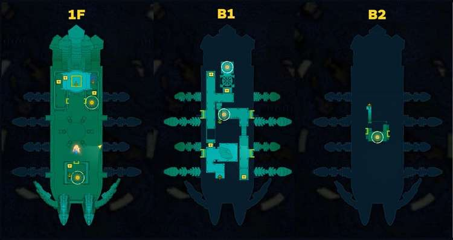

Cannons and Defense Systems: Note that the ship has several rotating cannons guarding its side entrances -- as well as one on top, toward the front. You can easily avoid the cannon fire by staying on the move when you're in their side. If you want a quieter time, you can also destroy them pretty easily. Find a safe spot to stand on. When the cannon fires, use your Recall ability to lock on and reverse time, sending the missile flying back to its origin.

The ship also has laser defense systems. It goes without saying that you should avoid touching the beams. Crouch underneath them or jump/climb over them to avoid falling into trapdoors.

1F Lock East

1F Lock East

It's easiest to start with this lock, as it'll be on the same deck as where you begin your Wind Temple exploration. Go north from the fast travel point until you reach the stairs with the locked gates on either side (you will be able to see a red laser beaming across the room at the top of the stairs behind a shutter).

The lever on the right is broken, but it’s the one you want to move in order to open the room with the lock.

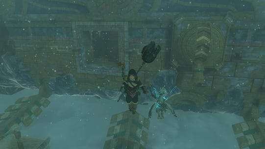

Treasure Chest: the lever on the left is fine, and opening this using Ultrahand reveals a room with a Soldier Construct and a chest inside. The chest contains an Opal.

Scan the area and pick up one of the icicles laying on the ground. Use Ultrahand to attach this to the broken lever on the left, and when it's secure, use Ultrahand again to pull it to the other side.

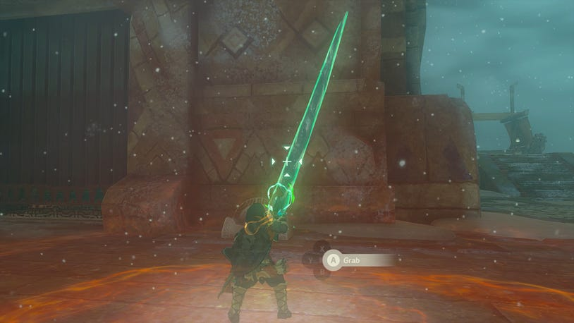

The door will open revealing the first lock. Stand in front of it with Tulin and ask him to use Gust to power it up.

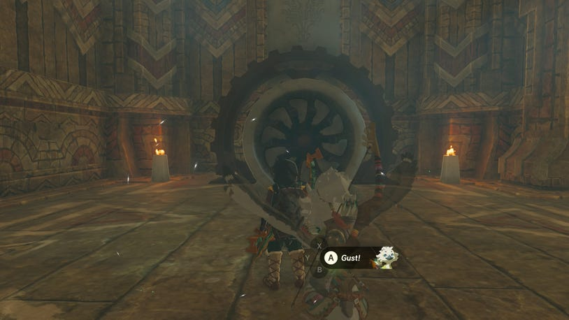

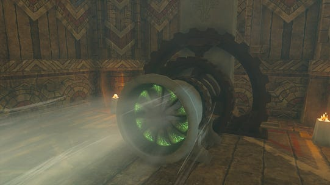

In order to release all of the locks on the ark, you need to ask Tulin to use Gust while standing in front of the fan on each lock.

B2 Lock

B2 Lock

The next lock we'd recommend going for is actually the one right at the bottom of the ship on B2. Completing this lock will allow you to climb up into the ship to reach the third one, so head to either side of the ship from the first lock and jump off. It can be tricky to spot where the landing point is at the bottom of the ship until you're quite far down.

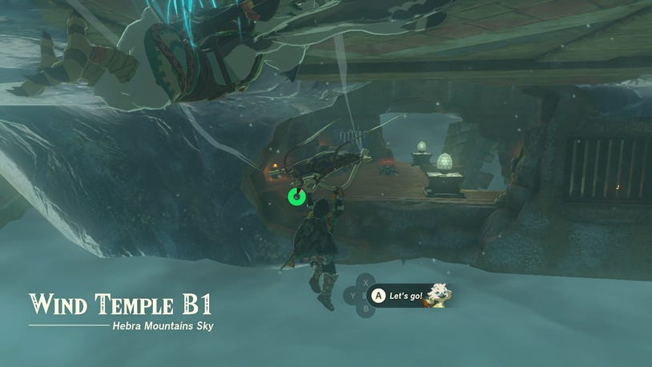

A few of the locks will need you to jump off the ship, and glide down to the openings on the lower levers.

But whether you go from the east or the west, you want to glide down and head for the bottom and middle of the ship. The lock is here out in the open, with a Soldier Construct guarding it.

If you get stuck, use Gust or the floating boats to spring yourself back up to the top of the ship. In the worst-case scenarios, you can fast travel back to the ship at any point.

Once you've activated this lock, a door opposite will open. You can see it marked in the picture below.

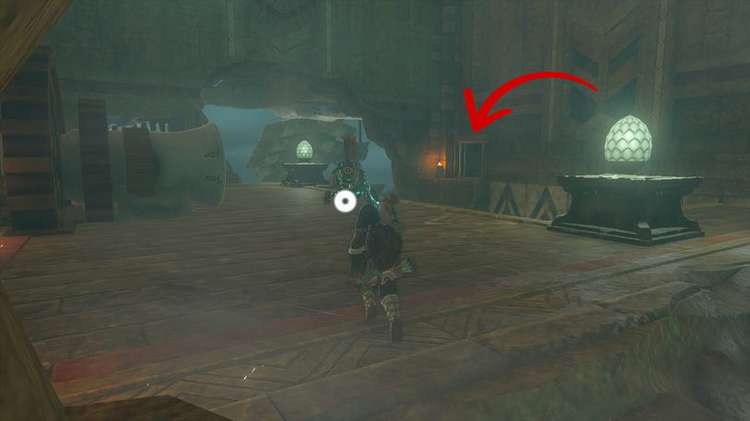

Jump over to this, and go up the ladder to be taken to B1 and the next area to find a lock.

1F Lock South

1F Lock South

After climbing up the ladder, turn left to enter a corridor with a Soldier Construct.

On the right, you'll see beams crisscrossing over each other. Beyond the beams is a chest. You can duck under or jump over these beams to reach it. If you're struggling with jumping over the beams, you can also climb on the wall and leap sideways.

Treasure Chest: the chest beyond the laser beams contains a Ruby. Duck, jump, or climb to get to it without triggering the beams.

If you trigger any of them, a trap door will open and you'll plummet below, but you can glide and find a boat to propel yourself back up. Alternatively, you can enter this section of the boat by jumping off the side and gliding down into an opening.

Head south in this corridor, towards the blocks of ice that sit by a gap in the floor.

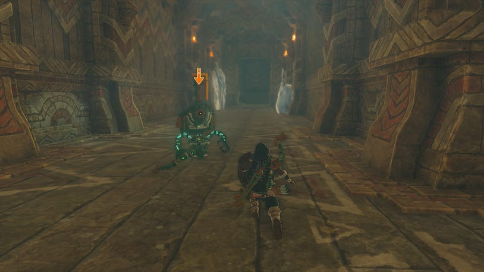

Glide over this gap to reach the other side, and you'll come to a room with stairs, and a Soldier Construct in the middle of the platform.

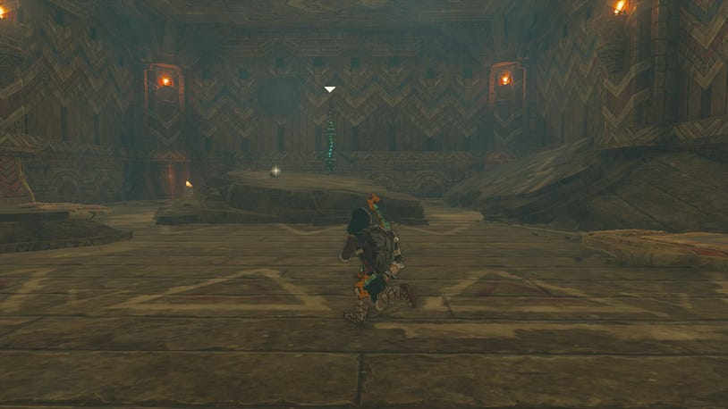

Once you've dispatched them, use Ascension to reach the broken platform above.

Here you'll see broken stone discs on the floor (including two that cover a chest).

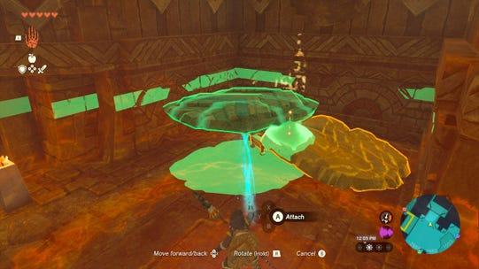

Treasure Chest: Use Ultrahand to pick up the two stone discs and move them aside to reveal a chest. It contains a Captain I Reaper (14).

Follow the room round to the other side, where a pole hangs from the ceiling and a ladder goes up to a locked door.

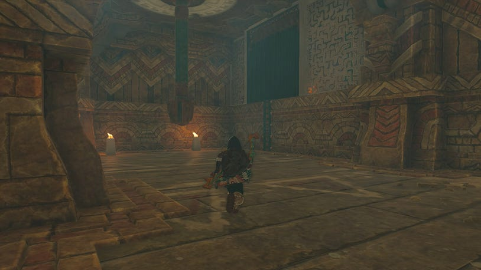

Time to make a propeller! Attach at least one of the stone discs to the pole, and ask Tulin to help blow a gust directly at it to turn the driveshaft. You can attach all four discs, but only one is needed. This will open the door allowing you to climb up and find the third lock.

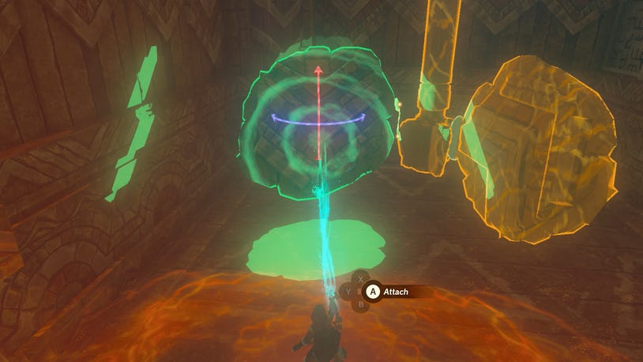

Be careful as you get to the top of the second ladder, as another Soldier Construct waits for you here.

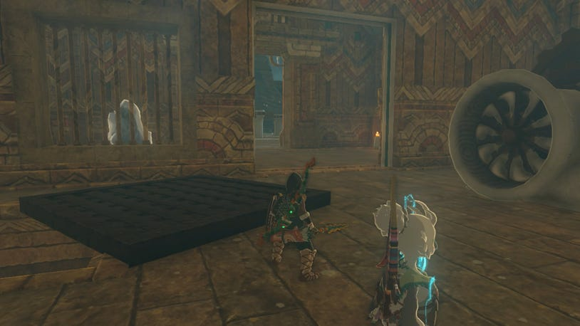

Once you've activated the lock, the door will open bringing you back to 1F on the ark.

Treasure Chest: There is an ice-covered chest here. Melt the ice to get a Soldier II Spear (15).

B1 Lock Central

B1 Lock Central

Now it's time to leap off of the other side of the ark and glide down. You'll see two openings here, both of which are blocked, but one is blocked by icicles.

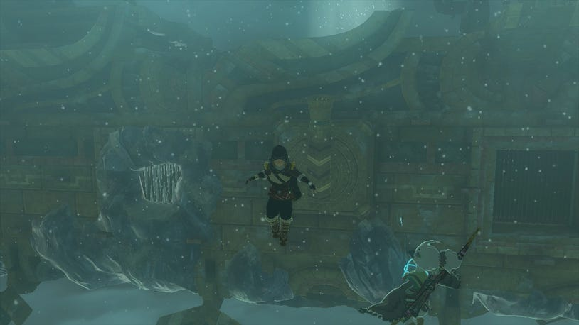

Land here and smash or melt the icicles to get through but mind the turret that's swiveling around as it will target you as you get near. You can destroy it with Recall, by sending its missile flying back at it.

Once you've cleared the icicles, go inside and take out the Keese bats. Look left to see a grate with an opening in it -- and beyond it, a treasure chest. The opening is too small for you to climb or float through. Here's how you get that treasure:

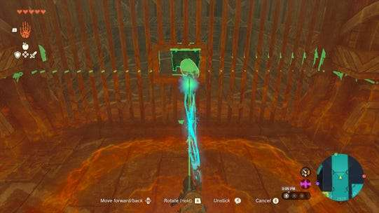

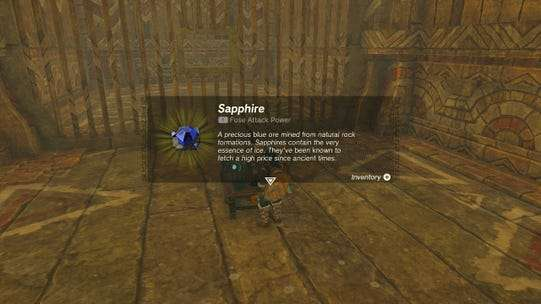

Treasure Chest: You cannot reach this chest physically -- and it's just out of reach for your Ultrahand as well. However, you can use a tool: grab a large icicle with your Ultrahand and rotate it so it fits through the opening. Move it towards the chest and attach it. You can now lift the chest through the opening. Open it to find a Sapphire.
If you didn't get it the first time around, you can return here after beating the Wind Temple boss and still get the Sapphire. However, the icicles melted -- so drop any of your long sticks or spears and attach it to the chest instead.

Now reverse direction and go to the corridor blocked by a rotating wheel.

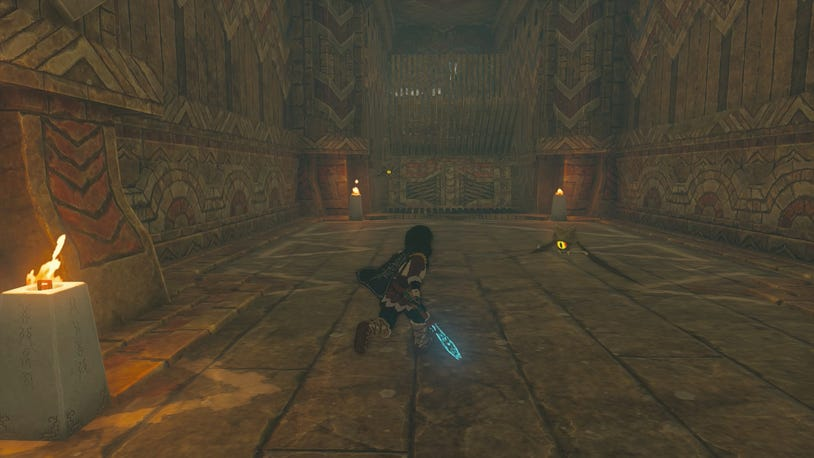

Use Recall to change the direction of the wheel and ride it into the next part of the room. While you're here, use the lever on the right to open the locked door in case you want to come back to this point later on.

Opposite the locked door, on the left, you'll see a Soldier Construct and rotating cogs. There's a gap between the cogs, which is causing the ones that control the door not to work. You can use an ice shard from the ground here to connect the two sets of cogs and get the door open.

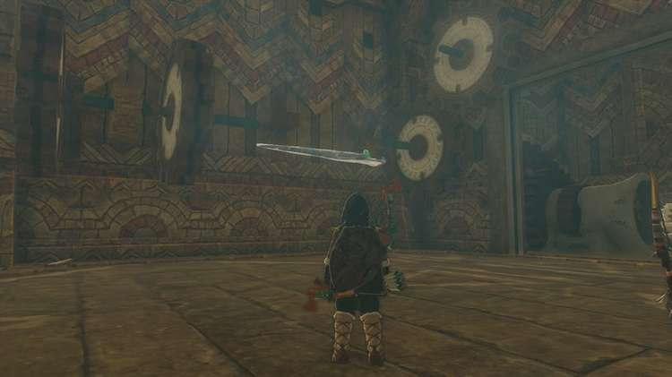

Activate the fourth lock, then exit via the door you opened with the lever, glide over to one of the boats and land back on 1F.

B1 Lock North

B1 Lock North

Now use the gust of wind in the middle of 1F near the fast travel point, to fly upwards and head north. Land at the top of the building, then use Ultrahand to open the big doors. Look down and you'll see multiple beams and a fan right at the bottom.

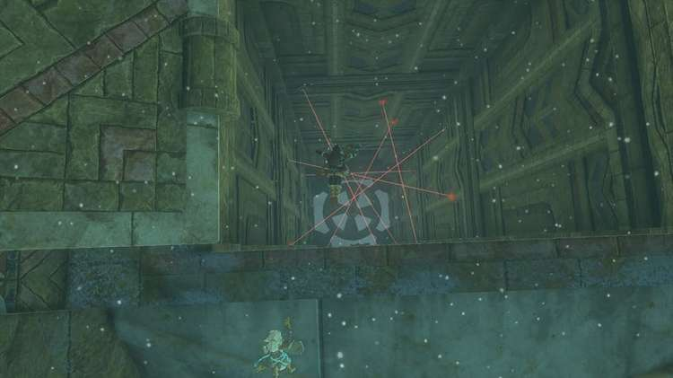

You'll want to drop down and use your Paraglider at the last moment to help you float back up and land on the platform with the lock. Once you've activated it, face south before you jump back into the wind from the fan.

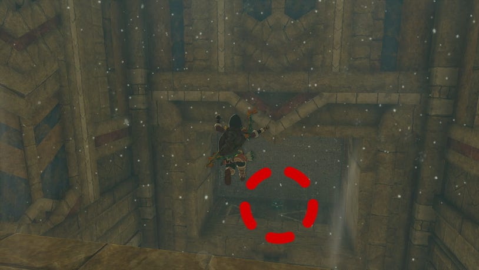

Instead, glide across to the ledge opposite and slightly below, to unlock another chest.

Treasure Chest: The ledge with the grate houses a not-so-hidden chest. You can open it by using your glider to land here. Inside is a Soldier Blade (14).

Then it's time to throw yourself back into the gust of wind and ride it all the way back up.

There are a few more optional chests you can grab nearby. You can come back later for them after completing the Temple or pick them up right now. From the top of the tower, look down to the right to see an ice-covered patch/opening on the deck level below.

Smash through it by diving or jumping on it and you will fall into a small cistern below (without taking damage).

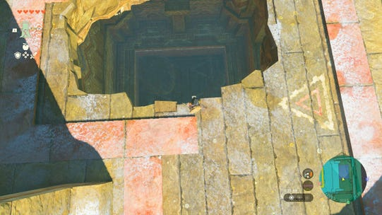

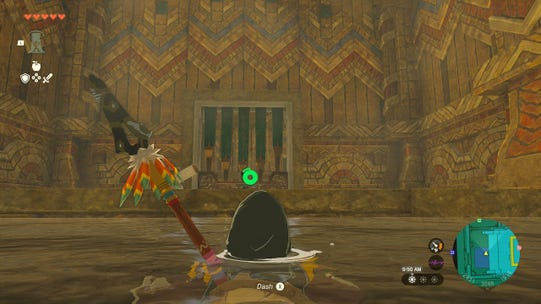

Treasure Chest: Smash the ice sheet that covers the opening or, if you're returning later, just drop through the opening to the pool below.
Look for the ice covered switch, melt the ice (using a torch, fire weapon, or shield or dropping some wood and striking a flint stone nearby). Grab the switch's lever with the Ultrahand and flip it tothe left to open the locked passage. Inside the switch is a Zonaite Shield (11).

Now go to the other side of the ship's main tower and find a frozen block of ice near its wall. Defeat the Ice Chu.

Treasure Chest: Melt the ice and open the chest to restock 10 arrows.

From this same side, look for a floating island with two crystal lights on it out near the "fins" of the ship. You can gust over to the island and return via the ships' trampolines.

Treasure Chest: Open the chest on the small, floating island to find a piece of Large Zonaite.

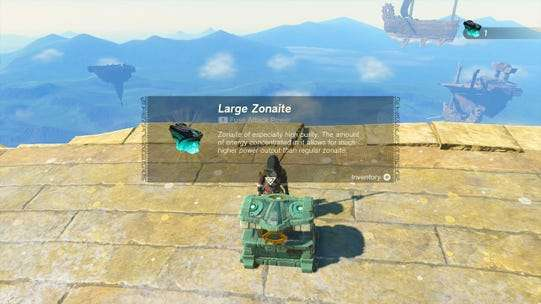

There is one more floating island just like it on the opposite side of the ship. Propel yourself in the air via the propeller in the center of the ship and float over there.

Treasure Chest: Open the chest on the second floating island to find a Strong Construct Bow (11).

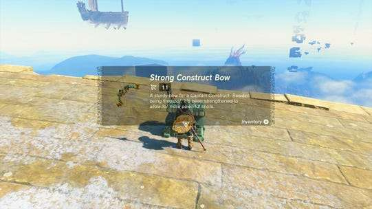

Now return to the fast travel gate so you can finally activate all the gears and open the grate.

After Releasing the 5 Locks

Go back to the portal and examine it, which will result in the grate in the center of the ark finally opening. Both Tulin and Link will be propelled into the air, with the cause of the blizzard being revealed as Tap to Reveal.

In an effort to keep this guide as spoiler-free as possible, this is your warning that the next part of this guide will feature a walkthrough on the boss battle for the Wind Temple.

If you'd prefer to avoid spoilers, now is your chance to click away! However, if you are here for tips on beating this boss, then keep reading!

How to Beat the Wind Temple Boss

The Scourge of the Wind Temple Colgera emerges from the grate in the center of the ark and immediately begins to circle the skies around Tulin and Link.

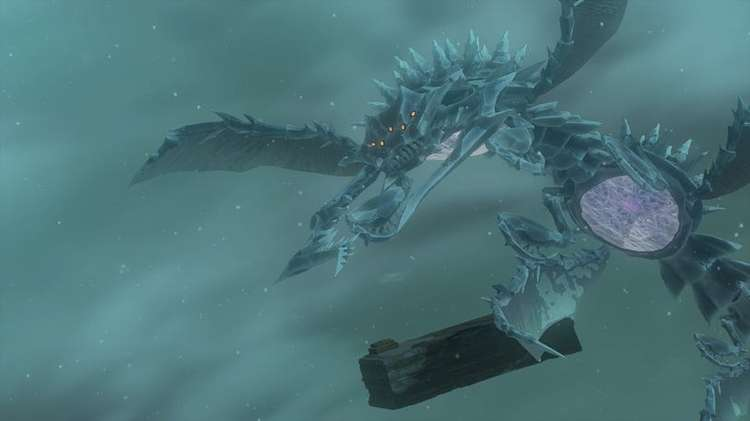

For this boss battle, you're going to be up in the sky and alternating between gliding, using Gust, and falling. There are a few different ways you can make quick work of this boss, by targeting the circular ice patches on its body.

Here's how we did it:

As soon as the fight starts, drop below Colgera and use glide to get as close to the underside of its body. There are fewer ice spikes on the bottom part of its body, so you have less chance of being harmed in comparison to attacking from above.

Use fire where you can. We used Fire Fruits on arrows, to target the pink-tinged weak spots. You'll need two well-placed arrows for each circular ice patch. The first will shatter the ice, exposing the weak point, while the second shot will destroy it completely.

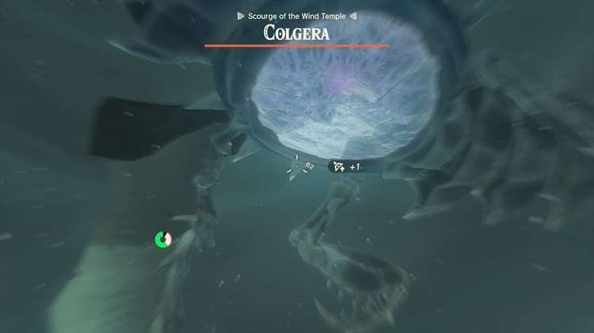

When you're aiming, time will slow down. But it will also drain your stamina. If you can't line up the shot the first time, or you fire an arrow and Colgera is too far away, don't be afraid to just reposition until you're as close as possible to it.

It will take around 6 shots to take out the three sections of its body with the circular ice patches. However, as you start to remove these, Colgera will begin to disappear in the metallic orbs that appear in the sky. You'll have to keep an eye on your surroundings, as it emerges suddenly and tries to swipe you.

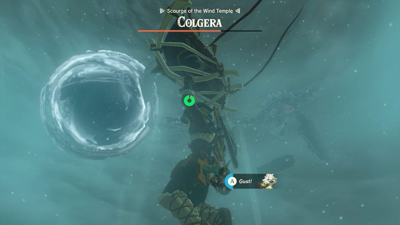

When you've got Colgera down to half health, its attack pattern will change and it will start to use tornados. Glide out of the way of these, but if you get into a sticky situation, save Tulin's Gust for these moments, to quickly jet away from them.

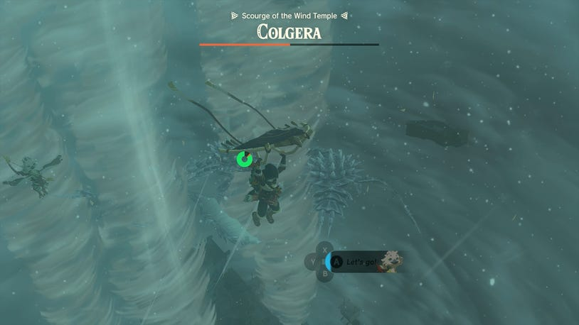

If you're above Colgera, watch out for its attempts to launch icicles at you. You can glide around these, dodging them, or fall to quickly dash out of their line of fire.

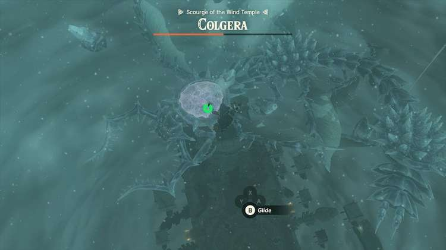

During the second phase, you'll just need to repeat what you did in the first phase and remove the ice patches that have regenerated on Colgera's body.

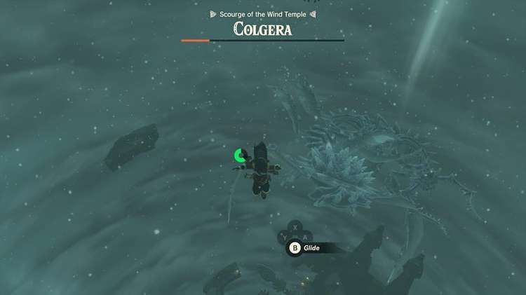

When you've shattered all the ice patches, a cinematic will play out with the blizzard resolved. You'll return to Rito Village, to speak to Teba and Saki again and have one Regional Phenomena checked off.

The Wind Temple

After Completing the Wind Temple

With the Wind Temple completed and the icy blizzard phenomena gone, life in Rito Village will return to normal, as the adults return from foraging and take over the shops their children were running. A few more Side Quests will have opened up, and we recommend undertaking Treasure of the Secret Springs from Tulin to a find a special helm. You can also travel north of the village to the Flight Range to partake in Kaneli's Flight Training, and then explore north of Hebra Peak to find Selmie's Spot and The Duchess Who Disappeared Quest.

When you're ready to live the Rito Region, you may want to consider taking the eastern road as it passes by a lot of other quests, as well as a large Geoglyph above the canyon, and leads to Snowfield Stable, where you can get a new steed by taking on a Potential Princess Sighting quest: Zelda's Golden Horse.

If this is the first temple you’ve completed, be sure to go back to Lookout Landing. You'll find new optional main missions, side quests and adventures have become available. In addition to this, new features will have unlocked and available to use. Here are just some of the things we recommend going back and exploring or completing before setting off for the Eldin region:

Head to the center to meet a Goron who talks about Death Mountain and mentions a Woodland Stable, for an idea of where to go next

Speak to Josha who asks for further help with investigating the depths, unlocking the optional main story mission A Mystery in the Depths

Hestu will now appear in Lookout Landing, next to the Armor Shop and General Store towards the south. Speak to Hestu to expand your inventory further, if you've been collecting Korok Seeds

Speak to Lester, next to Hestu who will give you an update that the stable at Lookout Landing is almost complete. This will start the side quest The Incomplete Stable. All you need to do to complete it is pick up the roof plank by Lester's feet, and slot it into the gap at the top of the stable. This will unlock the Lookout Landing mini stable for you to now use.

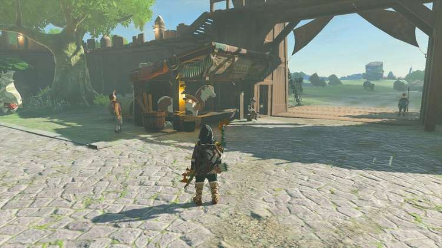

Note: the mini stable can't offer all the services a fully-fledged stable can, so you can only register, board, and retrieve horses here.

Talk to Wortsworth in the southeast, by the stone tablet that’s fallen into the water. They explain they can translate the ancient Hyrulean with his notes back in Kakariko Village unlocking the Messages from an Ancient Era side adventure.

Speak to Purah and she'll tell you about the village she's concerned about as well as the remaining regions you need to explore. The village is Kakriko Village, which Wortsworth almost mentioned. She'll tell you to head down into the Emergency Shelter to find out more information from Atmus. If you also talk about the remaining Regional Phenomena, Purah will suggest that the Eldin region is probably closest.

Drop down into the Emergency Shelter and speak to Jerri and Anson in the north. They've found a hole in the wall that a creepy voice is coming from, which starts the Who Goes There? side adventure

You can pray at the Goddess Statue in the southeast of the Emergency Shelter you have Light of Blessings from completing Shrines

Speak to Atmus in the south, near the map if you want to learn more about Hyrule and its people

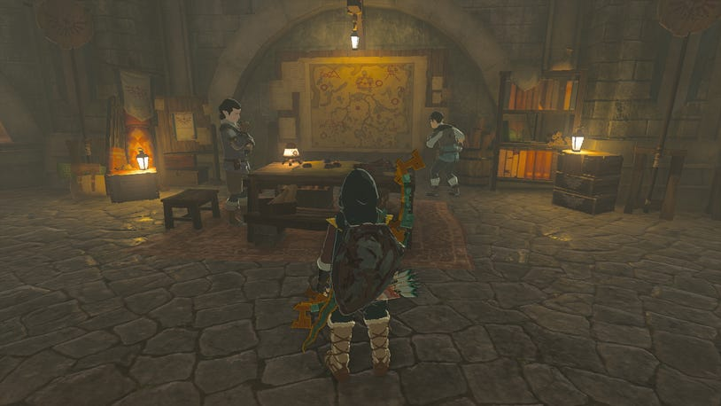
