26. To Gerudo Town

Before Setting Off

If you completed The Water Temple as your third stop, you'll return back to Zora's Domain with Sidon, and a few conversations will become available unlocking side quests for the villages of Zora.

Speak to Yona near the balcony on the second floor of Zora's Domain, overlooking the statue. This will unlock the side quest A Token of Friendship to get the Zora Greaves.

Talk to Cleff at the Coral Reef general store. Cleff will ask you to get hold of 10 Bright-Eyed Crabs as part of the A Crabulous Deal side quest.

Speak to Dento the Blacksmith again who will talk to Link about the Lightscale Trident, starting the side quest Glory of the Zora. For this, you'll need to find Diamonds, so be sure to check out the Diamond - Location and Details guide.

Stop by Lookout Landing

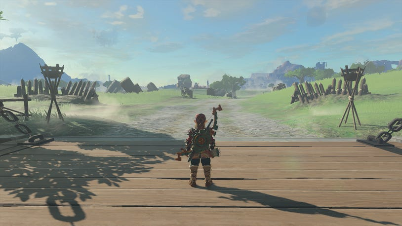

Return to Lookout Landing and see if any additional quests that were not previously available have shown up, such as:

Robbie's Hateno Village Research Lab side adventure.

It's also a good idea to speak to Hestu, if you've found more Korok Seeds, to expand your inventory.

If you speak to Purah for insight on how to get to Gerudo Town, she recommends resting at a stable along the way, which we've included in our walkthrough below

Stop by the stable as you leave the south gate to speak to Lester and pick up Spotting Spot as a side quest

Towards Gerudo Town

Starting from Lookout Landing, take the south gate and cut across Hyrule Field. Head for Hyrule Field Chasm and stop by Jiosin Shrine to activate and unlock it, if not complete it.

Jiosin Shrine

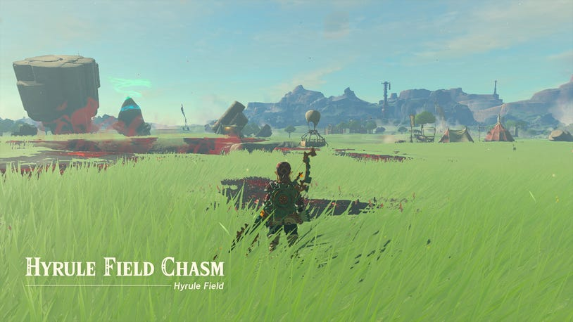

From here, pick up the trail that's going southwest. This will take you through Hyrule Garrison Ruins. While you're passing, you'll see Hoz patrolling the field, and you should speak to him to begin the side adventure Bring Peace to Hyrule Field!

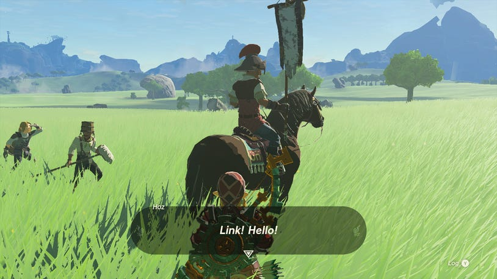

When you've passed through the Hyrule Garrison Ruins, we'd recommend a little detour to go south and activate the Hyrule Field Skyview Tower.

Hyrule Field Skyview Tower

Just before you reach it, you'll also pass the Mayachin Shrine, too.

Mayachin Shrine

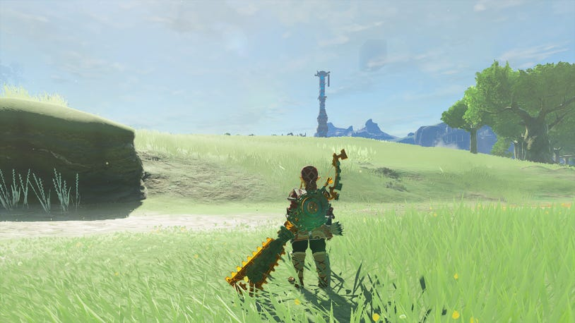

Once you've activated the Hyrule Field Skyview Tower, glide down to the west, towards Aquame Lake. You can find the Aquame Lake Well, guarded by a Moblin just off to the west here at the coordinates: -0877, -1100, 0021.

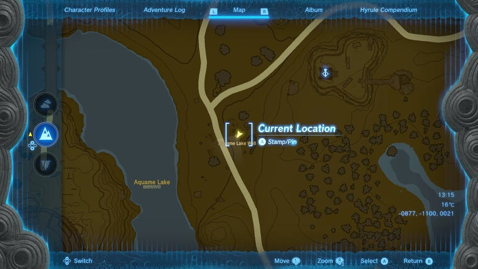

Show Spoilers

From the well, join the path and head up north, slightly backtracking on yourself. But as you reach the point where the path splits when you reach the ruins and building site, go left (northwest) and through the ruins so you can loop around and go towards Aquame Lake.

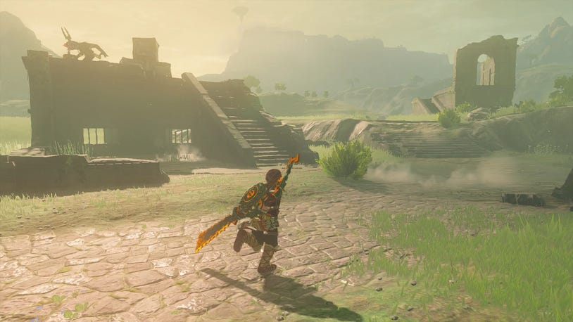

Be sure to break the boxes that the Bokoblin guards in the ruins to not only grab hold of some Arrows but also pick up cooked food like Roasted Bass and Blackened Crab.

Follow the path so you reach start to slope up and go south across the bridge climb up the side of the Coliseum Ruins and look down towards the path on the west side.

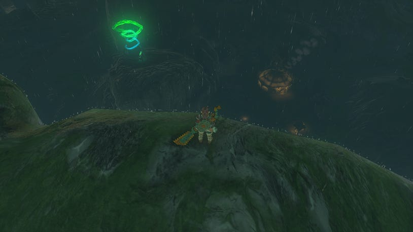

You'll see a shrine here and the glow of a stable, so glide down to unlock the stable, which is the Outskirt Stable, speaking to Embry here will reward you with Pony Points if it's your first time visiting and he'll tell you about the Zonai ruins at Digdogg Bridge.

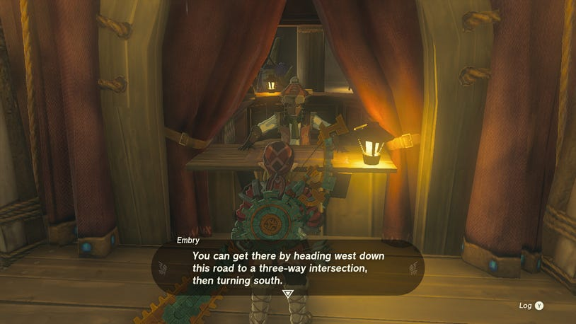

Speak to Toffa by the horses and it'll start The Horse Guard's Request. You can also find the Outskirt Stable Well on the south side.

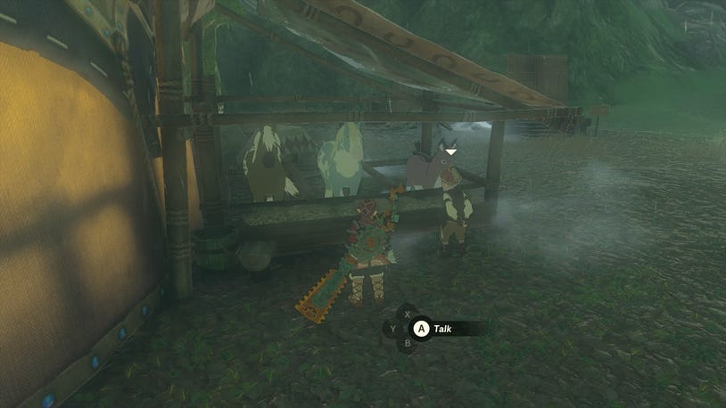

Climb up to the Tsutsu-um Shrine for at least a fast travel point back to this section.

Tsutsu-um Shrine

Then hop back down onto the path to go south towards the three-way intersection by the construction materials. When you reach it, start to go southwest to make your way across to the Digdogg Suspension Bridge.

Show Spoilers

Just before the bridge, you'll reach a section with multiple Soldier Constructs and a Captain Construct. Shock ChuChu will emerge as you get closer, and you can use them to electrocute all the constructs around them. Let them fight each other before approaching, and just tackle whoever wins.

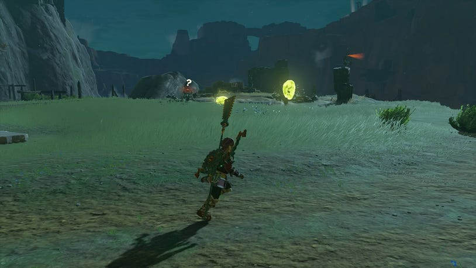

The path will curve and allow you to join the bridge that will take you over to Gerudo Canyon Pass. Halfway across you can find a Mini Stable to collect Pony Points if it's your first time visiting.

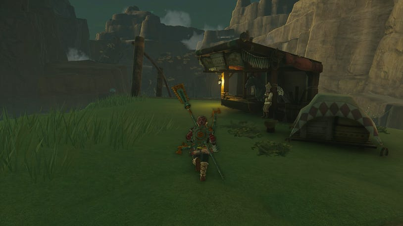

When you reach Gerudo Canyon Pass, speak to Quince by the fire to start the Disaster in Gerudo Canyon.

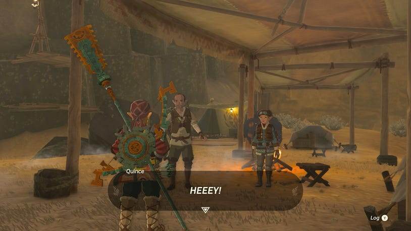

Proceed into the Gerudo Canyon Pass, or at least attempt to, as Naia will stop you and you'll have to answer every question right to be allowed through. If you want to know the answers for the questions, you can check the spoiler below.

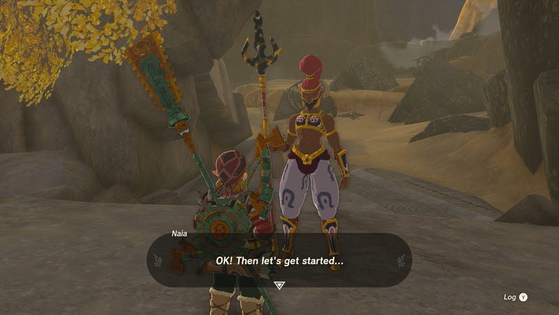

Show Spoilers

When you answer all the questions right, she'll let you pass and give you a Spicy Pepper as a reward. As you enter Gerudo Canyon, you can head southeast to find a cave protected by a Fire-Breath Lizalfos called the Stalry Plateau Cave.

Stalry Plateau Cave

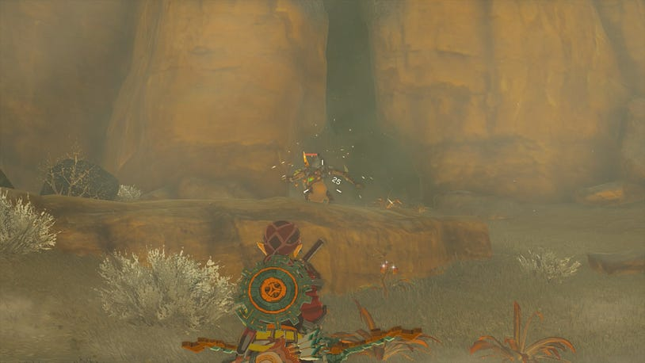

Find Botrick cowering in the corner, and a cutscene will begin with two more Lizalfos appearing. Kill them and speak to Botrick again to update the Disaster in Gerudo Canyon side quest.

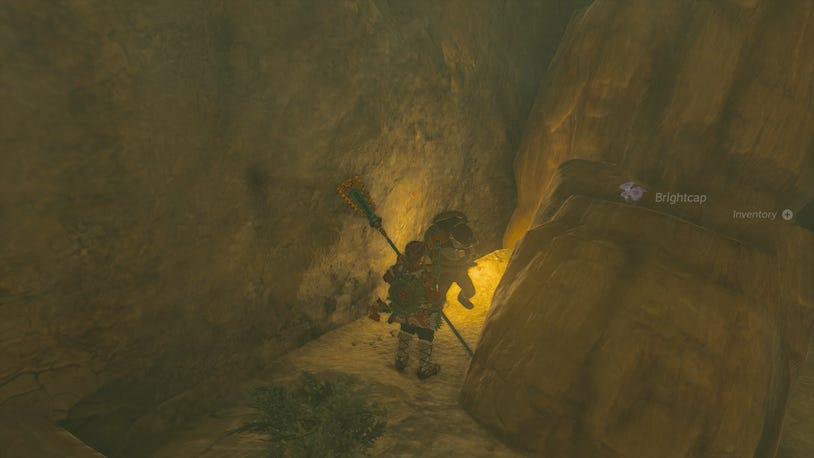

While you're here, look up to see the Bubbulfrog for this cave above.

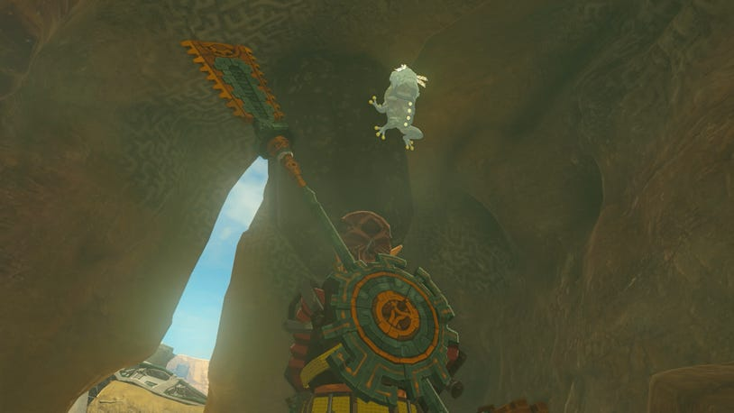

In the west corner, you'll see a pile of tumbleweeds. Smash through them to uncover the chest that contains Knight's Shield (40).

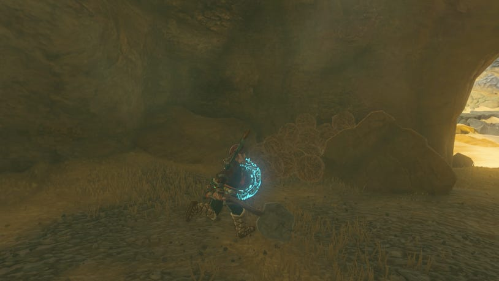

Leave the cave and then continue to head in the direction of Gerudo Town.

If you follow the path from Gerudo Canyon Pass going west, the path will start twisting up to the northwest and back around to the southwest to get to Gerudo Town itself.

As you enter the next section of the canyon, you should spot some smoke rising from a campfire. As you reach the campfire you'll find Giro. He'll ask for a Splash Fruit to help cope with the heat.

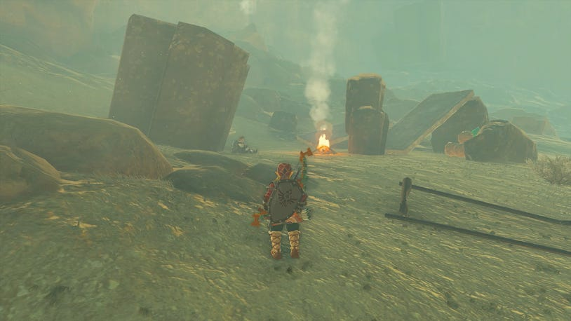

If you're able to provide him with one, he'll be able to meet up with his friends again and Disaster in Geurdo Canyon will update.

Nearby, you'll find all of the components needed to craft a vehicle. As well as this, you can find a shrine crystal that will allow you to unlock a shrine a little further up. Use the vehicle to move across the canyon, and climb up the steps in the water.

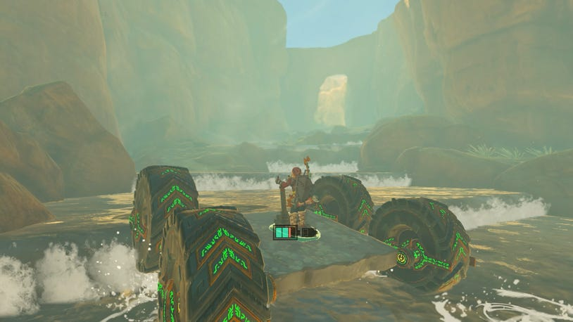

Eventually, the water will become too deep and you'll have to swap to a raft. At this point, you'll have reached a small island and find a plank of wood, as well as a fan and steering control half-buried in the sand. Use the Gerudo Canyon Crystal on the upcoming shrine to unlock the Rakakudaj Shrine.

Rakakudaj Shrine

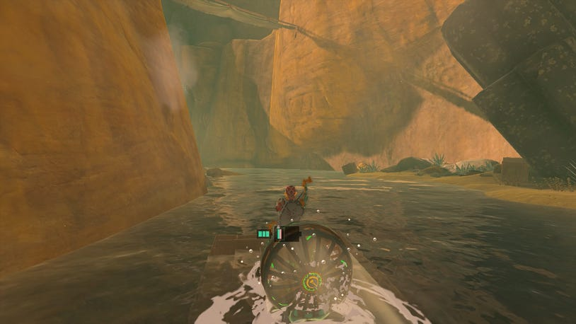

From here, continue along using the raft. As you get to the end, if you've completed Restoring the Zora Armor, you can equip the Zora Armor and swim straight up the waterfall. Glide down towards the south here, and look for the next campfire with smoke coming from it. If you don't have the Zora Armor, you can always climb up the canyon here.

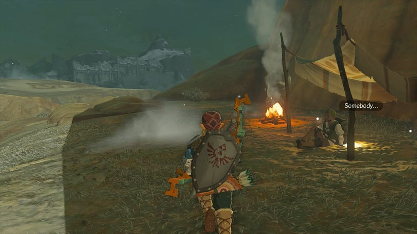

At the campfire, you'll find Garill. He'll ask for a Spicy Pepper to warm up, and if you're able to provide that, the Disaster in Geurdo Canyon quest will update again. From Garill, go southwest, and look up to see the Skyview Tower.

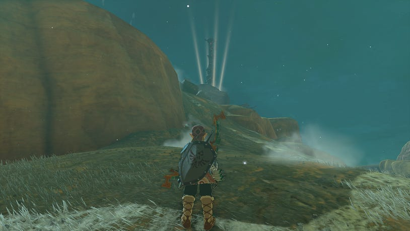

Make your way toward the Gerudo Canyon Skyview Tower, then activate it by helping Sawson reach the top of the mountain so he can fix the Skyview Tower. You can do this by climbing up to the top of the pulley and using the construction materials nearby to create a weight that will bring the pulley down and lift Swanson up.

Gerudo Canyon Skyview Tower

Activate the Skyview Tower, then glide down from here towards the Geurdo Canyon Stable and Turakamik Shrine just off to the northwest. Aim to land at the Turakamik Shrine first, then jump down to the Gerudo Canyon Stable.

Turakamik Shrine

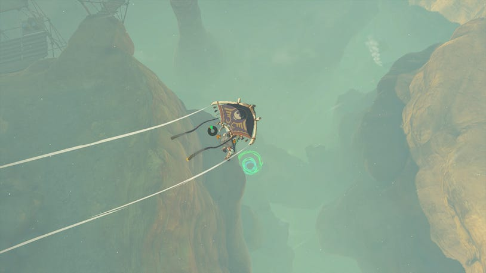

From here, follow the path west into the Gerudo Desert Gateway. You'll see a stand on the right, where you can get shade, and off in the distance slightly to the left, an oasis where you can stop and explore the Kara Kara Bazaar.

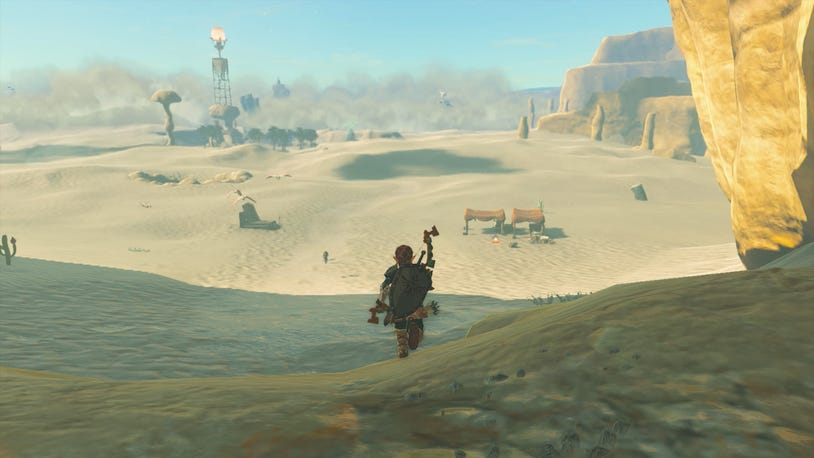

On the right of this oasis, is the Mayatat Shrine.

Mayatat Shrine

Speak to Saula in the bazaar to get hold of the Desert Voe Headband, which costs 450 Rupees. This will give you some heat resistance to help you cross the desert.

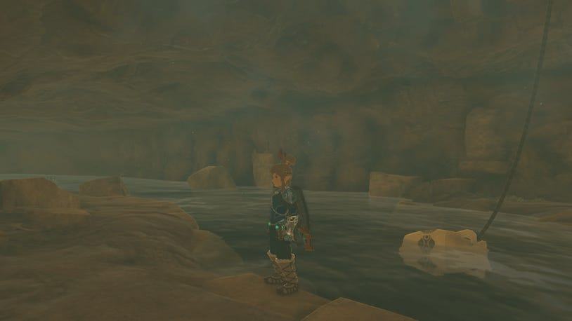

Getting to Gerudo Town from the Kara Kara Bazaar is just a matter of heading west, however, as soon as you enter the desert the sandstorms will interfere with your map, making it harder to track where to go. Here are a few things to help as it can be disorientating:

Generally head southwest, from the bazaar

Use the tornados to glide above the sandstorm. Whenever you're above the sandstorm, you can still see and use your map

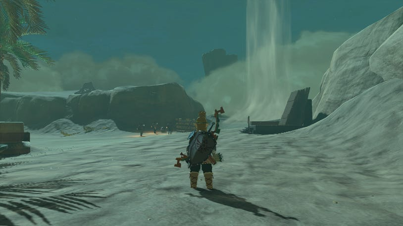

Then climb the large rocks and columns to stay above the storm and act as a guide as to where to go

If you find a sinkhole, this might drop you down into an underground cave. You can use Ascend to get back out

Gerudo Town is close to the big ruins

The Desert Rift is about halfway between Gerudo Town and the Kara Kara Bazaar

You can find the entrance to Gerudo Town at coordinates -3786, -2865, 0043.

Inside Gerudo Town

When you reach the entrance to Gerudo Town, go inside and towards the stairs. Head down them, and you'll speak to one of the villagers outside the door.

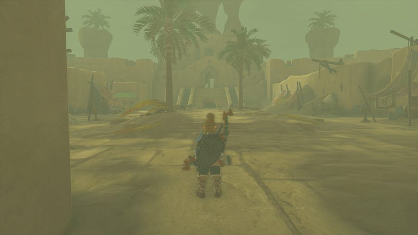

You won't be able to go in, so you'll have to find a way to learn more about what's going on outside. There is a barrel and crate just to the left of the door. Use these to create a platform you can stand on and examine through the hole in the wall what's going on.

You'll see messages in bottles being dropped into the water below, so time to find the source of the water. Go outside and turn right (if you're facing away from the door and the stairs). You can find a hole in the ground here, which you can drop down to reach the water. Follow the floating messages in bottles, and as you reach the vase suspended in the water, use Ascend to go up and inside the locked room.

As you might expect, the women of Gerudo Town aren't too happy, but Buliara will appear and speak of the sand shroud impacting Gerudo Town.

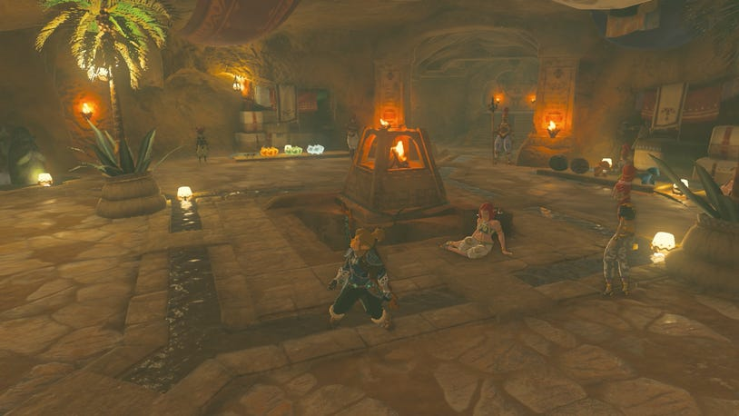

She'll also tell you that Chief Riju, the Gerudo Town leader can be found in the North Geurdo Ruins, starting Riju of Gerudo Town.
