16. To Goron City

Stop By Lookout Landing

If The Wind Temple is the first one you completed, be sure to go back to Lookout Landing. You'll find new optional main missions, side quests and adventures have become available. In addition to this, new features will have unlocked and available to use. Here are just some of the things we recommend going back and exploring or completing before setting off for the Eldin region:

Head to the center to meet a Goron who talks about Death Mountain and mentions a Woodland Stable, for an idea of where to go next

Speak to Josha who asks for further help with investigating the depths, unlocking the optional main story mission A Mystery in the Depths. This quest unlocks some new features and new questlines, so we highly recommend taking the time to complete it before setting out.

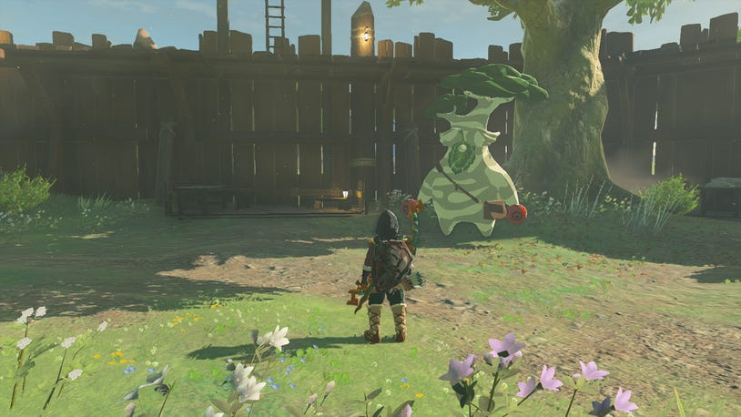

Hestu will now appear in Lookout Landing, next to the Armor Shop and General Store towards the south. Speak to Hestu to expand your inventory further, if you've been collecting Korok Seeds.

Speak to Lester, next to Hestu who will give you an update that the stable at Lookout Landing is almost complete. This will start the side quest The Incomplete Stable. All you need to do to complete it is pick up the roof plank by Lester's feet, and slot it into the gap at the top of the stable. This will unlock the Lookout Landing mini stable for you to now use.

Note: the mini stable can't offer all the services a fully-fledged stable can, so you can only register, board, and retrieve horses here.

Talk to Wortsworth in the southeast, by the stone tablet that’s fallen into the water. They explain they can translate the ancient Hyrulean with his notes back in Kakariko Village unlocking the Messages from an Ancient Era side adventure

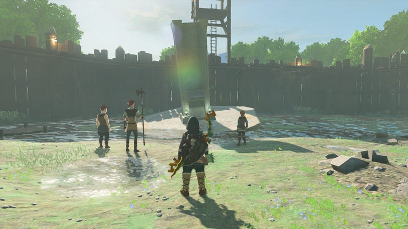

Speak to Purah and she'll tell you about the village she's concerned about as well as the remaining regions you need to explore. The village is Kakariko Village, which Wortsworth also mentioned. She'll tell you to head down to the Emergency Shelter to find out more information from Atmus. If you also talk about the remaining Regional Phenomena, Purah will suggest that the Eldin region is probably closest.

Drop down into the Emergency Shelter and speak to Jerri and Anson in the north. They've found a hole in the wall that a creepy voice is coming from, which starts the Who Goes There? side adventure, and a back door to the Royal Hidden Passage cave leading to Hyrule Castle. The cave has a ton of great rewards in it, including the full Soldier's Armor Set, making it worth checking out.

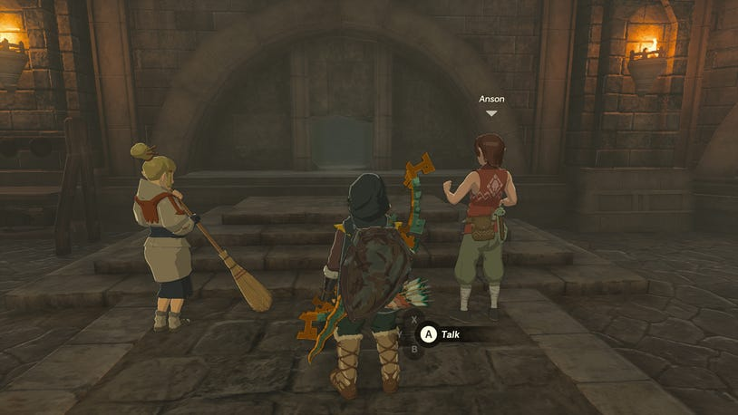

Setting Off for Goron City

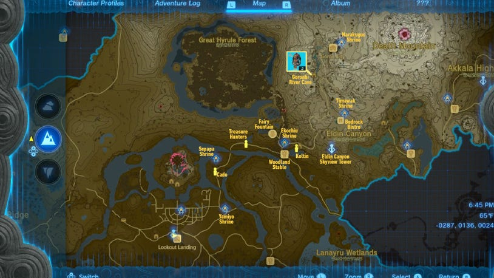

Leave Lookout Landing from the northeast gate, to start heading towards Goron City. Follow the path through Mabe Prairie and towards Romani Plains. On the right of this path, you'll see a Bokoblin camp with a chest where you can pick up some arrows.

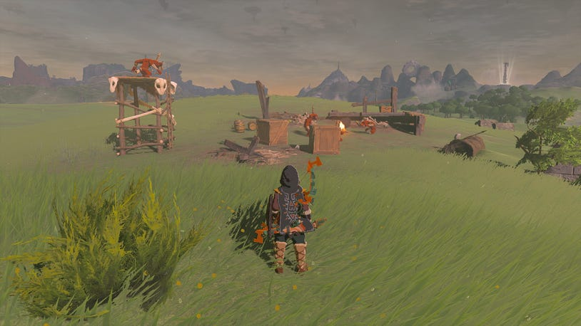

Continue northeast along the path, and you'll spot Addison again struggling with his sign. After helping him out, stick to this path until you reach a fork in the road, then you'll want to start traveling north. At this fork in the road, you'll see the Yamiyo Shrine. Behind it, there are four broken pillars. Climb up the first one to find a plant that will disappear as you approach it, follow this plant along each of the pillars to eventually get a Korok Seed.

Central Hyrule - North Hyrule Field Seed 24

Just north of here, there's a Cherry Blossom Tree with a small glowing coming from it. Underneath sits Konora, who will tell you about the strange, fruit-loving Satori. Continue following the path to the north from here, towards Boneyard Bridge. Drop down underneath the bridge to find a hanging nut that can be shot for a Korok Seed.

Central Hyrule - North Hyrule Field Seed 63

As you being to follow the tree-laden path after Boneyard Bridge, you should be able to see smoke billowing in the distance. Stick to this path, continuing north and If you haven't already found Cado with his horse, you might find him here.

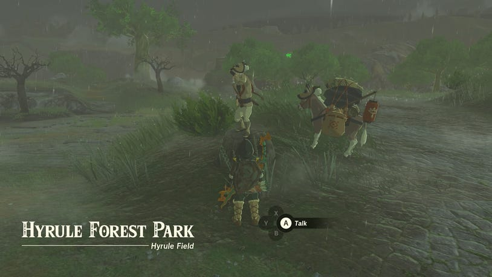

He'll mention Lady Impa and the geoglyphs she investigates across the land, and that she can currently be found at the New Serenne Stable. This will start the Impa and the Geoglyphs optional main quest if you haven't got it already.

Just off to the left is a fountain, where you can obtain a Korok Seed from the Korok running around. Just grab it as it runs in circles by interacting with the sparkles as they approach you. Keep following the path north through Hyrule Park, and if you're looking for some more shrines, you can quickly dip off the path further north and head toward the water to at least unlock the Sepapa Shrine.

Sepapa Shrine

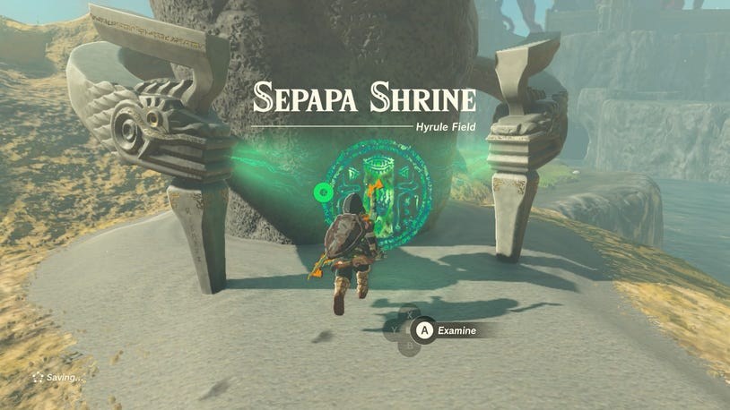

Then you want to start making your way toward the northeast until you reach Helmhead Bridge. At this point, the cloud of smoke should be even more visible, so start to make your way toward it. As you cross Helmhead Bridge, drop down here to find another hanging nut that can be hit for a Korok Seed.

Great Hyrule Forest Korok Seed 19

When you finally reach the cloud of smoke, you'll see it's coming from a campfire and there are two people near it. Approach and speak to them to learn that they're Domidak and Prissen, and they're interested in the chest that sits atop a broken column in the center of the bottomless bog. This will begin the side quest The Treasure Hunters. You can finish this one pretty quickly by building a makeshift bridge to the lone chest in the middle of the swamp using Ultrahand.

From this side quest, head east towards the next puff of smoke you'll see coming from the stable in the distance. There's a well here that you can drop down just before you reach the Rauru Settlement Ruins.

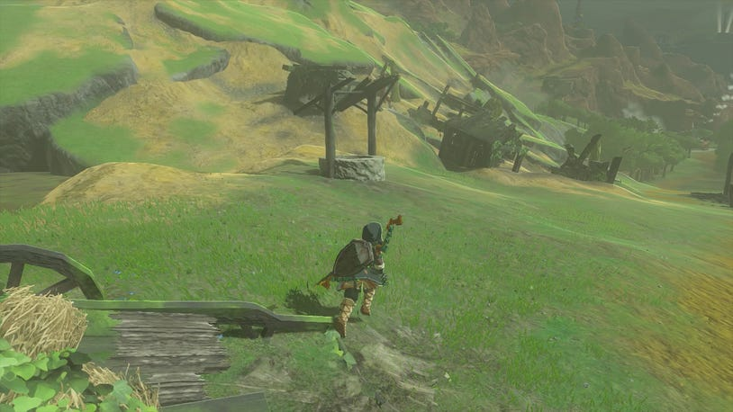

If you drop down here, you'll have to craft a bridge to be able to get to the other side. You'll find plenty of Brightbloom Seeds and Giant Brightbloom Seeds here. Ascend from the well and continue east, returning to the path to follow the next cloud of smoke. When you reach it, you'll have arrived at the Woodland Stables.

Woodland Stables - Towards Death Mountain

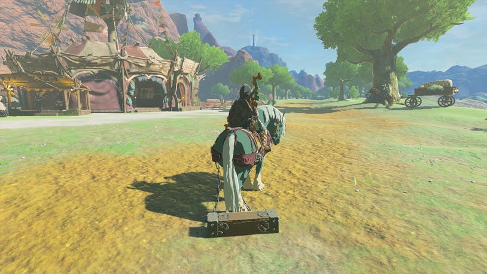

From the Woodland Stable, you'll want to go north taking the path that slopes up behind the stables to Goron City. But for now, go behind the stables, to find Molo sitting by the river and near a well, and a colorful balloon on the other side of Pico Pond.

If you joined the Lucky Clover Gazette when you ventured to Rito Village, but haven't been by here since, be sure to help Penn and Maestro out with the Serenade to a Great Fairy quest!

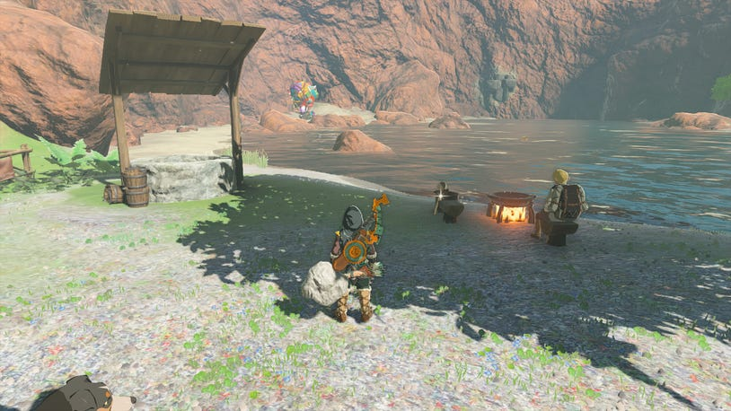

Make your way over to the colorful hot air balloon to meet Kilton and Koltin who are investigating the nearby cave, and also mention the elusive Satori.

Koltin explains that he just needs a Bubbul gem and then believes he'll turn into a Satori. They're trying to get the Bubbulfrog from the cave behind them, but need some help. This will begin the side adventure The Hunt for the Bubbul Gems! To complete the quest, just hand over a Bubbul Gem to Koltin and you'll receive a Bokoblin Mask in return.

Bokoblin Mask

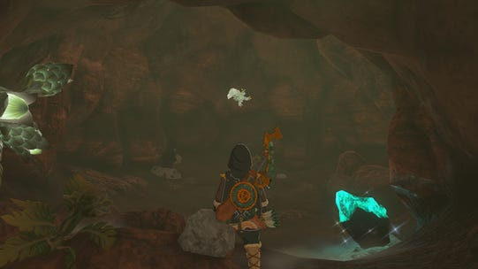

If you don't have a Bubbul Gem, you can easily get one from Pico Pond Cave behind the pair of brothers. Be sure to pop in there even if you do have a Bubbul Gem to give to Koltin, as he'll want more after the initial one and trade them for treasures, so the more you have the better!

Now go back to Woodland Stable and take the path north towards Death Mountain. As soon as you join the path, you should be able to see Ekochiu Shrine.

Ekochiu Shrine

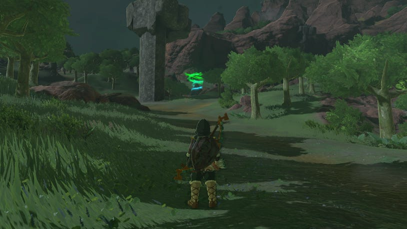

Just before it, there will be a road sign that says left is the Lost Woods (which you can't enter), and to the right is Goron City, so start to head up the path to the northeast. After a short hike up the mountain, you'll see Addison again and not long after, the lights of the Eldin Canyon Skyview Tower. We'd recommend making your way over to the tower, to unlock this and reveal more of the map.

Eldin Canyon Skyview Tower

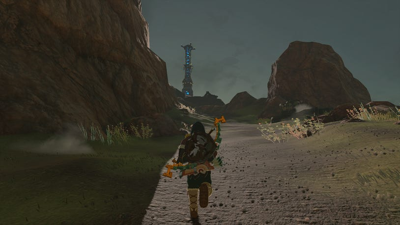

The Tower itself has a problem with a jammed door, so you'll need another way in. Luckily, debris from the Sky Islands above should constantly be raining down nearby, so use Recall to ride one back up and drop through the opening at the top of the tower to activate it.

Back on the trail, start to go up to the north of the mountain, passing the YunoboCo Hiring! metal sign along the path.

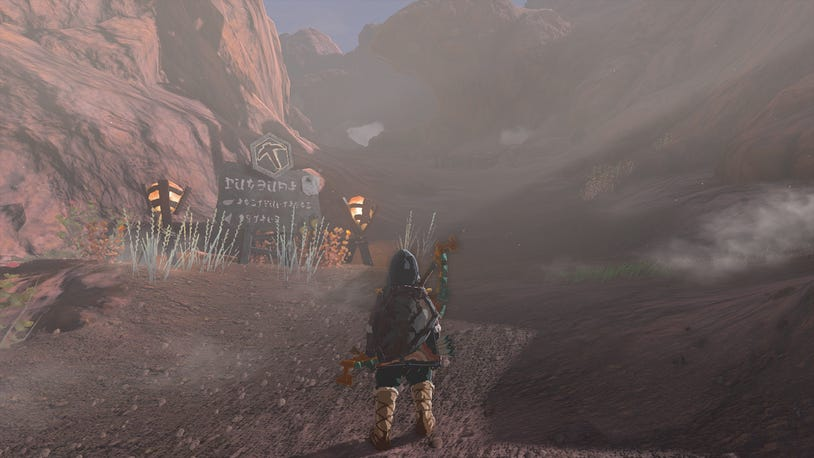

Then stick to this path, all the way until the path starts to twist around to the east, and you reach the Bokoblin camp. With the Bokoblin camp on your left, climb up the cliff on your right. Continue following the path, going left and starting to head north at the big metal sign. In the distance, you should be able to see another shrine, which is the Timawak Shrine.

Timawak Shrine

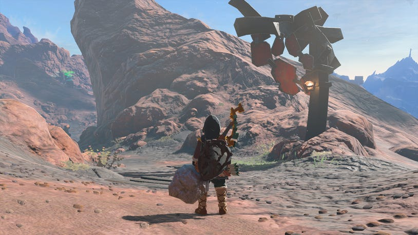

As you start to slope down this path, you'll see two metal archways, going left and right.

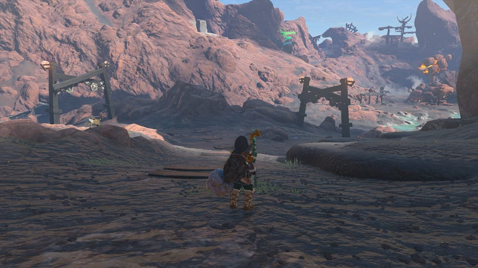

Goron City is off to the left (north), but there's a place to stop by first, so head right and towards the water and cluster of rocks with lava.

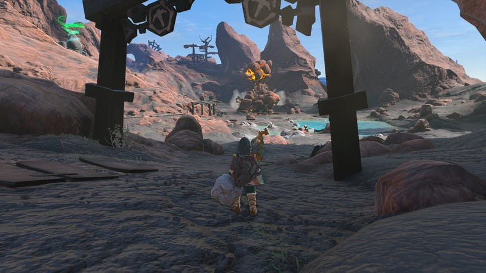

This is the Bedrock Bistro in Goronbi Lake, and is worth stopping by, to speak to the clientele and the chef. You'll interrupt a discussion between Mezer and Cooke, starting the side quest Meat for Meat.

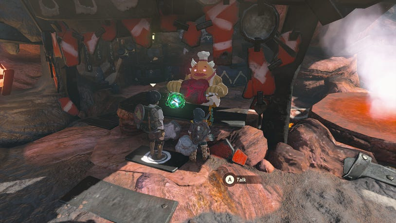

All of the Caves in the Eldin Canyon and Death Mountain region are superheated and usually full of lava, which will burn Link alive and set his wooden gear on fire. Normal Heat Resistance food or elixirs won't cut it, and you'll instead need Flame Guard - which is only granted from the Flamebreaker Armor in Goron City, or crafting elixirs from either Fireproof Lizards or Smolderwing Butterflies.

With that out of the way, return to the path and go north now, to pick up the trail to Goron City. As you get further up, you'll spot a Korok off to the left, who needs to return their friend. The friend is on the cliff above, sending out a smoke signal.

You'll eventually come to a section of the trail where there's a sign for Goron City, someone standing by the edge of the path, and lots of archways covering the path straight up.

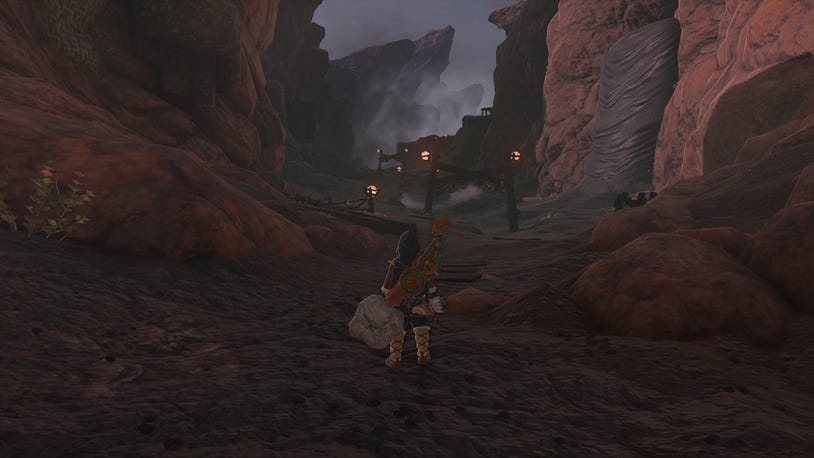

Go over to the person, who happens to be Gozzber, and they're searching for fireproof lizards. He'll tell you about fireproof elixirs, and the need to be stealthy when approaching the fireproof lizards. Thankfully, from your journey from Lookout Landing to Goron City, you will have been able to pick up both Blue Nightshade and Silent Shrooms that improve your stealth, but you can also just crouch up to nab any lizards nearby.

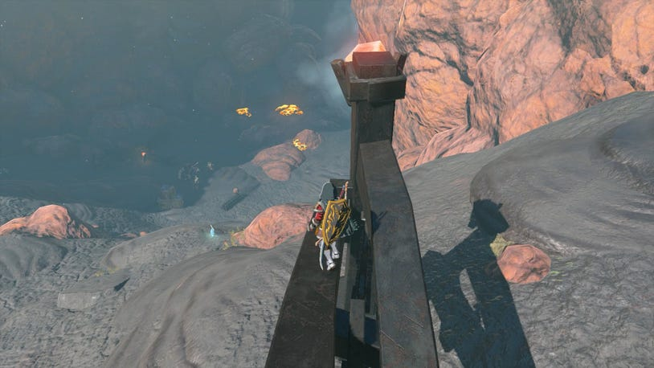

When the path leads to a market with two stalls (but only one manned by a Goron merchant), you can continue to take the upward sloping path to Goron City, or explore off to the left. Just below here is a monster camp at the bottom of a small river, where you can find the Goronbi River Cave.

Goronbi River Cave

If you prep a Fireproof Elixir, it's worth exploring, as it will not only lead you to the special Ember Shirt that powers up your attack in hot places like this cave (and you can also find a special quest series starting here - Misko's Treasure of Awakening I).

Ember Shirt

Continue up the path and it's not long before you see Addison again, and eventually reach home of the fire-resistant clothing, Goron City. Just before you get there, you'll have some Gorons with marbled rock roast, who offer to buy your ore.

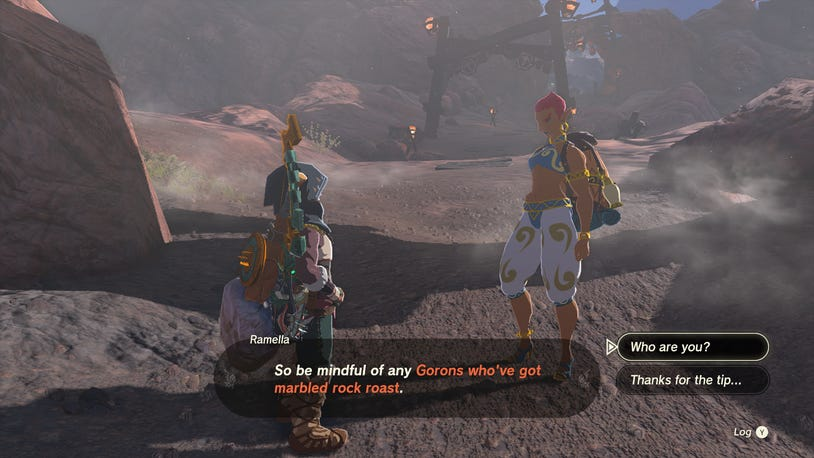

Ramella, a jeweler from Gerudo Town will step in and tell you to be mindful of any you see, and offers to buy your ore instead. This will begin the side quest Amber Dealer, where you can sell 10 pieces of Amber to Ramella for a higher price than in the shops.

Just a little further, and you'll finally reach Goron City. Approach the center of the city to speak to group by the marbled rock roast.

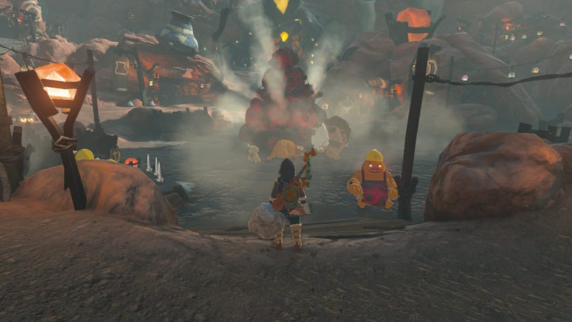

Doing so will make Yunobo appear, beginning the next part of this quest Yunobo of Goron City.

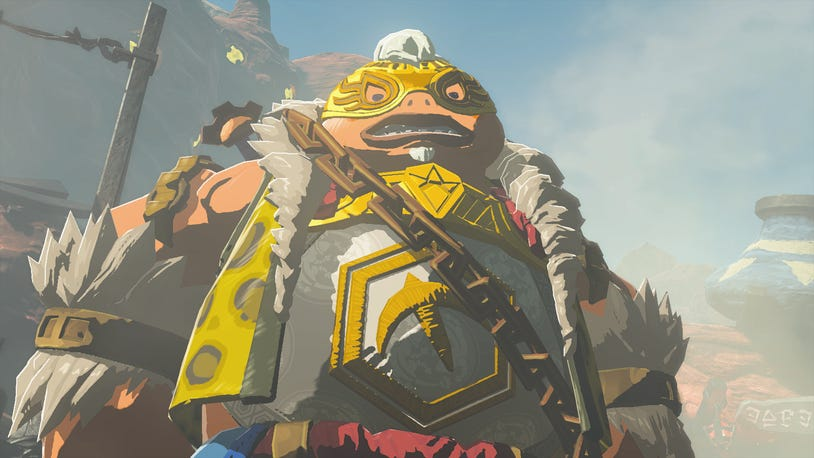

Regional Phenomena - To Goron City

While you're in Goron City, be sure to visit the Armor Shop and buy something from the Flamebreaker Armor Set. The cheapest piece is the Flamebreaker Armor, costing 700 Rupees. If you have 10 pieces of Amber, find Ramella and sell them to her to make a profit, if not you can sell any items at the General Store or Armor Shop if you don't have enough.

Still need Rupees? Check out the How to Farm Rupees in TotK guide for more information. Take the time to cook up some meals with fire resistance to help out too, then when you're ready, you'll need to head to YunoboCo HQ to start Yunobo of Goron City.
