6. To Rito Village

Before leaving Lookout Landing behind, it’s highly recommended that you complete the following tasks

Undertake the Camera Work in the Depths Quest from Josha and Robbie

Stock up on weapons found in the town, and a fuse a few of them with monster parts

Sell materials to buy either the Hylian Tunic or Hylian Hood from Mubs shop

Find and tame a wild horse

Craft a few meal recipes for the road, including a few batches of Spicy Peppers

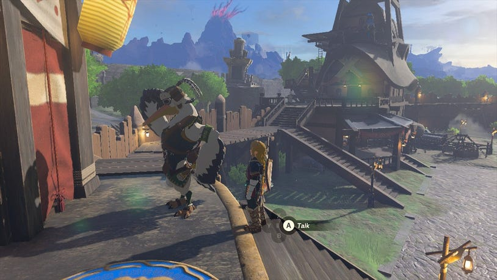

You can also likely find a pelican-like Rito inspecting the Skyview Tower. Talk to him and learn that he’s a reporter named Penn from the Lucky Clover Gazette. He’ll invite you to stop by at their HQ, which happens to be right outside your destination in the Hebra region.

The Road to Hyrule Ridge

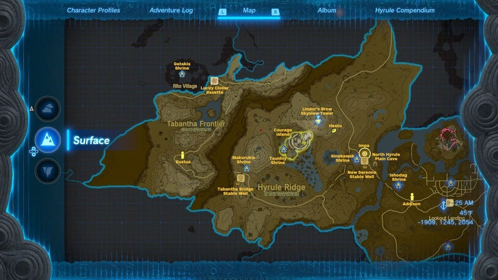

See the map above for essential points of interest along the way to Rito Village!

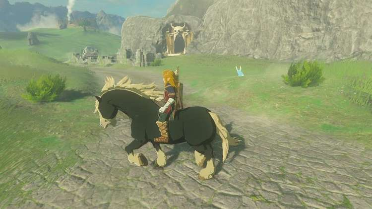

When you’re ready, head out on the northwest road from Lookout Landing. As you leave the castle behind, you can stop briefly to check out the Passeri Greenbelt Cave, which is home to a couple of Horriblins hanging from the ceiling. Defeat them all to unlock a chest with a Spiky Spear, and check out a rubble wall to find another Bubbulfrog in a room with ore and a Hearty Truffle that can be cooked to give you extra hearts.

Passeri Greenbelt Cave

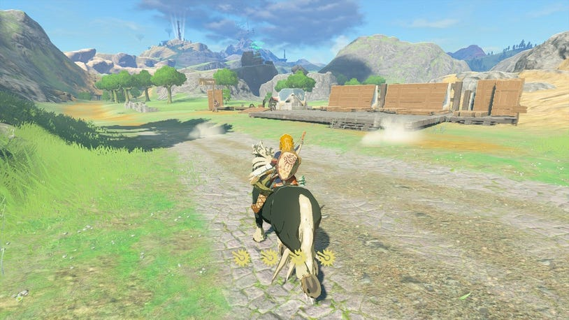

Making your way further up the road between Mount Gustaf and the Quarry Ruins, you can spot Addison trying to hoist another construction sign and help him in exchange for money and food if you wish, or check out the Ishodag Shrine on top of the Quarry for another Light of Blessing.

Ishodag Shrine

Watch out for angry tree mimics as you near the tunnel to Carok Bridge — they can be taken out like any other tree if you have an axe-type weapon.

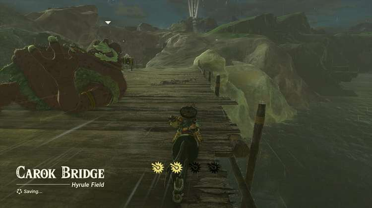

Otherwise, cross Carok Bridge carefully, and move your horse around the slumbering Hinox (you can take it on if you’re feeling gutsy and have a good amount of weapons on you, otherwise best to mark it on your map and return later.

Hyrule Ridge - The Climbing Gear and New Serenne Stable

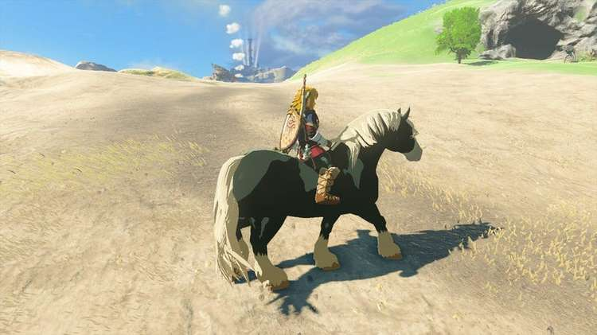

As you enter the ridge region, you should be able to spot the puffing smoke of a stable not too far away, with the lights of a Skyview Tower further past it. You should consider stopping short however, for just to the right of the road is another cave, the North Hyrule Plain Cave, and it’s an important one. The man outside will also give you a clue on someone who may want the Bubbul Gems found on the large frogs you’ve been spotting in each cave, so make a note to find the Woodland Stable later.

North Hyrule Plain Cave

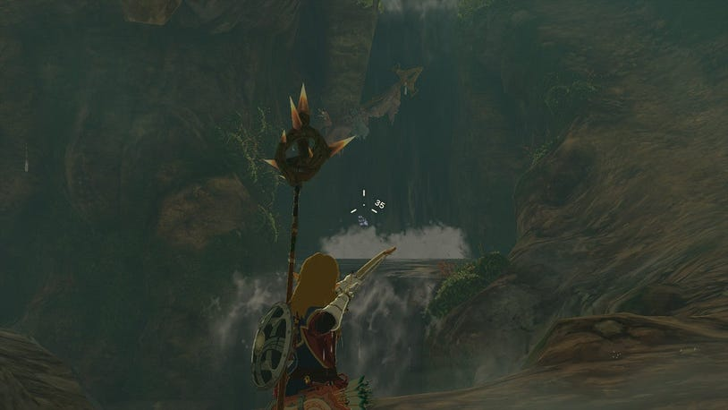

Defeat the two Like Like’s guarding the entrance inside by poking them from a distance or shooting their weak points when exposed, then ascend up and follow the river to fight off a Horriblin. Once you spot a series of waterfall, check near the base of one for a Brightcap mushroom glowing through the other side.

Behind the waterfall is one of Misko’s Legendary Treasures - the Climbing Gear outfit, which will increase the rate at which you can climb up walls.

Climbing Gear

Head back or Ascend out of the cave and move up the path to New Serenne Stable. This is a good spot to get your bearings, register your horse if you found a new one to make the journey here, and take on a couple of optional (but important) endeavors.

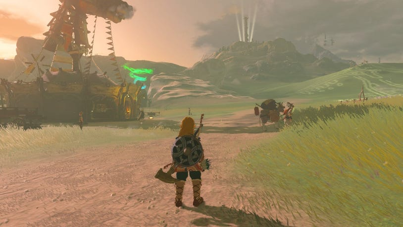

The most important of which is speaking to Cado the Sheikah attendant to Lady Impa, who appears to be investigating a large geoglyph pattern nearby. This will start the Impa and the Geoglyphs Quest, which is important to the main story, and will help you locate several important points of interest similar to the Memories Quest in Breath of the Wild.

Other things to do around the stable include:

Activate the Sinakawak Shrine behind the stable for a quick fast travel spot, and solve its puzzles for a Light of Blessing

Sinakawak Shrine

Speak to Zumi about fixing up an old wagon and finding her a wild horse nearby to earn some easy money with the Horse-Drawn Dreams quest.

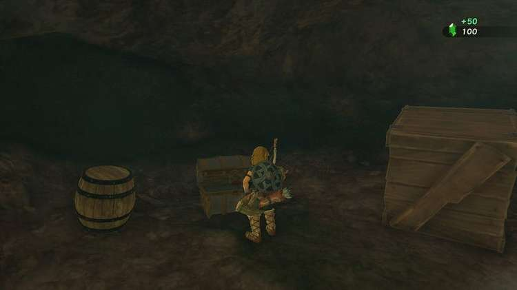

Dive down the New Serenne Stable Well to lower the water level by breaking some rocks to find a chest with even more money inside

Speak to Ariane sweeping out front of the stable to learn about the former Rito Stable and get a Spicy Elixir for free

Hestu and the Skyview Tower

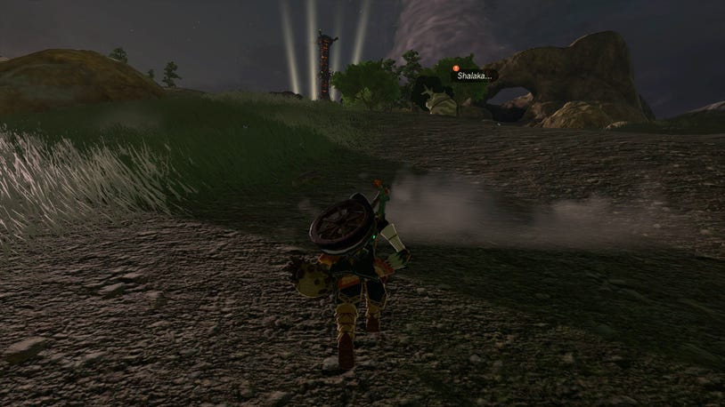

Leaving the stable behind, head north along the road, but keep going straight up the hill when the road forks towards the lights of the tower up at the top of the hill.

Before you can reach it however, you’ll find a familiar face and the bane of many who played Breath of the Wild - Hestu the Forest Spirit. He’s being harassed by a few evil trees, which will start Hestu’s Concerns.

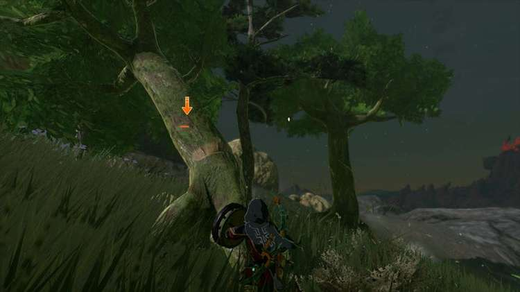

If you’re lacking axe-type weapons, look along the ground for flat stones to form axeheads, and then get to chopping the two evil trees. Hestu will be overjoyed at the rescue, and offer to increase your inventory stash in exchange for Korok Seeds you may have already found by now.

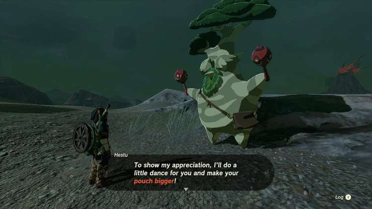

He’ll only accept two upgrades before disappearing somewhere to the East, so be sure to check out our Inventory Expansion Guide to see where to find him next.

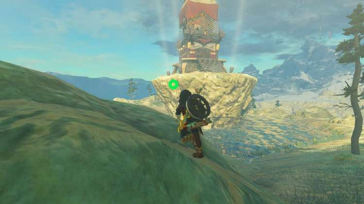

Moving on from Hestu, ignore the entrance to a nearby (and very deadly) cave, and continue hiking up the hill to the Lindor’s Brow Skyview Tower. It seems someone forgot to build the stairs up to its position above a ring of water, so it will be up to your Ultrahand to finish the task.

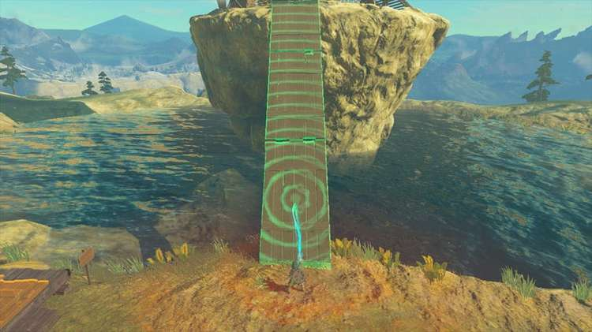

As you can imagine, there are countless ways to solve this problem, but the most straightforward one is to simply grab the assorted wooden boards at the nearby construction site and make one giant long bridge. Once you have four of the largest boards end to end, lift it high up and forward with the D-Pad, then angle it slightly into a slope and drop it at the foot of the water, and it should create a seamless bridge to climb.

Lindor’s Brow Skyview Tower

Courage Island and the Glide Shirt

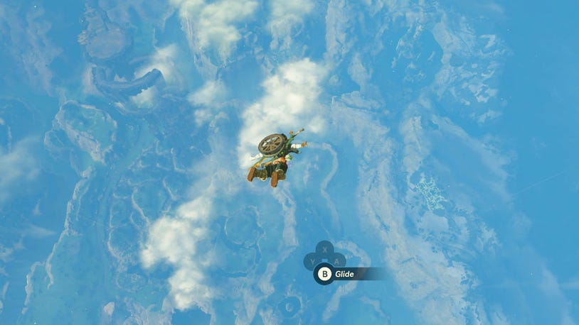

As you jettison out of the Skyview Tower, you’re likely to spot a series of ringed islands just to the southwest of the tower high in the sky. From your height, you should be able to reach the top of the chain, though it’s okay if you instead fall to the pool of water on the lowest island.

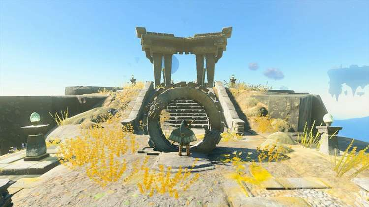

Here you’ll find an altar you can activate to create a ring of light leading to a ledge you can leap off to dive through more rings as you descend among the floating islands to the pool at the bottom.

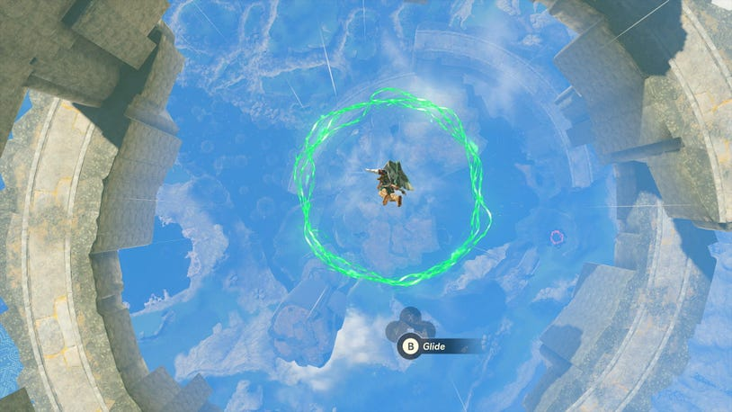

Doing so will reveal the Taunhiy Shrine, but that’s not all.

Taunhiy Shrine

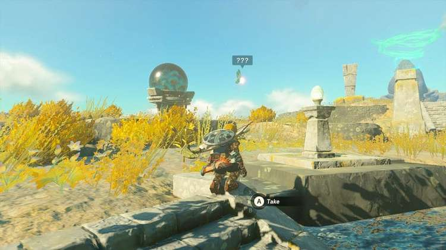

Carefully crouch down and nab 3 floating Fairies to keep in your inventory should you take a fatal blow, then talk to the Steward Construct nearby.

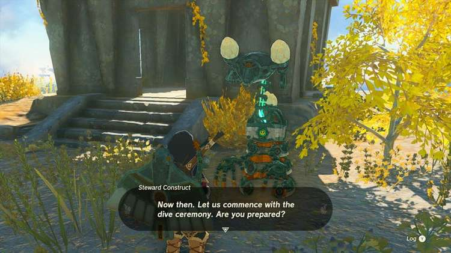

He’ll mention the dive ceremony you just partook in, and ask if you want to perform the actual ceremony and dive through all the rings under a certain time limit for a reward.

Do so and he’ll return you to the top, and completing it will award you the first part of a special set of armor - the Glide Shirt, which will increase your mobility when falling through the air.

Glide Shirt

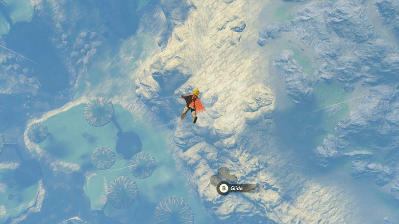

He’ll also award you a Large Zonai Charge for beating the record, and you can earn more if you continue to break your own records!

Before leaving the Sky Island, be sure to drop some Zonai Charges into the Zonai Device Dispense to earn some new device capsules, including Balloons and Time Bombs if you run out of Bomb Flowers or hammers to break rubble.

Tabantha Bridge Stable

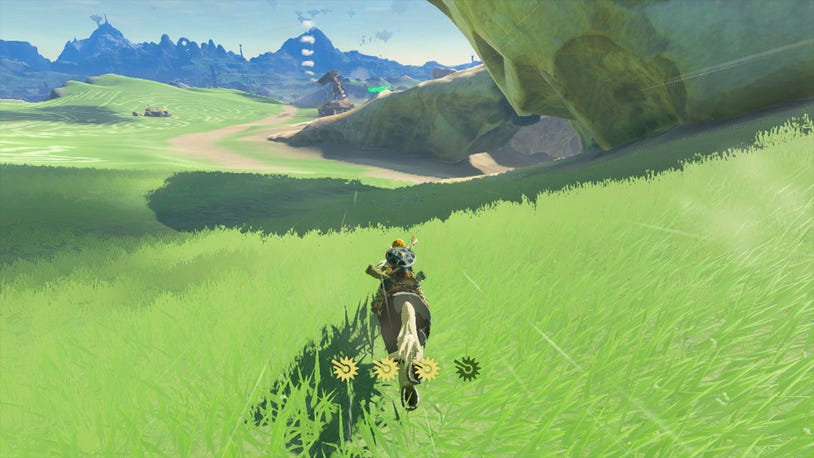

While you can take one of two routes to reach Rito Village from the Lindor’s Brow Skyview Tower — up to the northeast and into the Tabantha Snowfield, or down to the southwest to Tabantha Bridge, we prefer the latter since you’ll have more of the map uncovered on this route.

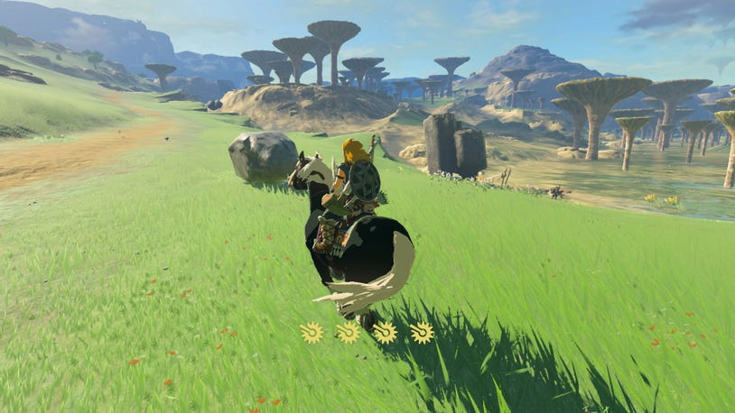

Take the path back down the hill and through the rocky gorge, and pass by the various bogs and large mushroom platforms until you set your sights on the next stable - Tabantha Bridge Stable.

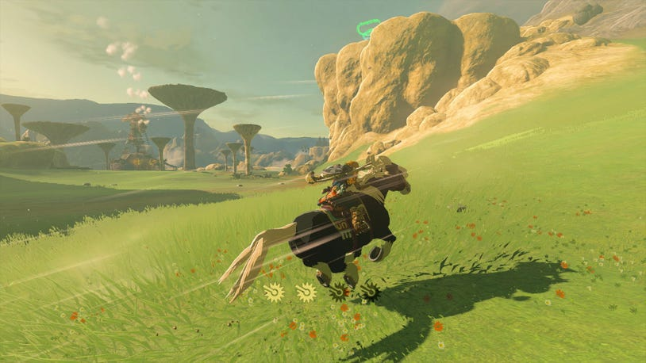

Be sure to run up the path on the right to unlock the Makurukis Shrine at the foot of Mount Rhoam, before heading back down to the stable.

Makurukis Shrine

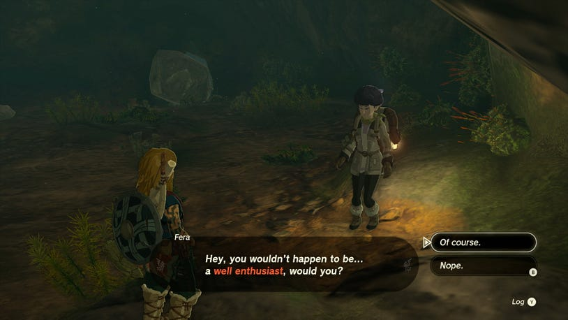

You can learn a bit more info from the stable residents here, and also explore the Tabantha Bridge Stable Well to meet Fera, if you haven’t met her in another well yet. She’s something of a Well Enthusiast, and on a mission to document all 58 across Hyrule. This will trigger Side Quest Where Are the Wells, which will award you 10 rupees from her for each well you discover in your adventures. Be sure to return to the Lookout Landing Well periodically to update her for more money.

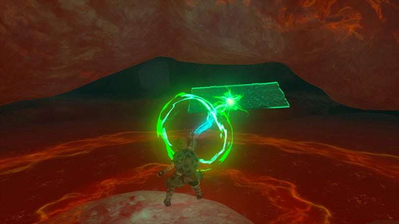

There’s also a chamber beyond leading to quicksand muck that you can build a bridge across to find a chest at the end of the well holding 50 more rupees.

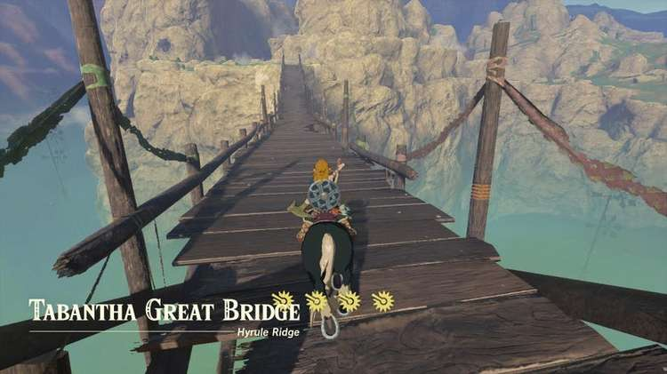

When you leave the stable behind, carefully make your way across the deteriorating great bridge to the other side, and follow the path as it winds through valleys and pass various enemies like Bokoblin Camps.

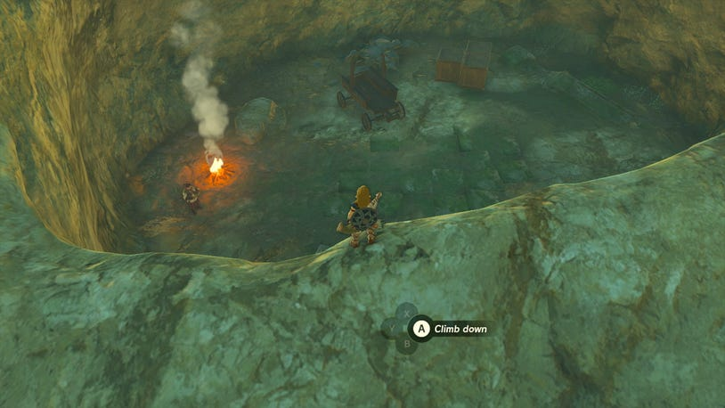

You may also spot a man trapped in a large hole as you round the bend. His quest ties into that of the Great Fairies that you can't exactly proceed with yet, but saving him can help move things along later.

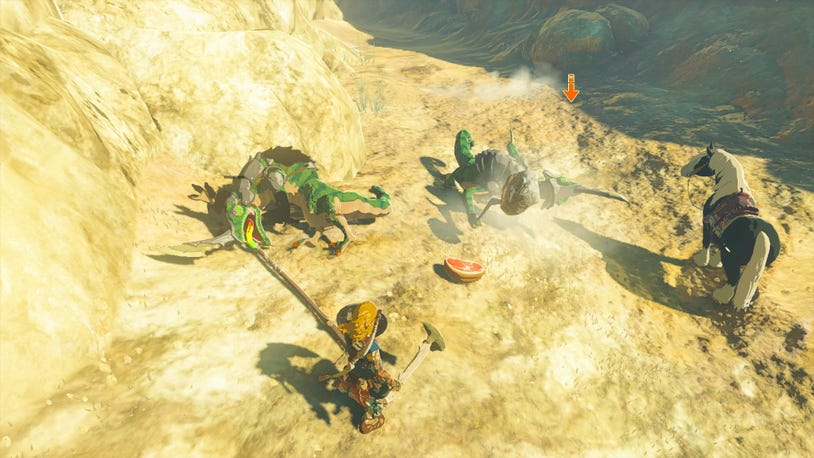

Once you cross the Kolami Bridge, be ready to get ambushed by a few Lizalfos. They tend to try and attack with their tongues at long range, and can also throw boomerangs, so be ready to block them.

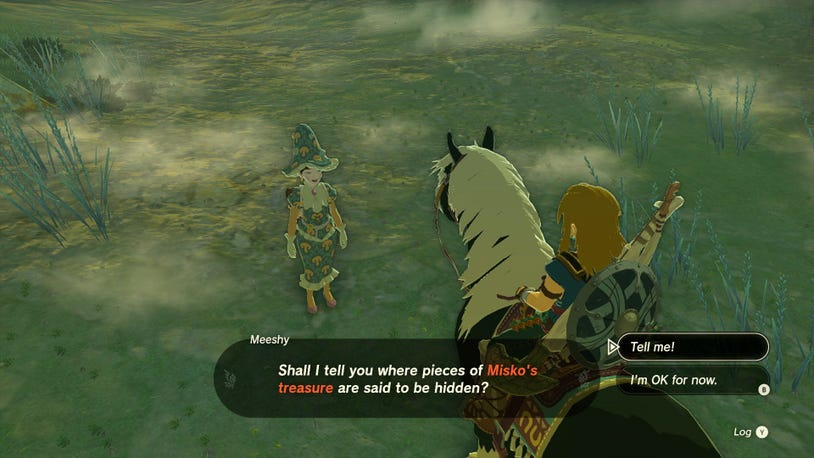

You might also run into a traveling woman in a mushroom fashion outfit named Meeshy, if you haven’t met her elsewhere. Be sure to chat with her about finding the fashion treasure of the Legendary Bandit Misko, as she’ll mark your map where caves contain three different pieces of armor (one of which we already got the Climbing Gear from).

The Lucky Clover Gazette and the Rito Village Bridge

When you finally reach the long sloping path down to the former Rito Stable, the giant storm above will make its presence known, whipping up the area in a blizzard that you’ll want to have your Archaic Warm Greaves equipped to deal with. Thankfully it won’t get colder than this for the immediate area, but that won’t last forever.

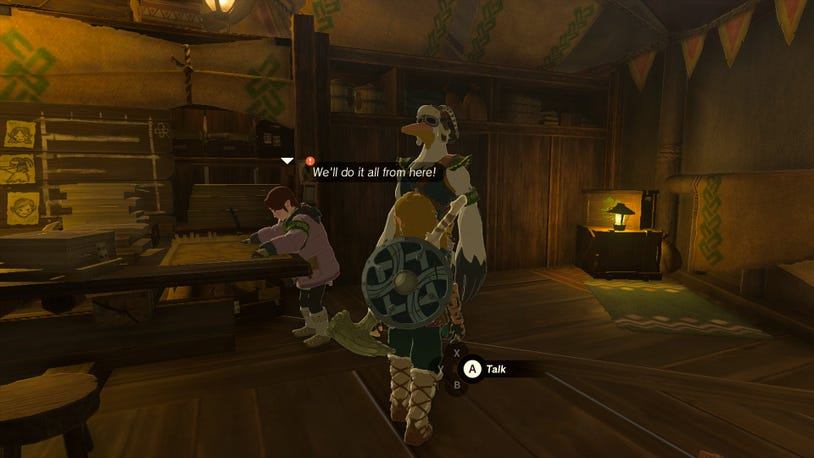

Check inside the former stable to meet Traysi and Penn, and agree to become a reporter for the Gazette to start a series of quests around Princess Zelda Sightings. This will be an imperative first step for many quests found at stables — most importantly one to start unlocking Great Fairy Fountains.

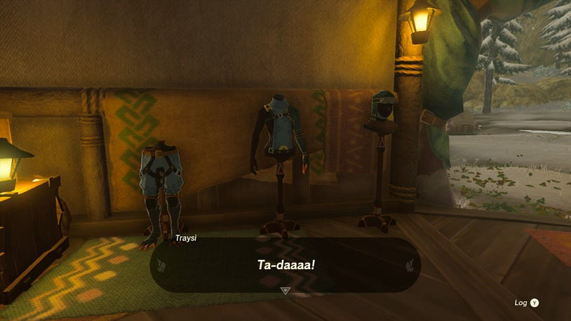

Solve enough mysteries at the stables, and you can earn specialized sticky Froggy Armor to help your climbing capabilities on wet surfaces.

Outside the Gazette headquarters, you’ll find the bridge to Rito Village is broken, and the icy walls will make paragliding across to climb up a no-go.

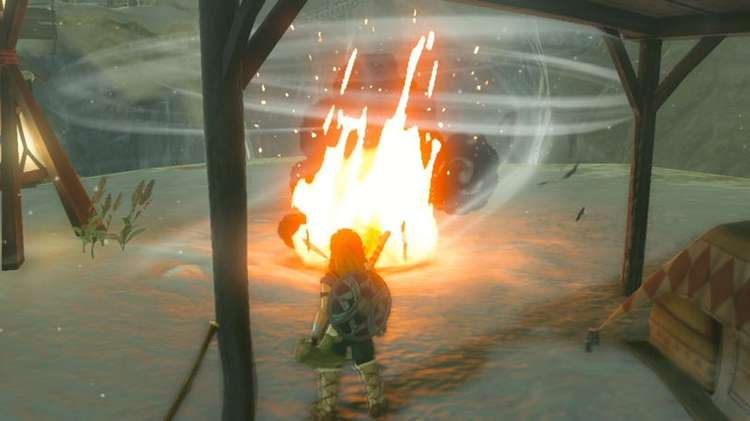

Luckily, by speaking to the people around, they’ll mention that you can create a large gust of fire by tossing a Hylian Pinecone into a campfire, and many of them are lying by the pine trees around you. Do so, and jump up to activate your paraglider and soar into the air, and then across to Rito Village.

Rito Village

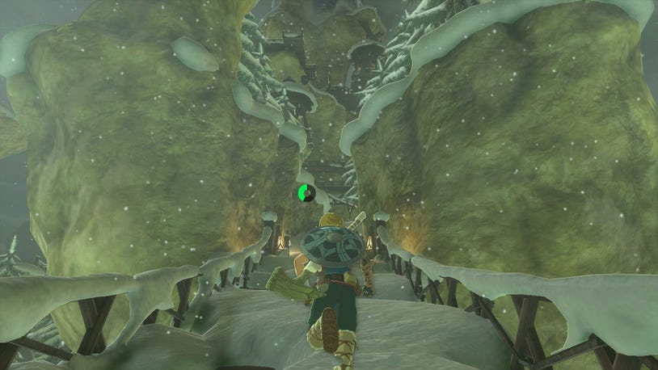

You’ve finally made it to Rito Village, but the regional phenomena has made it something of a deserted island. The fierce blizzards have driven most people away, and only a few Rito are still here, with children running the shops as their parents forage for food and supplies. Luckily, you can still find an inn on the first tier, with a general store not far after that also sells arrows.

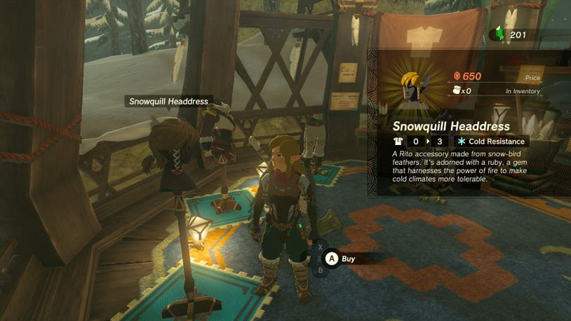

On the next tier up, be sure to stop by the Brazen Beak — a clothing store that specializes in warm clothing. Hopefully with the money you’ve gained helping Addison, finding wells, and getting the rupee chests within them have given you something to work with, so try selling off Like Like stones, Lizalfos Tails, and Amber ore to raise enough funds to get either the Snowquill Tunic or Snowquill Headdress to compliment your Archaic Warm Greaves — you’ll need at least two warm pieces for the journey ahead.

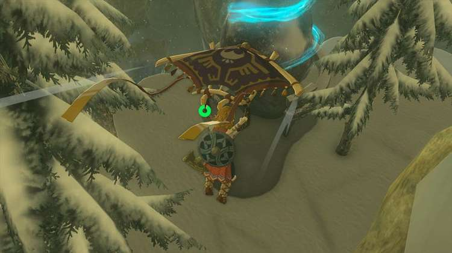

Before moving to the top tier, be sure to look down below for the Gatakis Shrine. A Goddess Statue can be found at the entrance stairs, and by now you may have enough Light of Blessings to upgrade your health or stamina once or twice.

Gatakis Shrine

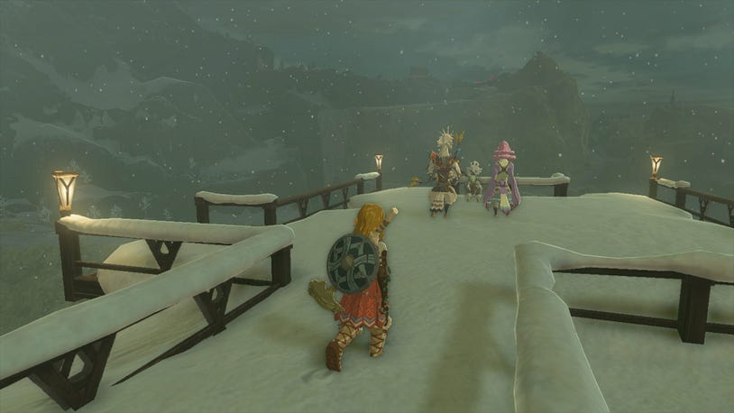

At the very top tier of Rito Village, you’ll find the new Village Elder, your old pal Teba, along with his headstrong son Tulin. Speak with them to bring them up to speed on what’s happened, and learn about the crazy storm enveloping Rito Village. To proceed, you’ll need to catch up with Tulin of Rito Village to find a way into the storm.
