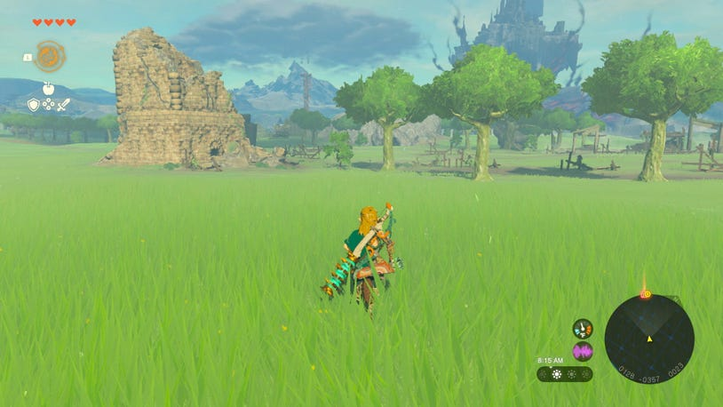
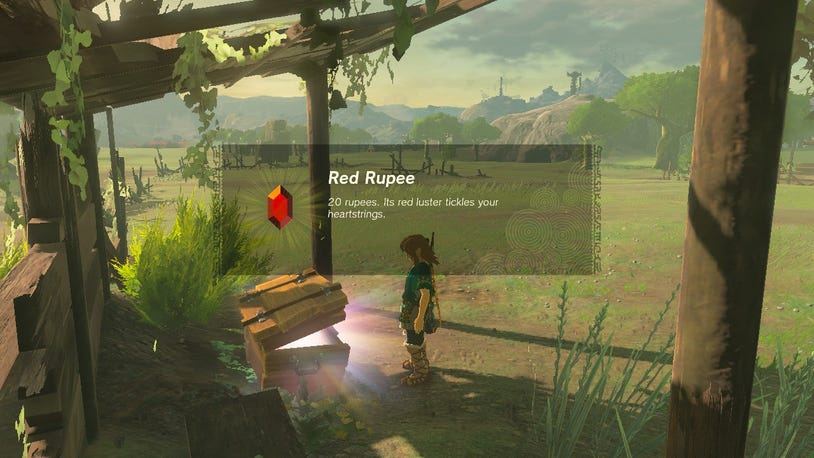
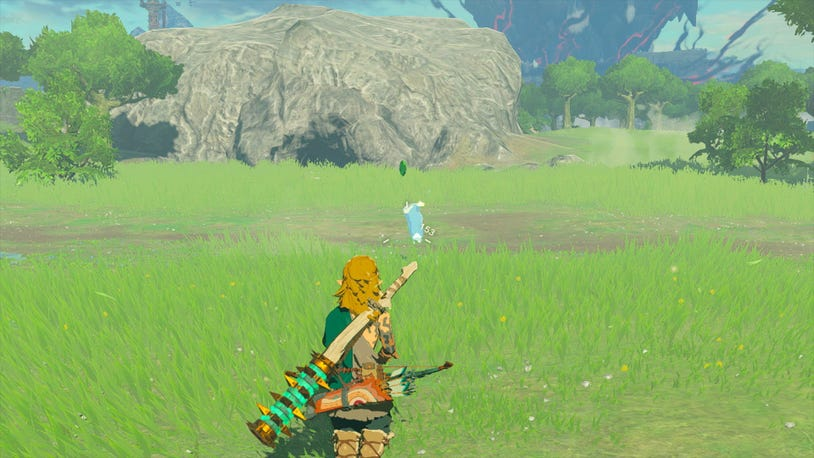
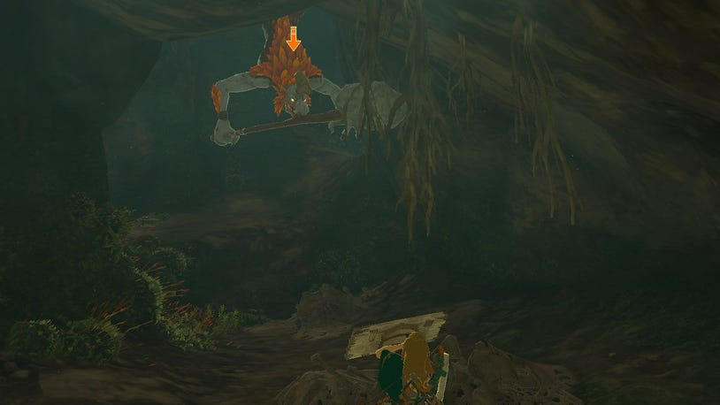
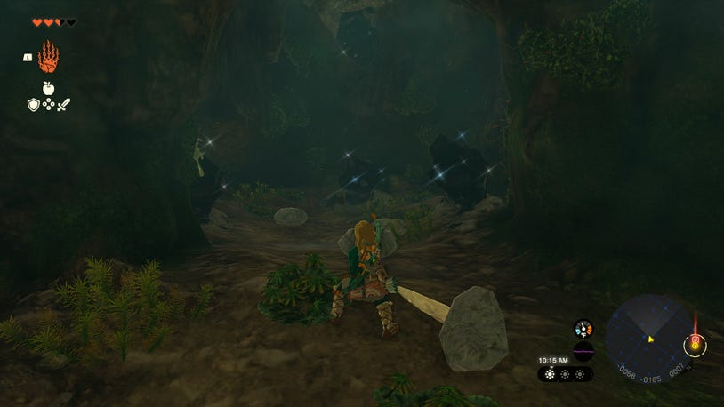
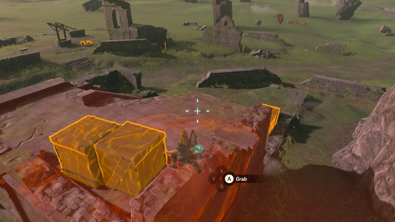
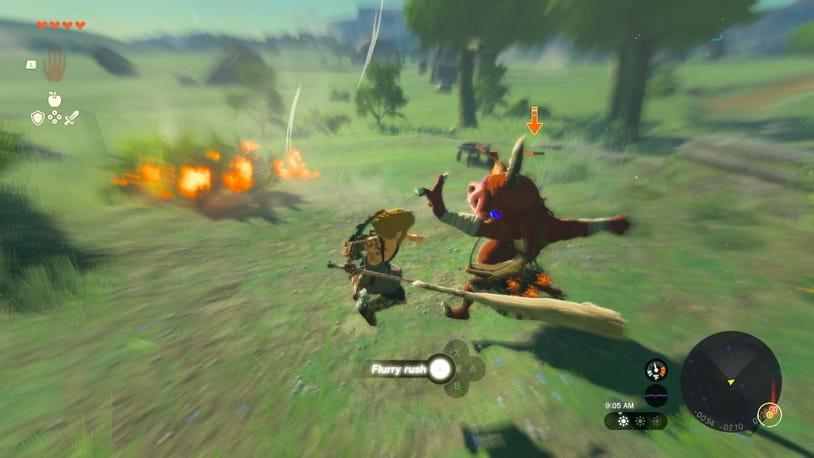
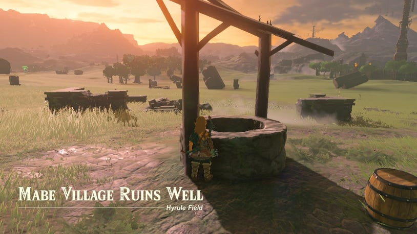
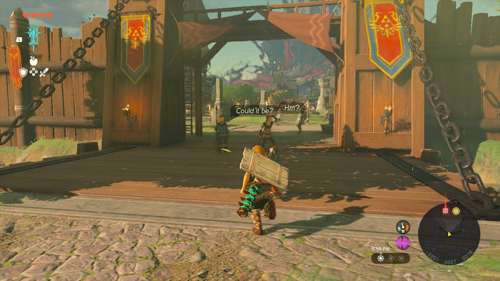
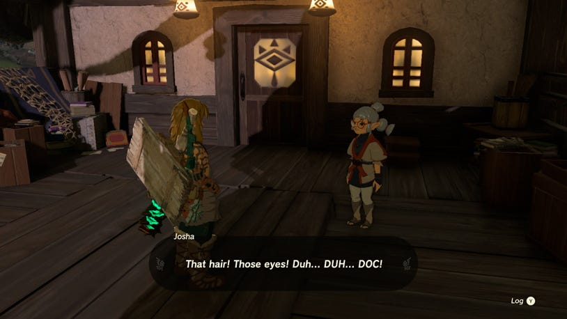

3. To the Kingdom of Hyrule

Ranch Ruins and Cave

The first landmark you’re likely to see are the Ranch Ruins, which feature a long oval-shaped track, a ruined tower, and plenty of debris.

There’s not too much here, but you can find a Korok hiding under a rock in the tower, and a chest under an awning along the track holding 20 rupees.

Central Hyrule - North Hyrule Field Seed 14

Some Bokoblins may be foraging nearby, and they can now sport packs on their back which can either contain useful ingredients, or elemental fruit they may actually toss at you when engaging. So don’t get caught unaware and defeat them to get a lot of loot.

Just beyond the ruins you’ll find your first surface cave, the Ranch Ruins Cave. On the surface of Hyrule, you can usually spot a glowing blue creature called a Blupee outside most cave entrances, and shooting it with an arrow will cause money to fall out.

Ranch Ruins Cave

Inside is a brand new enemy type that tends to make their home in caves like these – the Horriblin. The monkey-like monsters cling to ceilings and will often use long sticks fused with rocks, or even additional sticks, to try and poke you from high above – or toss boulders if you move out of range.

Try to headshot them with an arrow to send them crashing down, and rush into defeat them while they are still stunned.

Before taking a path up on the right, look for a tiny alcove by the floor on the left, and crouch down to get through a path leading to a trove of Brightcap, Brightbloom Seed, and even a Traveler’s Bow and arrows.

Taking the main path up right towards a high cave exit, you can use Ascend to reach the Horriblin’s lair where they’ve stashed some goods and a chest you can loot. Be sure to also look to the right of the cave exit to find a small path to another Bubbulfrog you can snipe for its Bubbul Gem.

Mabe Village Ruins and Well

On the other side of the cave is the Mabe Village Ruins. Like the Ranch, it’s clearly been neglected on cleaning up since the Calamity ended, but you can still find a few rusty weapons around. It’s also a great place to stock up on arrows by using Ultrahand to lift and drop crates to get the contents within.

You may even spot a line of Bokoblins being led by a new Boss Bokoblin in the distance. With your limited weapons and gear, however, you may wish to wait a bit longer for now, and instead face off against a Bokoblin carrying a Fire Fruit pack through the ruins.

Looking to the far side of the broken village, you can spot a well with a hole to drop down. Like caves, wells in Tears of the Kingdom often hold interesting secrets, though they are usually a bit less involved than the more expansive cave systems.

This one in particular holds a pool of Glowing Cave Fish, some Sticky Lizards and Brightcaps, and a pile of rubble you can break apart with makeshift hammer weapons that will reveal several ore veins.

When you need to escape the well, you need only Ascend to the surface above!

Lookout Landing

When you’re ready to move things along, head across the field and skirt around the Bokoblin column to reach a new settlement called Lookout Landing, built around the old fountain plaza in front of Hyrule Castle Town, formerly called the Sacred Ground Ruins.

It seems in your absence, the people of Hyrule have been working to establish a base camp in front of the now floating Hyrule Castle looming to the North.

While there are a few things to do and people to talk to as you enter (all will be surprised to see you back), most will urgently direct you to speak to Purah, who you may remember as the Sheikah Tribe’s foremost researcher of ancient tech.

Head up the stairs by the large observatory and speak to Purah’s assistant, Josha, who will summon the wily scientist out to greet you.

After information has been exchanged, you’ll find there’s no time to waste. Purah will task you with heading back to investigate the Crisis at Hyrule Castle.
