19. To Zora's Domain

Before Setting Off

There are some optional things we'd recommend you do before you set off for the next regional phenomena. This involves talking to various characters at Goron City, and also returning to Lookout Landing, as our walkthrough taking you through the Lanaryu Wetlands and Lanaryu Great Springs will begin there.

Goron City

After completing The Fire Temple, you'll be back at Goron City and some things will have changed. We'd encourage you to explore and see what's different in the shops or what characters can offer some side quests.

Speak to Yunobo and the Goron City elder. This will unlock the side quest The Hidden Treasures at the Lizard Lakes.

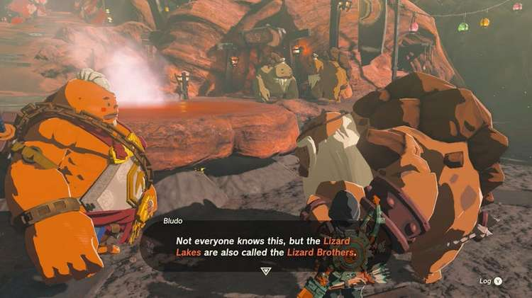

Just behind these two, you can find Tray and Volcon, and speaking to them begins the Moon-Gazing Gorons side quest.

Dugby will have arrived in Goron City, and be near the entrance. You can talk to him to start the The Ancient City of Gorondia? side quest.

Lookout Landing

Fast travel back to Lookout Landing and go over to Mubs' shop. There will be a new side quest for you to take on here, called Attacked by Pirates.

Speak to Purah she’ll tell you that monsters are active in the south, so it’s best to head where’s closest which happens to be Zora's Domain.

How to Get to Zora's Domain

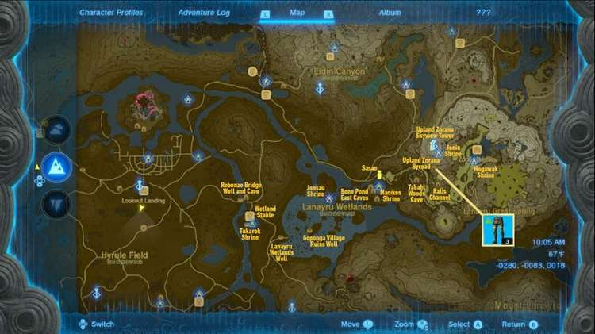

Leave Lookout Landing from the east exit and after reaching the lone Chuchu that wanders the path, you’ll come to a crossroads. Go right (southeast) here as if you’re returning to the Ranch Ruins. Keep to this main path, until you pass the turn-off to Mabe Village Ruins and reach the split in the road, where going right would take you to Ranch Ruins. Here, you want to go left and start heading east again, sticking to the path all the way to Rebonae Bridge.

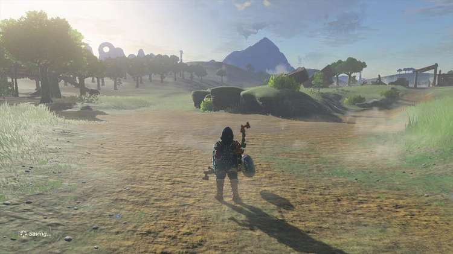

You'll see a structure on the right when you first go left and start walking down the path. This little treehouse camp is home to Bokoblins, and a treasure chest up the top.

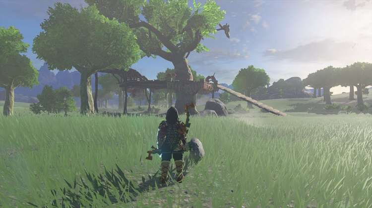

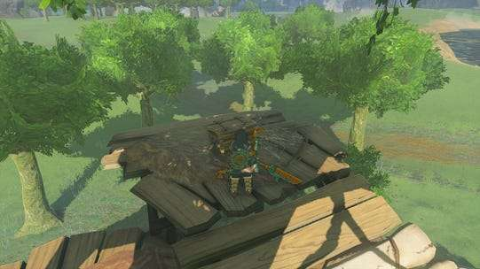

Treasure Chest: In this chest, you can pick up an Opal.

Hop back down and rejoin the path. Continue going east, and as the trail starts to curve significantly, look to the right to see another Bokoblin camp.

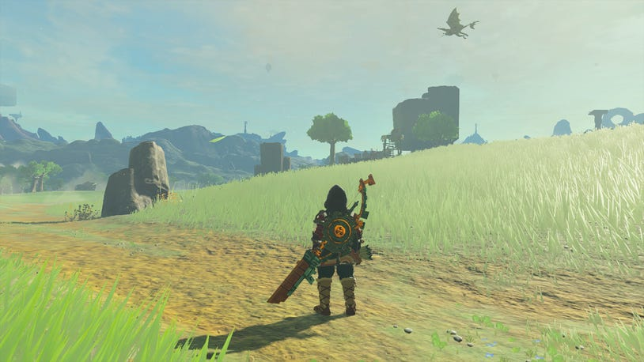

Take these out and just behind it, there’ll be a rock structure where Soldier Constructs loom. Clear these out and Ascend to the top of the structure to find a treasure chest.

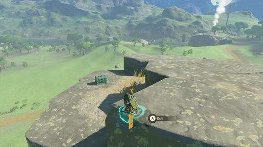

Treasure Chest: This has Time Bomb x3 inside.

If you look east from up here, you’ll see two separate plumes of smoke rising. Drop down and join the path, heading towards the thickest and closest plume of smoke, on the left.

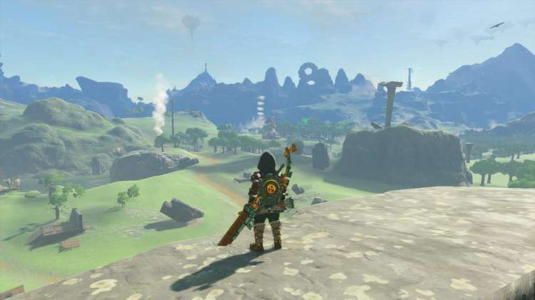

You’ll pass by Addison on the way, standing on the right-hand side of the path. Be sure to stop and help him if you have been each time.

Just beyond Addison is where you’ll find the first lot of smoke coming from. It’s up a slope on the left of the path, with a number of archways nearby.

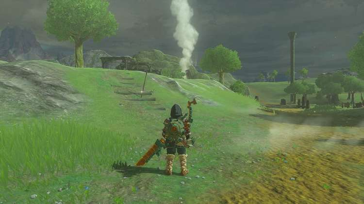

The smoke is actually coming from the Rebonae Bridge Well, so glide down inside to find out what’s going on. As you land at the bottom, you’ll see a campfire roaring, a ladder on the floor and someone standing there.

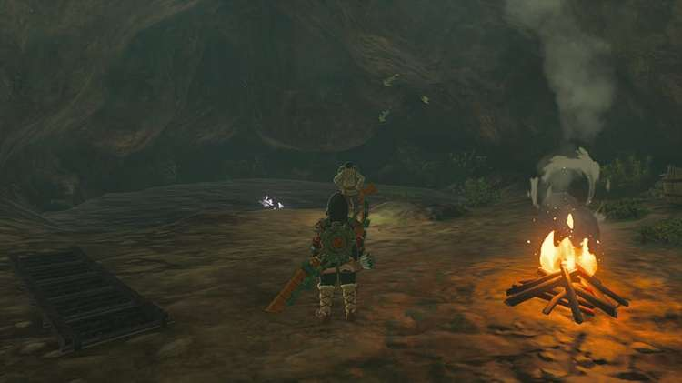

Go over to speak to him, to learn that it’s Dillie and he needs rescuing. This begins the side quest Fell Into a Well!

Note: If you want to collect anything from the well, do it before helping him.

Use Ultrahand to attach the broken part of the ladder then speak to Dillie again and tell him it’s fixed. You’ll get 50 Rupees in return for helping and you'll be back outside the well.

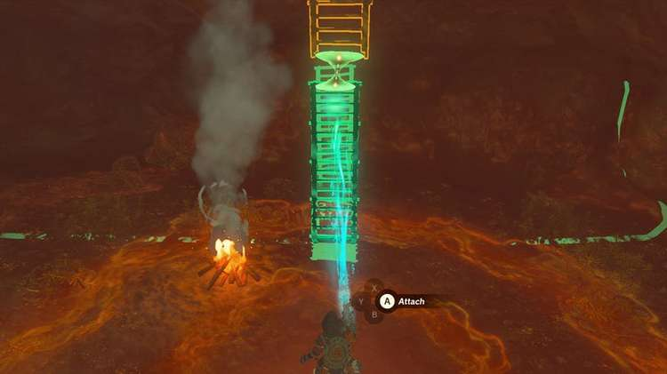

Look east from the well and just across the water to see the mouth of a cave with a skull above it. This is where you'll want to stop by next, but cross the bridge to reach it rather than glide over, so you can get yourself a Korok Seed on the way.

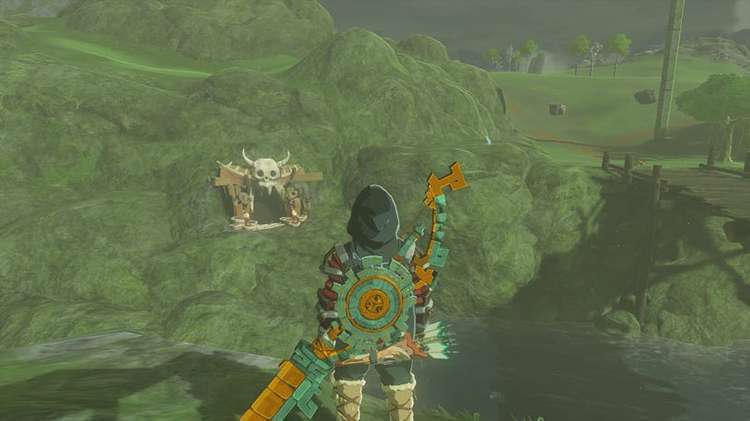

Start to cross the Reonae Bridge, then look down to the right immediately. Down below, you'll see a tree stump with a Korok on it.

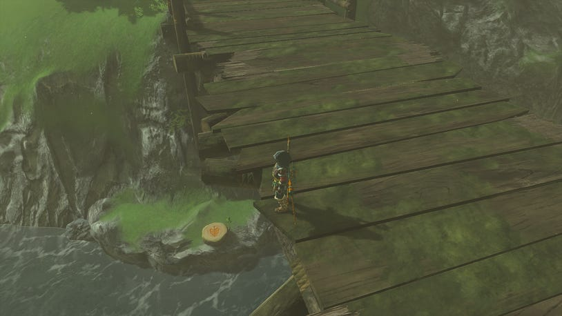

To get this seed, jump on the tree stump and a glowing ring of dots will form on the opposite side of the river. This is not only where you need to reach to get the Korok Seed, but you need to do it in a certain amount of time. As time ticks down, the dots will start to disappear. The easiest way to get over there in time is to jump in the water, but slightly to the left and at an angle to take into account the current. Then, use dash to get over to the other side as quickly as possible.

Central Hyrule - North Hyrule Field Seed 30

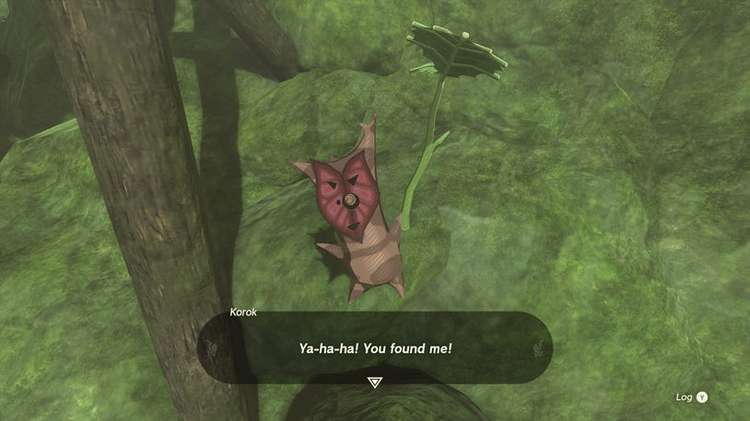

When you've got the seed, climb up to the top of the bridge. Go left and into the cave but be prepared for multiple Horriblins to be hanging from the ceiling.

Rebonae Bridge Cave

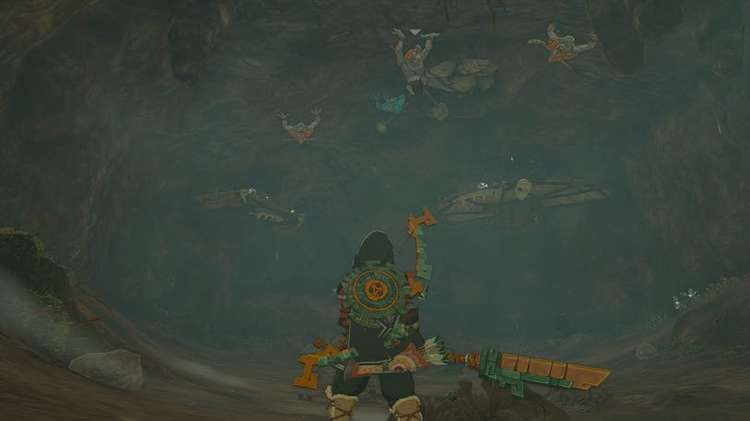

Defeating them will unlock a skull treasure chest on one of the raised platforms above. Use Ascension to get to each of the platforms and collect the loot in this cave.

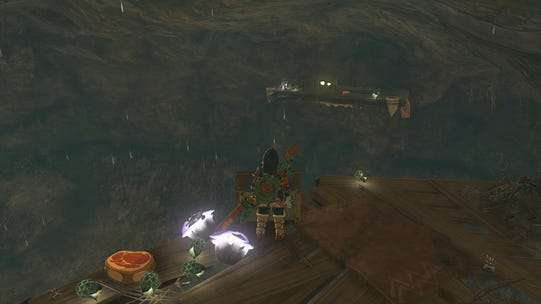

Treasure Chests: On the platform with the standard chest, you’ll find a Spear.The chest that opened after defeating the Horriblins you'll get Bomb Flower x 5.

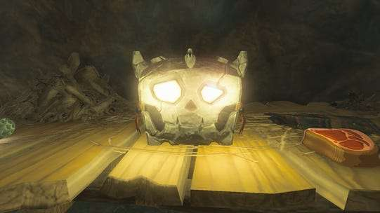

If you look up in the center of the room you’ll see a hole filled with rocks that can be broken. Use an arrow and a Bomb Flower to destroy it and reveal the Bubbulfrog for this cave.

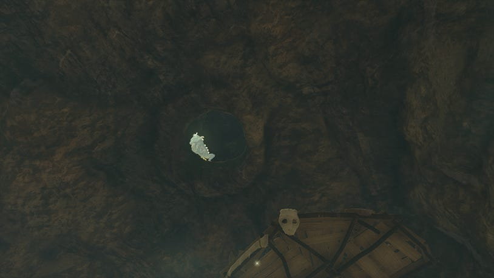

Leave the cave and go southeast to seek out the second puff of smoke, which is coming from the Wetland Stables.

At the Wetland Stables

Around this area, you can find Splashfruit, and we'd recommend stocking up on as many as possible.

When you've reached the stables, there are a few things to do here. Firstly, go to the right side of the stables, by the horses to speak to Ami, which will start the side quest An Uninvited Guest.

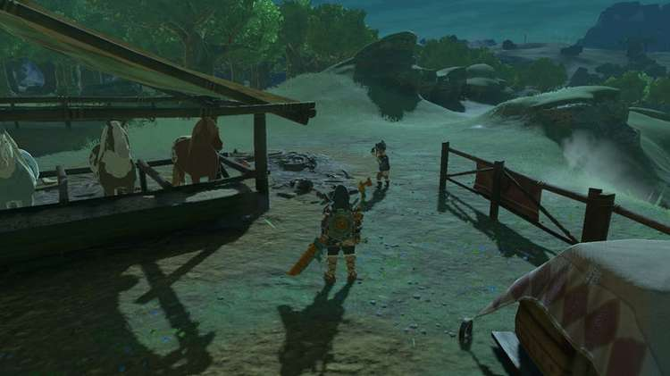

Ami will also point out the Wetland Stable Well, located at the back of the stables. Along the well, you'll find boxes and barrels scattered in the water. You can also pick up some Sticky Lizards and a Tireless Frog at the opposite end.

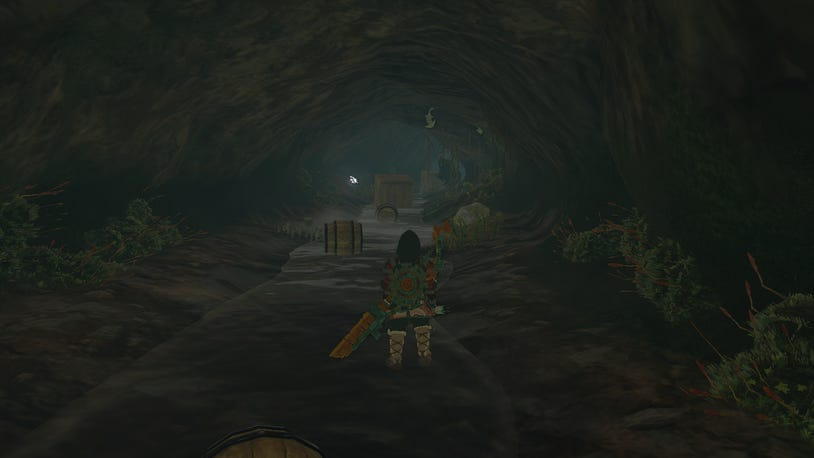

Ascend at the opposite end of the well to come out at the Wetland Stables South Well, where Ami said monsters roam. Pull out a few Bomb Flowers and clear the Moblin and Lizalfos camp to finish the An Uninvited Guest quest.

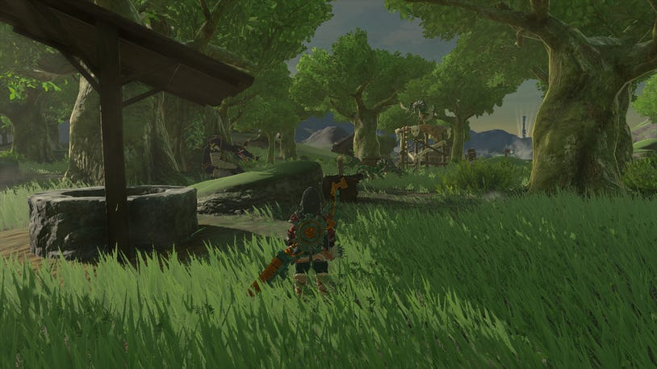

Return to the Wetland Stables, tell Ami the good news, and receive two Pony Points. Just behind the Wetland Stables, you'll be able to see the faint glow of a shrine. This is the Tukarok Shine, which you should go over to activate as a fast travel point or complete.

Tukarok Shrine

Then head southeast to start making your way toward the Lanaryu Wetlands.

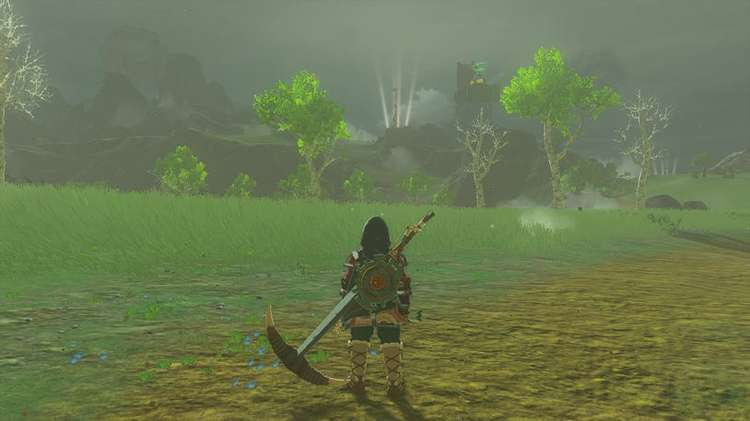

As the path begins to curve more towards the south, When you can see the Skyview Tower and a Shrine in the distance, start to turn east toward the ruins.

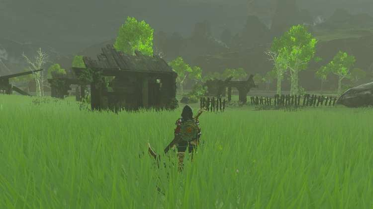

This will take you to the Lanaryu Wetlands Well at coordinates 1218, -0400, 0010. Drop down to find someone practicing on a training dummy.

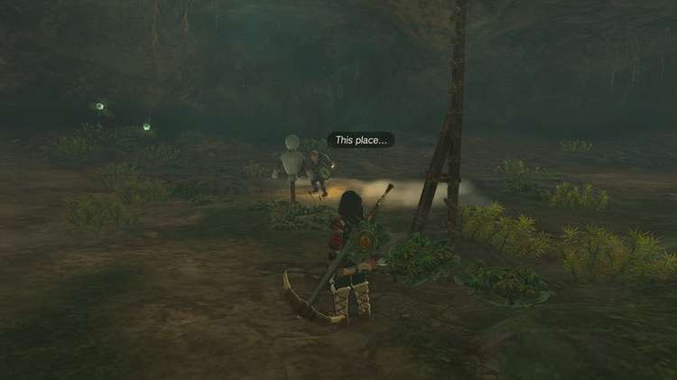

Pick up the arrows and the Eightfold Blade from the target, then talk to them.

Show Spoilers

Exit the well and start to go east through the wetlands. If you stick to the wooden planks that form a path through the center of the wetlands, it will eventually curve around to the northeast and you should be able to see another Shrine off in the distance.

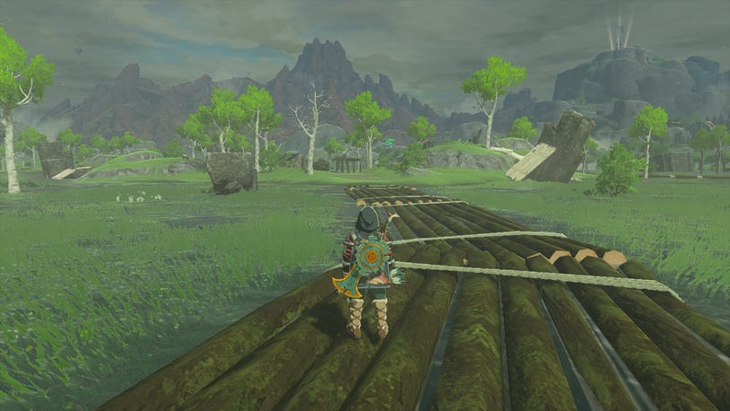

To get there, you'll go through the Goponga Village Ruins, bringing you to another well - the Goponga Village Ruins Well.

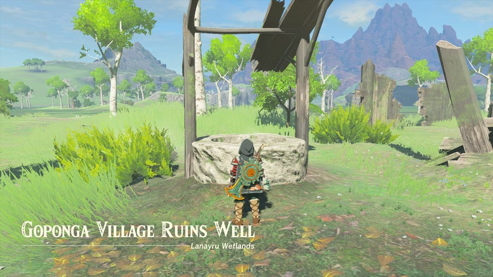

There's a note on the table about sticky frogs and you'll be able to pick up some inside here.

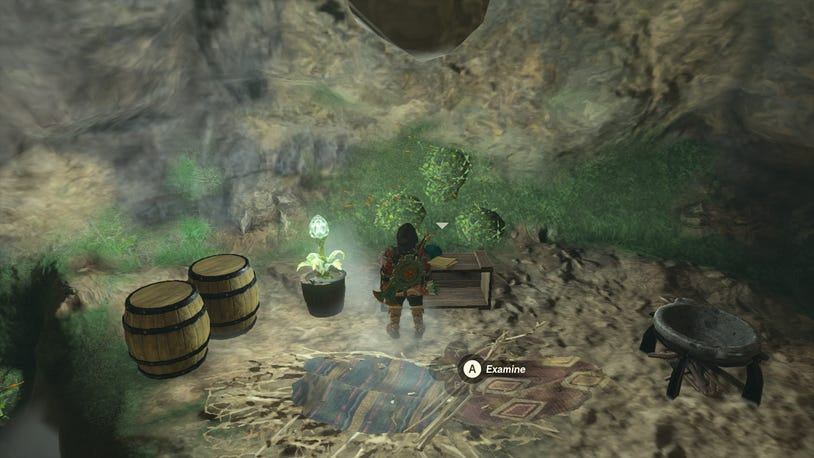

When you're done looting, Ascend back to the Goponga Village Ruins. Continue northeast and follow the wooden log path, then as you reach the shrine go off to the north to get it and unlock it. Once that's activated (or completed) spin around from the Jonsau Shrine and face the boneyard.

Jonsau Shrine

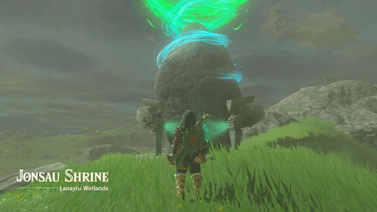

Head for the giant fishbone dockyard and to the back to find a Bokoblin camp. There will be Bokoblins, Soldier Consutrcts, and Lizalfos guarding the area. You'll find a chest on the edge of the dock with a leveled Bow.

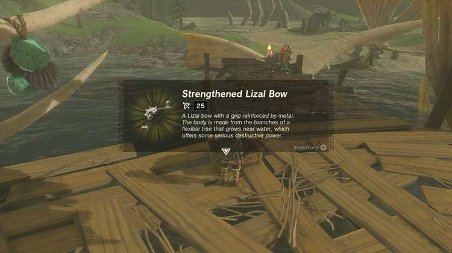

When you've collected this you'll want to go southeast across to the other island with the giant boneyard.

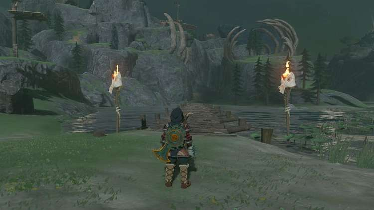

Find the very long bridge heading east, into the cliffs (at coorindates 2023, 0013, 0010) as you reach the other side you should see a Blupee, telling you that there's a cave nearby.

Follow the thin trail up to the waterfall and go left into the Boné Pond East Cave.

Bone Pond East Cave

You'll find a Like Like covered in stone spewing boulders, kill it for a Like Like tone and chest as you start to head northwest through the cave, and you'll encounter Horriblins. As you reach the point where bones cover the ceiling and emerge from the walls, look to the right to find the Bubbulfrog.

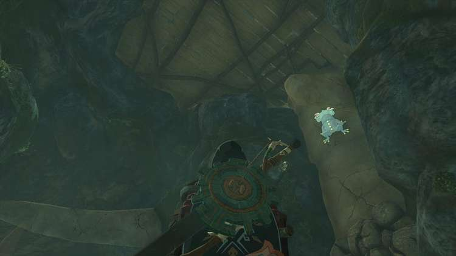

Break the rocks and the bottom of the bones and use the underside to Ascend.

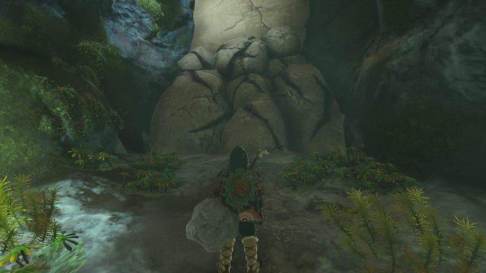

Be careful when you reach the top, as there is a Bokoblin boss and a number of little Bokoblins are up here. When you've cleared the camp out, you'll find a chest that the Bokoblin boss was guarded, as well as a person in a cage.

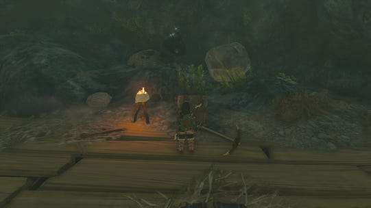

Treasure Chests: Inside the chest, there's a Broadsword. You can find an additional chest outside with Rupees.

Use Ultrahand to remove the cage from Hino then speak to him to get your rewards. He'll hand over some Salt-Grilled Mushrooms and Hasty Fish and Mushroom Skewers. As an added bonus, he'll also give you one Hearty Elixir.

Return to the bones you used to Ascend into this space and Ascend through the bones again. This will take you to a higher level of the cave, allowing you to reach the Maoikes Shrine.

Maoikes Shrine

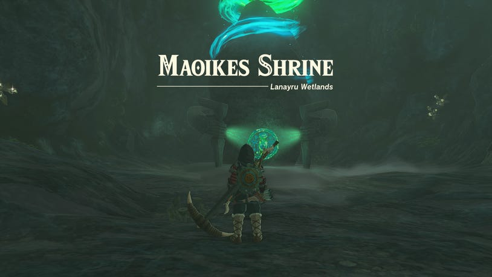

When you've activated or completed the shrine, Ascend for a final time so you can reach the top of the mountain. Face the northeast edge with the giant bones protruding from it and curving upwards. Look down from here, to see two blue pillars and a bridge.

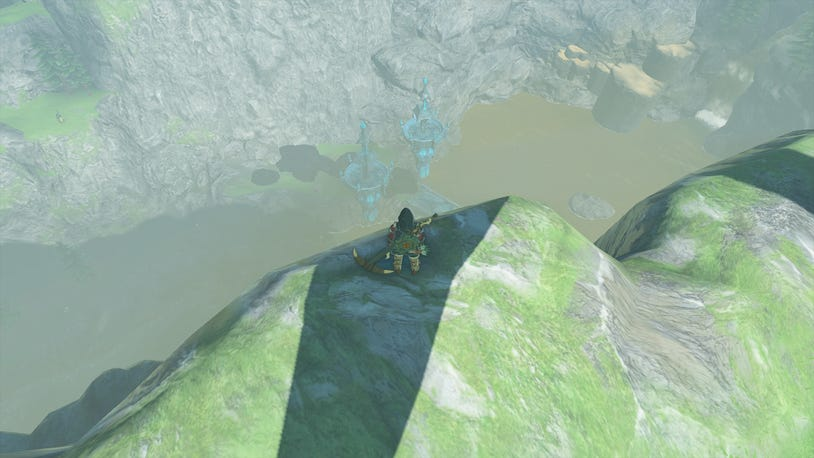

Glide down to the start of the bridge, and speak to Sasan who stands by the road just before the bridge. He'll tell you about how the thick sludge is blocking all the roads to Zora's Domain.

Note: You can walk through the thick sludge but it will slow you down significantly. The best bet is to use the Splash Fruit you collected earlier, or pick some up along the way, to clear the sludge when necessary.

As a general rule for this area, you want to follow the path up the mountain that's lined with blue lanterns that will take you along the Zora River, Tabahl Woods, and Bank of Wishes, eventually leading to the Oren Bridge. We've provided some guidance for a route below that will unlock some fast travel points and a Skyview Tower, but of course, you're free to climb it and explore it at your leisure. Just keep in mind that as long as you follow the paths that have blue lanterns, you'll be on the right track to reach Zora's Domain.

Once you've spoken to Sasan head across the Inogo Bridge and start to travel southeast. On the other side, if you follow the blue lanterns you'll end up joining a path that will start to snake up the mountain.

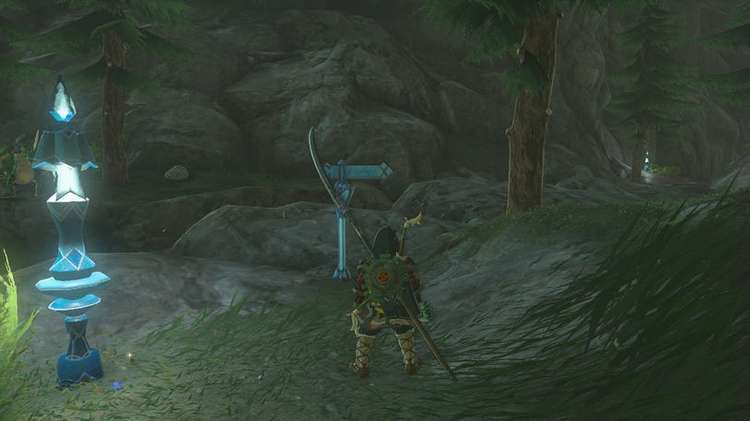

You'll reach a signpost that says Zora's Domain Ahead, then you want to head northeast along the Zora River that runs through here.

The path will end up branching off, going upwards from the river. It will begin to snake around to the south and southeast through Tabahl Woods. As you make the climb up here, boulders will begin to fall and roll down the hill so be ready to dodge these.

When you emerge into the woods, a Lizalfos will stand on the left near a fire. On the right, you might spot a Blupee at the entrance of a well-hidden cave, the Tabahl Woods Cave.

Tabahl Woods Cave

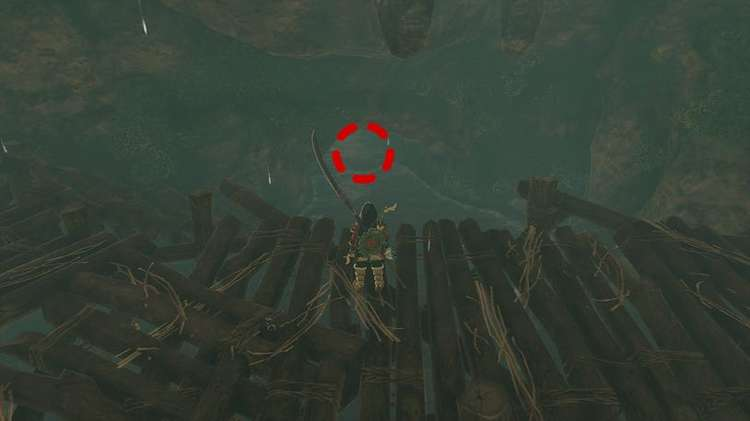

Drop down here to find Like Likes and Horriblins hanging from the ceiling. Take out both the Like Likes and the Horriblins then head northwest to pick up a treasure chest by the abandoned campfire. You can also find a Bubbulfrug near the second Like Like.

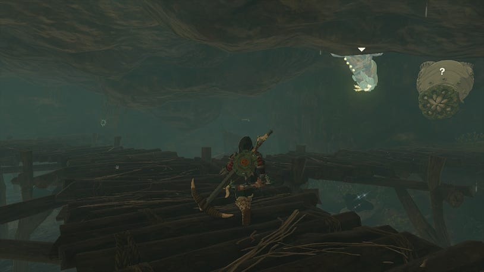

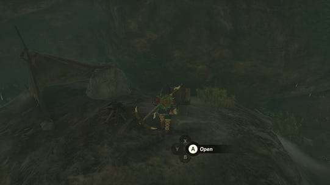

Treasure Chest: on the abandoned campfire in the northwest, you'll see the treasure chest next to the unlit fire. You'll receive a leveled Spear.

To exit the cave, go northwest and climb out of the hole or Ascend to reach the top.

From here, you southeast and rejoin the lantern-lit path.

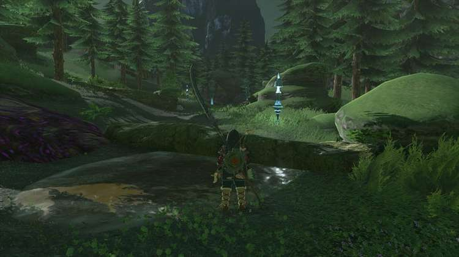

Follow it through the valley, until you reach a dead end by the water.

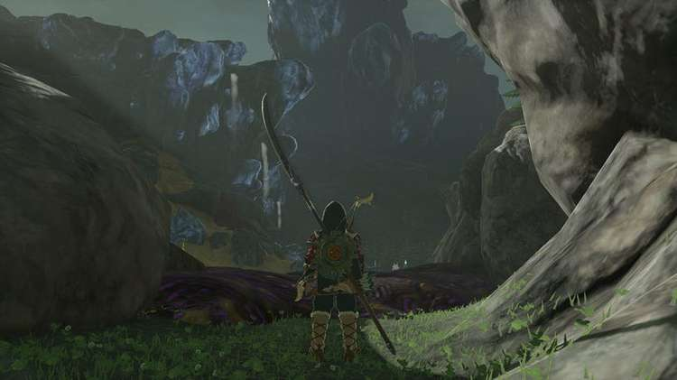

Turn right, where a boulder-throwing Like Like will be hanging from the wall. Then start to go up the path, past the bank of wishes. As you emerge, look to the east to see the Oren Bridge and a Lizalfos camp. Glide over to the Lizalfos camp (or take the long way to explore the area and return to the Oren Bridge on the other side).

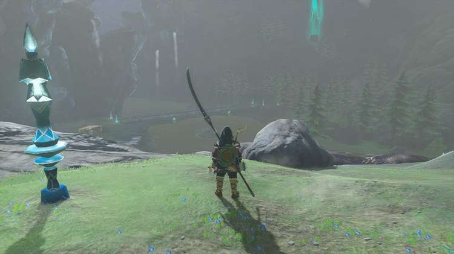

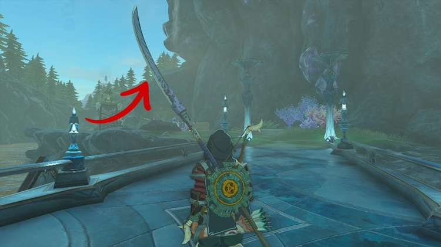

From the Lizalfos camp and the Oren Bridge, climb the north of the mountain.

Then join the grassy path and take this up, going in a southeast direction. Along the way, you'll encounter another Like Like. At the top of this sloping path, you'll come to the Learnings of Zora on the wall. This is a blue archway, with blue lanterns on either side. You can interact with the wall to learn more.

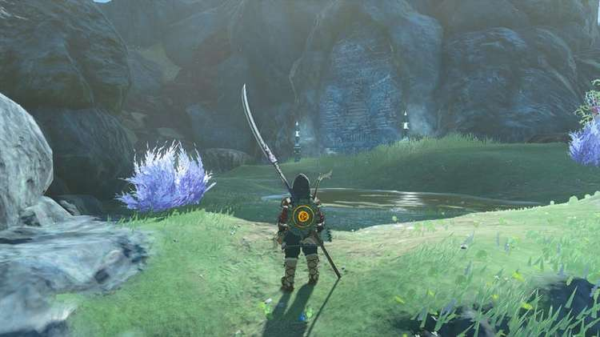

Do a 180 from the wall, and look up to see a Skyview Tower in the distance. This is where ultimately want to head to, so continue to climb up the mountain heading in a north/northeast direction. When you reach the next level, you'll see a cave just on the right at coordinates 2911, 0168, 0161. This is the Ralis Channel.

Ralis Channel

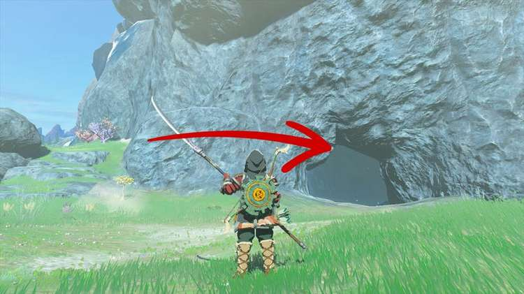

Enter it and approach the green glowing beam. Interact with it and a Shrine Quest will begin, which is called The Ralis Channel Crystal. You're told to follow the ray of light and offer up the crystal at the shrine on the other side.

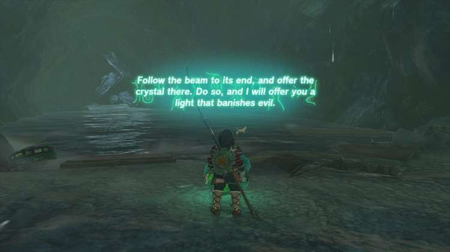

Use Ultrahand to attach the crystal to one of the planks of wood nearby, then use the fan to create a boat. To make it safely across, use a Steering Device if you have one, and deliver the crystal to the other side of the water. When you attach the crystal on the other side, the Joniu Shrine will open. Activate it or complete it to create a fast travel point, then simply Ascend to leave the cave.

Joniu Shrine

This will take you all the way to the top of the mountain and right by the Skyview Tower which will uncover the region.

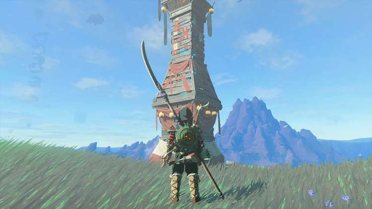

Go to the front of the Upland Zorana Skyview Tower and speak to Bazz here. This will begin the Mired in the Muck side quest. Use a Splash Fruit on him and then talk to him again to complete the quest. Doing so will reward you with a Zora's Spear as a token of thanks.

Then use a Splash Fruit on the front of the Skyview Tower, open and activate it. As you descend from the Skyview Tower, head to the east where Zora's Domain lies. This is a quick and easy way to reach it.

Upland Zorana Skyview Tower

Before you glide down to Zora's Domain, there's a few other points of interest that might be worth your while. First, glide down through a hole in the floating sphere among the Sky Islands above the tower to find a chest with a Sage's Will on the top level, and an Old Map on the lower level.

You can also glide south from the Skyview Tower and down the cliffside to find the Upland Zorana Byroad Cave. This tricky cave has a flooded ruin you can drain to reveal a chest holding the Climbing Boots!

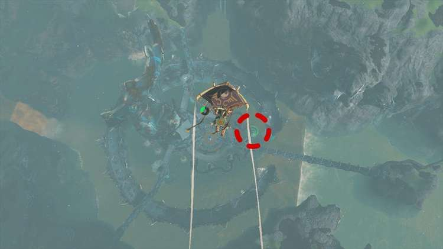

Aim for the Mogawak Shrine to create a fast travel point to quickly go to and from Zora's Domain.

Mogawak Shrine

When it's ready, Ascend onto the main bridge, then make your way to the center of Zora's Domain to get started on this area.

Regional Phenomena - To Zora's Domain

At Zora's Domain

When you reach Zora's Domain, there will be multiple main quests for you to complete in a certain order:

First, speak to Chroma, Kira, and the third villager who are standing in the center of Zora's Domain, near a statue and the sludge-filled water. Speaking to them will begin the The Sludge-Covered Statue main quest.

When this is completed, Yona will tell you to meet Sidon, who she says can be found at Mipha Court, near the Ploymous Mountain. This will begin the Sidon of the Zora main quest.

Instead of going off to start the Sidon of the Zora main quest, you should find Yona on the second floor of Zora's Domain in the pool behind the waterfall. She'll tell you about the Zora Armor that she wants to fix, starting the Restoring the Zora Armor main quest.
