33. Trail of the Master Sword

Find A Way Through the Lost Woods

Once you have completed the Spirit Temple and spoken to Mineru, she will explain the story behind Princess Zelda's plan in ages long ago, and how she intended for the Master Sword to be restored so that Link might use it here in the present to defeat the Demon King Ganondorf.

If you haven't already, now would be a good time to consider finding the remaining Dragon's Tears memories, as they coincide with this quest as well as the following one, though the order you complete them in is up to you.

Though Mineru is not certain of the sword's location here in the present, she will suggest you find the Great Deku Tree, who has always been the guardian of the Master Sword, and is where the sword was located in Breath of the Wild.

You can find the Great Deku Tree in the middle of the Great Hyrule Forest, a region located directly north of Hyrule Castle, and found up the northern road from the Woodland Stable on the border of the Eldin Canyon region.

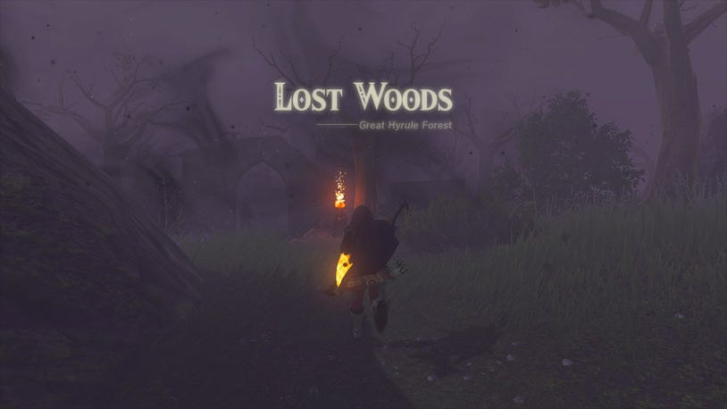

Unlike Breath of the Wild, where you would have to navigate a maze of flicking torchlights by following a breeze, you will not be able to get through the Lost Woods the same way. In fact, you can't even reach the Korok Forest by diving in from above - any angle of approach will be met with you getting "lost" and appearing outside.

After you have finished the Regional Phenomena, a few NPCs including a Hylian and Korok can be found outside, and will relay similar information to you, but the Korok will also mention his friends who may have fallen down a hole.

If you can't get through it, or from above, there's only one other way left: From Below.

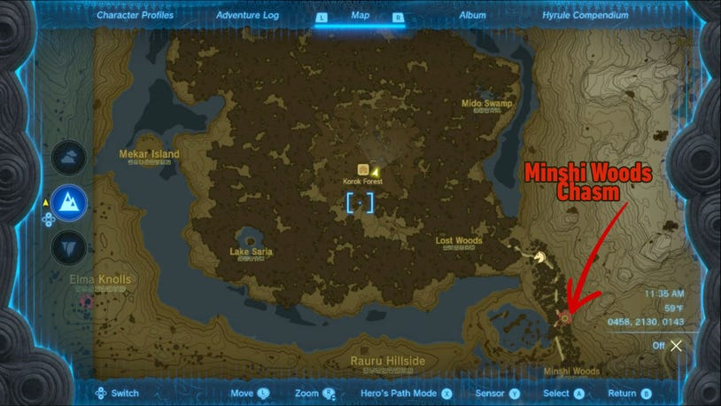

Though there are several chasms around the Hyrule Great Forest and Eldin regions, you may find it harder to approach the area beneath the Lost Woods than you might expect. This is because the giant lake that surrounds the forest above is impassible rock walls down in the Depths. That leaves only one entrance - the southeast side.

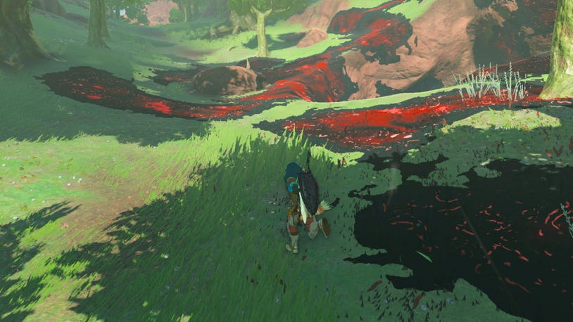

Looking at the surface map, you should be able to spot a smaller chasm along the road north from Woodland Stable towards the Lost Woods, in an area called the Minshi Woods.

Diving into this chasm, you can immediately spot a trail of Poes leading up a path up north into the darkness into the Korok Grove.

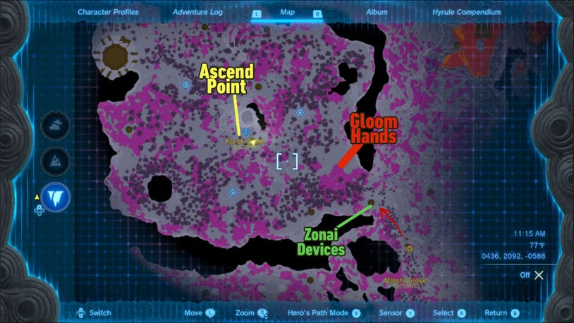

Follow the road northwest, and if you get turned around, just look at the map of the surface above to get your bearings on the entrance to the underground Korok Grove.

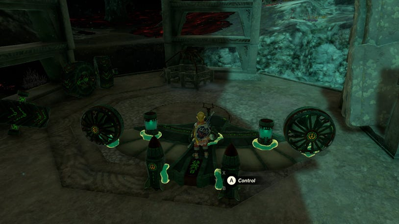

The area beyond will be dark and full of Gloom, but you will have some help getting across. If you look to the left of the path, there's a Zonai Device Storeroom full of assorted devices to help you either fly or drive across the expanse of Gloom. Be sure to attach a Giant Brightbloom Seed to your vehicle to help light the way as you make for the center of the underground grove.

Note: Due to the tendency for Gloom Spawn Hands to spawn along the path towards the center of the Korok Grove, we highly recommend taking a flying machine to soar past it, so be wary if going by ground!

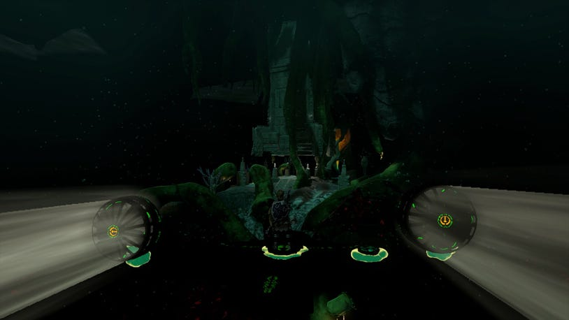

Aim for the large bright area in the center of the underground woods, and you can find the Rikonasum Lightroot on a platform next to a large stone platform with a pillar coming down from above.

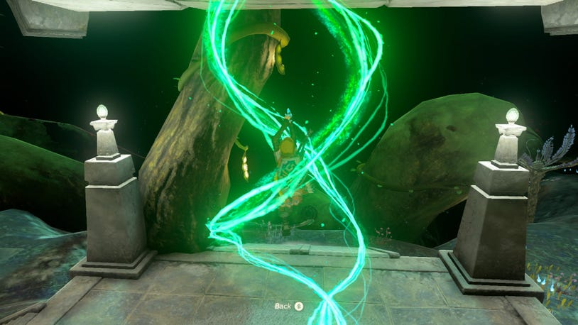

By ascending through this pillar, you can bypass the Lost Woods entirely, and arrive in the Korok Forest right in front of the Great Deku Tree!

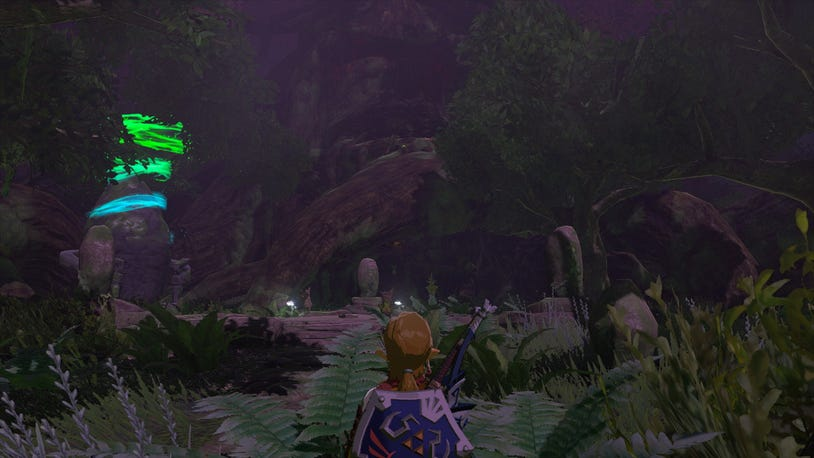

However, things are not all right up on the surface. The Deku Tree won't respond to you, and even the Koroks seem to be in a daze under the purple haze that has enveloped the woods. Before you start to explore, be sure to grab the Musanokir Shrine by the Deku Tree so you can get back here easily in the future.

Musanokir Shrine

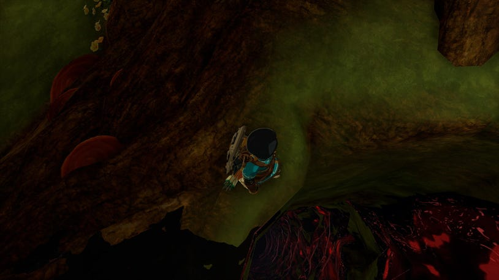

In order to bring the Korok Woods back to normal, you'll need to get to the root of the matter - which lies within the Deku Tree. Once inside the tree, head to the back to find another chasm. This one goes into the heart of its roots. The gloom won't recede without a fight, so be sure to stock up on Sundelion-enhanced food, powerful weapons, and tough or gloom-resistant armor.

Boss Fight - Phantom Ganon

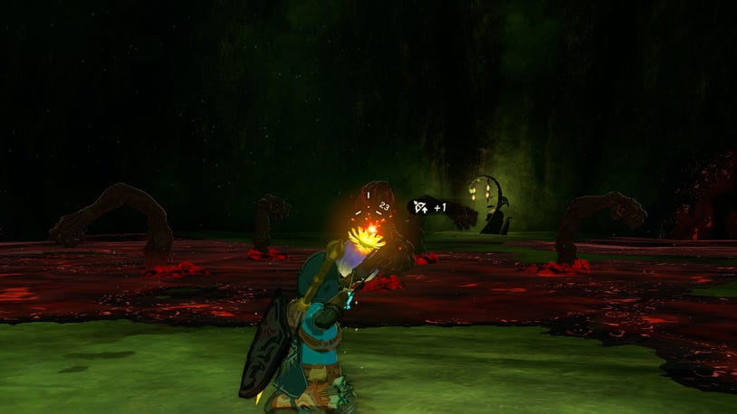

As soon as you descend into the Great Deku Tree Chasm, several Gloom Spawn Hands will begin to appear in the center. Stick to the edge of the arena and fire off as many Bomb Flowers, Elemental Keese Eyes/Wings, Elemental Like Stones, or precious elemental ore that you have on hand to decimate their number before they can close in.

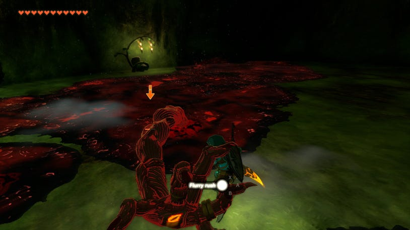

Unlike other such Gloom Hand encounters out in Hyrule, these ones won't despawn on their own after a while, so you need to be quick and decisive with your attacks to whittle them down before they can surround you. Thinning their rank early on will make it much more easier for you to perfect dodge and flurry attack the remaining hands.

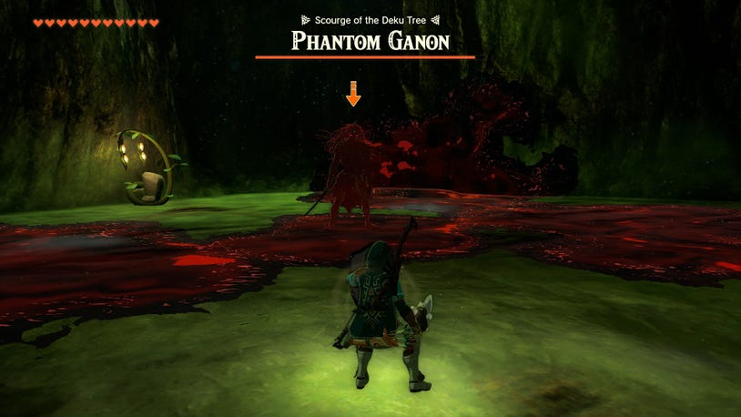

When they go down, Phantom Ganon will appear once more, armed with his signature Gloom Sword. Unlike the battle in Hyrule Castle, he won't have an army with him, but he will spawn his own puddle of Gloom, and unless you can hit him several times, the puddle will remain emanating from him to damage you just by being close.

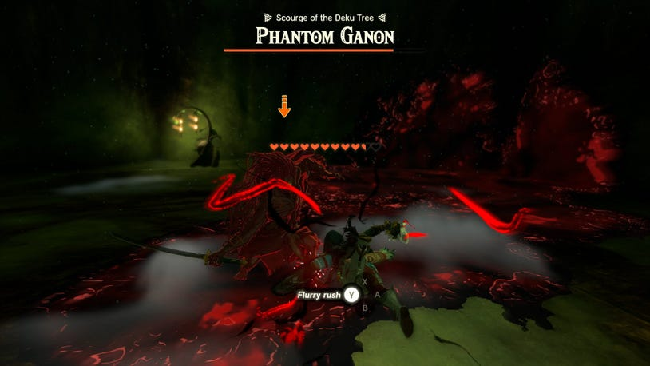

Repeat the steps you used to best him in Hyrule Castle by waiting for Phantom Ganon to fly up to you, note how he holds his sword up or to the side, and then dodge after a short pause to score a perfect dodge, and hit him with a flurry attack with your hardest hitting weapon.

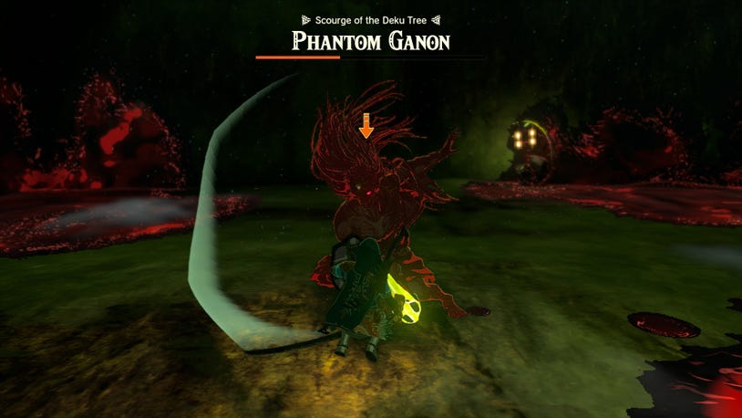

By this point in the game you should have a good amount of hearts, upgraded armor, and hard-hitting weapons so the fight shouldn't last too long. Once you get the timing down, you need only rinse and repeat until he falls.

Once defeated, the gloom will finally recede from poisoning the Great Deku Tree, and several Korok will appear to congratulate you. At this point, you can either look for a series of ledges in the corner to Ascend upward and back to the surface, or just fast travel to the Shrine outside the Great Deku Tree.

Up on the surface, you'll find the Kokiri Forest is very much back to normal, and the place will function much as it did in Breath of the Wild, with the Koroks here offering quests, a place to rest, and items to purchase from the store in the Great Deku Tree.

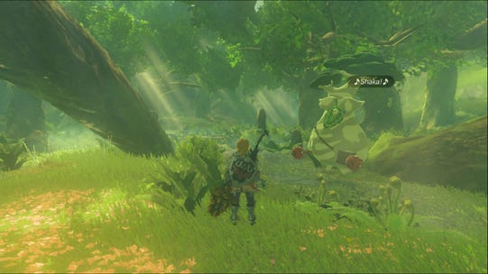

Even Hestu will have joined the other Koroks, taking up a permanent residence here from Lookout Landing, so be sure to return here with any more Korok Seeds you find!

To speak to the Great Deku Tree, head up his branches to find a platform above to speak, and he'll recall a memory of the last time you spoke, right before your adventure in Tears of the Kingdom began.

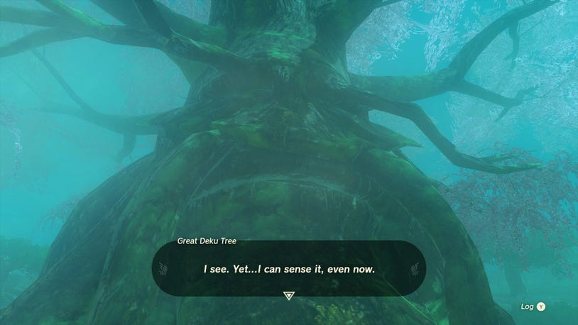

After the memory is done, he'll sense that the Master Sword is indeed somewhere in Hyrule, and will pinpoint the location on your map - noting that it appears to be moving.

Trail of the Master Sword

This will start the next quest to actually recover the Master Sword, and you should also highly consider finding the last Dragon's Tears memories if you haven't already, as finishing the quest will bring the sword to you!
