10. Tulin of Rito Village

Before you head off towards the Hebra Mountains, visit the Brazen Beak if you haven't already done so to purchase a Snowquill Tunic or Snowquill Headdress. Where we're heading next is extremely cold, so you'll need at least two warm pieces of clothing before you proceed for the best chances of survival.

Reach Hebra Mountains

As Tulin dashes off, insistent on finding out what's causing the blizzard in Rito Village, Teba and Saki are unable to help Link on his quest. However, Teba suggests that Link speaks to Harth who can be found over by the base of the Hebra Mountains. He'll point out two bonfires that are burning fiercely in the distance and tell you that's where you need to go to find Harth.

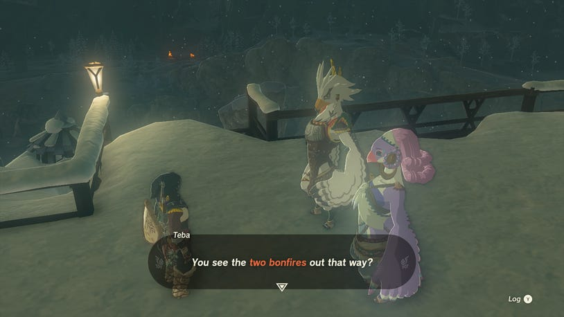

From the edge of the platform that Teba and Saki are standing on, you can just leap off and use the Paraglider to get over to the base of the Hebra Mountains and join the Hebra Mountain Climbing Path.

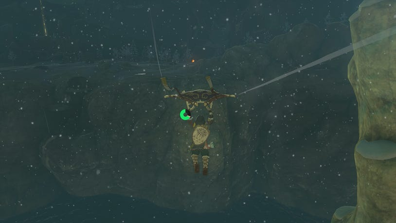

Follow the path up to the two bonfires (but feel free to stop off and help Addison along the way with his Hudson Construction Company sign). Just beyond the bonfires stands Nekk, who you should talk to and learn more about how they're used throughout the mountains to act as a guide to the path.

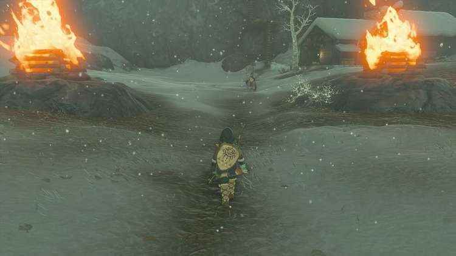

During this exchange, he'll point out the nearest Skyview Tower, and mention that nothing can beat the spotlights for highlighting what you can find in the Hebra Mountains, so it's worth a visit. When you're done speaking to Nekk, go over to the Hebra Trailhead Lodge, and talk to Misa outside. Misa will explain lots of strange things have been found at the foot of the mountains, and you're free to take whatever you like.

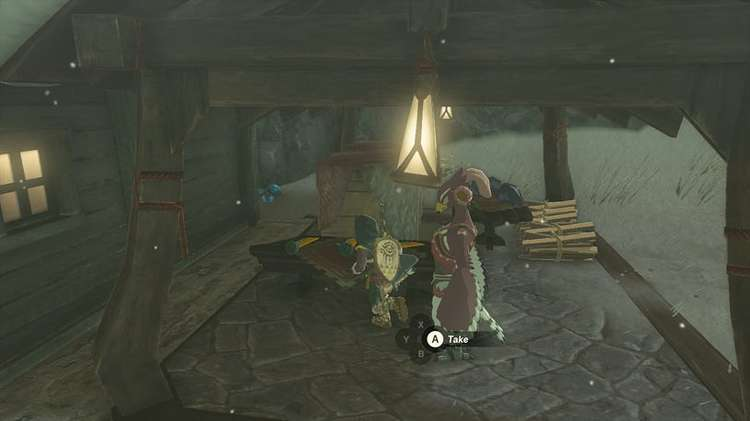

Stock up on the Soldier Construct Horns, Wood, and Flint on the tables and go behind the boxes to pick up a Chillshroom. Once you've picked up everything you can, go inside the lodge to find even more Wood, Flint, and some Oil Jars by the entrance.

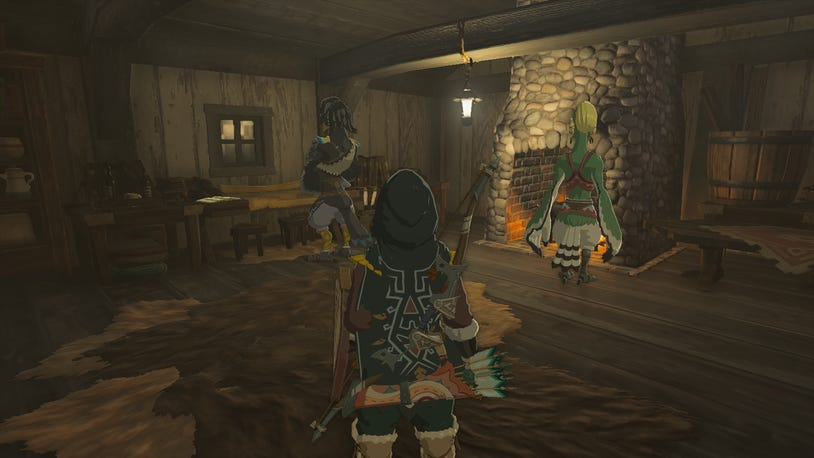

Speak to Amali by the cooking pot and pick up the Spicy Peppers next to her. Be sure to cook up some food if needed, especially some ice resistance meals if you haven't already got some on you. Once you're done with this, it's time to finally talk to Harth.

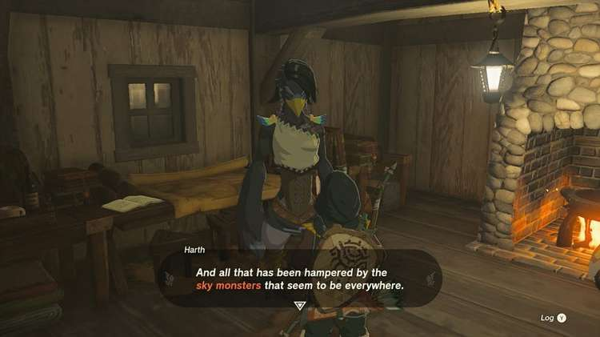

Just like everyone else at Rito Village, Harth is preoccupied with the blizzard and says that everyone has gone to scavenge for food or find out what's the cause of the frosty weather. He also hints that their plans have been hampered by some sort of sky monsters. He does have a suggestion for help though, and that's to find and speak to Tulin, who seems to have grown and developed some impressive techniques while you were away and has a particularly strong Wind-Gust Technique.

He'll tell you that Tulin was last spotted with Gesane and Laissa trying to find food. They've headed up the mountain, to the Hebra South Summit Cave, which is northeast of the Hebra Trailhead Lodge.

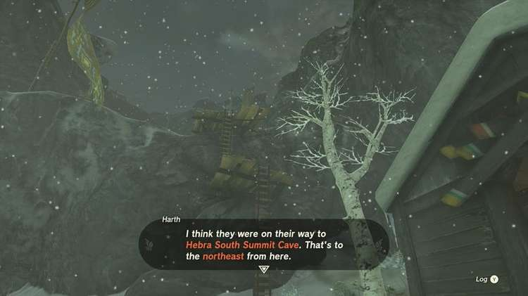

As the conversation wraps up, Harth tells you to keep an eye out for the bonfire at the mouth of the cave, to find the one Tulin has gone into.

Head outside and up the ladders to begin your journey along the Hebra Mountain Climbing Path. You'll be going north up this path, but along the way there are some additional activities you can take on including some side quests, activating a Skyview Tower, and even a shrine for a Light of Blessing.

Along the Hebra Mountain Climbing Path

Stick to the path, going north until you come to the first bonfire with Cecili standing beside it. Before going over to Cecili, go left (northwest) and follow the path smothered by thorns.

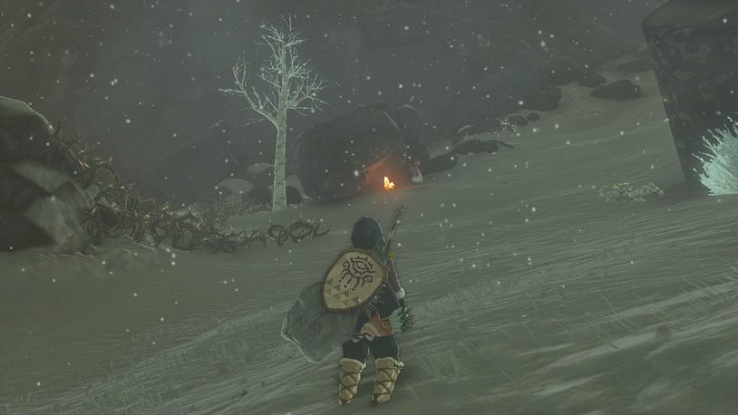

This will lead you towards both a side quest and the Rospro Pass Sky Tower. As you go further up the path, you'll spot a blocked cave entrance and Mazli outside. Speaking to Mazli will start The Blocked Cave side quest, and all you have to do to complete is to break through the rocks and talk to him again. It will take a while if you decide to use a hammer-like weapon, but if you throw a few Bomb Flowers you'll open it up in no time.

Rospro Pass Cave

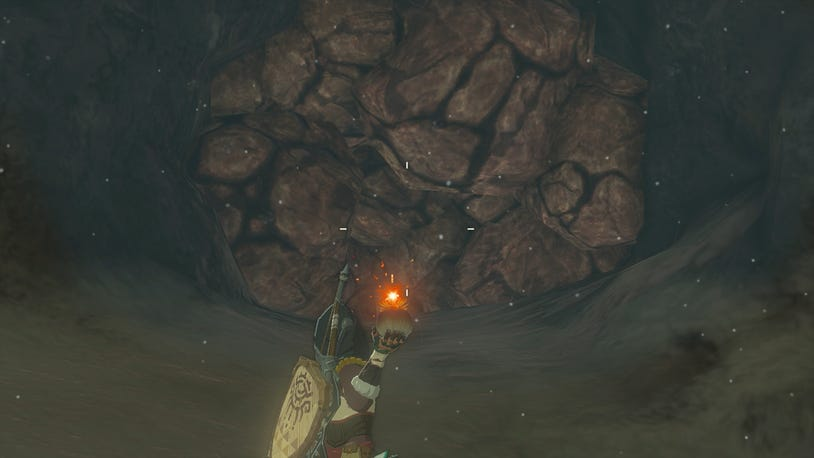

Although this does wrap up the side quest, you should head inside and go east while in the cave. Climb up to another room, where a Bubbulfrog can be found on the ceiling.

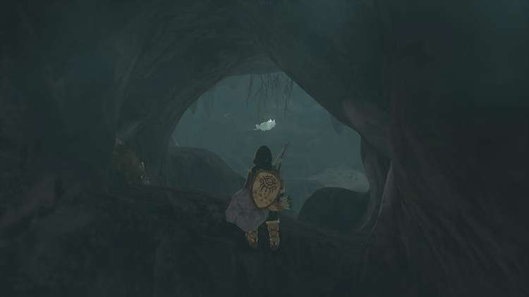

Exit the cave and go opposite towards the thorns, so you can go and activate the Rospro Pass Sky Tower. There's no puzzle to solve with this one, you can just go straight up to it. However, as it's surrounded by thorns, you'll need to clear the area.

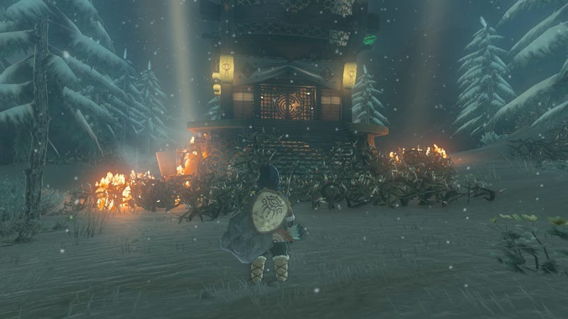

Use a Fire Fruit (either by itself or by creating a Fusion with an arrow), or another method to set fire to all the thorns and give you safe passage into the tower. step inside and interact with the pedestal to activate and uncover more of the map.

Rospro Pass Skyview Tower

With those two things ticked off, go back to Cecili by the bonfire and speak to her.

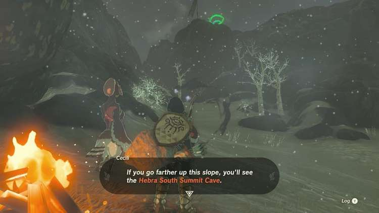

She'll point you in the direction of the Hebra South Summit Cave, and as she does, you'll spot the green glow of the Sahirow Shrine at the top of Corvash Peak.

Continue up the slope and you'll encounter Ice Keese (the soft white glows you'll see as you approach) as well as a Bokoblin. As you get closer, more Bokoblins will appear from the right-hand side, where a fire burns and a small camp is set up. They'll roll out an Ice ChuChu with them, which you can use to your advantage.

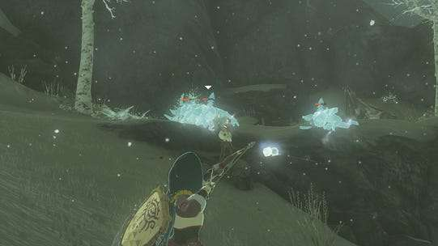

If you hit this with an arrow, it will freeze the Bokoblins around it, giving you more time to attack.

When you've cleared out this area, take the time to climb up to the top of Corvash Peak and complete the Sahirow Shrine (or at least activate it so you can fast travel to it later).

Sahirow Shrine

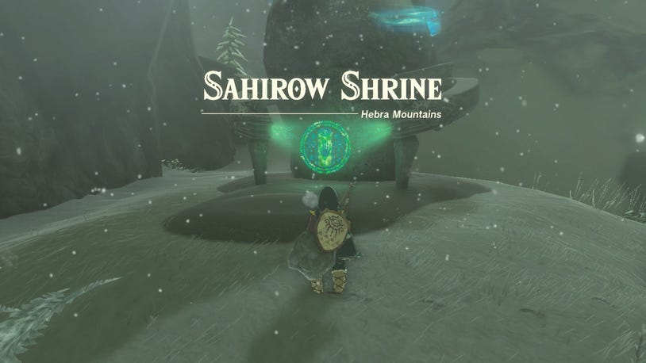

Drop back down to the slope, then continue up until you come to a fork in the road. The Hebra South Summit Cave is to the left (northwest), but for now, go right (southeast) and to the end of this path. You'll find Verla waiting outside the Talonto Peak Cave, and speaking to him will begin another side quest, Crossing the Cold Pool.

Talonto Peak Cave

Verla needs 10 Chillshrooms from inside the cave, but he's injured his wing, plus, no one can cross the icy waters including Link. Instead, you'll need to use the construction materials outside of the cave to create a bridge that allows you to cross the water and reach the other side.

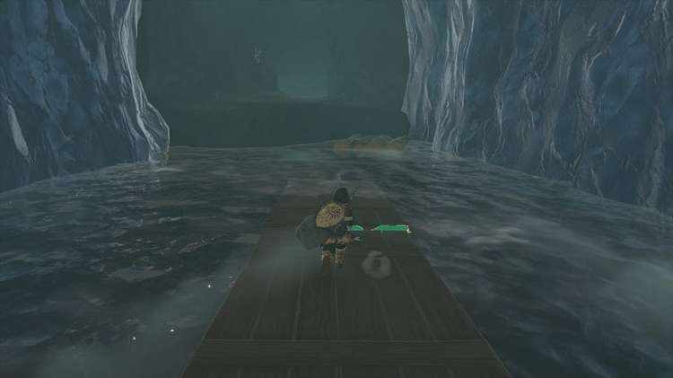

As you're crossing the river, look up towards the ceiling covered in icicles to see another hole in the wall above the room filled with Chillshrooms.

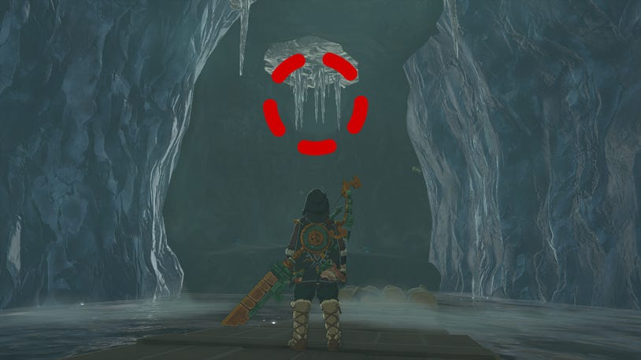

If you climb up here, you'll find the Bubbulfrog for this cave.

With at least 10 Chillshrooms in hand, go back to Verla and hand them over. Return to the fork in the road, and go northwest now to find the Hebra South Summit Cave, complete with a bonfire roaring at the mouth of it and Laissa inside.

Hebra South Summit Cave

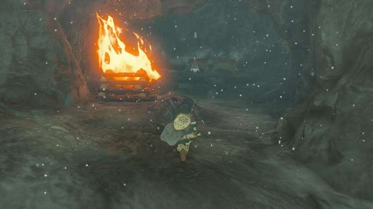

A quick conversation with Laissa reveals that Tulin is further inside the cave with Gesane, trying to find food. Going further into the cave, a small body of water will be blocked off by thorns to the east. You can destroy the thorns to reveal a pool with Chillfin Trout and Lizards. But for Tulin, go east, and along the thorny path until you reach the room with a frozen pool of water at the bottom, and a strong gust of wind going up.

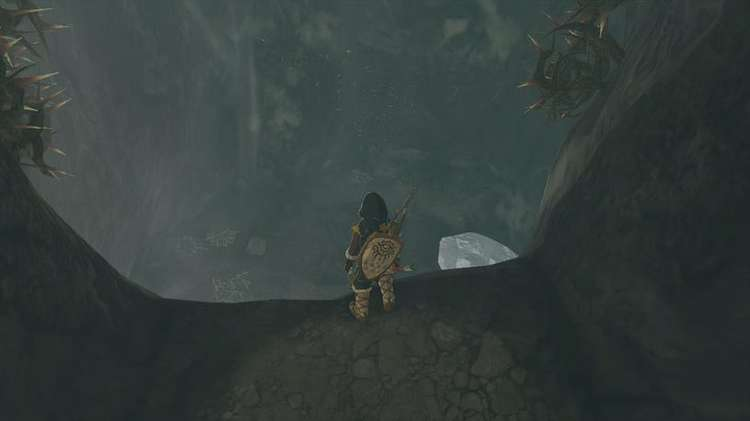

Drop down and break the frozen water to drop down into a cave with Chillshroom, Chillfin Trout, and nodes. Use Ascend to get back out of here and into the room you just came from, when you're done collecting bits.

Use your paraglider to jump into the wind and travel upwards on the wind. As you do so, you want to face north to continue into the cave.

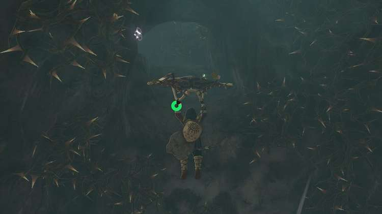

Follow the path up and you'll start to see glowing Turquoise nodes. Entering the next room, you'll want to be careful as a Horriblin will be hanging around.

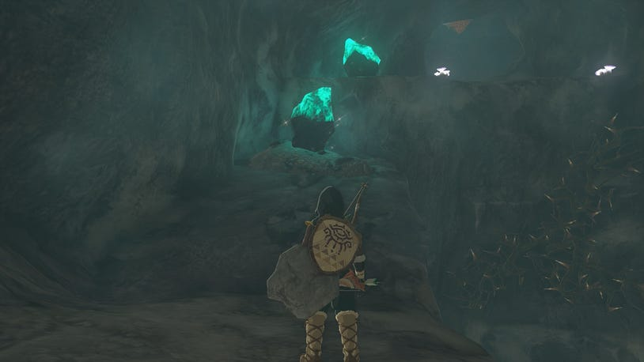

When there's no more threat around, walk to the center of the room to find an unlit campfire. Remember when you needed to use fire to propel you earlier? You'll need to do the same here. Break the barrels to find some Hylian Pine Cones, and use the Flint from around the campfire to light it.

Throw a Hylian Pine Cone on the fire, then jump and paraglide further up, heading east to land on the next ledge. Before you run off, turn around so you're facing the room you just flew up from. Look to the northwest, to find a well-hidden ledge, that's smothered in thorns.

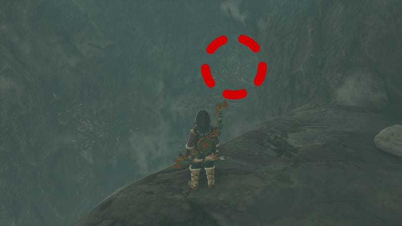

Glide over to this and clear the thorns to get into the room with the Bubbulfrog for this cave.

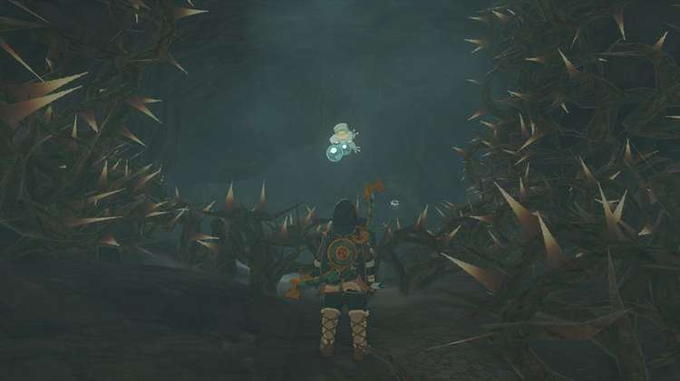

Jump back over to the ledge you first landed on and proceed into the next section of the cave. In this room, Stone Pebblits will appear as soon as you proceed, so watch out!

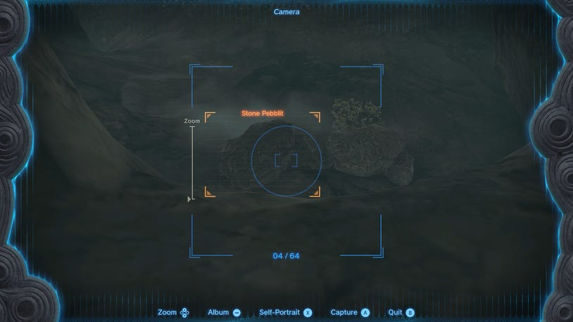

Continue onto the next bonfire to find Gesane, and speak to him to find out where Tulin is. He'll say you've just missed him, and he's gone to follow the monsters that everyone's been referring to back to their nest.

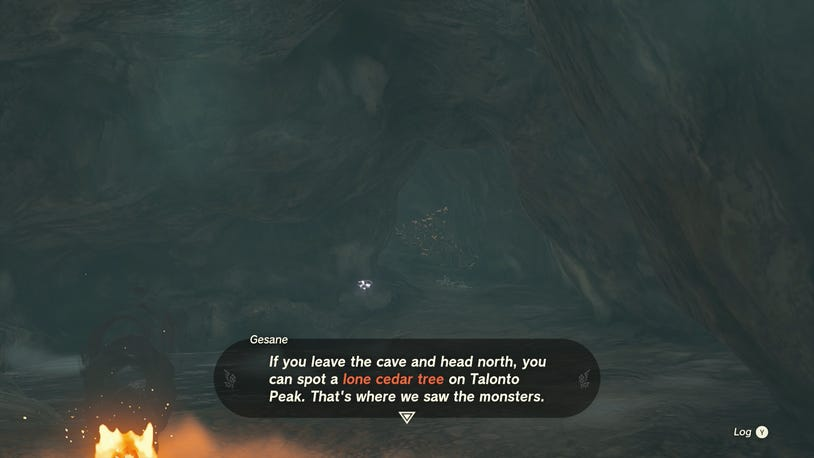

Leave the cave, climbing out of it as you reach the Brightbloom Seeds. As you emerge from the cave, you can find Addison again struggling with his Hudson Construction Company just north of the hole.

But to find Tulin, go northeast up the slope, up towards the ruins and the tree stump.

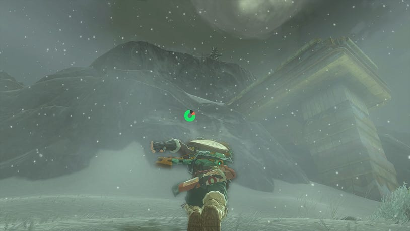

Be careful of the patrolling Bokoblins. Continue north from the ruins to the very top of the mountain where you can see a single tree. When you reach the top, you can find Tulin standing at the edge of the cliff and the monsters circling ruins in the distance.

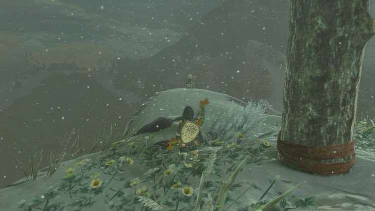

Tulin's bow has been stolen by one of the monsters, which happens to be an Aerocuda, so the next task is to help Tulin get it back. The wind-gust technique Harth mentioned earlier is explained by Tulin here, so gusts of winds can be created for you to glide on over to the monster.

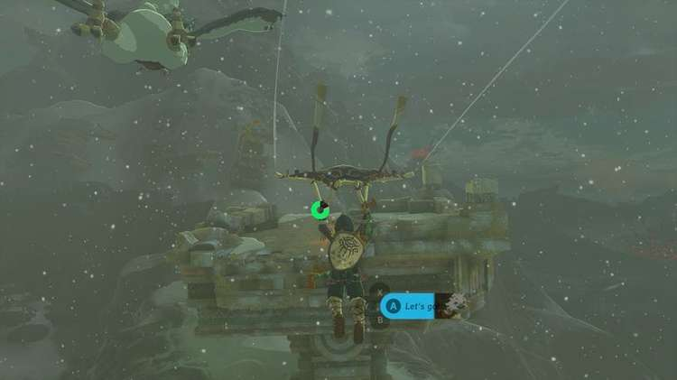

When you're ready, tell Tulin to create a gust of wind and use it to glide straight over to the ruins in the distance. As soon as Tulin lets out of a gust of wind, jump and press glide for a boost. Don't worry if you don't make it, you can use Ascend to get to the top. Use your arrow to hit the Aerocuda and return Tulin's bow.

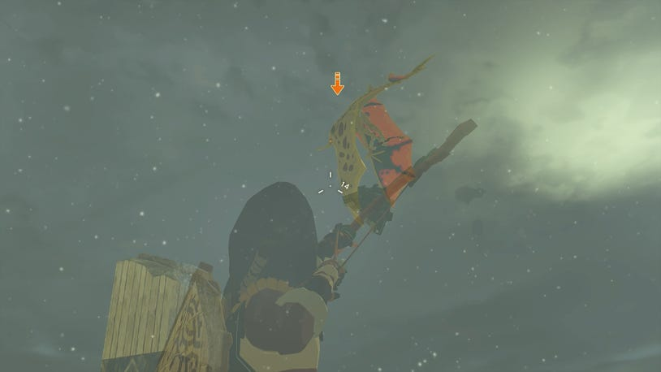

If you're out of arrows, break the boxes around the top of the ruins to get some.

More monsters will appear along with Bokoblins and drop them down onto the ruins for a fight. Work together with Tulin to take them down and Harth will fly up to join you both.

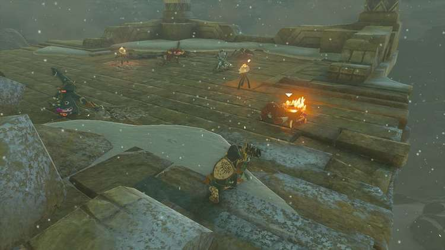

With Tulin revealing what they know about Zelda's whereabouts, you're off to investigate the cloud that seems to be causing the blizzard.

Go Back to the Sky Islands Above Hebra Peak

Tulin will accompany you now, to investigate the Sky Islands above Hebra Peak. From the ruins, go northeast and make your way to the top of the mountain. If you look up here, you'll see where the Sky Islands connect to the mountain, allowing you to climb (or Ascend) up.

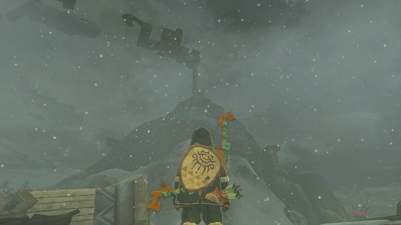

For the rest of this quest, you're going to use a combination of Tulin's wind-gust technique and Paragliding to reach platforms. Make your way first to the ones that stick out from the mountain, opposite the ruins where you've just recovered Tulin's bow.

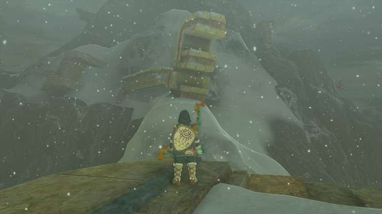

Climb up these, then go to the other side of the mountain and glide across to the next set of platforms. A Soldier Construct will be waiting for you along this route, but follow the left side of the mountain all the way up to the top.

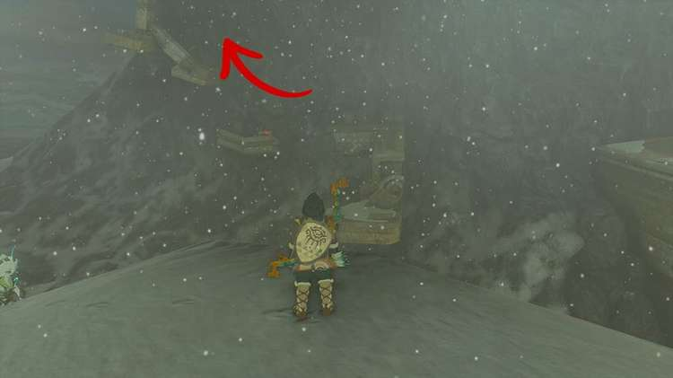

At the summit, you'll find Huck waiting there as well as Aerocuda who are circling the top carrying huge snowballs.

Rising Island Chain

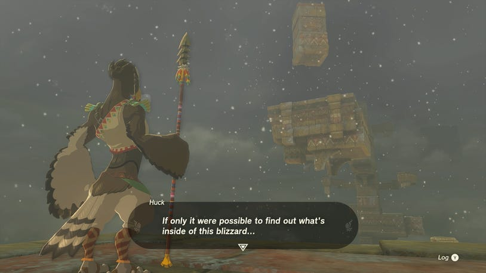

Once you reach the top with Huck, the rest of the quest becomes a platforming exercise. As you start to climb up toward the top of the cloud, here are some things to remember:

Use Tulin's wind-gust technique. If you ever feel like you won't make a jump just by Paragliding alone. You can use this at the start of a glide, or to give you a boost when you've already started.

Use Ascension where you can. If it looks like you can use Ascension, but you can't reach the platform, check for boxes to stack.

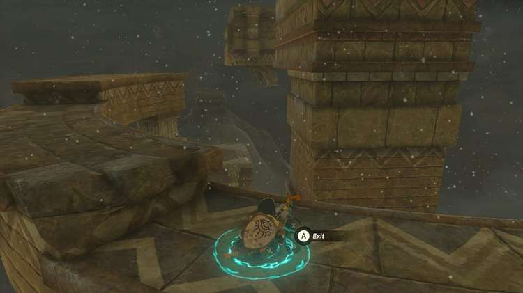

There will be a set of boats that have canopies at the top that should be used as trampolines to give you height and help you glide to platforms that are further away

Break ice patches and boulders to reveal more trampolines or secrets

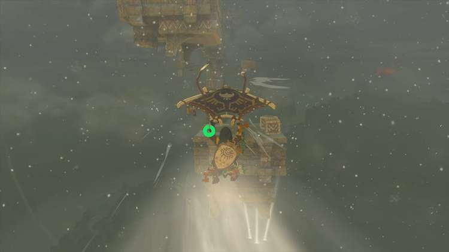

From Huck, head northwest and use a combination of Paragliding and Ascension to reach the top of this first section. Tulin will stop you as you get to the top and start to head toward the Shrine, fascinated by the suspended boat that catches his attention.

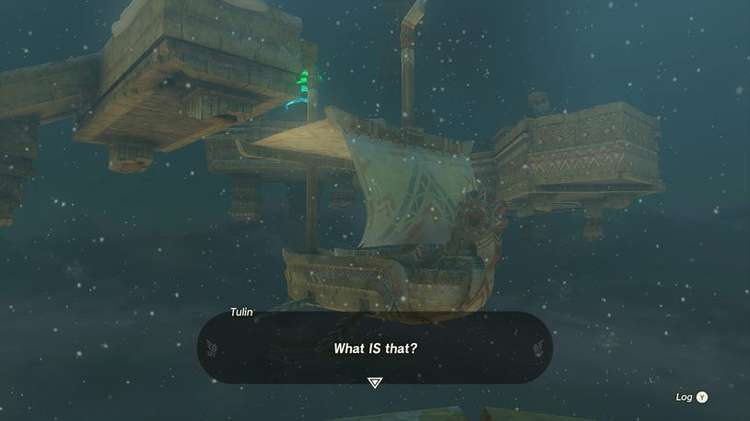

With a strange voice suddenly appearing and beckoning Tulin towards the cloud, you'll need to climb the stairs that lead up and around to the ship. Drop down onto the canopy, to use it as a trampoline and smoothly glide over to the Mayaumekis Shrine.

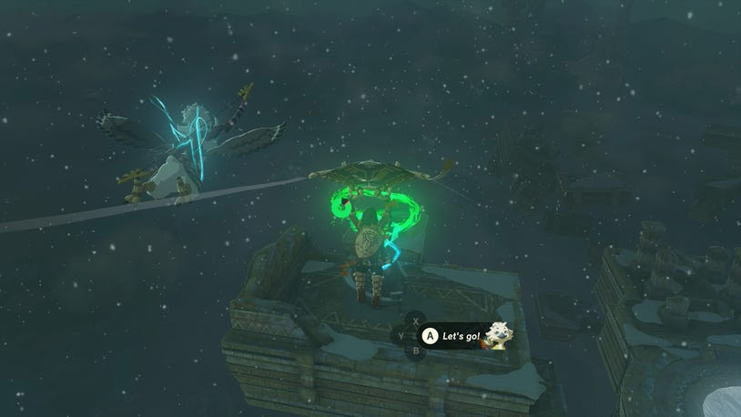

Activate it to use it as either a checkpoint, to return to later, or go inside and complete it now for a Light of Blessing.

Mayaumekis Shrine

Now go north and glide over to the ruins, then follow the platforms west and towards the Soldier Construct II. Keep climbing and following the platforms, remembering to use boxes whenever you can't Ascend, to help you be able to do so. Eventually, you'll come to a section where two pillars hang down, one with icicles hanging from the bottom.

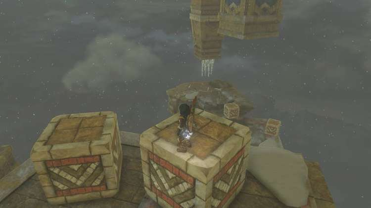

Ascend underneath the pillar with the icicles, to be taken to a semi-circle, where you'll find a Soldier Construct II and a chest with Portable Pots inside. Here are the exact coordinates: -3258, 3317, 0956.

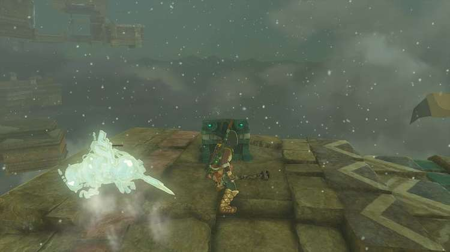

Drop back down, then stacks the three boxes underneath the other pillar to Ascend even higher and continue west. Glide over to the broken platform that has a doorway over it, and lights on either side.

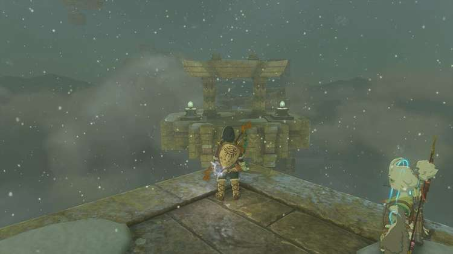

Use the boats and the wind-gust technique to reach another Soldier Construct, and what looks like a floating tomb or chest. Break any of the frozen ice sheets in this area, to give you access to all of the trampolines, and destroy any rock barriers.

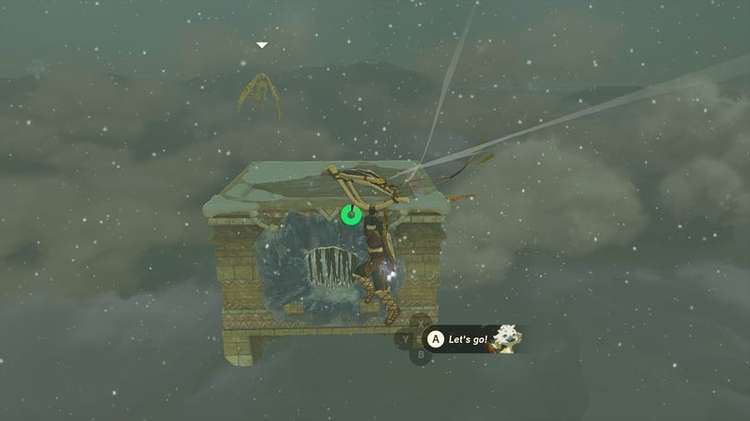

You'll find Aerocuda flying around the floating tomb/chest, and you'll find a chest inside if you fly over and break the icicles.

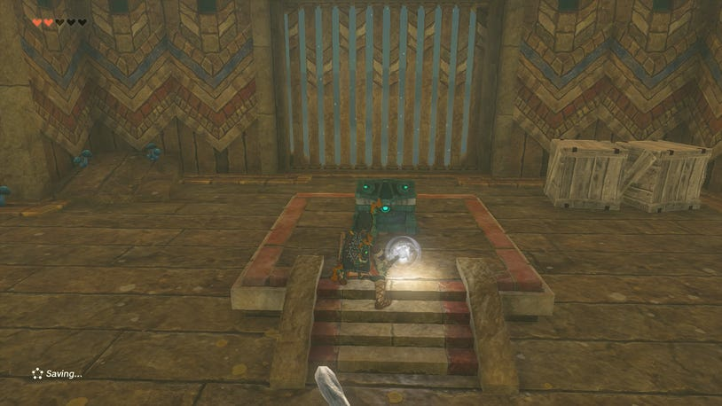

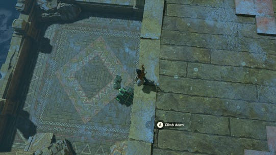

From here, you can glide down to the southeast to the level below the trampoline. You should see a pacing Flux Construct I circling on the lowest level here.Alternatively, if you'd prefer to try this after unlocking a fast travel point, you can drop down from the northwest edge when you reach Kahatanaum Shrine. Beating this Flux Construct I will allow you to open the treasure chest on this level, and reward you with a treasure map. It will also drop Time Bombs and Zonai Charges.

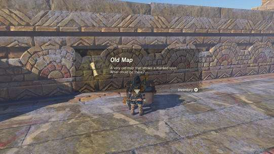

As soon as you receive it, the treasure will be marked on your map. The key to beating it, is to use Ultrahand and focus on the box with the red marking. Pull this out from the Flux Construct I and it will fall apart every time. Quickly dash over to the box with the red circle and attack.

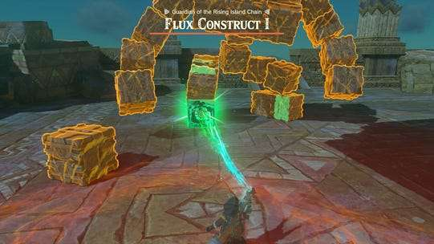

Do a 180 from the chest and head south (or if you're coming from the battle with the Flux Construct I, Ascend from the northwest platform). Climb the stairs where it looks like it's almost a dead end. This is when you'll want to start going east, by dropping down onto ice and cracking it to reveal the canopy of the boat below. As you're shot into the sky, start gliding over to the next section of platforms.

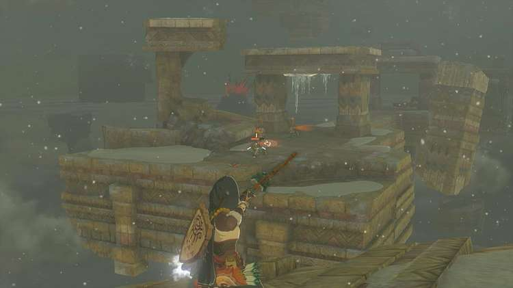

There will be plenty of Aerocuda and Soldier Constructs here to take down in order to proceed. When you've cleared out the first group and start to cross the bridge over to the next section, the bridge will start to collapse so be quick and dash, or glide if needed.

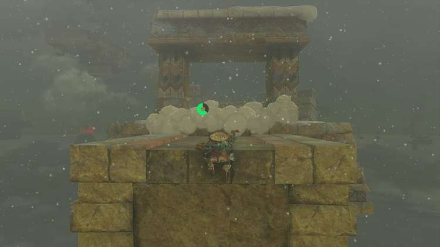

There'll be a few more Soldier Constructs here, then two sets of stairs you'll take, that are guarded by three Soldier Constructs.

At the top of this section, and on the floor to the right, there's a blocked hole filled with rocks. Break this to drop down and open another chest with a Large Zonai Charge inside.

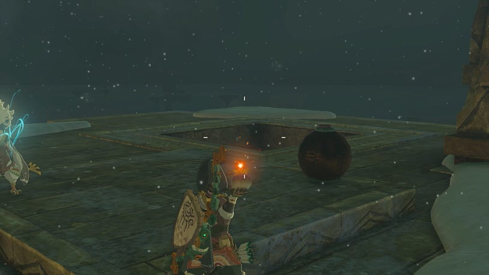

Ascend straight up from here and continue on to where there are hot air balloons on the ground. Use Ultrahand to make a raft with the hot air balloons attached and ride it up as high as you can. From here, jump and glide over to the next platforming section.

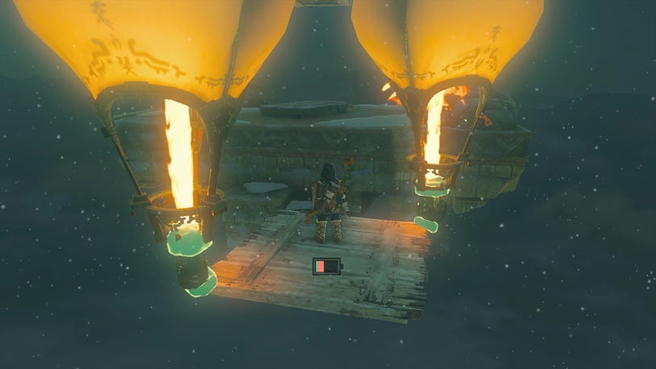

Ascend straight up into and through the pillar, and then climb up to start using the next set of trampoline boats and platforms. In this part, the boats will be moving, so use the first trampoline to reach the platform on the left if you can't reach the boat, take it slowly to reach the other side. Don't forget to shatter the ice here to reveal more trampolines.

As you get to the other side, Tulin will tell you to keep an eye on the temperature to make sure you don't freeze. This is where the extra gear comes in handy,y so hopefully you're well-prepared. Go up the stairs and towards the Kahatanaum Shrine. Interact with it so you can fast travel to it if needed, or complete it now.

Kahatanaum Shrine

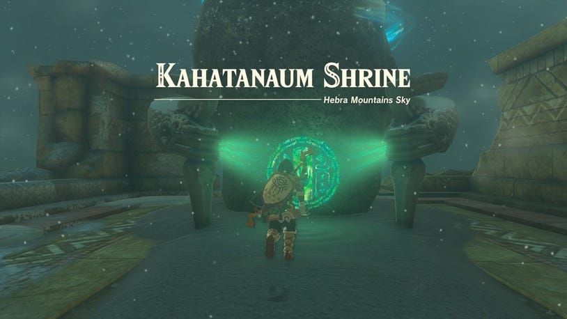

Continue your ascent up to the south, where you'll be almost at the top of the cloud now. There will be a series of moving boats you'll see surrounding it, which makes timing your jumps for this next part a little bit trickier.

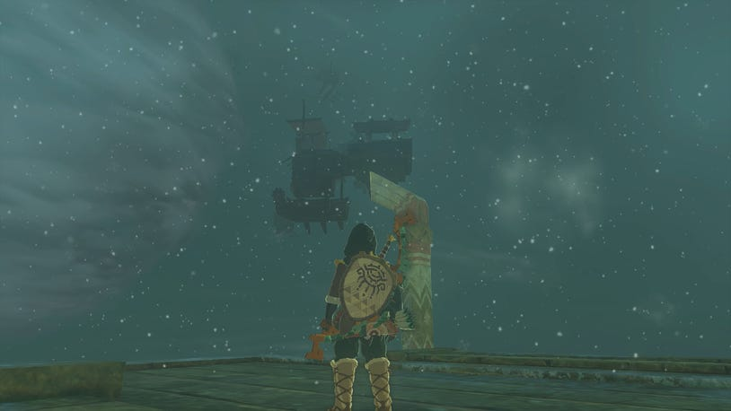

If you miss a jump, use Tulin's boost to help you land on a boat, and each time you use a trampoline, remember that your stamina will replenish so you can keep trying.

Drop down onto the first trampoline to shoot into the air and land on the first moving boat. Repeat this, moving from boat to platform, to boat, and eventually to the top of the cloud.

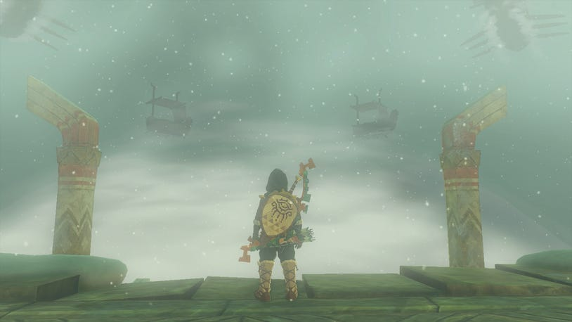

The weather and atmosphere will change completely at the top, where you'll get to a circle of just four boats. Pick the final boat you're going to use for your last big jump, then drop down inside of it.

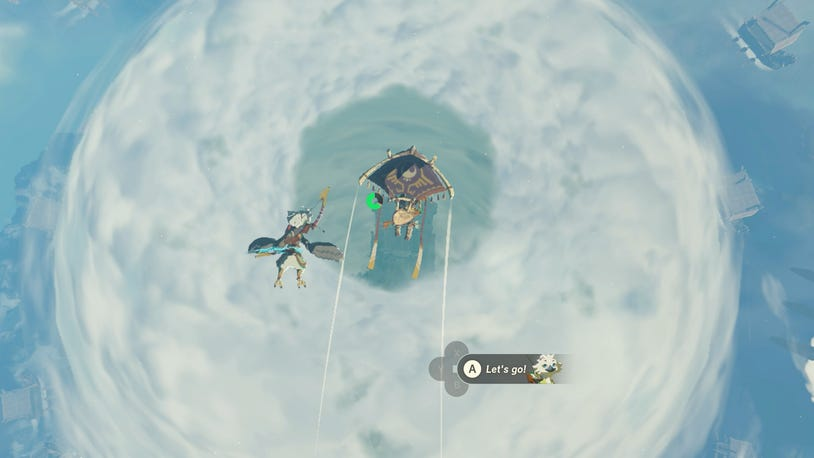

As you land, it becomes clear that all is not as it seems and you'll find yourself at the start of The Wind Temple.
