17. Yunobo of Goron City

Before you head off towards Death Mountain, you'll want to stop by Goron City or go inside the shop at Yunobo HQ when you reach it, to purchase a piece (or more) of the Flamebreaker Armor Set. We'd recommend the Flamebreaker Armor, as it's the cheapest option available (and you only need one piece for the temple you'll be going to). Where we're heading next is gonna turn up the heat, so you'll need some fire-resistant clothing before you proceed for the best chances of survival.

Find Yunobo at Yunobo HQ

Picking up from Regional Phenomena - To Goron City, stop by the Armor Shop and grab yourself some heat-resistant armor. You can purchase the Flamebreaker set from the Armor Shop, with the cheapest piece being the Flamebreaker Armor costing 700 Rupees. If you have 10 pieces of Amber, then find Ramella and sell them to her to make a profit. If not, sell off items at the General Store or Armor Shop to get enough together.

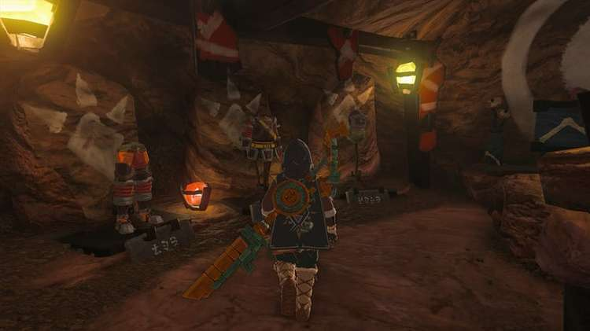

Still need Rupees? Check out the How to Farm Rupees in TotK guide for more information.

Take the time to cook up some meal recipes with fire resistance to help out too using items like Fireproof Lizards or Smolderwing Butterflies if you want to swap out some armor. Just remember that the Flame Guard Effect is not the same as Heat Resistance, which only works in desert regions! When you're prepared, it's time to set off for YunoboCo HQ to start Yunobo of Goron City.

With your flame-resistant equipment intact, and hopefully, some meals to help along the way, head off from Goron City, following the trail to the northeast.

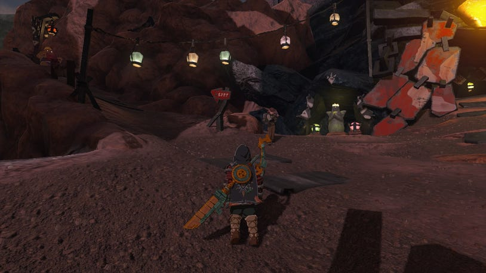

You’ll pass a goddess statue on the way out, so be sure to stop by here if you have any Light of Blessings. Go up the winding path until you see the Marakuguc Shrine and climb up here to activate it (and complete it if you wish).

Marakuguc Shrine

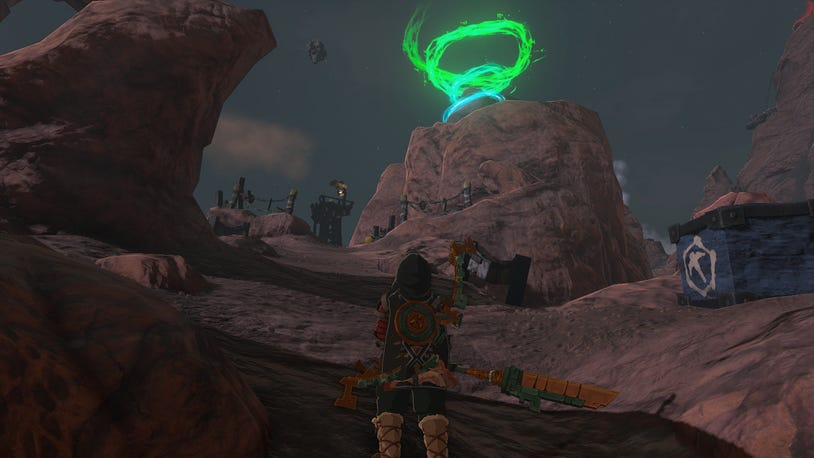

Drop back down and rejoin the path, stopping to speak to the people at the mine carts, including Dugby who has a side quest for you. His cart is broken, and he wants to find the city of Gorondia.

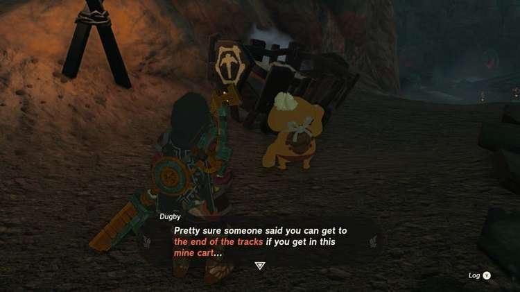

A quick conversation, and the side quest The Ancient City of Gorondia will unlock. To fix the mine cart, attach a fan to it, then place it back on the tracks. Speak to Dugby and get him to sit in the cart, then join him and propel yourself over to where YunoboCo HQ is. Not only will you complete the side mission and get a Zonai Charge from it, but you'll also be exactly where you need to be!

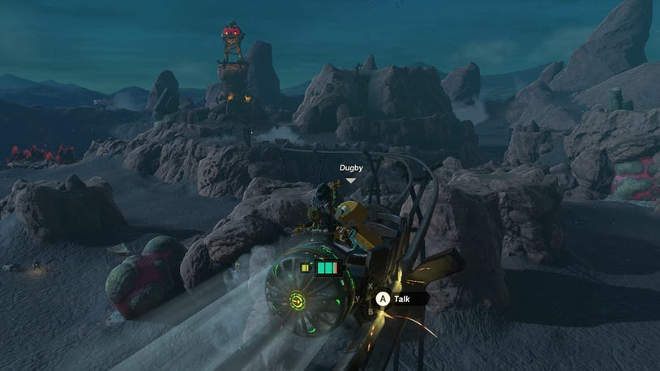

Once you're off the cart, you can go left to the shop (to pick up some flame-resistant equipment if you don't already have it) or into the cave on the right being guarded by Offrak and Slergo.

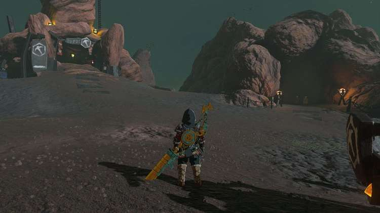

Note: if you get there without any fire-resistant equipment, Slergo and Offrak will tell you to go and get some from HQ.

Once you're suitably equipped, walk down the slope into the cave where a cutscene will begin and you'll soon be facing of against Clearly Not Himself Yunobo.

How to Beat Clearly Not Himself Yunobo

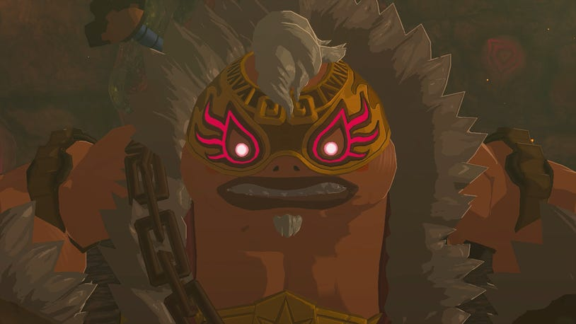

Yunobo will roll himself up into a ball and begin to charge up, getting ready to smash into you. It can happen quite quickly, so if you have rumble turned on, you'll feel it just before he's about to let go of the charge and being hurtling towards you. If you prefer a visual indication, then more smoke will emerge just as he's about to release his charge, so keep an eye on this as well to time your dodge.

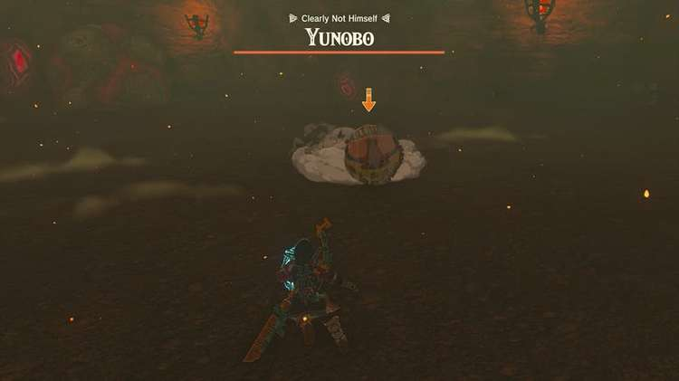

Lock on to him with ZL, then dodge and use the directional button to move out of his way. This will cause him to hit the walls around the cave, be stunned, and leave himself vulnerable to attacks.

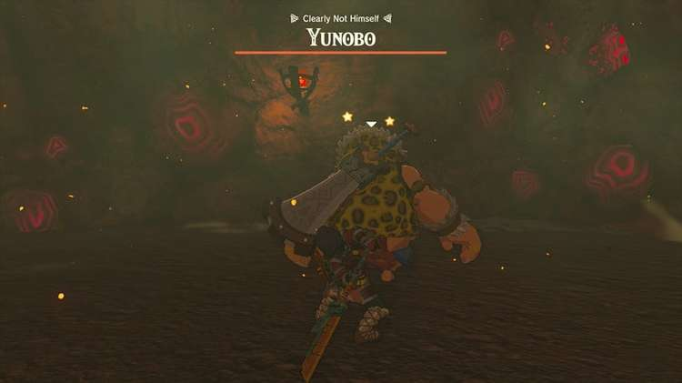

You'll need to repeat this pattern three times, hitting Yunobo each time he's stunned to take down a third of his health. When you've got his health bar all the way down, you'll find Yunobo starts to feel suddenly much more like himself. Even better, he wants to help find Zelda!

First, though, you need to get out of the cave and test out the ability that comes with having Yunobo accompany you, which is Yunobo's Power of Fire. You can call him over to Charge at any point, then just line him up to direct him to where you want to go.

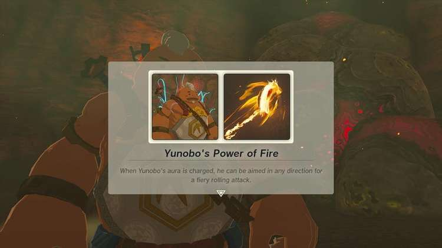

Aim for the rocks that are blocking the cave entrance, then get everyone out of there.

Time to Climb Death Mountain

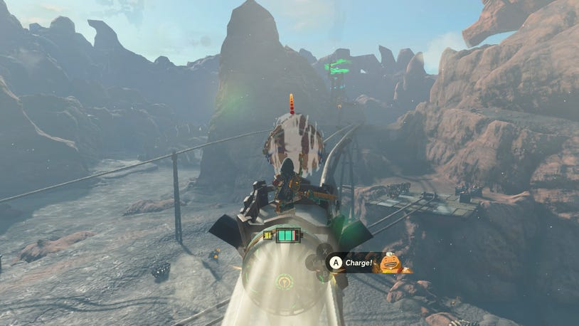

With Yunobo in tow, hop back over to where you met Dugy, using the mine carts to travel along the tracks. This time, you want to go down the slope (behind where Dugby was stood) to find another set of tracks and mine carts.

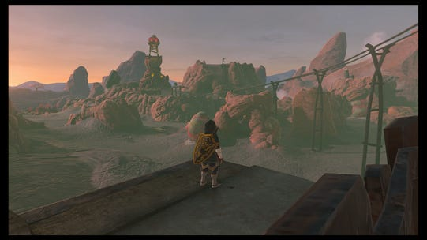

As you cross the large mine cart track area, look back across to YunoboCo HQ to spot a large cave with one of Misko's triangle insignia's poking out. Explore the YunoboCo HQ South Cave to find the Ember Headdress, another clothing item that increases your power in hot places!

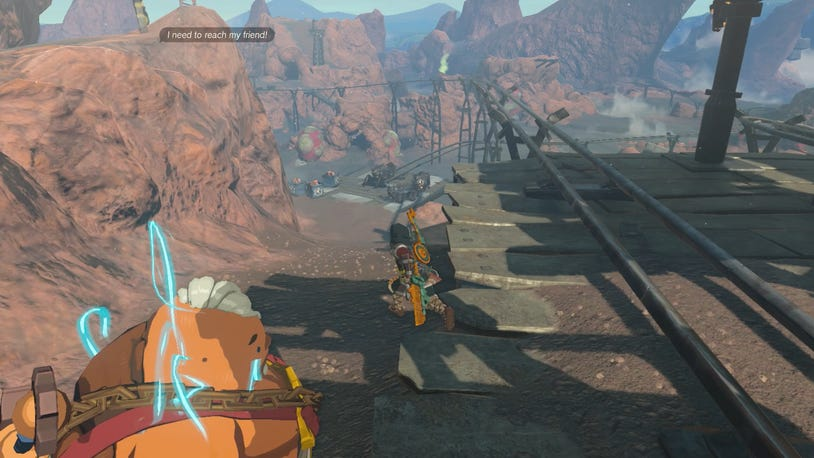

You'll notice as soon as you do this, that Yunobo will automatically start spinning in front of you, and you can use him to break anything in your way, which will come in handy in just a moment.

Note: as you walk down here, you might also notice the Korok that needs help being reunited with this friend on the ledge above (to the left).

Use the mine carts at the start of this track to ride up to the Death Mountain West Tunnel. At the top, there's a cave you can go inside directly opposite which is the Death Mountain West Tunnel Cave.

Death Mountain West Tunnel

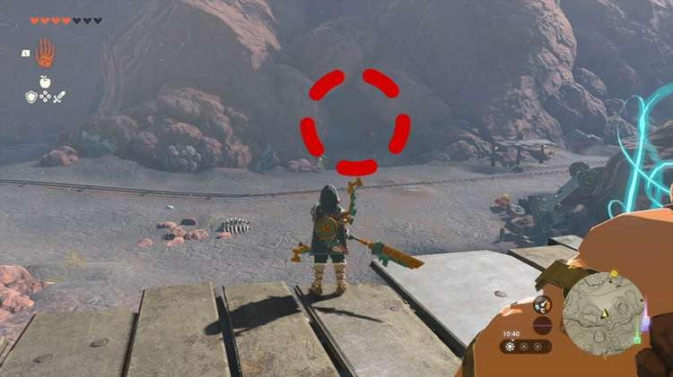

When you enter, you'll see a broken track and a worker on the other side who is stuck. This is Mota, who you can speak to, to start The Abandoned Laborer side quest.

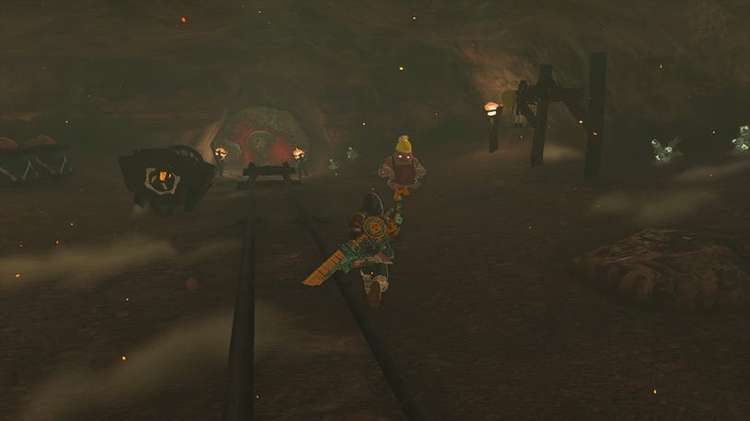

He needs to get back out of the cave, and with the track broken, he requires a little bit more of a push to make it over to the other side. Line up the cart so it faces towards the cave exit, then tell Mota to hop in. Use Yunobo's charge to send him flying and over the pit of lava and broken tracks.

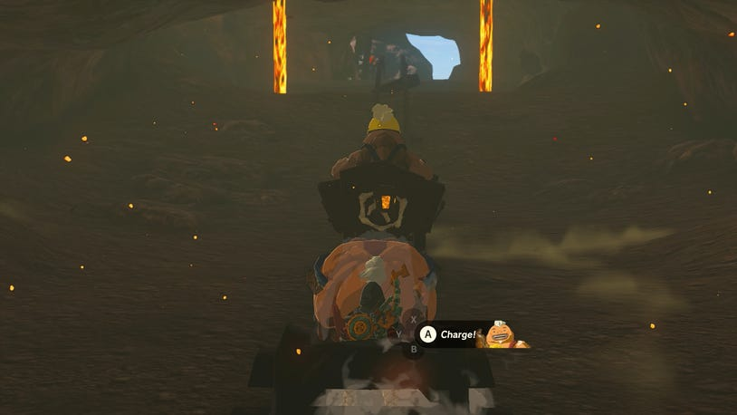

Then turn around and face the end of the track. Use Yunobo again to break the rocks and go further into the cave.

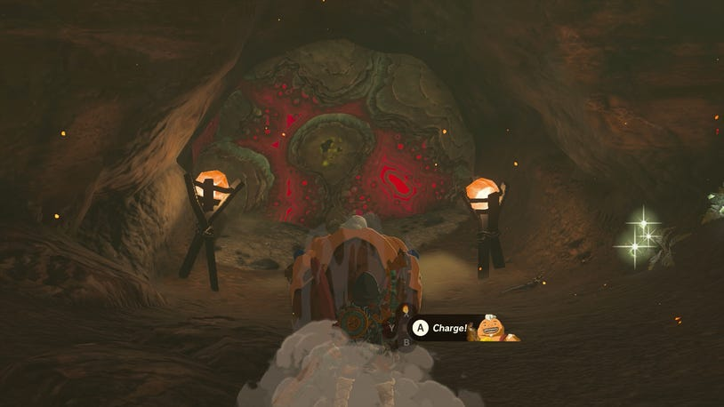

You'll find a chest here, which can be yanked from the ground using Ultrahand and has a Cobble Crusher inside of it. In the distance, further into the cave off to the left, you'll find another Bubbulfrog.

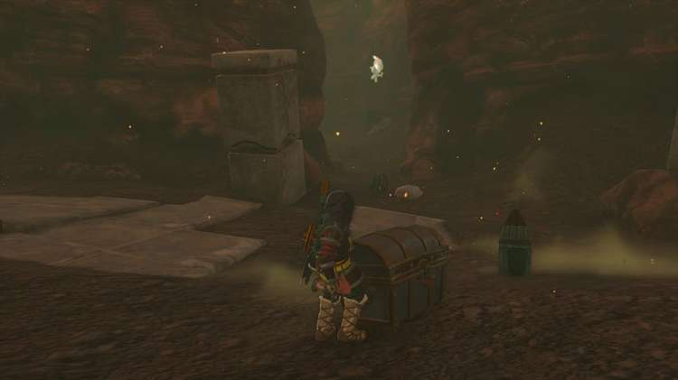

Exit the cave and don't forget to speak to Mota on the way out, to collect your Large Zonai Charge. Go left (or south) and create another mine cart that's powered by a nearby fan, to start heading up towards Death Mountain.

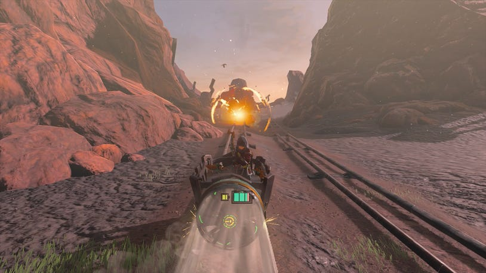

As before, as soon as you're moving, Yunobo will begin spinning and you're going to need him this time. There will be a number of rocks blocking the paths, and enemies along the way to take out. You can aim Yunobo at each of them as you go by, to tackle them, and automatically receive whatever they drop.

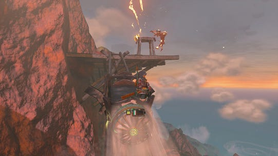

Along the way, you'll encounter, Moblin, Fire Keese, Octorok (which look like little rocks stacked on top of each other) and Bokoblins.

About halfway, you'll come to a platform with Bokoblins, a barricade, and rocks to destroy. This is a good place to recharge if needed.

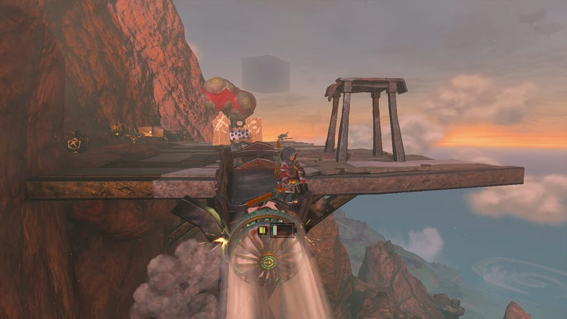

However, you can ride this cart all the way up to the top of the mountain. When you do get there, Yunobo will recognise the place and speaking to him will trigger a cutscene that reveals more about what he knows of Zelda's whereabouts, and a mysterious voice will communicate with him.

From the pit of the Death Mountain, Moragia will emerge and it's time to take to the skies to deal with this boss.

How to Beat Moragia

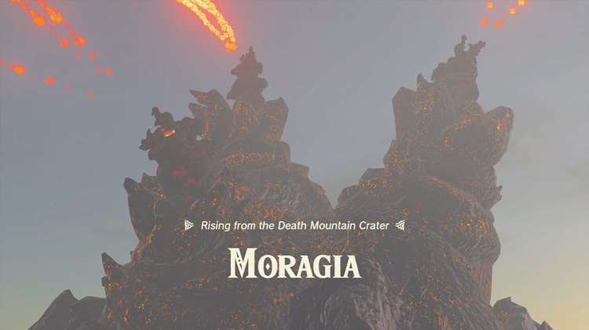

Moragia has three rock heads that you'll need to target by using Yunobo's charge. A wing will appear, with fans strapped to it, and a mechanism to control it. Use Ultrahand to move it - and we'd recommend taking it to the edge of the platform and launching it from there.

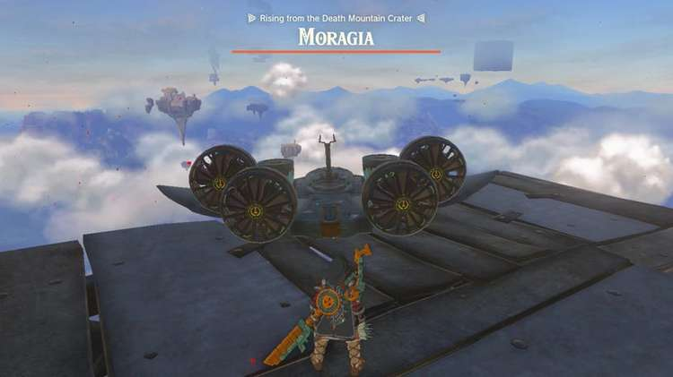

Doing this will mean you're facing opposite the monster, but it will help you get off the cliff, and give you enough room to ascend and position yourself correctly. Pull back on the left stick to angle the flying machine up and spin it to face Moragia.

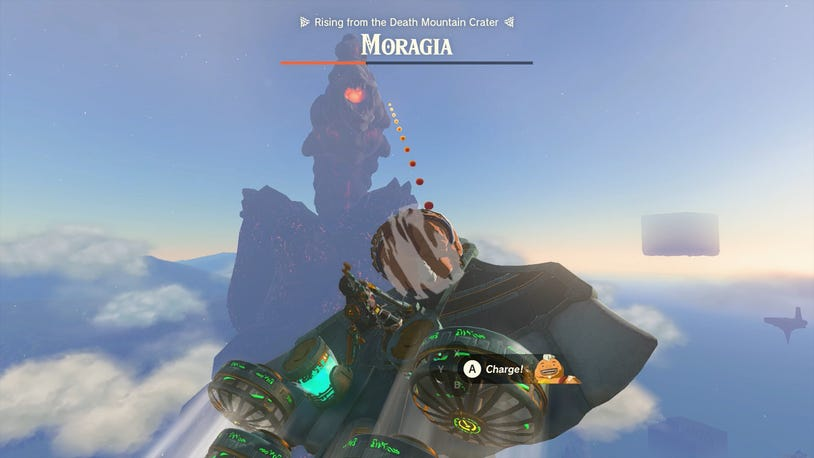

Fly towards each of the rock faces, then use Yunobo's charge to attack and destroy them. You'll only have to each rock face once to take down Moragia, so after three successful hits, the boss battle is over. It will spit lava rocks at you, but these can be fairly easy to dodge.

Inside the Death Mountain Chasm

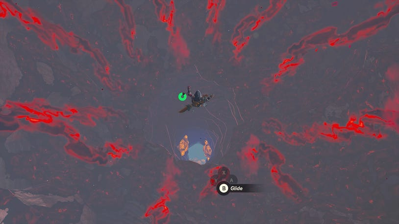

Once the boss battle is over, it's time to launch yourself into the Death Mountain Chasm. As you get ever closer to the bottom, it will become increasingly dark. Use your Paraglider if needed to slow your descent at any time, and avoid hitting the rocks.

Not only will you need at least one piece of Flamebreaker Armor or flameguard food here, but the temperature will also light any wooden weapons and shields on fire, so be sure you have an ample supply of metal or Zonai weapons on hand.

As you reach the bottom, head to the west side of where you land to activate the Mustis Lightroot and give you better lighting to see where you're going.

Mustis Lightroot

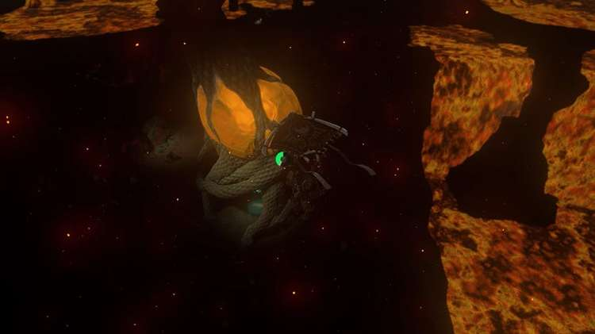

Speak to Yunobo and the mysterious voice will appear again, pointing you both in the direction you need to start going towards, which is west. Start to head towards the statue you should be able to see from the Mustis Lightroot, then get Yunobo to smash the rocks to the left of it to open up the path some more.

Behind it, you'll encounter lots of Little Frox who will pounce at you. Be liberal with your use of Brightbloom Seeds here if you have them, to light the path for you as you explore.

Go towards the waterfalls of lava, and have Yunobo smash through the rocks on the way, to reveal a makeshift cart and shelves that are filled with useful equipment so you can fix it. On the left, there are plenty of Poe you can pick up as well.

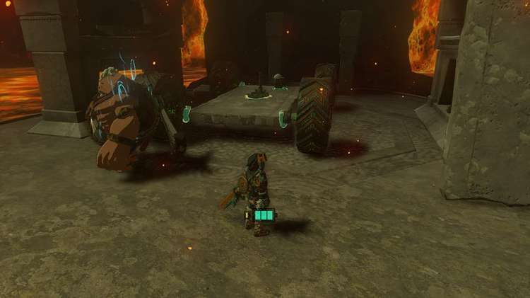

Just north of here, you'll find a Device Dispenser, where you can drop Zonai Charges and receive sites such as a Big Wheel, Steering Stick, Battery, and more.

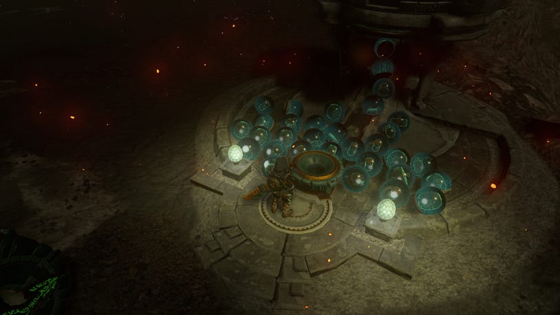

Northwest of the Device Dispenser, is another statue, and just beyond it is another rock that can be broken to allow you to climb up the slope alongside the lava waterfalls.

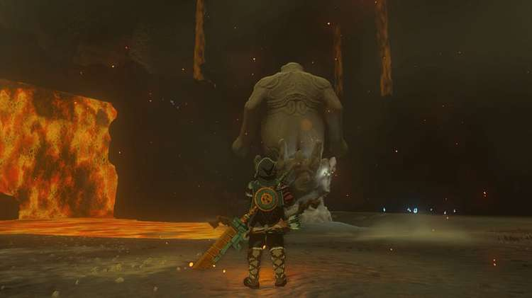

When you get to the top, you'll find a statue on the right that's facing south, so go left and head south, too. As you start along this path, you'll see some Bokoblin and Moblin mining ore on the right.

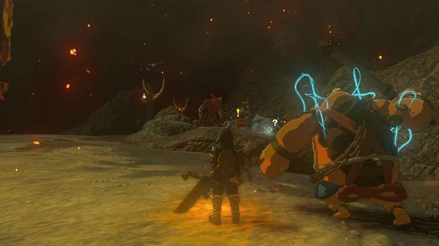

Get rid of them and mine the ore to pick up some Zonaite. Stick to the path as you start to go up and to the west, then have Yunobo smash through the rocks at the top to reveal a bridge that goes over the top of you.

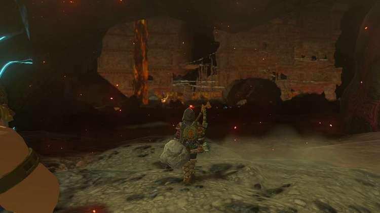

Walk under the bridge and into another room where you'll find Bokoblin and Fire ChuChu. You'll see another lava waterfall in the distance, and to the right (north) there's another Lightroot you should head for (the Misisi Lightroot), to illuminate this area further.

Misisi Lightroot

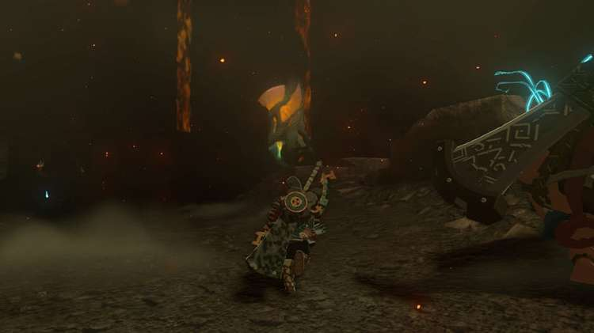

Be careful of the patrolling Bokoblin, or use Yunobo to play a particularly dangerous game of bowling with the Bokoblin's acting as the pins.

From the lightroot, return to where you entered the room. There may be a few remaining Bokoblin mining some ore in the southwest of this section. You should be able to see the first lava waterfall you spotted as you entered this section, and it will almost look like it's coming down onto the rocks and ore the Bokoblin were mining.

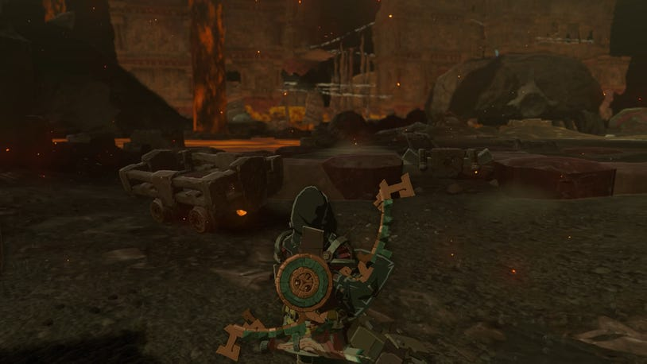

This area is important, as behind it are mine carts and a track. The exact coordinates are: 1792, 2616, -0844.

Use Ultrahand to create another cart you can ride, then use this to get closer towards the temple in the distance. You'll need to smash through a barrier of rocks using Yunobo just before you reach the end of the tracks, so be mindful of that.

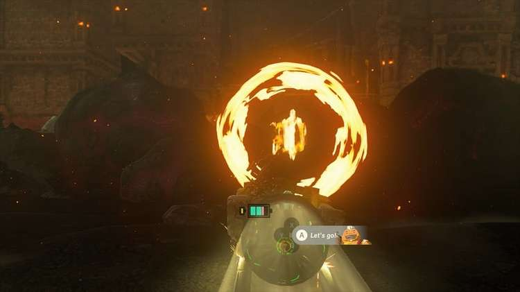

When you get out of the cart, take the stairs in the north that are lined with torches.

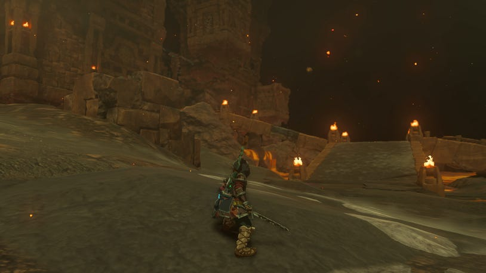

Continue following the path until you reach the top, where just one more boulder stands in the way of you and The Fire Temple.

Yunobo of Goron City
