Anedamimik Shrine (**A Retraced Path**) in Zelda: Tears of the Kingdom is a shrine located in the Necluda region in Deepback Bay Cave, in a flooded chamber. It's also one of 152 shrines in TOTK (see all shrine locations). This page contains a guide for how to locate and enter the shrine, a walkthrough for the shrine itself, and puzzle solutions as well as treasure chest locations for the TotK Anedamimik shrine. Check out more TOTK shrine locations here. 

### Treasure and Rewards

  * Large Zonai Charge

## Anedamimik Shrine Location

In far east Necluda, just**east of the Hateno Ancient Tech Lab** , is a series of bays along the Hateno coast. Float off the Tech Lab’s cliff due east and you’ll come to **Deepback Bay**. Here the Deepback Bay Cave entrance can be found on a sandy beach, it leads into the mountains northward. 

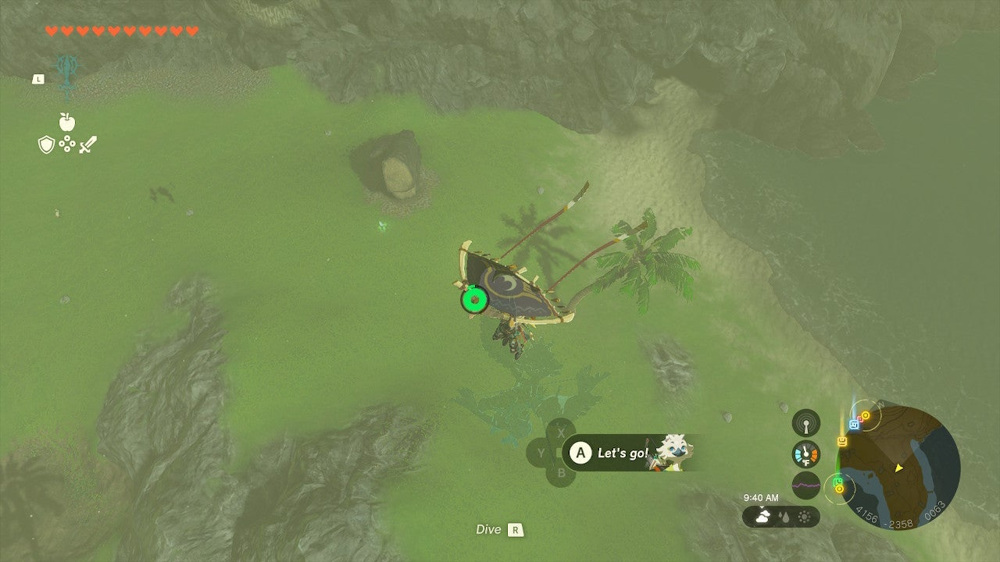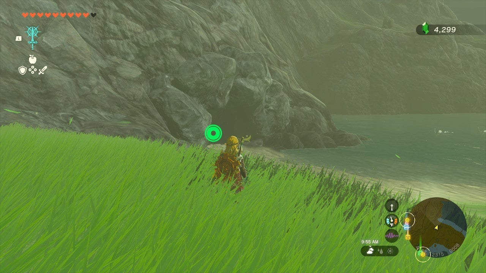

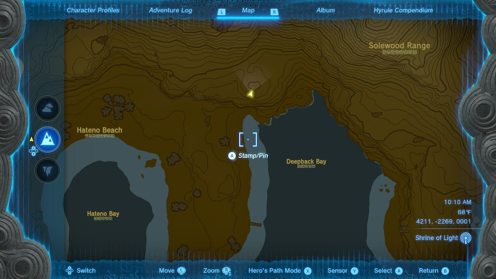

There are some powerful Horriblins in Deepback Bay Cave, so beware – you can hit them off the ceiling with an arrow and finish them off as they recover. 

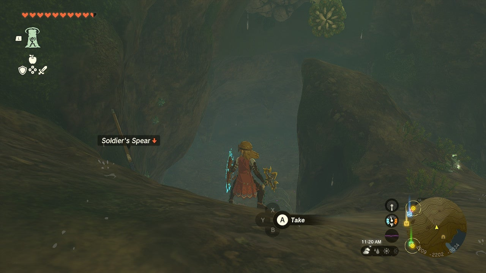

The cave chamber holding Anedamimik Shrine is flooded and you’ll need to drain the water to reach it. Look for a hole leading down just southwest of the shrine. 

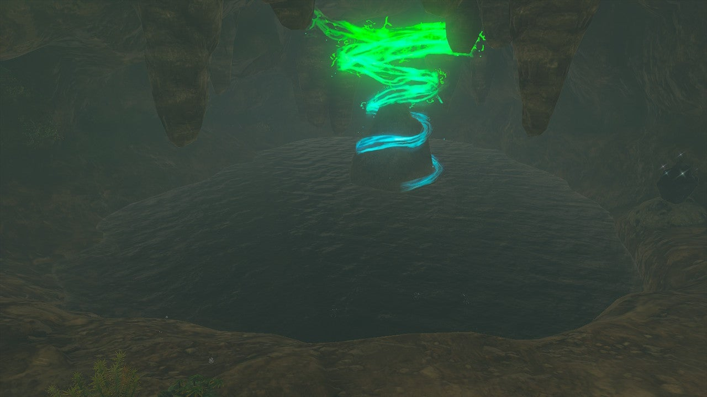

Here is a long pillar-like incline, a massive worm called a Like Like, and a patch of stone beyond it on the ceiling you can destroy to drain the water above. Luckily, this chamber has Bomb Flowers on the wall! You can choose to kill the Like Like or not, but all you need to do is shoot the cracked stones in the ceiling with a Bomb Flower fused to an arrow to drain the water and free the Shrine. 

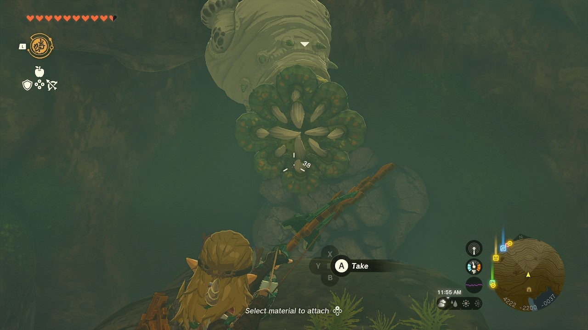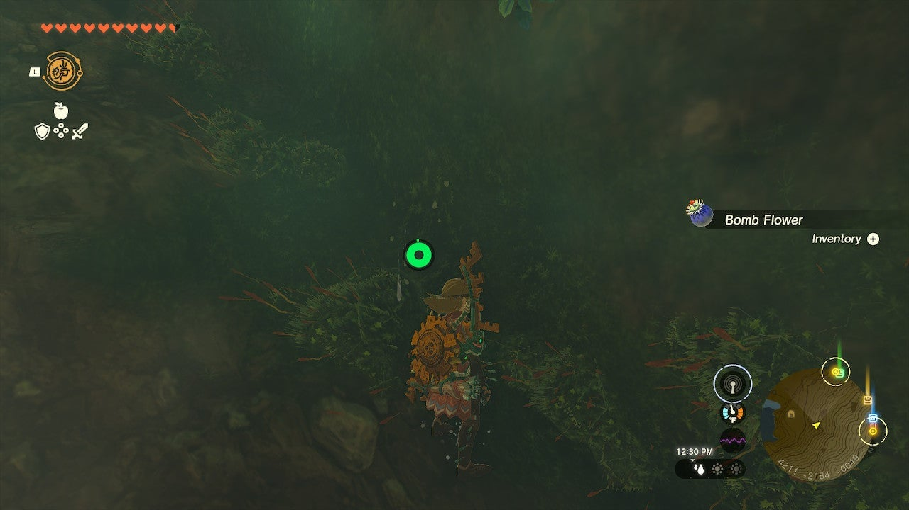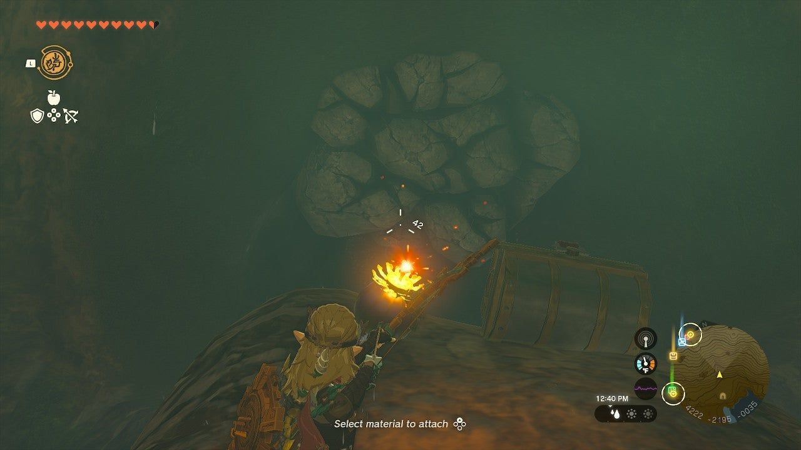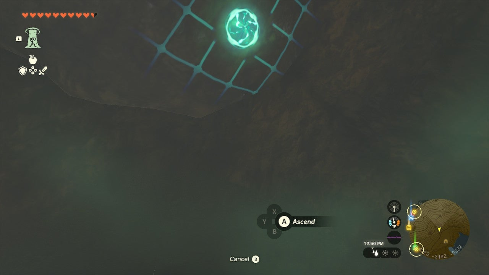

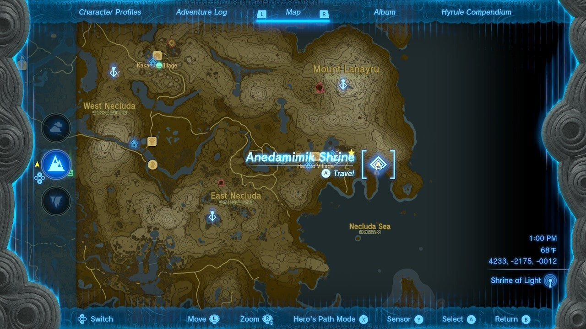

Ascend through the roof once you do this and enter Anedamimik Shrine. 

  * Coordinates: 4233, -2175, -0012

## Anedamimik Shrine Walkthrough

This is a quick and easy shrine! Identify the orange glowing switch in front of the exit. This controls the right wall. 

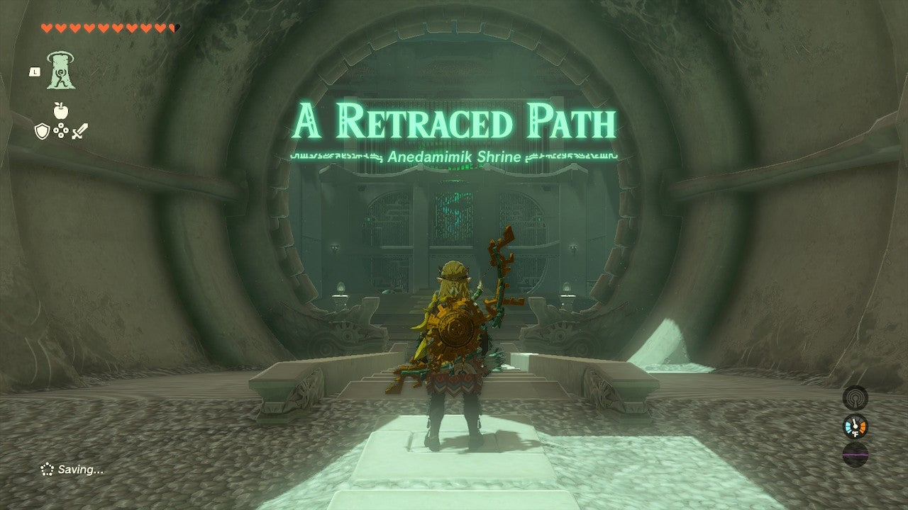

## Treasure Chest Location

Before starting, hit the switch and look to the right of the switch to see the treasure chest up on a platform. You can ascend up to it and get the Large Zonai Charge. 

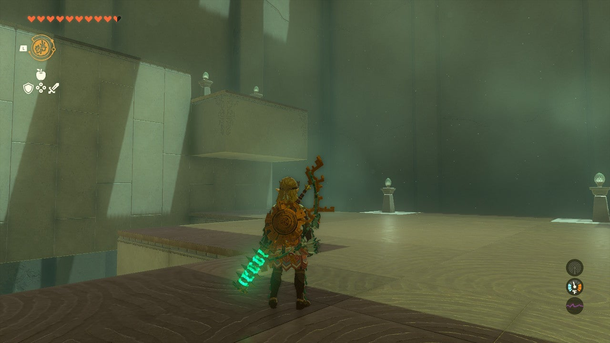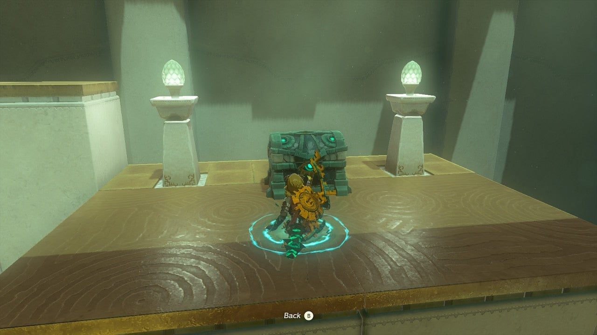

Hit the switch to go back to the way things were. 

Equip Recall and wait for a sphere to roll out of the dispenser and in front of you. 

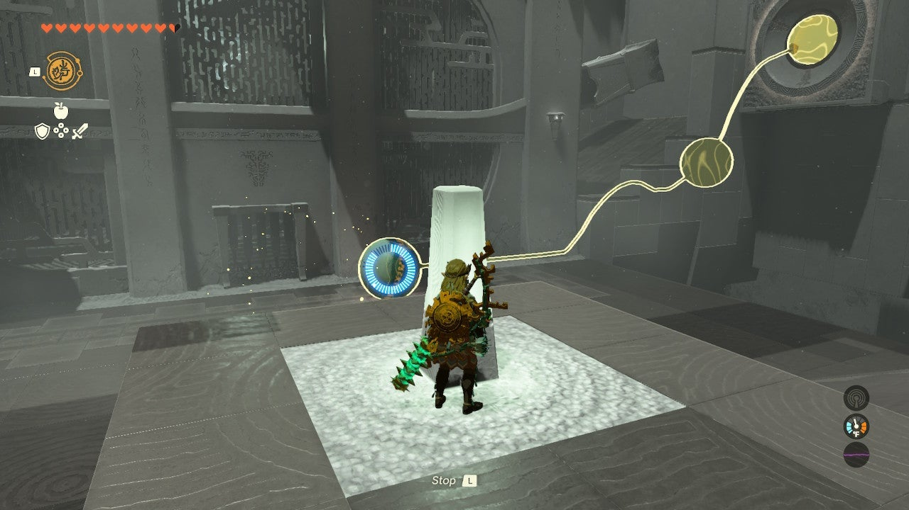

Hit the orange switch and activate recall. Activate the sphere and it will reverse course into the target the switch now has replaced the dispenser with. 

Don’t hit the switch again. 

Exit the shrine. 

Anedamimik Shrine

Congrats on solving the shrine and earning a Light of Blessing! Click or tap here to return to the rest of the Shrine Guides. You can also check out which shrines are nearby with our shrine map filter on our complete map of Hyrule.

### Up Next: Walkthrough

Previous

About IGN's Zelda TotK Guide Writers

Next

Walkthrough

### Top Guide Sections

  * Walkthrough
  * Zelda: Tears of The Kingdom Switch 2 Edition Guide
  * Zelda Notes Voice Memories
  * List of Side Quests and Side Adventures

### Was this guide helpful?

Leave feedback

Go to comments