Apogek Shrine (Wings on the Wind) in Zelda: Tears of the Kingdom is a shrine located in the Lanayru region and is one of 152 shrines in TOTK (see all shrine locations). This page contains a guide for how to locate and enter the shrine, a walkthrough for the shrine itself, and puzzle solutions as well as treasure chest locations for the TotK Apogek shrine. 

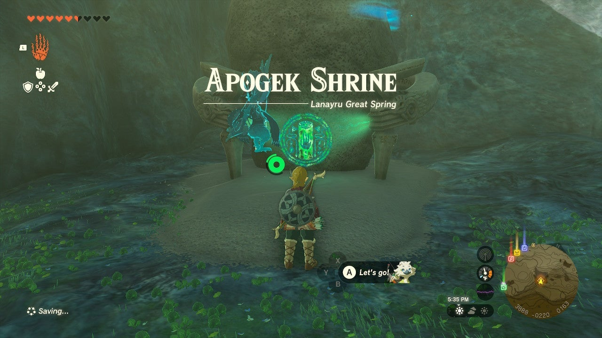

### Treasure and Rewards

  * Strong Zonaite Spear

## Apogek Shrine Location

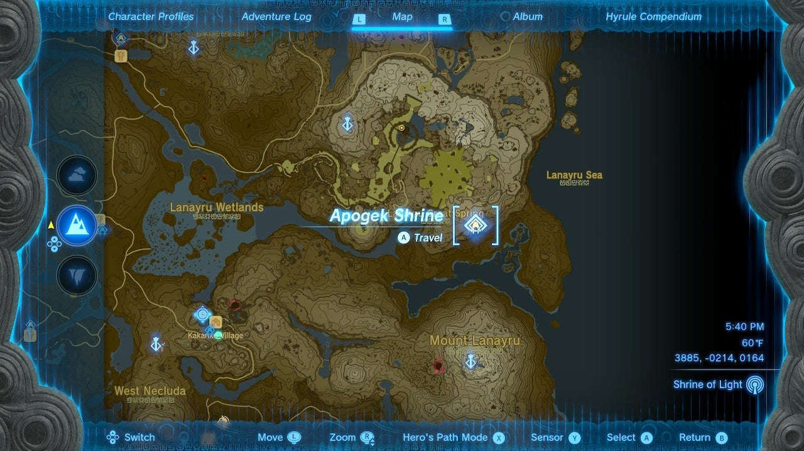

Apogek Shrine is due north of Mount Lanayru Skyview Tower and easy to reach from the tower. It is located under a rocky overhang so it is difficult to see from the sky but it is on the surface and can be seen from the ground. It’s at close to sea level just above Lanayru Bay and north of Brynna Plain. 

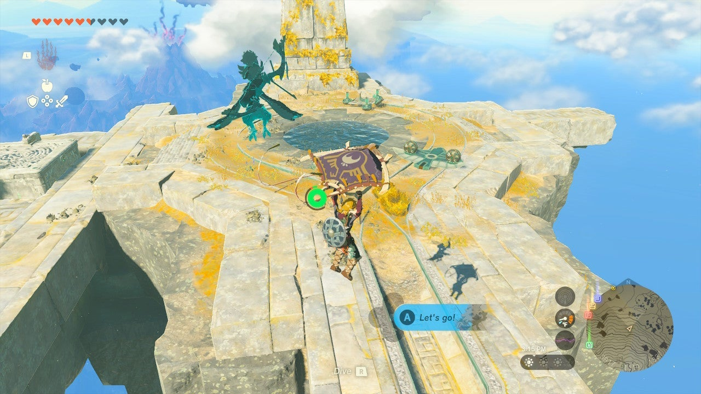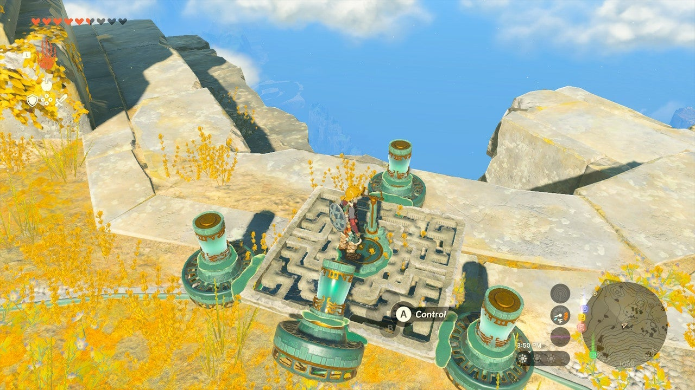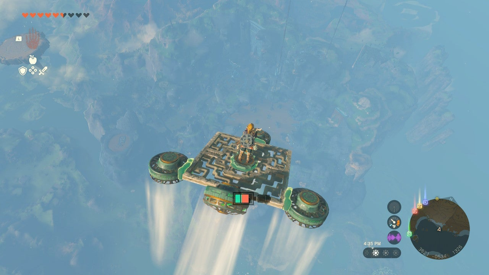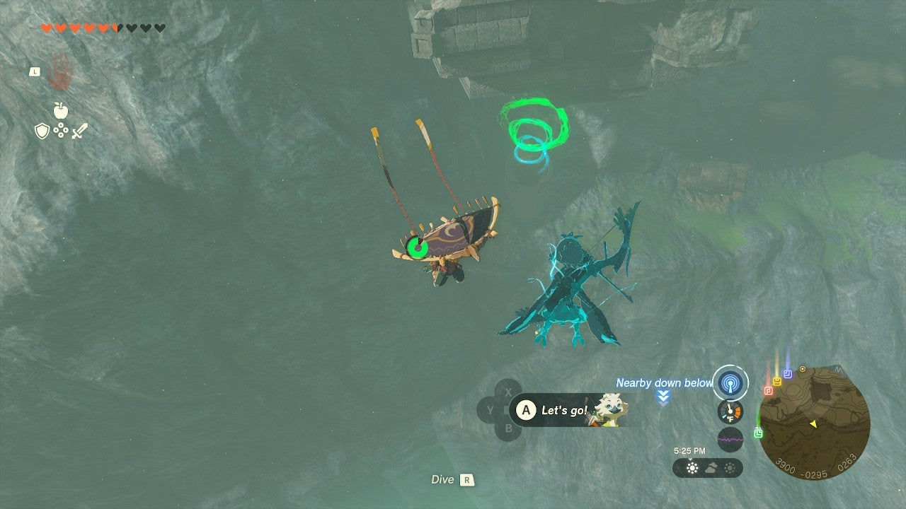

Here’s an extremely easy way to reach the Apogek: From the Mount Lanayru Skyview Tower, launch into the air and paraglide north to the island with a small round pool of water below. Here you can commandeer a flying device to take you almost the entire way to the Apogek Shrine. 

  * Coordinates: 3885, -0214, 0164

## Apogek Shrine Walkthrough

In the first room your goal is to get a small ball into a target or hole below by a locked door. Pick up a Wing from the left side. Drop the wing next to the orb and then use Ultrahand to glue the orb somewhere to the center of the Wing. 

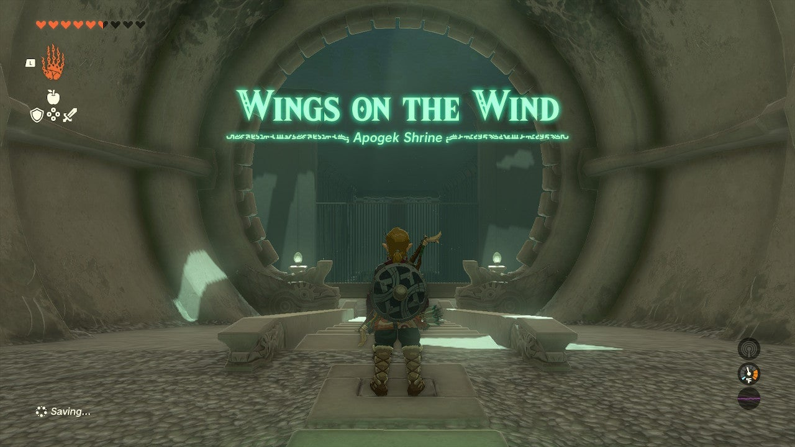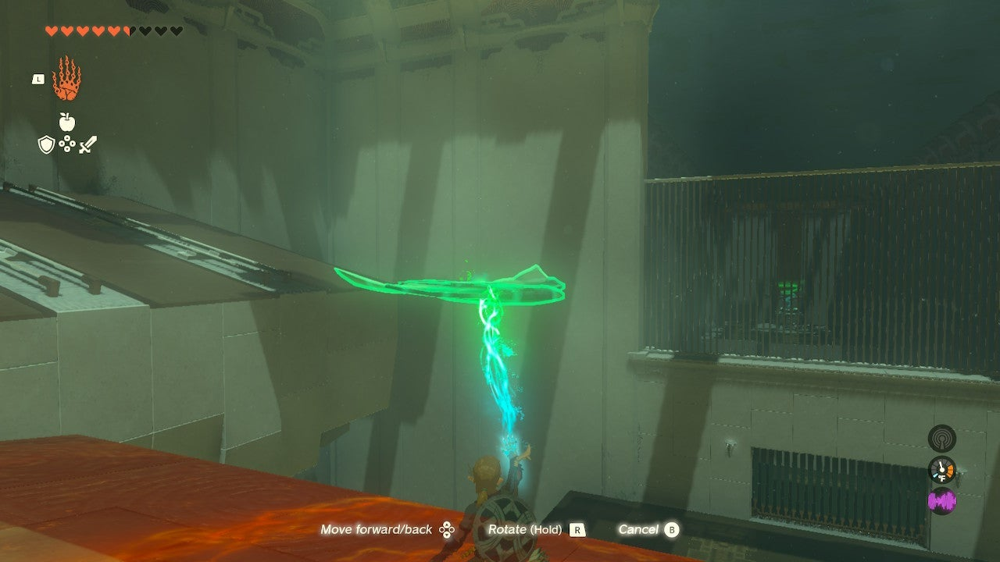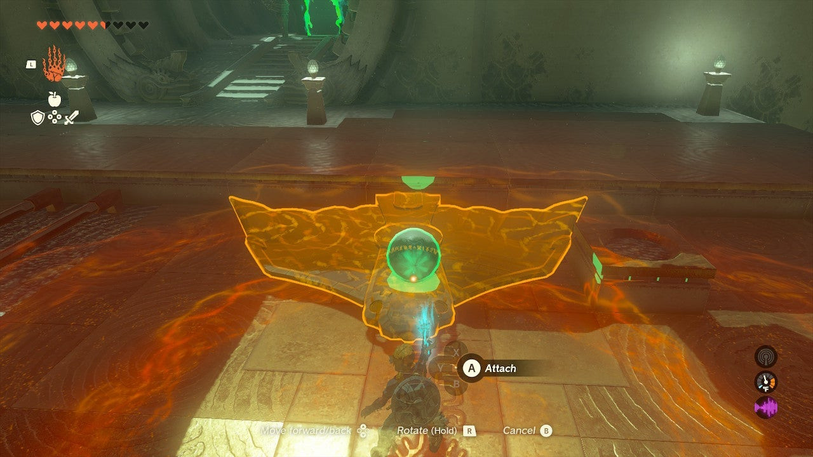

Place the Wing/orb combo into the metal tracks sloping down, near the top right where they slope down. Get on the Wing and ride it down. 

Detach the orb with Ultrahand and place it in the target. 

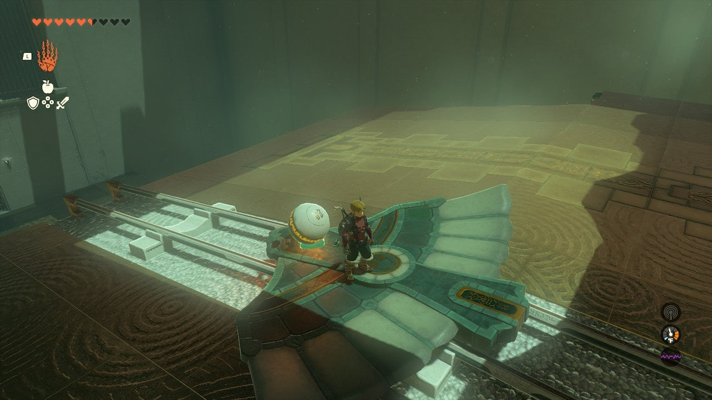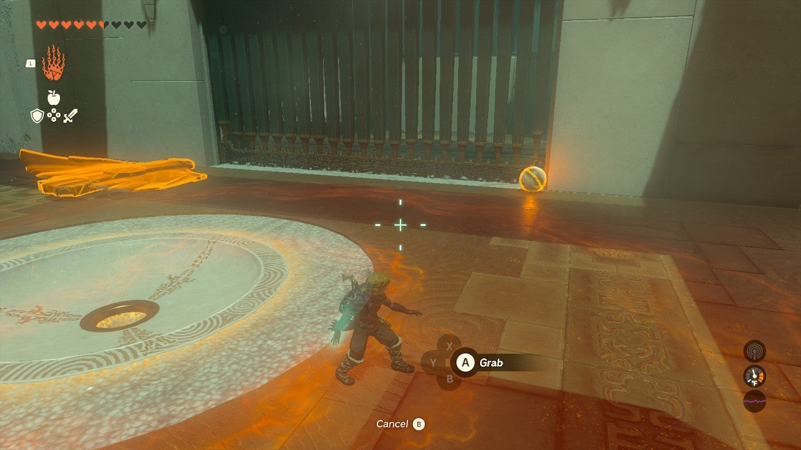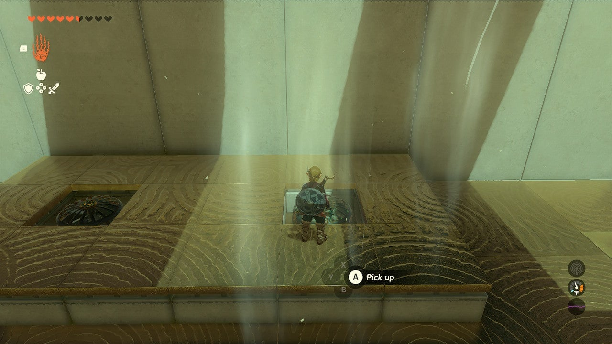

In the next room, use your paraglider to travel up the ledge using the fans. Note that you can pick up and move these fans with Ultrahand! 

Do so and pull one to the left side to a ledge where you’ll see the shrine’s lone chest. 

## Treasure Chest Location

Up on a ledge to the left in the final room is a treasure chest,. Put a fan below the ledge with the treasure chest and activate it with a weapon smack. Hop over it and activate your paraglidfer to reach the chest and the Strong Zonaite Spear inside. 

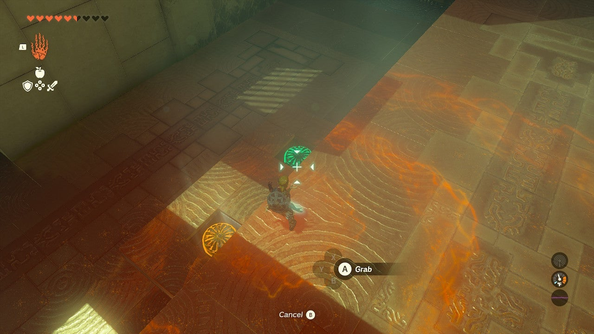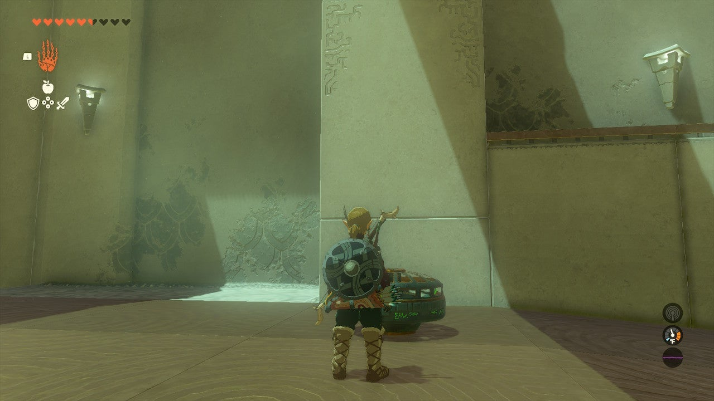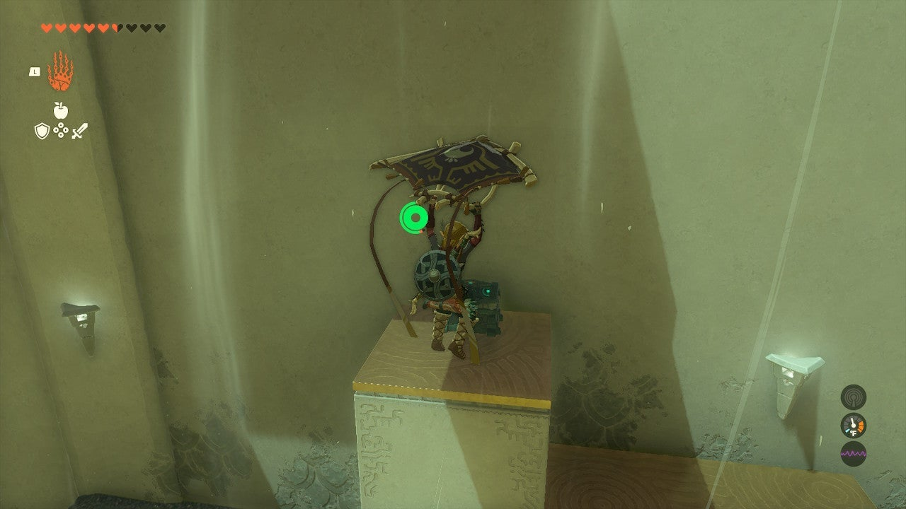

Now, to get across the final gap to the shrine exit, you’ll need more than just a Wing glider: You’ll need a powered plane. 

Grab at least two of the fans from the ledge below with Ultrahand, deactivate them, and attach them to the rear of a Wing. There’s a Wing in the corner and a few that drop every minute or so onto the tracks. 

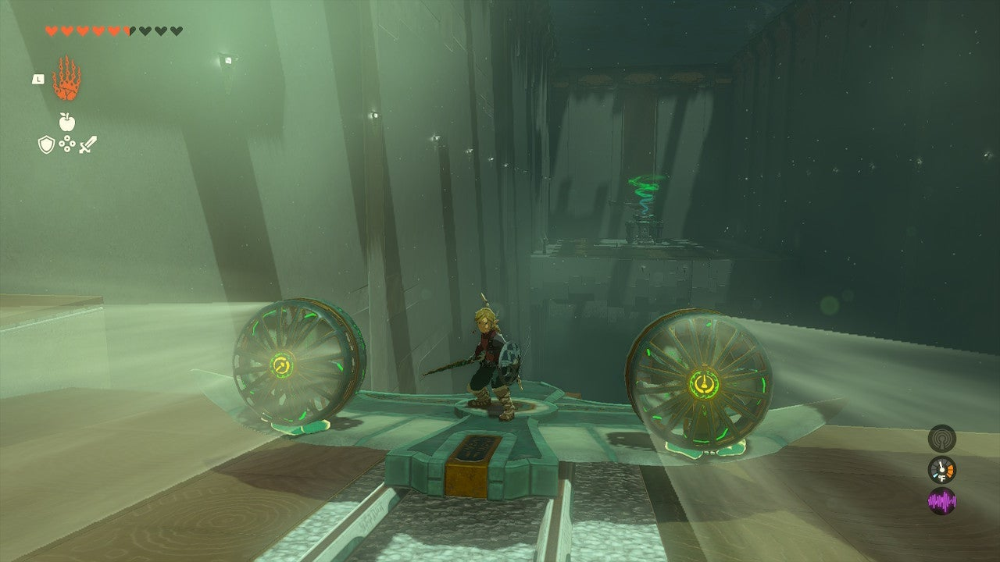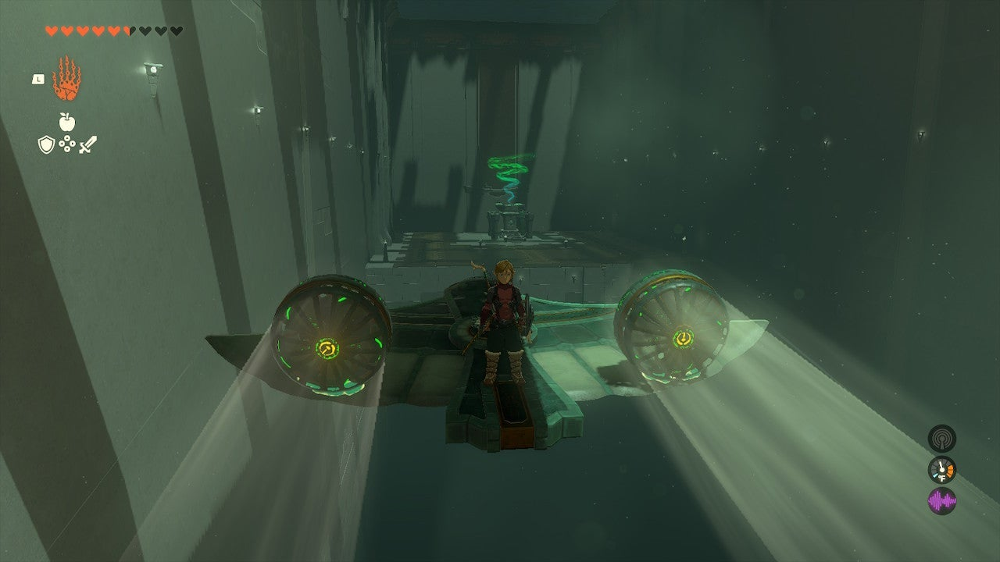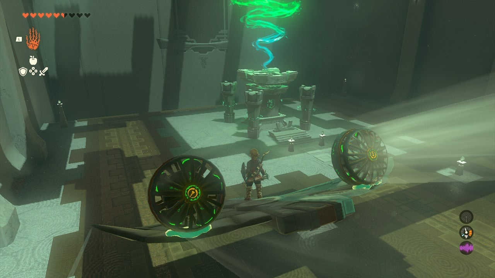

Place your Fan-upgraded Wing on the track and hop on. Activate the Fans with a weapon. You will glide easily to the exit on Fan power. 

Apogek Shrine

Congrats on solving the shrine and earning a Light of Blessing! Click or tap here to return to the rest of the Shrine Guides. You can also check out which shrines are nearby with our shrine map filter on our complete map of Hyrule.

### Up Next: Walkthrough

Previous

About IGN's Zelda TotK Guide Writers

Next

Walkthrough

### Top Guide Sections

  * Walkthrough
  * Zelda: Tears of The Kingdom Switch 2 Edition Guide
  * Zelda Notes Voice Memories
  * List of Side Quests and Side Adventures

### Was this guide helpful?

Leave feedback

Go to comments