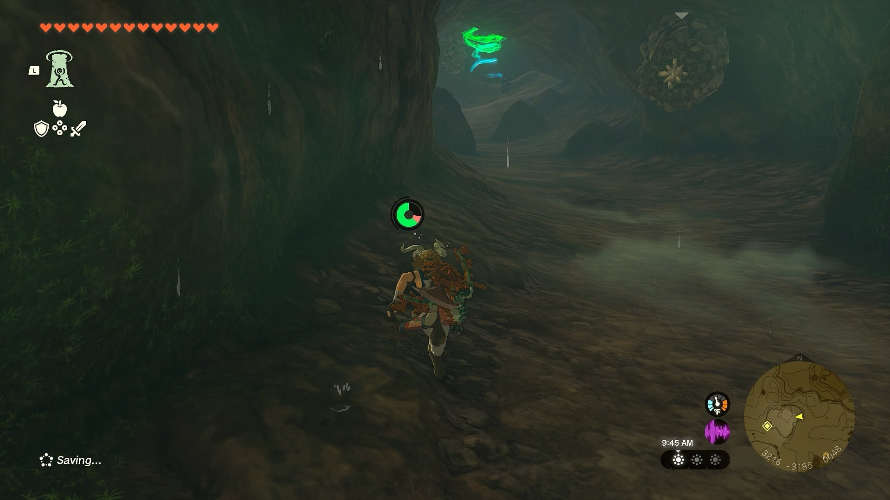
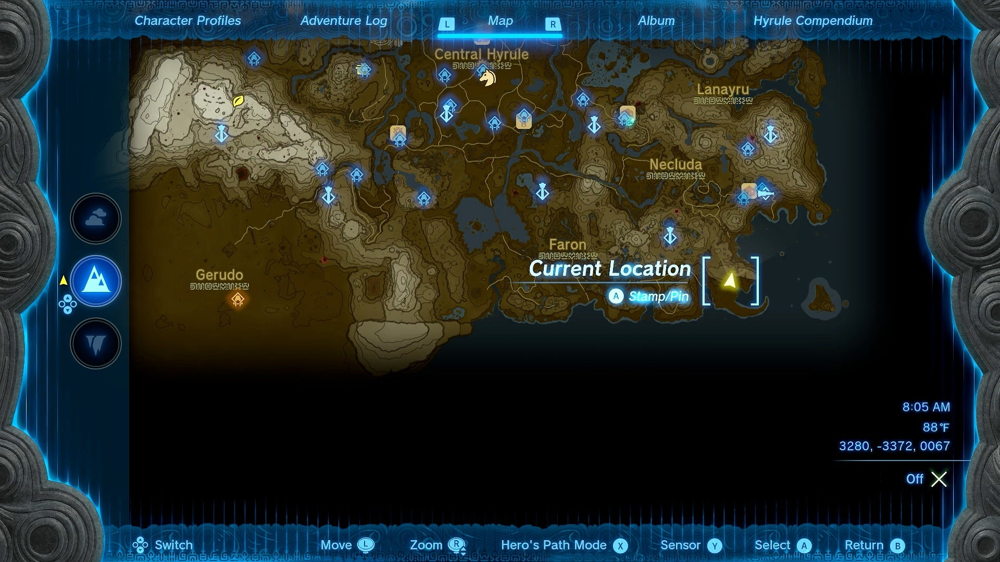
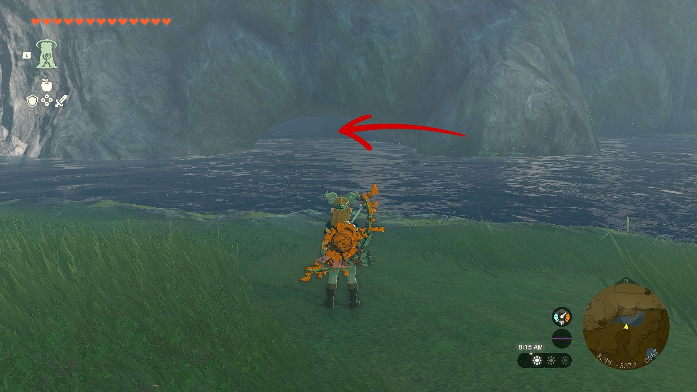
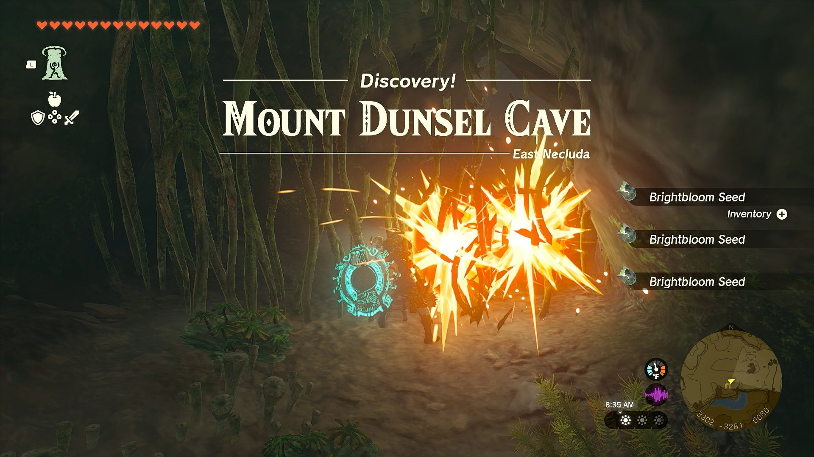
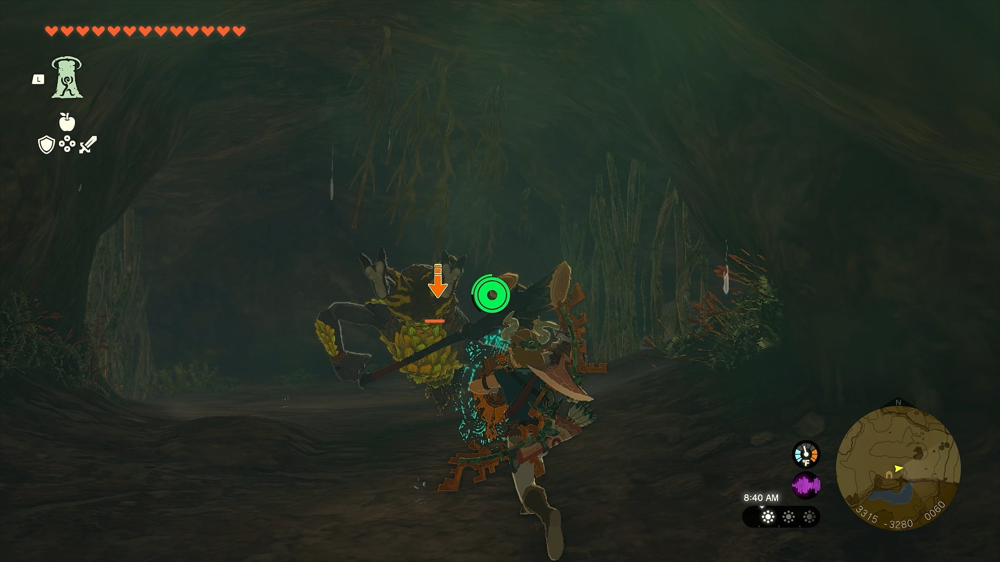
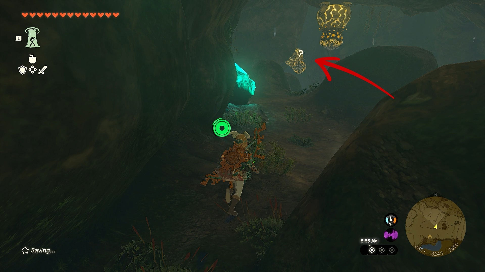
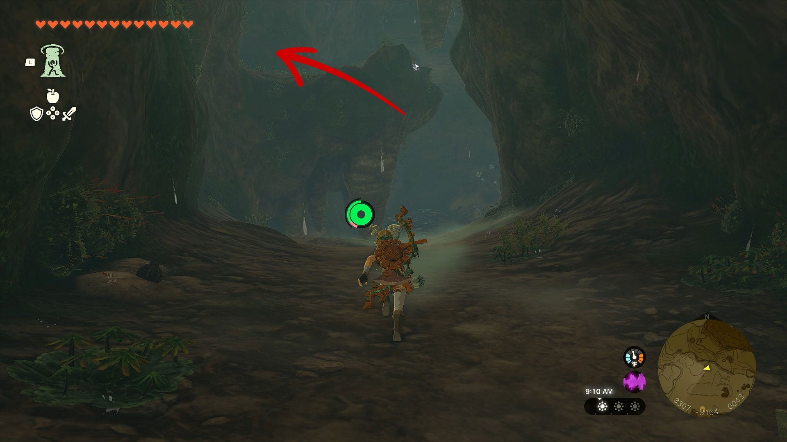
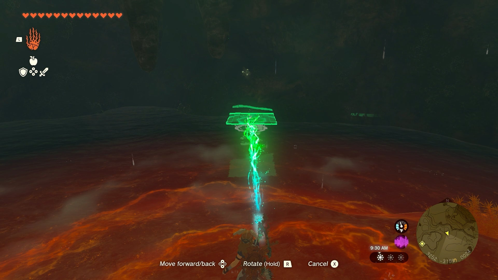
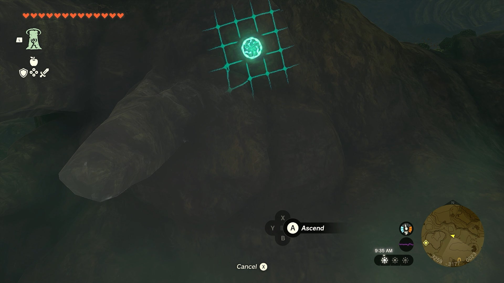
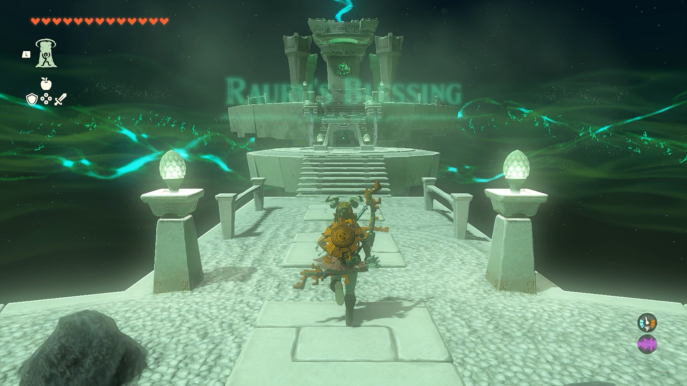

Bamitok Shrine (**Rauru’s Blessing**) in Zelda: Tears of the Kingdom is a shrine hidden in a Mount Dunsel cave in the East Necluda region and one of 152 shrines in TOTK (see all shrine locations). This page contains a guide for how to locate and enter the shrine TotK Bamitok shrine. 

### Bamitok Shrine Treasure and Rewards

  * Big Battery

## Bamitok Shrine Location

This shrine is located in the Mount Dunsel Cave. The cave entrance is to the east of Lurelin Village, southeast of Mount Dunsel, and directly north from Gama Cove. There will be a small pool of water in the entryway of the cave. 

  * Coordinates: 3093, -3209, 0082

## Mount Dunsel Cave

Bamitok Shrine is a Rauru’s Blessing shrine which means the puzzle/challenge is to locate the shrine itself. Once inside the shrine, there is no puzzle, just your rewards. 

Enter the Mount Dunsel Cave entrance by jumping into the water and swimming through the opening. 

Once you step onto solid ground, slash through the vines blocking the cave and fight the Horriblin. 

There are two more vines you can slash through. The one on the right contains a chest, so grab that first, then slash through the vines on the left to continue through the cave. 

Continue down the left path and there will be two Shock Likes hanging from the ceiling. You can choose to run past them or fight them and both will drop chests with random loot. 

Once you make your way past the Shock Likes, you’ll find an area with a higher ledge above you and a small pool of water underneath it. 

Next to the water, there’ll be a wooden pallet and a Stalkoblin waiting for you. Defeat the Stalkoblin and use Ultrahand to move the pallet underneath the upper ledge of the cavern. Swim to the pallet and use Ascend to get to the top of the ledge. 

There’ll be a treasure chest on the ledge. Turn to the tunnel and you’ll come across two Rock Likes hanging from the ceiling. Again, you can fight these for more loot or you can run past them straight up a small incline to the Bamitok Shrine. 

Once you activate the shrine and step inside, you’ll be rewarded a treasure chest with a Big Battery. 

Bamitok Shrine

Congrats on solving the shrine and earning a Light of Blessing! Click or tap here to return to the rest of the Shrine Guides. You can also check out which shrines are nearby with our shrine map filter on our complete map of Hyrule.

### Up Next: Walkthrough

Previous

About IGN's Zelda TotK Guide Writers

Next

Walkthrough

### Top Guide Sections

  * Walkthrough
  * Zelda: Tears of The Kingdom Switch 2 Edition Guide
  * Zelda Notes Voice Memories
  * List of Side Quests and Side Adventures

### Was this guide helpful?

Leave feedback

Go to comments