**Chichim Shrine** (Rauru’s Blessing) in Zelda: Tears of the Kingdom is located in the Ancient Prison Ruins in the Gerudo Desert region. As a shrine at the end of a sinkhole dungeon, it can be tricky to navigate not only the sands, but also the statues that are designed to help you on your way. Learn how to get to this reward of a shrine with the help of this complete walkthrough. 

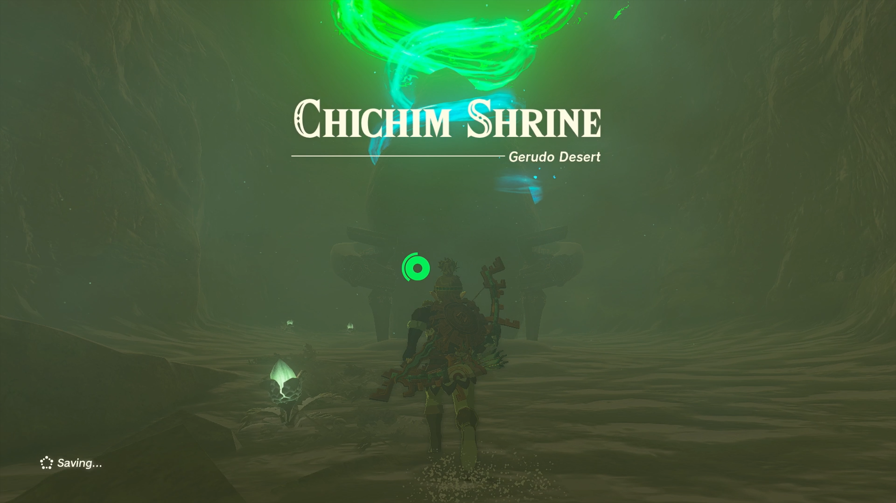

### Chichim Treasure and Rewards

  * Zonaite Spear

## Chichim Location/How to Reach

Chichim Shrine is located in the Ancient Prison Ruins in the Gerudo Desert, southwest of Gerudo Canyon Skyview Tower. Head to the sinkhole in Palu Wasteland to discover the Ancient Prison Ruins. 

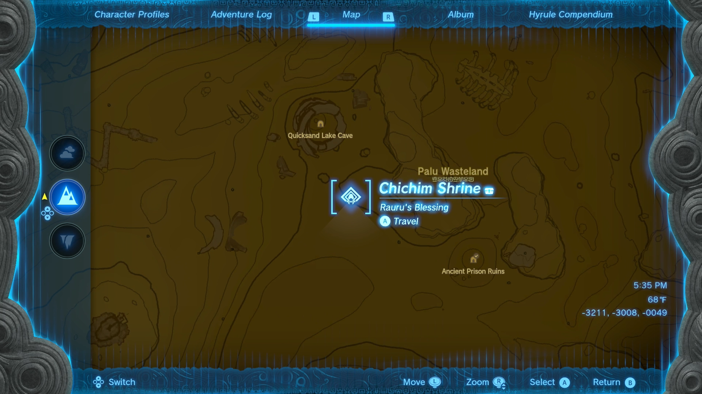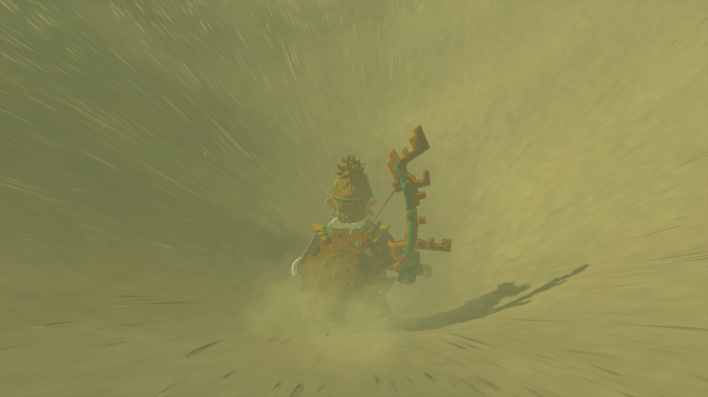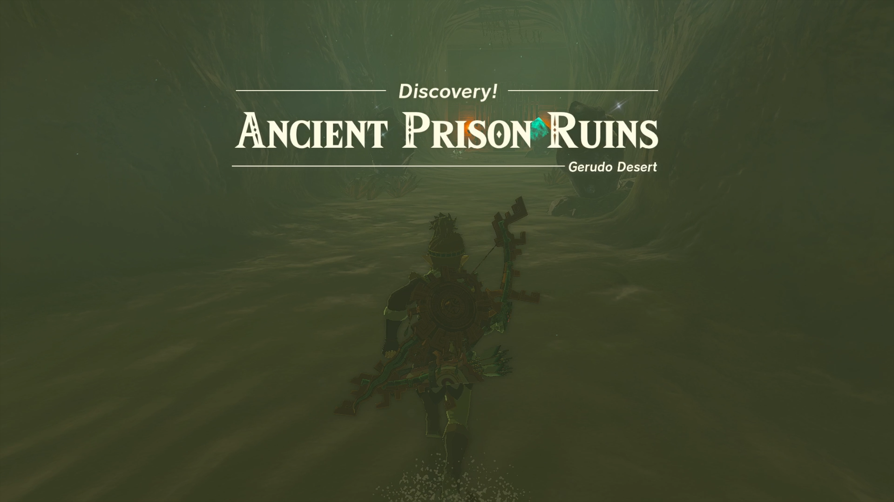

Head straight to the closed gate. use Ultrahand to move the handle to the left to open the gate. 

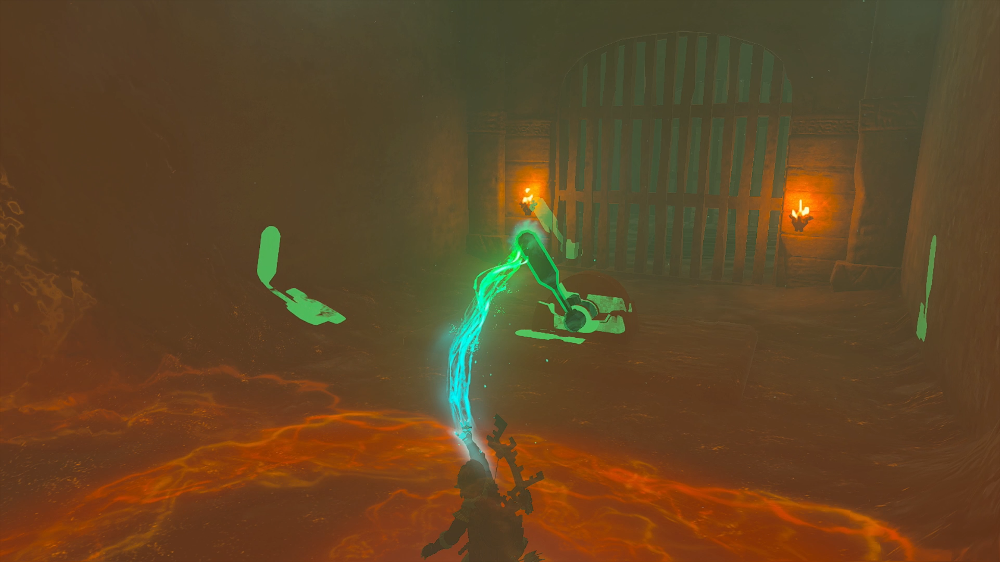

Enter the ruins and **turn left**. At the end of the hallway **turn right** where you’ll see two flames and a statue holding a sword pointing right. You can avoid all enemies. 

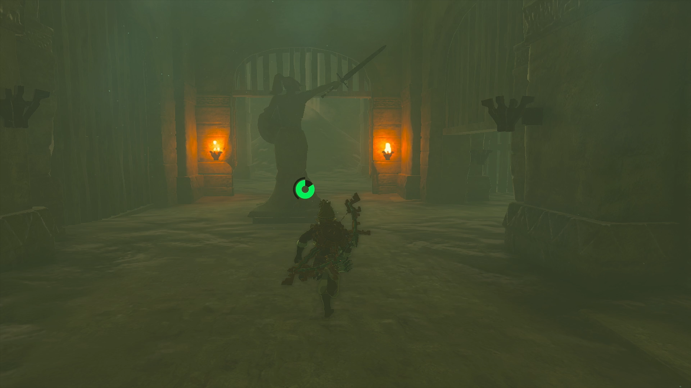

Run to the end of the hallway where the statue is located and **turn right**. The gate will drop down slightly as you pass through. 

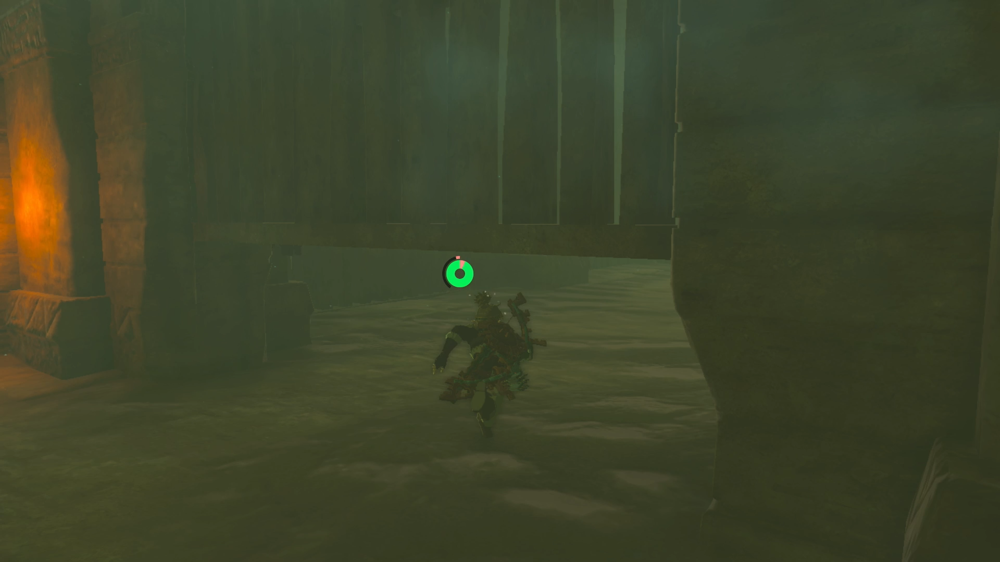

At the end of this hallway, you’ll find another closed gate. Use Ultrahand to move the handle to the left to open the left and right gates. **Enter the right gate** and jump down. 

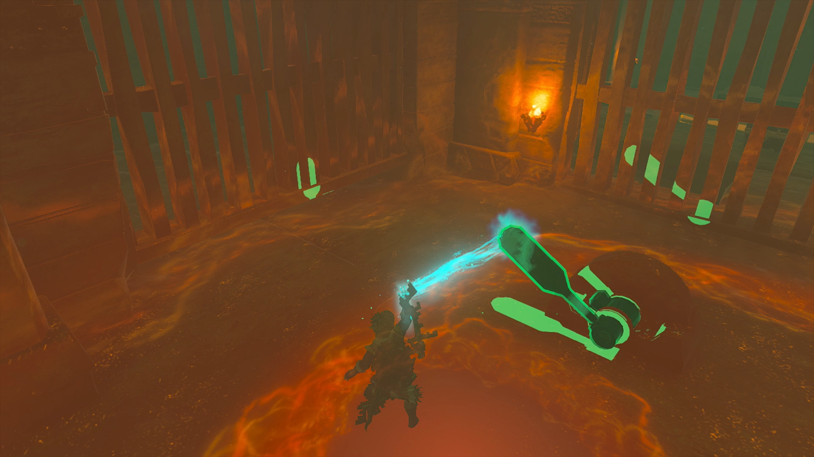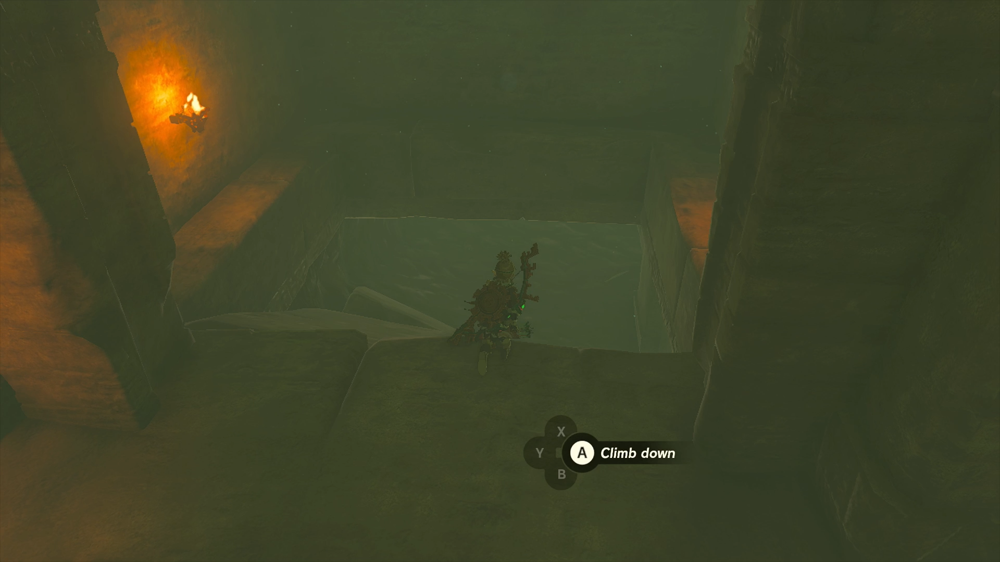

**Crouch** through the opening on the right. **Head to the rubble** past the gates and **turn right**. 

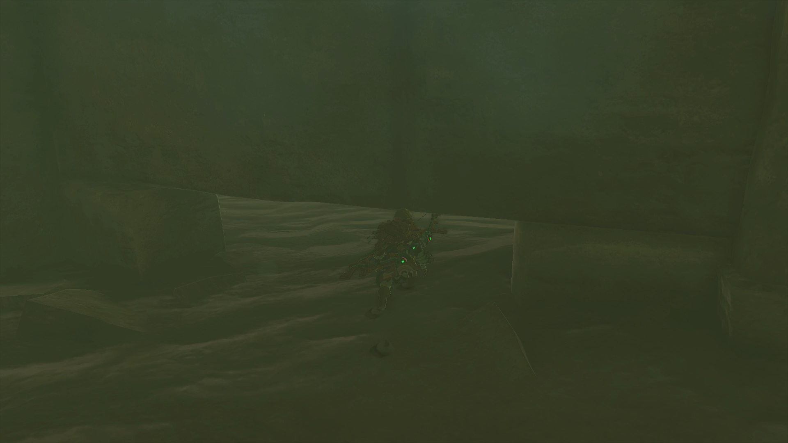

Run past enemies to the rubble in the **back right corner** of the room. **Climb** up the debris. You’ll see another two flames at the end of the hallway. 

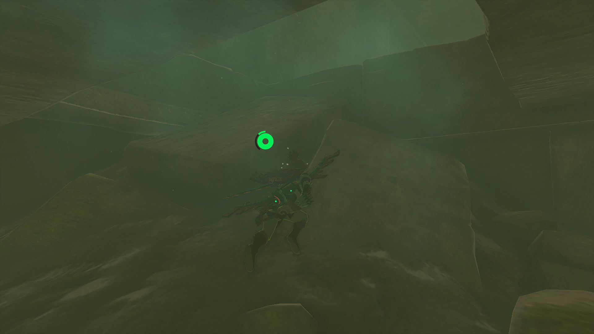

**Step on the platforms** and they will fall. **Jump down** the hole to find a Bubbulfrog. Shoot the Bubbulfrog and it will drop a Bubbul gem. 

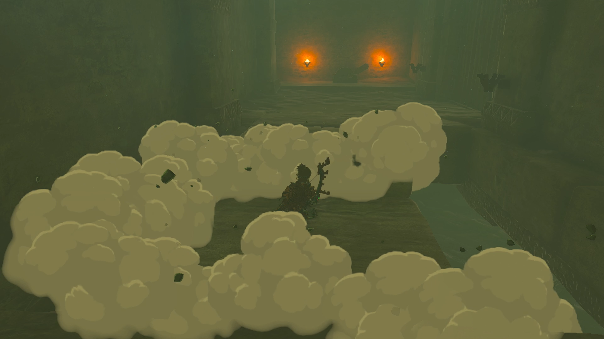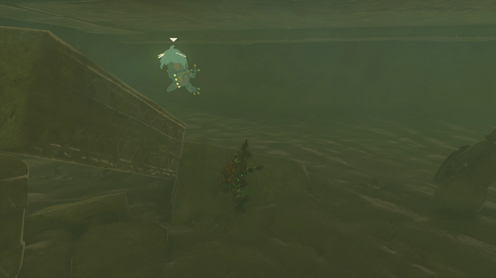

Pan the room to find another set of flames and a closed gate. Another statue holding a sword will point you in that direction. 

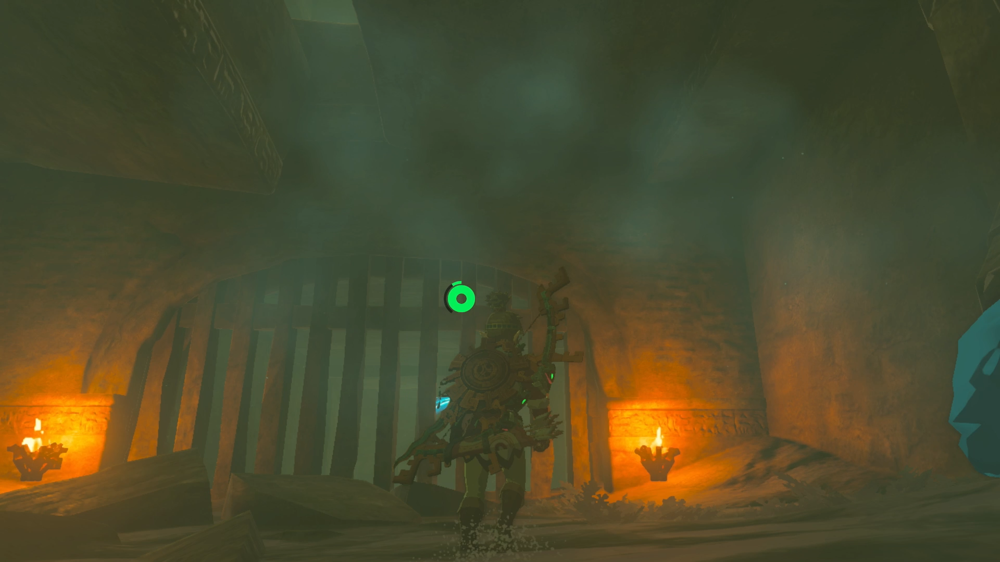

When you reach the **end of the hallway** , use Ascend to jump up to the level above you. You’ll land in a room with a treasure chest with a Gerudo Scimitar inside. 

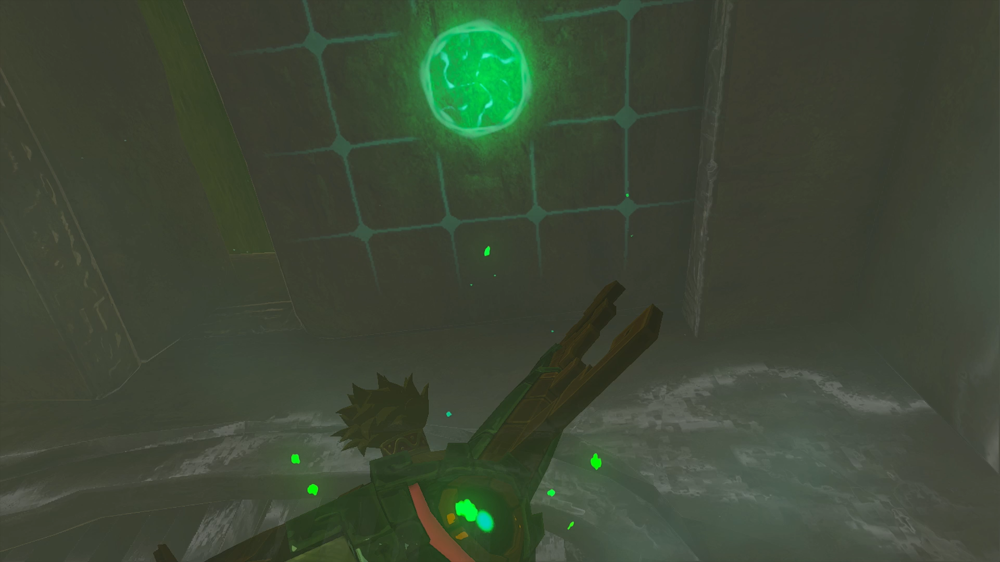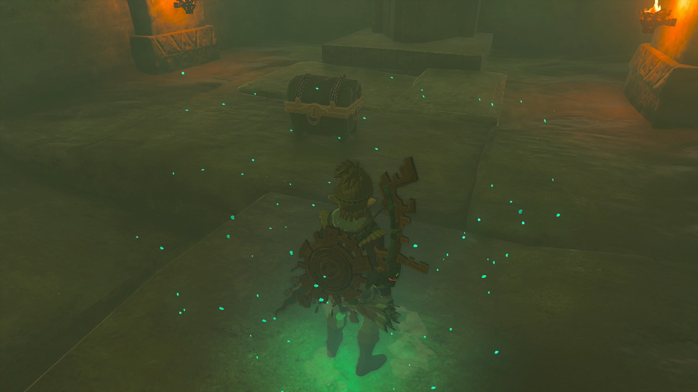

Use Ultrahand to **move the two slabs** out of the way to reveal another lever. **Move the handle** with Ultrahand to open the door in front of you to access the Chichim shrine. 

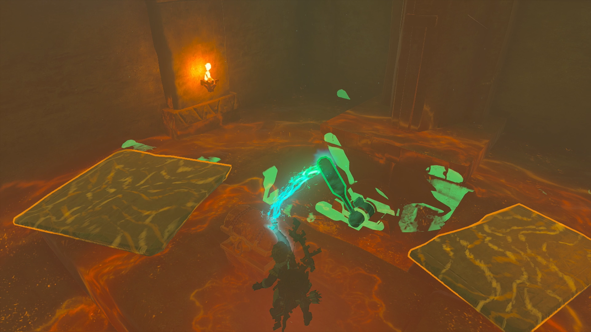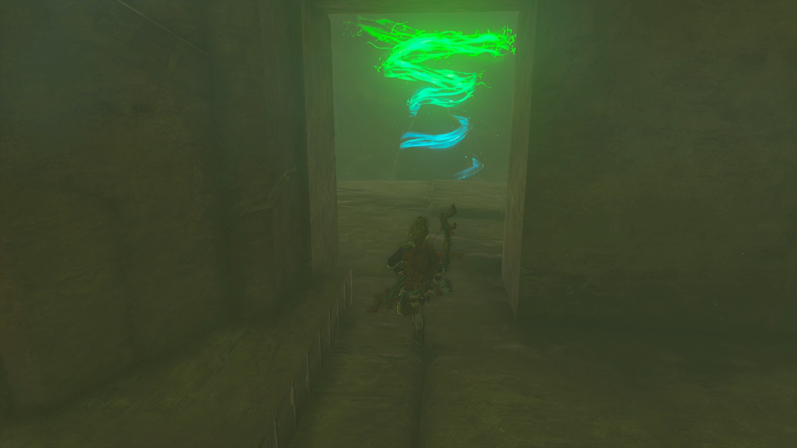

  * Coordinates: -3211, -3005, -0049

## Chichim Walkthrough and Puzzle Solutions

Enter the shrine and you will be rewarded with Rauru’s Blessing. Head straight up the stairs to open the treasure chest with a Zonaite Spear inside. 

Continue up the next set of stairs to exit the shrine. 

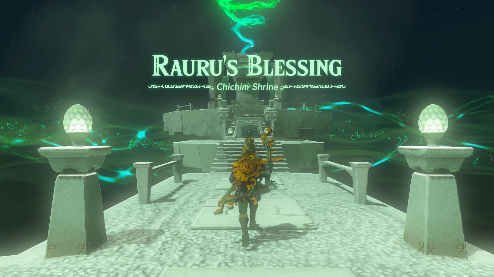

Chichim Shrine

Congrats on solving the shrine and earning a Light of Blessing! Click or tap here to return to the rest of the Shrine Guides. You can also check out which shrines are nearby with our shrine map filter on our complete map of Hyrule.

### Up Next: Walkthrough

Previous

About IGN's Zelda TotK Guide Writers

Next

Walkthrough

### Top Guide Sections

  * Walkthrough
  * Zelda: Tears of The Kingdom Switch 2 Edition Guide
  * Zelda Notes Voice Memories
  * List of Side Quests and Side Adventures

### Was this guide helpful?

Leave feedback

Go to comments