The Domizuin Shrine (**A Prone Pathway**) in Zelda: Tears of the Kingdom is located in the **Akkala Highlands** and one of 152 shrines in TOTK (see all shrine locations). This contains a guide for how to locate and enter the shrine, a walkthrough for the shrine itself, and puzzle solutions as well as treasure chest locations for the TotK Domizuin shrine. 

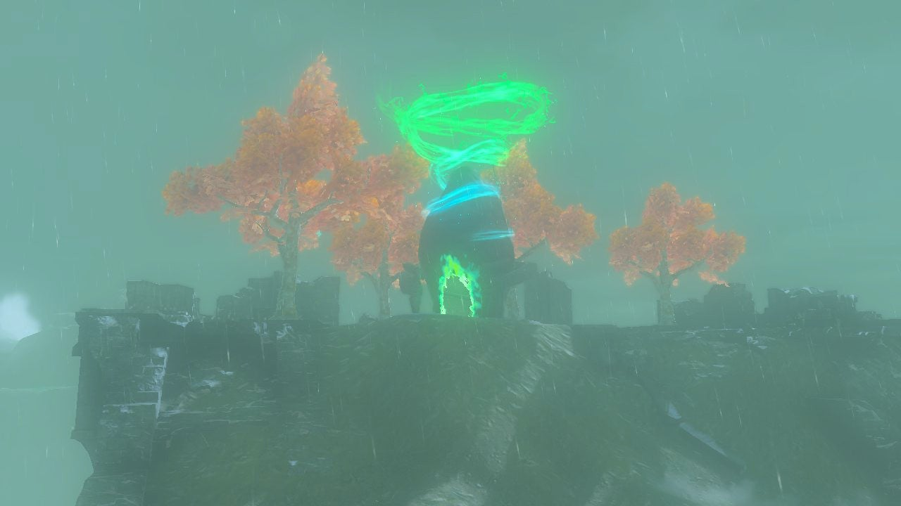

## Domizuin Shrine Treasure and Rewards

There are **THREE chests** in Domizuin Shrine, a rarity! 

  * Zonai Charge
  * Arrows
  * Strong Zonaite Shield

## Domizuin Shrine Location/How to Reach

Domizuin shrine overlooks the South Akkala Plains chasm entrance from the Akkala Citadel Ruin, just north of the pit. The shrine is southeast of the South Akkala Stable and southwest of the Ulri Mountain Skyview Tower. 

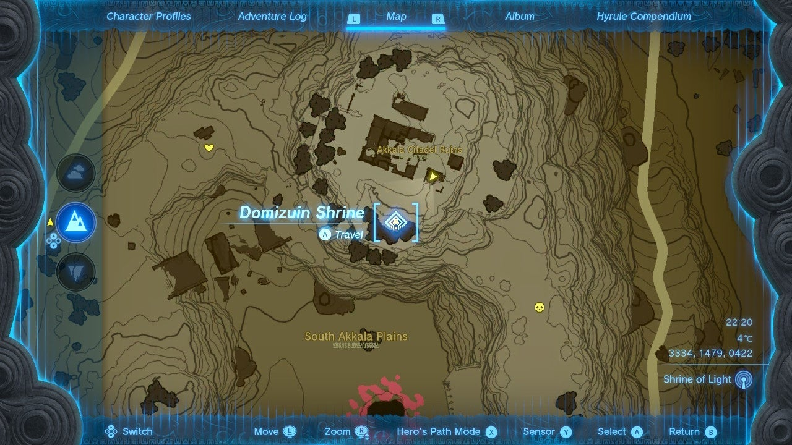

  * Coordinates: 3305, 1443, 0426

## Domizuin Walkthrough and Puzzle Solutions

Upon entering the shrine you'll find yourself in one large room with a floating, tall tower before you. Stand below it and use Ascend to get to the top. 

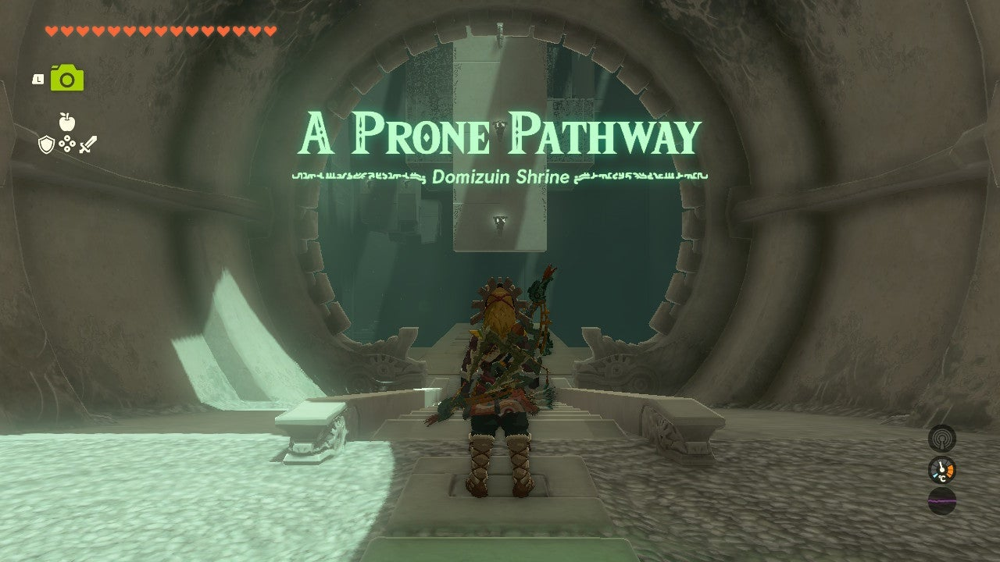

Now you're at the real puzzle. Before you is a massive metal cube with one directional switch on the platform. To the left of the cube is the shrine's first treasure chest. 

This is **a fast solution** for getting all three Domizuin treasure chests but you will need to follow the instructions completely as written below from the shrine's original state. You can reset the puzzle by leaving the shrine. 

### How to Get the First and Second Domizuin Shrine Treasure Chest

Here's how to get the the treasure chest, starting from the cube's original position: 

  * Hit the switch once to open a path into the cube by it **turning left once**.

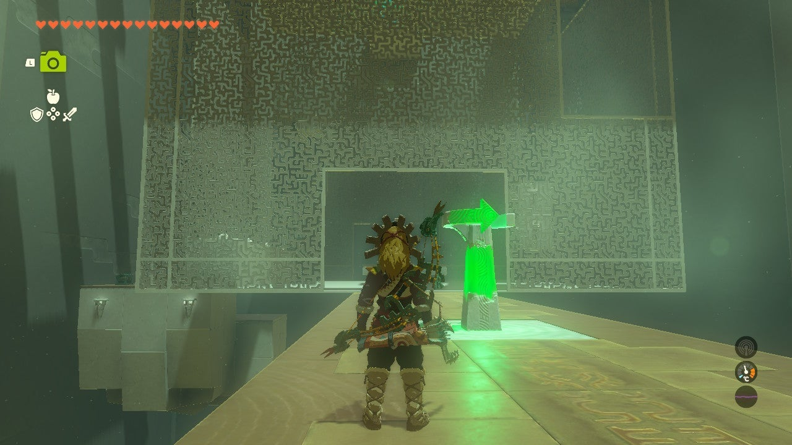

  * Enter the cube
  * Turn around and **shoot the switch outside of the cube with an arrow** to rotate it left once more. You need to be inside the cube!

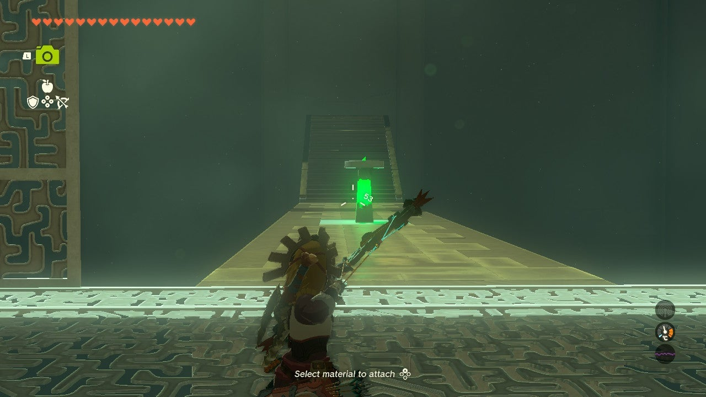

  * Walk through the open path to the treasure chest and collect the Zonai Charge.

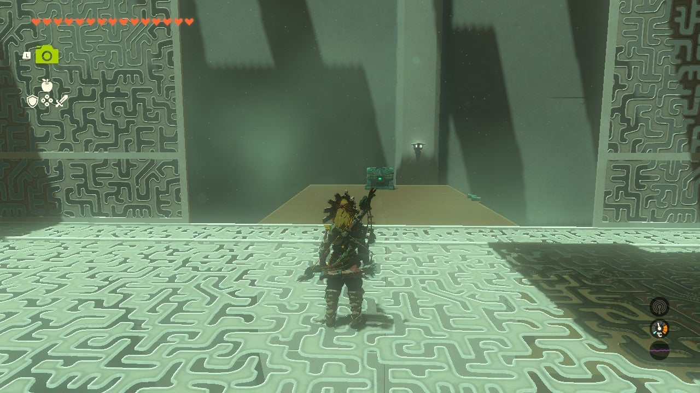

**Do not rotate the cube. Let's get the second chest.**

  * Return to the cube and walk under the shorter **tower platform with the lights**. This should be sitting along the wall closest to the shrine exit, right near the open path to the first chest.

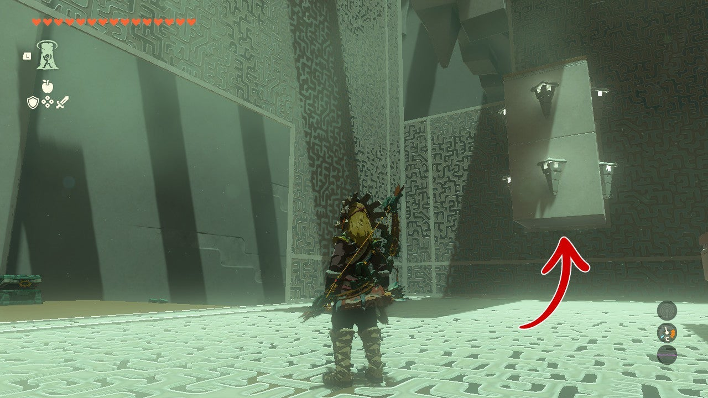

  * Ascend through the platform and claim your prize of x10 Arrows.

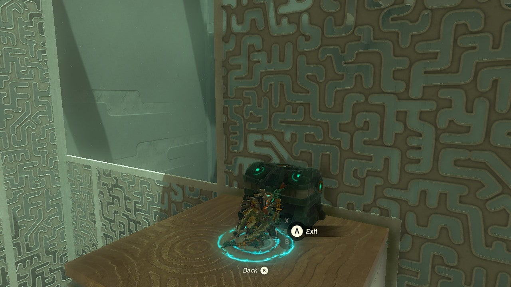

**Keep the cube here and let's get the third and final treasure chest**

###  How to Get the Third Treasure Chest

The third chest is on a wider platform that cannot be ascended through its bottom. The chest though... _can be Ascended through!_ This is a cheesy way of getting the treasure, but it's **also faster**. 

So long as you have the cube in the first instructed position (outside switch hit once, outside switch hit again from inside the cube) you can do this. 

  * Simply **hit the internal cube switch to twice** to shift the cube counterclockwise twice.
  * **Stand beneath the chest and use Ascend**. It's a little finicky, but you can do it.

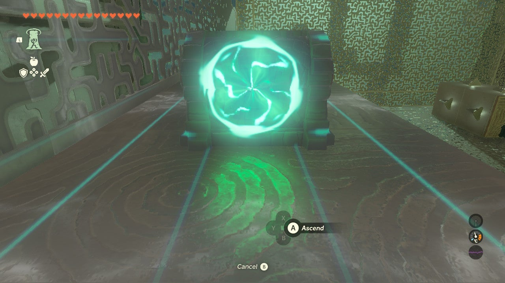

  * Stand on the**right or left edge of the chest** and you can open it for a Zonaite Shield. You'll need to be almost sliding off, but it works! Again, a little finicky. You'll also need to make space for the shield while on the ground if you want it.

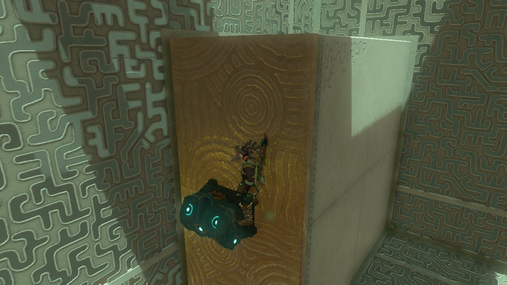

Now let's get outta here! 

Hit the internal switch **once more**. Stand below the tall tower in the corner near the shrine entrance as shown in the screenshot below. Ascend through it and you'll be on the top of the cube. 

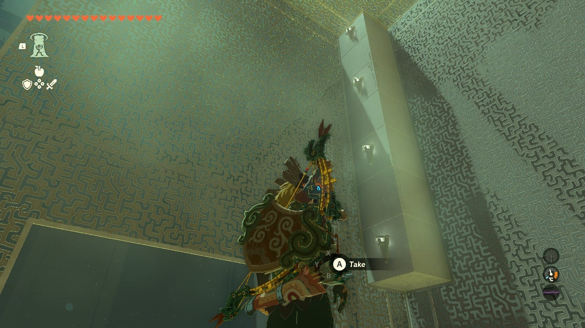

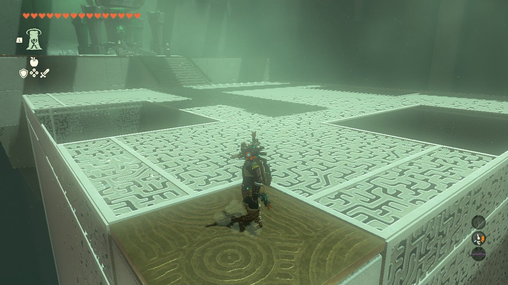

You can now exit the shrine with all your spoils and the Light of Blessing. 

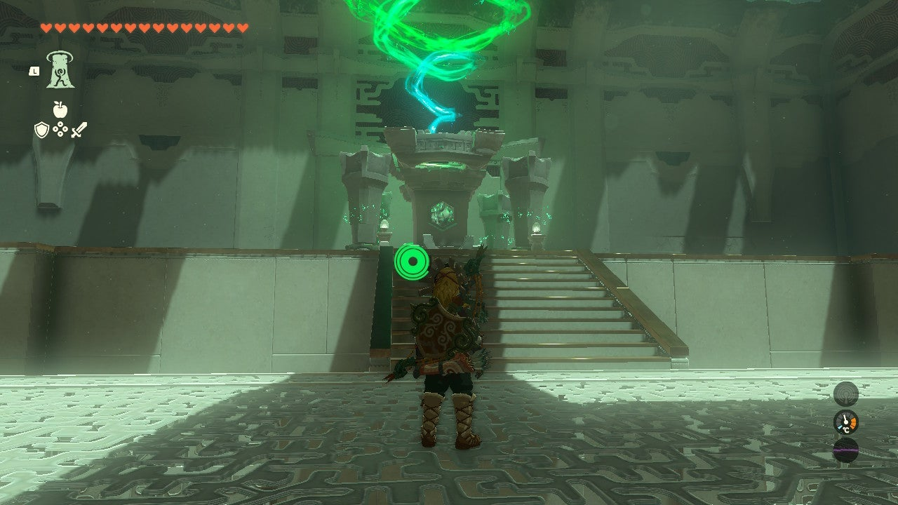

Domizuin Shrine

Congrats on solving the shrine and earning a Light of Blessing! Click or tap here to return to the rest of the Shrine Guides. You can also check out which shrines are nearby with our shrine map filter on our complete map of Hyrule.

### Up Next: Walkthrough

Previous

About IGN's Zelda TotK Guide Writers

Next

Walkthrough

### Top Guide Sections

  * Walkthrough
  * Zelda: Tears of The Kingdom Switch 2 Edition Guide
  * Zelda Notes Voice Memories
  * List of Side Quests and Side Adventures

### Was this guide helpful?

Leave feedback

Go to comments