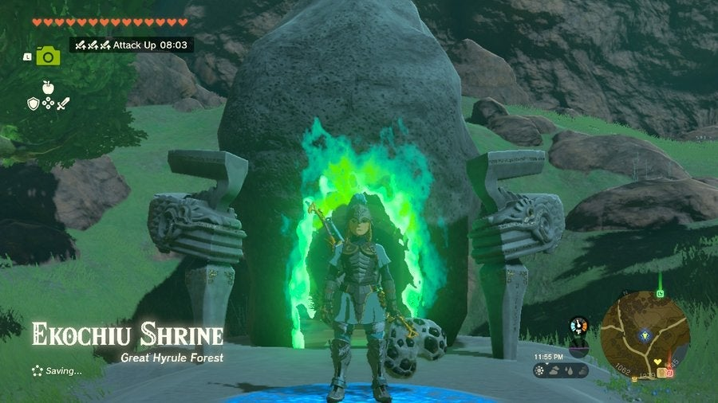
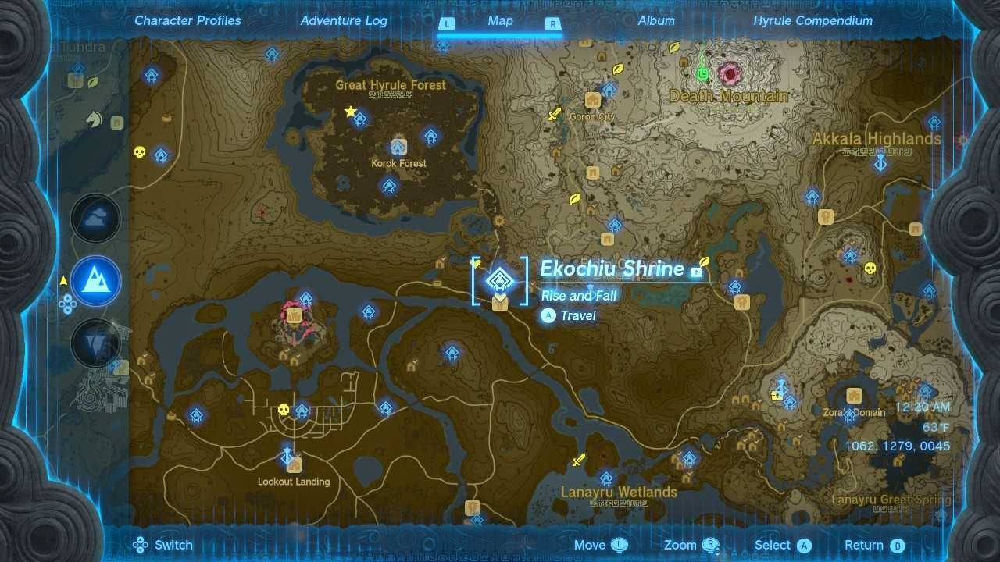

Ekochiu Shrine (Rise and Fall) in The Legend of Zelda: Tears of the Kingdom is a shrine located in the Great Hyrule Forest Region. This page contains a guide for how to locate and enter the shrine, a walkthrough for the shrine itself, and puzzle solutions as well as treasure chest locations for the TotK Ekochiu shrine. 

### Treasures and Rewards

  * **Zonaite Shield**

##  Location/How to Reach

This shrine is out in the open just south of the Great Hyrule Forest and to the west of the Eldin Canyon Skyview Tower, you will most likely encounter it while on the road to the Lost Woods between Pico Pond and Minshi Woods. 

## Walkthrough and Puzzle Solutions

The Ekochiu Shrine consists of three simple puzzles that will primarily revolve around using Recall. The first room will have a pressure plate to stand on that will activate a mechanism to push a block to the other side of the room. Simply stand on the switch, and wait for the box to complete its path and return to its starting point. Afterward stand on the block and activate recall to move you to the other side. 

The second room will have a block fall into a stream of waist deep water and begin moving towards a cliff, simply run up and climb the block and once again use recall to have it lift you towards the third and final room. 

## **Treasure Chest Location**

Before you leave though turn around and paraglide down to the left to find a chest with a Zonaite Shield inside. (Don’t worry if the block falls off the edge another will spawn on the higher ground and be pushed into the water) Afterward simply repeat the solution for this room and make your way to the last puzzle. 

After entering the final room you will see a pressure plate straight ahead and a block on a lower level to your right. Use Ultrahand to move the block into the indent of the fence directly in front of the pressure plate, you should see a small raised platform to place the block on top of. After setting the block in place, return to and activate the pressure plate by standing on it to launch the block into the air. 

After it lands climb aboard the block and activate Recall again to have it launch into the air with you standing atop it, when you reach a sufficient height jump off and paraglide to the altar to receive the Light of Blessing. 

Ekochiu Shrine

Congrats on solving the shrine and earning a Light of Blessing! Click or tap here to return to the rest of the Shrine Guides.

### Up Next: Walkthrough

Previous

About IGN's Zelda TotK Guide Writers

Next

Walkthrough

### Top Guide Sections

  * Walkthrough
  * Zelda: Tears of The Kingdom Switch 2 Edition Guide
  * Zelda Notes Voice Memories
  * List of Side Quests and Side Adventures

### Was this guide helpful?

Leave feedback

Go to comments