En-oma Shrine (Rauru's Blessing) in The Legend of Zelda: Tears of the Kingdom is a shrine located in the West Necluda Region **hidden inside the Lake Hylia Whirlpool Cave** and locked behind a shrine quest and one of 152 shrines in TOTK (see all shrine locations). This page contains a guide for how to locate and enter the shrine, a walkthrough for the shrine itself, and puzzle solutions as well as treasure chest locations for the En-oma shrine. 

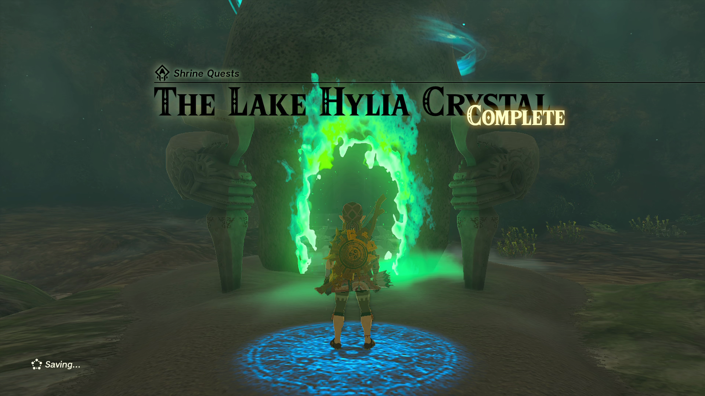

### Treasure and Rewards

  * Mighty Zonaite Sword

## En-oma Shrine Location

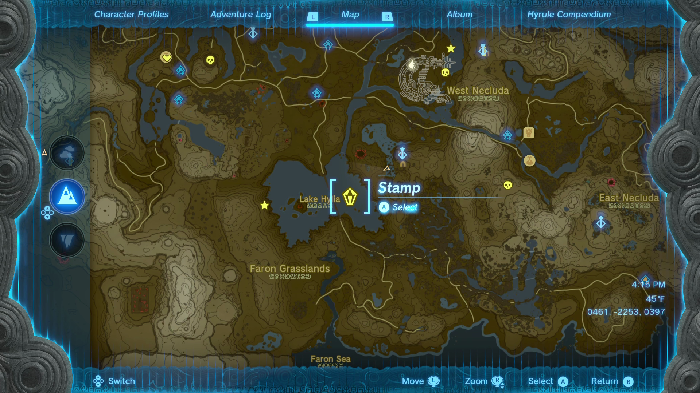

As you might’ve guessed, the Lake Hylia Whirlpool Cave is underneath the whirlpool in Lake Hylia. You just need to drop into the whirlpool from above. 

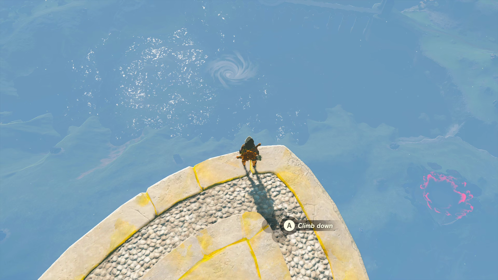

We glided over from a nearby Sky Island that’s just southwest of the **Popla Hills Skyview Tower**. 

After gliding over the whirlpool and dropping down inside, walk straight forward and touch the green hand to activate the Shrine Quest, The Lake Hylia Crystal. 

  * Coordinates: 0104, -2517, -0087

## The Lake Hylia Crystal Shrine Quest

The shrine's ray of light indicates the crystal is above you. 

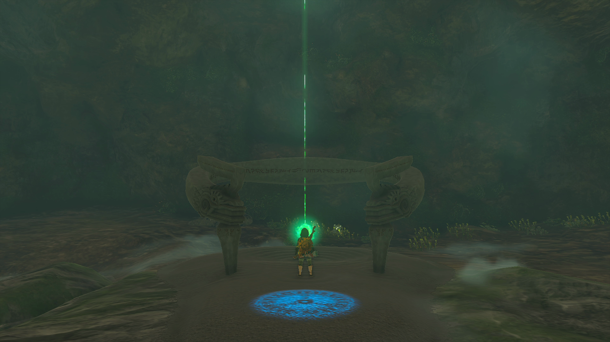

Walk to your right to reach dry land and Ascend, but don’t pop all the way out on the other side as you’ll be on the edge of the whirlpool. 

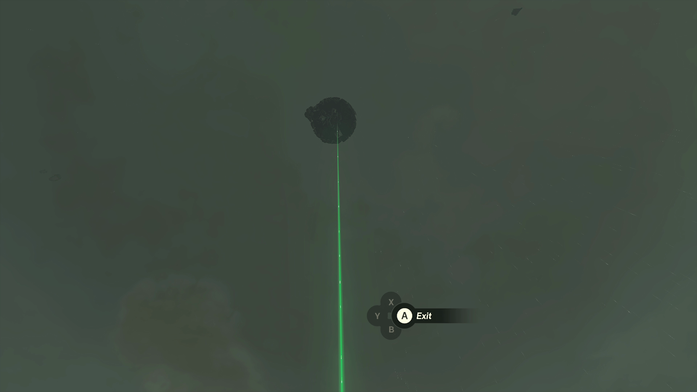

Return to the ground, open your map, and click up to the Sky Island layer so you can drop a stamp there to keep track. Now you just have to get to that Sky Island. 

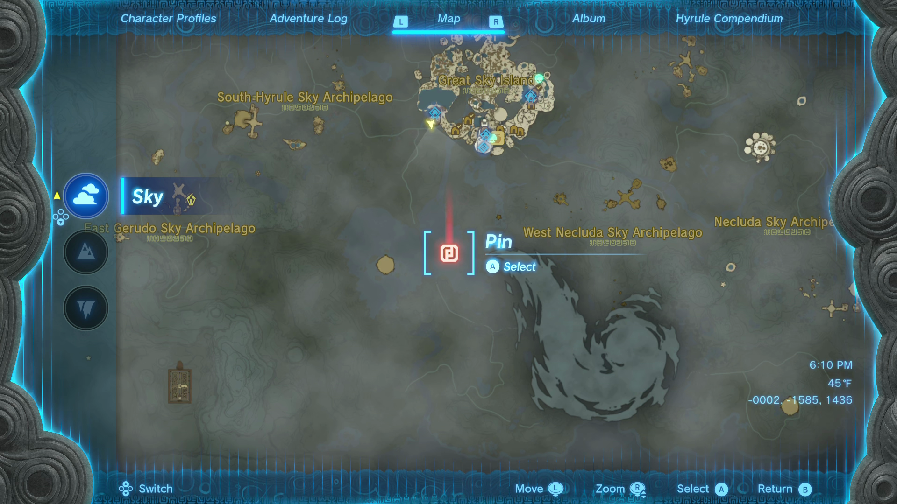

We reached this Sky Island by teleporting to the In-isa Shrine on the Great Sky Island to the north, one of the first shrines you completed after waking up. 

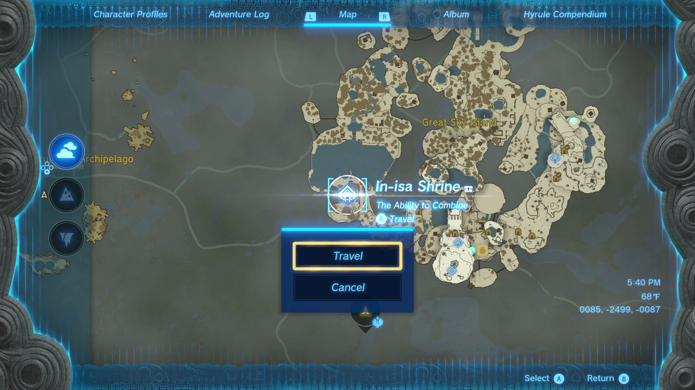

Before making the jump to head south to glide to the Sky Island we marked earlier, it’s recommended to have more than two stamina wheels, or enough elixirs or stamina boosting foods to make up the difference. If you feel confident you have enough, leap off the southern tip of the Great Sky Island (the one you’re on after teleporting to the In-isa Shrine), and glide to the Sky Island that green beam of light is pointing to. 

Once you land, make sure you avoid the hole in the middle right before the green crystal, or you’ll fall down and have to do this over again. 

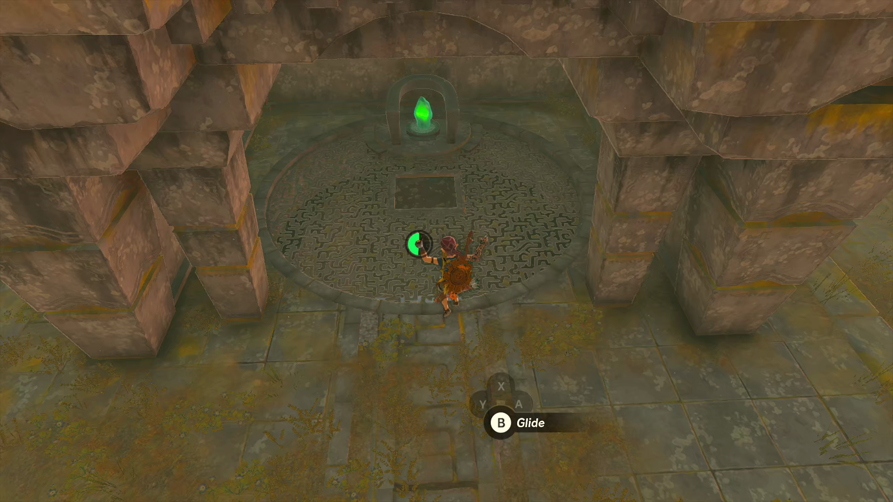

Pick up the green crystal, and drop yourself down into the hole, all the way down through the whirlpool again. 

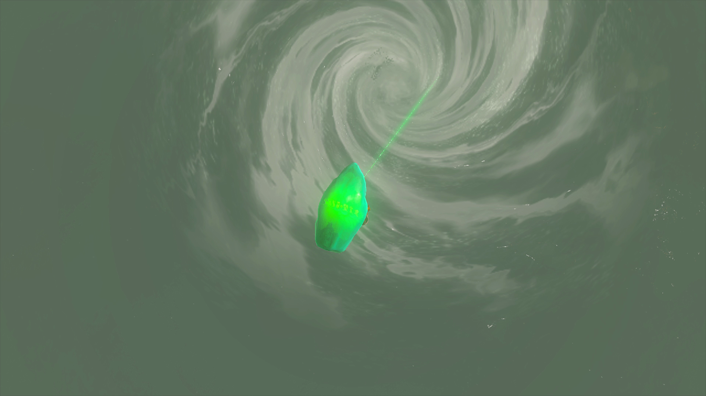

Take the green crystal to the spot where you first activated the quest, and enter the newly formed shrine. 

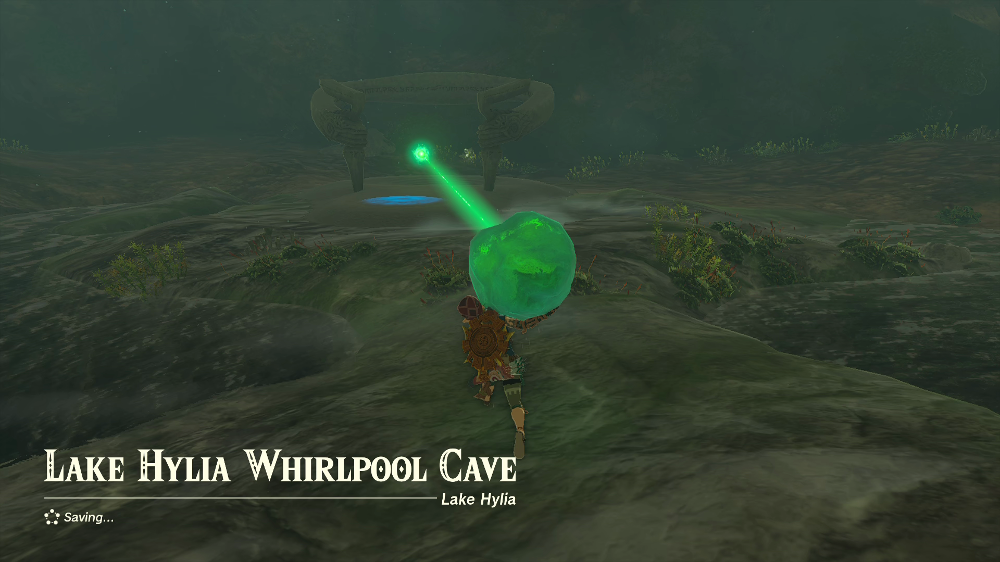

The Lake Hylia Crystal

### Inside En-oma Shrine

With the shrine quest completed, all you need to do is open the treasure chest (a Mighty Zonaite Sword) and collect your Light of Blessing. 

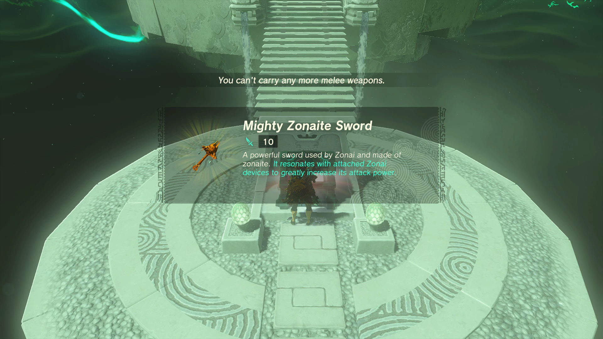

En-oma Shrine

Congrats on solving the shrine and earning a Light of Blessing! Click or tap here to return to the rest of the Shrine Guides. You can also check out which shrines are nearby with our shrine map filter on our complete map of Hyrule.

### Up Next: Walkthrough

Previous

About IGN's Zelda TotK Guide Writers

Next

Walkthrough

### Top Guide Sections

  * Walkthrough
  * Zelda: Tears of The Kingdom Switch 2 Edition Guide
  * Zelda Notes Voice Memories
  * List of Side Quests and Side Adventures

### Was this guide helpful?

Leave feedback

Go to comments